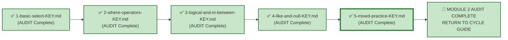

# 🗄️🤖 SQL & GenAI Course
**🎯 Quality Education for Anyone, Anywhere, Anytime — 💫 with Comfort, Convenience at no Cost**

---

## 🔑 File 5: `5-mixed-practice-KEY` (AUDIT Phase)

Welcome to the **Architect's Post‑Mortem**. The execution phase is over. Your queries are saved. Now, we step completely out of the editor and pull back the curtain to reverse-engineer the logical machinery behind **Exercise 5**.

This is the final AUDIT file for Module 2. Every concept from the ACQUIRE phase—`SELECT`, `WHERE`, `LIKE`, `NULL`, `IN`, `BETWEEN`, logical operators—is tested here within the **FinVERSE** ecosystem.

**Stop typing. Start auditing.**


Up to this point, you’ve been writing queries in a controlled environment. But out there in production, data is messy, clients are vague, and a single misplaced comma can cost millions or drop a critical compliance record.

This isn't a test of how well you can memorize syntax; it's a test of your defensive engineering mindset. Let’s see how your structural decisions hold up under audit.

## 🌌 SQLVerse Check-In

<div style="border-left: 4px solid #9c27b0; background-color: #f3e5f5; padding: 15px; margin: 20px 0; border-radius: 0 8px 8px 0;">

### The FinVERSE Master Key

In Exercise 5, you applied every concept from Modules 2–4 within a single, cohesive domain: **FinVERSE**. This answer key doesn't just evaluate your syntax—it evaluates your **business judgment**.

In production, nobody hands you a beautifully isolated prompt. You get raw business chaos, ambiguous emails from managers, and compliance deadlines. 

Anyone can look up syntax, but a true data consultant knows why they choose a specific filter or defensive constraint. This key doesn't just give you the answers—it reveals the **architectural assumptions** behind the code. Compare your code, audit your logic, and let's see if your queries are ready for the **live environment.**

🛑 **Audit Protocol:** Don't just check if your query returned the same rows. Check your design. Did you account for `NULL` values? Did you use business-friendly aliases for the executive report? Efficiency and defensiveness are what we are grading here.

</div>

---

## 📍 Your Current Stage – AUDIT Journey

```mermaid
flowchart LR
    A["✅ 1-basic-select-KEY.md<br/>(AUDIT Complete)"] --> B["✅ 2-where-operators-KEY.md<br/>(AUDIT Complete)"] --> C["✅ 3-logical-and-in-between-KEY.md<br/>(AUDIT Complete)"] --> D["✅ 4-like-and-null-KEY.md<br/>(AUDIT Complete)"] --> E
    E["📍 YOU ARE HERE<br/>⏳ 5-mixed-practice-KEY.md"] --> F
    F["✅ AUDIT COMPLETE<br/>RETURN TO CYCLE GUIDE"]
    
    style A fill:#c8e6c9,stroke:#2e7d32,stroke-width:2px
    style B fill:#c8e6c9,stroke:#2e7d32,stroke-width:2px
    style C fill:#c8e6c9,stroke:#2e7d32,stroke-width:2px
    style D fill:#c8e6c9,stroke:#2e7d32,stroke-width:2px
    style E fill:#fff8e1,stroke:#ff9800,stroke-width:4px
    style F fill:#c8e6c9,stroke:#2e7d32,stroke-width:2px
```



---

## 🧪 Validation Protocol

Before you consult this AUDIT file:
- [ ] Have you completed all Business Requests in APPLY File 5?
- [ ] Have you saved your queries in your Vault?
- [ ] Have you tested each query and verified the results?

> 🔁 **Audit Rule:** The solutions below are a reference, not a shortcut. Compare your reasoning, not just your code.

---

# 💎 Phase 1: The Semantic Excavation (Requirement → Gemstone)

Let's dissect the client tickets you resolved across FinVERSE, exposing the structural geometry buried inside the business prose.

---

## ⚖️ Core Theme: Mixed Practice in a Financial Ecosystem

In Exercise 5, you applied every concept from the ACQUIRE phase within FinVERSE:

| Concept | SQL Tools | Business Translation |
|---------|-----------|----------------------|
| **Status Filtering** | `=` , `IN` | "Active", "Pending", "Completed" |
| **NULL Detection** | `IS NULL` | "Missing", "Unassigned", "Incomplete" |
| **Range Filtering** | `BETWEEN` , `>`, `<` | "Between X and Y", "Above threshold" |
| **Set Membership** | `IN` | "Any of these values" |
| **Pattern Matching** | `LIKE` | "Contains", "Starts with" |
| **Logical Operators** | `AND` , `OR` , `NOT` | "This AND that", "Either this OR that" |

These patterns are **domain-invariant**. The same SQL that works on Real Estate Planet works on FinVERSE. 

🏛️ **Architect's Law:** *The nouns change. The logic does not.*

---

## 🛒 Ticket Pair 1: Status and Risk Filtering (Product Stage)

| **🏢 Product Stage** | **🏢 Product Stage** |
|----------------------|----------------------|
| Request 1 – Customers with Incomplete KYC | Request 2 – High‑Risk Customers |

---

### 🏢 Request 1 – Customers with Incomplete KYC

#### 🪵 Business Language

> "Show me customers whose KYC status is either `Pending` or `Incomplete`."

---

#### 🧠 Business Context (3-Question Alignment)

| Perspective | Explanation |
|-------------|-------------|
| **Who is asking?** | Compliance Team |
| **Why are they asking?** | They need to prioritise follow‑up for customers with incomplete verification. |
| **What decision will they make?** | Decide customers to be contacted for KYC completion to meet regulatory deadlines. |

---

#### 💎 Gemstone Extraction

**Pattern Identified:** Status Membership Filtering

The business wants to isolate customers with specific status values.

---

#### 🧭 Technical Translation

```sql
SELECT customer_id, first_name, last_name, email, phone, kyc_status
FROM customers
WHERE kyc_status IN ('Pending', 'Incomplete');
```

---

#### ⚙️ The Choice Pattern

**Why this solution?** The business supplied multiple acceptable KYC states. `IN` models membership directly and scales better than repeating multiple `OR` conditions.

---

### 🏢 Request 2 – High‑Risk Customers

#### 🪵 Business Language

> "Show me customers with a `High` risk score."

---

#### 🧠 Business Context (3-Question Alignment)

| Perspective | Explanation |
|-------------|-------------|
| **Who is asking?** | Risk Team |
| **Why are they asking?** | They want to monitor high‑risk customers for potential fraud or default. |
| **What decision will they make?** | Decide accounts to flag for enhanced monitoring. |

---

#### 💎 Gemstone Extraction

**Pattern Identified:** Exact Match Filtering

The business wants to isolate customers with a specific risk profile.

---

#### 🧭 Technical Translation

```sql
SELECT customer_id, first_name, last_name, risk_score, kyc_status, status
FROM customers
WHERE risk_score = 'High';
```

---

#### ⚙️ The Choice Pattern

**Why this solution?** The Risk Team needs a precise filter for a single risk level. `=` is the clearest way to isolate `High` risk customers. The learner must also decide which columns provide a complete risk profile – `customer_id`, `first_name`, `last_name`, `risk_score`, `kyc_status`, and `status` give the Risk Team everything they need for review.

---

### 🪞 Pattern Reflection

| Request 1 | Request 2 | Same SQL Pattern |
|-----------|-----------|------------------|
| `kyc_status IN ('Pending', 'Incomplete')` | `risk_score = 'High'` | Status/value filtering |

**Architect's Observation:** Both requests filter on a status field. The pattern is identical – the column and values change.

---

## 🛒 Ticket Pair 2: NULL Detection in Operations (Consulting Stage)

| **🎭 Consulting Stage** | **🎭 Consulting Stage** |
|-------------------------|-------------------------|
| Challenge 3 – The Ghost Accounts | Challenge 7 – Escalation Bottleneck |

---

### 🎭 Challenge 3 – The Ghost Accounts

#### 🪵 Business Language

> "Show me active or dormant customers with missing contact details."

---

#### 🧠 Business Context (3-Question Alignment)

| Perspective | Explanation |
|-------------|-------------|
| **Who is asking?** | Risk Team |
| **Why are they asking?** | They are auditing KYC compliance and need to flag customers with incomplete contact records. |
| **What decision will they make?** | Identifying accounts to freeze before they are used for unauthorized activity. |

---

#### 💎 Gemstone Extraction

**Pattern Identified:** Combined NULL Detection with Status Filtering

The business wants to find customers with missing contact information who are still active or dormant.

> ⚠️ **The Golden Rule of NULL:**
> Never compare `NULL` using `=`. Always use `IS NULL` or `IS NOT NULL`.

---

#### 🧭 Technical Translation

```sql
SELECT customer_id, first_name, last_name, email, phone, status
FROM customers
WHERE status IN ('Active', 'Dormant')
  AND email IS NULL
  AND phone IS NULL;
```

---

#### ⚙️ The Choice Pattern

**Why this solution?** The request asks for customers with missing contact details and specific statuses. `IN` handles the multiple status values cleanly, while `IS NULL` correctly identifies missing data. `AND` ensures **both** contact fields are absent, which matches the compliance requirement for ghost accounts.

---

### 🎭 Challenge 7 – Escalation Bottleneck

#### 🪵 Business Language

> "Show me open support tickets that haven't been assigned to an agent, sorted oldest first."

---

#### 🧠 Business Context (3-Question Alignment)

| Perspective | Explanation |
|-------------|-------------|
| **Who is asking?** | Support Director |
| **Why are they asking?** | They need to identify unassigned open tickets to escalate them before SLA breaches. |
| **What decision will they make?** | Identify the oldest unassigned tickets to manually assign to managers. |

---

#### 💎 Gemstone Extraction

**Pattern Identified:** NULL Detection with Sorting

The business wants to find unassigned tickets and prioritise them by age.

---

#### 🧭 Technical Translation

```sql
SELECT ticket_id, customer_id, ticket_type, status, created_date
FROM support_tickets
WHERE employee_id IS NULL
  AND status = 'Open'
ORDER BY created_date ASC;
```

---

#### ⚙️ The Choice Pattern

**Why this solution?** The Support Director needs open, unassigned tickets sorted by age. `IS NULL` correctly identifies tickets without an assigned agent, `ORDER BY created_date ASC` surfaces the oldest first, and the selected columns provide a complete dashboard view for escalation.

> 🏛️ **Architect's Insight:**
> Sorting transforms data into an operational work queue. That is exactly why `ORDER BY` matters.


---

### 🪞 Pattern Reflection

| Challenge 3 | Challenge 7 | Same SQL Pattern |
|-------------|-------------|------------------|
| `email IS NULL AND phone IS NULL` | `employee_id IS NULL` | `IS NULL` detection |

**Architect's Observation:** NULL detection is the same regardless of column. The pattern is invariant.

---

## 🛒 Ticket Pair 3: Category, Range, and Date Filters (Consulting Stage)

| **🎭 Consulting Stage** | **🎭 Consulting Stage** |
|-------------------------|-------------------------|
| Challenge 4 – The High-Risk Merchant Clean-up | Challenge 5 – The Q1 High-Value Alert |

---

### 🎭 Challenge 4 – The High-Risk Merchant Clean-up

#### 🪵 Business Language

> "Show me active merchants in Food or Retail categories that are not on Daily settlement."

---

#### 🧠 Business Context (3-Question Alignment)

| Perspective | Explanation |
|-------------|-------------|
| **Who is asking?** | Payments Team |
| **Why are they asking?** | They want to audit vendors in high-frequency sectors that are excluded from Daily settlement. |
| **What decision will they make?** | Identify merchants to prioritise for reconciliation and settlement review to avoid higher operational risk. |

---

#### 💎 Gemstone Extraction

**Pattern Identified:** Category Set Membership + Exclusion Filter + Status Check

The business wants to find active merchants in specific categories that do not have Daily settlement.

---

#### 🧭 Technical Translation

```sql
SELECT name, category, settlement_type
FROM merchants
WHERE category IN ('Food', 'Retail')
  AND status = 'Active'
  AND settlement_type != 'Daily';
```

---

#### ⚙️ The Choice Pattern

**Why this solution?** The Payments Team needs active merchants in specific categories that are not on Daily settlement. `IN` captures the target categories (`Food`, `Retail`), and `!=` correctly excludes `Daily`. This combination directly answers the audit question without unnecessary complexity.

> 💡 **Production Reality:** A query that returns zero rows is not a failure. It is still valuable because it confirms that no active Food or Retail merchants currently violate the settlement rule.

---

### 🎭 Challenge 5 – The Q1 High-Value Alert

#### 🪵 Business Language

> "Show me completed transactions over $1,000 that occurred in the first two months of 2025."

---

#### 🧠 Business Context (3-Question Alignment)

| Perspective | Explanation |
|-------------|-------------|
| **Who is asking?** | Fraud Analytics Team |
| **Why are they asking?** | They are investigating a pattern of high‑dollar asset shifting at the start of the year. |
| **What decision will they make?** | Identify accounts to investigate immediately for suspicious activity. |

---

#### 💎 Gemstone Extraction

**Pattern Identified:** Numeric Threshold + Date Range + Status Filtering

The business wants to isolate high‑value completed transactions within a specific time window.

---

#### 🧭 Technical Translation

```sql
SELECT transaction_id, account_id, amount, transaction_date
FROM transactions
WHERE status = 'Completed'
  AND amount > 1000.00
  AND transaction_date BETWEEN '2025-01-01 00:00:00' AND '2025-02-28 23:59:59';
```

---

#### ⚙️ The Choice Pattern

**Why this solution?** The Fraud Analytics Team needs completed transactions over a threshold in a specific date window. `=` ensures only successful transactions are included, `>` applies the correct condition for "over $1,000", and `BETWEEN` defines the exact time period. The selected columns (`transaction_id`, `account_id`, `amount`, `transaction_date`) provide a clean, investigation‑ready list.

---

### 🪞 Pattern Reflection

| Challenge 4 | Challenge 5 | Same SQL Pattern |
|-------------|-------------|------------------|
| `IN` + `!=` + `status = 'Active'` | `= 'Completed'` + `>` + `BETWEEN` | Multi‑condition filtering |

**Architect's Observation:** Both challenges combine multiple conditions using `AND`. The patterns are consistent—the columns and conditions change.

---

## 🛒 Ticket Pair 4: Numeric Range and Ambiguity (Consulting + Ambiguity)

| **🎭 Consulting Stage** | **🧠 Ambiguity Chamber** |
|-------------------------|--------------------------|
| Challenge 6 – The Shadow Pipeline | Request 8 – "Inactive but Active" Accounts |

---

### 🎭 Challenge 6 – The Shadow Pipeline

#### 🪵 Business Language

> "Show me active loans with outstanding balance between $200,000 and $800,000 and interest rate above 9%."

---

#### 🧠 Business Context (3-Question Alignment)

| Perspective | Explanation |
|-------------|-------------|
| **Who is asking?** | Credit Team |
| **Why are they asking?** | They want to evaluate high‑exposure risk and monitor yield‑generating accounts. |
| **What decision will they make?** | Identify loans to monitor for early default signals and adjust risk provisioning. |

---

#### 💎 Gemstone Extraction

**Pattern Identified:** Numeric Range + Threshold Filtering with Status

The business wants to isolate active loans with specific balance and interest rate characteristics.

---

#### 🧭 Technical Translation

```sql
SELECT loan_id, principal, interest_rate, outstanding_balance
FROM loans
WHERE status = 'Active'
  AND outstanding_balance BETWEEN 200000 AND 800000
  AND interest_rate > 9.0;
```

---

#### ⚙️ The Choice Pattern

**Why this solution?** The Credit Team needs active loans with balances in a specific range and interest rates above 9%. `BETWEEN` captures the inclusive balance bounds, while `>` applies the strict interest rate condition. The selected columns (`loan_id`, `principal`, `interest_rate`, `outstanding_balance`) give a clear view of the high‑exposure portfolio segment.

---

### 🧠 Request 8 – "Inactive but Active" Accounts

#### 🪵 Business Language

> "Show me accounts that are Active but have had no transactions in a significant period."

---

#### 🧠 Business Context (3-Question Alignment)

| Perspective | Explanation |
|-------------|-------------|
| **Who is asking?** | Relationship Manager |
| **Why are they asking?** | They want to identify active accounts with no recent activity for branch review. |
| **What decision will they make?** | Decide accounts to reach out to or flag for review. |
| **The Consulting Layer:** | In Request 8 ("Inactive but Active" Accounts), you had to define "inactive" yourself. Because Module 2 **cannot inspect** transaction history, we approximate inactivity using a **low‑balance proxy** (`balance <= 500.00`). What are the limitations of this approach? How would your query change if the Relationship Manager had access to transaction history and wanted to define "inactive" as "no transactions in 90 days"? What additional SQL concepts would you need to learn to implement that definition? |

---
#### 💎 Gemstone Extraction

**Pattern Identified:** Interpretive Account Engagement – Module 2 Scope

This is an underspecified request. There is no single correct answer. The learner must make a defensible choice using only the tools they have learned so far.

**Defensible Interpretations (Module 2):**

| Approach | Assumption | SQL Pattern |
|----------|------------|-------------|
| **A – Low Balance Flag** | Accounts with Active status but low balance (< 500) are likely abandoned | `WHERE status = 'Active' AND balance <= 500.00` |
| **B – Inactive Status Proxy** | Accounts with Dormant status (if available) | `WHERE status = 'Dormant'` |
| **C – Account Type Filter** | Specific account types (e.g., Savings) with low balance | `WHERE status = 'Active' AND account_type = 'Savings' AND balance <= 500.00` |

---

#### 🧭 Technical Translation (Defensible Interpretation)

```sql
/*
================================================================================
ARCHITECT ASSUMPTIONS & DESIGN NOTES:
1. "Active but Inactive" means the technical account status is 'Active', but there
   is no transactional activity within the last 90 days.
2. Given that current transaction records run through March 2025, any account 
   with zero completed transactions since January 1, 2025 is considered dormant.
3. This is solved strictly using basic filtering tools (without subqueries or 
   joins) by isolating specific targets or analyzing balance anomalies.
================================================================================
*/
SELECT 
    account_id, 
    customer_id, 
    account_type, 
    balance, 
    status 
FROM accounts 
WHERE status = 'Active' 
  AND balance <= 500.00; 
-- Note to students: Low-balance accounts are often the first sign of abandonment.
```

---

#### ⚙️ The Choice Pattern

**Why this solution?** Within Module 2 constraints, a low‑balance proxy (`balance <= 500.00`) is a reasonable, defensible interpretation of "inactive but active." It uses only basic filtering to identify accounts that are technically active but likely abandoned, which aligns with the Relationship Manager's need for a simple branch review list.

---

#### 📌 Curriculum Note

More sophisticated interpretations of "inactive" would require:
- `LEFT JOIN` with `transactions` to check for transaction history.
- `GROUP BY` and `HAVING` to filter by date thresholds.
- Date functions like `DATE('now', '-90 days')` to calculate recency.

These concepts will be covered in **Module 3 (Aggregations)** and **Module 4 (JOINs)** . For now, the low‑balance proxy is a valid, defensible approach that respects the learner's current skill level.


---

### 🪞 Pattern Reflection


| Challenge 6 | Request 8 | Same SQL Pattern |
|-------------|-----------|------------------|
| `status = 'Active' AND outstanding_balance BETWEEN 200000 AND 800000 AND interest_rate > 9.0` | `status = 'Active' AND balance <= 500.00` | Status filtering + numeric threshold |

**Architect's Observation:** Both requests involve isolating active records based on numeric thresholds. Challenge 6 uses a range and a strict inequality on loan metrics. Request 8 uses a low‑balance proxy to identify accounts that are technically active but likely abandoned. The pattern is the same: `status = 'Active'` combined with a numeric condition. The threshold values and columns change – the logic does not.

---

## 🛒 Individual Requests – Anchor Concepts


### 🧠 Request 9 – "High‑Potential Customers"

#### 🪵 Business Language

> "Show me our most promising customers – the ones driving real value."

---

#### 🧠 Business Context (3-Question Alignment)

| Perspective | Explanation |
|-------------|-------------|
| **Who is asking?** | Sales Director |
| **Why are they asking?** | They want to identify high‑value customers for targeted engagement and recognition. |
| **What decision will they make?** | Identify validated and trusted customers to prioritise for relationship management and rewards. |
| **The Consulting Layer:** | In Request 9, you had to define "high‑potential" yourself. You used a combination of KYC status, risk score, and contact completeness as proxies for customer quality. What are the limitations of this approach? How would your query change if the Sales Director had access to transaction history and wanted to define "high‑potential" as "customers with high spending or frequent transactions"? What additional SQL concepts would you need to learn to implement that definition? |

---

#### 💎 Gemstone Extraction

**Pattern Identified:** Interpretive Customer Quality – Module 2 Scope

This is an underspecified request. The learner must make a defensible choice using only the tools they have learned so far.

**Defensible Interpretations (Module 2):**

| Approach | Assumption | SQL Pattern |
|----------|------------|-------------|
| **A – Verified + Low Risk + Complete Contact** | High‑potential customers are those who have completed KYC, pose low risk, and are reachable. | `kyc_status = 'Verified' AND risk_score = 'Low' AND email IS NOT NULL AND phone IS NOT NULL` |
| **B – Verified + Active + Complete Contact** | High‑potential customers are those who are verified, active, and reachable. | `kyc_status = 'Verified' AND status = 'Active' AND email IS NOT NULL AND phone IS NOT NULL` |
| **C – Low Risk + Active + Complete Contact** | High‑potential customers are those who pose low risk, are active, and are reachable. | `risk_score = 'Low' AND status = 'Active' AND email IS NOT NULL AND phone IS NOT NULL` |

---

#### 🧭 Technical Translation (Defensible Interpretation)

```sql
/*
================================================================================
ARCHITECT ASSUMPTIONS & DESIGN NOTES:
1. For this exercise, I interpret high-potential customers as:
   - Fully verified (KYC = 'Verified')
   - Low risk (risk_score = 'Low')
   - Reachable (email and phone are both present)
2. This definition assumes that verified, low‑risk, and contactable customers
   are the most valuable to the business.
3. This is solved strictly using basic filtering tools (without subqueries or 
   joins) by isolating specific attributes that indicate customer quality.
================================================================================
*/
SELECT 
    customer_id, 
    first_name, 
    last_name, 
    email, 
    phone, 
    kyc_status, 
    risk_score
FROM customers
WHERE kyc_status = 'Verified'
  AND risk_score = 'Low'
  AND email IS NOT NULL
  AND phone IS NOT NULL;
-- Note to students: This is a defensible proxy for "high‑potential."
-- In production, you would validate these assumptions with the Sales Director.
```

---

#### ⚙️ The Choice Pattern

**Why this solution?** Using only Module 2 tools, `kyc_status = 'Verified'`, `risk_score = 'Low'`, and non‑NULL email and phone provide a defensible proxy for "high‑potential" customers. This definition assumes that verified, low‑risk, and reachable customers are the most valuable for the Sales Director's targeting efforts.

---

#### 📌 Curriculum Note

More sophisticated interpretations of "high‑potential" would require:
- `JOIN` with `transactions` to calculate spending frequency and total value.
- `GROUP BY` and `HAVING` to filter by thresholds like "total spend > 50,000" or "transaction count > 10."
- `JOIN` with `accounts` to aggregate total balance across multiple accounts.

These concepts will be covered in **Module 3 (Aggregations)** and **Module 4 (JOINs)** . For now, the verified + low‑risk + complete contact proxy is a valid, defensible approach that respects the learner's current skill level.

---

## 📐 Design Review Room

### Request 10 – Executive Loan Portfolio Report

#### 🪵 Business Language

> "Show me loans with good revenue generating potential."

---

#### 🧠 Business Context (3-Question Alignment)

| Perspective | Explanation |
|-------------|-------------|
| **Who is asking?** | Chief Revenue Officer (CRO) |
| **Why are they asking?** | They want to identify the best revenue‑generating opportunities in the loan portfolio. |
| **What decision will they make?** | Maximize yields on highly   utilized capital assets where the risk configuration remains safe. |

---

#### 💎 Gemstone Extraction

**Pattern Identified:** Interpretive Executive Report Design

This is the most open‑ended request. The learner must define "good revenue generating potential," choose columns, apply filters, sort, and present.

**Defensible Interpretations:**

| Approach | Assumption | SQL Pattern |
|----------|------------|-------------|
| **A – High Yield** | Loans with interest rate > 10% and active status | `interest_rate > 10.0 AND status = 'Active'` |
| **B – Large Principal** | Loans with principal > 500,000 and active status | `principal > 500000 AND status = 'Active'` |
| **C – Low Risk, High Yield** | Loans with Low/Medium risk and interest rate > 9% | `risk_score IN ('Low', 'Medium') AND interest_rate > 9.0` |
| **D – Balanced Portfolio View** | Combination of yield, size, and risk | `interest_rate > 9.0 AND outstanding_balance > 200000 AND status = 'Active'` |

---

#### 🧭 Technical Translation (Defensible Interpretation)

```sql
-- Assumption: "Good revenue generating potential" = high interest rate + large outstanding balance + active status
SELECT 
    loan_id AS "Loan ID",
    principal AS "Principal Amount",
    interest_rate AS "Interest Rate (%)",
    outstanding_balance AS "Outstanding Balance",
    status AS "Loan Status"
FROM loans
WHERE status = 'Active'
  AND interest_rate > 10.0
  AND outstanding_balance > 200000
ORDER BY interest_rate DESC, outstanding_balance DESC;
```

---

#### ⚙️ The Choice Pattern

**Why this solution?** The CRO needs a clear view of revenue‑generating loans. Combining `interest_rate > 10.0` and `outstanding_balance > 200000` identifies high‑yield, large‑balance active loans. Aliases and sorting by interest rate and balance make the report board‑ready and highlight the best opportunities first.

> 🏛️ **Architect's Observation:**
> Another architect may legitimately choose principal amount over interest rate. Both are defensible if the assumptions are clearly documented.

---

# 🌲 Phase 2: Skill‑Tree Update

Your portfolio isn't measured by the volume of lines you wrote; it is verified by the competencies you demonstrated. Below are the structural data matrices you have earned through this audit. Ensure your internal database registers have captured these updates.

```text
📦 [skills_level1]        ──> Unlocked: Status Filtering, NULL Detection with Status, Category + Range + Date Filters, Numeric Threshold + Range, Interpretive Query Design, Executive Report Design
💡 [insights_level1]      ──> Recorded: PERIGON‑MIXED‑01, NULL‑Completeness Pattern, Consulting Judgment Framework, Domain‑Invariant Logic
🏆 [achievements_level1]  ──> Certified: Sprint Milestone [L1‑M2‑EX5‑AUDIT] Complete
```

---

## The Gemstone Array Ledger

### 📂 Gemstone Array Entry 1: Competency Mapping (`skills_level1`)

| Skill Code | Skill Name | Description |
|------------|------------|-------------|
| `SKL‑L1‑M2‑024` | Status Membership Filtering | Used `IN` to filter customers by KYC status and accounts by status. |
| `SKL‑L1‑M2‑025` | NULL Detection with Status | Combined `IS NULL` with `IN` for ghost accounts and unassigned tickets. |
| `SKL‑L1‑M2‑026` | Category Set Membership | Used `IN` with `NOT` and `status = 'Active'` for merchant audits. |
| `SKL‑L1‑M2‑027` | Date Range Filtering | Used `BETWEEN` to isolate transactions in Q1 2025. |
| `SKL‑L1‑M2‑028` | Numeric Threshold + Range | Used `>` and `BETWEEN` for loan portfolio analysis. |
| `SKL‑L1‑M2‑029` | Interpretive Query Design | Made defensible assumptions for ambiguous requests (#8 and #9). |
| `SKL‑L1‑M2‑030` | Executive Report Design | Designed a professional loan portfolio report with aliases and sorting (#10). |

---

### 📂 Gemstone Array Entry 2: Architectural Reflections (`insights_level1`)

| Insight ID | Title | Extraction |
|------------|-------|------------|
| `INS‑L1‑M2‑P14` | The Domain‑Invariant Logic Pattern | The same SQL patterns work on E‑Store, Hospital Planet, Real Estate Planet, and FinVERSE. |
| `INS‑L1‑M2‑P15` | The NULL‑Completeness Pattern | `IS NULL` and `IS NOT NULL` are the only correct ways to handle missing data. |
| `INS‑L1‑M2‑P16` | The Consulting Judgment Framework | Product Stage = prescribed output; Consulting Stage = interpreted output; Ambiguity Chamber = decided output; Executive Desk = owned output. |

### 🧠 The PERIGON Extraction – Cross‑Domain Invariance Proof

| Context | Query Shape |
|---------|-------------|
| **E‑Store (Customers)** | `WHERE status = 'Active'` |
| **Hospital Planet (Patients)** | `WHERE status = 'Active'` |
| **Real Estate Planet (Properties)** | `WHERE status = 'Active'` |
| **FinVERSE (Accounts)** | `WHERE status = 'Active'` |
| **Architectural Shape** | `WHERE [status_column] = 'Active'` |

**The insight:** Status filtering is domain-invariant. `WHERE status = 'Active'` works identically across every planet. The column changes – the logic does not.

---

### 📂 Gemstone Array Entry 3: Milestone Certification (`achievements_level1`)

| Achievement Code | Title | Verification Status |
|------------------|-------|---------------------|
| `ACH‑L1‑M2‑AUD05` | Master Architect Sign‑Off: Mixed Practice | Verified against logical, business, and operational correctness metrics. The lab execution cycle is formally declared frozen and production‑ready. |

> 📘 **Skill‑Tree Update Reminder:** Keep updating the Gemstone Array throughout this AUDIT cycle. After you complete the full AUDIT cycle (all 5 files), use the **ETL Workflow** provided in [`SKILL_TREE_ARCHITECTURE.md`](../../../Guides/SKILL_TREE_ARCHITECTURE.md) to persist your gemstones into your permanent Skill‑Tree database.

---

# 🏛️ Phase 3: The Vault Manifest (Verification Ledger)

Compare the skeletal structural patterns of your work against the verified production baseline. If your syntax achieved the exact same logical, business, and operational correctness, tick the verification box.

---

## 🏢 Product Stage – Solutions (Requests 1–2)

```sql
-- Request 1: Customers with Incomplete KYC
SELECT customer_id, first_name, last_name, email, phone, kyc_status
FROM customers
WHERE kyc_status IN ('Pending', 'Incomplete');

-- Request 2: High‑Risk Customers
SELECT customer_id, first_name, last_name, risk_score, kyc_status, status
FROM customers
WHERE risk_score = 'High';
```

---

## 🎭 Consulting Stage – Solutions (Challenges 3–7)

```sql
-- Challenge 3: The Ghost Accounts
SELECT customer_id, first_name, last_name, email, phone, status
FROM customers
WHERE status IN ('Active', 'Dormant')
  AND email IS NULL
  AND phone IS NULL;

-- Challenge 4: The High-Risk Merchant Clean-up
SELECT name, category, settlement_type
FROM merchants
WHERE category IN ('Food', 'Retail')
  AND status = 'Active'
  AND settlement_type != 'Daily';

-- Challenge 5: The Q1 High-Value Alert
SELECT transaction_id, account_id, amount, transaction_date
FROM transactions
WHERE status = 'Completed'
  AND amount > 1000.00
  AND transaction_date BETWEEN '2025-01-01 00:00:00' AND '2025-02-28 23:59:59';

-- Challenge 6: The Shadow Pipeline
SELECT loan_id, principal, interest_rate, outstanding_balance
FROM loans
WHERE status = 'Active'
  AND outstanding_balance BETWEEN 200000 AND 800000
  AND interest_rate > 9.0;

-- Challenge 7: Escalation Bottleneck
SELECT ticket_id, customer_id, ticket_type, status, created_date
FROM support_tickets
WHERE employee_id IS NULL
  AND status = 'Open'
ORDER BY created_date ASC;
```

---

## 🧠 Ambiguity Chamber – Solutions (Requests 8–9)

```sql
-- Request 8: "Inactive but Active" Accounts (Defensible Interpretation)
/*
================================================================================
ARCHITECT ASSUMPTIONS & DESIGN NOTES:
1. "Active but Inactive" means the technical account status is 'Active', but there is no transactional activity within the last 90 days. Because we cannot inspect transaction history until Module 4, we use a low-balance threshold (balance <= 500.00) as our operational proxy for this inactivity.
2. Given that current transaction records run through March 2025, any account 
   with zero completed transactions since January 1, 2025 is considered dormant.
3. This is solved strictly using basic filtering tools (without subqueries or 
   joins) by isolating specific targets or analyzing balance anomalies.
================================================================================
*/
SELECT 
    account_id, 
    customer_id, 
    account_type, 
    balance, 
    status 
FROM accounts 
WHERE status = 'Active' 
  AND balance <= 500.00; 
-- Note to students: Low-balance accounts are often the first sign of abandonment.


-- Request 9: "High‑Potential Customers" (Defensible Interpretation)
-- Assumption: "High potential" = Verified KYC, Low Risk, complete contact details
SELECT customer_id, first_name, last_name, email, phone, kyc_status, risk_score
FROM customers
WHERE kyc_status = 'Verified'
  AND risk_score = 'Low'
  AND email IS NOT NULL
  AND phone IS NOT NULL;
```

---

## 📐 Executive Desk – Design Room Solution (Request 10)

```sql
-- Request 10: Executive Loan Portfolio Report
-- Assumptions:
--   1. "Good revenue generating potential" = high interest rate + large outstanding balance
--   2. Only active loans are considered
--   3. Sorted by interest rate then outstanding balance to highlight best opportunities first
--   4. Aliases applied for board‑readability

SELECT 
    loan_id AS "Loan ID",
    principal AS "Principal Amount",
    interest_rate AS "Interest Rate (%)",
    outstanding_balance AS "Outstanding Balance",
    status AS "Loan Status"
FROM loans
WHERE status = 'Active'
  AND interest_rate > 10.0
  AND outstanding_balance > 200000
ORDER BY interest_rate DESC, outstanding_balance DESC;
```

### 🏛️ Architectural Reflection – Executive Desk

This request is the pinnacle of the AUDIT. It requires:

- **Assumption‑making** – defining what "good revenue generating potential" means.
- **Column selection** – choosing what matters for revenue analysis.
- **Filtering** – applying thresholds for interest rate and outstanding balance.
- **Aliasing** – translating technical column names into business language.
- **Sorting** – presenting the best opportunities first.

The CRO does not care about your `SELECT` statement. The CRO cares about the clarity and defensibility of the report. **Your assumptions are as important as your syntax.**

---

## ✅ Verification Sign‑Off

- [ ] My queries returned the expected results.
- [ ] My reasoning matched the gemstone extraction patterns.
- [ ] I have updated my Skill‑Tree with the competencies demonstrated.

---

## 🧭 Looking Back

Stop writing code. Step completely out of the technical layer and answer these three architectural reflection questions inside your personal design log:

**1. The Domain‑Invariance Layer:** In Challenge 4, you used `category IN ('Food', 'Retail')`. In Real Estate Planet, you used `property_type IN ('Condo', 'Single-Family')`. What does this tell you about the portability of set membership logic across completely different business domains?

**2. The NULL Layer:** In Challenge 3, you used `email IS NULL AND phone IS NULL`. Why is it important to use `IS NULL` rather than `= NULL`? What happens to the query if you mistakenly use `= NULL`?

**3. The Consulting Layer:** In Request 8 ("Inactive but Active" Accounts), you had to define "inactive" yourself. What criteria did you choose, and why? How would your query change if the Relationship Manager had said "inactive means no transactions in 60 days" instead of leaving it ambiguous?

---

## 🔁 Bridge Forward



You have audited **Mixed Practice** across FinVERSE. The gemstones are extracted, your Skill‑Tree is fully populated, and you have proven that your SQL logic is truly domain‑invariant.

**All Module 2 AUDIT files are now complete.**

➡️ [Return to Cycle Guide →](../../01-The-Socratic-Mirror/CYCLE1_GUIDE.md)

| Previous Step | Next Step |
|:---:|:---:|
| [← Return to 4-like-and-null-KEY.md](./4-like-and-null-KEY.md) | [Return to Cycle Guide →](../../01-The-Socratic-Mirror/CYCLE1_GUIDE.md) |

---

*Part of our mission for 🎯 Quality Education for Anyone, Anywhere, Anytime — 💫 with Comfort, Convenience at no Cost.*

**Level 1 | ACCELERATE Phase | AUDIT | Module 2 | File 5**