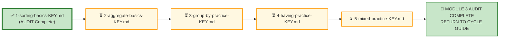

# 🗄️🤖 SQL & GenAI Course
**🎯 Quality Education for Anyone, Anywhere, Anytime — 💫 with Comfort, Convenience at no Cost**

---

## 🔑 File 1: `1-sorting-basics-KEY` (AUDIT Phase)

Welcome to the **Architect's Post‑Mortem**. The execution phase is over. Your queries are saved. Now, we step completely out of the editor and pull back the curtain to reverse-engineer the logical machinery behind **Exercise 1: ORDER BY & LIMIT**.

This is the first AUDIT file for Module 3. Every concept from the AUGMENT phase—`ORDER BY`, multi-column sorting, `DESC` vs `ASC`, `LIMIT`, `OFFSET`, pagination—is tested here across E‑Store and FinVERSE.

**Stop typing. Start auditing.**

Up to this point, you've been writing queries in a controlled environment. But out there in production, stakeholders have different priorities, and a single sort order can change the story the data tells. This isn't a test of how well you can memorize syntax; it's a test of your **business judgment**.

Let's see how your structural decisions hold up under audit.

---

## 🌌 SQLVerse Check-In

<div style="border-left: 4px solid #9c27b0; background-color: #f3e5f5; padding: 15px; margin: 20px 0; border-radius: 0 8px 8px 0;">

### The Sorting Master Key

In Exercise 1, you applied `ORDER BY`, `LIMIT`, and multi-column sorting across two domains: **E‑Store** (your home turf) and **FinVERSE** (the flagship enterprise universe). This answer key doesn't just evaluate your syntax—it evaluates your **business judgment**.

In production, nobody hands you a beautifully isolated prompt. You get raw business chaos: "Show me the most important customers," "Give me a clean list," "I need to see recent activity." Anyone can write `ORDER BY`. A true data consultant knows **why** they choose a specific sort order and **what story** the data tells.

This key doesn't just give you the answers—it reveals the **architectural assumptions** behind the code. Compare your code, audit your logic, and let's see if your queries are ready for the **live environment.**

🛑 **Audit Protocol:** Don't just check if your query returned the same rows. Check your design. Did you use `DESC` when the stakeholder needed the highest value first? Did you add `LIMIT` for production-readiness? Did you use clear, business-friendly aliases? Efficiency and defensiveness are what we are grading here.

</div>

---

## 📍 Your Current Stage – AUDIT Journey

```mermaid
flowchart LR
    A["📍 YOU ARE HERE<br/>⏳ 1-sorting-basics-KEY.md"] --> B
    B["⏳ 2-aggregate-basics-KEY.md"] --> C
    C["⏳ 3-group-by-practice-KEY.md"] --> D
    D["⏳ 4-having-practice-KEY.md"] --> E
    E["⏳ 5-mixed-practice-KEY.md"] --> F
    F["✅ AUDIT COMPLETE<br/>RETURN TO CYCLE GUIDE"]
    
    style A fill:#fff8e1,stroke:#ff9800,stroke-width:4px
    style B fill:#e1f5fe,stroke:#2196f3,stroke-width:2px
    style C fill:#e1f5fe,stroke:#2196f3,stroke-width:2px
    style D fill:#e1f5fe,stroke:#2196f3,stroke-width:2px
    style E fill:#e1f5fe,stroke:#2196f3,stroke-width:2px
    style F fill:#c8e6c9,stroke:#2e7d32,stroke-width:2px
```



---

## 🧪 Validation Protocol

Before you consult this AUDIT file:

- [ ] Have you completed all Business Requests in APPLY File 1?
- [ ] Have you saved your queries in your Vault?
- [ ] Have you tested each query and verified the results?
- [ ] Have you considered alternative sort orders for each request?

> 🔁 **Audit Rule:** The solutions below are a reference, not a shortcut. Compare your reasoning, not just your code.

---

# 💎 Phase 1: The Semantic Excavation (Requirement → Gemstone)

Let's dissect the client tickets you resolved across E‑Store and FinVERSE, exposing the structural geometry buried inside the business prose.

---

## 🛒 Ticket Pair 1: Single-Column Sorting (E‑Store)

| Request 1 – Alphabetical Customer Directory | Request 2 – Top 5 Most Expensive Products |
|---------------------------------------------|-------------------------------------------|

---

### Request 1 – Alphabetical Customer Directory

#### 🪵 Business Language

> "Give me an alphabetical list of customers by last name."

#### 🧠 Business Context (3‑Question Alignment)

| Perspective | Explanation |
|-------------|-------------|
| **Who is asking?** | Marketing Director |
| **Why are they asking?** | They are preparing a direct-mail campaign and need a clean, organised list. |
| **What decision will they make?** | Decide which customers to include in the mailing list based on alphabetical order for logistical sorting. |

#### 💎 Gemstone Extraction

**Pattern Identified:** Single‑Column Ascending Sort

The business wants a straightforward alphabetical list—the most basic sorting requirement.

#### 🧭 Technical Translation

```sql
SELECT 
    customer_id AS "Customer ID",
    name AS "Customer Name",
    email AS "Email",
    phone AS "Phone",
    city AS "City"
FROM customers
ORDER BY name ASC;
```

#### ⚙️ The Choice Pattern

**Why this solution?** The Marketing Director needs a clean, alphabetical list by customer name. `ORDER BY name ASC` provides exactly that. The selected columns give the Marketing Director everything needed for the mailing campaign—name, email, phone, and city.

**Why `ASC` is explicit:** While `ASC` is the default, being explicit about sort direction is a professional habit. It signals intentionality, not reliance on defaults.

#### 📐 Architecture Notes

> `ASC` is optional in SQL standard syntax, but explicitly writing `ASC` makes intent unambiguous in production code.

> The `customers` table has a single `name` column, not separate `first_name` and `last_name` fields. The business request asks for an alphabetical list "by last name," but the data model does not support sorting by last name alone. Sorting by `name` (the full name) is the closest approximation available. In production, this would be flagged as a data model limitation to be addressed with stakeholders.

#### 🚨 Common Mistakes

> Students using schemas with separate `first_name` and `last_name` columns often sort by `first_name` by mistake (`ORDER BY first_name ASC`). In this single `name` column schema, sorting directly by `name` achieves the directory order.

> Students sometimes assume `ORDER BY` sorts alphabetically by default without understanding collation rules. In SQLite, sorting is based on binary values by default, which means uppercase letters come before lowercase.

>  **🔍 Curiosity Prompt:** Ask your Socratic Consultant why SQLite behaves this way and how `NOCASE` changes the result.

#### 🎯 Skill Reinforced

✔ Single‑column ascending sort  
✔ Explicit `ASC` for production‑readiness  
✔ Awareness of data model limitations  

---

### Request 2 – Top 5 Most Expensive Products

#### 🪵 Business Language

> "Show me the 5 most expensive products in inventory."

#### 🧠 Business Context (3‑Question Alignment)

| Perspective | Explanation |
|-------------|-------------|
| **Who is asking?** | Procurement Manager |
| **Why are they asking?** | They are reviewing premium stock for supplier negotiation. |
| **What decision will they make?** | Decide which products to discuss with suppliers for potential cost reduction or premium positioning. |

#### 💎 Gemstone Extraction

**Pattern Identified:** Descending Sort with Row Limiting

The business wants to see the highest-priced items and only the top 5.

#### 🧭 Technical Translation

```sql
SELECT 
    product_id AS "Product ID",
    product_name AS "Product Name",
    category AS "Category",
    price AS "Price ($)"
FROM products
ORDER BY price DESC
LIMIT 5;
```

#### ⚙️ The Choice Pattern

**Why this solution?** The Procurement Manager needs the highest-priced items for supplier review. `ORDER BY price DESC` surfaces the most expensive first, and `LIMIT 5` restricts the output to the top 5 for focused negotiation.

**Why `LIMIT` matters:** In production, returning all products would be unnecessary overhead. `LIMIT` makes the query performant and the report scannable.

#### 📐 Architecture Notes

> `LIMIT` executes **after** `ORDER BY`. If `LIMIT 5` were applied before sorting, it would yield a random 5 products rather than the 5 most expensive. This is a critical execution order rule.

> If multiple products share the 5th highest price, standard `LIMIT` cuts off deterministically based on database storage engine order. In production, add a secondary sort key (for example `product_id ASC`) to ensure stable pagination.

#### 🚨 Common Mistakes

> Students sometimes write `LIMIT` before `ORDER BY` conceptually, forgetting that sorting happens first. This leads to incorrect results in production.

> Students assume `LIMIT` guarantees a specific set of rows without considering ties. Without a tie-breaker, pagination results can shift between executions.

---

#### 🎯 Skill Reinforced

✔ Descending sort for top‑N analysis  
✔ `LIMIT` placement after `ORDER BY`  
✔ Tie‑breaker awareness for stable results  
✔ Production‑readiness with row limiting  

---

### 🪞 SQLVerse Pattern Reflection

| Business Request | Skeletal Pattern |
|------------------|------------------|
| Alphabetical Customer Directory | `ORDER BY column ASC` |
| Top 5 Most Expensive Products | `ORDER BY column DESC LIMIT N` |

**Architect's Observation:** Both requests use single-column sorting. The difference is the sort direction (`ASC` vs `DESC`) and the addition of `LIMIT` for Production Readability and Performance. The skeletal pattern is identical—the business vocabulary changes, but the underlying logic remains the same.

The business vocabulary changes. The skeletal pattern remains invariant.

**The nouns change. The logic does not.**

---

## 🛒 Ticket Pair 2: Date-Based Sorting (E‑Store + FinVERSE)

| Request 3 – Most Recent Orders First (E‑Store) | Request 6 – Most Recent Transactions First (FinVERSE) |
|-------------------------------------------------|--------------------------------------------------------|

---

### Request 3 – Most Recent Orders First

#### 🪵 Business Language

> "Show me the most recent orders first."

#### 🧠 Business Context (3‑Question Alignment)

| Perspective | Explanation |
|-------------|-------------|
| **Who is asking?** | Operations Manager |
| **Why are they asking?** | They are analysing weekly order volume and need to see recent activity. |
| **What decision will they make?** | Identify recent trends and anomalies in order volume. |

#### 💎 Gemstone Extraction

**Pattern Identified:** Date‑Based Descending Sort

The business wants to see the most recent activity first—a classic operational requirement. This is one of the most common operational reporting patterns in production systems.

#### 🧭 Technical Translation

```sql
SELECT 
    order_id AS "Order ID",
    customer_id AS "Customer ID",
    order_date AS "Order Date"
FROM orders
ORDER BY order_date DESC;
```

#### ⚙️ The Choice Pattern

**Why this solution?** The Operations Manager needs to see recent orders for weekly analysis. `ORDER BY order_date DESC` surfaces the newest orders first. The selected columns provide the key information—order ID, customer, and date—for volume analysis.

#### 📐 Architecture Notes

> Temporal reports typically use `DESC` because stakeholders almost always want to see the newest business events first. This is consistent across all SQL databases.

> Ensure `order_date` is stored in **ISO-8601 format** (`YYYY-MM-DD` or `YYYY-MM-DD HH:MM:SS`). This guarantees that string-based comparisons align with chronological ordering, avoiding subtle sorting bugs.

#### 🚨 Common Mistakes

> Students sometimes assume `DESC` sorts by "newest" but forget that dates are stored as strings or numbers. If the format is not ISO-8601 (e.g., `DD-MM-YYYY`), sorting fails chronologically.

> Students often omit `DESC` entirely, relying on the default `ASC`, and then wonder why the oldest orders appear first. **Always explicitly specify `DESC` when the stakeholder needs the most recent data.**

> **🔍 Curiosity Prompt:** Ask your Socratic Consultant what happens to `ORDER BY order_date DESC` if the `order_date` column is stored as `TEXT` but contains inconsistent date formats. How would you detect and fix this?

---

#### 🎯 Skill Reinforced

✔ Date-based descending sort for recency  
✔ ISO-8601 awareness for chronological correctness  
✔ Explicit `DESC` for business‑driven recency  

---

### Request 6 – Most Recent Transactions First

#### 🪵 Business Language

> "Show me the most recent transactions first."

#### 🧠 Business Context (3‑Question Alignment)

| Perspective | Explanation |
|-------------|-------------|
| **Who is asking?** | Finance Executive |
| **Why are they asking?** | They are preparing a daily transaction summary. |
| **What decision will they make?** | Identify recent trends and complete daily reconciliation. |

#### 💎 Gemstone Extraction

**Pattern Identified:** Date‑Based Descending Sort

The business wants to see recent activity first—consistent with operational monitoring requirements.

#### 🧭 Technical Translation

```sql
SELECT 
    transaction_id AS "Transaction ID",
    account_id AS "Account ID",
    amount AS "Amount ($)",
    transaction_date AS "Transaction Date",
    status AS "Status"
FROM transactions
ORDER BY transaction_date DESC;
```

#### ⚙️ The Choice Pattern

**Why this solution?** The Finance Executive needs to see recent transactions for daily reconciliation. `ORDER BY transaction_date DESC` surfaces the newest transactions first. The selected columns provide a complete daily view—transaction ID, account, amount, date, and status.

#### 📐 Architecture Notes

> When timestamps coincide (e.g., automated batch processing or high‑frequency transactions), adding a secondary tie‑breaker like `transaction_id DESC` guarantees deterministic output. Without it, execution order between identical timestamps is database‑dependent.

> In production reporting, always consider whether the stakeholder needs **transactional recency** (by timestamp) or **business recency** (by settlement date, approval date, etc.). These are often different.

#### 🚨 Common Mistakes

> Students often sort by `transaction_date DESC` without considering that multiple transactions may share the exact same timestamp. Without a tie‑breaker, the order of those rows is unpredictable and can shift between query executions—causing confusion in audit trails.

> Students sometimes sort by `timestamp` columns without realising that `TIMESTAMP` and `DATETIME` types behave differently across SQL databases. In SQLite, it is treated as a string or integer depending on storage class. **Always verify the column type and format.**

> **🔍 Curiosity Prompt:** Ask your Socratic Consultant how SQLite stores `DATETIME` values differently from `TIMESTAMP` in PostgreSQL. When would this difference cause sorting issues?

---

#### 🎯 Skill Reinforced

✔ Date-based descending sort for recency  
✔ Tie‑breaker awareness for deterministic ordering  
✔ Understanding of timestamp precision and its limits  
✔ Business vs technical recency distinction  

---

### 🪞 SQLVerse Pattern Reflection

| Business Request | Skeletal Pattern |
|------------------|------------------|
| Most Recent Orders First (E‑Store) | `ORDER BY order_date DESC` |
| Most Recent Transactions First (FinVERSE) | `ORDER BY transaction_date DESC` |

**Architect's Observation:** Both requests use date-based descending sorting. The domain changes (E‑Store orders vs FinVERSE transactions), but the SQL pattern is identical.

The business vocabulary changes. The skeletal pattern remains invariant.

**The nouns change. The logic does not.**

---

## 🛒 Ticket Pair 3: Numeric Descending Sort (FinVERSE)

| Request 5 – Largest Transactions First | Request 8 – Accounts Sorted by Balance |
|-----------------------------------------|----------------------------------------|

---

### Request 5 – Largest Transactions First

#### 🪵 Business Language

> "Show me the largest transactions first."

#### 🧠 Business Context (3‑Question Alignment)

| Perspective | Explanation |
|-------------|-------------|
| **Who is asking?** | Fraud Analyst |
| **Why are they asking?** | They are investigating suspicious activity and need to prioritise high‑value transactions. |
| **What decision will they make?** | Decide which transactions to investigate immediately for potential fraud. |

#### 💎 Gemstone Extraction

**Pattern Identified:** Descending Numeric Sort

The business wants to prioritise high‑value transactions—a classic fraud detection pattern.

#### 🧭 Technical Translation

```sql
SELECT 
    transaction_id AS "Transaction ID",
    account_id AS "Account ID",
    amount AS "Amount ($)",
    transaction_date AS "Transaction Date",
    status AS "Status",
    is_fraud AS "Fraud Flag"
FROM transactions
ORDER BY amount DESC;
```

#### ⚙️ The Choice Pattern

**Why this solution?** The Fraud Analyst needs to see the largest transactions first to prioritise investigation. `ORDER BY amount DESC` surfaces high‑value transactions. The selected columns provide a complete investigative view—transaction ID, account, amount, date, status, and fraud flag.

> 💡 **Production Insight:** In a production environment, the Fraud Analyst would likely also want a `WHERE is_fraud = 1` filter or a `LIMIT 100` to focus on the most critical cases. These additions would be made based on specific investigation parameters.

#### 📐 Architecture Notes

> If `amount` were incorrectly stored as `TEXT`, `$1,000.00` would sort before `$90.00` because text sorting is lexicographic (character by character). **Always verify column data types (`NUMERIC` / `DECIMAL` / `REAL`) before sorting numeric fields.**

> In production, `ORDER BY amount DESC` on a table with millions of rows is expensive without an index on `amount`. The Fraud Analyst may need this query daily—indexing the column ensures consistent performance.

#### 🚨 Common Mistakes

> Students often assume numeric columns are stored as numbers, but some production systems store them as text (e.g., legacy imports, CSV ingestion). Without checking the schema, a `TEXT` column will sort alphabetically, producing unexpected results.

> Students sometimes forget to filter by `status = 'Completed'` when calculating "largest transactions," inadvertently including `Pending`, `Failed`, or `Reversed` transactions—which may be incomplete or invalid. This request did not specify filtering, but in production, a Fraud Analyst would likely want only completed transactions.

> **🔍 Curiosity Prompt:** Ask your Socratic Consultant how SQLite determines if a column is `TEXT` or `NUMERIC` when using `CREATE TABLE` without explicit types. How would you verify the data type of a column in a production database?

---

#### 🎯 Skill Reinforced

✔ Descending numeric sort for value prioritisation  
✔ Data type awareness (`NUMERIC` vs `TEXT`)  
✔ Indexing awareness for production performance  
✔ Defensive filtering based on business context  

---

### Request 8 – Accounts Sorted by Balance

#### 🪵 Business Language

> "Show me accounts sorted by balance (highest first)."

#### 🧠 Business Context (3‑Question Alignment)

| Perspective | Explanation |
|-------------|-------------|
| **Who is asking?** | Wealth Management Team |
| **Why are they asking?** | They are identifying high‑value customers for personalised outreach. |
| **What decision will they make?** | Decide which high‑balance account holders to prioritise for wealth management services. |

#### 💎 Gemstone Extraction

**Pattern Identified:** Descending Numeric Sort on Account Table

The business wants to see accounts with the highest balances first.

#### 🧭 Technical Translation

```sql
SELECT 
    account_id AS "Account ID",
    customer_id AS "Customer ID",
    account_type AS "Account Type",
    balance AS "Balance ($)",
    status AS "Account Status"
FROM accounts
ORDER BY balance DESC;
```

#### ⚙️ The Choice Pattern

**Why this solution?** The Wealth Management Team needs to identify high‑value accounts for personalised outreach. `ORDER BY balance DESC` surfaces the accounts with the highest balances first. The selected columns provide a complete account profile for wealth management evaluation.

#### 📐 Architecture Notes

> **NULL Ordering in Production:** SQLite places `NULL` values at the bottom when using `ORDER BY balance DESC`. PostgreSQL and Oracle place `NULL` values at the top by default unless instructed otherwise. This difference can silently change report output when migrating databases.

> To guarantee deterministic behaviour across SQL engines that support it, write:

```sql
ORDER BY balance DESC NULLS LAST;
```

> This explicitly places `NULL` balances at the bottom, making the intent clear. SQLite currently ignores this syntax, but PostgreSQL, Oracle and DB2 support it.

> When sorting by balance, also consider whether the Wealth Management Team wants all account types or only specific products (Savings, Salary, Joint, etc.).

> **🔍 Curiosity Prompt:** Ask your Socratic Consultant when you would want `NULL` values to appear at the **top** of a sorted list. What business scenario would justify `NULLS FIRST`?


#### 🚨 Common Mistakes

> Students often sort by `balance DESC` without considering that `NULL` balances (un‑funded or pending accounts) may appear at the bottom in SQLite. In PostgreSQL, they could appear at the top. This behaviour is inconsistent across databases and must be documented.

> Students sometimes forget to filter by `status = 'Active'` when sorting accounts by balance, inadvertently including `Closed`, `Dormant`, or `Frozen` accounts—which are not relevant for wealth management outreach.

> **🔍 Curiosity Prompt:** Ask your Socratic Consultant how `COALESCE(balance, 0)` would change the sort order. When would you want to treat `NULL` balances as zero, and when would you want to exclude them entirely?

---

#### 🎯 Skill Reinforced

✔ Descending numeric sort for value prioritisation  
✔ Database‑aware NULL handling (`NULLS LAST` vs `NULLS FIRST`)  
✔ Defensive filtering by account status  
✔ Production awareness of inconsistent NULL behaviour across databases  

---

### 🪞 SQLVerse Pattern Reflection

| Business Request | Skeletal Pattern |
|------------------|------------------|
| Largest Transactions First | `ORDER BY amount DESC` |
| Accounts Sorted by Balance | `ORDER BY balance DESC` |

**Architect's Observation:** Both requests use descending numeric sorting to prioritise the highest values. The domain changes (transactions vs accounts), but the SQL pattern is identical.

The business vocabulary changes. The skeletal pattern remains invariant.

**The nouns change. The logic does not.**

---

## 🛒 Ticket Pair 4: Hierarchical Ordering (E‑Store + FinVERSE)

| Request 4 – Orders Sorted by Customer and Date (E‑Store) | Request 7 – Customers Sorted by Onboarding Date (FinVERSE) |
|-----------------------------------------------------------|-------------------------------------------------------------|

---

### Request 4 – Orders Sorted by Customer and Date

#### 🪵 Business Language

> "Show me orders sorted by customer first, and within each customer, by order date (most recent first)."

#### 🧠 Business Context (3‑Question Alignment)

| Perspective | Explanation |
|-------------|-------------|
| **Who is asking?** | Logistics Team |
| **Why are they asking?** | They are preparing a customer-wise shipment report. |
| **What decision will they make?** | Decide shipment grouping and prioritization per customer. |

#### 💎 Gemstone Extraction

**Pattern Identified:** Multi‑Column Sorting with Mixed Directions

The business wants a hierarchical sort—primary key (customer) ascending, secondary key (date) descending.

#### 🧭 Technical Translation

```sql
SELECT 
    order_id AS "Order ID",
    customer_id AS "Customer ID",
    order_date AS "Order Date"
FROM orders
ORDER BY customer_id ASC, order_date DESC;
```

#### ⚙️ The Choice Pattern

**Why this solution?** The Logistics Team needs orders grouped by customer, with the most recent orders first within each group. `ORDER BY customer_id ASC, order_date DESC` provides exactly this hierarchy.

**Why `ASC` for customer and `DESC` for date:** The Logistics Team wants to see all orders for Customer 1 together, then Customer 2, and so on (`ASC`). Within each customer's orders, the most recent should appear first (`DESC`). The mixed directions are intentional and business‑driven.

#### 📐 Architecture Notes

> `ORDER BY customer_id ASC, order_date DESC` means **customer_id** sorts ascending (default), and **order_date** sorts descending. Each column gets its own direction. A common misconception is that `DESC` applies to both columns—it does not.

> In multi-column sorting, direction modifiers must be repeated for each column. `ORDER BY customer_id, order_date DESC` is equivalent to `ORDER BY customer_id ASC, order_date DESC`.

> When preparing customer‑wise reports, consider whether the primary sort should be by `customer_id` or by `customer_name`. Business stakeholders often think in terms of names, not numeric IDs. The schema may not support both.

#### 🚨 Common Mistakes

> Students often assume `ORDER BY customer_id, order_date DESC` applies `DESC` to both columns. This is incorrect. The `DESC` applies **only** to `order_date`. The Logistics Team would receive an incorrect report if they intended both columns descending.

> Students sometimes forget that `customer_id` is already unique, making the secondary sort on `order_date` necessary for meaningful ordering within each customer's orders.

> **🔍 Curiosity Prompt:** Ask your Socratic Consultant what happens when you write `ORDER BY customer_id DESC, order_date ASC`. How would that change the story the report tells? When would a Logistics Team need that order instead?

---

#### 🎯 Skill Reinforced

✔ Multi-column sorting with mixed directions  
✔ Direction modifiers apply per column  
✔ Hierarchical sorting for grouped reports  
✔ Business-driven column selection  

---

### Request 7 – Customers Sorted by Onboarding Date

#### 🪵 Business Language

> "Show me customers sorted by onboarding date (most recent first)."

#### 🧠 Business Context (3‑Question Alignment)

| Perspective | Explanation |
|-------------|-------------|
| **Who is asking?** | Customer Success Team |
| **Why are they asking?** | They are planning a welcome campaign for new customers. |
| **What decision will they make?** | Decide which new customers to contact first for onboarding support. |

#### 💎 Gemstone Extraction

**Pattern Identified:** Date‑Based Descending Sort on Customer Table

The business wants to see the newest customers first for welcome outreach.

#### 🧭 Technical Translation

```sql
SELECT 
    customer_id AS "Customer ID",
    first_name AS "First Name",
    last_name AS "Last Name",
    email AS "Email",
    phone AS "Phone",
    onboarding_date AS "Onboarding Date",
    kyc_status AS "KYC Status"
FROM customers
ORDER BY onboarding_date DESC;
```

#### ⚙️ The Choice Pattern

**Why this solution?** The Customer Success Team needs to see the newest customers for welcome campaigns. `ORDER BY onboarding_date DESC` surfaces the most recently onboarded customers first. The selected columns provide a complete customer profile—name, contact details, KYC status, and onboarding date.

#### 📐 Architecture Notes

> If multiple customers share the same onboarding date, execution order becomes non-deterministic. To guarantee stable output, add a secondary tie-breaker like `customer_id ASC` or `last_name ASC`. This ensures consistent pagination.

> `onboarding_date` is a date-only column. If the team starts needing time-specific filtering (e.g., "onboarded after 2 PM"), the schema would need to be expanded to `DATETIME`.

#### 🚨 Common Mistakes

> Students often sort by `onboarding_date DESC` without considering ties. If 10 customers onboarded on the same day, their order is unpredictable without a tie-breaker. This can cause confusion when the Customer Success Team compares reports week over week.

> Students sometimes assume date columns are stored in a consistent format. In production, some databases store dates as strings, which can break sorting if formats are mixed. Always verify the storage type.

> **🔍 Curiosity Prompt:** Ask your Socratic Consultant why `ORDER BY onboarding_date DESC, customer_id ASC` is considered a production‑grade pattern. What problem does the `customer_id` tie-breaker solve?

---

#### 🎯 Skill Reinforced

✔ Date-based descending sort for recency  
✔ Tie-breaker awareness for deterministic ordering  
✔ Date storage format awareness  
✔ Production‑grade pagination patterns  

---

### 🪞 SQLVerse Pattern Reflection

| Business Request | Skeletal Pattern |
|------------------|------------------|
| Orders Sorted by Customer and Date | `ORDER BY customer_id ASC, order_date DESC` |
| Customers Sorted by Onboarding Date | `ORDER BY onboarding_date DESC` |

**Architect's Observation:** Both requests involve sorting by date—either as a primary or secondary sort. Request 4 adds a primary grouping (by customer) to create a hierarchical report. Request 7 is a straightforward recency sort. The pattern is the same; the complexity changes. 

Business vocabulary changes. The skeletal pattern remains invariant.

**The nouns change. The logic does not.**

---

## 📋 Section 3: Executive Desk – Integrated Challenge

### Request 9 – Executive Customer Priority Report

#### 🪵 Business Language

> *"I need a list of our most important customers. Show me who we should prioritise for outreach."*

#### 🧠 Business Context (3‑Question Alignment)

| Perspective | Explanation |
|-------------|-------------|
| **Who is asking?** | Chief Operating Officer (COO) |
| **Why are they asking?** | They need to prioritise customer outreach for strategic engagement. |
| **What decision will they make?** | Allocate resources to the highest‑priority customers based on defined criteria. |

#### 💎 Gemstone Extraction

**Pattern Identified:** Interpretive Customer Prioritisation Report

This is an underspecified request. The learner must define "most important," choose columns, apply filters, and sort.

#### 🧭 Technical Translation (Defensible Interpretation)

```sql
/*
================================================================================
ARCHITECT ASSUMPTIONS & DESIGN NOTES:

1. "Most important customers" are defined as those who are:
   - Fully KYC verified (kyc_status = 'Verified')
   - Active status (status = 'Active')
   - Low risk (risk_score = 'Low')
   - Have high account balances (balance > 50000)
   - Have complete contact details (email IS NOT NULL AND phone IS NOT NULL)

2. This definition assumes that high‑balance, verified, active, low‑risk customers
   with complete contact details are the most valuable to the business.

3. Sorting by balance descending surfaces the highest‑value customers first,
   making the report immediately actionable for the COO.

4. Aliases are applied for board‑readability and professional presentation.
================================================================================
*/

SELECT 
    c.customer_id AS "Customer ID",
    c.first_name AS "First Name",
    c.last_name AS "Last Name",
    c.email AS "Email",
    c.phone AS "Phone",
    c.kyc_status AS "KYC Status",
    c.risk_score AS "Risk Score",
    a.balance AS "Account Balance ($)",
    a.account_type AS "Account Type"
FROM customers c
JOIN accounts a ON c.customer_id = a.customer_id
WHERE c.kyc_status = 'Verified'
  AND c.status = 'Active'
  AND c.risk_score = 'Low'
  AND c.email IS NOT NULL
  AND c.phone IS NOT NULL
  AND a.balance > 50000.00
ORDER BY a.balance DESC;
```

#### ⚙️ The Choice Pattern

**Why this solution?** The COO needs a defensible, actionable prioritisation of customers. Combining KYC verification, active status, low risk, high balance, and complete contact details identifies customers who are both valuable and reachable. Sorting by balance descending surfaces the highest‑value customers first, making the report immediately actionable.

**Defensible Alternatives:**

| Alternative | Assumption | SQL Change |
|-------------|------------|------------|
| **A – No Balance Threshold** | All active, verified customers are important | Remove `AND a.balance > 50000.00` |
| **B – Prioritise Risk** | Low risk is the most important factor | `ORDER BY risk_score ASC, balance DESC` |
| **C – Prioritise Recency** | Recently onboarded customers need outreach | Add `ORDER BY onboarding_date DESC, balance DESC` |

#### 📐 Architecture Notes

> Sorting is the final step—it presents the prioritised list. The filters define the criteria; the sort order defines the priority. Both are equally important in an executive report.

> This query uses a `JOIN` between `customers` and `accounts`. You learned `JOIN` in Module 4 of ACQUIRE. Here, the focus shifts from syntax to business reasoning—recognising that customer priority requires information from both tables.

> If the COO later requests a "top 100" list, adding `LIMIT 100` after `ORDER BY` ensures performance and report scannability. Always consider `LIMIT` for production reports.

> **Edge Case – Grain Mismatch:** If a customer holds multiple accounts (e.g., a Savings account with $60,000 and a Checking account with $40,000), a simple `JOIN` without aggregation will produce **duplicate customer rows**—one per account exceeding the threshold. This inflates customer counts and misrepresents the distribution.
>
> To aggregate **total customer wealth across all accounts**, transition from a raw `JOIN` to `SUM(balance)` with `GROUP BY customer_id`. This is a critical distinction between **account‑level reporting** and **customer‑level reporting**.
>
> **🔍 Curiosity Prompt:** Ask your Socratic Consultant how you would modify Request 9 to show total customer value across all accounts, not just individual account balances. What would change in the `SELECT`, `JOIN`, and `GROUP BY` clauses?

#### 🚨 Common Mistakes

> Students often forget to include contact details (email, phone) in the query. If the COO cannot reach the customer, the report is useless. **Always verify that the output is actionable.**

> Students sometimes filter by balance alone, forgetting KYC and risk status. A high‑balance customer with `Rejected` KYC or `High` risk may not be a good candidate for outreach. **The COO needs a complete picture.**

> Students may omit the `JOIN` entirely, attempting to derive customer priority from `customers` alone. Without balance data, the definition of "importance" is incomplete.

> Students sometimes assume that every `JOIN` produces one row per customer. In reality, the result contains **one row per matching account**, not one row per customer. Always verify the **grain** of your result before presenting an executive report.

> **🔍 Curiosity Prompt:** Ask your Socratic Consultant how you can determine the **grain** of any SQL query before writing it. Why is understanding grain one of the most important skills in professional analytics?

---

#### 🎯 Skill Reinforced

✔ Interpretive query design for open‑ended requests  
✔ Defensible assumption‑making for executive reports  
✔ Multi‑table reasoning (`JOIN` for customer + account data)  
✔ Business‑friendly aliasing for board‑readability  
✔ Production awareness (actionable output, `LIMIT` for performance)

---

### 🪞 SQLVerse Pattern Reflection

**Skeletal Pattern:** **Define → Filter → Prioritise → Present**

**SQL Vehicle:** `JOIN → WHERE → ORDER BY`

This exercise is not about `ORDER BY` alone.

**It is about the complete decision pipeline:** 

 - Define what "most important" means.
 - Filter to that definition.
 - Prioritise the resulting set.

**This is the core of executive reporting.**

#### Executive Reporting: Decision Framework

 1. **Define** what really matters
 2. **Identify** the table(s) involved
 3. **Filter** to that definition
 4. **Sort** to show priority
 5. **Present** the output clearly.
 6. **Verify** that the report answers the stakeholder's questions.

**The pattern is simple—the judgment lies in the definition.**

The business vocabulary changes. The skeletal pattern remains invariant.

**The nouns change. The logic does not.**

---

# 🌲 Phase 2: Skill‑Tree Update

Your portfolio isn't measured by the volume of lines you wrote; it is verified by the competencies you demonstrated. Below are the structural data matrices you have earned through this audit. Ensure your internal **Gemstone Array** has recorded these updates before moving forward.

```text
📦 [skills_level1]        ──> Unlocked: Single-Column Sorting, Descending Sort with LIMIT, Date-Based Sorting, Multi-Column Sorting, Interpretive Customer Prioritisation
💡 [insights_level1]      ──> Recorded: Sorting is Prioritisation, Domain-Invariant Logic, LIMIT for Production-Readiness
🏆 [achievements_level1]  ──> Certified: Sprint Milestone [L1‑M3‑EX1‑AUDIT] Complete
```

---

## 💎 The Gemstone Array Update

### 📂 Gemstone Array Entry 1: Competency Mapping (`skills_level1`)

| Skill Code | Skill Name | Description |
|------------|------------|-------------|
| `SKL‑L1‑M3‑001` | Single‑Column Ascending Sort | Used `ORDER BY column ASC` for alphabetical customer directory |
| `SKL‑L1‑M3‑002` | Descending Sort with LIMIT | Used `ORDER BY column DESC LIMIT N` for top‑N analysis |
| `SKL‑L1‑M3‑003` | Date‑Based Descending Sort | Used `ORDER BY date_column DESC` for recent activity |
| `SKL‑L1‑M3‑004` | Multi‑Column Sorting | Used `ORDER BY col1 ASC, col2 DESC` for hierarchical sorting |
| `SKL‑L1‑M3‑005` | Interpretive Customer Prioritisation | Made defensible assumptions for open‑ended executive request |
| `SKL‑L1‑M3‑006` | Business‑Friendly Aliasing | Used `AS` to translate technical column names into readable labels |

---

### 📂 Gemstone Array Entry 2: Architectural Insights (`insights_level1`)

| Insight ID | Title | Extraction |
|------------|-------|------------|
| `INS‑L1‑M3‑001` | Sorting Is Prioritisation | The order you choose communicates what matters most to the stakeholder. |
| `INS‑L1‑M3‑002` | Domain‑Invariant Sorting Logic | `ORDER BY` works identically across E‑Store and FinVERSE—only the columns change. |
| `INS‑L1‑M3‑003` | LIMIT Enables Production‑Readiness | Always pair `ORDER BY` with `LIMIT` in user‑facing reports to ensure performance and scannability. |
| `INS‑L1‑M3‑004` | Explicit Direction Signals Intentionality | Using `ASC`/`DESC` explicitly—even when `ASC` is default—shows professional judgment. |

---

### 📂 Gemstone Array Entry 3: Milestone Certification (`achievements_level1`)

| Achievement Code | Title | Verification Status |
|------------------|-------|---------------------|
| `ACH‑L1‑M3‑AUD01` | Master Architect Sign‑Off: Sorting Basics | Verified against business, logical, and operational correctness. This exercise is formally frozen as production-ready. |

---

> 📘 **Skill‑Tree Update Reminder:** Keep updating the Gemstone Array throughout this AUDIT cycle. After you complete the full AUDIT cycle (all 5 files), use the **ETL Workflow** provided in [`SKILL_TREE_ARCHITECTURE.md`](../../../Guides/SKILL_TREE_ARCHITECTURE.md) to persist your gemstones into your permanent Skill‑Tree database.

---

# 🏛️ Phase 3: The Vault Manifest (Verification Ledger)

Compare the skeletal structural patterns of your work against the verified production baseline. If your syntax achieved the exact same logical, business, and operational correctness, tick the verification box.

---

## 🛒 Section 1: Workshop Floor – E‑Store

```sql
-- Request 1: Alphabetical Customer Directory
SELECT 
    customer_id AS "Customer ID",
    name AS "Customer Name",
    email AS "Email",
    phone AS "Phone",
    city AS "City"
FROM customers
ORDER BY name ASC;

-- Request 2: Top 5 Most Expensive Products
SELECT 
    product_id AS "Product ID",
    product_name AS "Product Name",
    category AS "Category",
    price AS "Price ($)"
FROM products
ORDER BY price DESC
LIMIT 5;

-- Request 3: Most Recent Orders First
SELECT 
    order_id AS "Order ID",
    customer_id AS "Customer ID",
    order_date AS "Order Date"
FROM orders
ORDER BY order_date DESC;

-- Request 4: Orders Sorted by Customer and Date
SELECT 
    order_id AS "Order ID",
    customer_id AS "Customer ID",
    order_date AS "Order Date"
FROM orders
ORDER BY customer_id ASC, order_date DESC;
```

---

## 🏥 Section 2: Production Echo – FinVERSE

```sql
-- Request 5: Largest Transactions First
SELECT 
    transaction_id AS "Transaction ID",
    account_id AS "Account ID",
    amount AS "Amount ($)",
    transaction_date AS "Transaction Date",
    status AS "Status",
    is_fraud AS "Fraud Flag"
FROM transactions
ORDER BY amount DESC;

-- Request 6: Most Recent Transactions First
SELECT 
    transaction_id AS "Transaction ID",
    account_id AS "Account ID",
    amount AS "Amount ($)",
    transaction_date AS "Transaction Date",
    status AS "Status"
FROM transactions
ORDER BY transaction_date DESC;

-- Request 7: Customers Sorted by Onboarding Date
SELECT 
    customer_id AS "Customer ID",
    first_name AS "First Name",
    last_name AS "Last Name",
    email AS "Email",
    phone AS "Phone",
    onboarding_date AS "Onboarding Date",
    kyc_status AS "KYC Status"
FROM customers
ORDER BY onboarding_date DESC;

-- Request 8: Accounts Sorted by Balance
SELECT 
    account_id AS "Account ID",
    customer_id AS "Customer ID",
    account_type AS "Account Type",
    balance AS "Balance ($)",
    status AS "Account Status"
FROM accounts
ORDER BY balance DESC;
```

---

## 📋 Section 3: Executive Desk – Integrated Challenge

```sql
-- Request 9: Executive Customer Priority Report
/*
================================================================================
ARCHITECT ASSUMPTIONS & DESIGN NOTES:

1. "Most important customers" are defined as those who are:
   - Fully KYC verified (kyc_status = 'Verified')
   - Active status (status = 'Active')
   - Low risk (risk_score = 'Low')
   - Have high account balances (balance > 50000)
   - Have complete contact details (email IS NOT NULL AND phone IS NOT NULL)

2. This definition assumes that high‑balance, verified, active, low‑risk customers
   with complete contact details are the most valuable to the business.

3. Sorting by balance descending surfaces the highest‑value customers first,
   making the report immediately actionable for the COO.

4. Aliases are applied for board‑readability and professional presentation.
================================================================================
*/

SELECT 
    c.customer_id AS "Customer ID",
    c.first_name AS "First Name",
    c.last_name AS "Last Name",
    c.email AS "Email",
    c.phone AS "Phone",
    c.kyc_status AS "KYC Status",
    c.risk_score AS "Risk Score",
    a.balance AS "Account Balance ($)",
    a.account_type AS "Account Type"
FROM customers c
JOIN accounts a ON c.customer_id = a.customer_id
WHERE c.kyc_status = 'Verified'
  AND c.status = 'Active'
  AND c.risk_score = 'Low'
  AND c.email IS NOT NULL
  AND c.phone IS NOT NULL
  AND a.balance > 50000.00
ORDER BY a.balance DESC;
```

---

### 🏛️ Architectural Reflection – Executive Desk

This request is the pinnacle of the AUDIT. It requires:

- **Assumption‑making** – defining what "most important" means.
- **Column selection** – choosing what matters for customer prioritisation.
- **Filtering** – applying thresholds for KYC, risk, contact completeness, and balance.
- **Aliasing** – translating technical column names into business language.
- **Sorting** – presenting the highest‑priority customers first.

The COO does not care about your `SELECT` statement. The COO cares about the clarity and defensibility of the report. **Your assumptions are as important as your syntax.**

---

## ✅ Verification Sign‑Off

- [ ] My queries returned the expected results.
- [ ] My reasoning matched the gemstone patterns.
- [ ] I can defend every filter and sort decision.
- [ ] I understand why LIMIT improves production reporting.
- [ ] I have updated my Skill Tree.

---

## 🧭 Exit Reflection

Stop writing code. Step completely out of the technical layer and answer these three architectural reflection questions inside your personal design log:

**1. The Domain‑Invariance Layer:** In Request 1, you sorted customers by name. In Request 5, you sorted transactions by amount. In Request 8, you sorted accounts by balance. What does this reveal about the domain-invariant nature of SQL? Why can exactly the same `ORDER BY` pattern solve problems in retail, banking, healthcare, and HR?

**2. The Prioritisation Layer:** In Request 4, you used `ORDER BY customer_id ASC, order_date DESC`. In Request 9, you used `ORDER BY balance DESC`. How does the sort order change the *story* the data tells? How does reversing the sort direction completely change the business story the report tells?

**3. The Production Layer:** In Request 2, you used `LIMIT 5`. Why is `LIMIT` important in production queries? What risks exist when a query returns all rows without `LIMIT`? How does `LIMIT` influence database performance, network usage, report readability, and stakeholder decision-making?

---

## 🔁 Bridge Forward



You have audited **Sorting Basics** across E‑Store and FinVERSE. The gemstones are extracted, your Skill‑Tree is updated, and you have proven that sorting logic is truly domain‑invariant.

**Next: Aggregate Functions AUDIT.**

➡️  [Continue to 2-aggregate-basics-KEY.md →](./2-aggregate-basics-KEY.md)

| Previous Step | Next Step |
|:---:|:---:|
| [← Return to Cycle Guide](../../01-The-Socratic-Mirror/CYCLE2_GUIDE.md) | [Continue to 2-aggregate-basics-KEY.md →](./2-aggregate-basics-KEY.md) |

---

*Part of our mission for 🎯 Quality Education for Anyone, Anywhere, Anytime — 💫 with Comfort, Convenience at no Cost.*

**Level 1 | ACCELERATE Phase | AUDIT | Module 3 | File 1**

