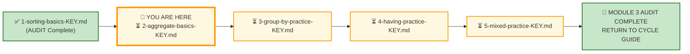
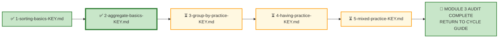

# 🗄️🤖 SQL & GenAI Course
**🎯 Quality Education for Anyone, Anywhere, Anytime — 💫 with Comfort, Convenience at no Cost**

---

## 🔑 File 2: `2-aggregate-basics-KEY` (AUDIT Phase)

Welcome to the **Architect's Post‑Mortem**. The execution phase is over. Your queries are saved. Now, we step completely out of the editor and pull back the curtain to reverse-engineer the logical machinery behind **Exercise 2: Aggregate Functions**.

This is the second AUDIT file for Module 3. Every concept from the AUGMENT phase—`COUNT`, `SUM`, `AVG`, `MIN`, `MAX`, and their NULL handling rules—is tested here across E‑Store and Real Estate Planet.

**Stop typing. Start auditing.**

Up to this point, you've been writing queries in a controlled environment. But out there in production, executives don't care about `SELECT` statements—they care about the **story** the numbers tell. A single summary number can shape strategy, allocate budgets, and drive decisions. This isn't a test of how well you can memorize aggregate functions; it's a test of your **judgment**.

Let's see how your structural decisions hold up under audit.

---

## 🌌 SQLVerse Check-In

<div style="border-left: 4px solid #9c27b0; background-color: #f3e5f5; padding: 15px; margin: 20px 0; border-radius: 0 8px 8px 0;">

### The Aggregate Master Key

In Exercise 2, you applied `COUNT`, `SUM`, `AVG`, `MIN`, and `MAX` across two domains: **E‑Store** (your home turf) and **Real Estate Planet** (the deal‑driven property marketplace). This answer key doesn't just evaluate your syntax—it evaluates your **business judgment**.

In production, nobody hands you a beautifully isolated prompt. You get raw business chaos: "How many customers do we have?", "What's the average order value?", "Show me our total market exposure." Anyone can write `COUNT(*)`. A true data consultant knows **why** they choose a specific aggregate, **what** the number represents, and **what** it hides.

This key doesn't just give you the answers—it reveals the **architectural assumptions** behind the code. Compare your code, audit your logic, and let's see if your queries are ready for the **live environment.**

🛑 **Audit Protocol:** Don't just check if your query returned the same numbers. Check your design. Did you handle `NULL`s correctly? Did you use `COUNT(*)` vs `COUNT(column)` appropriately? Did you filter by status before aggregating? Efficiency and defensiveness are what we are grading here.

</div>

---

## 📍 Your Current Stage – AUDIT Journey



---

## 🧪 Validation Protocol

Before you consult this AUDIT file:

- [ ] Have you completed all Business Requests in APPLY File 2?
- [ ] Have you saved your queries in your Vault?
- [ ] Have you tested each query and verified the results?
- [ ] Have you considered alternative aggregate functions for each request?

> 🔁 **Audit Rule:** The solutions below are a reference, not a shortcut. Compare your reasoning, not just your code.

---

# 💎 Phase 1: The Semantic Excavation (Requirement → Gemstone)

Let's dissect the client tickets you resolved across E‑Store and Real Estate Planet, exposing the structural geometry buried inside the business prose.

---
## 🛒 Ticket Pair 1: Counting Records (E‑Store)

| Request 1 – Total Number of Customers | Request 4 – Active Customer Email Penetration & Contact Audit |
|----------------------------------------|----------------------------------------------------------------|

---

### Request 1 – Total Number of Customers

#### 🪵 Business Language

> "How many customers are in the database?"

#### 🧠 Business Context (3‑Question Alignment)

| Perspective | Explanation |
|-------------|-------------|
| **Who is asking?** | Marketing Director |
| **Why are they asking?** | They need a market size estimate for campaign planning. |
| **What decision will they make?** | Budget allocation based on total addressable market. |

#### 💎 Gemstone Extraction

**Pattern Identified:** Row Counting

The business wants a simple count of all customers.

#### 🧭 Technical Translation

```sql
-- Professional approach: target the primary key explicitly
SELECT 
    COUNT(customer_id) AS "Total Customers"
FROM customers;

-- Equivalent: COUNT(*) works the same when counting all rows
SELECT 
    COUNT(*) AS "Total Customers"
FROM customers;
```

#### ⚙️ The Choice Pattern

**Why this solution?** The Marketing Director needs a total customer count. `COUNT(customer_id)` counts every non‑NULL primary key in the `customers` table. `COUNT(*)` yields the same result here, but targeting the primary key is explicit best practice. The selected alias provides a clear, executive‑ready metric.

#### 📐 Architecture Notes

> `COUNT(customer_id)` counts only non‑NULL `customer_id` values. Since `customer_id` is the primary key, it is guaranteed to be non‑NULL and unique. This approach is explicit and signals professional intent.

> `COUNT(*)` counts every row regardless of `NULL` values. Both produce the same result here because `customer_id` has no `NULL`s. However, using `COUNT(primary_key)` communicates that you are counting the rows themselves, not relying on any column's completeness.

> **This approach does not work for `COUNT(email)` because `email` is not a primary key**—it may contain `NULL`s, and the result would undercount customers with missing email addresses.

#### 🚨 Common Mistakes

> Students sometimes use `COUNT(email)` instead of `COUNT(customer_id)` or `COUNT(*)`, assuming all customers have emails. This undercounts customers with `NULL` emails—exactly the trap Request 4 is designed to expose.

> Students often use `COUNT(*)` or `COUNT(1)` without understanding the difference. While they produce the same result, `COUNT(primary_key)` is a professional habit that signals intentionality.

> **🔍 Curiosity Prompt:** Ask your Socratic Consultant why `COUNT(customer_id)` is considered a more professional approach than `COUNT(*)` in a production code review.

#### 🎯 Skill Reinforced

✔ `COUNT(primary_key)` for explicit row counting  
✔ `COUNT(*)` as an equivalent alternative  
✔ Business‑friendly aliasing  
✔ Production awareness of primary key guarantees  

---

### Request 4 – Active Customer Email Penetration & Contact Audit

#### 🪵 Business Language

> "How many total customers do we have? How many have provided a valid email? How many distinct cities are represented?"

#### 🧠 Business Context (3‑Question Alignment)

| Perspective | Explanation |
|-------------|-------------|
| **Who is asking?** | Marketing Director |
| **Why are they asking?** | They are preparing a digital campaign and need to know reachable customers. |
| **What decision will they make?** | Campaign channel selection (email vs direct mail). |

#### 💎 Gemstone Extraction

**Pattern Identified:** Column Counting with NULL Handling + Distinct Counting

The business needs three metrics from the same table.

#### 🧭 Technical Translation

```sql
SELECT 
    COUNT(customer_id) AS "Total Customers",
    COUNT(email) AS "Customers with Email",
    COUNT(DISTINCT city) AS "Distinct Cities"
FROM customers;
```

#### ⚙️ The Choice Pattern

**Why this solution?** The Marketing Director needs three metrics: `COUNT(customer_id)` for total customers, `COUNT(email)` to measure email penetration (excluding `NULL`s), and `COUNT(DISTINCT city)` for geographic reach. All three from the same table in one query.

#### 📐 Architecture Notes

> **`COUNT(email)` automatically ignores `NULL` values.** This is the fundamental distinction between `COUNT(*)` and `COUNT(column)`. `COUNT(email)` counts only customers who have provided an email address—revealing the "reachable" population.

> **`COUNT(*)` counts every row regardless of column contents.** If you used `COUNT(*)` instead of `COUNT(email)`, you would get the total customer count, not the email penetration metric.

> Together, `COUNT(customer_id)` and `COUNT(email)` tell the complete story: **total population** vs **reachable population**. This data quality insight is essential for campaign planning.

> `COUNT(DISTINCT city)` requires the database to deduplicate city names. While efficient on small datasets, it can be expensive on large tables without an index.

#### 🚨 Common Mistakes

> Students often use `COUNT(email)` for all three metrics, assuming `NULL`s are handled automatically. They must learn the distinction between `COUNT(*)` and `COUNT(column)`.

> Students sometimes forget that `NULL` values in the `email` column represent **missing data**, not a valid "no email" status.

> **🔍 Curiosity Prompt:** Ask your Socratic Consultant what happens to `COUNT(email)` when a customer enters an empty string `''` instead of `NULL`. How would you handle this in a production environment?

#### 🎯 Skill Reinforced

✔ `COUNT(primary_key)` for total row count  
✔ `COUNT(column)` for non‑NULL value count  
✔ `COUNT(DISTINCT column)` for unique values  
✔ NULL awareness in production reporting  
✔ Business‑friendly aliasing  

---

### 🪞 SQLVerse Pattern Reflection

| Business Request | Skeletal Pattern |
|------------------|------------------|
| Total Number of Customers | `COUNT(primary_key)` or `COUNT(*)` |
| Active Customer Email Penetration & Contact Audit | `COUNT(primary_key)`, `COUNT(column)`, `COUNT(DISTINCT column)` |

**Architect's Observation:** Both requests use counting patterns. The first is a simple row count; the second combines multiple counting patterns with NULL handling and deduplication. The sophistication of the aggregate pattern matches the sophistication of the business question.

The business vocabulary changes. The skeletal pattern remains invariant.

**The nouns change. The logic does not.**

---

## 🛒 Ticket Pair 2: Revenue and Valuation Aggregates (E‑Store)

| Request 2 – Revenue & Order Performance | Request 3 – Product Catalog Inventory Valuation |
|------------------------------------------|--------------------------------------------------|

---

### Request 2 – Revenue & Order Performance

#### 🪵 Business Language

> "Show me total revenue, total orders, average order value, smallest order, and largest order."

#### 🧠 Business Context (3‑Question Alignment)

| Perspective | Explanation |
|-------------|-------------|
| **Who is asking?** | VP of Retail Operations |
| **Why are they asking?** | They need a macro summary of store activity for performance review. |
| **What decision will they make?** | Strategic decisions about pricing and operations. |

#### 💎 Gemstone Extraction

**Pattern Identified:** Multiple Aggregates Across Joined Tables

The business needs five metrics, requiring a `JOIN` across `orders`, `order_items`, and `products`.

#### 🧭 Technical Translation

```sql
SELECT 
    COUNT(DISTINCT o.order_id) AS "Total Orders",
    SUM(oi.quantity * p.price) AS "Total Revenue",
    AVG(oi.quantity * p.price) AS "Average Order Value",
    MIN(oi.quantity * p.price) AS "Smallest Order Total",
    MAX(oi.quantity * p.price) AS "Largest Order Total"
FROM orders o
JOIN order_items oi ON o.order_id = oi.order_id
JOIN products p ON oi.product_id = p.product_id;
```

#### ⚙️ The Choice Pattern

**Why this solution?** The VP needs five KPIs: `COUNT(DISTINCT order_id)` for total orders, `SUM(order_total)` for revenue, `AVG(order_total)` for AOV, and `MIN`/`MAX` for range. Each requires calculating `order_total = quantity * price` at the order-item level before aggregation.

#### 📐 Architecture Notes

> `COUNT(DISTINCT o.order_id)` is used because `JOIN`ing `order_items` creates multiple rows per order. Without `DISTINCT`, `COUNT(o.order_id)` would count each order item row, not each order.

> `SUM(oi.quantity * p.price)` calculates revenue correctly. However, this works only if the `price` column in `products` represents the current price, not the historical price at the time of order. (This limitation is addressed in Module 4.)

> `AVG(oi.quantity * p.price)` calculates the average order value correctly. `ROUND(AVG(oi.quantity * p.price), 2)` would improve presentation.

#### 🚨 Common Mistakes

> Students often forget `DISTINCT` in `COUNT(DISTINCT order_id)`, resulting in an inflated "total orders" count equal to the number of order items.

> Students sometimes use `SUM(price)` instead of `SUM(quantity * price)`, forgetting that an order can contain multiple units of a product.

> **🔍 Curiosity Prompt:** Ask your Socratic Consultant how you would modify this query to calculate revenue **per customer** instead of total revenue.

#### 🎯 Skill Reinforced

✔ `COUNT(DISTINCT column)` for unique values  
✔ `SUM()` with arithmetic expressions  
✔ `AVG()`, `MIN()`, `MAX()` for range analysis  
✔ JOIN awareness when aggregating across tables  

---

### Request 3 – Product Catalog Inventory Valuation

#### 🪵 Business Language

> "Show me the total number of products, average price, minimum price, and maximum price."

#### 🧠 Business Context (3‑Question Alignment)

| Perspective | Explanation |
|-------------|-------------|
| **Who is asking?** | Inventory Manager |
| **Why are they asking?** | They need a financial audit of the product catalog. |
| **What decision will they make?** | Pricing strategy and inventory valuation. |

#### 💎 Gemstone Extraction

**Pattern Identified:** Multiple Aggregates on a Single Table

The business needs four metrics from a single table.

#### 🧭 Technical Translation

```sql
SELECT 
    COUNT(*) AS "Total Products",
    ROUND(AVG(price), 2) AS "Average Price",
    MIN(price) AS "Minimum Price",
    MAX(price) AS "Maximum Price"
FROM products;
```

#### ⚙️ The Choice Pattern

**Why this solution?** The Inventory Manager needs catalog statistics: `COUNT(*)` for product count, `AVG(price)` for average valuation, and `MIN`/`MAX` for pricing extremes. `ROUND(AVG(price), 2)` ensures clean presentation.

#### 📐 Architecture Notes

> `ROUND(AVG(price), 2)` is **not** a nested aggregate. It is a **single aggregate function** `AVG()` applied to the `price` column. The `ROUND()` function wraps `AVG()` for formatting purposes—this is **not nesting** in the SQL sense. Nesting would be `AVG(SUM(price))`, which is illegal.

> SQLite does not allow nested aggregate functions directly in one evaluation pass. Attempting `AVG(SUM(quantity * price))` in a single `SELECT` clause without a subquery or CTE is the common mistake students make.

> `ROUND(AVG(price), 2)` evaluates as:
> 1. `AVG(price)` is computed first.
> 2. Then `ROUND()` is applied to the result.
>
> This is a **single pass** of aggregation, followed by a scalar formatting function.

> `AVG(price)` ignores `NULL` prices. If `NULL` prices exist, the average will be calculated only on non‑`NULL` values, potentially overstating the average. This data quality issue should be flagged to the Inventory Manager.

#### 🚨 Common Mistakes

> Students sometimes use `AVG(price)` without `ROUND`, resulting in unformatted output (e.g., `49.833333`). In production, this would be considered unprofessional.

> Students may forget that `AVG` ignores `NULL`s entirely—if 10% of products have `NULL` prices, the reported average will be based only on the 90% that have prices.

> **🔍 Curiosity Prompt:** Ask your Socratic Consultant what would happen to `AVG(price)` if a single product had a price of `NULL`. How would you detect this issue?

#### 🎯 Skill Reinforced

✔ `COUNT(*)` for row count  
✔ `AVG()` for central tendency  
✔ `MIN()` and `MAX()` for range analysis  
✔ `ROUND()` for professional presentation  
✔ NULL awareness in aggregation  

---

### 🪞 SQLVerse Pattern Reflection

| Business Request | Skeletal Pattern |
|------------------|------------------|
| Revenue & Order Performance | `COUNT(DISTINCT)`, `SUM()`, `AVG()`, `MIN()`, `MAX()` |
| Product Catalog Inventory Valuation | `COUNT(*)`, `AVG()`, `MIN()`, `MAX()` |

**Architect's Observation:** Both requests use multiple aggregates. Request 2 requires a `JOIN` across tables; Request 3 uses a single table. The pattern is the same—only the table complexity changes.

The business vocabulary changes. The skeletal pattern remains invariant.

**The nouns change. The logic does not.**

---

## 🛒 Ticket Pair 3: GROUP BY with COUNT (E‑Store + Real Estate)

| Request 5 – Number of Customers per City (E‑Store) | Request 10 – Number of Offers per Status (Real Estate) |
|-----------------------------------------------------|--------------------------------------------------------|

---

### Request 5 – Number of Customers per City

#### 🪵 Business Language

> "How many customers are in each city?"

#### 🧠 Business Context (3‑Question Alignment)

| Perspective | Explanation |
|-------------|-------------|
| **Who is asking?** | Operations Team |
| **Why are they asking?** | They need to understand regional distribution for logistics planning. |
| **What decision will they make?** | Warehouse and distribution centre placement. |

#### 💎 Gemstone Extraction

**Pattern Identified:** `GROUP BY` with `COUNT`

The business wants a categorical count—how many customers per city.

#### 🧭 Technical Translation

```sql
SELECT 
    city AS "City",
    COUNT(customer_id) AS "Number of Customers"
FROM customers
GROUP BY city
ORDER BY city;
```

#### ⚙️ The Choice Pattern

**Why this solution?** The Operations Team needs regional distribution data. `GROUP BY city` creates groups for each city, and `COUNT(customer_id)` counts customers in each group. `ORDER BY city` presents the results alphabetically.

#### 📐 Architecture Notes

> `GROUP BY` is the fundamental pattern for categorical aggregation. It creates groups based on unique values in the specified column, and aggregates are computed within each group.

> `COUNT(customer_id)` targets the primary key—explicit best practice.

#### 🚨 Common Mistakes

> Students sometimes forget `GROUP BY` and use `COUNT(DISTINCT city)`—which would return only the number of distinct cities, not the count per city.

> Students may omit `ORDER BY city`, resulting in an unsorted list that is harder to scan.

> **🔍 Curiosity Prompt:** Ask your Socratic Consultant how you would modify this query to show only cities with more than 2 customers.

#### 🎯 Skill Reinforced

✔ `GROUP BY` for categorical aggregation  
✔ `COUNT(primary_key)` for row count per group  
✔ `ORDER BY` for report presentation  

---

### Request 10 – Number of Offers per Status

#### 🪵 Business Language

> "For each offer status, show how many offers are in that status."

#### 🧠 Business Context (3‑Question Alignment)

| Perspective | Explanation |
|-------------|-------------|
| **Who is asking?** | Sales Director |
| **Why are they asking?** | They need to understand the deal pipeline health. |
| **What decision will they make?** | Resource allocation and pipeline management. |

#### 💎 Gemstone Extraction

**Pattern Identified:** `GROUP BY` with `COUNT`

The business wants a categorical count—how many offers per status.

#### 🧭 Technical Translation

```sql
SELECT 
    status AS "Offer Status",
    COUNT(*) AS "Number of Offers"
FROM offers
GROUP BY status
ORDER BY status;
```

#### ⚙️ The Choice Pattern

**Why this solution?** The Sales Director needs a pipeline distribution. `GROUP BY status` groups offers by status, and `COUNT(*)` counts each group. `ORDER BY status` sorts the results alphabetically, making the report scannable.

#### 📐 Architecture Notes

> `COUNT(*)` counts all offers in each status group, including those with `NULL` values in other columns. This is correct because the requirement is about offer count, not data completeness.

> If the table grows to millions of rows, an index on `status` improves performance.

#### 🚨 Common Mistakes

> Students sometimes forget `GROUP BY` and use `COUNT(DISTINCT status)`—which would return only the count of distinct statuses, not the count of offers per status.

> Students may omit `ORDER BY status`, resulting in an unsorted report.

> **🔍 Curiosity Prompt:** Ask your Socratic Consultant how you would modify this query to show the total offer amount per status alongside the count.

#### 🎯 Skill Reinforced

✔ `GROUP BY` for categorical aggregation  
✔ `COUNT(*)` with `GROUP BY`  
✔ Business‑friendly aliasing  
✔ `ORDER BY` for report presentation  

---

### 🪞 SQLVerse Pattern Reflection

| Business Request | Skeletal Pattern |
|------------------|------------------|
| Number of Customers per City | `COUNT(primary_key) GROUP BY city` |
| Number of Offers per Status | `COUNT(*) GROUP BY status` |

**Architect's Observation:** Both requests use `GROUP BY` with `COUNT`. Request 5 groups by `city`; Request 10 groups by `status`. The pattern is the same—only the grouping column and table change.

The business vocabulary changes. The skeletal pattern remains invariant.

**The nouns change. The logic does not.**

---

## 🏡 Ticket Pair 4: COUNT and SUM with Status Filter (Real Estate)

| Request 6 – Total Number of Active Listings | Request 8 – Total Value of Active Listings |
|---------------------------------------------|---------------------------------------------|

---

### Request 6 – Total Number of Active Listings

#### 🪵 Business Language

> "How many properties are currently listed for sale (status = 'Active')?"

#### 🧠 Business Context (3‑Question Alignment)

| Perspective | Explanation |
|-------------|-------------|
| **Who is asking?** | Chief Revenue Officer |
| **Why are they asking?** | They need to assess market inventory. |
| **What decision will they make?** | Market penetration and growth targets. |

#### 💎 Gemstone Extraction

**Pattern Identified:** Count with Status Filter

The business wants a count of rows that meet a specific condition.

#### 🧭 Technical Translation

```sql
SELECT COUNT(*) AS "Total Active Listings"
FROM properties
WHERE status = 'Active';
```

#### ⚙️ The Choice Pattern

**Why this solution?** The CRO needs active listing count. `WHERE status = 'Active'` filters to active properties, and `COUNT(*)` counts them. The alias makes the metric executive‑ready.

#### 📐 Architecture Notes

> `COUNT(*)` includes all active properties, regardless of `NULL` values in other columns. This is the correct approach because the requirement is about property count, not data completeness.

> If the table grows to millions of rows, a `WHERE` filter on `status` requires an index on the `status` column for consistent performance.

#### 🚨 Common Mistakes

> Students sometimes forget the `WHERE` clause entirely, reporting all properties (including `Sold` and `Withdrawn`). This overstates market inventory.

> **🔍 Curiosity Prompt:** Ask your Socratic Consultant how you would modify this query to count active properties **per property type**.

#### 🎯 Skill Reinforced

✔ `COUNT(*)` with `WHERE` filter  
✔ Production awareness of indexing  
✔ Business‑friendly aliasing  

---

### Request 8 – Total Value of Active Listings

#### 🪵 Business Language

> "What is the total market value of all active listings?"

#### 🧠 Business Context (3‑Question Alignment)

| Perspective | Explanation |
|-------------|-------------|
| **Who is asking?** | Investor Relations Team |
| **Why are they asking?** | They need a market size estimate for investor reporting. |
| **What decision will they make?** | Portfolio exposure and market positioning. |

#### 💎 Gemstone Extraction

**Pattern Identified:** Sum with Status Filter

The business wants the total value of rows that meet a specific condition.

#### 🧭 Technical Translation

```sql
SELECT SUM(list_price) AS "Total Value of Active Listings"
FROM properties
WHERE status = 'Active';
```

#### ⚙️ The Choice Pattern

**Why this solution?** The Investor Relations Team needs total market value. `SUM(list_price)` adds all active property prices. The `WHERE` filter ensures only active properties are included. The alias provides executive clarity.

#### 📐 Architecture Notes

> `SUM(list_price)` ignores `NULL` prices—if a property has a `NULL` list price, it is excluded from the total. While this is technically correct, it means the total may underrepresent actual market value if `NULL` prices exist.

> If the business needs to treat `NULL` as zero, `SUM(COALESCE(list_price, 0))` would include them. However, this decision depends on the business interpretation of `NULL`.

#### 🚨 Common Mistakes

> Students sometimes include all properties (active + sold + withdrawn) in the sum, overstating market exposure.

> Students may use `SUM(*)` incorrectly—`SUM` requires a numeric column, not a wildcard.

> **🔍 Curiosity Prompt:** Ask your Socratic Consultant how you would modify this query to calculate the average list price of active properties alongside the total value.

#### 🎯 Skill Reinforced

✔ `SUM()` with `WHERE` filter  
✔ NULL awareness in aggregation  
✔ Business‑friendly aliasing  

---

### 🪞 SQLVerse Pattern Reflection

| Business Request | Skeletal Pattern |
|------------------|------------------|
| Total Number of Active Listings | `COUNT(*) WHERE status = 'Active'` |
| Total Value of Active Listings | `SUM(list_price) WHERE status = 'Active'` |

**Architect's Observation:** Both requests filter on `status = 'Active'`. The difference is the aggregate function: `COUNT` for volume, `SUM` for value. This is a classic pattern—reporting both the number of items and their total monetary value.

The business vocabulary changes. The skeletal pattern remains invariant.

**The nouns change. The logic does not.**

---

## 🏡 Ticket Pair 5: Averages and Ranges (Real Estate)

| Request 7 – Average List Price of Active Properties | Request 9 – Price Range of Properties by Property Type |
|------------------------------------------------------|--------------------------------------------------------|

---

### Request 7 – Average List Price of Active Properties

#### 🪵 Business Language

> "What is the average list price of active properties?"

#### 🧠 Business Context (3‑Question Alignment)

| Perspective | Explanation |
|-------------|-------------|
| **Who is asking?** | Pricing Analyst |
| **Why are they asking?** | They need to benchmark market positioning against historical/competitor baselines. |
| **What decision will they make?** | Pricing strategy and portfolio valuation threshold updates. |

#### 💎 Gemstone Extraction

**Pattern Identified:** Single Scalar Aggregate with Filter (`AVG` + `WHERE`)

The business wants the central tendency of active property prices.

#### 🧭 Technical Translation

```sql
SELECT ROUND(AVG(list_price), 2) AS "Average List Price"
FROM properties
WHERE status = 'Active';
```

#### ⚙️ The Choice Pattern

**Why this solution?** The Pricing Analyst needs the average active property price. `AVG(list_price)` calculates the mean, and the `WHERE` filter ensures only active properties are included. Wrapping `AVG()` in `ROUND(..., 2)` ensures financial precision. The alias makes the metric clear.

#### 📐 Architecture Notes

> `AVG(list_price)` ignores `NULL` prices. If `NULL` prices exist, the average will be calculated only on non‑`NULL` values. This is correct if `NULL` means "unknown"—but if `NULL` means "not applicable," the Pricing Analyst may need to know.

> For a complete picture, consider including `MIN` and `MAX` alongside `AVG`. The `ROUND` function improves professional presentation.

#### 🚨 Common Mistakes

> Students sometimes calculate `AVG(list_price)` without the `WHERE` filter, including sold and withdrawn properties in the average—distorting the current market picture.

> **🔍 Curiosity Prompt:** Ask your Socratic Consultant what happens to `AVG(list_price)` if a property has a `NULL` list price. How would you include it as zero if needed?

#### 🎯 Skill Reinforced

✔ `AVG()` with `WHERE` filter  
✔ NULL awareness in aggregation  
✔ Business‑friendly aliasing  

---

### Request 9 – Price Range of Properties by Property Type

#### 🪵 Business Language

> "For each property type, show the lowest, average, and highest list price."

#### 🧠 Business Context (3‑Question Alignment)

| Perspective | Explanation |
|-------------|-------------|
| **Who is asking?** | Product & Market Strategy Team |
| **Why are they asking?** | They need to evaluate valuation spread across property categories (Condo, Single Family, Multi-Family). |
| **What decision will they make?** | Category acquisition focus and tier-based investment allocation. |

#### 💎 Gemstone Extraction

**Pattern Identified:** Grouped Multi-Aggregate Range Scanning (`MIN`, `AVG`, `MAX` with `GROUP BY`)

The business wants `MIN`, `AVG`, and `MAX` for each property type.

#### 🧭 Technical Translation

```sql
SELECT 
    property_type AS "Property Type",
    MIN(list_price) AS "Lowest Price",
    ROUND(AVG(list_price), 2) AS "Average Price",
    MAX(list_price) AS "Highest Price"
FROM properties
GROUP BY property_type
ORDER BY property_type;
```

#### ⚙️ The Choice Pattern

**Why this solution?** The Product Team needs pricing statistics per property type. `GROUP BY property_type` creates groups, and `MIN`, `AVG`, and `MAX` calculate the required metrics for each group. `ORDER BY property_type` presents the results alphabetically.

#### 📐 Architecture Notes

> `AVG(list_price)` ignores `NULL` prices within each group. This is correct if `NULL` means "unknown." The `ROUND` function ensures two decimal places.

> `MIN` and `MAX` ignore `NULL` values. If a property type has only `NULL` prices, both `MIN` and `MAX` will return `NULL`.

#### 🚨 Common Mistakes

> Students may assume that only active properties should be included because the analysis concerns current pricing. However, the request does not specify a status filter. Do not silently add one. If the stakeholder intends the analysis to cover active properties only, clarify the requirement and add `WHERE status = 'Active'` before `GROUP BY`.

> Students may forget `ORDER BY property_type`, resulting in an unsorted report.

> **🔍 Curiosity Prompt:** Ask your Socratic Consultant how you would modify this query to include only properties with `status = 'Active'`.

#### 🎯 Skill Reinforced

✔ `GROUP BY` for category‑based aggregation  
✔ `MIN()`, `AVG()`, `MAX()` for range analysis  
✔ `ROUND()` for professional presentation  
✔ `ORDER BY` for report presentation  

---

### 🪞 SQLVerse Pattern Reflection

| Business Request | Skeletal Pattern |
|------------------|------------------|
| Average List Price of Active Properties | `AVG(column) WHERE status = 'Active'` |
| Price Range of Properties by Property Type | `MIN()`, `AVG()`, `MAX() GROUP BY property_type` |

**Architect's Observation:** Both requests calculate central tendency and range. Request 7 is a global average; Request 9 requires grouping by category. The pattern is the same—only the grouping dimension changes.

The business vocabulary changes. The skeletal pattern remains invariant.

**The nouns change. The logic does not.**

---

## 🏗️ Architectural Synthesis

| Category | Key Learnings |
|----------|---------------|
| **Row vs Column Counting** | `COUNT(primary_key)` and `COUNT(*)` preserve total population counts; `COUNT(column)` measures field completion and email/contact penetration. |
| **Multi-Aggregate Scanning** | Single-pass aggregation (`SUM`, `AVG`, `MIN`, `MAX`) provides macro financial visibility without multi-query overhead. |
| **Categorical Grouping** | `GROUP BY` partitions dataset universes before aggregation; pairing with explicit `ORDER BY` delivers executive-ready output. |
| **Defensive Filtering** | Status filtering (`WHERE status = 'Active'`) prevents historical record contamination in active inventory and valuation KPIs. |

---

## 📋 Data Gap Audit – Request 11 (Deferred)

### Request 11 – Executive Real Estate Market Viability & Portfolio KPI Audit

**Status:** DEFERRED (Pending Schema Evolution)

The following Data Deficit Note documents the schema limitations that prevent this request from being answered.

---

### 📋 Data Deficit Note

**Universe:** Real Estate Planet  
**Request ID:** Request 11 – Executive Real Estate Market Viability & Portfolio KPI Audit  
**Stakeholder:** Chief Investment Officer (CIO)  
**Audit Date:** [YYYY-MM-DD]  
**Status:** DEFERRED (Pending Schema Evolution)

---

#### 1. 🎯 Business Requirement

> *State the stakeholder's request in plain business language before looking at SQL or table structures.*


**Requirement:** Provide an executive overview of active residential properties including total market exposure, average listing value, inventory age on market (days listed), and price per square foot baseline to inform Q3 acquisition targets.

---

#### 2. 🔍 Fact Mapping & Gap Analysis

To fulfill the CIO’s request, the engine must map specific business metrics to concrete columns in the `properties` schema. The gap analysis below details where the current schema falls short:

| Business Requirement | Required Logic / Expression | Present in Current Schema? | Target Table / Column |
| :--- | :--- | :---: | :--- |
| **Filter / Scope (WHERE)** | `WHERE status = 'Active'` | ✅ YES | `properties.status` |
| **Calculation / Metric (SELECT)** | `SUM(list_price)` | ✅ YES | `properties.list_price` |
| **Calculation / Metric (SELECT)** | `AVG(list_price)` | ✅ YES | `properties.list_price` |
| **Calculation / Metric (SELECT)** | `AVG(list_price / total_area_in_squarefeet)` | ❌ NO | Missing `total_area_in_squarefeet` |
| **Calculation / Metric (SELECT)** | `AVG(current_date - listing_date)` | ❌ NO | Missing `listing_date` |


**Why the query cannot execute:** SQL aggregate arithmetic cannot compute metrics over non-existent attributes. Without `listing_date`, any "days on market" calculation is impossible. Without the required physical dimension (total_area_in_squarefeet), unit economics like "price per sqft" cannot be evaluated.

---

#### 3. 🧠 Diagnosis & SQL Reality Check

- **SQL Capability:** SQL can easily compute total exposure (`SUM(list_price)`) and average active listing price (`AVG(list_price)`).
- **Data Model Deficit:** 
  1. The schema lacks a `listing_date` column in the `properties` table to compute inventory age (days on market).
  2. The schema lacks a `total_area_in_squarefeet` column in the `properties` table to compute price per square foot metrics.
- **The Integrity Mandate:** SQL cannot generate facts that do not exist in the physical schema. We do not fabricate dummy square footage or estimate days on market using unverified assumptions.

---

#### 4. 💡 Architectural Key Takeaway

> **Business first. Data model second. SQL third.**

**Insight:** The current schema is **operationally complete**—it supports listing management, agent assignments, and status tracking. However, it is **analytically insufficient** for real estate portfolio valuation and velocity modeling. Without `listing_date` and `total_area_in_squarefeet`, critical metrics such as days-on-market trends, price-per-square-foot benchmarks, and investment-grade portfolio insights remain inaccessible to SQL.

---

#### 5. 🚦 Decision & Immediate Action

- [x] **DEFER REQUEST:** The analysis is paused. Stakeholders have been notified of the data model limitation.
- [ ] **REFINE QUERY:** (N/A — Schema limitation, not a syntax error).
- [ ] **SCHEMA EVOLUTION REQUEST:** Documented for Module 4 review.

---

### 📝 Future Schema Evolution Spec (For Module 4)

- **Target Table:** `properties`
- **Missing Attribute:** `listing_date`  (DATE)  and `total_area_in_squarefeet` (NUMERIC)
- **Business Justification:** Required to enable inventory velocity tracking (Days on Market) and spatial unit economics (Price / SqFt) for institutional acquisition strategies.
- **Schema Evolution:** **To be designed and implemented in ACCELERATE Module 4.**

---

> **🔍 Curiosity Prompt:** Ask your Socratic Consultant why a schema that is "correct" for listing management cannot support this executive request without modification.

---

### 📋 Why This Request is Deferred

This request cannot be answered reliably using the current Real Estate schema. You could write SQL that produces numbers, but you could not guarantee that those numbers represent the business truth.

**The limitation is in the data model, not the SQL.**

> **This request is not rejected. It is deferred.**

> **Return in Module 4 to discover what the business model is missing.**

> *"The business vocabulary changes. The skeletal pattern remains invariant."*

**In Module 4, you will extend your toolkit to handle requests like this.**

#### 🧠 Pedagogical Key Takeaway

> **Data Audit Rule:** As an architect, when a business request demands facts that do not exist in the physical schema:
> 
> **Never fabricate mock calculations or substitute arbitrary columns.**
> 
> **Formally** defer the query, document the structural deficiency in a Data Deficit Note.
> 
>  **Propose** the necessary DDL schema migration.

---

# 🌲 Phase 2: Skill‑Tree Update

Your portfolio isn't measured by the volume of lines you wrote; it is verified by the competencies you demonstrated. Below are the structural data matrices you have earned through this audit. Ensure your internal **Gemstone Array** has recorded these updates before moving forward.

```text
📦 [skills_level1]        ──> Unlocked: Row Counting, Column Counting with NULL, Distinct Counting, Multiple Aggregates with JOIN, Aggregates with WHERE Filters, Aggregates with GROUP BY, Interpretive Executive Report Design
💡 [insights_level1]      ──> Recorded: COUNT(*) vs COUNT(column) Distinction, NULL Awareness in Aggregates, Operational vs Analytical Schema Completeness
🏆 [achievements_level1]  ──> Certified: Sprint Milestone [L1‑M3‑EX2‑AUDIT] Complete
```

---

## 💎 Gemstone Array Update

### 📂 Gemstone Array Entry 1: Competency Mapping (`skills_level1`)

| Skill Code | Skill Name | Description |
|------------|------------|-------------|
| `SKL‑L1‑M3‑007` | Row Counting | Used `COUNT(*)` for total customer count |
| `SKL‑L1‑M3‑008` | Column Counting with NULL | Used `COUNT(column)` for email penetration |
| `SKL‑L1‑M3‑009` | Distinct Counting | Used `COUNT(DISTINCT column)` for unique cities |
| `SKL‑L1‑M3‑010` | Multiple Aggregates with JOIN | Used `SUM()`, `AVG()`, `MIN()`, `MAX()` with `JOIN` for order performance |
| `SKL‑L1‑M3‑011` | Aggregates with WHERE Filters | Used `COUNT()` and `SUM()` with `WHERE status = 'Active'` |
| `SKL‑L1‑M3‑012` | Aggregates with GROUP BY | Used `MIN()`, `AVG()`, `MAX()` with `GROUP BY property_type` |
| `SKL‑L1‑M3‑013` | Interpretive Executive Report | Designed defensible report with documented assumptions |
| `SKL‑L1‑M3‑014` | Data Gap Audit | Performed professional audit and documented schema limitation |

---

### 📂 Gemstone Array Entry 2: Architectural Insights (`insights_level1`)

| Insight ID | Title | Extraction |
|------------|-------|------------|
| `INS‑L1‑M3‑005` | COUNT(*) vs COUNT(column) Distinction | `COUNT(*)` counts rows; `COUNT(column)` counts non‑NULL values. The difference reveals data quality issues. |
| `INS‑L1‑M3‑006` | NULL Awareness in Aggregates | `SUM`, `AVG`, `MIN`, and `MAX` ignore `NULL`s. This is correct if `NULL` means "unknown"—but if `NULL` means "zero," the result is inaccurate. |
| `INS‑L1‑M3‑007` | Operational vs Analytical Schema Completeness | A schema can be complete for listing management but insufficient for analytical reporting. Adding fields unlocks new classes of business questions. |

---

### 📂 Gemstone Array Entry 3: Milestone Certification (`achievements_level1`)

| Achievement Code | Title | Verification Status |
|------------------|-------|---------------------|
| `ACH‑L1‑M3‑AUD02` | Master Architect Sign‑Off: Aggregate Functions | Verified against logical, business, and operational correctness metrics. The lab execution cycle is formally declared frozen and production‑ready. |

---

> 📘 **Skill‑Tree Update Reminder:** Keep updating the Gemstone Array throughout this AUDIT cycle. After you complete the full AUDIT cycle (all 5 files), use the **ETL Workflow** provided in [`SKILL_TREE_ARCHITECTURE.md`](../../../Guides/SKILL_TREE_ARCHITECTURE.md) to persist your gemstones into your permanent Skill‑Tree database.

---

# 🏛️ Phase 3: The Vault Manifest (Verification Ledger)

Compare the skeletal structural patterns of your work against the verified production baseline. If your syntax achieved the exact same logical, business, and operational correctness, tick the verification box.

---

## 🛒 Section 1: Workshop Floor – E‑Store

```sql
-- Request 1: Total Number of Customers
-- Professional approach: target the primary key explicitly
SELECT 
    COUNT(customer_id) AS "Total Customers"
FROM customers;

-- Equivalent: COUNT(*) works the same when counting all rows
SELECT 
    COUNT(*) AS "Total Customers"
FROM customers;

-- Request 2: Revenue & Order Performance
SELECT 
    COUNT(DISTINCT o.order_id) AS "Total Orders",
    SUM(oi.quantity * p.price) AS "Total Revenue",
    AVG(oi.quantity * p.price) AS "Average Order Value",
    MIN(oi.quantity * p.price) AS "Smallest Order Total",
    MAX(oi.quantity * p.price) AS "Largest Order Total"
FROM orders o
JOIN order_items oi ON o.order_id = oi.order_id
JOIN products p ON oi.product_id = p.product_id;

-- Request 3: Product Catalog Inventory Valuation
SELECT 
    COUNT(*) AS "Total Products",
    ROUND(AVG(price), 2) AS "Average Price",
    MIN(price) AS "Minimum Price",
    MAX(price) AS "Maximum Price"
FROM products;

-- Request 4: Active Customer Email Penetration & Contact Audit
SELECT 
    COUNT(customer_id) AS "Total Customers",
    COUNT(email) AS "Customers with Email",
    COUNT(DISTINCT city) AS "Distinct Cities"
FROM customers;

-- Request 5: Number of Customers per City
SELECT 
    city AS "City",
    COUNT(customer_id) AS "Number of Customers"
FROM customers
GROUP BY city
ORDER BY city;
```

---

## 🏡 Section 2: Production Echo – Real Estate Planet

```sql
-- Request 6: Total Number of Active Listings
SELECT COUNT(*) AS "Total Active Listings"
FROM properties
WHERE status = 'Active';

-- Request 7: Average List Price of Active Properties
SELECT AVG(list_price) AS "Average List Price"
FROM properties
WHERE status = 'Active';

-- Request 8: Total Value of Active Listings
SELECT SUM(list_price) AS "Total Value of Active Listings"
FROM properties
WHERE status = 'Active';

-- Request 9: Price Range of Properties by Property Type
SELECT 
    property_type AS "Property Type",
    MIN(list_price) AS "Lowest Price",
    ROUND(AVG(list_price), 2) AS "Average Price",
    MAX(list_price) AS "Highest Price"
FROM properties
GROUP BY property_type
ORDER BY property_type;

-- Request 10: Number of Offers per Status
SELECT 
    status AS "Offer Status",
    COUNT(*) AS "Number of Offers"
FROM offers
GROUP BY status
ORDER BY status;
```

---

## 📋 Section 3: Data Gap Audit – Request 11 (Deferred)

Request 11 is not included in the Vault Manifest because it is deferred to Module 4.

**Refer to the Data Deficit Note in APPLY file for complete documentation.**

---

## ✅ Verification Sign‑Off

- [ ] My queries returned the expected results.
- [ ] My reasoning matched the gemstone extraction patterns.
- [ ] I have updated my Skill‑Tree with the competencies demonstrated.
- [ ] I understand the distinction between `COUNT(*)` and `COUNT(column)`.
- [ ] I understand how `NULL` values affect aggregate functions.
- [ ] I can identify when a schema is operationally complete but analytically insufficient.

---

## 🧭 Exit Reflection

Stop writing code. Step completely out of the technical layer and answer these three architectural reflection questions inside your personal design log:

**1. The COUNT Distinction Layer:** In Request 1, you used `COUNT(*)`. In Request 4, you used `COUNT(email)` and `COUNT(DISTINCT city)`. What is the difference between these three counting patterns? When would you use each in a production report?

**2. The NULL Layer:** In Request 2, you calculated `AVG(oi.quantity * p.price)`. In Request 3, you calculated `AVG(price)`. How does `NULL` handling affect these averages? If a product had a `NULL` price, what would happen to the average? If an order item had a `NULL` quantity, what would happen to the order total?

**3. The Schema Completeness Layer:** In Request 11 (deferred), you identified that `listing_date` and `total_area_in_squarefeet` were missing from the `properties` table. What business questions become impossible to answer without these fields? What would you do if a stakeholder demanded an answer despite the data gap?

---

## 🔁 Bridge Forward



You have audited **Aggregate Functions** across E‑Store and Real Estate Planet. The gemstones are extracted, your Skill‑Tree is updated, and you have proven that aggregate logic is truly domain‑invariant.

**Next: GROUP BY AUDIT.**

| Previous Step | Next Step |
|:---:|:---:|
| [← Return to previous AUDIT file (1-sorting-basics-KEY.md)](./1-sorting-basics-KEY.md) | [Continue to 3-group-by-practice-KEY.md →](./3-group-by-practice-KEY.md) |

---

*Part of our mission for 🎯 Quality Education for Anyone, Anywhere, Anytime — 💫 with Comfort, Convenience at no Cost.*

**Level 1 | ACCELERATE Phase | AUDIT | Module 3 | File 2**

