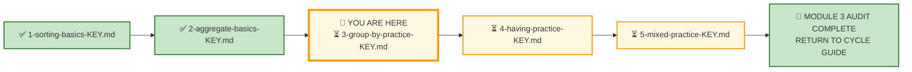
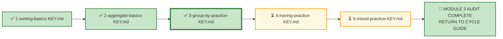

# 🗄️🤖 SQL & GenAI Course
**🎯 Quality Education for Anyone, Anywhere, Anytime — 💫 with Comfort, Convenience at no Cost**

---

## 🔑 File 3: `3-group-by-practice-KEY` (AUDIT Phase)

Welcome to the **Architect's Post‑Mortem**. The execution phase is over. Your queries are saved. Now, we step completely out of the editor and pull back the curtain to reverse-engineer the logical machinery behind **Exercise 3: GROUP BY**.

This is the third AUDIT file for Module 3. Every concept from the AUGMENT phase—the Golden Rule, grouping granularity, multi-column grouping, and derived grouping—is tested here across E‑Store and Hospital Planet.

**Stop typing. Start auditing.**

In production, stakeholders don't ask for "a GROUP BY query." They ask for categorical insights—"Which customers are repeat buyers?" "What's the billing distribution by payment status?" "How does appointment volume trend by month?" Your job is to recognize that these are all `GROUP BY` questions in disguise.

Let's see how your structural decisions hold up under audit.

---

## 🌌 SQLVerse Check-In

<div style="border-left: 4px solid #9c27b0; background-color: #f3e5f5; padding: 15px; margin: 20px 0; border-radius: 0 8px 8px 0;">

### The GROUP BY Master Key

In Exercise 3, you applied `GROUP BY` across two domains: **E‑Store** (your home turf) and **Hospital Planet** (the healthcare operations universe). This answer key doesn't just evaluate your syntax—it evaluates your **grain awareness**.

In production, nobody hands you a beautifully isolated prompt. You get raw business chaos: "Show me repeat buyers," "What's the billing distribution?" "Give me a monthly trend." Anyone can write `GROUP BY`. A true data consultant knows **which grouping dimension** serves the stakeholder and **what grain** the analysis requires.

This key doesn't just give you the answers—it reveals the **architectural assumptions** behind the code. Compare your code, audit your logic, and let's see if your queries are ready for the **live environment.**

🛑 **Audit Protocol:** Don't just check if your query returned the same rows. Check your design. Did you choose the right grouping dimension? Did you respect the Golden Rule? Did you choose the right grain for the business question?

</div>

---

## 📍 Your Current Stage – AUDIT Journey



---

## 🧪 Validation Protocol

Before you consult this AUDIT file:

- [ ] Have you completed all Business Requests in APPLY File 3?
- [ ] Have you saved your queries in your Vault?
- [ ] Have you tested each query and verified the results?
- [ ] Have you considered alternative grouping dimensions for each request?

> 🔁 **Audit Rule:** The solutions below are a reference, not a shortcut. Compare your reasoning, not just your code.

---

# 💎 Phase 1: The Semantic Excavation (Requirement → Gemstone)

Let's dissect the client tickets you resolved across E‑Store and Hospital Planet, exposing the structural geometry buried inside the business prose.

---

## 🛒 Ticket Pair 1: Counting Orders and Revenue (E‑Store)

| Request 1 – Number of Orders per Customer | Request 2 – Total Revenue per Product Category |
|---------------------------------------------|--------------------------------------------------|

---

### Request 1 – Number of Orders per Customer

#### 🪵 Business Language

> "How many orders has each customer placed?"

#### 🧠 Business Context (3‑Question Alignment)

| Perspective | Explanation |
|-------------|-------------|
| **Who is asking?** | Customer Success Team |
| **Why are they asking?** | They need to identify repeat buyers for engagement. |
| **What decision will they make?** | Target repeat customers with loyalty programs. |

#### 💎 Gemstone Extraction

**Pattern Identified:** `GROUP BY` with `COUNT`

The business wants a categorical count—how many orders per customer.

#### 🧭 Technical Translation

```sql
SELECT 
    customer_id AS "Customer ID",
    COUNT(order_id) AS "Number of Orders"
FROM orders
GROUP BY customer_id
ORDER BY customer_id;
```

#### ⚙️ The Choice Pattern

**Why this solution?** The Customer Success Team needs to understand purchasing behaviour. `GROUP BY customer_id` creates groups for each customer, and `COUNT(order_id)` counts orders in each group. `ORDER BY customer_id` presents the results clearly.

#### 📐 Architecture Notes

> `COUNT(order_id)` counts each order. Since `order_id` is the primary key of the `orders` table, this is a direct count of orders per customer. `COUNT(*)` would also work, but `COUNT(order_id)` explicitly signals the intent.

#### 🚨 Common Mistakes

> Students sometimes forget `GROUP BY` and use `COUNT(DISTINCT customer_id)`—which would return only the number of distinct customers, not the count per customer.

> Students may use `COUNT(*)` on the `orders` table without grouping, returning a single total instead of a per-customer breakdown.

> **🔍 Curiosity Prompt:** Ask your Socratic Consultant how you would modify this query to show only customers with more than 2 orders.

#### 🎯 Skill Reinforced

✔ `GROUP BY` for categorical aggregation  
✔ `COUNT(primary_key)` for row count per group  
✔ `ORDER BY` for report presentation

---

### Request 2 – Total Revenue per Product Category

#### 🪵 Business Language

> "Which product categories generate the most revenue?"

#### 🧠 Business Context (3‑Question Alignment)

| Perspective | Explanation |
|-------------|-------------|
| **Who is asking?** | Product Manager |
| **Why are they asking?** | They need to understand category performance. |
| **What decision will they make?** | Allocate marketing and inventory resources. |

#### 💎 Gemstone Extraction

**Pattern Identified:** `GROUP BY` with `SUM` and `JOIN`

The business wants total revenue per category, requiring a `JOIN` across `order_items` and `products`.

#### 🧭 Technical Translation

```sql
SELECT 
    p.category AS "Category",
    ROUND(SUM(oi.quantity * p.price), 2) AS "Total Revenue"
FROM order_items oi
JOIN products p ON oi.product_id = p.product_id
GROUP BY p.category
ORDER BY "Total Revenue" DESC;
```

#### ⚙️ The Choice Pattern

**Why this solution?** The Product Manager needs category performance data. `GROUP BY p.category` creates groups for each category, and `SUM(oi.quantity * p.price)` calculates revenue per category. `ORDER BY Total Revenue DESC` highlights the top-performing categories first.

#### 📐 Architecture Notes

> The `JOIN` between `order_items` and `products` is necessary because the `order_items` table stores `product_id` but not the category or price. This is a classic `GROUP BY` with a `JOIN` pattern.

> > 🏛️ **Architect's Teaser — Module 4 Case Study**
> >
> > This query multiplies the **quantity sold** by the **current price** stored in the `products` table. While this works today, it assumes that product prices never change—a dangerous assumption in production.
> >
> > In Module 4, you will encounter this exact scenario as a case study:
> >
> > **"The Price Freeze"**
> >
> > You will learn:
> > - Why the current design fails when product prices change
> > - How to evolve the schema to freeze prices at the time of order
> > - When to denormalize for historical accuracy
> >
> > **For now, focus on the tools you have. In Module 4, you will extend your toolkit to handle this limitation.**

#### 🚨 Common Mistakes

> Students sometimes forget to `JOIN` the `products` table, attempting to get category from `order_items` directly.

> Students may forget to include the `ROUND` function, presenting unformatted numbers.

> **🔍 Curiosity Prompt:** Ask your Socratic Consultant how you would modify this query to calculate revenue by category and product name.

#### 🎯 Skill Reinforced

✔ `GROUP BY` with `JOIN`  
✔ `SUM()` with arithmetic expressions  
✔ `ROUND()` for professional presentation  
✔ `ORDER BY` for prioritization

---

### 🪞 SQLVerse Pattern Reflection

| Business Request | Skeletal Pattern |
|------------------|------------------|
| Number of Orders per Customer | `COUNT(primary_key) GROUP BY customer_id` |
| Total Revenue per Product Category | `SUM(quantity * price) GROUP BY category` |

**Architect's Observation:** Both requests use `GROUP BY` for categorical aggregation. Request 1 uses a single table (`orders`). Request 2 requires a `JOIN` across `order_items` and `products`. The pattern is the same—only the complexity changes.

The business vocabulary changes. The skeletal pattern remains invariant.

**The nouns change. The logic does not.**

---

## 🏥 Ticket Pair 2: Billing Aggregates (Hospital Planet)

| Request 4 – Total Billing Amount per Payment Status | Request 7 – Total Billing Amount per Treatment Category |
|------------------------------------------------------|--------------------------------------------------------|

---

### Request 4 – Total Billing Amount per Payment Status

#### 🪵 Business Language

> "What is the total billed amount for each payment status?"

#### 🧠 Business Context (3‑Question Alignment)

| Perspective | Explanation |
|-------------|-------------|
| **Who is asking?** | Finance Director |
| **Why are they asking?** | They need to understand billing distribution. |
| **What decision will they make?** | Identify collection priorities and cash flow risks. |

#### 💎 Gemstone Extraction

**Pattern Identified:** `GROUP BY` with `SUM`

The business wants total billed amount per payment status.

#### 🧭 Technical Translation

```sql
SELECT 
    payment_status AS "Payment Status",
    ROUND(SUM(amount), 2) AS "Total Billed Amount"
FROM bills
GROUP BY payment_status
ORDER BY "Total Billed Amount" DESC;
```

#### ⚙️ The Choice Pattern

**Why this solution?** The Finance Director needs billing distribution. `GROUP BY payment_status` creates groups for each status, and `SUM(amount)` calculates the total billed amount per group. `ORDER BY Total Billed Amount DESC` highlights the largest categories first.

#### 📐 Architecture Notes

> `SUM(amount)` aggregates the billed amount for each payment status. This gives a clear picture of where the billing volume is concentrated.

> The `ROUND` function ensures clean presentation.

#### 🚨 Common Mistakes

> Students sometimes forget to use `SUM` and instead use `COUNT`, returning the number of bills per status rather than the total amount.

> Students may overlook the `ROUND` function, presenting unformatted numbers.

#### 🎯 Skill Reinforced

✔ `GROUP BY` with `SUM`  
✔ `ROUND()` for professional presentation  
✔ `ORDER BY` for prioritization

---

### Request 7 – Total Billing Amount per Treatment Category

#### 🪵 Business Language

> "Which treatment categories generate the most billing volume?"

#### 🧠 Business Context (3‑Question Alignment)

| Perspective | Explanation |
|-------------|-------------|
| **Who is asking?** | Revenue Cycle Manager |
| **Why are they asking?** | They need to understand billing volume by treatment category. |
| **What decision will they make?** | Identify high-volume categories for revenue cycle focus. |

#### 💎 Gemstone Extraction

**Pattern Identified:** `GROUP BY` with `SUM` and `JOIN`

The business wants total billing amount per treatment category, requiring a `JOIN` across `appointments`, `treatments`, and `bills`.

---

#### ⚠️ The Trap — Fan‑Out Error

**The Query (Looks Correct, but is Analytically Wrong):**

```sql
SELECT 
    t.category AS "Treatment Category",
    ROUND(SUM(b.amount), 2) AS "Total Billed Amount"
FROM appointments a
JOIN treatments t ON a.treatment_id = t.treatment_id
JOIN bills b ON a.patient_id = b.patient_id
GROUP BY t.category
ORDER BY "Total Billed Amount" DESC;
```

**What happens?**

The query joins `appointments` and `bills` directly on `patient_id`. If a patient has **2 appointments** and **2 bills**, the join produces **4 rows** (2 × 2). `SUM(b.amount)` then double‑counts the bills.

```text
Patient 14
   ├── Appointments: 2 (IDs 17, 21)
   └── Bills: 2 (IDs 18, 22)

JOIN a.patient_id = b.patient_id

Result:
   Row 1: Appointment 17 × Bill 18
   Row 2: Appointment 17 × Bill 22
   Row 3: Appointment 21 × Bill 18
   Row 4: Appointment 21 × Bill 22

SUM(b.amount) = Bill 18 + Bill 22 + Bill 18 + Bill 22 = 2 × (18 + 22) ❌
```

**The SQL pattern may look correct while the analytical result is wrong** because the relationship between the facts is not sufficiently defined.

This is a **fan‑out error** — a classic trap when joining tables at different grains.

---

#### 🏛️ Architect's Finding

> **The requested analysis cannot be reliably produced from the current schema.**

Why?

- `appointments` identifies the treatment category.
- `bills` identifies the billed amount.
- Both are connected to `patients`.
- But `bills` has no `appointment_id` or `treatment_id`.
- Therefore the database cannot determine which bill belongs to which treatment.

> **Joining through `patient_id` does not solve the problem. It creates a many‑to‑many relationship between appointments and bills and can produce fan‑out and misleading billing totals.**

---

#### 🧭 Schema Boundary Warning

The limitation is **not in the SQL**. The limitation is in the **data model**.

The current schema stores:
- Which treatments were performed (via `appointments` → `treatments`)
- Which bills were issued (via `bills` → `patients`)

But it does **not** store:
- Which bill belongs to which treatment

Without this relationship, the database cannot reliably attribute billing volume to treatment categories. Joining through `patient_id` creates fan‑out and produces misleading results.

> This is a preview of the **Architects' Blueprint** case studies, where you will learn how to evolve schemas to represent missing business relationships.

> In Module 4, you will learn how to evolve the Hospital Planet schema to capture this missing relationship—and prevent this gap from recurring.

---

#### 🎯 Skill Reinforced

✔ Grain awareness when joining tables

✔ Fan‑out error detection and correction

✔ Recognizing data model limitations

✔ Knowing when SQL cannot answer a question reliably

---

### 🪞 SQLVerse Pattern Reflection

| Business Request | Skeletal Pattern | Status |
|------------------|------------------|--------|
| Total Billing Amount per Payment Status | `SUM(amount) GROUP BY payment_status` | ✅ Reliable |
| Total Billing Amount per Treatment Category | `SUM(amount) JOIN appointments, treatments, bills` | ⚠️ Not Reliable |

**Architect's Observation:**

Request 4 works because `payment_status` is an attribute of the `bills` table. The grain is correct—one row per bill, grouped by status.

Request 7 reveals a **schema gap**. The relationship between bills and treatments is indirect through `patients`, and `bills` lacks a direct link to `appointments` or `treatments`. Joining through `patient_id` creates fan‑out and does not produce a reliable answer.

---

**The SQL is not the problem. The data model is.**

> **When a business question requires a relationship the schema does not store, SQL cannot invent it.**

This is a preview of the **Architects' Blueprint** case studies, where you will learn to evolve schemas to represent missing business relationships.

The business vocabulary changes. The skeletal pattern remains invariant.

**The nouns change. The logic does not.**

---

## 🏥 Ticket Pair 3: Patient and Appointment Aggregates (Hospital Planet)

| Request 5 – Number of Patients per Status | Request 6 – Total Appointments per Doctor |
|---------------------------------------------|---------------------------------------------|

---

### Request 5 – Number of Patients per Status

#### 🪵 Business Language

> "How many patients are in each status?"

#### 🧠 Business Context (3‑Question Alignment)

| Perspective | Explanation |
|-------------|-------------|
| **Who is asking?** | Operations Director |
| **Why are they asking?** | They need to understand patient distribution. |
| **What decision will they make?** | Resource allocation and patient outreach. |

#### 💎 Gemstone Extraction

**Pattern Identified:** `GROUP BY` with `COUNT`

The business wants a categorical count—how many patients per status.

#### 🧭 Technical Translation

```sql
SELECT 
    status AS "Patient Status",
    COUNT(patient_id) AS "Number of Patients"
FROM patients
GROUP BY status
ORDER BY status;
```

#### ⚙️ The Choice Pattern

**Why this solution?** The Operations Director needs patient distribution. `GROUP BY status` creates groups for each status, and `COUNT(patient_id)` counts patients in each group. `ORDER BY status` presents the results clearly.

#### 📐 Architecture Notes

> `COUNT(patient_id)` counts each patient. Since `patient_id` is the primary key, this is a direct count of patients per status.

#### 🚨 Common Mistakes

> Students sometimes use `COUNT(*)` without considering that `patient_id` is the primary key and is never `NULL`.

> **🔍 Curiosity Prompt:** Ask your Socratic Consultant how you would modify this query to exclude `Inactive` patients.

#### 🎯 Skill Reinforced

✔ `GROUP BY` with `COUNT`  
✔ `ORDER BY` for report presentation

---

### Request 6 – Total Appointments per Doctor

#### 🪵 Business Language

> "How many appointments does each doctor have?"

#### 🧠 Business Context (3‑Question Alignment)

| Perspective | Explanation |
|-------------|-------------|
| **Who is asking?** | Medical Director |
| **Why are they asking?** | They need to understand scheduled appointment workload. |
| **What decision will they make?** | Balance doctor workloads and identify training needs. |

#### 💎 Gemstone Extraction

**Pattern Identified:** `GROUP BY` with `COUNT` and `JOIN`

The business wants appointment count per doctor, requiring a `JOIN` across `appointments` and `doctors`.

#### 🧭 Technical Translation

```sql
SELECT 
    d.first_name || ' ' || d.last_name AS "Doctor Name",
    COUNT(a.appointment_id) AS "Number of Appointments"
FROM appointments a
JOIN doctors d ON a.doctor_id = d.doctor_id
GROUP BY d.doctor_id
ORDER BY "Number of Appointments" DESC;
```

#### ⚙️ The Choice Pattern

**Why this solution?** The Medical Director needs doctor workload data. `GROUP BY d.doctor_id` creates groups for each doctor, and `COUNT(a.appointment_id)` counts appointments in each group. `ORDER BY Number of Appointments DESC` highlights the busiest doctors first.

#### 📐 Architecture Notes

> The `JOIN` between `appointments` and `doctors` is necessary to access the doctor's name. The `GROUP BY` uses `doctor_id` to avoid ambiguity with duplicate names.

> The `||` concatenation operator combines `first_name` and `last_name` into a single column.

#### 🚨 Common Mistakes

> Students sometimes forget to `JOIN` the `doctors` table, attempting to get doctor names from `appointments` directly.

> Students may group by `d.first_name` or `d.last_name` instead of `d.doctor_id`, which can cause issues with duplicate names.

#### 🎯 Skill Reinforced

✔ `GROUP BY` with `JOIN`  
✔ `COUNT()` with `JOIN`  
✔ Concatenation for display purposes  
✔ `ORDER BY` for prioritization

---

### 🪞 SQLVerse Pattern Reflection

| Business Request | Skeletal Pattern |
|------------------|------------------|
| Number of Patients per Status | `COUNT(patient_id) GROUP BY status` |
| Total Appointments per Doctor | `COUNT(appointment_id) JOIN doctors GROUP BY doctor_id` |

**Architect's Observation:** Both requests use `GROUP BY` with `COUNT`. Request 5 uses a single table; Request 6 requires a `JOIN` to access the doctor's name. The pattern is the same—only the complexity changes.

The business vocabulary changes. The skeletal pattern remains invariant.

**The nouns change. The logic does not.**

---

## 🏥 Ticket Pair 4: Cost and Monthly Aggregates (Hospital Planet)

| Request 8 – Average Cost per Treatment Category | Request 9 – Monthly Appointment Volume |
|--------------------------------------------------|-----------------------------------------|

---

### Request 8 – Average Cost per Treatment Category

#### 🪵 Business Language

> "What is the average treatment cost for each treatment category?"

#### 🧠 Business Context (3‑Question Alignment)

| Perspective | Explanation |
|-------------|-------------|
| **Who is asking?** | Pricing Analyst |
| **Why are they asking?** | They need to benchmark treatment costs by category. |
| **What decision will they make?** | Pricing strategy and cost optimization. |

#### 💎 Gemstone Extraction

**Pattern Identified:** `GROUP BY` with `AVG`

The business wants average cost per treatment category.

#### 🧭 Technical Translation

```sql
SELECT 
    category AS "Treatment Category",
    ROUND(AVG(cost), 2) AS "Average Cost"
FROM treatments
GROUP BY category
ORDER BY "Average Cost" DESC;
```

#### ⚙️ The Choice Pattern

**Why this solution?** The Pricing Analyst needs cost benchmarks. `GROUP BY category` creates groups for each category, and `AVG(cost)` calculates the average cost per category. `ORDER BY Average Cost DESC` highlights the most expensive categories first.

#### 📐 Architecture Notes

> `AVG(cost)` calculates the average cost for each treatment category. This gives a clear picture of pricing distribution.

> The `ROUND` function ensures clean presentation.

#### 🚨 Common Mistakes

> Students sometimes use `SUM(cost)` instead of `AVG(cost)`, returning total cost rather than average.

> **🔍 Curiosity Prompt:** Ask your Socratic Consultant how you would modify this query to include only treatments with more than 2 occurrences.

#### 🎯 Skill Reinforced

✔ `GROUP BY` with `AVG`  
✔ `ROUND()` for professional presentation  
✔ `ORDER BY` for prioritization

---

### Request 9 – Monthly Appointment Volume

#### 🪵 Business Language

> "How many appointments are there each month?"

#### 🧠 Business Context (3‑Question Alignment)

| Perspective | Explanation |
|-------------|-------------|
| **Who is asking?** | Operations Director |
| **Why are they asking?** | They need to understand volume trends. |
| **What decision will they make?** | Capacity planning and staffing. |

#### 💎 Gemstone Extraction

**Pattern Identified:** Derived `GROUP BY` with `strftime`

The business wants monthly appointment volume, requiring date extraction and grouping.

#### 🧭 Technical Translation

```sql
SELECT 
    strftime('%Y-%m', appointment_date) AS "Month",
    COUNT(appointment_id) AS "Appointment Count"
FROM appointments
GROUP BY "Month"
ORDER BY "Month";
```

#### ⚙️ The Choice Pattern

**Why this solution?** The Operations Director needs volume trends. `strftime('%Y-%m', appointment_date)` extracts the year-month from the date, and `GROUP BY Month` groups by this derived column. `COUNT(appointment_id)` counts appointments per month. `ORDER BY Month` presents the results chronologically.

#### 📐 Architecture Notes

> `strftime('%Y-%m', appointment_date)` is the SQLite function for extracting year-month from a date. This is a derived grouping—the grouping column does not exist directly in the table.

> The `ORDER BY` uses the month string, which is in `YYYY-MM` format and sorts correctly chronologically.

#### 🚨 Common Mistakes

> Students sometimes group by the raw `appointment_date` instead of the derived month, resulting in daily granularity instead of monthly.

> Students may forget to use `strftime` or use the wrong format, resulting in incorrect grouping.

> **🔍 Curiosity Prompt:** Ask your Socratic Consultant how you would modify this query to show only months with more than 5 appointments.

#### 🎯 Skill Reinforced

✔ Derived `GROUP BY` with `strftime`  
✔ `COUNT()` with derived grouping  
✔ `ORDER BY` for chronological presentation

---

### 🪞 SQLVerse Pattern Reflection

| Business Request | Skeletal Pattern |
|------------------|------------------|
| Average Cost per Treatment Category | `AVG(cost) GROUP BY category` |
| Monthly Appointment Volume | `COUNT(appointment_id) GROUP BY strftime('%Y-%m', appointment_date)` |

**Architect's Observation:** Both requests use `GROUP BY` with an aggregate. Request 8 uses a simple categorical grouping. Request 9 uses a derived grouping—extracting month from a date. The pattern is the same—only the grouping dimension changes.

The business vocabulary changes. The skeletal pattern remains invariant.

**The nouns change. The logic does not.**

---

##  📋 Individual Requests

### Request 3 – Average Order Value per Customer

#### 🪵 Business Language

> "What is the average order value per customer?"

#### 🧠 Business Context (3‑Question Alignment)

| Perspective | Explanation |
|-------------|-------------|
| **Who is asking?** | Finance Team |
| **Why are they asking?** | They need to segment customers by spending behaviour. |
| **What decision will they make?** | Identify high-value customers for targeted campaigns. |

#### 💎 Gemstone Extraction

**Pattern Identified:** Subquery with `GROUP BY` and `AVG`

The business needs the average order value per customer, requiring a subquery to calculate order totals per customer and then `AVG` on that result.

#### 🧭 Technical Translation

```sql
SELECT 
    customer_id AS "Customer ID",
    ROUND(AVG(order_total), 2) AS "Average Order Value"
FROM (
    SELECT 
        o.customer_id,
        o.order_id,
        SUM(oi.quantity * p.price) AS order_total
    FROM orders o
    JOIN order_items oi ON o.order_id = oi.order_id
    JOIN products p ON oi.product_id = p.product_id
    GROUP BY o.customer_id, o.order_id
) AS order_totals
GROUP BY customer_id
ORDER BY customer_id;
```

#### ⚙️ The Choice Pattern

**Why this solution?** The Finance Team needs the average order value per customer. The subquery calculates the total for each order (grouping by `customer_id` and `order_id`). The outer query then averages these order totals per customer. This is a two-step aggregation.

**Alternative Approach (Using CTE):**

```sql
WITH order_totals AS (
    SELECT 
        o.customer_id,
        o.order_id,
        SUM(oi.quantity * p.price) AS order_total
    FROM orders o
    JOIN order_items oi ON o.order_id = oi.order_id
    JOIN products p ON oi.product_id = p.product_id
    GROUP BY o.customer_id, o.order_id
)
SELECT 
    customer_id AS "Customer ID",
    ROUND(AVG(order_total), 2) AS "Average Order Value"
FROM order_totals
GROUP BY customer_id
ORDER BY customer_id;
```

#### 📐 Architecture Notes

> This is a **two-step aggregation** pattern. The inner query calculates order-level totals. The outer query calculates customer-level averages. This is a common pattern for derived metrics.

> The `ORDER BY` is applied to the final result, not the subquery, making the report scannable.

#### 🚨 Common Mistakes

> Students sometimes try to calculate AOV directly in a single query without a subquery, which results in an error or incorrect results.

> Students may forget to include `customer_id` in both the inner `GROUP BY` and the outer `GROUP BY`.

> **🔍 Curiosity Prompt:** Ask your Socratic Consultant what happens to the result if you remove the `ROUND` function.

#### 🎯 Skill Reinforced

✔ Two-step aggregation with subquery  
✔ `AVG()` of derived metric  
✔ `ROUND()` for professional presentation  
✔ `GROUP BY` at multiple grains

---

### 🪞 SQLVerse Pattern Reflection

| Business Request | Skeletal Pattern |
|------------------|------------------|
| Average Order Value per Customer | Subquery → `SUM(quantity * price) GROUP BY customer_id, order_id` → `AVG(order_total) GROUP BY customer_id` |

**Architect's Observation:** This request requires two levels of aggregation—order-level totals first, then customer-level averages. The `GROUP BY` grain changes between the inner and outer query.

The business vocabulary changes. The skeletal pattern remains invariant.

**The nouns change. The logic does not.**


---

### Request 10 – Monthly Billing Amount from Paid Bills

#### 🪵 Business Language

> "What is the monthly billing amount from paid bills?"

#### 🧠 Business Context (3‑Question Alignment)

| Perspective | Explanation |
|-------------|-------------|
| **Who is asking?** | Finance Director |
| **Why are they asking?** | They need to track monthly billing trends. |
| **What decision will they make?** | Financial forecasting and trend analysis. |

#### 💎 Gemstone Extraction

**Pattern Identified:** Derived `GROUP BY` with `SUM` and `WHERE`

The business wants monthly billing amount from paid bills, requiring date extraction, filtering, and aggregation.

#### 🧭 Technical Translation

```sql
SELECT 
    strftime('%Y-%m', bill_date) AS "Month",
    ROUND(SUM(amount), 2) AS "Monthly Billing Amount"
FROM bills
WHERE payment_status = 'Paid'
GROUP BY "Month"
ORDER BY "Month";
```

#### ⚙️ The Choice Pattern

**Why this solution?** The Finance Director needs monthly billing trends. `strftime('%Y-%m', bill_date)` extracts the year-month from the date, and `GROUP BY Month` groups by this derived column. `SUM(amount)` calculates the total billing amount for each month. `WHERE payment_status = 'Paid'` filters to only paid bills. `ORDER BY Month` presents the results chronologically.

#### 📐 Architecture Notes

> The `WHERE` clause filters the data **before** grouping, ensuring that only paid bills are included in the aggregate. This is the correct execution order.

> The `ROUND` function ensures clean presentation.

#### 🚨 Common Mistakes

> Students sometimes forget the `WHERE` filter, including all bills regardless of payment status.

> Students may group by the raw `bill_date` instead of the derived month, resulting in daily granularity instead of monthly.

> **🔍 Curiosity Prompt:** Ask your Socratic Consultant how you would modify this query to include only bills with `payment_status = 'Paid'`.

#### 🎯 Skill Reinforced

✔ Derived `GROUP BY` with `strftime`  
✔ `SUM()` with `WHERE` filter  
✔ `ORDER BY` for chronological presentation

---

### 🪞 SQLVerse Pattern Reflection

| Business Request | Skeletal Pattern |
|------------------|------------------|
| Monthly Billing Amount from Paid Bills | `SUM(amount) WHERE payment_status = 'Paid' GROUP BY strftime('%Y-%m', bill_date)` |

**Architect's Observation:** This request combines filtering (`WHERE`), derived grouping (`strftime`), and aggregation (`SUM`). The `WHERE` clause filters rows before grouping, ensuring the aggregation is performed on only the relevant data.

The business vocabulary changes. The skeletal pattern remains invariant.

**The nouns change. The logic does not.**

---

## 📋 Section 3: Executive Desk – Integrated Challenge

### Request 11 – Executive Hospital Billing & Utilization Report

#### 🪵 Business Language

> *"Give me a high-level strategic overview of our hospital's performance. I need to understand billing distribution by payment status, appointment volume by doctor, and monthly trends in billing and appointments."*

#### 🧠 Business Context (3‑Question Alignment)

| Perspective | Explanation |
|-------------|-------------|
| **Who is asking?** | Chief Financial Officer (CFO) |
| **Why are they asking?** | They need an executive summary for strategic planning. |
| **What decision will they make?** | Resource allocation, financial planning, and operational improvements. |

#### 💎 Gemstone Extraction

**Pattern Identified:** Dashboard Design with Multiple Analytical Views

This is an open-ended request requiring multiple queries, each addressing a different analytical dimension and grain.

#### 🧭 Technical Translation (Defensible Interpretation)

```sql
/*
================================================================================
ARCHITECT ASSUMPTIONS & DESIGN NOTES:

1. The CFO needs a strategic overview across multiple dimensions:
   - Financial: Billing distribution by payment status
   - Operational: Appointment volume by doctor
   - Temporal: Monthly trends in billing and appointments

2. These dimensions have different analytical grains:
   - Payment status → billing-level grain
   - Doctor workload → appointment-level grain
   - Monthly trends → calendar-month grain

3. Forcing these into a single query would create grain collision.
   Therefore, multiple purpose-built queries are used.

4. Aliases are applied for board-readability.
5. Results are sorted to highlight the most important patterns first.
================================================================================
*/

-- View 1: Billing Distribution by Payment Status (Financial View)
-- Grain: Billing level | Dimension: Payment Status | Metric: Total Billed Amount
SELECT 
    payment_status AS "Payment Status",
    ROUND(SUM(amount), 2) AS "Total Billed Amount",
    COUNT(bill_id) AS "Number of Bills"
FROM bills
GROUP BY payment_status
ORDER BY "Total Billed Amount" DESC;

-- View 2: Appointment Volume by Doctor (Operational View)
-- Grain: Appointment level | Dimension: Doctor | Metric: Appointment Count
SELECT 
    d.first_name || ' ' || d.last_name AS "Doctor Name",
    COUNT(a.appointment_id) AS "Appointment Count"
FROM appointments a
JOIN doctors d ON a.doctor_id = d.doctor_id
GROUP BY d.doctor_id
ORDER BY "Appointment Count" DESC;

-- View 3: Monthly Billing Trends (Temporal View)
-- Grain: Calendar month | Dimension: Time | Metric: Monthly Billing Amount
SELECT 
    strftime('%Y-%m', bill_date) AS "Month",
    ROUND(SUM(amount), 2) AS "Monthly Billing Amount",
    COUNT(bill_id) AS "Number of Bills"
FROM bills
GROUP BY "Month"
ORDER BY "Month";

-- View 4: Monthly Appointment Trends (Temporal View)
-- Grain: Calendar month | Dimension: Time | Metric: Appointment Count
SELECT 
    strftime('%Y-%m', appointment_date) AS "Month",
    COUNT(appointment_id) AS "Appointment Count"
FROM appointments
GROUP BY "Month"
ORDER BY "Month";
```

#### ⚙️ The Choice Pattern

**Why this solution?** The CFO needs a strategic overview across multiple dimensions. Four purpose-built queries address the key analytical dimensions:

1. **Financial View:** Billing distribution by payment status
2. **Operational View:** Appointment volume by doctor
3. **Temporal View 1:** Monthly billing trends
4. **Temporal View 2:** Monthly appointment trends

Each query respects its analytical grain and answers a distinct business question.

---

### 💡 Executive Concept: The "Dashboard Mindset" vs. "One Giant Query"

When executive requests ask for multiple dimensions—such as payment status, physician workload, and monthly trends—novice analysts often attempt to force everything into a single SQL query.

But stop and ask:

**What does an executive actually need to see?**

The CFO did not ask for a single SQL table.

The CFO asked for a **business picture**.

The requested information contains different analytical dimensions and different grains:

- payment status
- doctor
- month
- billed amount
- appointment volume

Trying to force all of these into one result set can make the analysis harder to understand and, in some cases, analytically incorrect.

In SQL, forcing non-related analytical grains into a single result set leads to two major hazards:

### ⚠️ Two Hazards

**1. Grain Collision**

Payment status is analyzed at the **billing level**.
Doctor workload is analyzed at the **appointment level**.
Monthly trends are analyzed at the **calendar-month level**.

If unrelated analytical grains are forced together through joins or aggregations, you can create **row multiplication, fan-out, and misleading totals**.

**2. Cognitive Overload**

Executives do not want a noisy 50-column matrix.

They want **clear, digestible signals** that answer specific business questions.

Therefore, when the requested information spans distinct analytical grains, the appropriate response is to create **multiple purpose-built analytical views.**

---

### 🔑 KEY — Multiple Queries and Multiple Result Sets

🧠 What does this point to?

> ## AN EXECUTIVE DASHBOARD

A dashboard is not necessarily one query.

It is a collection of **purpose-built analytical views** assembled to answer a larger business question.

Therefore:

> **When an executive request contains multiple distinct analytical views, think Dashboard Analysis—not One Giant Query.**

```text
              ┌──────────────────────────────────────────────┐
              │          THE DASHBOARD APPROACH              │
              └──────────────────────┬───────────────────────┘
                                     │
              ┌──────────────────────┼──────────────────────┐
              ▼                      ▼                      ▼
       [ Financial View ]     [ Workload View ]       [ Trend Views ]
       Grain: Billing         Grain: Appointment     Grain: Month
       Dimension: Status      Dimension: Doctor      Dimension: Time
       Metric: Amount         Metric: Count          Metrics: Amount / Appointments
```

### 📌 The Rule of Executive Reporting

> **When an executive brief spans multiple distinct analytical grains, deliver a Dashboard Analysis—a set of purpose-built SQL views—rather than one forced, bloated query.**

Different **Dimensions**

Different **Grains**

Different **Analytical views**

### **One Executive Dashboard**

### **Answering Critical Business Questions**

---

### 🎯 Key Learning Takeaways

- **Respect the Grain:** Never combine mismatched analytical grains unless the data model and query design explicitly support the relationship without unintended duplication.

- **Purpose-Built Views:** Think of each SQL query as a **widget on an executive dashboard**. Each query should answer one high-stakes business question with precision.

- **Business Communication Over Syntax:** The best analyst isn't the one who writes the longest query. It is the one who provides the **fastest path to clarity for leadership**.

---

### 🪞 SQLVerse Pattern Reflection

**Skeletal Pattern:** **Dashboard Analysis — Purpose-Built Views**

**SQL Vehicle:** `SELECT → FROM → JOIN → WHERE → GROUP BY → ORDER BY`

This exercise is not about `GROUP BY` alone.

**It is about the complete decision pipeline:**

 - What dimensions does the stakeholder need?
 - What grain is appropriate for each dimension?
 - What metrics tell the story?

**This is the core of executive reporting.**

 - **Define** what matters. 
 - **Filter** to that definition.    
 - **Group** appropriately.    
 - **Present** clearly.

**The pattern is simple—the judgment lies in the definition.**

The business vocabulary changes. The skeletal pattern remains invariant.

**The nouns change. The logic does not.**

---

# 🌲 Phase 2: Skill‑Tree Update

Your portfolio isn't measured by the volume of lines you wrote; it is verified by the competencies you demonstrated. Below are the structural data matrices you have earned through this audit. Ensure your internal **Gemstone Array** has recorded these updates before moving forward.

```text
📦 [skills_level1]        ──> Unlocked: Single-Column GROUP BY, GROUP BY with JOIN, Derived GROUP BY, Multi-Table GROUP BY, Dashboard Analysis Design
💡 [insights_level1]      ──> Recorded: GROUP BY is an Analytical Boundary Definition, Grain Awareness, Dashboard Mindset
🏆 [achievements_level1]  ──> Certified: Sprint Milestone [L1‑M3‑EX3‑AUDIT] Complete
```

---

## 💎 Gemstone Array Update

### 📂 Gemstone Array Entry 1: Competency Mapping (`skills_level1`)

| Skill Code | Skill Name | Description |
|------------|------------|-------------|
| `SKL‑L1‑M3‑015` | Single-Column GROUP BY | Used `GROUP BY` with `COUNT` and `SUM` on single columns |
| `SKL‑L1‑M3‑016` | GROUP BY with JOIN | Used `GROUP BY` across joined tables |
| `SKL‑L1‑M3‑017` | Derived GROUP BY | Used `strftime` to group by derived date dimensions |
| `SKL‑L1‑M3‑018` | Grain-Aware Multi-Table Aggregation | Used `GROUP BY` with multiple joins while evaluating table grain, relationship cardinality, and the risk of fan-out. |
| `SKL‑L1‑M3‑019` | Dashboard Analysis Design | Designed multiple purpose-built analytical views for executive reporting |

---

### 📂 Gemstone Array Entry 2: Architectural Insights (`insights_level1`)

| Insight ID | Title | Extraction |
|------------|-------|------------|
| `INS‑L1‑M3‑008` | GROUP BY is an Analytical Boundary Definition | The choice of grouping dimension determines what patterns are revealed and who the analysis serves. |
| `INS‑L1‑M3‑009` | Grain Awareness | Different analytical dimensions require different grains. Forcing mismatched grains into a single query leads to grain collision. |
| `INS‑L1‑M3‑010` | Dashboard Mindset | When an executive request spans multiple dimensions and grains, think Dashboard Analysis—not One Giant Query. |

---

### 📂 Gemstone Array Entry 3: Milestone Certification (`achievements_level1`)

| Achievement Code | Title | Verification Status |
|------------------|-------|---------------------|
| `ACH‑L1‑M3‑AUD03` | Master Architect Sign‑Off: GROUP BY | Verified against logical, business, and operational correctness metrics. The Module 3 lab execution cycle is formally declared frozen and production-oriented. |

---

> 📘 **Skill‑Tree Update Reminder:** Keep updating the Gemstone Array throughout this AUDIT cycle. After you complete the full AUDIT cycle (all 5 files), use the **ETL Workflow** provided in [`SKILL_TREE_ARCHITECTURE.md`](../../../Guides/SKILL_TREE_ARCHITECTURE.md) to persist your gemstones into your permanent Skill‑Tree database.

---

# 🏛️ Phase 3: The Vault Manifest (Verification Ledger)

Compare the skeletal structural patterns of your work against the verified production baseline. If your syntax achieved the exact same logical, business, and operational correctness, tick the verification box.

---

## 🛒 Section 1: Workshop Floor – E‑Store

```sql
-- Request 1: Number of Orders per Customer
SELECT 
    customer_id AS "Customer ID",
    COUNT(order_id) AS "Number of Orders"
FROM orders
GROUP BY customer_id
ORDER BY customer_id;

-- Request 2: Total Revenue per Product Category
SELECT 
    p.category AS "Category",
    ROUND(SUM(oi.quantity * p.price), 2) AS "Total Revenue"
FROM order_items oi
JOIN products p ON oi.product_id = p.product_id
GROUP BY p.category
ORDER BY "Total Revenue" DESC;

-- Request 3: Average Order Value per Customer
SELECT 
    customer_id AS "Customer ID",
    ROUND(AVG(order_total), 2) AS "Average Order Value"
FROM (
    SELECT 
        o.customer_id,
        o.order_id,
        SUM(oi.quantity * p.price) AS order_total
    FROM orders o
    JOIN order_items oi ON o.order_id = oi.order_id
    JOIN products p ON oi.product_id = p.product_id
    GROUP BY o.customer_id, o.order_id
) AS order_totals
GROUP BY customer_id
ORDER BY customer_id;
```

---

## 🏥 Section 2: Production Echo – Hospital Planet

```sql
-- Request 4: Total Billing Amount per Payment Status
SELECT 
    payment_status AS "Payment Status",
    ROUND(SUM(amount), 2) AS "Total Billed Amount"
FROM bills
GROUP BY payment_status
ORDER BY "Total Billed Amount" DESC;

-- Request 5: Number of Patients per Status
SELECT 
    status AS "Patient Status",
    COUNT(patient_id) AS "Number of Patients"
FROM patients
GROUP BY status
ORDER BY status;

-- Request 6: Total Appointments per Doctor
SELECT 
    d.first_name || ' ' || d.last_name AS "Doctor Name",
    COUNT(a.appointment_id) AS "Number of Appointments"
FROM appointments a
JOIN doctors d ON a.doctor_id = d.doctor_id
GROUP BY d.doctor_id
ORDER BY "Number of Appointments" DESC;

-- Request 7: Total Billing Amount per Treatment Category
-- The Request reveals a schema gap. 
-- The relationship between bills and treatments is indirect through patients, and bills lacks a direct link to appointments or treatments. 
-- Joining through patient_id creates fan‑out and does not produce a reliable answer.

-- No reliable SQL solution exists against the current schema.

-- Request 8: Average Cost per Treatment Category
SELECT 
    category AS "Treatment Category",
    ROUND(AVG(cost), 2) AS "Average Cost"
FROM treatments
GROUP BY category
ORDER BY "Average Cost" DESC;

-- Request 9: Monthly Appointment Volume
SELECT 
    strftime('%Y-%m', appointment_date) AS "Month",
    COUNT(appointment_id) AS "Appointment Count"
FROM appointments
GROUP BY "Month"
ORDER BY "Month";

-- Request 10: Monthly Billing Amount from Paid Bills
SELECT 
    strftime('%Y-%m', bill_date) AS "Month",
    ROUND(SUM(amount), 2) AS "Monthly Billing Amount"
FROM bills
WHERE payment_status = 'Paid'
GROUP BY "Month"
ORDER BY "Month";
```

---

## 📋 Section 3: Executive Desk – Integrated Challenge

```sql
-- Request 11: Executive Hospital Billing & Utilization Report
/*
================================================================================
ARCHITECT ASSUMPTIONS & DESIGN NOTES:

1. The CFO needs a strategic overview across multiple dimensions:
   - Financial: Billing distribution by payment status
   - Operational: Appointment volume by doctor
   - Temporal: Monthly trends in billing and appointments

2. These dimensions have different analytical grains:
   - Payment status → billing-level grain
   - Doctor workload → appointment-level grain
   - Monthly trends → calendar-month grain

3. Forcing these into a single query would create grain collision.
   Therefore, multiple purpose-built queries are used.

4. Aliases are applied for board-readability.
5. Results are sorted to highlight the most important patterns first.
================================================================================
*/

-- View 1: Billing Distribution by Payment Status (Financial View)
SELECT 
    payment_status AS "Payment Status",
    ROUND(SUM(amount), 2) AS "Total Billed Amount",
    COUNT(bill_id) AS "Number of Bills"
FROM bills
GROUP BY payment_status
ORDER BY "Total Billed Amount" DESC;

-- View 2: Appointment Volume by Doctor (Operational View)
SELECT 
    d.first_name || ' ' || d.last_name AS "Doctor Name",
    COUNT(a.appointment_id) AS "Appointment Count"
FROM appointments a
JOIN doctors d ON a.doctor_id = d.doctor_id
GROUP BY d.doctor_id
ORDER BY "Appointment Count" DESC;

-- View 3: Monthly Billing Trends (Temporal View)
SELECT 
    strftime('%Y-%m', bill_date) AS "Month",
    ROUND(SUM(amount), 2) AS "Monthly Billing Amount",
    COUNT(bill_id) AS "Number of Bills"
FROM bills
GROUP BY "Month"
ORDER BY "Month";

-- View 4: Monthly Appointment Trends (Temporal View)
SELECT 
    strftime('%Y-%m', appointment_date) AS "Month",
    COUNT(appointment_id) AS "Appointment Count"
FROM appointments
GROUP BY "Month"
ORDER BY "Month";
```

---

## ✅ Verification Sign‑Off

- [ ] My queries returned the expected results.
- [ ] My reasoning matched the gemstone extraction patterns.
- [ ] I have updated my Skill‑Tree with the competencies demonstrated.
- [ ] I understand the Golden Rule of `GROUP BY`.
- [ ] I understand how grouping granularity affects business interpretation.
- [ ] I can identify when an executive request requires multiple analytical views.

---

## 🧭 Exit Reflection

Stop writing code. Step completely out of the technical layer and answer these three architectural reflection questions inside your personal design log:

**1. The Golden Rule Layer:** In Request 2, you grouped by `category` and used `SUM(oi.quantity * p.price)`. In Request 7, you grouped by `t.category` and used `SUM(b.amount)`. What is the Golden Rule of `GROUP BY`? What does it tell you about the relationship between the selected columns, the grouping columns, and the aggregate?

**2. The Granularity Layer:** In Request 9, you used `strftime('%Y-%m', appointment_date)` to group by month. In Request 10, you used the same derived grouping for billing. Why is grouping by the raw date column inappropriate for these requests? What would happen if you grouped by the raw date instead?

**3. The Schema Completeness Layer:** In File 2, you encountered a Data Gap Audit where `listing_date` and `total_area_in_squarefeet` were missing from the `properties` table. What business questions become impossible to answer without these fields? What would you do if a stakeholder demanded an answer despite the data gap?

#### A. Impossible Business Questions (Without `listing_date` and `total_area_in_squarefeet`)

1. **Inventory Velocity / Days on Market (DOM):** *"How long do properties remain listed before selling, and are active listings aging out?"* → Impossible without `listing_date`.

2. **Valuation Unit Economics:** *"What is the average price per square foot ($/sqft) across property types?"* → Impossible without `total_area_in_squarefeet`.

3. **Appraisal & Pricing Accuracy:** *"Is a property's high list price explained by its physical size, or is it unusually expensive relative to comparable properties?"* → Impossible to evaluate on a price-per-square-foot basis without `total_area_in_squarefeet`.

**Architectural Lesson:**

> **"Impossible to compute reliably" ≠ "SQL doesn't know how."**

SQL is perfectly capable of doing the arithmetic. The problem is: **the required business facts aren't represented in the schema.**

#### B. Managing Demanding Stakeholders During a Data Gap

When a stakeholder demands metrics that the current schema cannot compute:

1. **Issue a Data Deficit Note:** Formally document the gap including the missing columns, affected business metrics, and architectural root cause.

2. **Reject Data Fabrication:** Never invent proxy metrics—for example, estimating square footage or assuming arbitrary listing dates—simply to make a query return a result. Reporting false precision creates severe financial liability.

3. **Offer an Immediate Alternative & Bridge:**
   - **Immediate:** Provide actionable proxies using available data. For example: *"We cannot provide $/sqft yet, but here is the median list price distribution by status and property type."*
   - **Roadmap:** Submit a DDL migration proposal in Module 4 to backfill missing attributes and unlock full analytical capability.

---

## 💎 DESIGNER'S PERIGON

### *The Art of Professional Judgment*

Let us say an E-Commerce firm is running a Christmas discount sale for all their products for 3 weeks starting from mid December.

**What does the CEO need to see in the Dashboard—refreshed every 15 minutes?**

#### 📊 The Dashboard

- Sales data grouped by product categories
- Inventory levels grouped by product categories
- Fast-moving items in each product category
- Slow-moving items in each product category
- Non-moving items in each product category
- Real-time Cloud Server Performance to identify performance drops
- Site traffic as number of users spike
- War room updates from VP of Engineering and Infrastructure

---

**The Trap:**

Running a single giant query that attempts to join unrelated analytical grains across 10+ tables will be **clumsy, confusing, and chaotic.**

An SQLVerse Artisan never writes queries to flaunt their ability to handle complex patterns. They write queries to fetch just the relevant information needed for the Business—**nothing more, nothing less.**

Writing **eight purpose-built queries**—each answering one clearly defined business question—is the prudent judgment an SQLVerse Artisan will make.

---
### 🏛️ The Architectural Commentary of Multi-View Executive Reporting

The CEO's questions naturally have **different dimensions, grains, refresh characteristics, and even different source systems**.

Choosing 8 decoupled queries over 1 monolithic query isn't just a cosmetic preference—it is a critical system architecture decision driven by three real-world constraints:

1. **Heterogeneous Data Sources**
   - Site traffic and cloud server performance metrics live in time-series telemetry databases (like Datadog or Prometheus).
   - Inventory levels live in an ERP/WMS database.
   - Sales transactions live in the primary OLTP database.
   - War-room updates come from data feed.
   - A single SQL query cannot—and should not—try to cross-join distinct physical engines.

2. **Database Engine Resilience & Blast Radius**
   - Executing an 8-table `JOIN` with window functions every 15 minutes during peak Christmas traffic risks lock escalation, heavy CPU contention, and pulling resources away from customer checkout flows.
   - Decoupled, single-purpose queries isolate failure: if the "slow-moving items" query takes 4 seconds due to an index scan, it will not block the CEO from seeing real-time sales volume or server health.

3. **Asynchronous Cache & Refresh Rates**
   - Server health spikes need 10-second refreshes; product category sales only need 15-minute refreshes; slow-moving inventory analysis might only need hourly updates.
   - Decoupling queries allows each widget on the dashboard to cache and refresh at its precise operational frequency.

---

**A dashboard is not a database table.**

**SQL is a vehicle for answering business questions—not the dashboard itself.**

An executive dashboard may combine SQL-based analytical views with monitoring systems, application telemetry, incident-management systems, and other operational feeds.

It is an **assembled business picture**.

---

### 🧠 The Key Takeaway

Learn to organize, present, and reason like a professional.

You now know enough SQL. The focus is on **refined thinking and judgment**.

A Dashboard is about **presentation**.

> **The same data can tell very different stories depending on how it's organized and presented.**

That is the difference between a technician and a professional.

The technician writes a query that works.

The professional writes a query that serves.

**The business vocabulary changes. The skeletal pattern remains invariant.**

**The nouns change. The logic does not.**

---

## 🔁 Bridge Forward



You have audited **GROUP BY** across E‑Store and Hospital Planet. The gemstones are extracted, your Skill‑Tree is updated, and you have proven that grouping logic is truly domain‑invariant.

**Next: HAVING AUDIT.**

| Previous Step | Next Step |
|:---:|:---:|
| [← Return to APPLY File 3](./3-group-by-practice-LAB.md) | [Continue to 4-having-practice-KEY.md →](./4-having-practice-KEY.md) |

---

*Part of our mission for 🎯 Quality Education for Anyone, Anywhere, Anytime — 💫 with Comfort, Convenience at no Cost.*

**Level 1 | ACCELERATE Phase | AUDIT | Module 3 | File 3**

