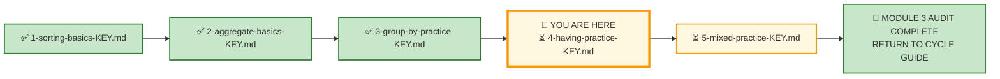
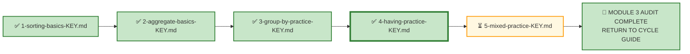

# 🗄️🤖 SQL & GenAI Course
**🎯 Quality Education for Anyone, Anywhere, Anytime — 💫 with Comfort, Convenience at no Cost**

---

## 🔑 File 4: `4-having-practice-KEY` (AUDIT Phase)

Welcome to the **Architect's Post‑Mortem**. The execution phase is over. Your queries are saved. Now, we step completely out of the editor and pull back the curtain to reverse-engineer the logical machinery behind **Exercise 4: HAVING**.

This is the fourth AUDIT file for Module 3. Every concept from the AUGMENT phase—the distinction between `WHERE` and `HAVING`, group-level filtering, and the logical sequence—is tested here across E‑Store and FinVERSE.

**Stop typing. Start auditing.**

In production, stakeholders don't ask for "a HAVING query." They ask for thresholds: "Show me customers with more than 3 orders," "Which categories exceeded 15,000 in revenue?" "Who has more than 1 open ticket?" Your job is to recognize that these are all `HAVING` questions in disguise.

Let's see how your structural decisions hold up under audit.

---

## 🌌 SQLVerse Check-In

<div style="border-left: 4px solid #9c27b0; background-color: #f3e5f5; padding: 15px; margin: 20px 0; border-radius: 0 8px 8px 0;">

### The HAVING Master Key

In Exercise 4, you applied `HAVING` across two domains: **E‑Store** (your home turf) and **FinVERSE** (the flagship enterprise universe). This answer key doesn't just evaluate your syntax—it evaluates your **threshold judgment**.

In production, nobody hands you a beautifully isolated prompt. You get raw business chaos: "Show me high-value customers," "Which categories exceeded the threshold?" "Who has multiple open tickets?" Anyone can write `HAVING`. A true data consultant knows **which threshold** serves the stakeholder and **what grain** the analysis requires.

This key doesn't just give you the answers—it reveals the **architectural assumptions** behind the code. Compare your code, audit your logic, and let's see if your queries are ready for the **live environment.**

🛑 **Audit Protocol:** Don't just check if your query returned the same rows. Check your design. Did you use `WHERE` when you should have used `HAVING`? Did you choose the right threshold? Did you handle the logical sequence correctly?

</div>

---

## 📍 Your Current Stage – AUDIT Journey



---

## 🧪 Validation Protocol

Before you consult this AUDIT file:

- [ ] Have you completed all Business Requests in APPLY File 4?
- [ ] Have you saved your queries in your Vault?
- [ ] Have you tested each query and verified the results?
- [ ] Have you considered alternative thresholds for each request?

> 🔁 **Audit Rule:** The solutions below are a reference, not a shortcut. Compare your reasoning, not just your code.

---

# 💎 Phase 1: The Semantic Excavation (Requirement → Gemstone)

Let's dissect the client tickets you resolved across E‑Store and FinVERSE, exposing the structural geometry buried inside the business prose.

---

## 🛒 Ticket Pair 1: Customer and Category Thresholds (E‑Store)

| Request 1 – High-Value Customers | Request 2 – High-Performing Product Categories |
|-----------------------------------|-------------------------------------------------|

---

### Request 1 – High-Value Customers

#### 🪵 Business Language

> "Show me customers who have placed more than 3 orders."

#### 🧠 Business Context (3‑Question Alignment)

| Perspective | Explanation |
|-------------|-------------|
| **Who is asking?** | Customer Success Team |
| **Why are they asking?** | They need to identify repeat buyers for loyalty programs. |
| **What decision will they make?** | Target repeat customers with loyalty rewards. |

#### 💎 Gemstone Extraction

**Pattern Identified:** `GROUP BY` with `HAVING COUNT(*) > N`

The business wants a count of orders per customer, filtered to those exceeding a threshold.

#### 🧭 Technical Translation

```sql
SELECT 
    customer_id AS "Customer ID",
    COUNT(order_id) AS "Order Count"
FROM orders
GROUP BY customer_id
HAVING COUNT(order_id) > 3
ORDER BY "Order Count" DESC;
```

#### ⚙️ The Choice Pattern

**Why this solution?** The Customer Success Team needs repeat buyers. `GROUP BY customer_id` creates groups for each customer, and `HAVING COUNT(order_id) > 3` filters to customers with more than 3 orders. `ORDER BY Order Count DESC` highlights the most frequent buyers first.

#### 📐 Architecture Notes

> `HAVING` runs after `GROUP BY`, so `COUNT(order_id)` is available for filtering. `WHERE` cannot be used here because it runs before grouping.

#### 🚨 Common Mistakes

> Students sometimes use `WHERE COUNT(order_id) > 3`, which fails because `WHERE` cannot see aggregates.
>
> Students may forget to include `ORDER BY`, making the list harder to scan.

#### 🎯 Skill Reinforced

✔ `GROUP BY` with `HAVING COUNT(*) > N`
✔ Understanding when to use `HAVING` vs `WHERE`
✔ `ORDER BY` for prioritization

---

### Request 2 – High-Performing Product Categories

#### 🪵 Business Language

> "Show me product categories with total sales exceeding 15,000 from completed orders."

#### 🧠 Business Context (3‑Question Alignment)

| Perspective | Explanation |
|-------------|-------------|
| **Who is asking?** | E-Commerce Director |
| **Why are they asking?** | They need to allocate Q4 marketing budgets to high-performing categories. |
| **What decision will they make?** | Allocate marketing spend to top-performing categories. |

---
#### ⚠️ KEY Observation — Data Model Gap

The request asks us to consider only **completed orders**, but the current Level 1 E-Store schema does not contain an `order_status` column.

For this Level 1 exercise, we make an explicit temporary assumption: **because the current schema cannot distinguish completed, pending, cancelled, or refunded orders, all recorded orders are treated as qualifying orders for this analysis.**

This is an analytical assumption made to work within the current Level 1 schema—not a universal business rule.

In Module 4, when we examine schema design and data-model gaps more deeply, the E-Store model will be extended to represent order lifecycle status explicitly.

**Key Takeaway:** When the data model cannot express the business condition, SQL cannot magically know the answer.

---

#### 💎 Gemstone Extraction

**Pattern Identified:** `GROUP BY` with `HAVING SUM() > N` and `JOIN`

The business wants revenue per category, filtered to those exceeding a threshold, from completed orders.

The business request uses the phrase "average order value." For this Level 1 exercise, we deliberately interpret it as average item-level revenue per category, filtered to categories exceeding a threshold.

#### 🧭 Technical Translation

```sql
SELECT 
    p.category AS "Category",
    ROUND(SUM(oi.quantity * p.price), 2) AS "Total Revenue",
    COUNT(DISTINCT o.order_id) AS "Total Orders"
FROM orders o
JOIN order_items oi ON o.order_id = oi.order_id
JOIN products p ON oi.product_id = p.product_id
GROUP BY p.category
HAVING SUM(oi.quantity * p.price) > 15000
ORDER BY "Total Revenue" DESC;
```

#### ⚙️ The Choice Pattern

**Why this solution?** The E-Commerce Director needs high-performing categories. `GROUP BY p.category` creates groups for each category, and `HAVING SUM(oi.quantity * p.price) > 15000` filters to categories exceeding the threshold. `ORDER BY Total Revenue DESC` highlights the top performers first.

#### 📐 Architecture Notes

> `COUNT(DISTINCT o.order_id)` ensures each order is counted only once per category, even if multiple items from the same order belong to the same category.

#### 🚨 Common Mistakes

> Students sometimes use `WHERE` to filter the aggregate, which fails because `WHERE` runs before grouping.
>
> Students may forget to use `DISTINCT` in `COUNT(DISTINCT o.order_id)`, inflating the order count.

#### 📌 KEY Observation — Data Model / Schema Gap

> 🏛️ **Module 4 Bridge:** The Order Status Gap will be addressed as a **Schema Satellite** in Module 4, where we will evolve the E-Store schema to support order lifecycle tracking.

#### 🎯 Skill Reinforced

✔ `GROUP BY` with `HAVING SUM() > N`
✔ `JOIN` across multiple tables
✔ `COUNT(DISTINCT)` for accurate order counting
✔ Schema gap identification

---

### 🪞 SQLVerse Pattern Reflection

| Business Request | Skeletal Pattern |
|------------------|------------------|
| High-Value Customers | `COUNT(order_id) GROUP BY customer_id HAVING COUNT(*) > 3` |
| High-Performing Product Categories | `SUM(quantity * price) GROUP BY category HAVING SUM(*) > 15000` |

**Architect's Observation:** Both requests use `GROUP BY` with `HAVING` to filter groups based on aggregate thresholds. The pattern is the same—only the entity, aggregate, and threshold change.

The business vocabulary changes. The skeletal pattern remains invariant.

**The nouns change. The logic does not.**

---

## 🛒 Individual Request: Average Order Value Threshold (E‑Store)

### Request 3 – Product Categories with High Average Order Value

#### 🪵 Business Language

> "Show me product categories where the average order value exceeds 500."

#### 🧠 Business Context (3‑Question Alignment)

| Perspective | Explanation |
|-------------|-------------|
| **Who is asking?** | Finance Team |
| **Why are they asking?** | They want to identify high-value categories. |
| **What decision will they make?** | Focus on categories with high average order value. |

---
#### ⚠️ KEY Observation — Analytical Grain Ambiguity

The phrase **"average order value"** sounds unambiguous to beginners but is not necessarily unambiguous analytically.

The term sounds straightforward to non-technical stakeholders, but contains a structural grain ambiguity when applied to a multi-product relational schema:

- **Interpretation A (Item-Level Value / Revenue Grain):** Calculates the Average Item Value i.e.  average of `quantity * price` across all line items belonging to a category:
  
   $$\text{AVG}(oi.quantity \times p.price)$$

- **Interpretation B (True Order-Level Category Grain):** Calculates the average total spend *per order* within that category. This requires aggregating order totals first before averaging them across categories (a multi-stage calculation).

**Artisan Decision:** In Level 1, we explicitly select **Interpretation A** (item-level revenue average). Interpretation B requires subqueries—a more advanced multi-stage analytical approach using CTEs, which will be mastered in Level 2.

---

#### 💎 Gemstone Extraction

**Pattern Identified:** `GROUP BY` with `HAVING AVG() > N`

The business wants average order value per category, filtered to those exceeding a threshold.

#### 🧭 Technical Translation

```sql
SELECT 
    p.category AS "Category",
    ROUND(AVG(oi.quantity * p.price), 2) AS "Average Item Value"
FROM order_items oi
JOIN products p ON oi.product_id = p.product_id
GROUP BY p.category
HAVING AVG(oi.quantity * p.price) > 500
ORDER BY "Average Item Value" DESC;
```

#### ⚙️ The Choice Pattern

**Why this solution?** The Finance Team needs high-average categories. `GROUP BY p.category` creates groups for each category, and `HAVING AVG(oi.quantity * p.price) > 500` filters to categories exceeding the threshold. `ORDER BY Average Item Value DESC` highlights the highest-value categories first.

#### 📐 Architecture Notes

> `AVG(oi.quantity * p.price)` calculates the average revenue per order item. This is **Interpretation A**—average item-level revenue.

> For the current exercise, we use **Interpretation A** (average item-level revenue). A more advanced interpretation—average order total per category—requires multi-stage aggregation and is deferred to Level 2.

#### 📌 KEY Observation — Analytical Grain Ambiguity

| Interpretation | What It Calculates | Level |
|----------------|-------------------|-------|
| **A — Average Item-Level Revenue** | Average of `quantity × price` for order items in each category | ✅ **Level 1** (this exercise) |
| **B — True Average Order Value by Category** | First determine order-level totals, then average those totals | 📅 **Level 2** (multi-stage aggregation with CTEs) |

**Why this is valuable:** The KEY explicitly acknowledges the ambiguity and deliberately selects the interpretation appropriate for this cognitive layer.

> 🧭 **Level 2 Bridge:** The true average order value by category will be addressed in Level 2 using Common Table Expressions (CTEs) for multi-stage aggregation.

#### 🚨 Common Mistakes

> Students sometimes use `WHERE AVG(oi.quantity * p.price) > 500`, which fails because `WHERE` cannot see aggregates.
>
> Students may forget to `JOIN` the `products` table to access the category.

#### 🎯 Skill Reinforced

✔ `GROUP BY` with `HAVING AVG() > N`
✔ `JOIN` across tables
✔ Awareness of analytical grain ambiguity

---

### 🪞 SQLVerse Pattern Reflection

| Business Request | Skeletal Pattern |
|------------------|------------------|
| Product Categories with High Average Order Value | `AVG(quantity * price) GROUP BY category HAVING AVG(*) > 500` |

**Architect's Observation:** This request uses `HAVING AVG()` to filter categories by their average item revenue. The pattern is the same as other `HAVING` queries—only the aggregate and threshold change.

The business vocabulary changes. The skeletal pattern remains invariant.

**The nouns change. The logic does not.**

---

## 💳 Ticket Pair 2: Customer and Account Thresholds (FinVERSE)

| Request 4 – High-Balance Customers | Request 5 – High-Transaction Accounts |
|-------------------------------------|----------------------------------------|

---

### Request 4 – High-Balance Customers

#### 🪵 Business Language

> "Show me customers with a total account balance exceeding 50,000."

#### 🧠 Business Context (3‑Question Alignment)

| Perspective | Explanation |
|-------------|-------------|
| **Who is asking?** | Wealth Management Team |
| **Why are they asking?** | They want to identify high-net-worth customers. |
| **What decision will they make?** | Offer premium services to high-balance customers. |

#### 💎 Gemstone Extraction

**Pattern Identified:** `GROUP BY` with `HAVING SUM() > N`

The business wants total balance per customer, filtered to those exceeding a threshold.

#### 🧭 Technical Translation

```sql
SELECT 
    c.customer_id AS "Customer ID",
    c.first_name || ' ' || c.last_name AS "Customer Name",
    ROUND(SUM(a.balance), 2) AS "Total Balance"
FROM customers c
JOIN accounts a ON c.customer_id = a.customer_id
GROUP BY c.customer_id
HAVING SUM(a.balance) > 50000
ORDER BY "Total Balance" DESC;
```

#### ⚙️ The Choice Pattern

**Why this solution?** The Wealth Management Team needs high-balance customers. `GROUP BY c.customer_id` creates groups for each customer, and `HAVING SUM(a.balance) > 50000` filters to customers exceeding the threshold. `ORDER BY Total Balance DESC` highlights the highest-balance customers first.

#### 📐 Architecture Notes

> `SUM(a.balance)` aggregates balances across all accounts for each customer. This correctly handles customers with multiple accounts.

#### 🚨 Common Mistakes

> Students sometimes use `WHERE SUM(a.balance) > 50000`, which fails because `WHERE` cannot see aggregates.
>
> Students may forget to `JOIN` the `accounts` table to access the balance.

#### 🎯 Skill Reinforced

✔ `GROUP BY` with `HAVING SUM() > N`
✔ `JOIN` across tables
✔ Handling customers with multiple accounts

---

### Request 5 – High-Transaction Accounts

#### 🪵 Business Language

> "Show me accounts with more than 5 completed transactions."

#### 🧠 Business Context (3‑Question Alignment)

| Perspective | Explanation |
|-------------|-------------|
| **Who is asking?** | Fraud Analyst |
| **Why are they asking?** | They want to identify high-activity accounts for monitoring. |
| **What decision will they make?** | Monitor high-activity accounts for potential fraud. |

#### 💎 Gemstone Extraction

**Pattern Identified:** `GROUP BY` with `HAVING COUNT(*) > N` and `WHERE`

The business wants a count of completed transactions per account, filtered to those exceeding a threshold.

#### 🧭 Technical Translation

```sql
SELECT 
    account_id AS "Account ID",
    COUNT(transaction_id) AS "Transaction Count"
FROM transactions
WHERE status = 'Completed'
GROUP BY account_id
HAVING COUNT(transaction_id) > 5
ORDER BY "Transaction Count" DESC;
```

#### ⚙️ The Choice Pattern

**Why this solution?** The Fraud Analyst needs high-activity accounts. `WHERE status = 'Completed'` filters to completed transactions, `GROUP BY account_id` creates groups for each account, and `HAVING COUNT(transaction_id) > 5` filters to accounts exceeding the threshold. `ORDER BY Transaction Count DESC` highlights the most active accounts first.

#### 📐 Architecture Notes

> `WHERE status = 'Completed'` filters rows **before** grouping. `HAVING COUNT(transaction_id) > 5` filters groups **after** grouping. This is the correct logical sequence.

#### 🚨 Common Mistakes

> Students sometimes forget to filter by `status = 'Completed'`, including pending or failed transactions.
>
> Students may use `HAVING` without `GROUP BY`, treating the whole table as one group.

#### 🎯 Skill Reinforced

✔ `WHERE` for row-level filtering
✔ `GROUP BY` with `HAVING COUNT(*) > N`
✔ Understanding the logical sequence

---

### 🪞 SQLVerse Pattern Reflection

| Business Request | Skeletal Pattern |
|------------------|------------------|
| High-Balance Customers | `SUM(balance) GROUP BY customer_id HAVING SUM(*) > 50000` |
| High-Transaction Accounts | `COUNT(transaction_id) GROUP BY account_id HAVING COUNT(*) > 5` |

**Architect's Observation:** Both requests use `GROUP BY` with `HAVING`. Request 4 uses `SUM`; Request 5 uses `COUNT`. The pattern is the same—only the aggregate and threshold change.

The business vocabulary changes. The skeletal pattern remains invariant.

**The nouns change. The logic does not.**

---

## 💳 Ticket Pair 3: Transaction and Loan Thresholds (FinVERSE)

| Request 6 – High-Value Accounts by Transaction Volume | Request 7 – High-Outstanding Loan Customers |
|-------------------------------------------------------|---------------------------------------------|

---

### Request 6 – High-Value Accounts by Transaction Volume

#### 🪵 Business Language

> "Show me accounts where the total transaction volume exceeds 10,000."

#### 🧠 Business Context (3‑Question Alignment)

| Perspective | Explanation |
|-------------|-------------|
| **Who is asking?** | Finance Executive |
| **Why are they asking?** | They want to identify high-volume accounts. |
| **What decision will they make?** | Focus on high-volume accounts for revenue analysis. |

#### 💎 Gemstone Extraction

**Pattern Identified:** `GROUP BY` with `HAVING SUM() > N` and `WHERE`

The business wants total transaction volume per account, filtered to those exceeding a threshold.

#### 🧭 Technical Translation

```sql
SELECT 
    account_id AS "Account ID",
    ROUND(SUM(amount), 2) AS "Total Transaction Volume"
FROM transactions
WHERE status = 'Completed'
GROUP BY account_id
HAVING SUM(amount) > 10000
ORDER BY "Total Transaction Volume" DESC;
```

#### ⚙️ The Choice Pattern

**Why this solution?** The Finance Executive needs high-volume accounts. `WHERE status = 'Completed'` filters to completed transactions, `GROUP BY account_id` creates groups for each account, and `HAVING SUM(amount) > 10000` filters to accounts exceeding the threshold. `ORDER BY Total Transaction Volume DESC` highlights the highest-volume accounts first.

#### 📐 Architecture Notes

> The `WHERE` clause filters rows before grouping. The `HAVING` clause filters groups after grouping. This is the correct logical sequence.

#### 🚨 Common Mistakes

> Students sometimes use `WHERE SUM(amount) > 10000`, which fails because `WHERE` cannot see aggregates.

#### 🎯 Skill Reinforced

✔ `WHERE` for row-level filtering
✔ `GROUP BY` with `HAVING SUM() > N`
✔ Understanding the logical sequence

---

### Request 7 – High-Outstanding Loan Customers

#### 🪵 Business Language

> "Show me customers with total outstanding loan balance exceeding 100,000."

#### 🧠 Business Context (3‑Question Alignment)

| Perspective | Explanation |
|-------------|-------------|
| **Who is asking?** | Credit Officer |
| **Why are they asking?** | They want to identify significant credit exposure. |
| **What decision will they make?** | Monitor high-exposure customers for credit risk. |

#### 💎 Gemstone Extraction

**Pattern Identified:** `GROUP BY` with `HAVING SUM() > N`

The business wants total outstanding loan balance per customer, filtered to those exceeding a threshold.

#### 🧭 Technical Translation

```sql
SELECT 
    customer_id AS "Customer ID",
    ROUND(SUM(outstanding_balance), 2) AS "Total Outstanding Balance"
FROM loans
GROUP BY customer_id
HAVING SUM(outstanding_balance) > 100000
ORDER BY "Total Outstanding Balance" DESC;
```

#### ⚙️ The Choice Pattern

**Why this solution?** The Credit Officer needs high-exposure customers. `GROUP BY customer_id` creates groups for each customer, and `HAVING SUM(outstanding_balance) > 100000` filters to customers exceeding the threshold. `ORDER BY Total Outstanding Balance DESC` highlights the highest-exposure customers first.

#### 📐 Architecture Notes

> `SUM(outstanding_balance)` aggregates all loans for each customer. This correctly handles customers with multiple loans.

#### 🚨 Common Mistakes

> Students sometimes use `WHERE SUM(outstanding_balance) > 100000`, which fails because `WHERE` cannot see aggregates.

#### 🎯 Skill Reinforced

✔ `GROUP BY` with `HAVING SUM() > N`
✔ Handling customers with multiple loans

---

### 🪞 SQLVerse Pattern Reflection

| Business Request | Skeletal Pattern |
|------------------|------------------|
| High-Value Accounts by Transaction Volume | `SUM(amount) GROUP BY account_id HAVING SUM(*) > 10000` |
| High-Outstanding Loan Customers | `SUM(outstanding_balance) GROUP BY customer_id HAVING SUM(*) > 100000` |

**Architect's Observation:** Both requests use `GROUP BY` with `HAVING SUM()`. The pattern is the same—only the table, column, and threshold change.

The business vocabulary changes. The skeletal pattern remains invariant.

**The nouns change. The logic does not.**

---

## 💳 Ticket Pair 4: Fraud and Payment Thresholds (FinVERSE)

| Request 8 – High-Fraud Accounts | Request 9 – High-Volume Payment Methods |
|----------------------------------|------------------------------------------|

---

### Request 8 – High-Fraud Accounts

#### 🪵 Business Language

> "Show me accounts with more than 1 fraudulent transaction."

#### 🧠 Business Context (3‑Question Alignment)

| Perspective | Explanation |
|-------------|-------------|
| **Who is asking?** | Fraud Analyst |
| **Why are they asking?** | They want to identify accounts with suspicious activity. |
| **What decision will they make?** | Investigate high-fraud accounts. |

#### 💎 Gemstone Extraction

**Pattern Identified:** `GROUP BY` with `COUNT SUM() > N` and `WHERE`

The business wants a count of fraudulent transactions per account, filtered to those exceeding a threshold.

#### 🧭 Technical Translation

```sql
SELECT 
    account_id AS "Account ID",
    COUNT(transaction_id) AS "Fraud Count"
FROM transactions
WHERE is_fraud = 1
GROUP BY account_id
HAVING COUNT(transaction_id) > 1
ORDER BY "Fraud Count" DESC;
```

#### ⚙️ The Choice Pattern

**Why this solution?** The Fraud Analyst needs high-fraud accounts. `WHERE is_fraud = 1` filters to fraudulent transactions, `GROUP BY account_id` creates groups for each account, and `HAVING COUNT(transaction_id) > 1` filters to accounts with more than 1 fraudulent transaction. `ORDER BY Fraud Count DESC` highlights the highest-fraud accounts first.

#### 📐 Architecture Notes

> `WHERE is_fraud = 1` filters rows before grouping. `HAVING COUNT(transaction_id) > 1` filters groups after grouping.

#### 🚨 Common Mistakes

> Students sometimes use `WHERE COUNT(transaction_id) > 1`, which fails because `WHERE` cannot see aggregates.

#### 🎯 Skill Reinforced

✔ `WHERE` for row-level filtering
✔ `GROUP BY` with `HAVING COUNT(*) > N`
✔ Understanding the logical sequence

---

### Request 9 – High-Volume Payment Methods

#### 🪵 Business Language

> "Show me payment methods with more than 3 completed loan payments."

#### 🧠 Business Context (3‑Question Alignment)

| Perspective | Explanation |
|-------------|-------------|
| **Who is asking?** | Payments Strategy Lead |
| **Why are they asking?** | They want to identify popular payment methods. |
| **What decision will they make?** | Optimize payment channels based on volume. |

#### 💎 Gemstone Extraction

**Pattern Identified:** `GROUP BY` with `HAVING COUNT(*) > N` and `WHERE`

The business wants a count of completed loan payments per payment method, filtered to those exceeding a threshold.

#### 🧭 Technical Translation

```sql
SELECT 
    payment_method AS "Payment Method",
    COUNT(payment_id) AS "Payment Count"
FROM loan_payments
WHERE status = 'Completed'
GROUP BY payment_method
HAVING COUNT(payment_id) > 3
ORDER BY "Payment Count" DESC;
```

#### ⚙️ The Choice Pattern

**Why this solution?** The Payments Strategy Lead needs high-volume payment methods. `WHERE status = 'Completed'` filters to completed payments, `GROUP BY payment_method` creates groups for each method, and `HAVING COUNT(payment_id) > 3` filters to methods exceeding the threshold. `ORDER BY Payment Count DESC` highlights the most popular methods first.

#### 📐 Architecture Notes

> The `WHERE` clause filters rows before grouping. The `HAVING` clause filters groups after grouping.

#### 🚨 Common Mistakes

> Students sometimes use `WHERE COUNT(payment_id) > 3`, which fails because `WHERE` cannot see aggregates.

#### 🎯 Skill Reinforced

✔ `WHERE` for row-level filtering
✔ `GROUP BY` with `HAVING COUNT(*) > N`
✔ Understanding the logical sequence

---

### 🪞 SQLVerse Pattern Reflection

| Business Request | Skeletal Pattern |
|------------------|------------------|
| High-Fraud Accounts | `COUNT(transaction_id) GROUP BY account_id HAVING COUNT(*) > 1` |
| High-Volume Payment Methods | `COUNT(payment_id) GROUP BY payment_method HAVING COUNT(*) > 3` |

**Architect's Observation:** Both requests use `GROUP BY` with `HAVING COUNT(*) > N`. The pattern is the same—only the entity, table, and threshold change.

The business vocabulary changes. The skeletal pattern remains invariant.

**The nouns change. The logic does not.**

---

## 📋 Individual Request: Customer Support Tickets (FinVERSE)

### Request 10 – High-Risk Customers with Open Support Tickets

#### 🪵 Business Language

> "Show me customers with more than 1 open support ticket."

#### 🧠 Business Context (3‑Question Alignment)

| Perspective | Explanation |
|-------------|-------------|
| **Who is asking?** | Support Director |
| **Why are they asking?** | They want to identify customers needing urgent attention. |
| **What decision will they make?** | Prioritize support resources for high-ticket customers. |

---

#### ⚠️ KEY Observation — Requirement Ambiguity

The title of the request refers to **"High-Risk Customers,"** whereas the explicit business deliverable asks only for customers with **"more than 1 open support ticket."** No risk score metric, threshold, or definition of "high risk" is provided in the schema or prompt text.

This is intentionally ambiguous.

An Artisan avoids fabricating arbitrary filters (e.g., guessing `risk_score > 80`). We follow the narrowest defensible interpretation that fulfills the explicit deliverable while documenting the prompt ambiguity:

- **Interpretative Focus:** Filter purely on open ticket volume per customer (`COUNT(ticket_id) > 1` where `status = 'Open'`).

- **Requirement Resolution:** In production, the analyst raises a ticket with the product manager to clarify whether a join against customer credit risk tiers is required.

For this exercise, we will make the narrowest reasonable assumption supported by the explicit deliverable:

**Interpret the request as: Customers with Multiple Open Support Tickets.**

The Level 1 solution therefore focuses on open ticket count only.

The broader requirement ambiguity—defining what qualifies as **high risk**, establishing an approved risk threshold, and determining how customer risk should interact with support-ticket activity—will be addressed in **Module 4**, where SQLVerse examines richer business requirements, schema design, and production data-model decisions.

---

#### 💎 Gemstone Extraction

**Pattern Identified:** `GROUP BY` with `HAVING COUNT(*) > N` and `WHERE`

The business wants a count of open support tickets per customer, filtered to those exceeding a threshold.

#### 🧭 Technical Translation

```sql
SELECT 
    customer_id AS "Customer ID",
    COUNT(ticket_id) AS "Open Ticket Count"
FROM support_tickets
WHERE status IN ('Open')
GROUP BY customer_id
HAVING COUNT(ticket_id) > 1
ORDER BY "Open Ticket Count" DESC;
```

#### ⚙️ The Choice Pattern

**Why this solution?** The Support Director needs customers with multiple open tickets. `WHERE status IN ('Open')` filters to open tickets, `GROUP BY customer_id` creates groups for each customer, and `HAVING COUNT(ticket_id) > 1` filters to customers exceeding the threshold. `ORDER BY Open Ticket Count DESC` highlights the highest-ticket customers first.

#### 📐 Architecture Notes

> The `WHERE` clause filters rows before grouping. The `HAVING` clause filters groups after grouping.

#### 📌 KEY Observation — Requirement Ambiguity

The broader data and requirement gap—combining customer risk classification with support-ticket activity—will be revisited when the course addresses richer schema relationships and production requirement analysis.

> 🏛️ **Module 4 Bridge:** The Risk-Ticket Ambiguity will be addressed as a **Requirement Satellite** in Module 4, where we will explore how to validate and clarify ambiguous business requirements.

#### 🚨 Common Mistakes

> Students sometimes use `WHERE COUNT(ticket_id) > 1`, which fails because `WHERE` cannot see aggregates.

#### 🎯 Skill Reinforced

✔ `WHERE` for row-level filtering
✔ `GROUP BY` with `HAVING COUNT(*) > N`
✔ Requirement ambiguity awareness

---

### 🪞 SQLVerse Pattern Reflection

| Business Request | Skeletal Pattern |
|------------------|------------------|
| High-Risk Customers with Open Support Tickets | `COUNT(ticket_id) GROUP BY customer_id HAVING COUNT(*) > 1` |

**Architect's Observation:** The request title promises two dimensions (risk + tickets), but the deliverable requires only one (ticket count). The Artisan must identify the ambiguity and clarify the requirement.

The business vocabulary changes. The skeletal pattern remains invariant.

**The nouns change. The logic does not.**

---

## 📋 Section 3: Executive Desk – Integrated Challenge

### 🧠 The Executive Desk Frame
SQL queries are not always isolated answers. Sometimes they are **individual analytical instruments** inside a larger decision system.

When you write a query for an executive, you are not just returning data—you are **designing a signal** that will inform a decision.

The COO does not need a single table. The COO needs a **business picture**.

---

### Request 11 – Executive FinVERSE High-Impact Report

#### 🪵 Business Language

> *"Give me a high-level strategic overview of our high-impact customers and accounts. I need to see customers with high balances, accounts with high transaction volume, and areas where we have significant fraud activity. I want to focus on the areas that need immediate attention."*

#### 🧠 Business Context (3‑Question Alignment)

| Perspective | Explanation |
|-------------|-------------|
| **Who is asking?** | Chief Operating Officer (COO) |
| **Why are they asking?** | They need an executive summary for strategic planning. |
| **What decision will they make?** | Resource allocation, risk mitigation, and strategic focus. |

#### 💎 Gemstone Extraction

**Pattern Identified:** Dashboard Analysis — Multiple Purpose-Built Analytical Views

This is an open-ended request requiring multiple queries, each addressing a different analytical dimension and grain.

#### 🧭 Technical Translation (Defensible Interpretation)

```sql
/*
================================================================================
ARCHITECT ASSUMPTIONS & DESIGN NOTES:

1. The COO needs a strategic overview across multiple dimensions:
   - Financial: High-balance customers
   - Operational: High-volume accounts
   - Risk: High-fraud accounts

2. These dimensions have different analytical grains:
   - Customer balance → customer-level grain
   - Transaction volume → account-level grain
   - Fraud activity → account-level grain

3. Forcing these into a single query would create grain collision.
   Therefore, multiple purpose-built queries are used.

4. Aliases are applied for board-readability.
5. Results are sorted to highlight the most important patterns first.
6. The thresholds used in these views inherit the working thresholds established
   in earlier FinVERSE requests:
   - High balance: > 50,000
   - High transaction volume: > 10,000
   - Significant fraud activity: > 1 fraudulent transaction

   These are exercise thresholds, not universal production definitions.
================================================================================
*/

-- View 1: High-Balance Customers (Financial View)
-- Grain: Customer level | Dimension: Customer | Metric: Total Balance
SELECT 
    c.first_name || ' ' || c.last_name AS "Customer Name",
    ROUND(SUM(a.balance), 2) AS "Total Balance"
FROM customers c
JOIN accounts a ON c.customer_id = a.customer_id
GROUP BY c.customer_id
HAVING SUM(a.balance) > 50000
ORDER BY "Total Balance" DESC
LIMIT 10;

-- View 2: High-Volume Accounts (Operational View)
-- Grain: Account level | Dimension: Account | Metric: Transaction Volume
SELECT 
    account_id AS "Account ID",
    ROUND(SUM(amount), 2) AS "Transaction Volume"
FROM transactions
WHERE status = 'Completed'
GROUP BY account_id
HAVING SUM(amount) > 10000
ORDER BY "Transaction Volume" DESC
LIMIT 10;

-- View 3: High-Fraud Accounts (Risk View)
-- Grain: Account level | Dimension: Account | Metric: Fraud Count
SELECT 
    account_id AS "Account ID",
    COUNT(transaction_id) AS "Fraud Count"
FROM transactions
WHERE is_fraud = 1
GROUP BY account_id
HAVING COUNT(transaction_id) > 1
ORDER BY "Fraud Count" DESC
LIMIT 10;
```

#### ⚙️ The Choice Pattern

**Why this solution?** The COO needs a strategic overview across multiple dimensions. Three purpose-built queries address the key analytical dimensions:

1. **Financial View:** High-balance customers
2. **Operational View:** High-volume accounts
3. **Risk View:** High-fraud accounts

Each query respects its analytical grain and answers a distinct business question.

---

### 💡 Executive Concept: The "Dashboard Mindset" vs. "One Giant Query"

When executive requests ask for multiple dimensions—such as customer wealth, account activity, and fraud exposure—novice analysts often attempt to force everything into a single SQL query.

But stop and ask:

**What does an executive actually need to see?**

The COO did not ask for a single SQL table.

The COO asked for a **business picture**.

The requested information contains different analytical dimensions and different grains:

- Customer wealth → customer-level grain
- Account activity → account-level grain
- Fraud exposure → account-level grain

Trying to force all of these into one result set can make the analysis harder to understand and, in some cases, analytically incorrect.

In SQL, forcing non-related analytical grains into a single result set leads to two major hazards:

### ⚠️ Two Hazards

**1. Grain Collision**

Customer wealth is analyzed at the **customer level**.
Account activity is analyzed at the **account level**.
Fraud exposure is analyzed at the **account level**.

If different analytical grains combined without an explicitly controlled relationship and then forced together through joins or aggregations, you can create **row multiplication, fan-out, and misleading totals**.

**2. Cognitive Overload**

Executives do not want a noisy 50-column matrix.

They want **clear, digestible signals** that answer specific business questions.

For this executive request, the appropriate response is to create **multiple purpose-built analytical views.**

---

### 🔑 KEY — Multiple Queries and Multiple Result Sets

🧠 What does this point to?

> ## AN EXECUTIVE DASHBOARD

A dashboard is not necessarily one query.

It is a collection of **purpose-built analytical views** assembled to answer a larger business question.

Therefore:

> **When an executive request contains multiple distinct analytical views, think Dashboard Analysis—not One Giant Query.**

```text
              ┌──────────────────────────────────────────────┐
              │          THE DASHBOARD APPROACH              │
              └──────────────────────┬───────────────────────┘
                                     │
              ┌──────────────────────┼──────────────────────┐
              ▼                      ▼                      ▼
       [ Financial View ]     [ Operational View ]   [ Risk View ]
       Grain: Customer         Grain: Account         Grain: Account
       Dimension: Wealth        Dimension: Volume      Dimension: Fraud
       Metric: Balance          Metric: Amount         Metric: Count
```

### 📌 The Rule of Executive Reporting

> **When an executive brief contains multiple distinct analytical questions or grains, do not force them into one result set by default.** 
> 
> First determine whether they can be combined without changing metric meaning or introducing duplication. If not, deliver a Dashboard Analysis composed of purpose-built views.

Different **Dimensions**

Different **Grains**

Different **Analytical views**

### **One Executive Dashboard**

### **Answering Critical Business Questions**

---

### 🎯 Key Learning Takeaways

- **Respect the Grain:** Never combine mismatched analytical grains unless the data model and query design explicitly support the relationship without unintended duplication.

- **Purpose-Built Views:** Think of each SQL query as a **widget on an executive dashboard**. Each query should answer one high-stakes business question with precision.

- **Business Communication Over Syntax:** The best analyst isn't the one who writes the longest query. It is the one who provides the **fastest path to clarity for leadership**.

---

### 🪞 SQLVerse Pattern Reflection

**Skeletal Pattern:** **Dashboard Analysis — Purpose-Built Views**

**SQL Vehicle:** `SELECT → FROM → JOIN → WHERE → GROUP BY → HAVING → ORDER BY`

This exercise is not about `HAVING` alone.

**It is about the complete decision pipeline:**

- What thresholds define a meaningful group?
- What grain is appropriate for each dimension?
- What metrics tell the story?

**This is the core of executive reporting.**

Define what matters. Filter appropriately. Group. Apply thresholds. Present clearly.

**The pattern is simple—the judgment lies in the definition.**

The business vocabulary changes. The skeletal pattern remains invariant.

**The nouns change. The logic does not.**

---

# 🌲 Phase 2: Skill‑Tree Update

Your portfolio isn't measured by the volume of lines you wrote; it is verified by the competencies you demonstrated. Below are the structural data matrices you have earned through this audit. Ensure your internal **Gemstone Array** has recorded these updates before moving forward.

```text
📦 [skills_level1]        ──> Unlocked: Single-Column HAVING, HAVING with JOIN, HAVING with WHERE, Dashboard Analysis Design
💡 [insights_level1]      ──> Recorded: HAVING filters groups after aggregation, Dashboard Mindset,  Architectural Defect Diagnosis
🏆 [achievements_level1] ──> Certified: Sprint Milestone [L1-M3-EX4-AUDIT] Complete → Achievement [ACH-L1-M3-AUD04]
```

---

## 💎 Gemstone Array Update

### 📂 Gemstone Array Entry 1: Competency Mapping (`skills_level1`)

| Skill Code | Skill Name | Description |
|------------|------------|-------------|
| `SKL‑L1‑M3‑020` | Single-Column HAVING | Used `HAVING` with `COUNT(*)` and `SUM()` on single-column groups |
| `SKL‑L1‑M3‑021` | HAVING with JOIN | Used `HAVING` with `JOIN` across multiple tables |
| `SKL‑L1‑M3‑022` | HAVING with WHERE | Used `WHERE` for row-level filtering and `HAVING` for group-level filtering |
| `SKL‑L1‑M3‑023` | Dashboard Analysis Design | Designed multiple purpose-built analytical views for executive reporting |
| `SKL‑L1‑M3‑024` | Schema Gap Identification | Identified when a data model cannot express a business condition |
| `SKL‑L1‑M3‑025` | Requirement Ambiguity Detection | Identified when a requirement is undefined and stated assumptions |

---

### 📂 Gemstone Array Entry 2: Architectural Insights (`insights_level1`)

| Insight ID | Title | Extraction |
|------------|-------|------------|
| `INS‑L1‑M3‑011` | HAVING filters groups after aggregation | `WHERE` filters rows before grouping; `HAVING` filters groups after. Understanding the logical sequence is essential. |
| `INS‑L1‑M3‑012` | Dashboard Mindset | When an executive request spans multiple dimensions and grains, think Dashboard Analysis—not One Giant Query. |
| `INS-L1-M3-013` | Architectural Defect Diagnosis | A business request can fail because of a missing attribute or state, an undefined business criterion, or an absent entity/process. Correct diagnosis determines whether the response requires schema evolution, requirement clarification, or architectural expansion. |

---

### 📂 Gemstone Array Entry 3: Milestone Certification (`achievements_level1`)

| Achievement Code | Title | Verification Status |
|------------------|-------|---------------------|
| `ACH‑L1‑M3‑AUD04` | Master Architect Sign‑Off: HAVING | Verified against logical, business, and operational correctness metrics. The lab execution cycle is formally declared frozen and production‑ready. |

---

> 📘 **Skill‑Tree Update Reminder:** Keep updating the Gemstone Array throughout this AUDIT cycle. After you complete the full AUDIT cycle (all 5 files), use the **ETL Workflow** provided in [`SKILL_TREE_ARCHITECTURE.md`](../../../Guides/SKILL_TREE_ARCHITECTURE.md) to persist your gemstones into your permanent Skill‑Tree database.

---

# 🏛️ Phase 3: The Vault Manifest (Verification Ledger)

Compare the skeletal structural patterns of your work against the verified production baseline. If your syntax achieved the exact same logical, business, and operational correctness, tick the verification box.

---

## 🛒 Section 1: Workshop Floor – E‑Store

```sql
-- Request 1: High-Value Customers
SELECT 
    customer_id AS "Customer ID",
    COUNT(order_id) AS "Order Count"
FROM orders
GROUP BY customer_id
HAVING COUNT(order_id) > 3
ORDER BY "Order Count" DESC;

-- Request 2: High-Performing Product Categories
SELECT 
    p.category AS "Category",
    ROUND(SUM(oi.quantity * p.price), 2) AS "Total Revenue",
    COUNT(DISTINCT o.order_id) AS "Total Orders"
FROM orders o
JOIN order_items oi ON o.order_id = oi.order_id
JOIN products p ON oi.product_id = p.product_id
GROUP BY p.category
HAVING SUM(oi.quantity * p.price) > 15000
ORDER BY "Total Revenue" DESC;

-- Request 3: Product Categories with High Average Order Value
SELECT 
    p.category AS "Category",
    ROUND(AVG(oi.quantity * p.price), 2) AS "Average Item Value"
FROM order_items oi
JOIN products p ON oi.product_id = p.product_id
GROUP BY p.category
HAVING AVG(oi.quantity * p.price) > 500
ORDER BY "Average Item Value" DESC;
```

---

## 💳 Section 2: Production Echo – FinVERSE

```sql
-- Request 4: High-Balance Customers
SELECT 
    c.customer_id AS "Customer ID",
    c.first_name || ' ' || c.last_name AS "Customer Name",
    ROUND(SUM(a.balance), 2) AS "Total Balance"
FROM customers c
JOIN accounts a ON c.customer_id = a.customer_id
GROUP BY c.customer_id
HAVING SUM(a.balance) > 50000
ORDER BY "Total Balance" DESC;

-- Request 5: High-Transaction Accounts
SELECT 
    account_id AS "Account ID",
    COUNT(transaction_id) AS "Transaction Count"
FROM transactions
WHERE status = 'Completed'
GROUP BY account_id
HAVING COUNT(transaction_id) > 5
ORDER BY "Transaction Count" DESC;

-- Request 6: High-Value Accounts by Transaction Volume
SELECT 
    account_id AS "Account ID",
    ROUND(SUM(amount), 2) AS "Total Transaction Volume"
FROM transactions
WHERE status = 'Completed'
GROUP BY account_id
HAVING SUM(amount) > 10000
ORDER BY "Total Transaction Volume" DESC;

-- Request 7: High-Outstanding Loan Customers
SELECT 
    customer_id AS "Customer ID",
    ROUND(SUM(outstanding_balance), 2) AS "Total Outstanding Balance"
FROM loans
GROUP BY customer_id
HAVING SUM(outstanding_balance) > 100000
ORDER BY "Total Outstanding Balance" DESC;

-- Request 8: High-Fraud Accounts
SELECT 
    account_id AS "Account ID",
    COUNT(transaction_id) AS "Fraud Count"
FROM transactions
WHERE is_fraud = 1
GROUP BY account_id
HAVING COUNT(transaction_id) > 1
ORDER BY "Fraud Count" DESC;

-- Request 9: High-Volume Payment Methods
SELECT 
    payment_method AS "Payment Method",
    COUNT(payment_id) AS "Payment Count"
FROM loan_payments
WHERE status = 'Completed'
GROUP BY payment_method
HAVING COUNT(payment_id) > 3
ORDER BY "Payment Count" DESC;

-- Request 10: Customers with Multiple Open Support Tickets
SELECT 
    customer_id AS "Customer ID",
    COUNT(ticket_id) AS "Open Ticket Count"
FROM support_tickets
WHERE status IN ('Open')
GROUP BY customer_id
HAVING COUNT(ticket_id) > 1
ORDER BY "Open Ticket Count" DESC;
```

---

## 📋 Section 3: Executive Desk – Integrated Challenge

```sql
-- Request 11: Executive FinVERSE High-Impact Report
/*
================================================================================
ARCHITECT ASSUMPTIONS & DESIGN NOTES:

1. The COO needs a strategic overview across multiple dimensions:
   - Financial: High-balance customers
   - Operational: High-volume accounts
   - Risk: High-fraud accounts

2. These dimensions have different analytical grains:
   - Customer balance → customer-level grain
   - Transaction volume → account-level grain
   - Fraud activity → account-level grain

3. Forcing these into a single query would create grain collision.
   Therefore, multiple purpose-built queries are used.

4. Aliases are applied for board-readability.
5. Results are sorted to highlight the most important patterns first.
6. The thresholds used in these views inherit the working thresholds
   established in earlier FinVERSE requests:

   - High balance: > 50,000
   - High transaction volume: > 10,000
   - Significant fraud activity: > 1 fraudulent transaction

   These are exercise thresholds, not universal production definitions.
================================================================================
*/

-- View 1: High-Balance Customers (Financial View)
SELECT 
    c.first_name || ' ' || c.last_name AS "Customer Name",
    ROUND(SUM(a.balance), 2) AS "Total Balance"
FROM customers c
JOIN accounts a ON c.customer_id = a.customer_id
GROUP BY c.customer_id
HAVING SUM(a.balance) > 50000
ORDER BY "Total Balance" DESC
LIMIT 10;

-- View 2: High-Volume Accounts (Operational View)
SELECT 
    account_id AS "Account ID",
    ROUND(SUM(amount), 2) AS "Transaction Volume"
FROM transactions
WHERE status = 'Completed'
GROUP BY account_id
HAVING SUM(amount) > 10000
ORDER BY "Transaction Volume" DESC
LIMIT 10;

-- View 3: High-Fraud Accounts (Risk View)
SELECT 
    account_id AS "Account ID",
    COUNT(transaction_id) AS "Fraud Count"
FROM transactions
WHERE is_fraud = 1
GROUP BY account_id
HAVING COUNT(transaction_id) > 1
ORDER BY "Fraud Count" DESC
LIMIT 10;
```

---

## ✅ Verification Sign‑Off

- [ ] My queries returned the expected results.
- [ ] My reasoning matched the gemstone extraction patterns.
- [ ] I have updated my Skill‑Tree with the competencies demonstrated.
- [ ] I understand the difference between `WHERE` and `HAVING`.
- [ ] I understand when to use `HAVING` vs `WHERE`.
- [ ] I can identify schema gaps and requirement ambiguities.

---

## 🧭 Exit Reflection

Stop writing code. Step completely out of the technical layer and answer these three architectural reflection questions inside your personal design log:

**1. The Logical Sequence Layer:** In Request 2, you used `HAVING SUM(oi.quantity * p.price) > 15000`. Why couldn't you use `WHERE` for this condition? What is the logical sequence of a SQL query?

**2. The Threshold Layer:** In Request 1, you used `HAVING COUNT(order_id) > 3`. In Request 4, you used `HAVING SUM(a.balance) > 50000`. How do you decide what threshold to use in a `HAVING` clause? What business factors influence the threshold?

**3. The Ambiguity Layer:** In Request 10, the title said "High-Risk Customers" but the deliverable only required customers with more than 1 open support ticket. How did you handle this ambiguity? What would you do if a stakeholder insisted on a "high-risk" definition without specifying what it means?

---

## 🔁 Bridge Forward



You have audited **HAVING** across E‑Store and FinVERSE. The gemstones are extracted, your Skill‑Tree is updated, and you have proven that group-filtering logic is truly domain‑invariant.

**Next: Execution Order AUDIT.**

| Previous Step | Next Step |
|:---:|:---:|
| [← Return to APPLY File 4](./4-having-practice-LAB.md) | [Continue to 5-mixed-practice-KEY.md →](./5-mixed-practice-KEY.md) |

---

*Part of our mission for 🎯 Quality Education for Anyone, Anywhere, Anytime — 💫 with Comfort, Convenience at no Cost.*

**Level 1 | ACCELERATE Phase | AUDIT | Module 3 | File 4**
