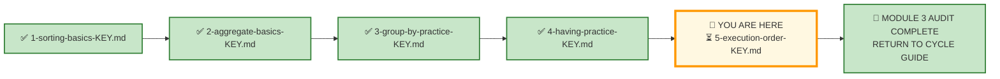
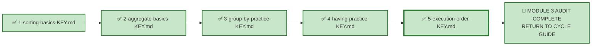

# 🗄️🤖 SQL & GenAI Course
**🎯 Quality Education for Anyone, Anywhere, Anytime — 💫 with Comfort, Convenience at no Cost**

---

## 🔑 File 5: `5-execution-order-KEY` (AUDIT Phase)

Welcome to the **Architect's Post‑Mortem**. The execution phase is over. Your queries are saved. Now, we step completely out of the editor and pull back the curtain to reverse-engineer the logical machinery behind **Exercise 5: Execution Order**.

This is the final AUDIT file for Module 3. Every concept from the AUGMENT phase—the logical execution order, alias visibility, stage mismatch, and the three defect types—is tested here across all four flagship universes.

**Stop typing. Start auditing.**

In production, stakeholders don't ask for "an execution‑order diagnosis." They hand you a broken AI‑generated query and say: *"It doesn't work. Fix it."* Your job is to recognise the defect type, diagnose the execution stage, and repair it.

Let's see how your structural decisions hold up under audit.

---

## 🌌 SQLVerse Check-In

<div style="border-left: 4px solid #9c27b0; background-color: #f3e5f5; padding: 15px; margin: 20px 0; border-radius: 0 8px 8px 0;">

### The Execution‑Order Master Key

In Exercise 5, you diagnosed, repaired, and traced broken queries across four domains: **E‑Store**, **Hospital Planet**, **Real Estate Planet**, and **FinVERSE**. This answer key doesn't just evaluate your syntax—it evaluates your **diagnostic reasoning**.

In production, nobody hands you a beautifully isolated prompt. You get raw AI‑generated chaos: queries that look plausible but violate execution order. Anyone can write a working query. A true data consultant can **diagnose why a broken query fails**.

This key doesn't just give you the answers—it reveals the **architectural reasoning** behind each repair. Compare your diagnosis, audit your logic, and let's see if your queries are ready for the **live environment.**

🛑 **Audit Protocol:** Don't just check if your query returned the same rows. Check your diagnosis. Did you identify the correct execution stage? Did you distinguish between broken universally vs dialect‑dependent? Did you trace the execution path correctly?

</div>

---

## 📍 Your Current Stage – AUDIT Journey



---

## 🧪 Validation Protocol

Before you consult this AUDIT file:

- [ ] Have you completed all Business Requests in APPLY File 5?
- [ ] Have you saved your queries in your Vault?
- [ ] Have you tested each query and verified the results?
- [ ] Have you classified each defect correctly?

> 🔁 **Audit Rule:** The solutions below are a reference, not a shortcut. Compare your reasoning, not just your code.

---
### 🧠 The Execution‑Order Availability Model

Before diagnosing any query, understand **what exists at each stage of the logical execution pipeline**.

| Stage | What Is Available | What Is Not Yet Available |
|-------|-------------------|---------------------------|
| **FROM** | Source tables, raw columns | Nothing yet |
| **WHERE** | Source‑table columns, row‑level expressions | Grouped results, aggregate results, `SELECT` aliases |
| **GROUP BY** | Groups are formed | `HAVING` filtering has not yet occurred |
| **HAVING** | Groups and aggregate expressions | `SELECT` aliases  are not guaranteed (dialect‑dependent) |
| **SELECT** | Projected expressions and aliases | — |
| **ORDER BY** | Aliases are available in standard SQL | — |

---

#### The Logical Model

```text
FROM
  ↓
WHERE
  ↓
GROUP BY
  ↓
HAVING
  ↓
SELECT
  ↓
ORDER BY
```

#### How to Use This Model

When you encounter a broken query:

1. **Identify** which stage the problem occurs at.
2. **Check** what is available at that stage.
3. **Compare** with what the query is trying to use.
4. **Repair** by moving the condition to the correct stage.


---

### 📋 What This Achieves

| Aspect | Benefit |
|--------|---------|
| **Conceptual Rigour** | You learn *availability*, not just sequence |
| **Diagnostic Framework** | A repeatable method for diagnosing execution‑order defects |
| **Professional Rule** | A memorable, actionable principle |
| **Consistency** | The same model applies to all queries across all universes |

---
### 📋 Table 1 — Written Order vs Logical Execution Order

| Written (Syntactic) Order | Logical Execution Order & Availability |
|---------------------------|----------------------------------------|
| 1. `SELECT` | 1. `FROM` → Loads source tables & raw columns |
| 2. `FROM` | 2. `WHERE` → Filters raw rows (No aggregates or aliases) |
| 3. `WHERE` | 3. `GROUP BY` → Forms summary groups from the filtered rows |
| 4. `GROUP BY` | 4. `HAVING` → Filters groups (Aggregates exist; aliases dialect‑dependent) |
| 5. `HAVING` | 5. `SELECT` → Projects expressions & assigns column aliases |
| 6. `ORDER BY` | 6. `ORDER BY` → Sorts output set (Aliases ARE available here) |
| 7. `LIMIT` | 7. `LIMIT` → Truncates final row count |

---

### 📋 Table 2 — Pipeline Stage Availability

| Pipeline Stage | Available Data / Context | Unavailable Data |
|----------------|--------------------------|------------------|
| **1. `FROM`** | Base tables, `JOIN`ed relations | Calculated fields, groups |
| **2. `WHERE`** | Raw row‑level columns | Aggregates, `SELECT` aliases |
| **3. `GROUP BY`** | Row‑level columns, grouped keys | Final `SELECT` aliases |
| **4. `HAVING`** | Grouped rows, aggregate functions | `SELECT` aliases  are not guaranteed |
| **5. `SELECT`** | Selected columns, expressions, aggregates, aliases | Post‑projection sorting |
| **6. `ORDER BY`** | `SELECT` aliases, expressions, raw columns | Truncated row offsets |
| **7. `LIMIT / OFFSET`** | Final projected & sorted rows | N/A |

---

### **The Professional Rule:**

> **Don't ask "Where is the expression written?"**
> 
> **Ask "At what stage does the thing I'm referring to exist?"**

---

# 💎 Phase 1: The Semantic Excavation (Requirement → Gemstone)

Let's dissect the client tickets you resolved across all four flagship universes, exposing the structural geometry buried inside the business prose.

---

## 📋 Individual Requests

### Request 1 — Alias in WHERE (E‑Store)

#### 🪵 Business Language

> "Identify product categories whose total listed product value exceeds 15,000 credits."

#### 🧠 Business Context (3‑Question Alignment)

| Perspective | Explanation |
|-------------|-------------|
| **Who is asking?** | Product Manager |
| **Why are they asking?** | They need to identify high‑value product categories. |
| **What decision will they make?** | Allocate marketing and inventory resources to high‑value categories. |

#### 💎 Gemstone Extraction

**Pattern Identified:** Alias in `WHERE` — alias does not exist yet

The query attempts to filter by an alias (`total_value`) in the `WHERE` clause. `WHERE` runs second; `SELECT` runs fifth.

#### 🧭 Technical Translation

**The AI‑Generated Query:**

```sql
SELECT 
    category,
    SUM(price) AS total_value
FROM products
WHERE total_value > 15000
GROUP BY category;
```

**The Problem:**

`WHERE` runs before `SELECT`. The alias `total_value` does not exist at the `WHERE` stage.

**The Repair:**

```sql
SELECT 
    category,
    SUM(price) AS total_value
FROM products
GROUP BY category
HAVING SUM(price) > 15000
ORDER BY total_value DESC;
```

#### ⚙️ The Choice Pattern

**Why this solution?** The condition filters a group‑level aggregate (`SUM(price)`). It belongs in `HAVING`, not `WHERE`. The alias `total_value` is assigned in `SELECT` (step 5) and can be referenced in `ORDER BY` (step 6), but the aggregate expression must be repeated in `HAVING` for cross‑platform reliability.

#### 📐 Architecture Notes

> `WHERE` runs before `GROUP BY` and `SELECT`. It cannot see aliases or aggregates.

> `HAVING` runs after `GROUP BY`. It can filter groups based on aggregate conditions. For cross‑platform reliability, repeat the aggregate expression in `HAVING` rather than using the alias.

#### 🚨 Common Mistakes

> Students sometimes use `HAVING total_value > 15000`—which works in some databases but not all. The professional rule: repeat the aggregate expression.

#### 🎯 Skill Reinforced

✔ Alias visibility in `WHERE`  
✔ `WHERE` vs `HAVING` distinction  
✔ Cross‑platform reliability

---

### Request 2 — Alias in HAVING (E‑Store)

#### 🪵 Business Language

> "Identify product categories with an average price above 500 credits."

#### 🧠 Business Context (3‑Question Alignment)

| Perspective | Explanation |
|-------------|-------------|
| **Who is asking?** | Finance Team |
| **Why are they asking?** | They want to identify high‑value categories. |
| **What decision will they make?** | Focus on categories with high average prices. |

#### 💎 Gemstone Extraction

**Pattern Identified:** Alias in `HAVING` — dialect‑dependent

The query uses an alias (`avg_price`) in `HAVING`. This works in some databases but not all.

#### 🧭 Technical Translation

**The AI‑Generated Query:**

```sql
SELECT 
    category,
    AVG(price) AS avg_price
FROM products
GROUP BY category
HAVING avg_price > 500;
```

**The Problem:**

`HAVING` runs before `SELECT` in some database implementations (though after `GROUP BY`). Alias visibility in `HAVING` is dialect‑dependent.

**The Repair (Cross‑Platform Safe):**

```sql
SELECT 
    category,
    AVG(price) AS avg_price
FROM products
GROUP BY category
HAVING AVG(price) > 500
ORDER BY avg_price DESC;
```

#### ⚙️ The Choice Pattern

**Why this solution?** The query is not universally broken—it may work in some databases. The query is ⚠️ Dialect‑dependent. But professional SQL avoids dialect‑dependent behaviour. Repeating the aggregate expression in `HAVING` ensures cross‑platform reliability.

#### 📐 Architecture Notes

> *In the logical query-processing order, **`HAVING` is evaluated before `SELECT`.** Some database systems nevertheless allow SELECT aliases to be referenced in `HAVING` as a dialect-specific extension.*

> The professional rule: **never rely on dialect‑specific behaviour.** Repeat the aggregate expression in `HAVING`.

#### 🚨 Common Mistakes

> Students sometimes assume `HAVING avg_price > 500` is universally valid. It is not.

#### 🎯 Skill Reinforced

✔ Alias visibility in `HAVING` (dialect‑dependent)  
✔ Cross‑platform reliability  
✔ Professional rule: repeat the aggregate expression

---

### Request 3 — Aggregate in WHERE (E‑Store)

#### 🪵 Business Language

> "Identify customers who have placed more than 5 orders."

#### 🧠 Business Context (3‑Question Alignment)

| Perspective | Explanation |
|-------------|-------------|
| **Who is asking?** | Operations Manager |
| **Why are they asking?** | They want to identify repeat buyers. |
| **What decision will they make?** | Target repeat buyers with loyalty programs. |

#### 💎 Gemstone Extraction

**Pattern Identified:** Aggregate in `WHERE` — stage mismatch

The query attempts to use an aggregate (`COUNT(order_id)`) in the `WHERE` clause. `WHERE` runs before `GROUP BY`; aggregates are not available at that stage.

#### 🧭 Technical Translation

**The AI‑Generated Query:**

```sql
SELECT 
    customer_id,
    COUNT(order_id) AS order_count
FROM orders
WHERE COUNT(order_id) > 5
GROUP BY customer_id;
```

**The Problem:**

`WHERE` runs before `GROUP BY`. The aggregate `COUNT(order_id)` is not available at the `WHERE` stage.

**The Repair:**

```sql
SELECT 
    customer_id,
    COUNT(order_id) AS order_count
FROM orders
GROUP BY customer_id
HAVING COUNT(order_id) > 5
ORDER BY order_count DESC;
```

#### ⚙️ The Choice Pattern

**Why this solution?** The condition filters a group‑level aggregate. It belongs in `HAVING`, not `WHERE`.

#### 📐 Architecture Notes

> `WHERE` filters rows before grouping. Aggregates are not available at this stage. `HAVING` filters groups after grouping.

#### 🚨 Common Mistakes

> Students sometimes use `WHERE COUNT(order_id) > 5`, which fails because `WHERE` cannot see aggregates.

#### 🎯 Skill Reinforced

✔ Aggregate availability in `WHERE` vs `HAVING`  
✔ Stage mismatch diagnosis

---

### Request 4 — Alias in WHERE (Hospital Planet)

#### 🪵 Business Language

> "Identify doctors with more than 10 appointments."

#### 🧠 Business Context (3‑Question Alignment)

| Perspective | Explanation |
|-------------|-------------|
| **Who is asking?** | Chief Medical Officer |
| **Why are they asking?** | They want to identify doctors with heavy workloads. |
| **What decision will they make?** | Assign additional support to overloaded doctors. |

#### 💎 Gemstone Extraction

**Pattern Identified:** Alias in `WHERE` — alias does not exist yet

#### 🧭 Technical Translation

**The AI‑Generated Query:**

```sql
SELECT 
    doctor_id,
    COUNT(appointment_id) AS appointment_count
FROM appointments
WHERE appointment_count > 10
GROUP BY doctor_id;
```

**The Problem:**

`WHERE` runs before `SELECT`. The alias `appointment_count` does not exist at the `WHERE` stage.

**The Repair:**

```sql
SELECT 
    doctor_id,
    COUNT(appointment_id) AS appointment_count
FROM appointments
GROUP BY doctor_id
HAVING COUNT(appointment_id) > 10
ORDER BY appointment_count DESC;
```

#### ⚙️ The Choice Pattern

**Why this solution?** The condition filters a group‑level aggregate (`COUNT(appointment_id)`). It belongs in `HAVING`, not `WHERE`.

#### 📐 Architecture Notes

> `WHERE` runs before `SELECT`. The alias `appointment_count` is not available at the `WHERE` stage.

#### 🚨 Common Mistakes

> Students sometimes use `HAVING appointment_count > 10`—which is dialect‑dependent. The professional rule: repeat the aggregate expression.

#### 🎯 Skill Reinforced

✔ Alias visibility in `WHERE`  
✔ `WHERE` vs `HAVING` distinction

---

### Request 5 — Alias in HAVING — Dialect-Dependent (Hospital Planet)

#### 🪵 Business Language

> "Identify patients with total billing above 10,000 credits."

#### 🧠 Business Context (3‑Question Alignment)

| Perspective | Explanation |
|-------------|-------------|
| **Who is asking?** | Revenue Cycle Manager |
| **Why are they asking?** | They want to identify high‑billing patients. |
| **What decision will they make?** | Focus on high‑billing patients for follow‑up. |

#### 💎 Gemstone Extraction

**Pattern Identified:** Alias in `HAVING` — dialect‑dependent

#### 🧭 Technical Translation

**The AI‑Generated Query:**

```sql
SELECT 
    patient_id,
    SUM(amount) AS total_billed
FROM bills
GROUP BY patient_id
HAVING total_billed > 10000;
```

**The Problem:**

`HAVING` runs before `SELECT` in some database implementations. Alias visibility in `HAVING` is dialect‑dependent.

**The Repair (Cross‑Platform Safe):**

```sql
SELECT 
    patient_id,
    SUM(amount) AS total_billed
FROM bills
GROUP BY patient_id
HAVING SUM(amount) > 10000
ORDER BY total_billed DESC;
```

#### ⚙️ The Choice Pattern

**Why this solution?** The query may work in some databases but not all. Professional SQL repeats the aggregate expression for cross‑platform reliability.

#### 📐 Architecture Notes

> **Alias visibility in `HAVING` is dialect-dependent.**
> 
> The professional rule: **never rely on dialect‑specific behaviour.** Repeat the aggregate expression in `HAVING`.

#### 🚨 Common Mistakes

> Students sometimes assume `HAVING total_billed > 10000` is universally valid. It is not.

#### 🎯 Skill Reinforced

✔ Alias visibility in `HAVING` (dialect‑dependent)  
✔ Cross‑platform reliability

---

### Request 6 — Aggregate in WHERE (Hospital Planet)

#### 🪵 Business Language

> "Identify treatment categories with average cost above 1,500 credits."

#### 🧠 Business Context (3‑Question Alignment)

| Perspective | Explanation |
|-------------|-------------|
| **Who is asking?** | Medical Director |
| **Why are they asking?** | They want to identify high‑cost treatment categories. |
| **What decision will they make?** | Review pricing for high‑cost categories. |

#### 💎 Gemstone Extraction

**Pattern Identified:** Aggregate in `WHERE` — stage mismatch

#### 🧭 Technical Translation

**The AI‑Generated Query:**

```sql
SELECT 
    category,
    AVG(cost) AS avg_cost
FROM treatments
WHERE AVG(cost) > 1500
GROUP BY category;
```

**The Problem:**

`WHERE` runs before `GROUP BY`. The aggregate `AVG(cost)` is not available at the `WHERE` stage.

**The Repair:**

```sql
SELECT 
    category,
    AVG(cost) AS avg_cost
FROM treatments
GROUP BY category
HAVING AVG(cost) > 1500
ORDER BY avg_cost DESC;
```

#### ⚙️ The Choice Pattern

**Why this solution?** The condition filters a group‑level aggregate. It belongs in `HAVING`, not `WHERE`.

#### 📐 Architecture Notes

> `WHERE` filters rows before grouping. Aggregates are not available at this stage.

#### 🚨 Common Mistakes

> Students sometimes use `WHERE AVG(cost) > 1500`, which fails because `WHERE` cannot see aggregates.

#### 🎯 Skill Reinforced

✔ Aggregate availability in `WHERE` vs `HAVING`  
✔ Stage mismatch diagnosis

---

### Request 7 — Alias in WHERE (Real Estate Planet)

#### 🪵 Business Language

> "Identify agents with total sales above 350,000 credits."

#### 🧠 Business Context (3‑Question Alignment)

| Perspective | Explanation |
|-------------|-------------|
| **Who is asking?** | Chief Revenue Officer |
| **Why are they asking?** | They want to identify top‑performing agents. |
| **What decision will they make?** | Reward top agents with bonuses and recognition. |

#### 💎 Gemstone Extraction

**Pattern Identified:** Alias in `WHERE` — alias does not exist yet

#### 🧭 Technical Translation

**The AI‑Generated Query:**

```sql
SELECT 
    agent_id,
    SUM(sale_price) AS total_sales
FROM contracts
WHERE total_sales > 350000
GROUP BY agent_id;
```

**The Problem:**

`WHERE` runs before `SELECT`. The alias `total_sales` does not exist at the `WHERE` stage.

**The Repair:**

```sql
SELECT 
    agent_id,
    SUM(sale_price) AS total_sales
FROM contracts
GROUP BY agent_id
HAVING SUM(sale_price) > 350000
ORDER BY total_sales DESC;
```

#### ⚙️ The Choice Pattern

**Why this solution?** The condition filters a group‑level aggregate (`SUM(sale_price)`). It belongs in `HAVING`, not `WHERE`.

#### 📐 Architecture Notes

> `WHERE` runs before `SELECT`. The alias `total_sales` is not available at the `WHERE` stage.

#### 🚨 Common Mistakes

> Students sometimes use `HAVING total_sales > 350000`—which is dialect‑dependent. The professional rule: repeat the aggregate expression.

#### 🎯 Skill Reinforced

✔ Alias visibility in `WHERE`  
✔ `WHERE` vs `HAVING` distinction

---

### Request 8 — Alias in HAVING — Dialect-Dependent (Real Estate Planet)

#### 🪵 Business Language

> "Identify property types with average list price above 500,000 credits for active properties."

#### 🧠 Business Context (3‑Question Alignment)

| Perspective | Explanation |
|-------------|-------------|
| **Who is asking?** | Brokerage Director |
| **Why are they asking?** | They want to understand high‑value property types. |
| **What decision will they make?** | Focus marketing on high‑value property types. |

#### 💎 Gemstone Extraction

**Pattern Identified:** Alias in `HAVING` — dialect‑dependent

#### 🧭 Technical Translation

**The AI‑Generated Query:**

```sql
SELECT 
    property_type,
    AVG(list_price) AS avg_price
FROM properties
WHERE status = 'Active'
GROUP BY property_type
HAVING avg_price > 500000;
```

**The Problem:**

`HAVING` runs before `SELECT` in some database implementations. Alias visibility in `HAVING` is dialect‑dependent.

**The Repair (Cross‑Platform Safe):**

```sql
SELECT 
    property_type,
    AVG(list_price) AS avg_price
FROM properties
WHERE status = 'Active'
GROUP BY property_type
HAVING AVG(list_price) > 500000
ORDER BY avg_price DESC;
```

#### ⚙️ The Choice Pattern

**Why this solution?** The query may work in some databases but not all. Professional SQL repeats the aggregate expression for cross‑platform reliability.

#### 📐 Architecture Notes

> **Alias visibility in `HAVING` is dialect-dependent.**
> 
> The professional rule: **never rely on dialect‑specific behaviour.** Repeat the aggregate expression in `HAVING`.

#### 🚨 Common Mistakes

> Students sometimes assume `HAVING avg_price > 500000` is universally valid. It is not.

#### 🎯 Skill Reinforced

✔ Alias visibility in `HAVING` (dialect‑dependent)  
✔ Cross‑platform reliability

---

### Request 9 — Aggregate in WHERE (Real Estate Planet)

#### 🪵 Business Language

> "Identify cities with total active listing value above 1,000,000 credits."

#### 🧠 Business Context (3‑Question Alignment)

| Perspective | Explanation |
|-------------|-------------|
| **Who is asking?** | Investment Team |
| **Why are they asking?** | They want to identify high‑value cities. |
| **What decision will they make?** | Focus investment on high‑value cities. |

#### 💎 Gemstone Extraction

**Pattern Identified:** Aggregate in `WHERE` — stage mismatch

#### 🧭 Technical Translation

**The AI‑Generated Query:**

```sql
SELECT 
    city,
    SUM(list_price) AS total_value
FROM properties
WHERE status = 'Active'
  AND SUM(list_price) > 1000000
GROUP BY city;
```

**The Problem:**

`WHERE` runs before `GROUP BY`. The aggregate `SUM(list_price)` is not available at the `WHERE` stage.

**The Repair:**

```sql
SELECT 
    city,
    SUM(list_price) AS total_value
FROM properties
WHERE status = 'Active'
GROUP BY city
HAVING SUM(list_price) > 1000000
ORDER BY total_value DESC;
```

#### ⚙️ The Choice Pattern

**Why this solution?** The condition filters a group‑level aggregate. It belongs in `HAVING`, not `WHERE`.

#### 📐 Architecture Notes

> `WHERE` filters rows before grouping. Aggregates are not available at this stage.

#### 🚨 Common Mistakes

> Students sometimes use `WHERE SUM(list_price) > 1000000`, which fails because `WHERE` cannot see aggregates.

#### 🎯 Skill Reinforced

✔ Aggregate availability in `WHERE` vs `HAVING`  
✔ Stage mismatch diagnosis

---

### Request 10 — Alias in WHERE (FinVERSE)

#### 🪵 Business Language

> "Identify customers with total outstanding loan balance above 100,000 credits."

#### 🧠 Business Context (3‑Question Alignment)

| Perspective | Explanation |
|-------------|-------------|
| **Who is asking?** | Credit Officer |
| **Why are they asking?** | They want to identify high‑exposure customers. |
| **What decision will they make?** | Monitor high‑exposure customers for credit risk. |

#### 💎 Gemstone Extraction

**Pattern Identified:** Alias in `WHERE` — alias does not exist yet

#### 🧭 Technical Translation

**The AI‑Generated Query:**

```sql
SELECT 
    customer_id,
    SUM(outstanding_balance) AS total_balance
FROM loans
WHERE total_balance > 100000
GROUP BY customer_id;
```

**The Problem:**

`WHERE` runs before `SELECT`. The alias `total_balance` does not exist at the `WHERE` stage.

**The Repair:**

```sql
SELECT 
    customer_id,
    SUM(outstanding_balance) AS total_balance
FROM loans
GROUP BY customer_id
HAVING SUM(outstanding_balance) > 100000
ORDER BY total_balance DESC;
```

#### ⚙️ The Choice Pattern

**Why this solution?** The condition filters a group‑level aggregate (`SUM(outstanding_balance)`). It belongs in `HAVING`, not `WHERE`.

#### 📐 Architecture Notes

> `WHERE` runs before `SELECT`. The alias `total_balance` is not available at the `WHERE` stage.

#### 🚨 Common Mistakes

> Students sometimes use `HAVING total_balance > 100000`—which is dialect‑dependent. The professional rule: repeat the aggregate expression.

#### 🎯 Skill Reinforced

✔ Alias visibility in `WHERE`  
✔ `WHERE` vs `HAVING` distinction

---

### Request 11 — Alias in HAVING — Dialect-Dependent (FinVERSE)

#### 🪵 Business Language

> "Identify accounts with more than 2 fraudulent transactions."

#### 🧠 Business Context (3‑Question Alignment)

| Perspective | Explanation |
|-------------|-------------|
| **Who is asking?** | Fraud Analyst |
| **Why are they asking?** | They want to identify high‑fraud accounts. |
| **What decision will they make?** | Investigate high‑fraud accounts. |

#### 💎 Gemstone Extraction

**Pattern Identified:** Alias in `HAVING` — dialect‑dependent

#### 🧭 Technical Translation

**The AI‑Generated Query:**

```sql
SELECT 
    account_id,
    COUNT(transaction_id) AS fraud_count
FROM transactions
WHERE is_fraud = 1
GROUP BY account_id
HAVING fraud_count > 2;
```

**The Problem:**

`HAVING` runs before `SELECT` in some database implementations. Alias visibility in `HAVING` is dialect‑dependent.

**The Repair (Cross‑Platform Safe):**

```sql
SELECT 
    account_id,
    COUNT(transaction_id) AS fraud_count
FROM transactions
WHERE is_fraud = 1
GROUP BY account_id
HAVING COUNT(transaction_id) > 2
ORDER BY fraud_count DESC;
```

#### ⚙️ The Choice Pattern

**Why this solution?** The query may work in some databases but not all. Professional SQL repeats the aggregate expression for cross‑platform reliability.

#### 📐 Architecture Notes

> **Alias visibility in `HAVING` is dialect-dependent.**
> 
> The professional rule: **never rely on dialect‑specific behaviour.** Repeat the aggregate expression in `HAVING`.

#### 🚨 Common Mistakes

> Students sometimes assume `HAVING fraud_count > 2` is universally valid. It is not.

#### 🎯 Skill Reinforced

✔ Alias visibility in `HAVING` (dialect‑dependent)  
✔ Cross‑platform reliability

---

### Request 12 — Aggregate in WHERE (FinVERSE)

#### 🪵 Business Language

> "Identify accounts with total transaction volume above 10,000 credits."

#### 🧠 Business Context (3‑Question Alignment)

| Perspective | Explanation |
|-------------|-------------|
| **Who is asking?** | Finance Executive |
| **Why are they asking?** | They want to identify high‑volume accounts. |
| **What decision will they make?** | Focus on high‑volume accounts for revenue analysis. |

#### 💎 Gemstone Extraction

**Pattern Identified:** Aggregate in `WHERE` — stage mismatch

#### 🧭 Technical Translation

**The AI‑Generated Query:**

```sql
SELECT 
    account_id,
    SUM(amount) AS total_volume
FROM transactions
WHERE status = 'Completed'
  AND SUM(amount) > 10000
GROUP BY account_id;
```

**The Problem:**

`WHERE` runs before `GROUP BY`. The aggregate `SUM(amount)` is not available at the `WHERE` stage.

**The Repair:**

```sql
SELECT 
    account_id,
    SUM(amount) AS total_volume
FROM transactions
WHERE status = 'Completed'
GROUP BY account_id
HAVING SUM(amount) > 10000
ORDER BY total_volume DESC;
```

#### ⚙️ The Choice Pattern

**Why this solution?** The condition filters a group‑level aggregate. It belongs in `HAVING`, not `WHERE`.

#### 📐 Architecture Notes

> `WHERE` filters rows before grouping. Aggregates are not available at this stage.

#### 🚨 Common Mistakes

> Students sometimes use `WHERE SUM(amount) > 10000`, which fails because `WHERE` cannot see aggregates.

#### 🎯 Skill Reinforced

✔ Aggregate availability in `WHERE` vs `HAVING`  
✔ Stage mismatch diagnosis

The business vocabulary changes. The skeletal pattern remains invariant.

**The nouns change. The logic does not.**

---

## 📋 Section 5: Executive Desk – Integrated Challenge

### Request 13 – Executive Multi‑Domain Audit

#### 🪵 Business Language

> *"Audit the AI‑generated queries across all four flagship universes. Identify which queries are broken, diagnose the execution‑stage defect, repair them, and trace the execution path."*

#### 🧠 Business Context (3‑Question Alignment)

| Perspective | Explanation |
|-------------|-------------|
| **Who is asking?** | Chief Data Officer (CDO) |
| **Why are they asking?** | They need a diagnostic review of AI‑generated queries. |
| **What decision will they make?** | Ensure all production queries are execution‑order safe. |

---

#### 💎 Gemstone Extraction

**Pattern Identified:** Mixed Defect Types — Universal Broken vs Dialect‑Dependent

This is the final, integrated challenge. The student must classify each query into one of three defect types:

| Defect Type | Description | Example |
|-------------|-------------|---------|
| **A — Alias in `WHERE`** | Alias does not exist yet (universally broken) | `WHERE total_value > 15000` |
| **B — Alias in `HAVING`** | Dialect‑dependent (works in some databases, not others) | `HAVING avg_price > 500` |
| **C — Aggregate in `WHERE`** | Stage mismatch (universally broken) | `WHERE COUNT(order_id) > 5` |

---

#### 🧭 Technical Translation (Defensible Interpretation)

**Query A — E‑Store:**

```sql
SELECT 
    customer_id,
    COUNT(order_id) AS order_count
FROM orders
WHERE order_count > 3
GROUP BY customer_id;
```

| Element | Diagnosis |
|---------|-----------|
| **Defect Type** | **A — Alias in `WHERE`** |
| **Classification** | ❌ **Broken universally** |
| **Execution Stage** | `WHERE` (step 2) — alias does not exist yet |
| **Repair** | Move condition to `HAVING`; repeat the aggregate expression |

**Repaired Query:**

```sql
SELECT 
    customer_id,
    COUNT(order_id) AS order_count
FROM orders
GROUP BY customer_id
HAVING COUNT(order_id) > 3
ORDER BY order_count DESC;
```

---

**Query B — Hospital Planet:**

```sql
SELECT 
    patient_id,
    SUM(amount) AS total_billed
FROM bills
GROUP BY patient_id
HAVING total_billed > 10000
ORDER BY total_billed DESC;
```

| Element | Diagnosis |
|---------|-----------|
| **Defect Type** | **B — Alias in `HAVING`** |
| **Classification** | ⚠️ **Dialect‑dependent** |
| **Execution Stage** | `HAVING` (step 4) — alias visibility depends on database |
| **Repair** | Repeat the aggregate expression in `HAVING` |

**Repaired Query (Cross‑Platform Safe):**

```sql
SELECT 
    patient_id,
    SUM(amount) AS total_billed
FROM bills
GROUP BY patient_id
HAVING SUM(amount) > 10000
ORDER BY total_billed DESC;
```

---

**Query C — Real Estate Planet:**

```sql
SELECT 
    agent_id,
    SUM(sale_price) AS total_sales
FROM contracts
WHERE total_sales > 350000
GROUP BY agent_id
ORDER BY total_sales DESC;
```

| Element | Diagnosis |
|---------|-----------|
| **Defect Type** | **A — Alias in `WHERE`** |
| **Classification** | ❌ **Broken universally** |
| **Execution Stage** | `WHERE` (step 2) — alias does not exist yet |
| **Repair** | Move condition to `HAVING`; repeat the aggregate expression |

**Repaired Query:**

```sql
SELECT 
    agent_id,
    SUM(sale_price) AS total_sales
FROM contracts
GROUP BY agent_id
HAVING SUM(sale_price) > 350000
ORDER BY total_sales DESC;
```

---

**Query D — FinVERSE:**

```sql
SELECT 
    customer_id,
    SUM(outstanding_balance) AS total_balance
FROM loans
GROUP BY customer_id
HAVING total_balance > 100000;
```

| Element | Diagnosis |
|---------|-----------|
| **Defect Type** | **B — Alias in `HAVING`** |
| **Classification** | ⚠️ **Dialect‑dependent** |
| **Execution Stage** | `HAVING` (step 4) — alias visibility depends on database |
| **Repair** | Repeat the aggregate expression in `HAVING` |

> **No syntax repair is required for the database systems that support aliases in `HAVING`; however, the query should still be rewritten for cross-platform portability.**

**Repaired Query (Cross‑Platform Safe):**

```sql
SELECT 
    customer_id,
    SUM(outstanding_balance) AS total_balance
FROM loans
GROUP BY customer_id
HAVING SUM(outstanding_balance) > 100000
ORDER BY total_balance DESC;
```

---

### 🧠 The Defect Classification Summary

| Query | Defect Type | Classification | Fix |
|-------|-------------|----------------|-----|
| **A — E‑Store** | Alias in `WHERE` | ❌ Broken universally | Move to `HAVING` |
| **B — Hospital Planet** | Alias in `HAVING` | ⚠️ Dialect‑dependent | Repeat aggregate expression |
| **C — Real Estate Planet** | Alias in `WHERE` | ❌ Broken universally | Move to `HAVING` |
| **D — FinVERSE** | Alias in `HAVING` | ⚠️ Dialect‑dependent | Repeat aggregate expression |

---

### 🪞 SQLVerse Pattern Reflection

**The Three Defect Types — Unified Across Four Universes**

| Defect Type | Classification | Execution Stage | Fix |
|-------------|----------------|-----------------|-----|
| **Alias in `WHERE`** | ❌ Broken universally | `WHERE` (step 2) | Move to `HAVING` |
| **Alias in `HAVING`** | ⚠️ Dialect‑dependent | `HAVING` (step 4) | Repeat aggregate expression |
| **Aggregate in `WHERE`** | ❌ Broken universally | `WHERE` (step 2) | Move to `HAVING` |

**The execution order** is non‑negotiable. 

**The Alias visibility in `HAVING`** is dialect-dependent.

**The dialect‑dependent** behaviour is avoidable. 

**The professional rule is universal.**

---

The business vocabulary changes. The skeletal pattern remains invariant.

**The nouns change. The logic does not.**

---
### 🧠 The Conceptual Backbone — What You Have Learned

Your KEY should ultimately leave you with this mental model:

```text
ROW LEVEL
   │
   ▼
WHERE
   │
   │  row-level filtering
   ▼
GROUP BY
   │
   │  groups are created
   ▼
HAVING
   │
   │  group/aggregate filtering
   ▼
SELECT
   │
   │  projection + aliases
   ▼
ORDER BY
```

And underneath it:

> **A thing can only be referenced reliably at a stage where it exists.**

---

#### The Three Defects — Self‑Evident

```text
Alias in WHERE
        ↓
Alias doesn't exist yet
        ↓
BROKEN

Aggregate in WHERE
        ↓
Aggregate doesn't exist yet
        ↓
BROKEN

Alias in HAVING
        ↓
Alias visibility is dialect‑dependent
        ↓
AVOID FOR PORTABILITY
```

---

**This is the actual Module 3 learning outcome:**

> **Not “I know the execution order.”**
>
> **“I know what exists at each stage — and I can diagnose any query by asking that question.”**

---

# 🌲 Phase 2: Skill‑Tree Update

Your portfolio isn't measured by the volume of lines you wrote; it is verified by the competencies you demonstrated. Below are the structural data matrices you have earned through this audit. Ensure your internal **Gemstone Array** has recorded these updates before moving forward.

```text
📦 [skills_level1]        ──> Unlocked: Execution‑Order Diagnosis, Alias Visibility Reasoning, Stage Mismatch Detection, Dialect‑Dependent Classification
💡 [insights_level1]      ──> Recorded: Written order ≠ Execution order, The Three Defect Types, Professional Rule for Cross‑Platform Safety
🏆 [achievements_level1]  ──> Certified: Sprint Milestone [ACH-L1-M3-AUD05] Complete
```

---

## 💎 Gemstone Array Update

### 📂 Gemstone Array Entry 1: Competency Mapping (`skills_level1`)

| Skill Code | Skill Name | Description |
|------------|------------|-------------|
| `SKL‑L1‑M3‑030` | Alias in WHERE Diagnosis | Identified aliases used in `WHERE` before they exist |
| `SKL‑L1‑M3‑031` | Alias in HAVING Awareness | Recognised that alias visibility in `HAVING` is dialect‑dependent |
| `SKL‑L1‑M3‑032` | Aggregate in WHERE Detection | Identified aggregates used in `WHERE` before they are available |
| `SKL‑L1‑M3‑033` | Cross‑Platform Repair | Repeated aggregate expressions in `HAVING` for cross‑platform safety |
| `SKL‑L1‑M3‑034` | Execution‑Stage Diagnosis | Diagnosed the exact execution stage where each defect occurs |

---

### 📂 Gemstone Array Entry 2: Architectural Insights (`insights_level1`)

| Insight ID | Title | Extraction |
|------------|-------|------------|
| `INS‑L1‑M3‑018` | Written Order ≠ Execution Order | The way you write SQL is for humans; the way it runs is for the machine. |
| `INS‑L1‑M3‑019` | The Three Defect Types | Alias in `WHERE`, Alias in `HAVING`, Aggregate in `WHERE`—each has a distinct diagnosis and repair. |
| `INS‑L1‑M3‑020` | Professional Rule for Cross‑Platform Safety | Repeat the aggregate expression in `HAVING` rather than relying on aliases. |
| `INS‑L1‑M3‑021` | Domain Invariance of Execution Order | Execution‑order defects are identical across all four flagship universes. |

---

### 📂 Gemstone Array Entry 3: Milestone Certification (`achievements_level1`)

| Achievement Code | Title | Verification Status |
|------------------|-------|---------------------|
| `ACH‑L1‑M3‑AUD05` | Master Architect Sign‑Off: Execution Order | Verified against logical, business, and operational correctness metrics. The lab execution cycle is formally declared frozen and production‑ready. |

---

> 📘 **Skill‑Tree Update Reminder:** Keep updating the Gemstone Array throughout this AUDIT cycle. After you complete the full AUDIT cycle (all 5 files), use the **ETL Workflow** provided in [`SKILL_TREE_ARCHITECTURE.md`](../../../Guides/SKILL_TREE_ARCHITECTURE.md) to persist your gemstones into your permanent Skill‑Tree database.

---

# 🏛️ Phase 3: The Vault Manifest (Verification Ledger)

Compare the skeletal structural patterns of your work against the verified solution baseline. If your syntax achieved the exact same logical, business, and operational correctness, tick the verification box.

---

## 🛒 Section 1: Workshop Floor – E‑Store

```sql
-- Request 1: Alias in WHERE (E‑Store)
-- Original defect: ❌ Alias used in WHERE before it exists
-- Verified solution: Move aggregate filtering to HAVING
SELECT 
    category,
    SUM(price) AS total_value
FROM products
GROUP BY category
HAVING SUM(price) > 15000
ORDER BY total_value DESC;

-- Request 2: Alias in HAVING (E‑Store)
-- Original defect: ⚠️ Alias in HAVING — dialect‑dependent
-- Verified solution: Repeat the aggregate expression for portability
SELECT 
    category,
    AVG(price) AS avg_price
FROM products
GROUP BY category
HAVING AVG(price) > 500
ORDER BY avg_price DESC;

-- Request 3: Aggregate in WHERE (E‑Store)
-- Original defect: ❌ Aggregate used in WHERE before GROUP BY
-- Verified solution: Move aggregate condition to HAVING
SELECT 
    customer_id,
    COUNT(order_id) AS order_count
FROM orders
GROUP BY customer_id
HAVING COUNT(order_id) > 5
ORDER BY order_count DESC;
```

---

## 🏥 Section 2: Production Echo – Hospital Planet

```sql
-- Request 4: Alias in WHERE (Hospital Planet)
-- Original defect: ❌ Alias used in WHERE before it exists
-- Verified solution: Move aggregate filtering to HAVING
SELECT 
    doctor_id,
    COUNT(appointment_id) AS appointment_count
FROM appointments
GROUP BY doctor_id
HAVING COUNT(appointment_id) > 10
ORDER BY appointment_count DESC;

-- Request 5: Alias in HAVING — Dialect‑Dependent (Hospital Planet)
-- Original defect: ⚠️ Alias in HAVING — dialect‑dependent
-- Verified solution: Repeat the aggregate expression for portability
SELECT 
    patient_id,
    SUM(amount) AS total_billed
FROM bills
GROUP BY patient_id
HAVING SUM(amount) > 10000
ORDER BY total_billed DESC;

-- Request 6: Aggregate in WHERE (Hospital Planet)
-- Original defect: ❌ Aggregate used in WHERE before GROUP BY
-- Verified solution: Move aggregate condition to HAVING
SELECT 
    category,
    AVG(cost) AS avg_cost
FROM treatments
GROUP BY category
HAVING AVG(cost) > 1500
ORDER BY avg_cost DESC;
```

---

## 🏘️ Section 3: Production Echo – Real Estate Planet

```sql
-- Request 7: Alias in WHERE (Real Estate Planet)
-- Original defect: ❌ Alias used in WHERE before it exists
-- Verified solution: Move aggregate filtering to HAVING
SELECT 
    agent_id,
    SUM(sale_price) AS total_sales
FROM contracts
GROUP BY agent_id
HAVING SUM(sale_price) > 350000
ORDER BY total_sales DESC;

-- Request 8: Alias in HAVING — Dialect‑Dependent (Real Estate Planet)
-- Original defect: ⚠️ Alias in HAVING — dialect‑dependent
-- Verified solution: Repeat the aggregate expression for portability
SELECT 
    property_type,
    AVG(list_price) AS avg_price
FROM properties
WHERE status = 'Active'
GROUP BY property_type
HAVING AVG(list_price) > 500000
ORDER BY avg_price DESC;

-- Request 9: Aggregate in WHERE (Real Estate Planet)
-- Original defect: ❌ Aggregate used in WHERE before GROUP BY
-- Verified solution: Move aggregate condition to HAVING
SELECT 
    city,
    SUM(list_price) AS total_value
FROM properties
WHERE status = 'Active'
GROUP BY city
HAVING SUM(list_price) > 1000000
ORDER BY total_value DESC;
```

---

## 💳 Section 4: Production Echo – FinVERSE

```sql
-- Request 10: Alias in WHERE (FinVERSE)
-- Original defect: ❌ Alias used in WHERE before it exists
-- Verified solution: Move aggregate filtering to HAVING
SELECT 
    customer_id,
    SUM(outstanding_balance) AS total_balance
FROM loans
GROUP BY customer_id
HAVING SUM(outstanding_balance) > 100000
ORDER BY total_balance DESC;

-- Request 11: Alias in HAVING — Dialect‑Dependent (FinVERSE)
-- Original defect: ⚠️ Alias in HAVING — dialect‑dependent
-- Verified solution: Repeat the aggregate expression for portability
SELECT 
    account_id,
    COUNT(transaction_id) AS fraud_count
FROM transactions
WHERE is_fraud = 1
GROUP BY account_id
HAVING COUNT(transaction_id) > 2
ORDER BY fraud_count DESC;

-- Request 12: Aggregate in WHERE (FinVERSE)
-- Original defect: ❌ Aggregate used in WHERE before GROUP BY
-- Verified solution: Move aggregate condition to HAVING
SELECT 
    account_id,
    SUM(amount) AS total_volume
FROM transactions
WHERE status = 'Completed'
GROUP BY account_id
HAVING SUM(amount) > 10000
ORDER BY total_volume DESC;
```

---

## 📋 Section 5: Executive Desk – Integrated Challenge

```sql
-- Request 13: Executive Multi‑Domain Audit
-- Audit Report Summary

-- Query A: E‑Store
-- Original defect: ❌ Alias in WHERE
-- Verified solution: Move aggregate filtering to HAVING
SELECT 
    customer_id,
    COUNT(order_id) AS order_count
FROM orders
GROUP BY customer_id
HAVING COUNT(order_id) > 3
ORDER BY order_count DESC;

-- Query B: Hospital Planet
-- Original defect: ⚠️ Alias in HAVING — dialect‑dependent
-- Verified solution: Repeat the aggregate expression for portability
SELECT 
    patient_id,
    SUM(amount) AS total_billed
FROM bills
GROUP BY patient_id
HAVING SUM(amount) > 10000
ORDER BY total_billed DESC;

-- Query C: Real Estate Planet
-- Original defect: ❌ Alias in WHERE
-- Verified solution: Move aggregate filtering to HAVING
SELECT 
    agent_id,
    SUM(sale_price) AS total_sales
FROM contracts
GROUP BY agent_id
HAVING SUM(sale_price) > 350000
ORDER BY total_sales DESC;

-- Query D: FinVERSE
-- Original defect: ⚠️ Alias in HAVING — dialect‑dependent
-- Verified solution: Repeat the aggregate expression for portability
SELECT 
    customer_id,
    SUM(outstanding_balance) AS total_balance
FROM loans
GROUP BY customer_id
HAVING SUM(outstanding_balance) > 100000
ORDER BY total_balance DESC;
```

---

## ✅ Verification Sign‑Off

- [ ] My queries returned the expected results.
- [ ] My reasoning matched the gemstone extraction patterns.
- [ ] I have updated my Skill‑Tree with the competencies demonstrated.
- [ ] I understand the difference between universal breaks and dialect‑dependent behaviour.
- [ ] I can classify each defect type correctly.
- [ ] I can trace any query through the execution order.

---

## 🧭 Exit Reflection

Stop writing code. Step completely out of the technical layer and answer these three architectural reflection questions inside your personal design log:

**1. The Three Defect Types:** In this exercise, you encountered three distinct defect types: Alias in `WHERE`, Alias in `HAVING`, and Aggregate in `WHERE`. How would you classify each? Which are universally broken, and which are dialect‑dependent? Why?

**2. The Professional Rule:** Why is it safer to repeat the aggregate expression in `HAVING` rather than using an alias? What would happen if you used an alias in `HAVING` in a production environment that uses multiple databases?

**3. Domain Invariance:** Across all four flagship universes, the execution‑order defects were identical. What does this tell you about the portability of execution‑order reasoning? How does this align with Law #3: Logic Outlives Vocabulary?

---

## 🔁 Bridge Forward



You have audited **Execution Order** across all four flagship universes. The gemstones are extracted, your Skill‑Tree is updated, and you have proven that execution‑order reasoning is truly domain‑invariant.

**🎯 MODULE 3 AUDIT COMPLETE — RETURN TO CYCLE GUIDE.**

| Previous Step | Next Step |
|:---:|:---:|
| [← Return to APPLY File 5](./5-execution-order-LAB.md) | [Return to Cycle Guide →](../../01-The-Socratic-Mirror/CYCLE2_GUIDE.md) |

---

*Part of our mission for 🎯 Quality Education for Anyone, Anywhere, Anytime — 💫 with Comfort, Convenience at no Cost.*

**Level 1 | ACCELERATE Phase | AUDIT | Module 3 | File 5**