# 🗄️🤖 SQL & GenAI Course
**🎯 Quality Education for Anyone, Anywhere, Anytime — 💫 with Comfort, Convenience at no Cost**

---

## 🎭 SQLVerse Reality Chambers: The Proving Ground

Welcome to the final leg of ACCELERATE. Here, everything converges: syntax, auditing, business reasoning, AI skepticism, architecture, and ambiguity. You are no longer practicing concepts. You are **executing judgment under pressure**.

---

## 🎯 Learning Objectives

By completing all 8 Reality Chambers, you will be able to:
- Synthesise JOINs, aggregation, normalisation, and AI auditing in complex scenarios
- Solve ambiguous, multi‑stakeholder business problems with incomplete requirements
- Defend your architectural choices under pressure
- Extract judgment‑level gemstones for your Skill‑Tree

---
## ⚙️ Reality Chamber Operating Rules

- There may be multiple valid solutions.
- AI responses are advisory, not authoritative.
- Business reasoning is weighted equally with SQL correctness.
- Schema redesign is allowed if justified.
- Ambiguity is intentional — clarification questions are part of the solution.
- Your final answer must include reasoning, not just queries.

---

## 🔥 The Genesis Chamber: Where Realities Are Forged

The SQLVerse Reality Chambers do not emerge from a vacuum. They are the **direct continuation** of the stories, struggles, and solutions you first encountered in ACQUIRE Module 4. Every character, every domain, every business problem has already been introduced.

| Domain | Character | ACQUIRE Foundation File |
|--------|-----------|-------------------------|
| Intelligent Transportation Planet | Arjun (CTO) | `2-practiceExercises/Capstone Reports/1-MODULE4-CTO-REPORT.md` |
| Banking Planet | Geetha (CEO) | `2-practiceExercises/Capstone Reports/2-MODULE4-CEO-REPORT.md` |
| Library Planet | Raj (CFO) | `2-practiceExercises/Capstone Reports/3-MODULE4-CFO-REPORT.md` |
| Mall Empire (Quick Commerce) | Ravi | `4-exerciseAndQuizSolutions/6-capstone-solutions/simulations/1-CTO-INTERVIEW-SIMULATION.md` |
| Event Management | Annie | `4-exerciseAndQuizSolutions/6-capstone-solutions/simulations/2-CEO-INTERVIEW-SIMULATION.md` |
| Startup Hub Expo | Simon | `4-exerciseAndQuizSolutions/6-capstone-solutions/simulations/3-CFO-INTERVIEW-SIMULATION.md` |

---

### 📚 What You Bring Into the Chamber

| Type | ACQUIRE Material | Reality Chambers Approach |
|------|------------------|---------------------------|
| **Capstone Reports** (CTO, CEO, CFO) | Solutions provided in `4-exerciseAndQuizSolutions/6-capstone-solutions/` | Re‑examine solutions through an **AI‑augmented lens** – arrive at deeper conclusions (judgment, not just correctness) |
| **Interview Simulations** (Ravi, Annie, Simon) | No solutions provided | Conduct a **thorough independent analysis** and arrive at the solutions yourself with AI augmentation – **using AI as a reasoning amplifier**. |

---

### 🔗 The Interwoven Domains

Even though Chamber 7 is dedicated to “Cross‑Domain Profitability Modelling”, the interconnection between two or more domains is **part and parcel of almost every chamber**. Examples:

- Raj asks Geetha to provide loan pamphlets for student loans in the library.
- Geetha cross‑sells credit cards to Arjun's toll users.
- Simon hires Annie for flight and hotel booking services.
- Simon engages Ravi to set up dark stores in his startup export hub.

 **💡 Insight:** Cross‑domain thinking is not a separate chamber. It is the **default state** of the SQLVerse. Every business problem you solve will touch multiple characters, multiple domains, and multiple data sources. Chamber 7 simply gives it a name.

> **⚠️ The Unbroken Chain:** The Reality Chambers are a **new layer** – AI‑augmented problem‑solving under pressure – built on top of the same narrative universe. Do not enter this chamber without first mastering the foundation. There is **no 1:1 file mirroring** here. This is a continuation, not a reflection.

---

## 🗺️ Your Reality Chambers Journey

```mermaid
flowchart LR
    C1["Chamber 1<br/>Arjun's Repair Leak"] --> C2["Chamber 2<br/>Geetha's Cross‑Sell"] --> C3["Chamber 3<br/>Raj's Library"] --> C4["Chamber 4<br/>Ravi's Missing Phone"] --> C5["Chamber 5<br/>Annie's Margin Leak"] --> C6["Chamber 6<br/>Simon's Email Classifier"] --> C7["Chamber 7<br/>SQLVerse Travels Investment"] --> C8["Chamber 8<br/>The SQLVerse Convergence"]
    
    style C1 fill:#e1f5fe,stroke:#2196f3
    style C2 fill:#e1f5fe,stroke:#2196f3
    style C3 fill:#e1f5fe,stroke:#2196f3
    style C4 fill:#e1f5fe,stroke:#2196f3
    style C5 fill:#e1f5fe,stroke:#2196f3
    style C6 fill:#e1f5fe,stroke:#2196f3
    style C7 fill:#e1f5fe,stroke:#2196f3
    style C8 fill:#ffebee,stroke:#f44336
```

---

### 🔥 The Proving Ground

This is not a tutorial. This is where you prove that you can **lead AI, not follow it**.  
Each chamber tests your judgment under ambiguity. Complete all 8 in order.

> 🔁 **Reality Chambers are designed to expose weak assumptions, incomplete reasoning, and AI over-trust.** Struggle is expected. Revision is part of the chamber.

> **🧠 Hallucination Log Reminder:** If you catch an AI hallucination during any chamber, log it in `Socratic_Journals/hallucination_log.md` using the template from `AI_ERROR_HALLUCINATION_LOG.md`.

---

## 🗺️ Linear Path

| Chamber | Type | Scenario | Gemstone to Extract |
|---------|------|----------|---------------------|
| 1 | Domain | Arjun's Repair Leak | “The Missing Match Pattern” (LEFT JOIN + IS NULL) |
| 2 | Domain | Geetha's Cross‑Sell | “Multi‑Table Intersection Logic” (INNER JOIN + temporal filters) |
| 3 | Domain | Raj's Library | “Revenue Aggregation over Time” (GROUP BY + aggregate) |
| 4 | Domain | Ravi's Missing Phone | “NULL‑Safe Customer Linking” (COALESCE, NULL strategy) |
| 5 | Domain | Annie's Margin Leak | “Threshold‑Based Filtering” (GROUP BY + HAVING) |
| 6 | Domain | Simon's Email Classifier | “ETL via SQL – Parsing Chaos” (INSERT INTO ... SELECT) |
| 7 | Domain | SQLVerse Travels Investment | “Cross‑Domain Profitability Modelling” |
| 8 | **Convergence** | **The SQLVerse Convergence** | “Full Stack Business Integration” |

### 🌐 The Convergence Chamber

Unlike the previous seven domain‑specific chambers, Chamber 8 is the **final integration event**. All characters, all domains, and all skills converge into a single judgment call. This is not another exercise – it is the **culmination**.

---

## 🏁 AFTER COMPLETING ALL 8 CHAMBERS

1. Export CSV from `GemstoneArray.md` (skills, insights, patterns from all chambers)
2. Import into your Skill‑Tree database using the staging table pattern
3. Return to the **Navigation Guide** and log your Lap 4 Black Box Feedback

You are no longer operating as a student of SQL. You are operating as a **database strategist** inside a living AI-augmented business ecosystem.

# [▶️ **RETURN TO FLIGHT CONTROL DECK**](../MODULE5_NAVIGATION_GUIDE.md)

**Log your Lap 4 Black Box Telemetry**

---

*Part of our mission for 🎯 Quality Education for Anyone, Anywhere, Anytime — 💫 with Comfort, Convenience at no Cost.*

**Level 1 | ACCELERATE Phase | Reality Chambers Guide | Next: Return to Navigation Guide**

