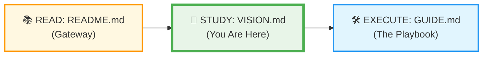

# 🗄️🤖 SQL & GenAI Course
**🎯 Quality Education for Anyone, Anywhere, Anytime — 💫 with Comfort, Convenience at no Cost**

---

## 🧠 ACCELERATE VISION: The Philosophy of Judgment

**ACQUIRE built your correctness. ACCELERATE builds your judgment.**

---

## 🧭 THE SOUL OF THE ACCELERATE ENGINE: Why This Document Exists

You have just read `README.md` – the emotional gateway. Now you stand at the threshold of Phase 2. This document answers the question **“Why does ACCELERATE exist?”** It is the soul of the phase: the pedagogical reasoning, the cognitive transformation, and the operating principles that make the twisted path more than just “**reviewing** old modules into a system that builds your **competitive advantage.**”

> *If README is the map, VISION is the compass.*

---

## 🧠 The Great Shift: From Correctness to Judgment

In **ACQUIRE**, you learned SQL syntax. You mastered `SELECT`, `WHERE`, `JOIN`, `GROUP BY`. You wrote queries that returned correct results. You earned **correctness**.

**Now, that is no longer enough.**

In the modern data landscape, code has become a commodity. Anyone can prompt AI and generate syntactically correct SQL instantly. The modern data professional is not valued for generating code—they are valued for their **unshakeable technical judgment**.   

**Judgment** is the ability to:

- Detect flawed logic hidden inside an AI’s suggestion.
- Identify hidden assumptions about data shape, nulls, or business rules.
- Predict edge cases that break a query at scale.
- Choose efficient structures over merely correct ones.
- Validate AI outputs against multiple dimensions (syntax, performance, business logic).
- Balance correctness against scalability, readability, and maintainability.

**This is what ACCELERATE forges.**

---

### The Cognitive Pipeline Diagram

```mermaid
flowchart LR
    A["🔴 ACQUIRE Syntax"] --> B["💬 Socratic Reflection"] --> C["🔍 AI Audit"] --> D["💎 Pattern Extraction"] --> E["🗜️ Compression"] --> F["🌲 Skill‑Tree Ingestion"] --> G["🎭 Reality Simulation"] --> H["🏛️ Architectural Judgment"]
    
    style A fill:#ffebee,stroke:#f44336
    style B fill:#fff8e1,stroke:#ff9800
    style C fill:#e1f5fe,stroke:#2196f3
    style D fill:#f3e5f5,stroke:#9c27b0
    style E fill:#fff8e1,stroke:#ff9800
    style F fill:#e8f5e8,stroke:#4caf50
    style G fill:#ffebee,stroke:#f44336
    style H fill:#a5d6a7,stroke:#2e7d32
```



---

## ⚖️ The Laws of ACCELERATE

In the **ACQUIRE** phase, your milestone was correctness: ensuring your query ran without syntax errors and produced the true dataset. In the **ACCELERATE** phase, your milestone is architectural authority. 

When you enter production environments, you will face complex legacy code bases, subtle data corruption, missing logical edges, and massive scale issues. If you rely on AI to write your queries blindly, you will inherit its hallucinations, bypass your own critical thinking, and fail structural interviews. 

These are the non‑negotiable rules of the phase. They define the partnership between you and the AI.

| Law | Meaning |
|-----|---------|
| **AI may explain logic, never replace reasoning** | Cognitive sovereignty remains yours. |
| **Every AI answer must be audited** | Trust is earned through verification. |
| **Every concept must produce extraction gems** | Learning must compound, not vanish. |
| **Every exercise must become Skill‑Tree intelligence** | Knowledge must persist and be queryable. |
| **Manual reasoning precedes AI validation** | Humans lead; AI assists. |

These laws are not restrictions – they are the **guardrails of mastery**. Violate them, and you fall back into passive dependency. Honour them, and you emerge as an AI‑augmented analyst.

---

## 🌀 Why the Path Is Twisted (The Pedagogy of Spiral Refinement)

ACQUIRE was **linear** because foundations require sequence: you cannot `JOIN` before you understand `WHERE`. But ACCELERATE is **cyclical** because mastery requires **recursive refinement**. You will revisit the same concepts from higher elevations, each time with a sharper lens.

### 🌀 **The Philosophy of Progressive Compression Learning**

Learners often ask: *"Why is the path twisted? Why am I looping backward through Modules 2, 3, and 4 instead of racing forward into new frameworks?"*
The answer lies in **Progressive Compression Learning**.

```
[Raw Database Data] ──> [Acquired Syntax Code] ──> [Compressed Systems Logic] ──> [Pure Intuition]

```

When you first learn a concept, it occupies significant space in your active working memory. You are actively stressing over commas, quotes, and sequence rules.

By forcing your mind to **loop back** and audit that **same syntax** through an AI partner, you strip away the surface-level complexity. You compress a 20-line block of query code into a single, clean structural concept in your head. This compression opens up massive mental bandwidth, transforming slow, manual computation into immediate professional intuition.

We call these revisitations **Acceleration Cycles**:

| Old Name | New Term |
|----------|----------|
| Revisiting Module 2 concepts | **Acceleration Cycle 1** |
| Revisiting Module 3 concepts | **Acceleration Cycle 2** |
| Revisiting Module 4 concepts | **Acceleration Cycle 3** |

You are not “repeating old lessons”. You are entering a **processing chamber** that compresses raw knowledge into judgment.

---

## 💎 The Extraction Bay: Mining Reusable Intelligence

### 💎 **The Core Architecture of the Extraction Bay**

Right now, your learning portfolio holds active tracking files. The **Extraction Bay** is your intellectual refinery—the exact **operational system** that isolates abstract technical patterns and formalizes them for continuous **career readiness.**

In ACQUIRE, you built a Skill‑Tree database. In ACCELERATE, you will **feed it continuously** using a temporary workspace called the **Extraction Bay**.

---

### 💎 What Qualifies as a "Knowledge Gem"?

A **Gem** is never raw syntax code. It is an abstract, reusable pattern of structural strategy.

- ❌ **Discard as Waste:** `SELECT customer_id FROM orders WHERE price > 500;` (throwaway, situational code syntax)
- 🟢 **Extract as a Gem:** *The "Pre-Aggregated Join" Pattern* – an architectural rule defining why group aggregations should happen *before* hitting large relational joins to prevent query inflation and server degradation.

**What else qualifies as a gem?**
- A skill name (e.g., "NULL handling in SQLite")
- An insight about AI collaboration (e.g., "when to use `IN` vs `EXISTS`")
- An anti‑pattern you caught (e.g., `SELECT *` causing memory bloat)
- A validation question that uncovered a hallucination (e.g., "Is `DATEDIFF` valid in SQLite?")
- Any “aha” moment about AI logic or edge cases

**What gets discarded?**
- Raw chat transcripts
- Unverified AI suggestions
- Code you didn’t write
- Simple error messages or typos

---

### 📋 The Ingestion Filter Matrix

When filtering your reflections, run every observation through this rigorous triage system before allowing it near your permanent asset tree:

| Operational Source | What Gets Discarded 🗑️ | What Gets Extracted 💎 |
| --- | --- | --- |
| **Socratic Mirror** | Transcripts of chatbot discussions, conversational pleasantries. | Strict prompt constraints that successfully forced the AI to reveal alternative execution patterns. |
| **Exercise Auditing** | Simple typos, unforced syntax misses, standard error messages. | Core architectural blind spots (e.g., how SQLite handles unexpected `NULL` values during math transformations). |
| **Reality Chambers** | Context‑specific business labels, character names, fake transaction strings. | Abstract framework models for handling conflicting business priorities or dirty production inputs. |

**The extraction format :**  
A Markdown table in `EXTRACTION_BAY/SkillTree/GemstoneArray.md`. At the end of each Acceleration Cycle, you convert it to CSV and import into your Skill‑Tree using the staging table pattern.

> *This turns fleeting conversations into permanent, queryable intelligence.*

### 🌲 Your Growing Skill‑Tree 

Once a gem passes through the Extraction Bay, you add it to your Skill‑Tree database. In Level 1, your Skill‑Tree is a growing collection of skills, insights, and patterns – each one a row in your `skills_level1` or `insights_level1` table.

In **Level 2**, you will learn how to index these gems into a structured, searchable knowledge graph. For now, simply import your extracted gems and celebrate that your learning is compounding.

---

## 🎭 SQLVerse Reality Chambers: The Crown Jewel

The final stage of ACCELERATE is not an exercise – it is a **competence proving ground**. The 8 cross‑character scenarios (featuring Arjun, Geetha, Raj, Ravi, Annie, Simon) are designed to:

- **Synthesise** multiple concepts from different modules.
- **Simulate ambiguity** – incomplete requirements, stakeholder politics, hidden data issues.
- **Demand judgment** – not just a correct query, but a defensible architectural choice.

These are not standard tutorial exercises designed to make you feel good. They are **chaotic simulation** laboratories engineered to stress-test your human judgment under **real-world** project conditions.

### **The Anatomy of a Reality Chamber Simulation:**

* **Multi-Concept Clashes:** You will never face a problem requiring just a simple `WHERE` statement. You will step into messy systems where filters, groups, joins, and performance anomalies overlap simultaneously.
* **Ambiguous Contexts:** The data requirements will not be cleanly laid out for you. You will read messy, real-world stakeholder communications with conflicting priorities.
* **Active AI Auditing:** You will receive dirty, highly inefficient, or subtly broken code suggested by an AI assistant. You must step in as the authority figure—running diagnostics, questioning structural integrity, tracking hidden costs, and executing the fix manually.

---
## 🔍 The 10‑Minute Interview Prep: Your Personalized Google in the Cloud

What is the biggest takeaway from ACCELERATE?


### From Mirror Bridge to Personalized Google

Let us say you are preparing for an interview. You are studying **Left Join** and **Normalization**. All you need to do is:

1. Open the lesson file **`3-LeftJoin.md`** in your ACQUIRE Module 4.
2. Open the **same `3-LeftJoin.md`** file in your **ACQUIRE Vault** where you have recorded your insights and AI conversation during practice.
3. Open the lesson file **`3-LeftJoin.md`** in your **ACCELERATE Socratic Mirror**.
4. Open the **same `3-LeftJoin.md`** file in your **ACCELERATE Vault** where you have meticulously recorded your structural questions, AI guidance, and optimised insights in Quick Summary format.

In less than **10 minutes** you revise Left Join and you are ready to crack any interview question about Left Join.

Repeat the same for Normalization or any other concept file.
 
### How long does it take to open the above 4 files?
**Less than 5 minutes.**

### What have you built?
Not just a Vault – **Your Personalized Google in the Cloud**.  
The mirror bridge between ACQUIRE and ACCELERATE opens the gateway to retrieve anything you want in less than 5 minutes. Your Vault is an elite **Personal knowledge asset.**

---

### 📁 Save This to Your Permanent Portfolio

Now, make this artifact yours. Your `Skill-Tree-DB/` folder should already contain your schema, queries, and portfolio dashboard. Add this interview preparation file to the structure:

```
Skill-Tree-DB/
├── interview_preparation/
│   └── my_personalized_google.md
├── schema/
│   └── ACQUIRE/
│       └── schema.sql
├── analytics-graph/
│   └── ACQUIRE/
│       ├── portfolio_queries.sql
│       ├── transformation_report.sql
│       └── matrix_reloaded.sql
└── README.md
```

**Action:** 
1. Create the folder `interview_preparation/` inside `Skill-Tree-DB/`.
2. Save the content above (the entire “10‑Minute Interview Prep” section) as `my_personalized_google.md` inside `Skill-Tree-DB/interview_preparation/`.

This file now lives in your permanent portfolio – a tangible proof of your isomorphic knowledge system. You can use it to demonstrate your preparation strategy in interviews.

---

## 🔁 From Vision to Execution

The philosophy you have just read is the **operating system** of ACCELERATE. The practical steps – time expectations, exact workflow, AI protocols, and the detailed guide to each Acceleration Cycle – are in the **MODULE5_GUIDE**.

<div align="center" style="border: 3px solid #ff9800; border-radius: 10px; padding: 20px; margin: 30px 0; background: linear-gradient(135deg, #fff8e1, #ffecb3);">

### **Ready to execute the playbook?**



| Previous | Next |
|----------|------|
| [← README](./README.md) | [MODULE5 GUIDE →](./MODULE5_GUIDE.md) |

# [▶️ **GO TO MODULE5 GUIDE →**](./MODULE5_GUIDE.md)

<small>⚙️ *Step‑by‑step workflow, time expectations, and strict AI protocols*</small>

</div>

---

*Part of our mission for 🎯 Quality Education for Anyone, Anywhere, Anytime — 💫 with Comfort, Convenience at no Cost.*

**Level 1 | ACCELERATE VISION | Next: MODULE5 GUIDE**


