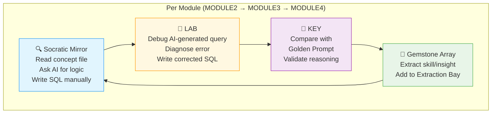

Here is the complete set of ACCELERATE documentation for Module 5, following the same structure as the ACQUIRE Module 1 Guide but adapted for the twisted, spiral path.

---

# 🗄️🤖 SQL & GenAI Course
**🎯 Quality Education for Anyone, Anywhere, Anytime — 💫 with Comfort, Convenience at no Cost**

## 🗺️ Module 5 Guide: Your AI Acceleration Journey

This guide follows the **🔍 Socratic Mirror → 🧪 LAB → 🔑 KEY → 💎 Gemstone Array** rhythm. Unlike the linear path of ACQUIRE, you will spiral through concepts from Modules 2, 3, and 4, revisiting each with AI acceleration.

---

### 📍 Your Position in the 4 A's Journey

| Phase | Current Module | AI Role |
|-------|----------------|---------|
| **🔴 ACCELERATE** (Week 5) | **Module 5: GenAI SQL Co‑pilot Walkthrough** | **Socratic AI Mentor – No Code Generation** |

**You are here:** Sharpening your SQL skills with AI as a thinking partner, not a ghostwriter.

---

## 🏢 **The Browser Office: Your Universal Launchpad**

**🚀 Kickstart: Any Computer, Any Browser, Anytime.**  
**🌍 Destination: Any country, Any city, Any Platform.**

### **📋 The Standard Four-Tab Setup (Levels 1 & 2)**
| Tab | Purpose | Tools & Examples | Description |
| :--- | :--- | :--- | :--- |
| **1: The Map** | Learning content & navigation | Course Repository (GitHub) | Your central hub for all course materials, module guides, and resources. |
| **2: The Factory** | Hands-on practice | SQLite Online | An online SQL environment where you'll run queries and experiment with databases. |
| **3: The Consultant** | AI assistance & explanations | ChatGPT, Claude, Gemini | Your AI learning partner, configured to provide conceptual guidance without writing code for you. |
| **4: The Vault** | Progress tracking & portfolio | GitHub Web, notes | Your personal GitHub repository where you'll store all your work, reflections, and completed exercises. |

> **Keyboard Shortcuts:** `Ctrl+1` / `Cmd+1` for Tab 1, `Ctrl+2` / `Cmd+2` for Tab 2, `Ctrl+3` / `Cmd+3` for Tab 3, `Ctrl+4` / `Cmd+4` for Tab 4.

---

### 🔧 **Need Help?**

| 🔧 Troubleshooting | 🔄 Workflow | ⌨️ Tab Operations |
| :---: | :---: | :---: |
| [Troubleshooting Common Issues](../../../Setup/STEP1_COMMISSION_BROWSER_OFFICE.md) | [Browser Office Workflow](../../../Setup/STEP2_ESTABLISH_LEARNING_RITUAL.md) | [Tab Operations & Shortcuts](../../../Setup/STEP3_MASTER_TAB_OPERATIONS.md) |

---

## 🏢 **Your Browser Office for Module 5 (AI Acceleration Mode)**

For this module, here's exactly how to use each tab:

| Tab | Purpose | Tools & Examples for This Module | Description |
| :--- | :--- | :--- | :--- |
| **1: The Map** | Follow the twisted path | • `01-The-Socratic-Mirror/ACQUIRE-MODULE2/` → `1-the-sieve-select.md` • Then `02-Exercises/MODULE2/1-basic-select-LAB.md` • Then `03-Solutions/MODULE2/1-basic-select-KEY.md` • Then repeat for MODULE3, MODULE4 • Finally `04-Interactive-Simulations/` | The twisted path: you'll bounce between modules, not go linearly. |
| **2: The Factory** | Write SQL manually | • Load `training_institution_sample.db` or `level1_estore_basic.db` as needed • Write your own queries based on AI's logic | **You write every line of SQL.** The AI only explains logic. |
| **3: The Consultant** | Socratic guidance only | • "What is the logical relationship between students and enrollments?" • "How would you find customers with no orders?" ❌ **NO SQL CODE – logic only** | Your AI is configured as a Socratic mentor. Never ask for code. |
| **4: The Vault** | Store mirrored logs & Skill‑Tree gems | • Save Socratic logs in `Learning/Level-1-beginner/ACCELERATE/01-The-Socratic-Mirror/ACQUIRE-MODULE2/1-the-sieve-select.md` • Save LAB solutions in `.../02-Exercises/MODULE2/...` • Use `EXTRACTION_BAY/SkillTree/GemstoneArray.md` to collect gems for your Skill‑Tree database | Your Vault mirrors the course structure exactly – 1:1 mapping. |

---

### 🔶 **Why the Twisted Path? (The Spiral Curriculum)**

In ACQUIRE, you learned SQL concepts linearly. In ACCELERATE, you will revisit them in a **spiral** – jumping between Modules 2, 3, and 4. This is not random. It's a deliberate pedagogical technique that:

- **Strengthens long‑term memory** by spacing out retrieval practice
- **Builds connections** between related concepts (e.g., WHERE vs HAVING, JOIN vs subquery)
- **Simulates real‑world problem solving** where you rarely work on one isolated topic
- **Accelerates Skill‑Tree building** by extracting gemstones from both ACQUIRE and ACCELERATE files in parallel

> *“The twisted path is not chaos. It is the shortest route to professional intuition.”*

---

## 🌀 The Twisted Path Workflow (Spiral Rhythm)

Instead of a linear **PREPARE → PRACTICE → EVALUATE**, you will follow a **spiral loop** for each concept group.

### Detailed Loop Steps

| Step | Folder | What You Do | Outcome |
|------|--------|-------------|---------|
| **🔍 Socratic Mirror** | `01-The-Socratic-Mirror/ACQUIRE-MODULE2/` | Read a concept file (e.g., `1-the-sieve-select.md`). Ask the AI a Socratic question about the logic. Write the SQL manually in Tab 2. | You understand the *why* before the *how*. |
| **🧪 LAB** | `02-Exercises/MODULE2/` | Open the corresponding LAB file (e.g., `1-basic-select-LAB.md`). It contains a broken AI‑generated query. Diagnose the error using Socratic questioning. Write the corrected SQL manually. | You can spot and fix AI hallucinations. |
| **🔑 KEY** | `03-Solutions/MODULE2/` | Open the KEY file (e.g., `1-basic-select-KEY.md`). It provides a **golden prompt** and validation checklist – **not full SQL code**. Compare your reasoning. | You learn to verify AI logic, not trust it blindly. |
| **💎 Gemstone Array** | `EXTRACTION_BAY/SkillTree/GemstoneArray.md` | Extract the skill name, objective, and your viewpoint from the concept file. Also extract any insights from the LAB/KEY. Append to the Gemstone Array. | Your Skill‑Tree database accumulates gemstones from both ACQUIRE and ACCELERATE. |

**Repeat this loop for every concept file in MODULE2, then MODULE3, then MODULE4.** After you finish all three modules, you will have a complete set of gemstones ready to import into your Skill‑Tree database.

---

## 🎭 The Crown Jewel: Interactive Simulations

After mastering the spiral loop, you will tackle the **04-Interactive-Simulations/** folder. These 8 cross‑character scenarios are the **grand finale** of ACCELERATE.

Each simulation presents a real‑world business problem featuring the SQLVerse characters (Arjun, Geetha, Raj, Ravi, Annie, Simon). You will:

1. **Understand the data context** (provided in the scenario)
2. **Ask the AI Socratic questions** about the required logic
3. **Write the SQL manually** in Tab 2
4. **Save your query and reflections** in your Vault (mirroring the simulation filename)
5. **Extract gemstones** (new skills/insights) into your Gemstone Array

After completing all simulations, you will have a rich portfolio of AI‑assisted problem‑solving examples to show employers.

---

## 💎 Building Your Skill‑Tree Database During ACCELERATE

You have already created a Skill‑Tree database in ACQUIRE. Now you will **keep it up to date** using the **Gemstone Array** method.

### 🛠️ The Gemstone Array Workflow

1. **Create `GemstoneArray.md`** in `EXTRACTION_BAY/SkillTree/` (if not already present).
2. **During the spiral loop**, for each concept file (e.g., `1-the-sieve-select.md`):
   - Open the **ACQUIRE version** of the file in the course map (Tab 1) and extract:
     - `skill_name`, `module_id`, `filename`, `objective_text`, `student_viewpoint`
   - Open the **ACCELERATE version** of the file and extract:
     - How the Socratic prompt changed your understanding
     - Any new insight about AI collaboration
   - Append these as rows to the **Markdown table** in `GemstoneArray.md`.
3. **After completing MODULE2**, convert the table to CSV:
   - Copy the entire table (including header) into a new Google Sheet.
   - Export as CSV and save in `EXTRACTION_BAY/SkillTree/csv/skills_batch_2.csv`.
4. **Import the CSV** into your Skill‑Tree database using the staging table pattern (see BUILD file).
5. **Clear the table** in `GemstoneArray.md` and repeat for MODULE3 and MODULE4.
6. **Also import insights** from the Socratic Mirror and simulations.

> 💡 **Why this works:** By extracting gemstones *during* the spiral, you never have to go back and manually enter data. Your Skill‑Tree grows naturally with your learning.

---

## 🚀 Your ACCELERATE Journey: Step by Step

### 📍 Stage 1: Complete the Spiral Loop for MODULE2

| Step | Action | Folder | Time |
|------|--------|--------|------|
| 1 | Read `1-the-sieve-select.md`, ask AI, write SQL | `01-The-Socratic-Mirror/ACQUIRE-MODULE2/` | 15 min |
| 2 | Complete LAB `1-basic-select-LAB.md` | `02-Exercises/MODULE2/` | 10 min |
| 3 | Review KEY `1-basic-select-KEY.md` | `03-Solutions/MODULE2/` | 5 min |
| 4 | Extract gemstones into `GemstoneArray.md` | `EXTRACTION_BAY/SkillTree/` | 5 min |
| 5 | **Repeat** for all 7 files in MODULE2 (1-the-sieve-select.md through 7-distinct-aliases.md) | | |
| 6 | **After MODULE2**, convert GemstoneArray to CSV and import into Skill‑Tree | | 15 min |

### 📍 Stage 2: Complete the Spiral Loop for MODULE3

Same rhythm, but for the 5 files in `ACQUIRE-MODULE3/` (1-order-by.md through 5-execution-order.md).

### 📍 Stage 3: Complete the Spiral Loop for MODULE4

Same rhythm, for the 7 files in `ACQUIRE-MODULE4/` (1-IntroToJoins.md through 7-Normalization.md).

### 📍 Stage 4: The Crown Jewel – Interactive Simulations

Complete all 8 simulation scenarios in `04-Interactive-Simulations/`. For each:

1. Read the scenario.
2. Engage in Socratic dialogue with AI.
3. Write SQL manually.
4. Save your query and log in your Vault.
5. Extract any new gemstones (e.g., “Handling missing phone numbers with COALESCE”).

---

## ✅ Module 5 Completion Checklist

Before you graduate from ACCELERATE, ensure you can:

- [ ] Explain the difference between ACQUIRE and ACCELERATE learning approaches.
- [ ] Complete a Socratic Mirror cycle (read → ask → write) without the AI generating code.
- [ ] Diagnose and fix a broken AI‑generated query from a LAB file.
- [ ] Use the golden prompt and validation checklist from a KEY file.
- [ ] Extract gemstones into `GemstoneArray.md` and import CSV into Skill‑Tree.
- [ ] Successfully solve at least 3 interactive simulations.
- [ ] Feel confident using AI as a **thinking partner**, not a crutch.

---

## 💎 DESIGNER'S PERIGON (ACCELERATE EDITION)

### *The Artisan's Acceleration*

You have now experienced the **twisted path** – a spiral that intentionally disrupts linear comfort. Why? Because real data problems never arrive in textbook order. They are messy, interconnected, and require you to jump between concepts.

By revisiting Modules 2, 3, and 4 with AI acceleration, you have:

- **Strengthened your retrieval** of fundamentals (spacing effect)
- **Built mental bridges** between related concepts (e.g., WHERE vs HAVING, JOIN vs subquery)
- **Learned to lead the AI** – to ask the right questions, validate the answers, and write the final SQL yourself.
- **Grown your Skill‑Tree** naturally, without a separate data entry marathon.

> *“The twisted path is not chaos. It is the shortest route to professional intuition.”*

---

## 🎉 MODULE 5 COMPLETE

### ✅ Congratulations, You've Mastered AI‑Accelerated SQL!

**You have successfully:**
- Applied the Socratic AI Method™ across all ACQUIRE concepts
- Debugged and corrected AI‑generated queries
- Validated AI logic using a sanity protocol
- Extracted and imported gemstones to your Skill‑Tree database
- Conquered 8 interactive simulations with real‑world business problems

---

### 🎓 **Your Achievement Awaits**

You've successfully completed Module 5! Your transformation from manual coder to AI‑accelerated Artisan is complete.

**View your official certificate here:**  
[📜 **MODULE 5 CERTIFICATE →**](./MODULE5_GRADUATION.md)

*Print it, share it, celebrate it. Then return here to continue your journey.*

---

### 💎 **REFLECT BEFORE YOU PROCEED**

**What was the most surprising insight you gained from the twisted path? How did revisiting concepts out of order change your understanding?**

_______________________________________________________
_______________________________________________________

**Which AI hallucination did you catch, and how did you verify the correct logic?**

_______________________________________________________

*Document these reflections in your Vault. They're the evidence of your evolution from SQL coder to AI‑savvy data artisan.*

---

### 🚀 **Ready for the Next Adventure?**

You are now ready for the **ANALYZE** phase, where you will study professional projects (HR Analytics Dashboard, University Manager) and learn from expert code patterns.

---

# [▶️ **PROCEED TO ANALYZE PHASE**](../../Guides/SECTION3_INDUCTION.md)

---

*Part of our mission for 🎯 Quality Education for Anyone, Anywhere, Anytime — 💫 with Comfort, Convenience at no Cost.*

**Level 1 | Module 5 Guide | AI Acceleration | Next: ANALYZE Induction**

---

## 🎯 **Learning Objectives**

By completing Module 5, you will be able to:

1. **Apply the Socratic AI Method™** – prompt for logic, not code, across all ACQUIRE concepts.
2. **Audit AI‑generated SQL** – spot hallucinations, edge case omissions, and performance anti‑patterns.
3. **Use the validation checklist** – ask about NULLs, edge cases, SQLite syntax, scaling, and hidden assumptions.
4. **Extract gemstones** – capture skills, insights, and patterns into your Skill‑Tree database.
5. **Solve real‑world business problems** through 8 interactive simulations (cross‑character role‑play).
6. **Transition from “correctness” to “judgment”** – know when to trust AI and when to challenge it.

## 🧭 **Your Learning Compass for This Module**

**Journey Stage:** AI Acceleration – **refining existing knowledge**  
**AI Co‑pilot Role:** Socratic Mentor – explains logic, never writes code  
**Primary Goal:** Learn to lead AI, not follow it – extract gemstones into your Skill‑Tree, complete 8 interactive simulations, and emerge as an AI‑augmented analyst.

**What This Means for You:**
- **🧠 Mindset Shift:** From “how do I write this?” to “what is the logical relationship?” The AI gives strategy; you write the SQL.
- **🤖 AI Guidelines:** Never ask for code. Ask for conceptual guidance, optimisation hints, validation checks, and anti‑pattern detection. If the AI writes code, redirect.
- **🎯 Success Metric:** You can take a broken AI‑generated query, diagnose the error through Socratic questioning, write the correct SQL manually, and explain *why* the AI was wrong.

> **Philosophical Anchor:** “ACQUIRE builds correctness. ACCELERATE builds judgment.”

---

## 🏢 **The Browser Office: Your Universal Launchpad**

**🚀 Kickstart: Any Computer, Any Browser, Anytime.**  
**🌍 Destination: Any country, Any city, Any Platform.**

### **📋 The Standard Four-Tab Setup (Levels 1 & 2)**
| Tab | Purpose | Tools & Examples | Keyboard Shortcut |
| :--- | :--- | :--- | :--- |
| **1: The Map** | Learning content & navigation | Course Repository (GitHub) | `Ctrl+1` / `Cmd+1` |
| **2: The Factory** | Hands‑on practice | SQLite Online | `Ctrl+2` / `Cmd+2` |
| **3: The Consultant** | AI assistance & explanations | ChatGPT, Claude, Gemini | `Ctrl+3` / `Cmd+3` |
| **4: The Vault** | Progress tracking & portfolio | GitHub Web, notes | `Ctrl+4` / `Cmd+4` |

---

## 📋 **Prerequisites**

Before beginning Module 5, ensure you have:

- [ ] **ACQUIRE Phase Complete** – Modules 1‑4 finished, Skill‑Tree database populated.
- [ ] **ACCELERATE Induction Verified** – You passed the verification test (`SECTION2_INDUCTION_FINISH.md`).
- [ ] **Browser Office Open** – All four tabs configured.
- [ ] **AI Persona Set** – Your Consultant (Tab 3) is configured as a Socratic SQL mentor (never writes code).
- [ ] **Vault Ready** – Your GitHub repository contains the ACCELERATE folder structure (mirroring the course).
- [ ] **Extraction Bay Created** – `EXTRACTION_BAY/SkillTree/GemstoneArray.md` exists (temporary capture for gemstones).