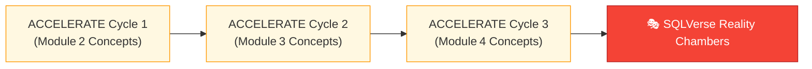
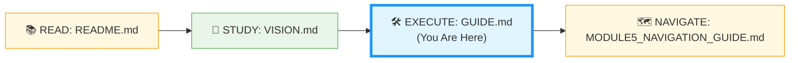

# 🗄️🤖 SQL & GenAI Course
**🎯 Quality Education for Anyone, Anywhere, Anytime — 💫 with Comfort, Convenience at no Cost**

---

## 🛠️ MODULE5 GUIDE: The Tactical Playbook for ACCELERATE

> **Prerequisites:** You have completed the ACCELERATE induction (Fire Drill) and read the **README** (emotional gateway) and **VISION** (philosophy). Now you execute.

---

# ACCELERATE ATLAS

## ACCELERATE Piloting with AI Co‑pilot

Your journey through ACCELERATE follows a deliberate sequence of three **Acceleration Cycles**, each revisiting the concepts from one ACQUIRE module through the four engines. After completing all three cycles, you enter the final proving ground: the **SQLVerse Reality Chambers**.



Instead of “repeating” old modules, you will enter **Acceleration Cycles**:

| Cycle | Covers ACQUIRE Module | Number of Concepts |
|-------|----------------------|--------------------|
| **ACCELERATE Cycle 1** | Module 2 (SELECT, WHERE, NULL, DISTINCT, etc.) | 7 files |
| **ACCELERATE Cycle 2** | Module 3 (ORDER BY, GROUP BY, HAVING, aggregate functions) | 5 files |
| **ACCELERATE Cycle 3** | Module 4 (JOINs, normalisation, self‑join) | 7 files |

**Order:** ACCELERATE Cycle 1 → ACCELERATE Cycle 2 → ACCELERATE Cycle 3. Do not mix cycles. After all three cycles, you will tackle the **SQLVerse Reality Chambers** (the crown jewel).

To pilot this landscape, this guide is organised into 6 phases.

---

## Phase 1: Technical Framework Setup

### The Four Engines – Operational View

| Engine | What You Do | Where Files Live |
|--------|-------------|------------------|
| **🔍 Socratic Mirror** | Read a concept file, map abstract database logic via Socratic dialogue with AI,(No code generation) and save session logs in your Vault mirror. | `01-The-Socratic-Mirror/ACQUIRE-MODULE2/` (and 3,4) |
| **🧪 Exercise Bay** | Open a LAB file (broken AI query), diagnose error via Socratic questioning, and write corrected SQL manually in the Factory. | `02-Exercises/MODULE2/` (and 3,4) |
| **🔑 Solution Validation** | Open the KEY file, compare your reasoning with the golden prompt and validation checklist. | `03-Solutions/MODULE2/` (and 3,4) |
| **🎭 Reality Chambers** | Solve 8 cross‑character business problems; execute full SQL refactoring, document tradeoffs, and perform gem extraction. | `04-Interactive-Simulations/` |

```
ACCELERATE/
├── 01-The-Socratic-Mirror/
│   ├── ACQUIRE-MODULE2/       (7 concept files, e.g., 1-the-sieve-select.md)
│   ├── ACQUIRE-MODULE3/       (5 concept files)
│   └── ACQUIRE-MODULE4/       (7 concept files)
├── 02-Exercises/
│   ├── MODULE2/               (LAB files, e.g., 1-basic-select-LAB.md)
│   ├── MODULE3/               (LAB files)
│   └── MODULE4/               (LAB files)
├── 03-Solutions/
│   ├── MODULE2/               (KEY files, e.g., 1-basic-select-KEY.md)
│   ├── MODULE3/               (KEY files)
│   └── MODULE4/               (KEY files)
└── 04-Interactive-Simulations/   (8 scenario files)
```

**Your Vault mirror** (in your GitHub repository) must have the same structure. Save every log, corrected SQL, and reflection in the corresponding folder.

---

### AI Usage Protocols – Strict Rules

These are non‑negotiable. Violating them will undermine your learning.

#### 🟢 Allowed (Green)

- Ask for **conceptual guidance**: “What is the logical relationship between these tables?”
- Ask for **optimisation hints**: “What would make this query faster?”
- Ask for **reasoning critique**: “Did I miss any edge cases in my approach?”
- Ask for **validation**: “Does my query handle NULLs correctly?”
- Ask for **anti‑pattern detection**: “What’s wrong with using `SELECT *` here?”

#### 🔴 Forbidden (Red)

- **“Write me a query that…”** – never ask for code.
- **“Fix my SQL”** – instead ask “What could cause this error? Hint me, don’t fix it.”
- **“Generate a schema for…”** – instead ask “Based on my 3NF design, what entities should I consider?”
- **“Give me the answer”** – instead ask “Guide me through the steps to discover the answer.”

#### 🟡 Conditional (Yellow – only after you have written your own version)

- Ask for a **function signature** (e.g., “What is the syntax for `COALESCE`?”) – but only after you have attempted to write it yourself.

> **If the AI writes code anyway** – redirect: “Explain the logic, don’t write SQL.” If it persists, restart the conversation.

---

### Browser Office – Tab Configuration 

**Tuned to AI Protocols and Boundaries**

| Tab | Purpose | Resource | Keyboard Shortcut |
|-----|---------|----------|-------------------|
| **1: The Map** | ACCELERATE files (Socratic Mirror, Exercises, etc.) | `Module5-GenAI-Walkthrough/` | `Ctrl+1` / `Cmd+1` |
| **2: The Factory** | Manual SQL execution | SQLite Online – load `training_institution_sample.db`, `level1_estore_basic.db`, or specialised Module 4 databases (e.g., `level1_estore_self_join.db`, `tourism_planet_self_join.db`) as needed | `Ctrl+2` / `Cmd+2` |
| **3: The Consultant** | Socratic AI mentor (no code generation) – obey the protocols above | ChatGPT, Claude, or Gemini configured with:<br>`AI_PERSONA_PROMPT.md`<br>SQLVerse character stories<br>Relevant schema anchor for the database loaded in Tab 2<br>(See [`BROWSER-OFFICE-ACCELERATE.md`](./BROWSER-OFFICE-ACCELERATE.md) for full setup) | `Ctrl+3` / `Cmd+3` |
| **4: The Vault** | Your GitHub repository, ACCELERATE mirror | `Learning/Level-1-beginner/ACCELERATE/` | `Ctrl+4` / `Cmd+4` |

> **Before starting:** Ensure your AI Consultant is still in **Student Mode / Socratic Mentor** mode. If you are unsure, re‑run the persona prompt from `AI_PERSONA_PROMPT.md`. The protocols above are the operating rules for every interaction.

---

## Phase 2: Gemstone Mining

### Purpose of the Extraction Bay

The **Extraction Bay** (`EXTRACTION_BAY/` at your portfolio root) is a **temporary scratchpad** used across all phases (ACQUIRE, ACCELERATE, ANALYZE, ARCHITECT). In ACCELERATE, you use it to collect gemstones from concept files. In later phases, you may use it for temporary backups, CSV exports, Excel imports, or other data transformation tasks.

> **Important:** Add `EXTRACTION_BAY/` to your `.gitignore` file. This folder is transient – it should never be committed to your repository. Only the final Skill‑Tree database (`Skill-Tree-DB/`) is versioned.

### Extraction Bay – Operational Instructions

The Extraction Bay is the factory where gemstones are mined. This is where you will collect, refine, and prepare your reusable **knowledge artifacts** before they are permanently stored in your **Skill‑Tree** database.

### Locate `GemstoneArray.md`

You already created `EXTRACTION_BAY/SkillTree/` during the ACCELERATE induction. Inside that folder, you will find `GemstoneArray.md`. If it is missing for any reason, create it now.

**File location:** `EXTRACTION_BAY/SkillTree/GemstoneArray.md`

### Gemstone Table Format

Use this **Markdown table** – copy the header once, then append rows for each gem.

```markdown
| skill_id | module_id | filename | skill_name | objective_text | student_viewpoint |
|----------|-----------|----------|------------|----------------|--------------------|
| (auto)   | 2         | 1-the-sieve-select.md | SELECT fundamentals | Choose columns | "Select is like a lens" |
```

- **skill_id** – leave empty (SQLite will auto‑increment) or use a placeholder.
- **module_id** – 2 for Cycle 1, 3 for Cycle 2, 4 for Cycle 3.
- **filename** – exact name of the concept file.
- **skill_name** – short name of the skill.
- **objective_text** – what the concept teaches.
- **student_viewpoint** – your personal reflection (what clicked, what surprised you).

> **For other tables** (`bonus_skills_level1`, `insights_level1`, `achievements_level1`), use the same Markdown table pattern with the appropriate columns. Refer to the schema in [`SKILL_TREE_ARCHITECTURE.md`](../Guides/SKILL_TREE_ARCHITECTURE.md) (Sections 3.4–3.6) for column names.

### Convert to CSV and Import

**At the end of each Acceleration Cycle** (after all concepts in that cycle are done):

1. **Copy** the entire Markdown table (including header row) from `GemstoneArray.md`.
2. **Paste** into a new Google Sheet (or Excel).
3. **Export as CSV** (File → Download → CSV) and save as `cycle1_skills.csv` (or `cycle2_skills.csv`, etc.) inside `EXTRACTION_BAY/SkillTree/csv/`.
4. **Import into your Skill‑Tree database** using the staging table pattern (see `SECTION1_COMPLETION_BUILD.md`, Part 2). Use `temp_skills_level1` staging table.
5. **Clear** the Markdown table in `GemstoneArray.md` (keep the header row, delete the data rows) for the next cycle.

---

## Phase 3: Daily Workflow

### The 9‑Step Algorithmic Daily Workflow

This is the core **execution engine** of ACCELERATE. Repeat these 9 steps for every concept file in each Acceleration Cycle. The workflow ensures you extract knowledge from both ACQUIRE and ACCELERATE, refine it through AI partnership, and capture reusable gemstones for your Skill‑Tree.

**Time expectation per concept:** ~45‑60 minutes.

```mermaid
flowchart LR
    Step1["1. Read ACQUIRE<br/>Materials"] --> 
    Step2["2. Extract ACQUIRE<br/>Gemstones"] --> 
    Step3["3. Open ACCELERATE File<br/>& Initialize Mirror Prompt"] -->
    Step4["4. Map the Logical<br/>Blueprint"] -->
    Step5["5. Hit the SQL<br/>Factory"] -->
    Step6["6. Check SQL &<br/>Prompt AI on Errors"] -->
    Step7["7. Validate Against<br/>Framework"] -->
    Step8["8. Extract ACCELERATE<br/>Gemstone"] -->
    Step9["9. Log Hallucination<br/>(if any)"]

    style Step1 fill:#fff8e1,stroke:#ff9800
    style Step2 fill:#e8f5e9,stroke:#4caf50
    style Step3 fill:#f3e5f5,stroke:#9c27b0
    style Step4 fill:#f3e5f5,stroke:#9c27b0
    style Step5 fill:#e1f5fe,stroke:#2196f3
    style Step6 fill:#e1f5fe,stroke:#2196f3
    style Step7 fill:#f3e5f5,stroke:#9c27b0
    style Step8 fill:#e8f5e9,stroke:#4caf50
    style Step9 fill:#ffebee,stroke:#f44336
```



---
### 🔬 Detailed Deep Dive of the Steps

| Step | Action | Time | Save / Output |
|------|--------|------|----------------|
| **1** | Read ACQUIRE Materials – Open the ACQUIRE lesson file mirroring your ACCELERATE file, exercises, quiz, and solutions. Read them thoroughly for complete conceptual understanding. | 10 min | – |
| **2** | Extract ACQUIRE Gemstones – Collect gems (skill name, objective, your viewpoint, quiz scores, exercise completions) and add them to `GemstoneArray.md`. | 5 min | Append to Extraction Bay table |
| **3** | Open the ACCELERATE lesson file and Initialize Mirror Prompt (Ask for abstract logic, NO code). | 5 min | Conversation in Tab 3 |
| **4** | Map the Logical Blueprint (Write out pseudo‑steps). | 5 min | Scratchpad notes |
| **5** | Hit the SQL Factory (Manually type and run SQL). | 10 min | SQL in Tab 2 |
| **6** | Check if the SQL works. If not, prompt AI with SQL Errors and ask for logic to fix the errors. | 10 min | Iterative debugging |
| **7** | Validate Against Framework (Run the 5‑point safety check). | 5 min | – |
| **8** | Extract ACCELERATE gemstone for the lesson file and add it to `GemstoneArray.md` using the format provided in [`SOCRATIC_LOG_TEMPLATE.md`](./SOCRATIC_LOG_TEMPLATE.md) (Extract reusable structure). | 5 min | Append to Extraction Bay table |
| **9** | Log Hallucination (if any) – Add to `Socratic_Journals/hallucination_log.md` using the template provided in [`AI_ERROR_HALLUCINATION_LOG.md`](./AI_ERROR_HALLUCINATION_LOG.md). | 5 min | Hallucination entry |

### 🔍 The 5‑Point Validation Checklist (for Step 7)

When reviewing any SQL (your own, AI‑generated, or from KEY files), apply this checklist:

- **NULL Safety:** How are missing or `NULL` inputs handled? Does the logic safely account for how SQLite treats unexpected blank records during filters or arithmetic operations?
- **Edge Cases:** What happens at completely empty tables, missing relational match records, or maximum boundary parameters?
- **SQLite Syntax Compliance:** Is the statement natively compliant with the SQLite runtime engine (ensuring zero usage of incompatible expressions like `DATEDIFF` or `TOP`)?
- **Scalability & Performance:** Will this specific query architecture experience sudden degradation or index blocks if the table scales to millions of data records?
- **Hidden Business Assumptions:** What hidden assumptions is this logic making about the overall schema relationships, ordering states, or raw incoming data quality?

---

### The Dual Purpose of This Workflow

This workflow is designed with a dual purpose:

1) By thoroughly reading your **ACQUIRE lessons**, exercises, and Vault reflections before working on the Socratic Mirror file, you **solidify** your understanding of **foundational concepts** to a top‑notch level.

2) When you prompt the AI with a question, you **automatically focus** on the **logic** behind the SQL – because you are already well‑versed with the syntax.

---

## Phase 4: Skill‑Tree Update Routine (After Each Cycle)

After you have imported the CSV, run these verification queries in Tab 2 to confirm that the new rows are present:

```sql
SELECT COUNT(*) FROM skills_level1 WHERE module_id = 2;  -- for Cycle 1
SELECT COUNT(*) FROM skills_level1 WHERE module_id = 3;  -- for Cycle 2
SELECT COUNT(*) FROM skills_level1 WHERE module_id = 4;  -- for Cycle 3
```

You should see the number of new skills added. Also run:

```sql
SELECT * FROM skills_level1 ORDER BY skill_id DESC LIMIT 10;
```

to visually inspect the latest entries.

### Update Routine for Other Core Tables

Repeat the exact same **operational routine** for your adjacent metric domains: `bonus_skills_level1`, `insights_level1`, and `achievements_level1`. For each:

1. Maintain a **separate section** in `GemstoneArray.md` (or use the same table with appropriate columns).
2. Export their **parsed datasets** via the tracking spreadsheet tool (copy Markdown table → Google Sheets → CSV).
3. Pass the records through the explicit **staging system layer** (create staging table → import CSV → insert into main table).
4. Verify the **total commits** via `SELECT COUNT(*)` on each table after import.

> *“Consistency across all core tables ensures your Skill‑Tree remains complete and queryable.”*

### Updating After Reality Chambers (Simulations)

After completing the 3 ACCELERATE cycles, your Skill‑Tree contains **gemstones** from the entire **ACQUIRE phase** and **gemstones for the 3 cycles** in the ACCELERATE phase.

After completing each simulation, extract any new gemstones (e.g., patterns, anti‑patterns, validation insights) into `GemstoneArray.md`. At the end of all 8 simulations, follow the same ETL workflow (Transform → Load) to import these gemstones into your Skill‑Tree database. Use the staging table pattern for the appropriate core table (`skills_level1`, `insights_level1`, or `achievements_level1` depending on the gem type).

Now your **Skill‑Tree** is **up to date** with the **entire data** from **ACQUIRE** and **ACCELERATE** phases.

> *“Simulations are not just exercises – they are rich sources of judgment‑level gemstones.”*

---

## Phase 5: Hallucination Detection & Logging

Whenever the AI makes a mistake – wrong function, missing edge case, invalid SQLite syntax – you **must** log it.

**Where:** `Socratic_Journals/hallucination_log.md` (create the file if it doesn’t exist). Use the template from `AI_ERROR_HALLUCINATION_LOG.md`.

**What to log:**
- What the AI said (quote)
- What was actually correct
- How you caught it
- What you learned

**What to discard (do not log):**
- Simple typos you corrected
- Unverified suggestions that you ignored
- Code the AI wrote (you should have redirected it)

> **Why this is important:** This log becomes proof of your AI auditing skill – a portfolio asset.

---

## Phase 6: Reality Chambers (Simulations) – How to Approach

After completing **all three Acceleration Cycles** (Cycle 1, Cycle 2, Cycle 3), you are ready for the crown jewel.

Before beginning with the crown jewel, make a thorough study of the **CTO, CEO, and CFO Report exercises** in `2-practiceExercises/Capstone Reports/` folder and the **interview simulations** in the folder `4-exerciseAndQuizSolutions/6-capstone-solutions/simulations/` in ACQUIRE Module 4. This will give you a clear understanding of the SQLVerse characters, their domains, and the interconnected relationships between the domains.


**Folder:** `04-Interactive-Simulations/` (8 scenarios)

**For each scenario:**

1. **Read the scenario** carefully. Identify the business problem and the characters involved.
2. **Extract the data context** – which tables? what relationships? (Use the schema anchors if needed.)
3. **Engage in Socratic dialogue with the AI** – ask about the logical steps, edge cases, and performance considerations. **Never ask for code.**
4. **Write the full SQL manually** in Tab 2.
5. **Test your query** – verify the results match the expected business outcome (described in the scenario).
6. **Save your solution** in your Vault mirror: `Learning/Level-1-beginner/ACCELERATE/04-Interactive-Simulations/1-SCENARIO_Arjuns_Repair_Leak.md` (use the same filename as the scenario).
7. **Extract any new gemstones** (e.g., “Handling missing phone numbers with COALESCE”) into `GemstoneArray.md`.
8. **After completing all 8 simulations**, import the final gemstones into your Skill‑Tree (same CSV process).

**Time expectation per simulation:** 30‑45 minutes.

---
## 🗺️ Your ACCELERATE Flight Plan (Track Your Journey)

> **Note to Pilot:** You are at the starting line. Use this section to preview where you are heading, and check off these milestones as you complete each phase of the playbook.

- [ ] **Milestone 1:** Finished Cycle 1 (Module 2 Concepts) & imported Gems into the Skill-Tree.
- [ ] **Milestone 2:** Finished Cycle 2 (Module 3 Concepts) & imported Gems into the Skill-Tree.
- [ ] **Milestone 3:** Finished Cycle 3 (Module 4 Concepts) & imported Gems into the Skill-Tree.
- [ ] **Milestone 4:** Conquered all 8 Reality Chambers (Simulations) and pushed code to the Vault.
- [ ] **Milestone 5:** Caught and logged at least one AI error in your Hallucination Log.

---

## 🔁 Navigation



| Previous | Next |
|----------|------|
| [← ACCELERATE VISION](./ACCELERATE_VISION.md) | [MODULE5 NAVIGATION GUIDE →](./MODULE5_NAVIGATION_GUIDE.md) |

---

*Part of our mission for 🎯 Quality Education for Anyone, Anywhere, Anytime — 💫 with Comfort, Convenience at no Cost.*

**Level 1 | ACCELERATE Phase | Module 5 Guide | Ready for NAVIGATION**


