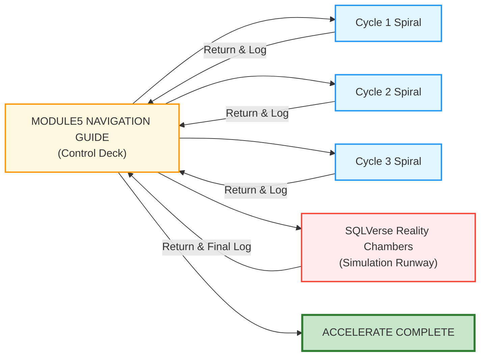

# 🗄️🤖 SQL & GenAI Course
**🎯 Quality Education for Anyone, Anywhere, Anytime — 💫 with Comfort, Convenience at no Cost**

---

## 🗺️ MODULE5 NAVIGATION GUIDE: The Flight Control Deck

 **Welcome to the ACCELERATE phase.** You have already built your SQL foundation in ACQUIRE. Now you will revisit those same concepts – but this time with AI as your Socratic partner.

Unlike the **continuous march** of the ACQUIRE modules, the ACCELERATE phase is executed in distinct **Laps**. Your traversal from this file is strictly linear, but each destination link launches you into an independent, deep-immersion **Sub-Navigation Spiral** or **Simulation Runway**. 

> **The Flight Rule:** After completing a lap, you **must** make a round-trip return to this Control Deck, fill out your feedback telemetry, and unlock the next leg of your journey.

---

## 🗺️ Your ACCELERATE Journey



| Stage | What You Will Do | After Completion |
|-------|------------------|------------------|
| **Cycle 1** | Revisit Module 2 concepts (SELECT, WHERE, NULL, DISTINCT, etc.) with AI | Return to this guide |
| **Cycle 2** | Revisit Module 3 concepts (ORDER BY, GROUP BY, HAVING, aggregates) with AI | Return to this guide |
| **Cycle 3** | Revisit Module 4 concepts (JOINs, normalisation, self‑join) with AI | Return to this guide |
| **SQLVerse Reality Chambers** | Solve 8 cross‑character business simulations | Return for final log and Proceed to ACCELERATE Completion |

---

## 🔁 The Spiral Curriculum Structure

In ACQUIRE, you learned linearly: Concept 1 → Concept 2 → Concept 3. In ACCELERATE, you will learn through a **spiral** – revisiting the same module three times, each pass from a deeper cognitive layer.

### Three-Pass Reinforcement Spiral

For each Cycle (module), you will make three passes:

```
Cycle 1 (Module 2)
│
├── PASS 1 — The Socratic Mirror
│      ├── Concept 1
│      ├── Concept 2
│      └── Concept 7
│
├── PASS 2 — Exercise Bay
│      ├── LAB 1
│      ├── LAB 2
│      └── LAB 7
│
└── PASS 3 — Solution Validation
       ├── KEY 1
       ├── KEY 2
       └── KEY 7
```

| Pass | What You Do | Cognitive Goal |
|------|-------------|----------------|
| **PASS 1 – Socratic Mirror** | Read concept files, ask AI for logic, write SQL manually | abstraction & logic formation |
| **PASS 2 – Exercise Bay** | Diagnose and fix broken AI‑generated queries | struggle & implementation |
| **PASS 3 – Solution Validation** | Compare your reasoning with golden prompts and checklists | validation & calibration |

**The progression is:** Understand → Struggle → Calibrate.

### The Crucial Structural Insight

- **ACQUIRE navigation taught:** new concept → next concept (linear).
- **ACCELERATE navigation teaches:** same concept‑space viewed from deeper cognitive layers (spiral).

This is not repetition. This is **progressive depth**.

---

## 📋 CYCLE 1 PROGRESSION

| Cycle | Focus | Number of Concepts | After Completion |
|-------|-------|--------------------|------------------|
| **Cycle 1** | Module 2 (SELECT, WHERE, NULL, DISTINCT, aliases) | 7 concept files, 5 LABs, 5 KEYs | Return to Navigation Guide, fill reflection, proceed to Cycle 2 |

### Pass Details

| Pass | Preparation Required | Core Deliverable / Outcome |
|------|----------------------|----------------------------|
| **PASS 1 – Socratic Mirror** | Open `01-The-Socratic-Mirror/ACQUIRE-MODULE2/`; AI configured as Socratic mentor; `MODULE5_GUIDE.md` open for 9‑step workflow | Extracted ACQUIRE gemstones (skills, insights) + ACCELERATE gemstones (AI logic patterns) added to `GemstoneArray.md` |
| **PASS 2 – Exercise Bay** | Open `02-Exercises/MODULE2/`; Factory (Tab 2) ready; Socratic questioning active | Corrected SQL queries for all 5 LAB files; extracted anti‑pattern gemstones |
| **PASS 3 – Solution Validation** | Open `03-Solutions/MODULE2/`; your own SQL solutions ready for comparison | Validated reasoning against golden prompts; completion checklist filled; final gemstone extraction |

🚀 **[Kickstart Your Cycle 1 Journey →](./01-The-Socratic-Mirror/CYCLE1_GUIDE.md)**

---

## 🎯 CYCLE 1 COMPLETE – READY FOR CYCLE 2

*Fill this section after you return from Cycle 1.*

**🎉 Congratulations!** You have completed the first spiral. You have revisited Module 2 concepts with AI, diagnosed broken queries, and validated your reasoning. Your Skill‑Tree now contains gemstones from both ACQUIRE and ACCELERATE for Module 2.

**Proceed to Next Phase:**

➡️ **📖 Next Step:** Read the **CYCLE 2** section below  
   🎯 **Action:** Start Cycle 2 of ACCELERATE

---

<div align="center" style="border: 1px solid #2196f3; padding: 15px; margin: 20px 0; background: #e3f2fd; border-radius: 8px;">

### ✅ **BEFORE YOU BEGIN CYCLE 2**

## 📝 **Lap 1 Black Box Feedback**
Copy the block below into your Vault (e.g., `META_VAULT/accelerate_lap_logs.md`). Fill it after returning from Cycle 1.

````markdown
## Lap 1 – Cycle 1 Orbit (Module 2)

**Date Completed:** [YYYY-MM-DD]

**Hardest Engine Filter Encountered:** [Socratic Mirror / Exercise Bay / Validation Key]

**Primary Learning Break‑Through:** [Write your technical reflection here]

**Skill-Tree Commit Verification Query Result:**
```sql
SELECT COUNT(*) FROM skills_level1 WHERE module_id = 2;
```

**Result Count:** [Insert Count]

> 🔒 **Flight Status:** Lap 1 complete. Proceed to Lap 2.
````

✅ **After saving this feedback in your Vault, return here and click below to unlock Lap 2.**

➡️ **[Proceed to ACCELERATE Cycle 2 →](./01-The-Socratic-Mirror/CYCLE2_GUIDE.md)**


</div>

---

## 📋 CYCLE 2 PROGRESSION

| Cycle | Focus | Number of Concepts | After Completion |
|-------|-------|--------------------|------------------|
| **Cycle 2** | Module 3 (ORDER BY, GROUP BY, HAVING, aggregate functions) | 5 concept files, 5 LABs, 5 KEYs | Return to Navigation Guide, fill reflection, proceed to Cycle 3 |

### Pass Details

| Pass | Preparation Required | Core Deliverable / Outcome |
|------|----------------------|----------------------------|
| **PASS 1 – Socratic Mirror** | Open `01-The-Socratic-Mirror/ACQUIRE-MODULE3/`; AI configured as Socratic mentor; `MODULE5_GUIDE.md` open for 9‑step workflow | Extracted ACQUIRE gemstones (skills, insights) + ACCELERATE gemstones (AI logic patterns) added to `GemstoneArray.md` |
| **PASS 2 – Exercise Bay** | Open `02-Exercises/MODULE3/`; Factory (Tab 2) ready; Socratic questioning active | Corrected SQL queries for all 5 LAB files; extracted anti‑pattern gemstones |
| **PASS 3 – Solution Validation** | Open `03-Solutions/MODULE3/`; your own SQL solutions ready for comparison | Validated reasoning against golden prompts; completion checklist filled; final gemstone extraction |

🚀 **[Kickstart Your Cycle 2 Journey →](./01-The-Socratic-Mirror/CYCLE2_GUIDE.md)**

---

## 🎯 CYCLE 2 COMPLETE – READY FOR CYCLE 3

*Fill this section after you return from Cycle 2.*

**🎉 Congratulations!** You have completed the second spiral. You have revisited Module 3 concepts with AI, diagnosed broken queries, and validated your reasoning. Your Skill‑Tree now contains gemstones from Module 3 as well.

**Proceed to Next Phase:**

➡️ **📖 Next Step:** Read the **CYCLE 3** section below  
   🎯 **Action:** Start Cycle 3 of ACCELERATE

---

<div align="center" style="border: 1px solid #2196f3; padding: 15px; margin: 20px 0; background: #e3f2fd; border-radius: 8px;">

### ✅ **BEFORE YOU BEGIN CYCLE 3**

## 📝 **Lap 2 Black Box Feedback**

Copy the block below into your Vault (same `accelerate_lap_logs.md` file).

````markdown
## Lap 2 – Cycle 2 Orbit (Module 3)

**Date Completed:** [YYYY-MM-DD]

**Hardest Engine Filter Encountered:** [Socratic Mirror / Exercise Bay / Validation Key]

**Primary Learning Break‑Through:** [Write your technical reflection here]

**Skill-Tree Commit Verification Query Result:**
```sql
SELECT COUNT(*) FROM skills_level1 WHERE module_id = 3;
```

**Result Count:** [Insert Count]

> 🔒 **Flight Status:** Lap 2 complete. Proceed to Lap 3.

````

✅ **After saving this feedback in your Vault, return here and click below to unlock Lap 3.**

➡️ **[Proceed to ACCELERATE Cycle 3 →](./01-The-Socratic-Mirror/CYCLE3_GUIDE.md)**


</div>

---

## 📋 CYCLE 3 PROGRESSION

| Cycle | Focus | Number of Concepts | After Completion |
|-------|-------|--------------------|------------------|
| **Cycle 3** | Module 4 (JOINs, normalisation, self‑join) | 7 concept files, 6 LABs, 6 KEYs | Return to Navigation Guide, fill reflection, proceed to SQLVerse Reality Chambers |

### Pass Details

| Pass | Preparation Required | Core Deliverable / Outcome |
|------|----------------------|----------------------------|
| **PASS 1 – Socratic Mirror** | Open `01-The-Socratic-Mirror/ACQUIRE-MODULE4/`; AI configured as Socratic mentor; `MODULE5_GUIDE.md` open for 9‑step workflow | Extracted ACQUIRE gemstones (skills, insights) + ACCELERATE gemstones (AI logic patterns) added to `GemstoneArray.md` |
| **PASS 2 – Exercise Bay** | Open `02-Exercises/MODULE4/`; Factory (Tab 2) ready; Socratic questioning active | Corrected SQL queries for all 6 LAB files; extracted anti‑pattern gemstones |
| **PASS 3 – Solution Validation** | Open `03-Solutions/MODULE4/`; your own SQL solutions ready for comparison | Validated reasoning against golden prompts; completion checklist filled; final gemstone extraction |

🚀 **[Kickstart Your Cycle 3 Journey →](./01-The-Socratic-Mirror/CYCLE3_GUIDE.md)**

---

## 🎯 CYCLE 3 COMPLETE – READY FOR REALITY CHAMBERS

*Fill this section after you return from Cycle 3.*

**🎉 Congratulations!** You have completed the third spiral. You have revisited Module 4 concepts with AI, diagnosed broken queries, and validated your reasoning. Your Skill‑Tree now contains gemstones from all three modules.

**Proceed to Next Phase:**

➡️ **📖 Next Step:** Read the **REALITY CHAMBERS** section below  
   🎯 **Action:** Begin the SQLVerse Reality Chambers

---

<div align="center" style="border: 1px solid #2196f3; padding: 15px; margin: 20px 0; background: #e3f2fd; border-radius: 8px;">

### ✅ **BEFORE YOU BEGIN REALITY CHAMBERS**

## 📝 **Lap 3 Black Box Feedback**

Copy the block below into your Vault (same `accelerate_lap_logs.md` file).

````markdown
## Lap 3 – Cycle 3 Orbit (Module 4)

**Date Completed:** [YYYY-MM-DD]

**Hardest Engine Filter Encountered:** [Socratic Mirror / Exercise Bay / Validation Key]

**Primary Learning Break‑Through:** [Write your technical reflection here]

**Skill-Tree Commit Verification Query Result:**
```sql
SELECT COUNT(*) FROM skills_level1 WHERE module_id = 4;
```

**Result Count:** [Insert Count]

> 🔒 **Flight Status:** Lap 3 complete. Proceed to Lap 4.

````

✅ **After saving this feedback in your Vault, return here and click below to unlock the Reality Chambers.**

➡️ **[Proceed to SQLVerse Reality Chambers →](./04-Interactive-Simulations/REALITY_CHAMBERS_GUIDE.md)**

</div>

---

## 🎭 SQLVerse Reality Chambers (Simulations)

This is your experiential proving ground. This is where everything converges. Syntax, auditing, business reasoning, AI skepticism, architecture, and ambiguity – all merge into a single proving ground. You are no longer practicing concepts. You are **executing judgment under pressure**.

| Chamber | Domain | Core Challenge | After Completion |
|---------|--------|----------------|------------------|
| **1. Arjun's Repair Leak** | Tolling & Revenue | Find missing revenue records using `LEFT JOIN` and `IS NULL` | Extract gemstone: *“The Missing Match Pattern”* |
| **2. Geetha's Cross‑Sell** | Banking & Fraud | Identify phantom travelers with `INNER JOIN` and temporal filters | Extract gemstone: *“Multi‑Table Intersection Logic”* |
| **3. Raj's Library** | Library Operations | Analyse late fee revenue using `GROUP BY` and aggregate functions | Extract gemstone: *“Revenue Aggregation over Time”* |
| **4. Ravi's Missing Phone** | Quick Commerce | Handle missing customer data with `COALESCE` and NULL strategy | Extract gemstone: *“NULL‑Safe Customer Linking”* |
| **5. Annie's Margin Leak** | Event Management | Detect low‑margin event types using `GROUP BY` and `HAVING` | Extract gemstone: *“Threshold‑Based Filtering”* |
| **6. Simon's Email Classifier** | Startup Expo | Normalise unstructured email data into a structured table | Extract gemstone: *“ETL via SQL – Parsing Chaos”* |
| **7. SQLVerse Travels Investment** | Cross‑Domain | Analyse profit and ROI across interconnected business domains | Extract gemstone: *“Cross‑Domain Profitability Modelling”* |
| **8. The SQLVerse Summit** | All Domains | Solve a multi‑layered problem requiring all six characters and mixed JOINs | Extract gemstone: *“Full Stack Business Integration”* |

### After Completing All 8 Chambers

- Export CSV from `GemstoneArray.md` (skills, insights, patterns from all chambers)
- Import into your Skill‑Tree database using the staging table pattern
- Return to the Navigation Guide, fill the final flight log, and proceed to ACCELERATE COMPLETE


🚀 **[Enter the Reality Chambers →](./04-Interactive-Simulations/REALITY_CHAMBERS_GUIDE.md)**


*Fill this section after you return from the Reality Chambers.*

---

<div align="center" style="border: 1px solid #4caf50; padding: 15px; margin: 20px 0; background: #e8f5e8; border-radius: 8px;">

### ✅ **FINAL FLIGHT LOG – BEFORE LEAVING ACCELERATE**

## 📝 **Lap 4 Black Box Feedback – The Proving Ground**

Copy the block below into your Vault (same `accelerate_lap_logs.md` file).

````markdown
## Lap 4 – Reality Chambers

**Date Completed:** [YYYY-MM-DD]

**Most Challenging Character/Business Problem:** [e.g., Arjun's Repair Leak]

**Total Audited AI Hallucinations Captured:** [Insert Count]

**Skill-Tree Final Sync Check:**
```sql
SELECT COUNT(*) FROM skills_level1;
```

**Total Accumulated Gems:** [Insert Count]

**Single most important lesson about AI partnership:** [Write one sentence]

````

✅ **After saving this final feedback, you are ready to complete ACCELERATE.**

Once the final block of Reality Chamber telemetry is saved, your time in the ACCELERATE speedway concludes. The system redirects you from high-velocity optimization to tactical structural observation.

➡️ Scroll down to **ACCELERATE COMPLETE** and then to **DESIGNER'S PERIGON**.


</div>

---
## 🏆 ACCELERATE COMPLETE

**🎉 MASSIVE ACHIEVEMENT!** You have completed all three Acceleration Cycles and conquered all 8 Reality Chambers. You have transformed from a SQL coder into an AI‑augmented analyst. Your Skill‑Tree is now fully populated with gemstones from ACQUIRE and ACCELERATE.

Congratulations! Close your eyes for 20 seconds and **Celebrate this moment.** You have earned it.

---

## 💎 DESIGNER'S PERIGON

You have just navigated the most **sophisticated learning architecture** in the SQLVerse. The spiral was never chaos – it was a deliberate ascent. Each pass, each lap, each return to this Control Deck was a compression cycle: from syntax to logic, from logic to judgment.

To top it all, you have **ACCELERATED** the **Skill-Tree building** and made it up to date – a remarkable achievement.

> *“ACQUIRE taught you the rules of the road. ACCELERATE taught you how to read the terrain.”*

You have understood the demarcation between AI Augmentation and AI dependence because **“AI may explain logic, never replace reasoning.”**

**ACCELERATE = reasoning + auditing + judgment**

Now carry these lap insights into the ACCELERATE Completion. Verify your transformation. Then step into ANALYZE, where you will study professional code – and finally, into ARCHITECT, where you will build your own systems with AI as a **Co‑pilot**, not as an **Auto‑Pilot**.

**The Control Deck logs are complete. The runway is clear. Proceed.**

---

## 🚀 Next Step

Once the final block of Reality Chamber telemetry is saved, your time in the ACCELERATE speedway concludes. The system redirects you from high-velocity optimization to **tactical structural observation.**

<div align="center" style="border: 3px solid #4caf50; border-radius: 10px; padding: 25px; margin: 30px 0; background: linear-gradient(135deg, #e8f5e8 0%, #f1f8e9 100%); box-shadow: 0 8px 20px rgba(76, 175, 80, 0.2);">

# [▶️ **PROCEED TO ACCELERATE COMPLETION**](../../Guides/SECTION2_ACCELERATE_COMPLETION.md)

**Final verification before you enter the ANALYZE phase**

</div>

---

*Part of our mission for 🎯 Quality Education for Anyone, Anywhere, Anytime — 💫 with Comfort, Convenience at no Cost.*

**Level 1 | ACCELERATE Phase | Navigation Guide | Next: ACCELERATE Completion**

