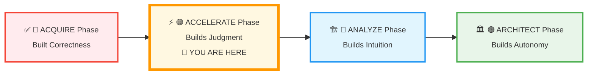
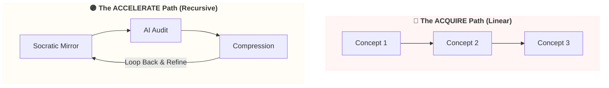
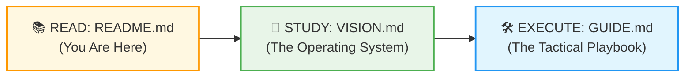

# 🗄️🤖 SQL & GenAI Course
**🎯 Quality Education for Anyone, Anywhere, Anytime — 💫 with Comfort, Convenience at no Cost**

---
# **⚡** Module 5: THE ACCELERATE ENGINE

## ⚡ **THE MANIFESTO: The Great Identity Shift**

In the **ACQUIRE** phase, you learned the rules of the language. You discovered how to manually type, execute, and debug code. You fought the syntax errors, crawled through the data rows, and claimed the prize of **Correctness**.

**Now, everything changes.**

Knowing syntax is no longer your competitive advantage. In the modern data landscape, code has become a commodity. The world does not need more human autocomplete systems who simply memorize commands. The world needs thinkers who wield absolute authority over automated systems.

> ### 🧠 **The Universal Truth of Phase 2**
> 
> 
> **ACQUIRE built your correctness. ACCELERATE builds your judgment.**

You are no longer merely a student sitting at a desk memorizing keywords. You are stepping into the identity of an **AI-Augmented Systems Analyst**. Your job is no longer to write code blindly, but to direct it, audit it, and optimize it.

## 📖 Module 5: ORIENTATION

Welcome to **ACCELERATE** – where you shift from learning SQL syntax to learning **AI‑augmented intelligence**. You have already built a solid foundation in ACQUIRE. Now, you will revisit those same concepts (Modules 2, 3, 4) with AI as your Socratic partner – never writing code for you, always sharpening your reasoning.

  ## **“What is this place?”**
  This is the gateway to your cognitive evolution. You are standing at the threshold of Phase 2. The phase where your relationship with technology changes forever.

> **This is not a syntax repeat.** You already know `SELECT`, `WHERE`, `JOIN`. Now you will learn to **audit AI, refine logic, detect hallucinations, and extract reusable patterns** – turning your knowledge into a permanent Skill‑Tree.

---

## 📊 **Your ACCELERATE Journey – Where You Are Now**

### 📍 You Are Here
- **Phase:** 🔴 ACCELERATE (Week 5)
- **Module:** 5 of 5 in Level 1 – GenAI SQL Co‑pilot Walkthrough
- **Mode:** AI‑augmented refinement (no new syntax – you revisit Modules 2‑4 with AI)

---
## 💎 **What you will gain from ACCELERATE**

When you successfully pass through this engine, you will not just have completed exercises; you will have upgraded your human processing power. In this phase, you will:

| **You will learn to…** | **So that you can…** |
|------------------------|----------------------|
| **Audit AI‑generated SQL** | Turn AI from a dangerous crutch into a flawless, speed‑multiplying partner. |
| **Refine strategic reasoning** | See data problems from a high architectural altitude and predict edge cases before they break. |
| **Optimize cognitive load** | Offload mundane execution to the machine while keeping your mind focused on creative problem‑solving. |
| **Extract reusable intelligence** | Distill temporary victories into permanent entries on your professional Skill‑Tree. |

### Your Measurable Outcomes 

- Apply the **Socratic AI Method™** – prompt for logic, not code – across all ACQUIRE concepts.
- **Audit AI‑generated SQL** – spot hallucinations, edge case omissions, and performance anti‑patterns.
- Use the **validation checklist** – ask about NULLs, edge cases, SQLite syntax, scaling, and hidden assumptions.
- **Extract gemstones** – capture skills, insights, and patterns into your Skill‑Tree database.
- Solve **8 real‑world business problems** through interactive simulations (cross‑character role‑play).
- Transition from **“correctness” to “judgment”** – know when to trust AI and when to challenge it.

---
## 🌀 **Understanding the Twisted Path**

What makes ACCELERATE different: the path is **not linear**. You will bounce between Modules 2, 3, and 4, revisiting concepts in a spiral that builds **judgment**, not just correctness.

- **Why was ACQUIRE linear?**  
  Because foundations require absolute sequence. You cannot sort data before you know how to pull it.

- **Why is ACCELERATE cyclical?**  
  Because mastery requires **recursive refinement**:
  - **Spaced repetition** strengthens long‑term memory.
  - **Cross‑concept connections** (e.g., `WHERE` vs `HAVING`) become visible when you see them side by side.
  - **Real‑world problems** rarely come in textbook order. The twisted path trains you for ambiguity.

> *“The path is not chaotic. It is the shortest route to professional intuition.”*

You will deliberately **circle back to concepts** you think you already know. You will run them through layers of AI scrutiny, stress‑test them against performance metrics, and compress them into pure **architectural wisdom**.

True expertise is not an **escalator**; it is a **spiral staircase** where you look at the same landscape from a higher elevation each time you turn.

---

## ⚙️ **The Four Engines of Transformation**

To guide you through this non-linear journey, your workspace has been engineered around **Four Core Engines**. They work in perfect harmony to process raw information into undeniable technical capability:

| Engine | Purpose |
|--------|---------|
| **🔍 Socratic Mirror** | You read a concept file, ask the AI about its logic, then write the SQL manually. |
| **🧪 Exercises (LAB)** | You debug a broken AI‑generated query – diagnosing the error through questioning. |
| **🔑 Solutions (KEY)** | You compare your reasoning with a golden prompt and validation checklist (no full code). |
| **🎭 Simulations** | You solve 8 cross‑character business problems – the crown jewel of ACCELERATE. |

### Detailed View

Each engine in ACCELERATE is a distinct mental workspace. Together, they form a complete **cognitive pipeline**: from reflective conversation, through hands‑on debugging, to standards‑based validation, and finally into high‑pressure, real‑world synthesis. You will **cycle** through them repeatedly as you **revisit** each concept.

| Engine | The Workflow |
|--------|---------------|
| **🔍 The Socratic Mirror** | Your conversational arena. Uses calibrated AI guardrails to reflect your own thinking back to you, forcing you to articulate *why* code works instead of letting you copy‑paste passive answers. |
| **🧪 The Exercise Bay** | Your technical proving ground. Deliberately review AI outputs, hunt down subtle hallucinations, analyse execution costs, and clean up messy, automated logic. |
| **🔑 The Solution Validation Framework** | Your objective truth anchor. Measure your work against enterprise‑grade reference models to align your intuition with industry standards. |
| **🎭 SQLVerse Reality Chambers (Simulations)** | The ultimate frontier. Chaotic, multi‑layered, ambiguous business scenarios that mock linear thinking. They demand integration of multiple concepts at once, navigating stakeholder politics, and defending your architectural choices under pressure. |

These engines work together in a **spiral loop** (per module, not per concept). You will complete Cycle 1 (Module 2 concepts), then Cycle 2 (Module 3), then Cycle 3 (Module 4), and finally the simulations.

---

## 📈 Your Three‑Document Blueprint

To navigate ACCELERATE, you have three complementary documents:

| Document | Purpose | Read this when… |
|----------|---------|------------------|
| **`README.md`** (this file) | Orientation, emotional gateway | You want to understand what ACCELERATE is and why it matters. |
| **`ACCELERATE_VISION.md`** | Philosophy, transformation, “why” | You want the deeper pedagogical reasoning – the twisted path,  uncover the mechanics of the *Extraction Bay*, and master the *Progressive Compression Loop* |
| **`MODULE5_GUIDE.md`** | Operational workflow, “how” | You are ready to initialize your Acceleration Cycles, memorize the 9‑step algorithmic daily workflow, view time expectations, and follow strict AI protocols. |

> 💡 **Recommendation:** Read this README first. Then read `ACCELERATE_VISION.md` to internalise the philosophy (optional but recommended). Then open `MODULE5_GUIDE.md` and follow the steps.

---
## 🚀 **Ready to Begin?**

To start your acceleration cycle, follow this intentional operational sequence. Do not jump ahead.

### **First, understand the philosophy.**

**"The machine can generate code. Only the artisan can generate value."**

Take a deep breath. Shift your mindset. Your evolution from writer to reviewer begins now.

# [▶️ **READ ACCELERATE VISION →**](./ACCELERATE_VISION.md)

<small>📖 *10‑15 minutes – optional but transformative*</small>

---

*Part of our mission for 🎯 Quality Education for Anyone, Anywhere, Anytime — 💫 with Comfort, Convenience at no Cost.*

**Level 1 | Module 5: GenAI SQL Co‑pilot Walkthrough | ACCELERATE Phase | Next: VISION & GUIDE**

