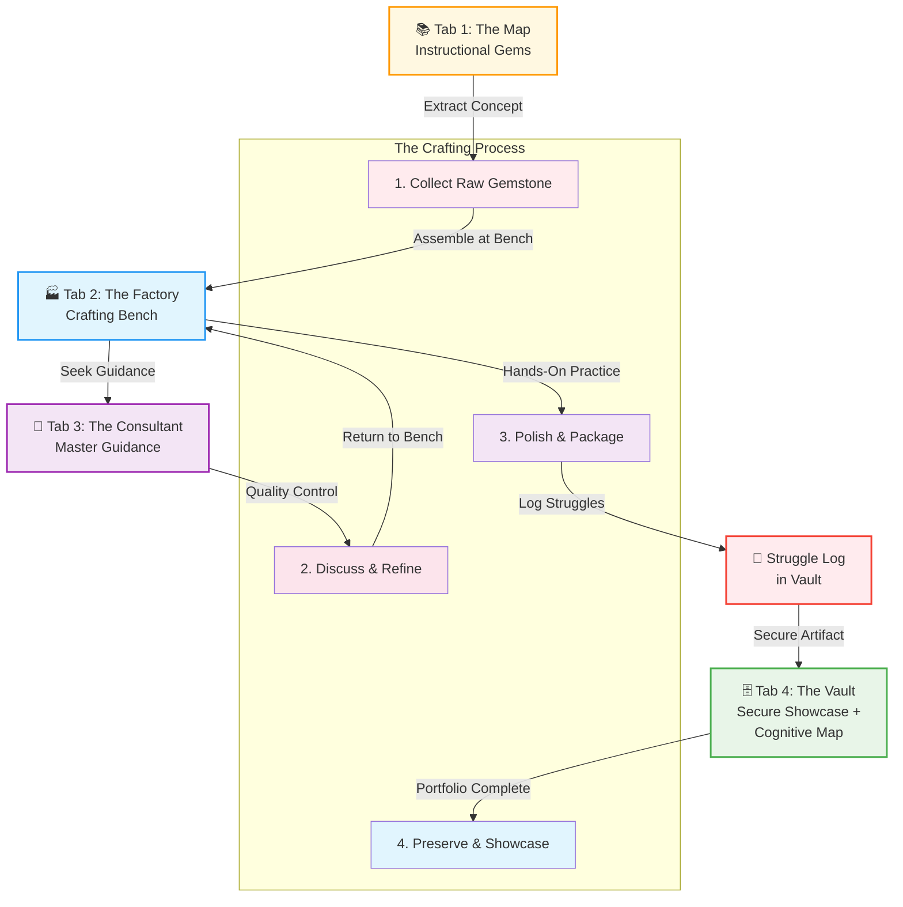



# 🗄️🤖 SQL & GenAI Course
**🎯 Quality Education for Anyone, Anywhere, Anytime — 💫 with Comfort, Convenience at no Cost**

## 📘 **Level 1: SQL Foundations & AI Co-pilot**
---

## 🌟 **The Level 1 Mission**

Welcome to the start of your 20-week journey. In Level 1, you aren't just "learning code"—you are learning to speak the language of data. You will transform from a casual observer into a Data Investigator, capable of extracting specific, meaningful insights from thousands of records.

**Your Goal:** Master the "Big Four" of SQL (SELECT, FROM, WHERE, ORDER BY) and build your first professional data artifacts.

---

## 🏢 **The Browser Office: Your Learning Environment**

**🚀 Kickstart: Any Computer, Any Browser, Anytime.**  
**🌍 Destination: Any country, Any city, Any Platform.**

### **Your Four-Tab Workspace:**
| Tab | Purpose | Tool |
| :--- | :--- | :--- |
| **1: The Map** | Course navigation | Course Repository (GitHub) |
| **2: The Factory** | Hands-on practice | SQLite Online |
| **3: The Consultant** | AI assistance | ChatGPT, Claude, or Gemini |
| **4: The Vault** | Progress tracking | Your GitHub Repository |

### **🏢 The Level 1 Browser Office Layout**
Before you begin each module, ensure your four-tab environment is synchronized. Level 1 uses a **Dual-Phase Factory Protocol** to ensure clear mental focus.

| Tab | Level 1 Resource | Action |
| :--- | :--- | :--- |
| **1: The Map** | `Level-1-beginner/Module-X.md` | Follow the instructional "Watch Me" guides. |
| **2: The Factory** | **The Exclusive Bench** | **Lesson Phase:** Load `training_institution_sample.db` **Exercise Phase:** Load `level1_estore_basic.db` |
| **3: The Consultant** | **AI Socratic Tutor** | Student Mode Active. Discuss logic, don't ask for code. |
| **4: The Vault** | `my-sql-journey/Level-1/` | Document every "Gemstone" you polish here. |

---

## 🧭 **The Learning Philosophy: Foundation First, AI Next**

We've designed Level 1 with deliberate structure to ensure **genuine mastery**:

### **Phase 1: Foundation Building (Weeks 1-4)**
**AI Role:** Conceptual Tutor Only  
*Build raw SQL skills without shortcuts*
- Learn to think through problems yourself
- Develop logical muscle memory  
- Master the fundamentals before using tools

### **Phase 2: AI Acceleration (Week 5)**
**AI Role:** Code Accelerator  
*Learn responsible AI collaboration*
- Apply the Socratic AI Method™
- Use AI to enhance, not replace, your skills
- Generate and optimize queries efficiently

### **Phase 3: Professional Synthesis (Week 6)**
**AI Role:** Professional Partner  
*Build complete analytics projects*
- Analyze and replicate professional code
- Create your own portfolio projects
- Document and present insights professionally

**Why This Order?** It prevents the "hallucination of competence"—where students mistake AI's capabilities for their own. Your confidence will be built on **actual skill**.

---

## 💎 **The Gemstones of Level 1 (Curriculum)**

Level 1 is divided into **6 Crafting Modules**. Each module adds a new tool to your kit:

1.  **🔍 Module 1: Introduction to Databases & Your AI Co-pilot**
    - Understand what databases and tables are, how data is organized, and how your AI Co-pilot will evolve with you — **before writing any SQL**.

2.  **🧹 Module 2: Basic Retrieval (`SELECT` & `WHERE`)**
    - Learn to retrieve exactly what you need and filter results with precision — the foundation of every query.

3.  **⚖️ Module 3: Sorting, Aggregation & Grouping**
    - Organize your results, calculate summaries (like totals and averages), and group data to uncover patterns.

4.  **📊 Module 4: Joining Tables**
    - Combine data from multiple tables to answer complex questions that span different parts of your database.

5.  **🤖 Module 5: AI Acceleration (GenAI Walkthrough)**
    - Master the Socratic AI Method™ and learn to use AI as a code accelerator — ethically and effectively.

6.  **🏆 Module 6: Capstone Project – HR Analytics Dashboard**
    - Bring everything together to build a professional‑grade data dashboard, from problem definition to final presentation.

**Time Commitment:** Just 15-30 minutes daily. Consistency creates mastery.

---

## 🔄 **The Gemstone Polishing Process: Your Learning Workflow**

**The Art of Crafting Your Skill Portfolio:**

Your **Tab 1: The Map** comprises instructional gems from a 19-year pedagogical journey. Each module contains carefully curated concepts and techniques.

**The Four-Step Crafting Process:**

1. **Collect the Gemstone** from Tab 1 one-at-a-time and assemble it at Tab 2 - The Factory (think of the Factory as your crafting bench).
2. **Discuss with Tab 3 - The Consultant** about polishing the gemstone to a high shine.
3. **Polish and Package** the gemstone at Tab 2 - The Factory through hands-on practice.
4. **Preserve it safely** in Tab 4 - The Vault, your **growing cognitive map** — an externalized brain that captures not just your successes, but your entire journey.

**And critically:** Every time you hit a roadblock, every error you encounter, every "aha!" moment — **log it in your Struggle Log** (part of your Vault). This log becomes your most valuable artifact: proof of resilience, a record of growth, and a gift to your future self who will face similar challenges.

**Repeat this process** from Modules 1 to 6. You will design, craft, and create exquisite jewelry with these gemstones in your project module and showcase it in your portfolio.

### 🎨 **The Art of Skill Crafting**

**The Transformational Journey:**
- **Raw Materials:** Foundational concepts (Tab 1)
- **Crafting Bench:** Practical application (Tab 2)  
- **Master Guidance:** Refinement & quality control (Tab 3)
- **Struggle Log:** Every challenge documented, every error transformed into insight
- **Cognitive Map:** Your Vault becomes an externalized brain — the permanent record of your growth from apprentice to artisan

**Result:** A complete collection of professionally polished skills, a rich Struggle Log showing your resilience, and a cognitive map ready for enterprise deployment.

---

## 🎯 **What You'll Accomplish**

By the end of Level 1, you will:
- ✅ Confidently write SQL queries to solve data problems
- ✅ Filter, sort, aggregate, and combine data from multiple tables
- ✅ Use AI as an intelligent partner, not a crutch
- ✅ Have completed projects for your professional portfolio
- ✅ Think like a data investigator—asking the right questions

**Most importantly:** You'll have built **genuine competence**, not just surface-level knowledge.

---

## 💎 **DESIGNER'S PERIGON**

Your entire Level 1 journey can be classified as:

- **Learning foundation skills** (Modules 1-4)
- **Refining your skills with AI Acceleration** (Module 5)
- **Studying and Analyzing Projects** (Module 6 and University Course Manager Bonus Project)
- **Architecting your own projects from the ground up**

```mermaid
flowchart LR
    A["<span style='font-size:16px'>1. ACQUIRE<br/>Foundation Skills<br/>Modules 1-4</span>"]
    B["<span style='font-size:16px'>2. ACCELERATE<br/>AI Refinement<br/>Module 5</span>"]
    C["<span style='font-size:16px'>3. ANALYZE<br/>Study Projects<br/>Module 6 & Bonus</span>"]
    D["<span style='font-size:16px'>4. ARCHITECT<br/>Build Portfolio<br/>Independent Projects</span>"]
    E["<span style='font-size:18px'>🏆<br/>PORTFOLIO<br/>COMPLETE</span>"]
    
    A -- "Build Raw SQL<br/>Skills" --> B
    B -- "Master AI<br/>Collaboration" --> C
    C -- "Study Professional<br/>Code" --> D
    D -- "Create Your<br/>Own Work" --> E
    
    style A fill:#e1f5fe,stroke:#2196f3,stroke-width:3px
    style B fill:#f3e5f5,stroke:#9c27b0,stroke-width:3px
    style C fill:#fff8e1,stroke:#ff9800,stroke-width:3px
    style D fill:#e8f5e8,stroke:#4caf50,stroke-width:3px
    style E fill:#a5d6a7,stroke:#2e7d32,stroke-width:4px
```

### **🌟 Important Note on Timelines:**

The timeline specified is just a **guidance** - it is **not written in stone**. Due to prior commitments or work pressure, if you are not able to allocate enough time for the modules, don't be disappointed. Complete your learning journey whenever you find time.

**Don't let the timeline intimidate or pressurize you.** Learning requires a calm and composed state of mind. Don't rush - there is nothing wrong in spending a little more time and effort to strengthen your foundation skills.

**This is Skill Acquisition, not a Running race. Good luck.**

**The Factory stands commissioned.**  
**The Consultant awaits.**  
**The Vault is ready for treasures.**  
**And the journey map is available. 🏢🤖🗄️**

**Now begin your Treasure hunt from Level 1! 💎✨**

---

## 🚀 **YOUR TRANSFORMATION BEGINS NOW!**

### **✅ Inspired and ready to begin?**

# [▶️ **BEGIN LEVEL 1 NOW!**](./Guides/MASTER_GUIDE.md)

**Your journey from observer to investigator starts today:** You're not just learning SQL—you're developing a **professional mindset** that will serve you through evolving technologies and career changes.

**Remember:** The Browser Office isn't just opening tabs—it's creating a **professional workspace** that trains your brain for focused learning. Focus on **learning SQL** and building your projects.

---

*Part of our mission for 🎯 Quality Education for Anyone, Anywhere, Anytime — 💫 with Comfort, Convenience at no Cost.*

**Level 1 of 3 | SQL Foundations | The SQL Apprentice | 6-Week Journey | Browser-Based Mastery**

