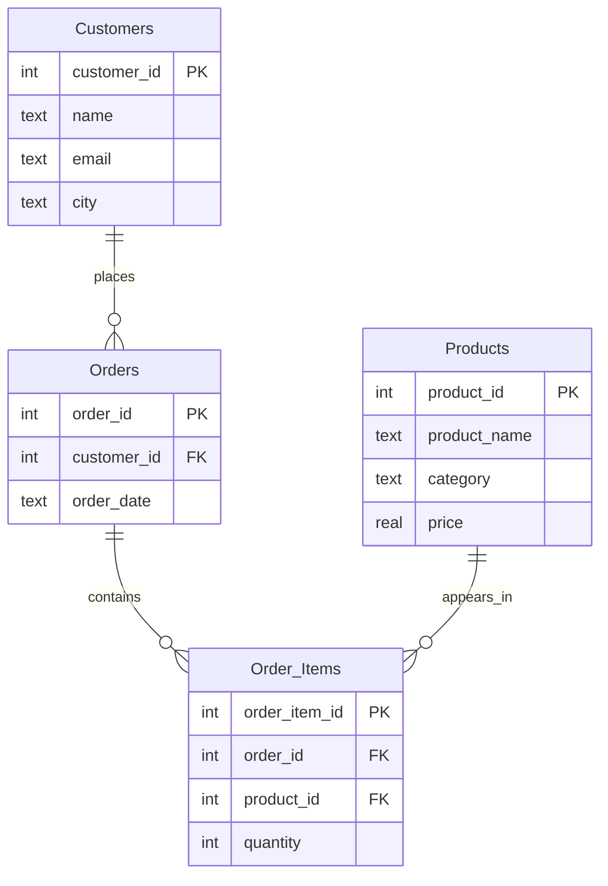

# 🛒 **SCHEMA ANCHOR: E-Store Basic Sample Database**
**For SQL Learning at Beginner Level**

---

## 📚 **Database Overview**

This database models a simple e‑store where customers place orders for products. It is intentionally simple, designed for beginners to practice fundamental SQL queries involving single and multiple tables.

**Purpose:** Used for independent practice in the SQL & GenAI Course, particularly in the ACQUIRE phase. Students apply concepts learned using the training institution database to this fresh context.

**Key Entities:**
- **`Customers`** – People who shop at the store.
- **`Products`** – Items available for purchase.
- **`Orders`** – Headers for each customer purchase.
- **`Order_Items`** – Details of which products and quantities are in each order.

---

## 📁 **Table Structures**

### **1. `Customers` Table**
Stores customer information.

| Column | Type | Constraints | Description |
|--------|------|-------------|-------------|
| `customer_id` | INTEGER | PRIMARY KEY | Unique identifier for each customer |
| `name` | TEXT | – | Customer's full name |
| `email` | TEXT | – | Email address |
| `city` | TEXT | – | City where the customer resides |

---

### **2. `Products` Table**
Lists all products available in the store.

| Column | Type | Constraints | Description |
|--------|------|-------------|-------------|
| `product_id` | INTEGER | PRIMARY KEY | Unique product identifier |
| `product_name` | TEXT | – | Name of the product |
| `category` | TEXT | – | Product category (e.g., 'Electronics') |
| `price` | REAL | – | Price per unit |

---

### **3. `Orders` Table**
Records each order placed by a customer.

| Column | Type | Constraints | Description |
|--------|------|-------------|-------------|
| `order_id` | INTEGER | PRIMARY KEY | Unique order identifier |
| `customer_id` | INTEGER | FOREIGN KEY references `Customers(customer_id)` | Customer who placed the order |
| `order_date` | TEXT | – | Date of order (stored as text in YYYY-MM-DD format) |

---

### **4. `Order_Items` Table**
Links orders to products, including quantity.

| Column | Type | Constraints | Description |
|--------|------|-------------|-------------|
| `order_item_id` | INTEGER | PRIMARY KEY | Unique line item identifier |
| `order_id` | INTEGER | FOREIGN KEY references `Orders(order_id)` | The order this item belongs to |
| `product_id` | INTEGER | FOREIGN KEY references `Products(product_id)` | The product ordered |
| `quantity` | INTEGER | – | Number of units ordered |

---

## 🔗 **Entity Relationships**



---

## 🧪 **Sample Queries**

### 1. List all customers
```sql
SELECT * FROM Customers;
```

### 2. Show all products in the 'Electronics' category
```sql
SELECT product_name, price
FROM Products
WHERE category = 'Electronics';
```

### 3. Find all orders placed by a specific customer (e.g., Alice Smith, customer_id 1)
```sql
SELECT order_id, order_date
FROM Orders
WHERE customer_id = 1;
```

### 4. Get the total number of items ordered for each product
```sql
SELECT p.product_name, SUM(oi.quantity) AS total_ordered
FROM Order_Items oi
JOIN Products p ON oi.product_id = p.product_id
GROUP BY p.product_name;
```

### 5. Show customer names and the dates they placed orders
```sql
SELECT c.name, o.order_date
FROM Customers c
JOIN Orders o ON c.customer_id = o.customer_id;
```

---

## 🧠 **Business Context Notes**

- A customer can place multiple orders.
- An order must be placed by exactly one customer.
- Each order can contain multiple products; the `Order_Items` table records each product in the order along with its quantity.
- The `order_date` is stored as text (ISO format) for simplicity; in real systems it would be a proper date type.

---

*This schema anchor is your reference guide for writing queries against the e‑store basic database. Use it to understand table structures, column meanings, and relationships before you start practicing.*