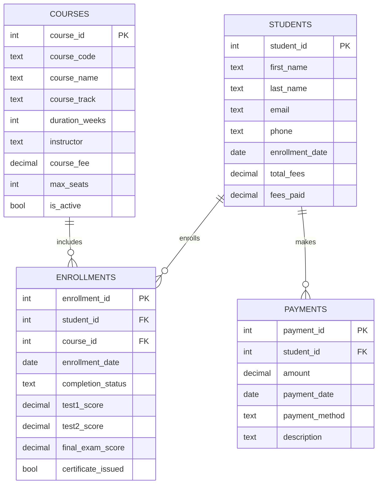

# 🏫 **SCHEMA ANCHOR: Training Institution Sample Database**
**For SQL Learning Across All Levels**

---

## 📚 **Database Overview**

This database models a vocational training institution that offers various courses across multiple tracks (Web Development, Data Science, Cybersecurity). It tracks students, their enrollments, course details, and payment records.

**Purpose:** Used for guided examples and practice in the SQL & GenAI Course, particularly in the ACQUIRE phase.

**Key Entities:**
- **`students`** – Individuals enrolled in courses.
- **`courses`** – Programs offered by the institution.
- **`enrollments`** – Links students to courses, including scores and completion status.
- **`payments`** – Records of student payments toward course fees.

---

## 📁 **Table Structures**

### **1. `students` Table**
Stores personal and financial information of each student.

| Column | Type | Constraints | Description |
|--------|------|-------------|-------------|
| `student_id` | INTEGER | PRIMARY KEY | Unique identifier for each student |
| `first_name` | TEXT | NOT NULL | Student's first name |
| `last_name` | TEXT | NOT NULL | Student's last name |
| `email` | TEXT | NOT NULL | Email address (unique implied) |
| `phone` | TEXT | – | Contact phone number |
| `enrollment_date` | DATE | NOT NULL | Date student first enrolled |
| `total_fees` | DECIMAL(10,2) | DEFAULT 0 | Total fees for all enrolled courses |
| `fees_paid` | DECIMAL(10,2) | DEFAULT 0 | Total amount paid so far |

---

### **2. `courses` Table**
Lists all courses offered, including their track, duration, instructor, and fee.

| Column | Type | Constraints | Description |
|--------|------|-------------|-------------|
| `course_id` | INTEGER | PRIMARY KEY | Unique course identifier |
| `course_code` | TEXT | NOT NULL | Short code (e.g., 'WD101') |
| `course_name` | TEXT | NOT NULL | Full course title |
| `course_track` | TEXT | NOT NULL | Broad category (e.g., 'Web Development') |
| `duration_weeks` | INTEGER | NOT NULL | Length of course in weeks |
| `instructor` | TEXT | NOT NULL | Name of the primary instructor |
| `course_fee` | DECIMAL(8,2) | NOT NULL | Cost of the course |
| `max_seats` | INTEGER | NOT NULL | Maximum number of students |
| `is_active` | BOOLEAN | DEFAULT TRUE | Whether the course is currently offered |

---

### **3. `enrollments` Table**
Tracks which students are enrolled in which courses, along with their progress and scores.

| Column | Type | Constraints | Description |
|--------|------|-------------|-------------|
| `enrollment_id` | INTEGER | PRIMARY KEY | Unique enrollment record ID |
| `student_id` | INTEGER | NOT NULL, FOREIGN KEY references `students(student_id)` | The enrolled student |
| `course_id` | INTEGER | NOT NULL, FOREIGN KEY references `courses(course_id)` | The course taken |
| `enrollment_date` | DATE | NOT NULL | When the student enrolled in this course |
| `completion_status` | TEXT | DEFAULT 'Ongoing' | 'Ongoing', 'Completed', or 'Dropped' |
| `test1_score` | DECIMAL(5,2) | – | Score on first test (if applicable) |
| `test2_score` | DECIMAL(5,2) | – | Score on second test |
| `final_exam_score` | DECIMAL(5,2) | – | Final exam score |
| `certificate_issued` | BOOLEAN | DEFAULT FALSE | Whether certificate was granted |

---

### **4. `payments` Table**
Records all payments made by students.

| Column | Type | Constraints | Description |
|--------|------|-------------|-------------|
| `payment_id` | INTEGER | PRIMARY KEY | Unique payment identifier |
| `student_id` | INTEGER | NOT NULL, FOREIGN KEY references `students(student_id)` | Student who made the payment |
| `amount` | DECIMAL(8,2) | NOT NULL | Payment amount |
| `payment_date` | DATE | NOT NULL | Date payment was made |
| `payment_method` | TEXT | NOT NULL | e.g., 'Credit Card', 'Bank Transfer', 'Cash' |
| `description` | TEXT | – | Optional note (e.g., which course the payment is for) |

---

## 🔗 **Entity Relationships**



---

## 🧪 **Sample Queries**

### 1. List all students with their total fees and amount paid
```sql
SELECT student_id, first_name, last_name, total_fees, fees_paid
FROM students;
```

### 2. Find courses with available seats (assuming max_seats - enrolled count)
```sql
SELECT c.course_name, c.max_seats, COUNT(e.student_id) AS enrolled
FROM courses c
LEFT JOIN enrollments e ON c.course_id = e.course_id
WHERE c.is_active = 1
GROUP BY c.course_id;
```

### 3. Show students who have not completed payment
```sql
SELECT student_id, first_name, last_name, total_fees, fees_paid
FROM students
WHERE fees_paid < total_fees;
```

### 4. Get average scores per course
```sql
SELECT c.course_name,
       AVG(e.test1_score) AS avg_test1,
       AVG(e.test2_score) AS avg_test2,
       AVG(e.final_exam_score) AS avg_final
FROM enrollments e
JOIN courses c ON e.course_id = c.course_id
GROUP BY c.course_id;
```

---

## 🧠 **Business Context Notes**

- A student can enroll in multiple courses; each enrollment is tracked separately.
- Payments are recorded per student, not per enrollment, but can be described to indicate which course they relate to.
- Completion status can be 'Ongoing', 'Completed', or 'Dropped'.
- Scores are percentages (0–100).

---

*This schema anchor is your reference guide for writing queries against the training institution database. Use it to understand table structures, column meanings, and relationships before you start querying.*