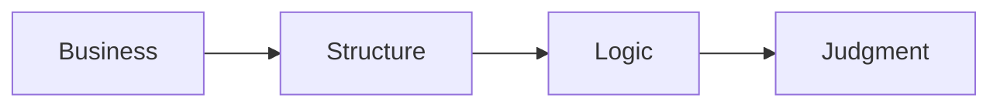

# 🗄️🤖 SQL & GenAI Course
**🎯 Quality Education for Anyone, Anywhere, Anytime — 💫 with Comfort, Convenience at no Cost**

---

# 🎭 🌍 SQLVerse: The Quantum Multiverse

## Welcome to the SQLVerse Business Multiverse Manifesto

Welcome, Architect.

You have crossed the threshold. You have proven that you can write valid SQL—that you can `SELECT`, `WHERE`, `JOIN`, and filter with precision. 

That is no longer the goal. **Business Reasoning is.**

This is your compass for every business universe you will explore. It establishes the **constitution of enterprise data judgment**—governing every query, every decision, and every insight you will extract.

From this moment forward, we stop treating **SQL** as a computer language and start treating it as an **executive decision engine.**

Read it once. Internalise it. Return to it whenever you need to remember *why* you are learning what you are learning.

**The journey continues. The logic stays the same.**

---

# 🏛️ Section 1: The Constitution of Enterprise Data Judgment

### The Shift from Syntax to Enterprise Reasoning

 "In **ACQUIRE**, you learned to ask *which rows*. In **ACCELERATE,** you learn to ask *what they mean*."

From this point onward, SQL syntax is a given. The goal is **business reasoning**.

| Phase | Function |
|-------|----------|
| **ACQUIRE** | How SQL works – mechanics, syntax, and structure |
| **ACCELERATE** | Why businesses care – translating queries into business value |
| **ANALYZE** | What exactly a business needs – diagnosing problems, defining requirements |
| **ARCHITECT** | How to deploy SQL for the business – designing systems, owning outcomes |

---

## 🏛️ The Four SQLVerse Laws

These four principles govern everything you will learn in Level 1 and beyond. They are not SQL rules. 

They are **core operational principles**—the foundation of every decision you will make as a data professional.

---

### Law #1 — Business Before SQL

You are paid to solve business problems, not to write SQL.

A correct query that answers the wrong question is useless. The stakeholder defines the problem. Your SQL is the tool to solve it. Always translate messy, human prose into a clear business intent before touching the keyboard.

---

### Law #2 — Structure Before Syntax

Find where the information lives before deciding how to retrieve it.

Understanding the schema, relationships, and granularity is more important than knowing every function. Mapping relationships across schemas will save you from writing beautiful queries against the wrong tables.

---

### Law #3 — Logic Outlives Vocabulary

Business names change. SQL logic survives.

The underlying analytical footprints remain completely stable whether you are auditing retail transactions, hospital beds, or sovereign wealth funds. The SQL patterns remain the same. The nouns change. The logic does not.

---

### Law #4 — The Syntax Is the Vehicle. The Judgment Is the Destination.

SQL gets you to the answer. Professional judgment determines whether it is the right answer.

The syntax is how you travel. The judgment is where you arrive. A query with zero syntax errors is merely operational; a query that delivers unassailable business truth to the boardroom is successful.



**Welcome to PRODUCTION REALITY.**

**Business first. Data model second. SQL third.**

---

## The Shift

| Foundation | Production Thinking |
|-----------|---------------------|
| Learn SQL syntax | Learn business reasoning |
| "How do I write this?" | "What does this mean for the business?" |
| Correct queries | Defensible decisions |
| Syntax errors | Judgment errors |
| The vehicle | The destination |

---

## Why This Matters

These laws are not abstract ideals. They are the **operating system** of the SQLVerse. Every query you write, every report you design, every decision you make will be governed by them.

- **Law #1** keeps you anchored to the stakeholder.
- **Law #2** keeps you anchored to the schema.
- **Law #3** keeps you anchored to the logic.
- **Law #4** keeps you anchored to the outcome.

Together, they transform you from a query writer into a **data architect**.

---

# Section 2: 🌍 SQLVerse Multiverse Business Suite

## Your Multiverse Treasure Hunt

Welcome, Explorer.

You are about to embark on a journey across multiple business universes. Each one is a world unto itself—with its own rules, its own stakeholders, its own language. But beneath the surface, they all share the same architectural DNA.

Your task is not to memorise tables. Your task is to recognise patterns.

**Before you enter any universe, you must study its map.**

---

### 🏛️ The SQLVerse Resource Repository – Your Treasure Chest

Before you step into any business universe, you need a map. The **SQLVerse Resource Repository** is where those maps live.


#### 🗄️ Repository Artifacts

| Artifact | Purpose |
|----------|---------|
| **Blueprint Files** | The conceptual foundation—table relationships, business vocabulary, design intent.  |
| **Databases** | The living worlds—each database is a universe waiting to be explored. |
| **Schema Guides** | The detailed map of each universe—column definitions, data types, key relationships |

> 💡 **Before you enter any universe, you must study its map.** The Blueprint Files are your first stop. They are not optional reading—they are essential preparation.

---

#### 📂 Repository Location

```
Level-1-beginner/sqlverse-foundation/
```

Inside this folder, you will find:

- `blueprints/` – ER Diagrams and Schema Guides for every universe
- `databases/` – The SQLite database files for each universe
- `schemas/` – Detailed schema definitions

---

### Looking back at ACQUIRE Planets

In **ACQUIRE**, you learned SQL using a small number of carefully controlled datasets—**Training Institution** for demonstration and **E‑Store** for practice. That phase focused on mastering syntax without unnecessary business complexity.

Now, in **ACCELERATE**, you will encounter multiple business universes. Each one is designed to teach you the same SQL patterns through different business languages.

> 💡 **Note:** The **Training Institution** universe remains unchanged—it is the exact database you used in ACQUIRE, providing a familiar anchor for demonstration. It is not stored in the SQLVerse Repository; instead, it is loaded from its original ACQUIRE location, which serves as the **single source of truth** for this foundational dataset.
>
> The **E‑Store**, however, has been **enhanced** for ACCELERATE, with NULL values, bulk orders, new categories, and production‑ready edge cases to align with the Business‑first philosophy. The enhanced E‑Store, along with all new universes (FinVERSE, Hospital Planet, Real Estate Planet), is stored in the SQLVerse Repository.

---

### 🌍 The Universes of the SQLVerse Multiverse

| Universe | Domain | Purpose |
|----------|--------|---------|
| **Training Institution** | Education | Foundation – the dataset you already know |
| **E‑Store** | Retail | Home turf – the dataset you mastered in ACQUIRE |
| **FinVERSE** | Digital Banking | KPI thinking, revenue metrics, customer analytics |
| **Hospital Planet** | Healthcare | Patient volumes, treatment costs, appointment analytics |
| **Real Estate Planet** | Property | Deal counts, price averages, agent performance |

---

#### A Deeper Dive Into Each Universe

#### 🏫 Training Institution – The Anchor

**Personality:** Familiar, safe, the foundation you already know.

**Role in Level 1:** Demonstration and cognitive reorientation—your anchor in the multiverse.

**Case Studies:**
- Student Fee Analysis
- Department Enrollment Trends
- Instructor Performance Metrics

**Evolution:** Grows with you—subqueries, CTEs, and reporting in Level 2; window functions and predictive analytics in Level 3.

> 📌 **Note:** Training Institution database is not stored in the SQLVerse Repository. Please load it from its original ACQUIRE location, which serves as the **single source of truth** for this foundational dataset. The SQLVerse Repository is reserved for enhanced and new universes—not the original ACQUIRE anchor.

---

#### 🛒 E‑Store – The Home Turf

**Personality:** Your home turf—familiar, now enhanced for production thinking.

**Role in Level 1:** Practice, enhanced dataset with NULLs, bulk orders, new categories.

**Case Studies:**
- Customer Purchase Patterns
- Category Performance Analysis
- Order Fulfilment Efficiency

**Evolution:** Expands into inventory analytics, customer segmentation, and revenue forecasting as you progress.

---

#### 🏦 FinVERSE – The Architect Planet

**Personality:** The flagship enterprise universe—KPI thinking, revenue analytics, customer‑centric reporting.

**Role in Level 1:** Advanced SQL reasoning, fraud detection, risk analysis.

**Case Studies:**
- Revenue KPI Dashboard
- Transaction Fraud Detection
- Customer Lifetime Value Analysis

**Evolution:** Adds credit cards, fraud detection, and international money transfer in Level 2; portfolio risk modelling and predictive analytics in Level 3.

---

#### 🏥 Hospital Planet – The Healthcare Universe

**Personality:** Built around patient journeys, treatment costs, and billing cycles.

**Role in Level 1:** Domain‑specific terminology, appointment analytics, discharge cycles.

**Case Studies:**
- Patient Volume by Department
- Treatment Cost Analysis
- Discharge Efficiency Tracking

**Evolution:** Introduces insurance claims and lab analytics in Level 2; predictive patient outcomes in Level 3.

---

#### 🏘️ Real Estate Planet – The Deal Universe

**Personality:** Models the complete deal lifecycle—from listing to closing.

**Role in Level 1:** Agent performance, property valuation, deal pipelines.

**Case Studies:**
- Agent Performance Ranking
- Property Valuation Trends
- Deal Pipeline Analysis

**Evolution:** Adds mortgages, commissions, and market trend analysis in Level 2; portfolio valuation in Level 3.


---

### Why New Business Universes?

Professional data architects are not hired because they memorised the table names of a single database. They are hired because they can step into *any* corporate boardroom on Earth, isolate the metrics that matter, and deploy the invariant patterns of SQL to extract them.

We do not switch universes to confuse you. We cycle through these *parallel universes* to **discover one architectural truth:**

> **The nouns change. The logic does not.**

The **Multiverse traversal** proves that the **same SQL** survives **different businesses.**

---

### Mini-Universes & Future Expansion

The SQLVerse Multiverse is not static. **The Multiverse Grows with You.**

Apart from the above universes, **mini‑universes** may be introduced for certain specialized topics and the above universes may be extended for higher levels.

As you progress through **Level 2** and **Level 3**, the universes themselves evolve. New tables are added. New business scenarios emerge. New complexities appear—not to overwhelm you, but to challenge you with the tools you have already mastered. 

**Each level unlocks new continents, new maps, new economies.**

For example, **Credit Cards**, **Fraud Detection**, and **International Money Transfer** may be added to FinVERSE at Level 2 or Level 3.

The **SQLVerse Business Multiverse** is open to **vertical scaling** (adding specialized domains) and **horizontal schema growth** (adding complex tables like Fraud/Transfers) in future.

The **Multiverse** is a **living ecosystem.** Come and experience the Immersive journey. Watch how it evolves—and evolve with it.

---

# Section 3: 🧠 The Enterprise Operational Workflow

## The Professional Pipeline

From this point onward, every single lab challenge requires you to process your thoughts through **The Professional Pipeline** before you write a single line of SQL:

```text
  [1] Business Question  ──> What does the executive actually want to know?
         ↓
  [2] The One-Row Rule   ──> What must ONE single row represent when the query finishes?
         ↓
  [3] The Blueprint      ──> Isolate the Dimension (Group By) vs. the Metric (Aggregate).
         ↓
  [4] Domain Invariance  ──> Strip away the industry nouns to find the skeletal pattern.
         ↓
  [5] The Vehicle        ──> Type the execution code.
```

---

## Supporting Practices

| Practice | Why |
|----------|-----|
| **Think before writing SQL** | Understand the problem before typing. |
| **Explain your assumptions** | Every query is built on assumptions. Document them. |
| **Identify the KPI** | What business metric does this query answer? |
| **Translate business language** | Business users don't speak SQL. You must translate. |
| **Defend your choices** | There is rarely one correct query. Justify yours. |
| **Extract gemstones** | Capture insights, not just syntax. |

---

## Integration Notes

| Element | How It Connects |
|---------|-----------------|
| **The Professional Pipeline** | The sequence of thinking that happens **before** writing SQL. |
| **Supporting Practices** | The habits that guide each step of the pipeline. |
| **Pipeline + Practices** | Together, they form the operational discipline for every challenge. |

---

## 🪜 The Aggregation Ladder

The CFO will not be interested in looking at monthly transactions spanning 700 rows and manually calculating revenue for each product category. They need a **business report**—summarised into 10 lines, one line per product category—to find out: Did we hit, beat, or miss the monthly revenue goal?

That is the purpose of aggregation.

```text
Level 1: Filter
        ↓
   Which rows are relevant?

Level 2: Group
        ↓
   Which buckets do I need?

Level 3: Aggregate
        ↓
   One number per bucket.

Level 4: Present
        ↓
   Executive-ready output.
```

**The Elevation:** Filtering is about *reducing rows*. Aggregation is about *creating meaning*. A business executive doesn't need to see every transaction—they need to see the story the transactions tell.

The CFO **focuses** on just three questions:
- Which product categories have **met the target?**
- Which product categories have **underperformed?**
- Which product categories have **outperformed?**

The raw numbers tell you what happened. The **aggregation** tells you what it means. **Executives** don't need more data—they need the right **answers** to **drive** the **right decisions.**

An executive-level report exists to **answer the questions** that truly matter.

---

## Why This Matters

| Concept | Business Application |
|---------|----------------------|
| **Filter** | Focus on relevant data (e.g., current year, active customers) |
| **Group** | Organise by categories (e.g., product, region, department) |
| **Aggregate** | Measure performance (e.g., total revenue, average order value, count of customers) |
| **Present** | Prioritise and order results to support decisions |

The Aggregation Ladder is not a SQL sequence. It is a **thinking framework** for turning raw data into executive decisions.

---

# 🎭 The Final Lens: Look at the Bones

When a tourist walks into a bank, a hospital, or a massive retail warehouse, they see marble floors, surgical lights, or rows of inventory shelves. They see the surface.

When an architect walks into those same buildings, they don't see the decoration. They see the load-bearing pillars. They see the structural steel. They see how gravity is being managed.

From this moment on, you are no longer a tourist in the database.

When you step into FinVERSE or Hospital Planet, **strip away the facade**. Stop looking at the paint on the walls. **Look at the bones.** A `GROUP BY` is a load-bearing pillar whether it is supporting a financial ledger or a patient register.

**Train your eyes to see the steel. The rest is just noise.**

---

**Read once. Internalise. Reference forever.**

---

*Part of our mission for 🎯 Quality Education for Anyone, Anywhere, Anytime — 💫 with Comfort, Convenience at no Cost.*

**SQLVerse | Business Multiverse | Worldview**
