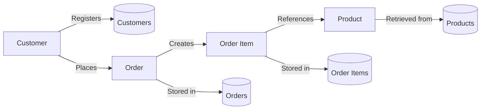

# 🗄️📊 Enhanced E‑Store Blueprint

## 🌍 The Business Universe

**Business first. Data model second. SQL third.**

### Know your landscape

Welcome to the **Enhanced E‑Store** – your home turf in the SQLVerse Multiverse.

This is the same E‑Store you mastered in ACQUIRE, now **enhanced** for production thinking. The core business remains unchanged: a retail platform where customers browse products, place orders, and manage their accounts.

**What has changed?** The data is richer. The edge cases are real. The decisions are harder.

| Enhancement | Why It Matters |
|-------------|----------------|
| **NULL values in email and phone** | You must now handle incomplete customer data—just like in production |
| **Bulk orders** | You will encounter enterprise‑scale purchase patterns |
| **New categories (Furniture)** | Category‑based filtering now requires more nuanced logic |
| **Orders spanning multiple months** | Date‑range filtering now tests your temporal logic |
| **Multiple customers per city** | `DISTINCT` exercises now produce meaningful results |

**This is E‑Store—but sharper, deeper, and production‑ready.**

---

### Business Vocabulary

| Term | Meaning |
|------|---------|
| **Customer** | An individual who creates an account and places orders |
| **Product** | An item available for purchase with a category and price |
| **Order** | A transaction record linking a customer to one or more products |
| **Order Item** | A line‑item within an order specifying a product and quantity |
| **Category** | A grouping of products (Electronics, Appliances, Books, Furniture) |
| **Bulk Order** | An order with a quantity of 5 or more—indicating enterprise or wholesale activity |
| **NULL Contact** | A customer record missing an email or phone number—a data quality issue |

---

### Core Business Entities

| Entity | Description |
|--------|-------------|
| **Customer** | The central actor. Each customer has a unique ID, name, contact details, and city. |
| **Product** | The inventory item. Each product has a name, category, and price. |
| **Order** | The transaction. Each order is placed by a customer on a specific date. |
| **Order Item** | The transactional bridge linking each order to its purchased products and quantities. |

---

### Key Relationships (Conceptual)

```text
Customer
    │
    ├── places
    ▼
Orders
    │
    ├── contains
    ▼
Order Items
    │
    ├── references
    ▼
Products
```

| Relationship | Business Meaning |
|--------------|------------------|
| **Customer → Orders** | One customer can place many orders |
| **Orders → Order Items** | One order can contain many line items |
| **Products → Order Items** | One product can appear in many order items |

> 💡 **Business Insight:** The customer is at the center of the business. Every order flows from a customer. Every product flows into an order item. The relationships are simple, but the decisions they support are not.

---

## 🔄 The Customer Journey

### From Click to Delivery

#### Business Flow

```text
Customer Registers
        ↓
Customer Browses Products
        ↓
Customer Places Order
        ↓
Order Items Created
        ↓
Order Fulfilled
        ↓
Customer Receives Shipment
```

---

#### 🚶‍♂️ A Walkthrough: The Life of a Transaction

To understand how data flows, let's follow a single customer, Alex, as they interact with the online E‑Store. Watch how a human action instantly creates a digital footprint:

1. **The Digital Onboarding** 👤  
   Alex creates an account. The system assigns a unique `customer_id` and writes a new row into the `customers` table. The universe now knows who Alex is.

2. **Browsing the Grid** 🛒  
   Alex explores the storefront, filtering by category. The system runs a fast lookup behind the scenes, connecting the `products` and `categories` tables to display the right inventory.

3. **Building Intent** 🛍️  
   Alex selects items and adds them to the cart. This populates temporary session data—staging the items before any permanent commitment is made.

4. **The Flashpoint (Checkout)** 💳  
   Alex places the order and completes payment. The system generates an immutable record in the `orders` table and simultaneously maps the exact quantities and unit prices into the `order_items` table.

5. **The Final Frontier (Fulfillment)** 🚚  
   The payment clears, the warehouse packs the items, and the package is dispatched. Once delivered, the `orders` table updates the `status` to 'Delivered' and stamps the `delivery_date`. The transaction lifecycle is complete.

> ⚡ **Architect's Note:** The database does not just do this for Alex. The E‑Store can handle thousands of concurrent orders—ensuring that while Alex buys a laptop, another customer on the other side of the planet can buy the exact same model at the exact same fraction of a second without scrambling inventory.


---

#### Data Flow Diagram (DFD)



---

## 🔍 Through the Architect's Lens

### Strategic Intelligence

#### Common Business Questions

| Question | SQL Concept |
|----------|-------------|
| Which customers have missing email addresses? | `IS NULL` |
| What are the top 5 most expensive products? | `ORDER BY` + `LIMIT` |
| Which cities have the most customers? | `GROUP BY` + `COUNT` |
| Which categories have products priced between 100 and 300? | `BETWEEN` + `DISTINCT` |
| What is the total revenue per category? | `JOIN` + `SUM` + `GROUP BY` |
| Which customers have placed bulk orders (quantity ≥ 5)? | `WHERE` + comparison |
| Which customers have both email and phone on file? | `AND` + `IS NOT NULL` |

---

### Case Studies

### 📊 Case Study 1 – Customer Data Quality Audit

**Purpose:** Identify customers with incomplete contact details to support a data cleanup initiative.

**Business Value:**
- **High-quality data is the lifeblood of operational trust.** Surfacing missing or invalid contact records prevents costly downstream errors in billing, communication breakdowns, and fractured analytics reports.
- **Enables targeted marketing campaigns.** Clean contact paths ensure outreach efforts reach the right people, maximising campaign ROI.
- **Reduces customer support friction.** Complete customer profiles enable faster issue resolution and improved customer experience.

**Interested Stakeholders:**
- 🔒 **The Data Governance Officer** – Ensuring compliance and system integrity
- 📣 **The Chief Marketing Officer** – Requiring clean contact paths for campaigns
- 🖥️ **The Lead Database Administrator** – Maintaining referential sanity across systems

**Production Awareness:**

In production, customer data quality audits must identify missing contact details without impacting live customer transactions. Unlike classroom datasets, enterprise systems must balance **data completeness**, **operational efficiency**, and **system performance**.

> 💡 **Architecture Insight**
>
> - **Incremental Data Quality Checks:** Running full‑table scans on millions of customer records is expensive. Production systems often use incremental checks that flag newly inserted or updated records for quality issues.
>
> - **Soft Delete Pattern:** Instead of permanently deleting incomplete records, production systems often mark them as `inactive` or `archived` to preserve historical data for auditing and recovery.

> 💡 **SQL Connection**
>
> *You learned `NULL` handling in Module 2 of ACQUIRE. You will apply it to production‑quality datasets throughout ACCELERATE.*

---

### 📊 Case Study 2 – Category Performance Review

**Purpose:** Analyse revenue and order volume across product categories to identify high‑performing segments.

**Business Value:**
- **Informs inventory and procurement decisions.** Isolating high‑margin categories and monitoring sales velocity enables data‑driven decisions regarding inventory budgets and warehouse spatial allocations.
- **Reveals underperforming segments.** Identifying stagnant categories enables strategic intervention—marketing campaigns, pricing adjustments, or product refreshes.
- **Guides seasonal promotions.** Understanding category performance patterns helps the business time promotions and allocate marketing spend effectively.

**Interested Stakeholders:**
- 📦 **The Inventory & Procurement Manager** – Optimizing stock levels and supplier contracts
- 👔 **The Category Specialist / Merchandiser** – Curating the product mix and pricing strategy
- 📈 **The Chief Financial Officer** – Tracking revenue contributions against corporate growth targets

**Production Awareness:**

In production, category performance reviews must process large volumes of order data while customers continue placing orders. Unlike classroom datasets, enterprise systems must balance **analytical depth**, **reporting speed**, and **transaction performance**.

> 💡 **Architecture Insight**
>
> - **Read‑Replica Isolation:** Reporting queries are directed to read‑only database replicas to avoid locking transactional tables.
>
> - **Aggregate Tables:** Pre‑computed tables that store daily or monthly category performance metrics enable fast dashboard refreshes without scanning millions of raw order records.

> 💡 **SQL Connection**
>
> *You learned `JOIN` and `GROUP BY` in Modules 3 and 4 of ACQUIRE. You will apply them to real‑time business reporting throughout ACCELERATE.*

---

### 📊 Case Study 3 – Bulk Order Detection

**Purpose:** Identify enterprise‑scale purchase patterns (quantity ≥ 5) to understand wholesale behaviour and customer segmentation.

**Business Value:**
- **Distinguishes B2C from B2B behaviour.** Massive bulk orders indicate commercial, B2B, or wholesale buyers—a different customer segment with distinct needs.
- **Protects retail inventory levels.** Detecting bulk purchases early allows the business to adjust inventory and prevent stockouts for retail customers.
- **Triggers specialized fulfillment workflows.** Bulk orders require different packing, shipping, and support workflows—detecting them early improves operational efficiency.

**Interested Stakeholders:**
- 🚚 **The Logistics & Warehouse Director** – Managing bulk packing operations and freight capacity
- 🔒 **The Risk & Fraud Prevention Manager** – Vetting massive transactions for credit risk or system exploitation
- 👔 **The Corporate Sales Lead** – Identifying potential enterprise accounts for wholesale contract conversions

**Production Awareness:**

In production, bulk order detection must identify unusual purchase patterns without slowing down the checkout experience. Unlike classroom datasets, enterprise systems must balance **real‑time detection**, **customer experience**, and **operational responsiveness**.

> 💡 **Architecture Insight**
>
> - **Partitioning:** The `order_items` table is often partitioned by date to keep queries fast.
>
> - **Temporal Pattern Analysis:** Production systems track month‑over‑month bulk order percentages to detect surges that may indicate new features, marketing campaigns, or seasonal trends.

> 💡 **SQL Connection**
>
> *You learned filtering and comparison operators in Module 2 of ACQUIRE. You will apply them to detect enterprise‑scale patterns throughout ACCELERATE.*

---

### Sample Data Highlights

| Feature | Example | Purpose |
|---------|---------|---------|
| **NULL emails** | Frank Turner, Grace Martin | Enables `IS NULL` exercises |
| **NULL phones** | Bob Johnson, David Kim | Creates rich NULL combinations |
| **Duplicate cities** | Boston (2x), Chicago (3x), New York (2x) | Enables meaningful `DISTINCT` exercises |
| **Bulk orders** | Quantity 5 (Alice), Quantity 6 (Henry) | Enables `>=` comparison exercises |
| **Furniture category** | Desk, Chair | Enables category‑based filtering beyond Electronics |
| **Date spread** | Orders across October 1–15 and March 1–20 | Enables `BETWEEN` date range exercises |

---

### Pedagogical Design Notes

- **NULL handling** – Customers 6 (Frank) and 7 (Grace) have NULL emails; Customers 2 (Bob) and 4 (David) have NULL phones.
- **DISTINCT** – Cities repeated intentionally to make `SELECT DISTINCT city` meaningful.
- **Comparison operators** – Prices (45–1200) and quantities (1–6) support `>`, `>=`, `<`, `<=`, `=`, `<>` exercises.
- **BETWEEN** – Dates span October 1–15 and March 1–20, supporting date range exercises.
- **LIKE** – Names include varied patterns (Alice, Bob, Charlie, etc.).
- **Aliases** – Column names support `AS` alias exercises.
- **JOINs** – Additional products and orders enable multi‑table JOIN exercises.
- **Bulk Order Detection** – `quantity >= 5` returns at least two rows (Order 9 – Alice, 5 Headphones; Order 8, item 11 – Henry, 6 Desks).

---

### SQLVerse Architect's Checklist

Before writing SQL, professional developers usually answer three questions:

1. **Where does this information live?**
   Identify the table that owns the requested business data – customers, products, orders, or order items.

2. **Will one table be sufficient?**
   Decide whether the business request requires relationships across multiple tables.

3. **What exactly is the business asking to see?**
   Separate the required output from the business story.

> **Blueprint Reminder:** This document helps you understand the data model before you begin querying it. Understanding the structure first usually leads to simpler and more accurate SQL.

---

## 🚀 Ready to Explore the Data Model

You have now explored the business landscape of the **Enhanced E‑Store** — how the organisation operates, how customers browse and place orders, where transaction data originates, and how business questions map to database entities.

The next step is to explore how this business landscape is implemented inside the database. You'll discover the tables, columns, relationships, and constraints that power the **Enhanced E‑Store ecosystem.**

For a detailed walkthrough of the data model, refer to the **Enhanced E‑Store Schema Guide**.

**Business first. Data model second. SQL third.**

---

*Part of our mission for 🎯 Quality Education for Anyone, Anywhere, Anytime — 💫 with Comfort, Convenience at no Cost.*

**SQLVerse | Enhanced E‑Store Blueprint | Level 1 | ACCELERATE Phase**