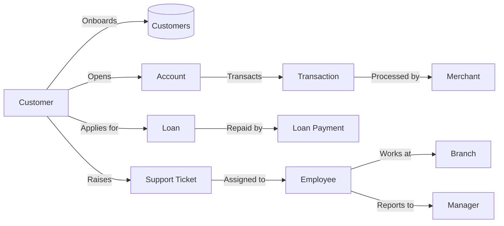

# 🗄️📊 FinVERSE Blueprint

**Business first. Data model second. SQL third.**

---

## 🌍 The Business Universe

### Know your landscape

Welcome to **FinVERSE** — the flagship enterprise universe of the SQLVerse.

FinVERSE is not a bank. It is a **digital banking ecosystem** — a modern financial services platform where customers hold accounts, transact with merchants, use cards, take loans, and receive support. It is designed to mirror the complexity, scale, and decision‑making intensity of a real‑world financial institution.

This is not E‑Store. There are no shopping carts or product categories.

Instead, you will work with:

- **Customers** who onboard, verify their identity, and manage their financial lives.
- **Accounts** that hold balances and track financial health.
- **Transactions** that move money — deposits, withdrawals, transfers, and payments.
- **Cards** that enable payments and ATM withdrawals.
- **Loans** that provide credit with interest and repayment schedules.
- **Merchants** that accept payments from customers.
- **Employees** who resolve support tickets and manage operations.
- **Branches** that serve as physical or virtual service locations.

**This is the Architect Planet. The training wheels are off.**

---

### Business Vocabulary

| Term | Meaning |
|------|---------|
| **Customer** | An individual who holds accounts, transacts, and uses financial products. |
| **Account** | A financial container holding customer funds. Types: Savings, Current, Salary, Joint. |
| **Transaction** | Any money movement — debit, credit, transfer, or merchant payment. |
| **Card** | A physical or digital card linked to an account. Types: Debit, Credit, Prepaid. |
| **Loan** | A credit product extended to a customer with principal, interest, tenure, and repayment schedule. |
| **Merchant** | A business that accepts payments from FinVERSE customers. |
| **Support Ticket** | A customer‑raised issue or query. Used to track resolution. |
| **Employee** | A FinVERSE staff member — Support Agent, Credit Officer, Fraud Analyst, Relationship Manager, or Branch Manager. |
| **Branch** | A physical or virtual service location where customers can interact with staff. |
| **KYC** | "Know Your Customer" — identity verification required for account opening. |
| **Risk Score** | A rating (Low, Medium, High) used by the Risk Team to monitor customer exposure. |
| **Fraud Flag** | A marker on a transaction indicating suspicious activity. |
| **Chargeback** | A disputed transaction reversed by the bank. |
| **Settlement** | Finalisation of a merchant transaction. |

---

### Core Business Entities

| Entity | Description |
|--------|-------------|
| **Customer** | The central actor. Each customer has a unique ID, name, contact details, KYC status, risk score, and account status. |
| **Account** | The financial container. Each account is linked to a customer and has a type, balance, and status. |
| **Transaction** | The record of money movement. Each transaction is linked to an account, optionally to a merchant, and has an amount, type, date, status, and fraud flag. |
| **Card** | The payment instrument. Each card is linked to an account and has a type, masked number, expiry date, and status. |
| **Loan** | The credit product. Each loan is linked to a customer and has principal, interest rate, tenure, outstanding balance, status, and approval date. |
| **Loan Payment** | The repayment record. Each loan payment is linked to a loan and has an amount, date, method, and status. |
| **Merchant** | The payment recipient. Each merchant has a name, category, settlement type, and status. |
| **Support Ticket** | The customer issue record. Each ticket is linked to a customer and optionally to an employee, with a type, status, creation date, and resolution date. |
| **Employee** | The internal actor. Each employee has a name, role, manager, and branch affiliation. |
| **Branch** | The service location. Each branch has a name, city, state, and status. |

---

### Key Relationships (Conceptual)

```text
Customer
    │
    ├── holds
    ▼
Accounts
    │
    ├── initiates
    ▼
Transactions
    │
    ├── processes
    ▼
Merchants

Customer
    │
    ├── applies for
    ▼
Loans
    │
    ├── repays through
    ▼
Loan Payments

Customer
    │
    ├── raises
    ▼
Support Tickets
    │
    ├── assigned to
    ▼
Employees

Employees
    │
    ├── reports to
    ▼
Employees (Manager)

Branches
    │
    ├── employs
    ▼
Employees
```

| Relationship | Business Meaning |
|--------------|------------------|
| **Customer → Accounts** | One customer can hold multiple accounts |
| **Accounts → Transactions** | One account can have many transactions |
| **Accounts → Cards** | One account can have multiple cards |
| **Customer → Loans** | One customer can take multiple loans over time |
| **Loans → Loan Payments** | One loan can have many repayments |
| **Merchants → Transactions** | One merchant can process many transactions |
| **Customer → Support Tickets** | One customer can raise multiple tickets |
| **Employees → Support Tickets** | One employee can resolve many tickets |
| **Employees → Employees (Self-Join)** | One employee reports to a manager |
| **Branches → Employees** | One branch employs many employees |

> 💡 **Business Insight:** FinVERSE is built around the customer lifecycle — from onboarding and account creation to transactions, credit, and support. The relationships are richer than E‑Store, and the decisions they support are more complex. This is the Architect Planet for a reason.

---

## 🔄 The Customer Journey

### From Onboarding to Financial Empowerment

#### Business Flow

```text
Customer Onboards
        ↓
Customer Completes KYC
        ↓
Customer Opens Account
        ↓
Customer Transacts (Payments, Transfers, Purchases)
        ↓
Customer Applies for Loan (if needed)
        ↓
Customer Repays Loan
        ↓
Customer Raises Support Ticket (if needed)
        ↓
Account Monitored (Fraud, Risk, Compliance)
```

---

### 🚶‍♂️ A Walkthrough: The Life of a FinVERSE Customer

To understand how data flows, let's follow a single customer, Arjun, as he joins FinVERSE and begins his financial journey. Watch how every action creates a digital footprint.

1. **The Digital Onboarding** 👤  
   Arjun downloads the FinVERSE app and creates an account. The system assigns a unique `customer_id`, stores his personal details, and sets his `kyc_status` to `Pending`. The system also links Arjun to a local home branch in the `branches` table and assigns a Customer Service Representative in the `employees` table. The universe now knows who Arjun is.

2. **Know Your Customer (KYC) Verification** 🛂  
   Arjun uploads his identity documents. A verification agent reviews them and updates `kyc_status` to `Verified`. His `risk_score` is assessed and set to `Low`. Arjun is now a trusted customer.

3. **The Financial Container** 💰  
   Arjun opens a Savings Account. The system creates a new row in the `accounts` table, linking it to his `customer_id`. The `balance` starts at zero, and the `status` is set to `Active`. Soon after, a debit card is issued and mapped in the `cards` table. Arjun now has a financial home.

4. **The First Transaction** 💳  
   Arjun links his debit card and makes a purchase at a merchant. The system creates a transaction record in the `transactions` table — connecting the transaction to a specific business in the `merchants` table, `is_fraud` is set to `FALSE`, `status` is `Completed`, and the account balance is updated. Money moves.

5. **The Loan Application** 📄  
   Arjun applies for a personal loan. The system creates a loan record with `principal`, `interest_rate`, `tenure_months`, and `outstanding_balance`. The `status` is set to `Pending` until approval. If approved, the loan becomes `Active`.

6. **The Repayment** 💸  
   Arjun makes his first loan payment. A `loan_payments` record is created, linking to the loan, with `amount`, `payment_date`, `payment_method`, and `status = 'Completed'`. His `outstanding_balance` decreases.

7. **The Support Ticket** 🎫  
   Arjun faces a transaction dispute. He raises a support ticket. The system creates a ticket record with `ticket_type = 'Transaction Dispute'`, `status = 'Open'`, and `created_date`. An employee is assigned to resolve it.

8. **Account Monitoring** 🔍  
   Behind the scenes, the Risk Team monitors Arjun's transactions for fraud. If a suspicious transaction occurs, the `is_fraud` flag is set to `TRUE`. The Fraud Analyst investigates.

> ⚡ **Architect's Note:** FinVERSE handles millions of customers, billions of transactions, and thousands of concurrent operations, using foreign keys to maintain strict integrity between accounts, cards, and live transactions. The database is designed for performance at scale — read replicas for reporting, connection pooling for concurrent sessions, and sharding for high‑volume tables. This is enterprise‑grade architecture.

---

### Data Flow Diagram (DFD)



---

## 🔍 Through the Architect's Lens

### Strategic Intelligence

#### Common Business Questions

| Question | SQL Concept |
|----------|-------------|
| Which customers have incomplete KYC? | `WHERE kyc_status IN ('Pending', 'Incomplete')` |
| Which customers have a High risk score? | `WHERE risk_score = 'High'` |
| What is the total balance across all accounts? | `SUM(balance)` |
| Which accounts have the highest transaction volume? | `GROUP BY account_id` + `COUNT(transaction_id)` |
| Which merchants generate the most revenue? | `JOIN` + `GROUP BY merchant_id` + `SUM(amount)` |
| Which loans have the highest outstanding balance? | `WHERE status = 'Active' ORDER BY outstanding_balance DESC` |
| What is the fraud rate over time? | `GROUP BY transaction_date` + `AVG(is_fraud)` |
| Which support tickets are oldest and unassigned? | `WHERE employee_id IS NULL AND status = 'Open' ORDER BY created_date ASC` |
| What is the total revenue per branch? | `JOIN` employees → branches → support_tickets → customers → loans | (advanced) |
| Which customers are most at risk of churning? | `LEFT JOIN` transactions + `WHERE transaction_date < DATE('now', '-90 days')` |

---

### Case Studies

#### 📊 Case Study 1 – Revenue KPI Dashboard

**Purpose:** Analyse total revenue, transaction volume, and active customer behavior to establish a real-time health index of the digital banking platform.

**Business Value:** This is the dashboard the CEO, CFO, and CRO review daily. Understanding revenue trends, active customers, and average transaction value enables the executive team to make strategic decisions about investments, marketing spend, and product expansion.

* **Financial Health & Liquidity:** Real-time visibility into core revenue streams (loan interest, card interchange fees, and account maintenance charges) allows executive leadership to monitor liquidity and net interest margins continuously.
* **Early Anomaly & Churn Detection:** Tracking live fluctuations in transaction frequency and active accounts helps detect platform outages, payment processing failures, or sudden drops in customer activity before they impact monthly revenue targets.
* **Strategic Resource Allocation:** Understanding which financial products drive the highest revenue per active user enables targeted marketing campaigns and feature investments (e.g., prioritizing credit card rewards over underperforming account types).

**Interested Stakeholders:**
- 📈 **The Chief Financial Officer:** Tracks real-time revenue contributions, interest margins, and overall yield against quarterly earnings forecasts.
- 👔 **Head of Digital Banking:** Monitors daily active users (DAUs), transaction success rates, and adoption of cards and loan products.
- 📊 **Director of Risk & Fraud Operations:** Observes transaction volume surges and unusual throughput patterns to trigger automated fraud checks and ensure regulatory compliance.
- ⚙️ **VP of Infrastructure & Engineering:** Uses live transaction rates to evaluate backend system loads, manage database connections, and prevent system bottlenecks.

**Production Awareness:** A dashboard query runs every 5 minutes. It must be performant. Use read replicas for reporting and aggregate tables for pre‑computed KPIs.

> 💡 **Architecture Insight**
> 
> **Read replicas**
> In production, reporting dashboards often query a read‑only copy of the database (a "read replica"). This keeps the live transactional database fast for customers while still allowing real‑time analytics. Read replicas are a standard practice in enterprise‑scale systems and will be explored in detail in the Schema Guide.

> 💡 **SQL Connection:** The dashboard query (`SUM(amount)`, `COUNT(transactions)`, `GROUP BY product_type`) runs against read replicas to keep live transaction processing fast.

---

#### 📊 Case Study 2 – Transaction Fraud Detection

**Purpose:** Monitor live transaction streams, customer spending baselines, and merchant activity to identify and isolate suspicious or fraudulent payments in real time.

**Business Value:** Fraud is a multibillion‑dollar problem for the financial industry. Detecting fraud early protects customers, reduces chargebacks, and preserves the bank's reputation. This case study explores how SQL can be used to isolate unusual activity and flag it for investigation.

* **Direct Loss Prevention:** Immediate detection and automated holding of high-risk transactions prevents fraudulent payouts, reducing chargeback costs and direct capital loss.
* **Customer Trust & Retention:** Rapid detection minimizes false positives—preventing legitimate user transactions from being wrongly blocked—while protecting customers from unauthorized account draining.
* **Regulatory & Card Network Compliance:** Meeting strict fraud rate thresholds set by central regulators and payment networks (Visa/Mastercard) avoids heavy operational fines, mandatory audits, or elevated processing fees.

**Interested Stakeholders:**
- 🛡️ **Chief Risk Officer (CRO) & Fraud Operations Manager:** Monitors overall fraud loss rates, evaluates model accuracy, and tunes fraud scoring rules to balance security with frictionless payments.
- 🎧 **Customer Support Lead:** Uses real-time fraud alerts and flagged transaction history to quickly resolve user disputes, handle account freezes, and issue replacement cards.
- ⚖️ **Compliance & Anti-Money Laundering (AML) Officer:** Ensures suspicious activity reports (SARs) are flagged and documented automatically for regulatory reporting.
- 👔 **Head of Merchant & Payment Operations:** Analyzes fraud distribution across merchants to identify compromised payment gateways or high-risk business categories.
- 🔍 **The Fraud Analytics Team:** Investigating flagged transactions and identifying patterns.


**Production Awareness:** Fraud detection queries must run in near real‑time. Use incremental processing (daily snapshots) for historical analysis and real‑time alerts for critical patterns. Partition high‑volume `transactions` tables by date to keep queries fast.

> **What does this mean?**
>
> 💡 **Architecture Insight**
>
> - **What is partitioning?** Partitioning means splitting a large table into smaller, manageable chunks (e.g., one chunk per month). Queries that filter by date can scan only the relevant chunk — much faster than scanning the entire table.
>
> - **What are daily snapshots?** Daily snapshots are point‑in‑time copies of the data used for trend analysis and reporting. They are generated once a day, allowing the fraud team to analyse patterns without repeatedly querying the live database.
>
> - **What is near real‑time?** Near real‑time means alerts are triggered within seconds or minutes of a suspicious event, enabling rapid response to potential fraud.

> 💡 **SQL Connection:** Fraud detection queries (`WHERE is_fraud = 1`, `COUNT(transactions) GROUP BY merchant`, `AVG(amount) OVER(PARTITION BY customer)`) run against partitioned tables to keep scans fast and near real‑time. *(The `OVER(PARTITION BY)` clause calculates average transaction amounts per customer — a technique you will learn in Level 2.)*

---

#### 📊 Case Study 3 – Loan Portfolio Risk Analysis

**Purpose:** Monitor loan performance, Identify high-risk loans, Track default rates, credit risk distribution, non-performing loans (NPLs), and repayment patterns to protect institutional capital and and assess portfolio health.

**Business Value:** Loans represent a significant portion of the bank's revenue. Understanding which loans are performing, which are delinquent, and which are at risk enables the Credit Team to proactively manage exposure, adjust interest rates, and minimise defaults.

* **Capital Preservation & Loss Reduction:** Identifying early indicators of delinquency (such as missed partial payments or sudden credit score drops) allows loan officers to intervene early, restructure terms, or initiate recovery procedures before a default occurs.

* **Optimized Reserve Allocation:** Accurately calculating expected credit losses (ECL) ensures the bank holds appropriate loss reserves in compliance with regulatory standards without unnecessarily locking up liquid capital.

* **Risk-Adjusted Loan Pricing:** Understanding default rates across different customer risk tiers and loan types (e.g., personal, mortgage, auto) enables the bank to adjust interest rates and underwriting standards dynamically.

**Interested Stakeholders:**
- 🛡️ **Chief Risk Officer (CRO) & Credit Risk Committee:** Monitors the total Non-Performing Loan (NPL) ratio, risk concentration across asset classes, and systemic default exposure.
- 💰 **The Head of Credit:** Managing loan origination and portfolio risk.
- 📈 **The CFO:** Tracks loan revenue against capital targets and analyses loan performance across branches, customer segments, and regions.
- 🏦 **Head of Lending & Underwriting:** Evaluates underwriting criteria effectiveness and adjusts credit approval thresholds based on historical default trends.
- ⚖️ **Regulatory Compliance Lead:** Ensures accurate capital adequacy calculations and timely reporting to central bank regulators.


**Production Awareness:** The `loans` and `loan_payments` tables grow over time. For portfolio analysis, use aggregates on `outstanding_balance`, `interest_rate`, and `status` to generate a snapshot of portfolio health. Consider building a materialised view for executive dashboards.

> **What does this mean?**
>
> 💡 **Architecture Insight**
>
> - **What is a snapshot?** A snapshot is a point‑in‑time view of the loan portfolio — e.g., total outstanding balance, number of active loans, and default rate as of today. It gives executives a clear picture of current health without wading through transactional history.
>
> - **What is a materialised view?** A materialised view is a pre‑computed table that stores the results of a complex query (like portfolio aggregates). It refreshes on a schedule (e.g., daily) and makes dashboards fast — because the heavy lifting is done in advance, not when the executive clicks "refresh."

> 💡 **SQL Connection:** Portfolio analysis queries (`SUM(outstanding_balance) GROUP BY status`, `AVG(interest_rate) GROUP BY risk_tier`, `COUNT(loans) WHERE status = 'Defaulted'`) run against materialised views to keep executive dashboards fast and responsive.

---

### Sample Data Highlights

| Feature | Example | Purpose |
|---------|---------|---------|
| **NULL emails/phones** | Some customers have missing contact details | Enables `IS NULL` exercises |
| **KYC status** | Pending, Verified, Rejected, Incomplete | Enables status‑based filtering |
| **Risk scores** | Low, Medium, High | Enables `IN` and logical operator exercises |
| **Account types** | Savings, Current, Salary, Joint | Enables category‑based filtering |
| **Transaction types** | Debit, Credit, Transfer, Payment | Enables `IN` and `BETWEEN` exercises |
| **Card status** | Active, Blocked, Expired, Lost | Enables status‑based filtering |
| **Loan status** | Active, Completed, Defaulted, Pending | Enables logical operator exercises |
| **Ticket status** | Open, In Progress, Resolved, Closed | Enables status‑based filtering |
| **Fraud flags** | Transactions with `is_fraud = TRUE` | Enables fraud detection exercises |
| **Date spread** | Transactions and loans across Q1‑Q3 2025 | Enables `BETWEEN` date range exercises |
| **Multiple payments per loan** | Each loan has 1–3 repayments | Enables aggregation in Module 3 |
| **Self‑join readiness** | Employees have `manager_id` | Enables `SELF JOIN` in Module 4 |

---

### Pedagogical Design Notes

- **Domain Depth** – FinVERSE has 10 tables, making it richer than any previous domain. This mirrors production‑scale databases.
- **Multi‑Table Workflow** – Customer → Account → Transaction → Merchant → Loan → Support → Employee → Branch. Enables progressive complexity across Modules 2–4.
- **NULL Handling** – Email, phone, resolved_date – multiple NULL combinations for `IS NULL` exercises.
- **Logical Operators** – Combine `account_type`, `status`, `balance`, `risk_score` for `AND`/`OR` exercises.
- **Range Filtering** – `balance`, `amount`, `principal`, `outstanding_balance` support `BETWEEN`, `>`, `<`.
- **Pattern Matching** – Names, merchant categories, ticket types support `LIKE` exercises.
- **JOIN Readiness** – All foreign keys are in place. Supports `INNER JOIN`, `LEFT JOIN`, `SELF JOIN`, and multi‑table joins.
- **Aggregation Readiness** – Multiple transactions per account, multiple payments per loan, multiple tickets per customer support `GROUP BY`, `SUM`, `COUNT`, `HAVING`.
- **Self‑Join Potential** – `employees.manager_id` enables `SELF JOIN` exercises.
- **Fraud Detection** – `is_fraud` flag enables real‑world financial analytics.
- **Business Stakeholders** – Each table supports a department (Customer Success, Fraud, Risk, Credit, Finance, Support, Operations).

---

### SQLVerse Architect's Checklist

Before writing SQL, professional developers usually answer three questions:

1. **Where does this information live?**
   Identify the table that owns the requested business data – customers, accounts, transactions, cards, loans, merchants, support tickets, employees, or branches.

2. **Will one table be sufficient?**
   Decide whether the business request requires relationships across multiple tables.

3. **What exactly is the business asking to see?**
   Separate the required output from the business story.

> **Blueprint Reminder:** This document helps you understand the data model before you begin querying it. Understanding the structure first usually leads to simpler and more accurate SQL.

---

## 🚀 Ready to Explore the Data Model

You have now explored the business landscape of FinVERSE — how the organisation operates, how customers interact with the system, where data originates, and how business questions map to database entities.

The next step is to explore how this business landscape is implemented inside the database. You'll discover the tables, columns, relationships, and constraints that power the **FinVERSE ecosystem.**

For a detailed walkthrough of the data model, refer to the **FinVERSE Schema Guide**.

**Business first. Data model second. SQL third.**

---

*Part of our mission for 🎯 Quality Education for Anyone, Anywhere, Anytime — 💫 with Comfort, Convenience at no Cost.*

**SQLVerse | FinVERSE Blueprint | Level 1 | ACCELERATE Phase**