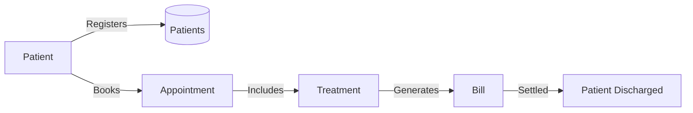

# 🗄️📊 Hospital Planet Blueprint

**Business first. Data model second. SQL third.**


**Patient first. Critical care second. Billing last.**

---

## 🌍 The Business Universe

### Know your landscape

Welcome to **Hospital Planet** — the healthcare universe of the SQLVerse.

Hospital Planet is not E‑Store. There are no shopping carts or product categories. It is not FinVERSE. There are no loans, cards, or investments.

Instead, Hospital Planet is a **healthcare information system** — a digital ecosystem where patients register, book appointments, receive treatments, and settle bills. It is designed to mirror the complexity, workflow, and decision‑making intensity of a real‑world hospital.

This is your first domain leap into **healthcare analytics**.

Inside Hospital Planet, you will work with:

- **Patients** who register, book appointments, and receive care.
- **Appointments** that schedule patient‑doctor interactions.
- **Treatments** that are performed during appointments — consultations, tests, surgeries.
- **Bills** that are generated after treatment and settled before discharge.

**The nouns change. The logic does not.**

---

## 🧭 A Different Kind of Universe: Healthcare is Not Business as Usual

Before we explore the vocabulary and entities of Hospital Planet, pause and reflect.

This is not E‑Store. This is not FinVERSE.

In retail, the customer is the centre of the business. Revenue, growth, and profit are the metrics that matter. In banking, the account is the centre. Transactions, balances, and interest rates drive the decision-making.

**Hospital Planet is different.**

Healthcare is not a business in the traditional sense. It is a **service** — one where **successful treatment and patient satisfaction** matter more than revenue, growth, or profit.

---

### The Patient is Not a Customer

A **customer** buys a product. They choose to engage. They can walk away.

A **patient** receives care. They are vulnerable. They trust the system with their health.

A customer's dissatisfaction means lost revenue. A patient's dissatisfaction can mean delayed diagnosis, miscommunication, or worse — a life at risk.

> 💡 **The Artisan's Insight:** *In retail, you serve a customer. In healthcare, you serve a person.*

---

### The Doctor‑Patient Relationship is the Clinical Heartbeat

In E‑Store, the relationship is between a customer and a product. In FinVERSE, the relationship is between a customer and their money.

In Hospital Planet, the relationship is between a **doctor** and a **patient** — a bond of trust, expertise, and care.

Every appointment, every treatment, every bill flows from this relationship. The data is merely a reflection of it.

Let us say a patient visits a doctor and complains about a constipation problem he is encountering of late. An experienced doctor carrying out a routine medical checkup might sense some irregularities and order an MRI Scan — and discover that the patient has developed a tumour which requires immediate surgery.

Nothing can equal the **skillset** of an experienced **doctor or a surgeon.** We cannot put a price tag or KPI on it as we do for Retail and FinVERSE. The clinical judgment that saves a life cannot be reduced to a metric — yet it is the most valuable asset in the entire system.

---

### The Measure of Success is Different

| Universe | Core Measure of Success |
|----------|-------------------------|
| **E‑Store** | Revenue, conversion rate, customer lifetime value |
| **FinVERSE** | Profit, transaction volume, portfolio performance |
| **Hospital Planet** | Successful treatment outcomes, patient satisfaction, clinical efficiency |

The SQL patterns you will learn in Hospital Planet are the same as any other universe. The tables, columns, and relationships follow the same principles. But the **business context** — the *why* behind the data — is fundamentally different.

---

### What This Means for You

As you explore Hospital Planet, remember:

- You are not analysing transactions. You are **tracking patient journeys**.
- You are not counting customers. You are **measuring clinical outcomes**.
- You are not optimizing revenue. You are **improving care delivery**.

The SQL stays the same. The nouns change. But the *purpose* — the *why* — is something you cannot afford to lose sight of.

**This is a different kind of universe. Approach it with a different kind of lens.**

---

### Business Vocabulary

| Term | Meaning |
|------|---------|
| **Patient** | An individual receiving medical care at the hospital. |
| **Appointment** | A scheduled booking for a patient to see a doctor or receive treatment. |
| **Treatment** | A medical service provided — consultation, diagnostic test, surgery, or rehabilitation. |
| **Bill** | An invoice generated for treatments received by a patient. |
| **Discharge** | The formal release of a patient after their bill is settled. |
| **Status** | Indicates whether a patient is `Active`, `Inactive`, or `Admitted`. |
| **Category** | The clinical department of a treatment — `Primary Care`, `Diagnostic`, `Surgical`, `Rehabilitation`, `Pharmacy`, `Preventative`, `Cardiology`, `Neurology`, or `Surgery`. |

---

### Core Business Entities

| Entity | Description |
|--------|-------------|
| **Patient** | The central actor. Each patient has a unique ID, name, contact details, and status. |
| **Appointment** | The scheduled interaction. Each appointment is linked to a patient and a treatment. |
| **Treatment** | The medical service. Each treatment has a name, cost, and clinical category. |
| **Bill** | The financial record. Each bill is linked to a patient and has an amount and date. |

> 🏛️ **A Note on the Doctor**
>
> You may have noticed that the **Doctor** is not listed as a Core Business Entity. This is not an omission — it is a deliberate design decision.
>
> Medicine is a noble profession. Patients do not see a Doctor as a service provider; they see them as a healer, a guide, and often, a guardian in their most vulnerable moments. In many cultures, patients regard Doctors as God in human form.
>
> Reducing the Doctor to a business entity — a row in a table, a foreign key in a relationship — would diminish that sacred bond.
>
> The Doctor is not a "business object." The Doctor is the clinical heartbeat of the hospital. The data is merely a reflection of that relationship.
>
> In Hospital Planet, the Doctor is respected, not represented.

---

### Key Relationships (Conceptual)

```text
Patient
    │
    ├── books
    ▼
Appointments
    │
    ├── includes
    ▼
Treatments
    │
    ├── generates
    ▼
Bills
```

| Relationship | Business Meaning |
|--------------|------------------|
| **Patient → Appointments** | One patient can have many appointments |
| **Appointments → Treatments** | One appointment can involve one treatment |
| **Patient → Bills** | One patient can have many bills |

> 💡 **Business Insight:** The patient is not just a "customer." A patient is a person under medical care. The doctor‑patient relationship is the **clinical heartbeat** of the hospital — and the data is merely a reflection of that relationship.

---

## 🔄 The Patient Journey

### From Registration to Discharge

#### Business Flow

```text
Patient Registers
        ↓
Appointment Booked
        ↓
Treatment Performed
        ↓
Bill Generated
        ↓
Bill Settled
        ↓
Patient Discharged
```

---

### Data Flow Diagram (DFD)



---

## 🧭 Three Journeys, One Hospital

A hospital is not a factory. Patients do not arrive in neat, identical packages. Every patient is different. Every condition is different. Every journey is different.

In Hospital Planet, we trace three distinct patient journeys — each reflecting a different type of care, a different level of urgency, and a different relationship with the system.

---

### 🩺 The Outpatient Journey

John Smith arrives for a routine checkup. He is healthy, proactive, and expects to go home the same day. His interaction with the hospital is brief, transactional, and complete within a few hours. He is not admitted. He is not critically ill. He simply needs care, and he receives it.

**The Patient Experience:** Calm, routine, predictable.
**The Data Reality:** Minimal, efficient, same-day closure.

---

### 🏥 The Clinical Care Journey

Indra visits the hospital for a routine checkup — and never leaves. What begins as a simple consultation ends in a critical diagnosis, immediate admission, life‑saving surgery, and a long road to recovery. Her journey is not linear. It is urgent, uncertain, and life‑altering.

**The Patient Experience:** Fear, uncertainty, trust, gratitude.
**The Data Reality:** Complex, multi‑stage, spanning admission, treatment, billing, and discharge.

---

### 🧬 The Diagnostic Care Journey

Sarah is referred to the hospital by her local doctor. She does not need admission. She does not need surgery. She needs one thing: a diagnostic test that her local clinic cannot perform. She arrives, undergoes the procedure, pays the bill, and leaves. Her journey is focused, efficient, and clinically precise.

**The Patient Experience:** Focused, clinical, straightforward.
**The Data Reality:** Targeted, efficient, no admission required.

---

## Why Three Walkthroughs?

Most SQL courses give you one dataset, one schema, and one story. Hospital Planet gives you three — because healthcare is not one story.

| Journey | Patient | Urgency | Admission | Data Complexity |
|---------|---------|---------|-----------|-----------------|
| **Outpatient** | John | Low | ❌ | Low |
| **Clinical Care** | Indra | High | ✅ | High |
| **Diagnostic** | Sarah | Medium | ❌ | Medium |

Each walkthrough teaches a different dimension of healthcare data — from simple transactions to life‑saving interventions. Together, they reveal the full spectrum of what it means to track a patient's journey through a hospital.

> 💡 **The Artisan's Insight:** *"In E‑Store, every customer journey is the same. In Hospital Planet, every patient journey is different. The SQL stays the same. The data tells a different story."*

---

## 🚶‍♂️ Walkthrough: The Outpatient Journey

Let's follow **John Smith** through a classic **outpatient encounter** 🩺—a visit where the patient receives care and goes home the same day without being admitted to the hospital.

---

**1. Patient Arrival & Verification** 👤

John arrives for a routine checkup. The receptionist looks up his record in the `patients` table using his name or ID. His status is confirmed as `status = 'Active'`.

---

**2. Selecting the Service** 🩺

The clinic selects the primary care service from the `treatments` table:
- `treatment_name`: 'General Checkup'
- `category`: 'Primary Care'
- `cost`: $120.00

---

**3. Logging the Encounter** 📅

A new row is inserted into `appointments`, establishing a foreign key link between John (`patient_id = 1`) and the service (`treatment_id = 1`) for that specific date.

---

**4. Same-Day Billing & Discharge** 💳

Because John is an outpatient, he completes his visit and leaves. The system generates a charge in the `bills` table, linking `patient_id = 1` with an `amount` of $120.00. Notice that his status in `patients` remains `'Active'` (unlike an inpatient who would be marked `'Admitted'`).

---

## 🚶‍♂️ Walkthrough: The Clinical Care Journey

Let's follow **Indra** through a **critical care encounter** 🏥—a visit where a routine checkup reveals a life‑threatening condition, leading to immediate admission, surgery, and a long recovery.

---

**1. The First Contact (Outpatient Consultation)** 👩‍⚕️

Indra visits the hospital for a routine cardiology checkup. The receptionist registers her details and creates a patient record. The system assigns a unique `patient_id` and writes a new row into the `patients` table with `status = 'Active'`. The hospital now knows who Indra is.

---

**2. The Clinical Encounter** 🩺

Dr. Sharma reviews Indra's medical history and notices an irregularity. He advises an immediate stress test. The system creates an `appointments` record, linking Indra to the cardiology department and the specific treatment.

---

**3. The Diagnostic Truth** 🔬

The stress test reveals a critical blockage. Dr. Sharma advises immediate admission. The system updates Indra's `status` from `'Active'` to `'Admitted'`. A digital health record is now active — tracking every intervention, every test, every decision.

---

**4. The Intervention (Procedure)** 🏥

Indra undergoes a successful procedure. The system records the treatment details in the `treatments` table, linking the procedure to Indra's patient record. Every clinical action is now traceable.

---

**5. The Financial Closure (Billing & Discharge)** 💳

The finance department generates a comprehensive bill covering the consultation, tests, and procedure. Indra settles the bill. The system records the payment in the `bills` table. Her `status` updates to `'Discharged'`.

> ⚡ **Architect's Note:** The database does not just do this for Indra. Hospital Planet can handle thousands of concurrent patient journeys — ensuring that while Indra is receiving life‑saving care, another patient on the other side of the city is being admitted, diagnosed, and treated without scrambling clinical records or billing integrity.

---

## 🚶‍♀️ Walkthrough: The Diagnostic Care Journey

Let's follow **Sarah** through a **diagnostic care encounter** 🧬—a visit where a doctor from another hospital has referred her for a specific clinical test.

---

**1. Patient Registration** 👤

Sarah checks in for her diagnostic procedure. The system assigns a unique `patient_id` and creates a row in `patients` with her contact details and clinical status (`status = 'Active'`).

---

**2. Selecting the Diagnostic Service** 🩺

The referring doctor has already advised an MRI Scan. The hospital selects the service from the `treatments` lookup table:
- `treatment_name`: 'MRI Scan'
- `category`: 'Diagnostic'
- `cost`: $850.00

---

**3. Booking the Encounter** 📅

An appointment is scheduled. A new record is written to `appointments`, using foreign keys (`patient_id` and `treatment_id`) to connect Sarah to her scheduled MRI on a specific `appointment_date`.

---

**4. Performing the Diagnostic Procedure** 🧬

Sarah undergoes the MRI. The system logs the completion of the treatment, linking it to Sarah's patient record. The diagnostic report is generated and shared with the referring doctor.

---

**5. Generating the Bill** 💳

Following treatment, the financial system records a charge. A record is added to `bills`, linking Sarah's `patient_id` with the final billed `amount` and `bill_date`. Sarah pays the bill and is discharged — her status remains `'Active'`.

---

## 🧭 The Thread That Binds Them

You have just traced three distinct journeys through Hospital Planet.

John walked in, received routine care, and walked out — all within a few hours. His journey is simple, predictable, and complete.

Indra walked in for a routine checkup and never left. Her journey is complex, urgent, and life‑altering — a story of critical diagnosis, life‑saving intervention, and recovery.

Sarah walked in for one thing: a diagnostic test. Her journey is focused, clinical, and precise — a story of external referral, targeted care, and efficient discharge.

Three patients. Three conditions. Three completely different journeys.

**Patient first. Critical care second. Billing last.**

That is the governing principle of Hospital Planet.

In Retail, you track products. In Banking, you track money. In Healthcare, you track lives.

That is what makes Hospital Planet different. That is what makes it matter.

---

## What These Journeys Teach You

| Lesson | Why It Matters |
|--------|----------------|
| **Not all patients are the same** | Every patient brings a unique condition, urgency, and pathway. |
| **Not all care pathways are the same** | Some journeys are simple; others are multi‑stage and complex. |
| **Not all business logic is the same** | Outpatient billing is immediate; inpatient billing spans multiple departments and services. |
| **The patient is the centre** | Every decision, every record, every process exists to serve the patient. |


---

## 🔍 Through the Architect's Lens

### Strategic Intelligence

#### Common Business Questions

| Question | SQL Concept |
|----------|-------------|
| Which patients have missing phone numbers? | `IS NULL` |
| What are the most expensive treatments? | `ORDER BY` + `LIMIT` |
| How many patients are admitted per department? | `GROUP BY` + `COUNT` |
| Which treatments cost between 100 and 500? | `BETWEEN` |
| What is the total revenue per category? | `JOIN` + `SUM` + `GROUP BY` |
| Which patients have the highest outstanding bills? | `ORDER BY amount DESC` |
| What are the busiest appointment days? | `GROUP BY appointment_date` + `COUNT` |

---

### Case Studies

### 📊 Case Study 1 – Patient Volume by Department

**Purpose:** Analyse patient volume across clinical departments to identify demand patterns and support resource allocation.

**Business Value:**
- **Staffing Optimisation:** Understanding which departments have the highest patient load enables targeted staffing adjustments.
- **Capacity Planning:** Identifying seasonal or weekly volume trends helps the hospital plan bed capacity and facility readiness.
- **Resource Allocation:** High‑volume departments may require additional equipment, space, or support staff.

**Interested Stakeholders:**
- 🏥 **The Chief Medical Officer** – Evaluating clinical demand and departmental performance
- 📊 **The Head of Operations** – Planning staffing, scheduling, and facility capacity
- 👨‍⚕️ **Department Heads** – Managing their teams and resources based on patient load

**Production Awareness:**

In production, patient volume analysis must process large appointment datasets while clinical operations continue. Unlike classroom datasets, enterprise systems must balance **analytical depth**, **real‑time visibility**, and **clinical workflow performance**.

> 💡 **Architecture Insight**
>
> - **Date‑Partitioned Tables:** The `appointments` table is often partitioned by date to keep queries fast. Monthly partitions allow the database to scan only the relevant chunk when filtering by `appointment_date`.
>
> - **Aggregate Tables:** Pre‑computed tables that store daily or weekly patient volumes enable fast dashboard refreshes without scanning millions of raw appointment records.

> 💡 **SQL Connection**
>
> *You learned `COUNT` and `GROUP BY` in Module 3 of ACQUIRE. You will apply them to healthcare volume analytics throughout ACCELERATE.*

---

### 📊 Case Study 2 – Treatment Cost Analysis

**Purpose:** Analyse treatment costs across categories to identify high‑cost services, outliers, and cost optimisation opportunities.

**Business Value:**
- **Cost Management:** Identifying the most expensive treatments enables targeted cost‑reduction strategies.
- **Pricing Strategy:** Understanding cost distribution helps the hospital set fair and competitive pricing.
- **Budget Planning:** Projecting treatment costs supports annual budgeting and financial forecasting.

**Interested Stakeholders:**
- 📈 **The Chief Financial Officer** – Tracking treatment costs and revenue against operational targets
- 👨‍⚕️ **The Chief Medical Officer** – Evaluating clinical cost‑effectiveness
- 🏥 **The Head of Procurement** – Managing supplier contracts for high‑cost treatments

**Production Awareness:**

In production, treatment cost analysis must process large billing datasets while clinical operations continue. Unlike classroom datasets, enterprise systems must balance **analytical depth**, **reporting speed**, and **financial accuracy**.

> 💡 **Architecture Insight**
>
> - **Read‑Replica Isolation:** Reporting queries are directed to read‑only database replicas to avoid locking billing tables.
>
> - **Cost Outlier Detection:** Production systems flag treatments with costs significantly above the average for their category, enabling proactive cost review.

> 💡 **SQL Connection**
>
> *You learned `SUM`, `AVG`, and `JOIN` in Modules 3 of ACQUIRE. You will apply them to financial analytics throughout ACCELERATE.*

---

### 📊 Case Study 3 – Discharge Efficiency Tracking

**Purpose:** Track patient discharge patterns, identify bottlenecks, and improve operational efficiency.

**Business Value:**
- **Capacity Management:** Faster discharges free up beds for new admissions, improving patient access.
- **Operational Efficiency:** Identifying discharge bottlenecks enables targeted process improvements.
- **Patient Experience:** Timely discharge reduces average length of stay and improves patient satisfaction.

**Interested Stakeholders:**
- 🏥 **The Head of Patient Flow** – Managing bed occupancy and discharge planning
- 📊 **The Operations Manager** – Monitoring discharge efficiency and identifying bottlenecks
- 📈 **The CFO** – Tracking revenue per bed and operational efficiency

**Production Awareness:**

In production, discharge efficiency analysis must handle large volumes of patient data while clinical workflows continue. Unlike classroom datasets, enterprise systems must balance **temporal analysis**, **reporting speed**, and **clinical workflow performance**.

> 💡 **Architecture Insight**
>
> - **Partitioning:** The `bills` table is often partitioned by date to keep queries fast. Monthly partitions allow the database to scan only the relevant chunk when filtering by `bill_date`.
>
> - **Temporal Pattern Analysis:** Production systems track month‑over‑month discharge volumes to detect surges that may indicate seasonal patterns, staffing issues, or operational bottlenecks.

> 💡 **SQL Connection**
>
> *You learned `BETWEEN` and date filtering in Module 2 of ACQUIRE. You will apply them to discharge efficiency tracking throughout ACCELERATE.*

---

### Sample Data Highlights

| Feature | Example | Purpose |
|---------|---------|---------|
| **NULL phones** | Patients 3, 6, 11, 12 | Enables `IS NULL` exercises |
| **Status filtering** | `Active`, `Inactive`, `Admitted` | Enables status‑based filtering |
| **Cardiology/Neurology categories** | Cardiology Consultation, Neurology Consultation | Supports high‑cost specialty filtering |
| **Surgery category** | Surgery - Minor, Surgery - Major | Supports `Surgery` category filtering |
| **Outlier bills** | Bill #13 (25.00), Bill #14 (6000.00) | Supports `< 50` or `> 5000` exercises |
| **Date‑range bills** | Bills across Jan–May, including March 1‑7 | Supports `BETWEEN` date range exercises |
| **Multiple bills per patient** | Patient 1 (2 bills), Patient 2 (2 bills), Patient 13 (2 bills) | Supports aggregation exercises |
| **Multiple appointments per patient** | Patient 1, 2, 13 have 2 appointments each | Supports aggregation exercises |
| **Appointments linked to treatments** | `treatment_id` FK in appointments | Supports `JOIN` exercises |

---

### Pedagogical Design Notes

- **Mirror structure** – Hospital Planet mirrors E‑Store: `patients` → `customers`, `treatments` → `products`, `appointments` → `orders`, `bills` → `order_items`.
- **NULL handling** – Patients 3, 6, 11, 12 have NULL phones; practise `IS NULL`.
- **Status filtering** – `Active`, `Inactive`, `Admitted` – supports `=`, `!=`, `IN`.
- **Category filtering** – `Cardiology`, `Neurology`, `Surgery`, plus existing categories – supports category‑based filtering.
- **Comparison operators** – Costs range from 25 to 6000; supports `>`, `>=`, `<`, `<=`, `=`, `<>`.
- **BETWEEN** – Dates span Jan–May; supports date range exercises.
- **LIKE** – Names include varied patterns.
- **Aliases** – Column names support `AS`.
- **JOIN readiness** – `appointments` has a foreign key to `treatments`, enabling multi‑table joins.
- **Aggregation readiness** – Multiple bills per patient and multiple appointments per patient support `GROUP BY`, `SUM`, `COUNT`, `HAVING`.

---

### SQLVerse Architect's Checklist

Before writing SQL, professional developers usually answer three questions:

1. **Where does this information live?**
   Identify the table that owns the requested business data – patients, appointments, treatments, or bills.

2. **Will one table be sufficient?**
   Decide whether the business request requires relationships across multiple tables.

3. **What exactly is the business asking to see?**
   Separate the required output from the business story.

> **Blueprint Reminder:** This document helps you understand the data model before you begin querying it. Understanding the structure first usually leads to simpler and more accurate SQL.

---

## 🚀 Ready to Explore the Data Model

You have now explored the business landscape of Hospital Planet — how the organisation operates, how patients interact with the system, where data originates, and how business questions map to database entities.

The next step is to explore how this business landscape is implemented inside the database. You'll discover the tables, columns, relationships, and constraints that power the **Hospital Planet ecosystem.** The Schema Guide shows **how** this reality is represented inside the database.

For a detailed walkthrough of the data model, refer to the **Hospital Planet Schema Guide**. 

**Business first. Data model second. SQL third.**

---

*Part of our mission for 🎯 Quality Education for Anyone, Anywhere, Anytime — 💫 with Comfort, Convenience at no Cost.*

**SQLVerse | Hospital Planet Blueprint | Level 1 | ACCELERATE Phase**