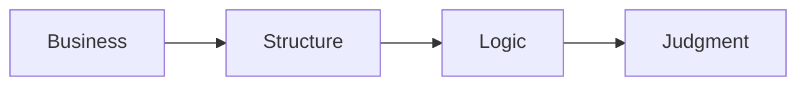

# 🗄️🤖 SQL & GenAI Course
**🎯 Quality Education for Anyone, Anywhere, Anytime — 💫 with Comfort, Convenience at no Cost**

---

# 🎭 🌍 SQLVerse: The Quantum Multiverse

## Welcome to the SQLVerse Business Multiverse Manifesto

Welcome, Architect.

You have crossed the threshold. You have proven that you can write valid SQL—that you can `SELECT`, `WHERE`, `JOIN`, and filter with precision. 

That is no longer the goal. **Business Reasoning is.**

This is your compass for every business universe you will explore. It establishes the **constitution of enterprise data judgment**—governing every query, every decision, and every insight you will extract.

From this moment forward, we stop treating **SQL** as a computer language and start treating it as an **executive decision engine.**

Read it once. Internalise it. Return to it whenever you need to remember *why* you are learning what you are learning.

**The journey continues. The logic stays the same.**

---

# 🏛️ Section 1: The Constitution of Enterprise Data Judgment

### The Shift from Syntax to Enterprise Reasoning

 "In **ACQUIRE**, you learned to ask *which rows*. In **ACCELERATE,** you learn to ask *what they mean*."

From this point onward, SQL syntax is a given. The goal is **business reasoning**.

| Phase | Function |
|-------|----------|
| **ACQUIRE** | How SQL works – mechanics, syntax, and structure |
| **ACCELERATE** | Why businesses care – translating queries into business value |
| **ANALYZE** | What exactly a business needs – diagnosing problems, defining requirements |
| **ARCHITECT** | How to deploy SQL for the business – designing systems, owning outcomes |

---

## 🏛️ The Four SQLVerse Laws

These four principles govern everything you will learn in Level 1 and beyond. They are not SQL rules. 

They are **core operational principles**—the foundation of every decision you will make as a data professional.

---

### Law #1 — Business Before SQL

You are paid to solve business problems, not to write SQL.

A correct query that answers the wrong question is useless. The stakeholder defines the problem. Your SQL is the tool to solve it. Always translate messy, human prose into a clear business intent before touching the keyboard.

---

### Law #2 — Structure Before Syntax

Find where the information lives before deciding how to retrieve it.

Understanding the schema, relationships, and granularity is more important than knowing every function. Mapping relationships across schemas will save you from writing beautiful queries against the wrong tables.

---

### Law #3 — Logic Outlives Vocabulary

Business names change. SQL logic survives.

The underlying analytical footprints remain completely stable whether you are auditing retail transactions, hospital beds, or sovereign wealth funds. The SQL patterns remain the same. The nouns change. The logic does not.

---

### Law #4 — The Syntax Is the Vehicle. The Judgment Is the Destination.

SQL gets you to the answer. Professional judgment determines whether it is the right answer.

The syntax is how you travel. The judgment is where you arrive. A query with zero syntax errors is merely operational; a query that delivers unassailable business truth to the boardroom is successful.



**Welcome to PRODUCTION REALITY.**

**Business first. Data model second. SQL third.**

---

## The Shift

| Foundation | Production Thinking |
|-----------|---------------------|
| Learn SQL syntax | Learn business reasoning |
| "How do I write this?" | "What does this mean for the business?" |
| Correct queries | Defensible decisions |
| Syntax errors | Judgment errors |
| The vehicle | The destination |

---

## Why This Matters

These laws are not abstract ideals. They are the **operating system** of the SQLVerse. Every query you write, every report you design, every decision you make will be governed by them.

- **Law #1** keeps you anchored to the stakeholder.
- **Law #2** keeps you anchored to the schema.
- **Law #3** keeps you anchored to the logic.
- **Law #4** keeps you anchored to the outcome.

Together, they transform you from a query writer into a **data architect**.

---
## 🏛️ The SQLVerse Educational Philosophy

Most SQL courses teach syntax.

Some teach syntax through business examples.

**SQLVerse teaches something different.**

It teaches **professional thinking**.

 - **Business thinking** first.
 - **Data modelling** second.
 - **SQL** third.
   
 
**Typical SQL Course:** Learn syntax → Practice with arbitrary data → Repeat.

**SQLVerse:** Understand the business → Model the data → Write the SQL.

Everything in the **SQLVerse Business Multiverse** is built upon this philosophy.

Every **Blueprint**, every **Schema Guide**, every **Walkthrough**, every **Case Study**, and every **Database** exists for one purpose:

> **To help you think like a data professional before you write like one.**

---

# 🌍Section 2:  SQLVerse Multiverse Business Suite

## Multiverse : One Logic. Many Worlds.

Welcome, Architect.

You are about to embark on a journey across multiple business universes. Each one is a world unto itself—with its own rules, its own stakeholders, its own language. But beneath the surface, they all share the same relational foundation.

Your task is not to memorise tables. Your task is to recognise patterns.

**Before you enter any universe, you must study its map.**

---
## 🌍 Why Multiple Business Worlds?

**Every industry believes it is unique.**

 - **Retail** believes Customers matter.
 - **Healthcare** believes Patients matter.
 - **Real Estate** believes Properties matter.
 - **Finance** believes Transactions matter.

They are all right.

They are also all looking at the same structure through different windows.

> Yet beneath those different vocabularies lies the same relational architecture.

**SQLVerse** does not teach four databases.

It teaches **one way of thinking** through four different businesses.

> **Industries** become the classroom.
>
> **Patterns** become the lesson.

---

## 🏛️ Every World Begins With Three Artifacts

Every business universe in SQLVerse is intentionally constructed from three complementary perspectives.

**You never explore a database directly.**

> First understand the business.
>
> Then its architecture.
>
> Only then its implementation.

| Artifact                  | Purpose                                           |
| ------------------------- | ------------------------------------------------- |
| 📄 Business Blueprint     | Understand the business before touching the data. |
| 📐 Technical Schema Guide | Understand how the business becomes architecture. |
| 💾 Working Database       | Interact with the living implementation.          |

**Business first. Data model second. SQL third.**

---

## The SQLVerse Data Repository 

Every business universe in the **SQLVerse Data Repository** is designed to be **explored** through two complementary lenses.

| Lens | Document | Question It Answers | What You Learn |
|------|----------|---------------------|----------------|
| **Business-Centric Lens** | **Blueprint** | *"What does this business do?"* | The business story — who the stakeholders are, what they value, how the business operates |
| **Architecture‑Centric Lens** | **Schema Guide** | *"How is this business implemented architecturally?"* | The technical implementation — how the business is translated into tables, relationships, and production architecture |
| **Both** | **Blueprint + Schema Guide** | *"How do business and architecture connect?"* | How to think like a data professional — bridging the gap between business problems and data solutions |

---

### 🗄️ The Map, The Compass, The Terrain

| Metaphor | SQLVerse Artifact | Role |
|----------|-------------------|------|
| 🗺️ **Map** | Business Blueprint | Understand the business landscape. |
| 🧭 **Compass** | Technical Schema Guide | Navigate the architecture and evolution of the universe. |
| 🌍 **Terrain** | Working Database | Experience the living business world. |


Each universe in SQLVerse is constructed from three complementary artifacts—a **Blueprint**, a **Schema Guide**, and a **Database**. Together, they form a complete journey from business understanding to hands-on practice.

The **Blueprint** is your **map**. It tells you what the business does—its story, its stakeholders, its workflows. It answers the question: *"What am I looking at?"*

The **Schema Guide** is your **compass**. It tells you how the business is built—its architecture, its relationships, its evolution, its future possibilities. It answers the question: *"How does this work?"*

The **Database** is the **terrain**. It is the living world you explore, query, and transform. It answers the question: *"What can I do with it?"*

**You study the map first. You orient yourself with the compass. Then you step into the terrain.**

---

#### 📂 Data Repository Location

```
Level-1-beginner/sqlverse-foundation/resources/data-models/flagship-universes
```

Inside this folder, you will find:

- `blueprints/` – ER Diagrams and Schema Guides for every universe
- `databases/` – The SQLite database files for each universe
- `schemas/` – Detailed schema definitions

for all the Flagship Business Universes.

Inside this folder, each Flagship Business Universe has its own dedicated sub‑folder:

```
flagship-universes/
│
├── 1-e-store/
│   ├── level1_estore_apply.db
│   ├── E-Store_Blueprint.md
│   └── E-Store_Schema.md
│
├── 2-hospital-planet/
│   ├── hospital_planet.db
│   ├── Hospital_Planet_Blueprint.md
│   └── Hospital_Planet_Schema.md
│
├── 3-real-estate-planet/
│   ├── real_estate_planet.db
│   ├── Real_Estate_Planet_Blueprint.md
│   └── Real_Estate_Planet_Schema.md
│
└── 4-finverse/
    ├── finverse.db
    ├── FinVERSE_Blueprint.md
    └── FinVERSE_Schema.md
```

Each sub‑folder contains the complete set of artifacts for that universe:

- **Blueprint** — The conceptual guide
- **Schema Guide** — The technical reference
- **Database** — The living world

---
## 🔢 Why This Order?

The four flagship universes are not randomly ordered. The numbering — **1-e-store, 2-hospital-planet, 3-real-estate-planet, 4-finverse** — encodes an intentional pedagogical progression.

| Universe | Why First? | What It Builds |
|----------|------------|----------------|
| 🛒 **E-Store** | Students already understand customers, products, and orders. Zero cognitive overhead. | **Confidence** — SQL solves familiar business problems. |
| 🏥 **Hospital Planet** | Introduces richer relationships, stronger business rules, and ethical context. | **Empathy** — SQL supports human life. |
| 🏠 **Real Estate Planet** | Introduces ambiguity, branching workflows, and complex decision-making. | **Judgement** — SQL models multi‑outcome human choices. |
| 💳 **FinVERSE** | Demands precision, governance, and enterprise thinking. | **Enterprise Thinking** — SQL must never compromise accuracy. |

**The progression is not just about content — it is about complexity.**

The shift from **E-Store** to **Hospital Planet** is smoother than the shift from **Hospital Planet** to **Real Estate Planet**, where the number of tables multiplies, workflows become non‑linear, and business logic becomes more ambiguous.

| Transition | Complexity Shift |
|------------|------------------|
| E-Store → Hospital Planet | More entities, richer relationships, ethical context |
| Hospital Planet → Real Estate Planet | More tables, branching workflows, ambiguous outcomes |
| Real Estate Planet → FinVERSE | Enterprise‑scale systems, regulatory constraints, precision demands |

**The numbers are not arbitrary. They are the roadmap of your professional growth.**

---

## 🔍 The Two Lenses of Every Universe

Every learning experience inside a SQLVerse universe—whether a Blueprint, Case Study, Walkthrough, or Schema Guide—is viewed through two complementary lenses  — the **Business Lens** and the **Architectural Lens**.


| Lens | Applied in | Perspective | What It Captures |
|------|----------|-------------|------------------|
| **Business Lens** | Blueprint, Case Studies, Walkthroughs | *Why* the business exists | Business Story, Vocabulary, Core Entities, Relationships, Business Flow |
| **Architectural Lens** | Schema Guide, Walkthroughs | *How* the business is implemented | Table Schemas, ER Diagram, Key Relationships, Production Architecture |

**The Blueprint answers:** *"What business problem are we solving?"*

**The Schema Guide answers:** *"How does the database solve it?"*

> *The **Business lens** gives you the **Bird's eye view.** 
> 
> The **Architectural lens** gives you the **Microscopic view.** 
> 
> Only **together** do you see the entire **landscape.***

---

### 🔍 The Two Viewpoints of Every Case Study

A **Case Study** presents a real‑world business problem and explores how SQL can be used to solve it. It is examined through two lenses:

| Lens | Focus |
|------|-------|
| **Business View** | The business problem — why this matters to the stakeholder |
| **Architectural View** | The technical implementation — how the database solves it |

---

### 🚶 The Two Viewpoints of Every Walkthrough

A **Walkthrough** traces a complete end‑to‑end journey through a business process — from a customer action to its resolution. It is examined through two lenses:

| Lens | Focus |
|------|-------|
| **Business View** | The customer or patient journey — how the user interacts with the business |
| **Architectural View** | The data flow and system evolution — how the process maps to tables, constraints, and future enhancements |


---

###  🧭 The SQLVerse Exploration

```text
You study the Map first.
You orient yourself with the Compass.
Then you step into the Terrain.
```

**You learn the story. Then you learn the system.**

---

## The Evolution : ACQUIRE → ACCELERATE

### Looking back at ACQUIRE Planets

In **ACQUIRE**, you learned SQL using a small number of carefully controlled datasets—**Training Institution** for demonstration and **E‑Store** for practice. That phase focused on mastering syntax without unnecessary business complexity.

#### 🏫 Training Institution – The Anchor

**Personality:** Familiar, safe, the foundation you already know.

**Role in Level 1:** Demonstration and cognitive reorientation—your anchor in the multiverse.

**Case Studies:**
- Student Fee Analysis
- Department Enrollment Trends
- Instructor Performance Metrics

**Evolution:** Grows with you—subqueries, CTEs, and reporting in Level 2; window functions and predictive analytics in Level 3.

>  📌 **Note:** The **Training Institution** universe remains unchanged—it is the exact database you used in ACQUIRE, providing a familiar anchor for demonstration. It is not stored in the SQLVerse Repository; instead, it is loaded from its original ACQUIRE location, which serves as the **single source of truth** for this foundational dataset. The SQLVerse Repository is reserved for enhanced and new universes—not the original ACQUIRE anchor.

Now, in **ACCELERATE**, the landscape shifts.

> **During ACQUIRE...**
>
> *you learned to write SQL.*
>
> **During ACCELERATE...**
>
> *you begin learning why businesses are modelled the way they are.*

The syntax remains the same.

**Your thinking changes.**

The database is no longer a collection of tables.

**It becomes a living business.**

---

### Enhanced E‑Store : The First Evolution

E‑Store is the only universe that bridges ACQUIRE and ACCELERATE.

In ACQUIRE, it was a clean, predictable dataset—designed to teach you syntax without distractions. No NULLs. No edge cases. No production‑style anomalies.

In ACCELERATE, it has been **enhanced**.

| Enhancement | Why It Matters |
|-------------|----------------|
| **NULL values** | You now handle incomplete customer data—just like in production |
| **Bulk orders** | You encounter enterprise‑scale purchase patterns |
| **New categories** | Category‑based filtering requires more nuanced logic |
| **Orders across multiple months** | Date‑range filtering tests your temporal logic |
| **Duplicate cities** | `DISTINCT` exercises now produce meaningful results |

**_The schema has been upgraded. The data has been enriched and made production‑ready._**

E‑Store is still your home turf. But now it is a home that has grown—richer, messier, and more realistic.

The enhanced E‑Store, along with all new universes (FinVERSE, Hospital Planet, Real Estate Planet), is stored in the SQLVerse Repository.

---

## 🌍 The Universes of the SQLVerse Multiverse

### The Four Pillars of Professional Maturity

| Universe | Domain | Layer | What It Develops |
|----------|--------|-------|------------------|
| 🛒 **E-Store** | Retail | Operational Layer | Business awareness |
| 🏥 **Hospital Planet** | Healthcare | Human Layer | Human-centred thinking |
| 🏠 **Real Estate Planet** | Property | Decision Layer | Decision modelling |
| 💳 **FinVERSE** | Digital Banking | Systems Layer | Enterprise thinking |

---
### 🌌 Deep Dive into the Four Universes

#### 1. 🛒 E-Store — The Operational Layer

**Motto:** *Customer first. Product second. Transaction third.*

**Mindset:** Operational Efficiency

**Personality:** Your home turf—familiar, now enhanced for production thinking.

**The Reality:** High-volume retail transactions, order fulfilment, and raw inventory mechanics. Enhanced with production edge cases—NULL values, bulk spikes, and dirty data.

**Core Lesson:** *"SQL solves familiar, high-frequency business problems."*

**Role in Level 1:** Practice, enhanced dataset with NULLs, bulk orders, new categories.

**Case Studies:**
- Customer Purchase Patterns
- Category Performance Analysis
- Order Fulfilment Efficiency

**Evolution:** Expands into inventory analytics, customer segmentation, and revenue forecasting as you progress.

> *"Every transaction reminds us that efficiency is not optional—it is the language of scale."*

---

#### 2. 🏥 Hospital Planet — The Human Layer

**Motto:** *Patient first. Critical care second. Billing last.*

**Mindset:** Empathy & Responsibility

**Personality:** Built around patient journeys, treatment costs, and billing cycles.

**The Reality:** Life-critical workflows where data points represent real human care paths, discharge timelines, and treatment histories. Mistakes here aren't just bad metrics—they impact lives.

**Core Lesson:** *"Data isn't abstract numbers—it represents human beings."*

**Role in Level 1:** Domain‑specific terminology, appointment analytics, discharge cycles.

**Case Studies:**
- Patient Volume by Department
- Treatment Cost Analysis
- Discharge Efficiency Tracking

**Evolution:** Introduces insurance claims and lab analytics in Level 2; predictive patient outcomes in Level 3.

> *"Every patient journey reminds us that behind every row sits a human story."*

---

#### 3. 🏠 Real Estate Planet — The Decision Layer

**Motto:** *People first. Properties second. Transactions last.*

**Mindset:** Aspirations, Negotiation & Judgment

**Personality:** Models the complete deal lifecycle—from listing to closing.

**The Reality:** Multi-branching workflows where searches, visits, and offers rarely move in a straight line. Modelling complex human decisions, high-stakes negotiations, and changing market dynamics.

**Core Lesson:** *"SQL models ambiguous, multi-outcome human choices."*

**Role in Level 1:** Agent performance, property valuation, deal pipelines.

**Case Studies:**
- Agent Performance Ranking
- Property Valuation Trends
- Deal Pipeline Analysis

**Evolution:** Adds mortgages, commissions, and market trend analysis in Level 2; portfolio valuation in Level 3.

> *"Every property transaction models aspirations, negotiation, and uncertainty."*

---

#### 4. 💳 FinVERSE — The Systems Layer

**Motto:** *Account integrity first. Transaction precision second. Risk & Audit always.*

**Mindset:** Enterprise Precision & Governance

**Personality:** The flagship enterprise universe—KPI thinking, revenue analytics, customer‑centric reporting.

**The Reality:** Double-entry ledgers, fraud detection algorithms, and immutable audit trails. Zero tolerance for errors.

**Core Lesson:** *"Systems must never compromise precision."*

**Role in Level 1:** Advanced SQL reasoning, fraud detection, risk analysis.

**Case Studies:**
- Revenue KPI Dashboard
- Transaction Fraud Detection
- Customer Lifetime Value Analysis

**Evolution:** Adds credit cards, fraud detection, and international money transfer in Level 2; portfolio risk modelling and predictive analytics in Level 3.

> *"Every transaction reminds us that precision is not optional—it is trust made visible."*

---

### 💥 Multiverse Traversal: The Invariant Truth

Professional data architects are not hired because they memorised the table names of a single database. They are hired because they can step into *any* corporate boardroom on Earth, isolate the metrics that matter, and deploy the invariant patterns of SQL to extract them.

#### The Traversal progression

 - Every new universe strips away another layer of dependency on familiar terminology.
 - Eventually you stop recognising industries.
 - You start recognising patterns.
    
 **That is the moment SQL becomes transferable.**

We do not switch universes to confuse you. We cycle through these *parallel universes* to **discover one architectural truth:**

> **The nouns change. The logic does not.**

The **Multiverse traversal** proves that the **same SQL** survives **different businesses.**

> The universe evolves. 
>
> The schema scales horizontally. 
>
> The transaction volume multiplies by ten thousand. 

**The relational engine remains invariant.**

---

### 🌱 A Living Multiverse

#### Mini-Universes & Future Expansion

The **SQLVerse Business Multiverse** never stops growing since it is a **living ecosystem.**

> **Businesses evolve.**
>
> **Industries transform.**
>
> **New regulations emerge.**
>
> **Entire markets appear where none existed before.**

**The SQLVerse Business Multiverse grows alongside them**—not because SQL changes, but because professional thinking never stands still.

As you progress through **Level 2** and **Level 3**, the flagship universes themselves evolve. New tables are added. New business scenarios emerge. New complexities appear—not to overwhelm you, but to challenge you with the tools you have already mastered.

**Each level unlocks new continents, new maps, new economies.**

For example, **Credit Cards**, **Fraud Detection**, and **International Money Transfer** may be added to FinVERSE at Level 2 or Level 3.

---

#### 🌍 Mini-Universes

As SQLVerse grows, new **mini‑universes** will join the Multiverse—not because SQL has changed, but because your professional perspective continues to expand.

Every new world asks a different business question.

**Every new world reinforces the same relational truth.**

Mini‑universes will be introduced for specialized topics in **ACCELERATE** and in Levels 2 and 3.

All mini‑universes will live alongside the flagship universes in the **SQLVerse Resource Repository**:

```
Level-1-beginner/sqlverse-foundation/resources/data-models/mini-universes/
```


---

#### 🏗️ The Growth Model

The **SQLVerse Business Multiverse** is open to:

- **Vertical scaling** — adding specialized domains (e.g., Insurance, Logistics, Manufacturing)
- **Horizontal schema growth** — adding complex tables to existing universes (e.g., Fraud Detection, Credit Cards, International Transfers)

The **Multiverse** is a **living ecosystem.** 

Come and **experience** the **immersive journey.** 

Watch how it evolves—and **evolve with it.**

---

# 🧠Section 3: The Enterprise Operational Workflow

## The Professional Pipeline

From this point onward, every single lab challenge requires you to process your thoughts through **The Professional Pipeline** before you write a single line of SQL:

```text
  [1] Business Question  ──> What does the executive actually want to know?
         ↓
  [2] The One-Row Rule   ──> What must ONE single row represent when the query finishes?
         ↓
  [3] The Blueprint      ──> Isolate the Dimension (Group By) vs. the Metric (Aggregate).
         ↓
  [4] Domain Invariance  ──> Strip away the industry nouns to find the skeletal pattern.
         ↓
  [5] The Vehicle        ──> Type the execution code.
```

---

## Supporting Practices

| Practice | Why |
|----------|-----|
| **Think before writing SQL** | Understand the problem before typing. |
| **Explain your assumptions** | Every query is built on assumptions. Document them. |
| **Identify the KPI** | What business metric does this query answer? |
| **Translate business language** | Business users don't speak SQL. You must translate. |
| **Defend your choices** | There is rarely one correct query. Justify yours. |
| **Extract gemstones** | Capture insights, not just syntax. |

---

## Integration Notes

| Element | How It Connects |
|---------|-----------------|
| **The Professional Pipeline** | The sequence of thinking that happens **before** writing SQL. |
| **Supporting Practices** | The habits that guide each step of the pipeline. |
| **Pipeline + Practices** | Together, they form the operational discipline for every challenge. |

---

## 🪜 The Aggregation Ladder

The CFO will not be interested in looking at monthly transactions spanning 700 rows and manually calculating revenue for each product category. They need a **Business report**—summarised into 10 lines, one line per product category—to find out: 

**Did we hit, beat, or miss the monthly revenue goal?**

That is the purpose of aggregation.

```text
Level 1: Filter
        ↓
   Which rows are relevant?

Level 2: Group
        ↓
   Which buckets do I need?

Level 3: Aggregate
        ↓
   One number per bucket.

Level 4: Present
        ↓
   Executive-ready output.
```

**The Elevation:** Filtering is about *reducing rows*. Aggregation is about *creating meaning*. A business executive doesn't need to see every transaction—they need to see the story the transactions tell.

The CFO **focuses** on just three questions:
- Which product categories have **met the target?**
- Which product categories have **underperformed?**
- Which product categories have **outperformed?**

The **raw numbers** tell you **what happened.** 

The **aggregation** tells you what it means. 

**Executives** don't need more data—they need the right **answers** to **drive** the **right decisions.**

An executive-level report exists to **answer the questions** that truly matter.

---

## Why This Matters

| Concept | Business Application |
|---------|----------------------|
| **Filter** | Focus on relevant data (e.g., current year, active customers) |
| **Group** | Organise by categories (e.g., product, region, department) |
| **Aggregate** | Measure performance (e.g., total revenue, average order value, count of customers) |
| **Present** | Prioritise and order results to support decisions |

The Aggregation Ladder is not a SQL sequence. It is a **thinking framework** for turning raw data into executive decisions.

---

# 🎭 The Final Lens: Look at the Bones

You have now completed the four pillars of the SQLVerse worldview.

* 🏛️ **Section 1: The Constitution of Enterprise Data Judgment** — *Principles*
* 🌍 **Section 2: SQLVerse Multiverse Business Suite** — *Contexts*
* 🧠 **Section 3: The Enterprise Operational Workflow** — *Thinking Process*
* ⚖️ **The Final Lens** — *Professional Judgment*

Everything you have learned so far leads to one simple shift:

**Stop seeing businesses. Start seeing structures.**

When a tourist walks into a bank, a hospital, or a massive retail warehouse, they see marble floors, surgical lights, or rows of inventory shelves. They see the surface.

When an architect walks into those same buildings, they don't see the decoration. They see the load-bearing pillars. They see the structural steel. They see how gravity is being managed.

From this moment on, you are no longer a tourist in the database.

When you step into FinVERSE or Hospital Planet, **strip away the facade**. Stop looking at the paint on the walls. **Look at the bones.** A `GROUP BY` is a load-bearing pillar whether it is supporting a financial ledger or a patient register.

**Train your eyes to see the steel. The rest is just noise.**

---

**Read once. Internalise. Reference forever.**

---

*Part of our mission for 🎯 Quality Education for Anyone, Anywhere, Anytime — 💫 with Comfort, Convenience at no Cost.*

**SQLVerse | Business Multiverse | Worldview**
