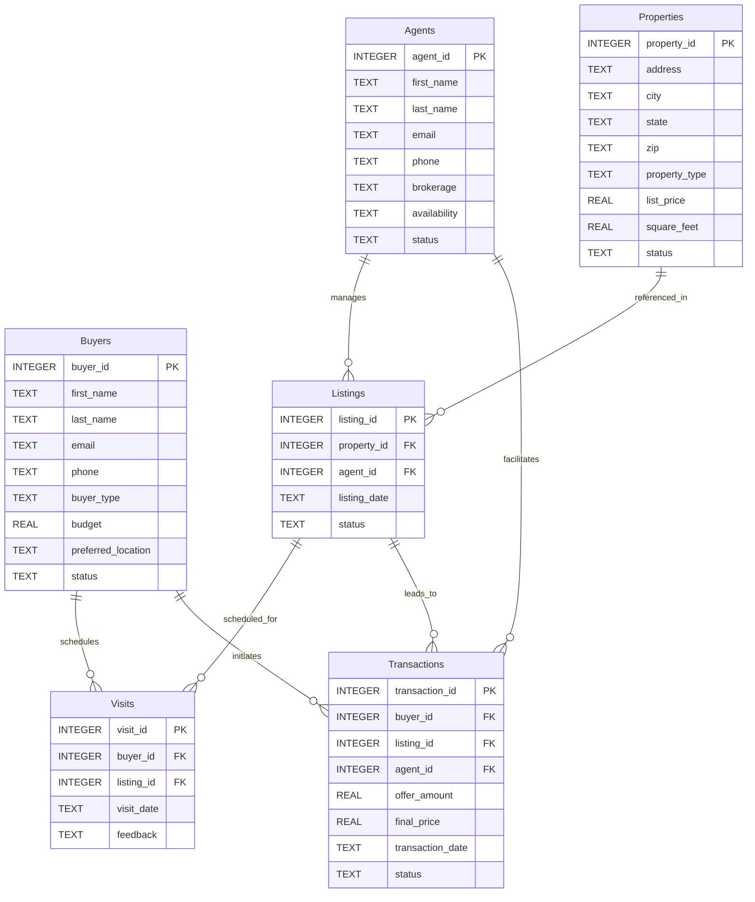

# 🗄️📊 Real Estate Planet Schema Guide

## 🏛️ From Blueprint to Schema Guide

In the **Real Estate Planet Blueprint**, we made a deliberate choice:

> *"The Agent is not a commodity. The Agent is a trusted guide. A special place is reserved for them."*

That was a philosophical statement. It honoured the trust and relationship that define the real estate industry.

Now we enter the **Schema Guide**. Here, our responsibility is different.

Every production real estate system requires an **Agents table**. Respecting the profession and modelling the data are two different responsibilities.

The Blueprint honoured the Agent as a trusted guide. The Schema Guide designs the system that supports them.

---

> **SQLVerse Acknowledgment**
>
> SQLVerse recognises the invaluable contribution of Real Estate Agents to the communities they serve. Behind every listing, visit, negotiation, and transaction lies years of market knowledge, ethical responsibility, and the ability to guide people through one of the most significant financial decisions of their lives.
>

---

## 📌 Purpose

This document provides a **human‑readable technical reference** for the Real Estate Planet schema. It describes the tables, columns, relationships, and constraints that define the database implementation of the property universe.

For the actual database file, refer to `3-real_estate_planet.db`. For the business and conceptual understanding, refer to the **Real Estate Planet Blueprint**.

---

## 📊 Entity Relationship Diagram (ERD)



---

## 🗂️ Table Schemas

### 📌 A Note on the Agents Table

The Blueprint deliberately chose not to model Agents as a business entity.

The Schema Guide now introduces the **Agents table** because a production real estate system cannot function without uniquely identifying practitioners, managing listings, scheduling visits, recording transaction facilitation, and maintaining regulatory compliance.

Respect for the profession remains unchanged.

Only the lens has changed.

---

### `buyers`

| Column | Type | Nullable | Description | Constraints |
|--------|------|----------|-------------|-------------|
| `buyer_id` | INTEGER | No | Unique buyer identifier | **PRIMARY KEY** |
| `first_name` | TEXT | No | Buyer's first name | NOT NULL |
| `last_name` | TEXT | No | Buyer's last name | NOT NULL |
| `email` | TEXT | Yes | Buyer's email address | – |
| `phone` | TEXT | Yes | Buyer's phone number | – |
| `buyer_type` | TEXT | No | `Individual`, `Corporate`, `Investor` | NOT NULL, default `'Individual'` |
| `budget` | REAL | Yes | Maximum budget for property purchase | – |
| `preferred_location` | TEXT | Yes | Preferred city or locality | – |
| `status` | TEXT | No | `Active`, `Inactive`, `Closed` | NOT NULL, default `'Active'` |

---

### `agents`

| Column | Type | Nullable | Description | Constraints |
|--------|------|----------|-------------|-------------|
| `agent_id` | INTEGER | No | Unique agent identifier | **PRIMARY KEY** |
| `first_name` | TEXT | No | Agent's first name | NOT NULL |
| `last_name` | TEXT | No | Agent's last name | NOT NULL |
| `email` | TEXT | Yes | Agent's email address | – |
| `phone` | TEXT | Yes | Agent's phone number | – |
| `brokerage` | TEXT | No | Brokerage firm name | NOT NULL |
| `availability` | TEXT | Yes | Availability pattern (e.g., `Mon-Fri 9-5`) | – |
| `status` | TEXT | No | `Active`, `Inactive`, `On Leave` | NOT NULL, default `'Active'` |

> 📌 **A Note on Commission:** The commission is not modelled in the `agents` table. It will be introduced in **Level 2**. For Level 1, we assume the commission is paid by the seller and is included in the `final_price` of the transaction.

---

### `properties`

| Column | Type | Nullable | Description | Constraints |
|--------|------|----------|-------------|-------------|
| `property_id` | INTEGER | No | Unique property identifier | **PRIMARY KEY** |
| `address` | TEXT | No | Street address | NOT NULL |
| `city` | TEXT | No | City of the property | NOT NULL |
| `state` | TEXT | No | State of the property | NOT NULL |
| `zip` | TEXT | Yes | Postal code | – |
| `property_type` | TEXT | No | `Apartment`, `Villa`, `Plot`, `Office`, `Commercial` | NOT NULL |
| `list_price` | REAL | No | Current asking price | NOT NULL, `list_price >= 0` |
| `square_feet` | REAL | Yes | Usable area in square feet | – |
| `status` | TEXT | No | `Available`, `Under Offer`, `Sold`, `Withdrawn` | NOT NULL, default `'Available'` |

---

### `listings`

| Column | Type | Nullable | Description | Constraints |
|--------|------|----------|-------------|-------------|
| `listing_id` | INTEGER | No | Unique listing identifier | **PRIMARY KEY** |
| `property_id` | INTEGER | No | Property being listed | **FOREIGN KEY** → `properties(property_id)` |
| `agent_id` | INTEGER | No | Agent managing the listing | **FOREIGN KEY** → `agents(agent_id)` |
| `listing_date` | TEXT | No | Date the property was listed | NOT NULL |
| `status` | TEXT | No | `Active`, `Pending`, `Sold`, `Withdrawn` | NOT NULL, default `'Active'` |

---

### `visits`

| Column | Type | Nullable | Description | Constraints |
|--------|------|----------|-------------|-------------|
| `visit_id` | INTEGER | No | Unique visit identifier | **PRIMARY KEY** |
| `buyer_id` | INTEGER | No | Buyer who scheduled the visit | **FOREIGN KEY** → `buyers(buyer_id)` |
| `listing_id` | INTEGER | No | Listing being visited | **FOREIGN KEY** → `listings(listing_id)` |
| `visit_date` | TEXT | No | Date of the visit | NOT NULL |
| `feedback` | TEXT | Yes | Buyer's feedback after the visit | – |

---

### `transactions`

| Column | Type | Nullable | Description | Constraints |
|--------|------|----------|-------------|-------------|
| `transaction_id` | INTEGER | No | Unique transaction identifier | **PRIMARY KEY** |
| `buyer_id` | INTEGER | No | Buyer involved in the transaction | **FOREIGN KEY** → `buyers(buyer_id)` |
| `listing_id` | INTEGER | No | Listing being transacted | **FOREIGN KEY** → `listings(listing_id)` |
| `agent_id` | INTEGER | No | Agent facilitating the transaction | **FOREIGN KEY** → `agents(agent_id)` |
| `offer_amount` | REAL | No | Buyer's initial offer | NOT NULL, `offer_amount >= 0` |
| `final_price` | REAL | Yes | Final agreed price | – |
| `transaction_date` | TEXT | No | Date of the transaction | NOT NULL |
| `status` | TEXT | No | `Pending`, `Agreed`, `Completed`, `Cancelled` | NOT NULL, default `'Pending'` |

---

## 🔗 Key Relationships (Technical)

| Relationship | Cardinality | Foreign Key |
|--------------|-------------|-------------|
| `agents` → `listings` | One‑to‑Many | `listings.agent_id` → `agents.agent_id` |
| `agents` → `transactions` | One‑to‑Many | `transactions.agent_id` → `agents.agent_id` |
| `properties` → `listings` | One‑to‑One | `listings.property_id` → `properties.property_id` |
| `buyers` → `visits` | One‑to‑Many | `visits.buyer_id` → `buyers.buyer_id` |
| `listings` → `visits` | One‑to‑Many | `visits.listing_id` → `listings.listing_id` |
| `buyers` → `transactions` | One‑to‑Many | `transactions.buyer_id` → `buyers.buyer_id` |
| `listings` → `transactions` | One‑to‑One | `transactions.listing_id` → `listings.listing_id` |

---

## 🚶‍♂️ Data Flow Walkthroughs: Three Journeys, One Universe

The Blueprint traced three distinct journeys — First‑Time Home Buyer, Investor, and Corporate Leasing. Here, we examine how those journeys are **implemented** in the database.

---

### Journey 1 – The First-Time Home Buyer (Architecture‑Oriented)

Let's follow **Rahul and Priya** through the technical implementation of their first home purchase.

---

**1. Buyer Registration** 👤

- **Action:** Rahul and Priya register on the property portal.
- **Data Impact:**
  - A new row is inserted into `buyers` with `buyer_type = 'Individual'`, `status = 'Active'`, and their contact details and budget.

---

**2. Property Search & Listing** 🔍

- **Action:** They find a 2‑BHK apartment listed for sale.
- **Data Impact:**
  - The `properties` table stores the property details (`address`, `city`, `property_type`, `list_price`, `square_feet`).
  - The `listings` table links the property to the agent managing it (`agent_id`) and sets `status = 'Active'`.

---

**3. Visit Scheduling** 📅

- **Action:** They schedule a visit.
- **Data Impact:**
  - A new row is inserted into `visits` with `buyer_id`, `listing_id`, and `visit_date`.

---

**4. Offer & Negotiation** 💰

- **Action:** They submit an offer. The seller accepts after negotiation.
- **Data Impact:**
  - A new row is inserted into `transactions` with `buyer_id`, `listing_id`, `agent_id`, `offer_amount`, `final_price`, and `status = 'Agreed'`.

---

**5. Transaction Completion** 🔑

- **Action:** Legal verification and payment are completed.
- **Data Impact:**
  - `transactions.status` is updated to `Completed`.
  - `properties.status` is updated to `Sold`.
  - `listings.status` is updated to `Sold`.

---
### 🏛️ An Architectural Note on Commission

The **commission** is not included in the `agents` table. It will be introduced in **Level 2** of SQLVerse.

In real‑world real estate transactions:
- The **seller** may hire one agent.
- The **buyer** may hire a different agent.
- The commission may be split between the buyer's agent and the seller's agent.
- The seller typically pays the commission as a percentage of the final sale price.

For **Level 1**, we simplify this complexity:

> **The commission is paid by the seller and is included in the final agreed price (`final_price`).**

This assumption allows us to focus on the core transaction flow without introducing agent‑commission relationships. The full commission model — including buyer's agents, seller's agents, split commissions, and commission rates — will be covered in **Level 2**.


---

### Journey 2 – The Investor Journey (Architecture‑Oriented)

Let's follow **Vikram** through the technical implementation of his investment strategy.

---

**1. Investor Registration** 💼

- **Action:** Vikram registers as an investor.
- **Data Impact:**
  - A new row is inserted into `buyers` with `buyer_type = 'Investor'`.

---

**2. Multi-Property Shortlist** 📋

- **Action:** Vikram shortlists five properties.
- **Data Impact:**
  - The `properties` and `listings` tables are queried with filters for `property_type`, `city`, and `list_price` range.
  - Each visit is recorded in `visits` with `buyer_id`, `listing_id`, and `visit_date`.

---

**3. Negotiation** 🤝

- **Action:** Vikram negotiates three offers.
- **Data Impact:**
  - `transactions` records each offer with `status = 'Pending'`.

---

**4. Acquisition** 📈

- **Action:** Vikram purchases one property.
- **Data Impact:**
  - `transactions.status` is updated to `Completed`.
  - `properties.status` is updated to `Sold`.

---

**5. The Payoff** 💰

- **Action:** Two years later, Vikram sells at a profit.
- **Data Impact:**
  - A new transaction is recorded for the sale, and the system updates the property status to `Sold` again.

---

### Journey 3 – The Commercial Leasing Journey (Architecture‑Oriented)

Let's follow **Apex Tech Solutions** through the technical implementation of their corporate lease.

---

**1. Corporate Registration** 🏢

- **Action:** Apex Tech registers as a corporate entity.
- **Data Impact:**
  - A new row is inserted into `buyers` with `buyer_type = 'Corporate'`.

---

**2. Commercial Search** 📊

- **Action:** They filter listings using commercial metrics.
- **Data Impact:**
  - The `properties` table is queried for `property_type = 'Office'`, `square_feet >= 15000`, and `list_price` per square foot.

---

**3. Site Visit** 🚪

- **Action:** The facility manager schedules a visit.
- **Data Impact:**
  - A new row is inserted into `visits` with `visit_type = 'Corporate'` (tracked via feedback or notes).

---

**4. Letter of Intent** 🤝

- **Action:** Apex Tech submits a formal LOI.
- **Data Impact:**
  - A new row is inserted into `transactions` with `status = 'LOI_Submitted'`.

---

**5. Lease Agreement** 📝

- **Action:** The lease is finalised.
- **Data Impact:**
  - `transactions.status` is updated to `Lease_Active`.
  - The property status is updated to `Leased`.

---

### 🧠 Future Expansion Note

The following concepts are introduced in the walkthrough but are not part of the current Level 1 schema. They will be added in **Level 2** and **Level 3** of SQLVerse.

| Concept | Level | Description |
|---------|-------|-------------|
| **Lease Management** | 2 | Lease start/end dates, renewal tracking, and payment schedules |
| **Commercial Metrics** | 2 | `square_feet`, `price_per_sqft`, `lease_term_months`, `fitout_period_days` |
| **Agent Performance Analytics** | 2 | Agent‑level metrics — listings, visits, transactions |
| **Valuation Reports** | 2 | Professional property valuation and assessment |
| **Rental Management** | 3 | Rent collection, maintenance tracking, society management |
| **Title Deeds & Legal Verification** | 3 | Legal ownership documentation and compliance tracking |

---

## 🧠 Database Perspective on Key Business Cases

The following case studies are described from a business perspective in the **Real Estate Planet Blueprint**. Here, we examine the **technical implementation** and **production architecture** required to support each business question.

---

### Case Study 1 – First-Time Buyer Journey

| Element | Technical Implementation |
|---------|--------------------------|
| **Business Question** | How do first‑time buyers search, visit, and purchase? |
| **Tables Involved** | `buyers`, `listings`, `visits`, `transactions` |
| **Key Columns** | `buyer_type`, `visit_date`, `status` |
| **Core Logic** | Filter buyers by `buyer_type = 'Individual'`; `JOIN` to track their journey |
| **Sample SQL** | `SELECT b.first_name, b.last_name, COUNT(v.visit_id) AS visit_count, t.status, t.final_price FROM buyers b JOIN visits v ON b.buyer_id = v.buyer_id LEFT JOIN transactions t ON b.buyer_id = t.buyer_id WHERE b.buyer_type = 'Individual' GROUP BY b.buyer_id ORDER BY visit_count DESC;` |

---

### Case Study 2 – Property Valuation Trends

| Element | Technical Implementation |
|---------|--------------------------|
| **Business Question** | How do property prices vary across cities, types, and time? |
| **Tables Involved** | `properties`, `listings`, `transactions` |
| **Key Columns** | `city`, `property_type`, `list_price`, `final_price` |
| **Core Logic** | `GROUP BY city`, `property_type`; `AVG(list_price)`; `AVG(final_price)` |
| **Sample SQL** | `SELECT city, property_type, AVG(list_price) AS avg_list_price, AVG(t.final_price) AS avg_sale_price FROM properties p JOIN listings l ON p.property_id = l.property_id JOIN transactions t ON l.listing_id = t.listing_id GROUP BY city, property_type ORDER BY avg_sale_price DESC;` |

---

### Case Study 3 – Agent Performance Analysis (Level 2)

| Element | Technical Implementation |
|---------|--------------------------|
| **Business Question** | Which agents are top performers based on listings, visits, and transactions? |
| **Tables Involved** | `agents`, `listings`, `visits`, `transactions` |
| **Key Columns** | `agent_id`, `listing_id`, `transaction_id` |
| **Core Logic** | `COUNT(listings)`, `COUNT(transactions)`, `SUM(final_price)` |
| **Sample SQL** | `SELECT a.first_name, a.last_name, COUNT(DISTINCT l.listing_id) AS total_listings, COUNT(DISTINCT t.transaction_id) AS total_deals, COALESCE(SUM(t.final_price), 0) AS total_sales FROM agents a LEFT JOIN listings l ON a.agent_id = l.agent_id LEFT JOIN transactions t ON l.listing_id = t.listing_id WHERE t.status = 'Completed' GROUP BY a.agent_id ORDER BY total_deals DESC;` |

---

## 📊 Sample Data Highlights

### 🧹 Data Quality

| Feature | Example | Purpose |
|---------|---------|---------|
| **NULL emails/phones** | Some buyers and agents have missing contact details | Enables `IS NULL` exercises |
| **NULL zip** | Some properties have missing postal codes | Enables `IS NULL` exercises |
| **NULL feedback** | Some visits have no feedback recorded | Enables `IS NULL` exercises |

---

### 🏢 Business Diversity

| Feature | Example | Purpose |
|---------|---------|---------|
| **Buyer types** | `Individual`, `Corporate`, `Investor` | Enables `buyer_type` filtering |
| **Property types** | `Apartment`, `Villa`, `Plot`, `Office`, `Commercial` | Enables category‑based filtering |
| **Property status** | `Available`, `Under Offer`, `Sold`, `Withdrawn` | Enables status‑based filtering |
| **Agent status** | `Active`, `Inactive`, `On Leave` | Enables status‑based filtering |

---

### 📊 Analytics & Edge Cases

| Feature | Example | Purpose |
|---------|---------|---------|
| **Multiple visits per buyer** | Some buyers have 3–5 visits | Supports aggregation exercises |
| **Multiple offers per property** | Some properties receive multiple offers | Supports aggregation exercises |
| **Date ranges** | Listings and visits across Q1‑Q3 2025 | Supports `BETWEEN` date range exercises |
| **Agent with no listings** | An agent exists but has no listings | Supports `LEFT JOIN` + `IS NULL` detection |

---

## 🏛️ Enterprise Design Considerations

### Production Schema Design Beyond Level 1

The current schema is designed for learning and exploration. For **production deployment** at scale, the following architectural enhancements are recommended. These will be introduced in **Level 2** and **Level 3** of the SQLVerse.

---

#### 1. Soft Delete Pattern

Add `deleted_at` columns to `buyers`, `agents`, and `properties` to enable logical deletion without losing historical data.

```sql
-- For future expansion
ALTER TABLE buyers ADD COLUMN deleted_at TEXT;
ALTER TABLE agents ADD COLUMN deleted_at TEXT;
ALTER TABLE properties ADD COLUMN deleted_at TEXT;
```

---

#### 2. Audit Timestamps

Add `created_at` and `updated_at` columns to all tables for tracking record lifecycle.

```sql
-- For future expansion
ALTER TABLE buyers ADD COLUMN created_at TEXT DEFAULT CURRENT_TIMESTAMP;
ALTER TABLE buyers ADD COLUMN updated_at TEXT DEFAULT CURRENT_TIMESTAMP;
```

---

#### 3. Key Design Philosophy: Natural vs. Surrogate Keys

For `transactions`, `transaction_id` is a **surrogate key**. This is the recommended approach because it isolates the database from changes in business rules and simplifies joins and indexing.

For performance, consider adding an **index on `buyer_id`** and **`listing_id`** in `transactions`.

```sql
-- For future expansion
CREATE INDEX idx_transactions_buyer_id ON transactions(buyer_id);
CREATE INDEX idx_transactions_listing_id ON transactions(listing_id);
```

---

#### 4. Check Constraints

Enforce data integrity with business‑rule constraints.

```sql
-- For future expansion
ALTER TABLE properties ADD CONSTRAINT price_positive CHECK (list_price >= 0);
ALTER TABLE transactions ADD CONSTRAINT offer_positive CHECK (offer_amount >= 0);
```

---

#### 5. Indexing Strategy

Add indexes on frequently queried columns to improve performance.

| Table | Columns to Index | Purpose |
|-------|------------------|---------|
| `properties` | `city`, `property_type` | Fast filtering by location and type |
| `properties` | `status` | Status‑based filtering |
| `listings` | `agent_id` | Fast lookup of agent listings |
| `listings` | `status` | Status‑based filtering |
| `visits` | `buyer_id` | Fast lookup of buyer visits |
| `visits` | `listing_id` | Fast lookup of listing visits |
| `transactions` | `buyer_id` | Fast lookup of buyer transactions |
| `transactions` | `listing_id` | Fast lookup of listing transactions |
| `transactions` | `status` | Status‑based filtering |

---

#### 6. Partitioning Strategy (High‑Volume Tables)

For tables like `visits` and `transactions` that grow over time, implement **partitioning** by `visit_date` or `transaction_date` (e.g., quarterly partitions) to keep queries fast.

```sql
-- For future expansion
-- Example: Quarterly partitions for transactions
CREATE TABLE transactions_2025_Q1 PARTITION OF transactions FOR VALUES FROM ('2025-01-01') TO ('2025-04-01');
```

> 💡 **Production Insight:** Partitioning is a powerful technique for managing large tables within a single database. True **horizontal sharding** (distributing data across multiple databases) is a more advanced scaling strategy that will be introduced in **Level 3**.

| Aspect | Partitioning | Sharding |
|--------|--------------|----------|
| **Scope** | Single database | Multiple databases |
| **Purpose** | Performance & manageability | Horizontal scaling |
| **Complexity** | Low to Moderate | High |
| **Level Introduced** | Level 2 | Level 3 |
| **Example** | Quarterly partitions of `transactions` | Distributing property data across regional databases |

---

## 🏛️ From Business to Database

**People first. Properties second. Transactions last.**

Blueprint → Understand the Business.

Schema Guide → Understand the Data Model.

Now → AUGMENT and APPLY.

**The foundation is laid. The world is mapped. The real engineering begins.**

---

*Part of our mission for 🎯 Quality Education for Anyone, Anywhere, Anytime — 💫 with Comfort, Convenience at no Cost.*

**SQLVerse | Real Estate Planet Schema Guide | Level 1 | ACCELERATE Phase**