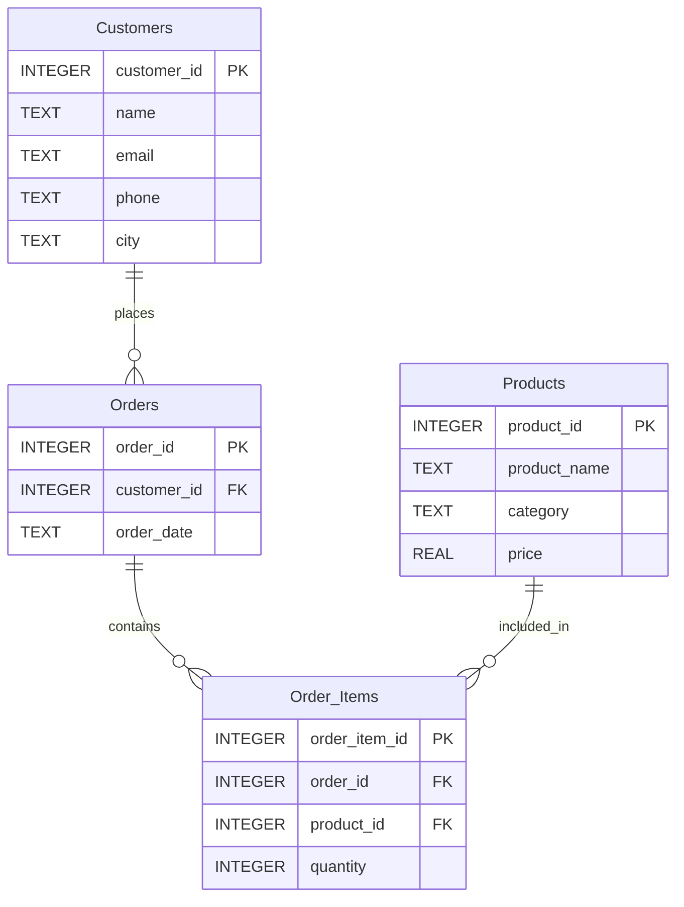

# 🗄️📊 Enhanced E‑Store Schema Guide

## 📌 Purpose

This document provides a **human‑readable technical reference** for the Enhanced E‑Store schema. It describes the tables, columns, relationships, and constraints that define the database implementation.

For the actual database file, refer to `level1_estore_apply.db`. For the business and conceptual understanding, refer to the **Enhanced E‑Store Blueprint**.

---

## 📊 Entity Relationship Diagram (ERD)



---

## 🗂️ Table Schemas

### `customers`

| Column | Type | Nullable | Description | Constraints |
|--------|------|----------|-------------|-------------|
| `customer_id` | INTEGER | No | Unique customer identifier | **PRIMARY KEY** |
| `name` | TEXT | No | Customer full name | NOT NULL |
| `email` | TEXT | Yes | Customer email address | – |
| `phone` | TEXT | Yes | Customer phone number | – |
| `city` | TEXT | No | Customer city of residence | NOT NULL |

---

### `products`

| Column | Type | Nullable | Description | Constraints |
|--------|------|----------|-------------|-------------|
| `product_id` | INTEGER | No | Unique product identifier | **PRIMARY KEY** |
| `product_name` | TEXT | No | Product display name | NOT NULL |
| `category` | TEXT | No | Product category (Electronics, Appliances, Books, Furniture) | NOT NULL |
| `price` | REAL | No | Product price in USD | NOT NULL, `price >= 0` |

---

### `orders`

| Column | Type | Nullable | Description | Constraints |
|--------|------|----------|-------------|-------------|
| `order_id` | INTEGER | No | Unique order identifier | **PRIMARY KEY** |
| `customer_id` | INTEGER | No | Customer who placed the order | **FOREIGN KEY** → `customers(customer_id)` |
| `order_date` | TEXT | No | Order date in `YYYY-MM-DD` format | NOT NULL |

---

### `order_items`

| Column | Type | Nullable | Description | Constraints |
|--------|------|----------|-------------|-------------|
| `order_item_id` | INTEGER | No | Unique line item identifier | **PRIMARY KEY** |
| `order_id` | INTEGER | No | Order containing this item | **FOREIGN KEY** → `orders(order_id)` |
| `product_id` | INTEGER | No | Product being purchased | **FOREIGN KEY** → `products(product_id)` |
| `quantity` | INTEGER | No | Number of units purchased | NOT NULL, `quantity > 0` |

---

## 🔗 Key Relationships (Technical)

| Relationship | Cardinality | Foreign Key |
|--------------|-------------|-------------|
| `customers` → `orders` | One‑to‑Many | `orders.customer_id` → `customers.customer_id` |
| `orders` → `order_items` | One‑to‑Many | `order_items.order_id` → `orders.order_id` |
| `products` → `order_items` | One‑to‑Many | `order_items.product_id` → `products.product_id` |

---

## 🚶‍♂️ Data Flow Walkthrough: From Click to Delivery

### 🧭 Futuristic Life Cycle

Let's walk step‑by‑step through **The Life of a Transaction** in an E-Store universe 🛒, tracing how a customer's actions translate into database records from the initial click to final delivery. This walkthrough **envisions** the Life cycle of the transaction beyond Level 1.

---

### 1. Browsing & Carting 🛒

- **Action:** Maya browses laptops, adds an ultrabook to her shopping cart, and applies a discount code.
- **Data Impact:**
  - The `products` table is queried for stock availability (`stock_quantity > 0`).
  - A new row is created in `cart_items`, linking `user_id` and `product_id` with a specific `quantity`.

---

### 2. Checkout & Payment Authorization 💳

- **Action:** Maya clicks **"Place Order."** Her payment method is authorized via a payment gateway.
- **Data Impact:**
  - An `orders` record is created with `status = 'Pending'` and a unique `order_id`.
  - Details are copied into `order_items` (locking in product price at purchase time).
  - A record in `payments` is created (`payment_status = 'Authorized'`).

---

### 3. Order Confirmation & Inventory Deduction 📦

- **Action:** The payment clears successfully. The system updates order status and reserves inventory.
- **Data Impact:**
  - `orders.status` updates to `'Processing'`.
  - `payments.payment_status` updates to `'Captured'`.
  - `products.stock_quantity` is decremented to prevent overselling.
  - Items are cleared from `cart_items`.

---

### 4. Fulfillment & Shipping 🚚

- **Action:** The warehouse packs the laptop, attaches a shipping label, and hands it to a carrier.
- **Data Impact:**
  - A new row in `shipments` is generated with a `tracking_number`, `carrier_name`, and `shipped_date`.
  - `orders.status` updates to `'Shipped'`.

---

### 5. Delivery & Post‑Purchase Review ⭐

- **Action:** The package arrives at Maya's doorstep, and she leaves a 5‑star rating.
- **Data Impact:**
  - `shipments.delivery_status` updates to `'Delivered'`.
  - `orders.status` updates to `'Completed'`.
  - A new record is added to the `reviews` table (`rating = 5`, `user_id`, `product_id`).

---

### 🧠 Future Expansion Note

The following tables are introduced in the walkthrough but are not part of the current Level 1 schema. They will be added in **Level 2** of SQLVerse:

| Table | Purpose |
|-------|---------|
| `cart_items` | Temporary storage of items before checkout |
| `payments` | Authorisation, capture, and settlement tracking |
| `shipments` | Order fulfilment and delivery status |
| `reviews` | Post‑purchase feedback and ratings |

---

## 🧠 Database Perspective on Key Business Cases

The following case studies are described from a business perspective in the **Enhanced E‑Store Blueprint**. Here, we examine the **technical implementation** required to support each business question, along with production considerations.

---

### 📊 Case Study 1 – The Universal Challenge of Missing Data

> 🎯 **A Note on Universality**

You may think `NULL` values don't need much time, thought, or real estate space in a schema guide. But look at the impact.

This case study is **not restricted to E‑Store, a single table, or a single column.** It applies to **every universe in the SQLVerse** — FinVERSE, Hospital Planet, Real Estate Planet, and beyond. Every table. Every column. Every domain.

The principles you learn here will guide you every time you encounter incomplete or missing data — regardless of the business context.

**This is a universal architectural lesson.**

---

#### The Dual Impact of NULL Values

`NULL` values in key columns like `email` and `phone` are not just data quality issues — they are **business and operational signals**.

---

**💼 Business Perspective**

- **Revenue Impact:** Customers without email addresses are unreachable for marketing campaigns, promotional offers, and order confirmations. Every `NULL` email is a potential missed revenue opportunity.
- **Customer Experience:** Missing phone numbers delay support resolution and order delivery notifications, eroding trust.
- **Retention Risk:** Incomplete profiles often indicate casual or unverified users — a segment with higher churn risk.

---

**🌐 Real-World Scenarios**

- **Guest Checkout:** A customer places an order without creating an account. The email is captured, but the phone may be optional.
- **Referral Onboarding:** A customer is referred by a friend and registers with minimal details. The phone may be added later.
- **Privacy‑Conscious Users:** Some customers deliberately omit contact details, expecting alternative communication channels.

---

**⚙️ Database Perspective**

- **Performance Impact:** `NULL` values affect indexing, query optimization, and storage efficiency. Queries filtering on `email` or `phone` may perform differently depending on `NULL` distribution.
- **Analytics Distortion:** Aggregations (`COUNT`, `AVG`) that ignore `NULL`s can produce misleading business metrics.
- **Application Logic:** Applications must handle `NULL`s gracefully — a `NULL` email should not break the checkout flow.

---

**🏛️ Architectural Insight: Why NULLs Cannot Always Be Eliminated at the Database Level**

Not all validations belong at the database level. For `email` and `phone`, `NOT NULL` constraints are often **too restrictive** because:

1. **Business Flexibility:** Customers may not have an email or phone at the time of registration (e.g., guest checkout, in‑store sign‑up).
2. **Data Entry Timing:** Contact details are often added in subsequent steps (e.g., order confirmation, profile completion).
3. **Privacy Regulations:** Some customers may choose not to provide certain contact details.

**The Artisan's Approach:** Validate at the **application layer** where business rules apply. Use database constraints only for **immutable business invariants** — like `customer_id` or `order_id`.

---

| Element | Technical Implementation |
|---------|--------------------------|
| **Business Question** | Which customers have missing contact details? |
| **Tables Involved** | `customers` |
| **Key Columns** | `email`, `phone` |
| **Core Logic** | `WHERE email IS NULL OR phone IS NULL` |
| **Sample SQL** | `SELECT customer_id, name, email, phone FROM customers WHERE email IS NULL OR phone IS NULL;` |
| **Production Note** | Combine with `status` (if available) to exclude inactive or archived customers. Consider adding `deleted_at` for soft‑deleted records. |

---

> 💡 **SQL Connection**
>
> - **Where SQL is used:** Queries targeting `customers` with missing contact details (`email IS NULL OR phone IS NULL`) identify records requiring cleanup.
> - **Why SQL is suitable:** SQL efficiently filters, isolates, and aggregates incomplete customer records, enabling targeted data remediation efforts.
> - **Roadmap reference:** This filtering technique was introduced in **Module 2 of ACQUIRE** and will be applied to production‑grade data quality pipelines in **Module 4 of ACCELERATE**.

---

### Case Study 2 – Category Performance Review

| Element | Technical Implementation |
|---------|--------------------------|
| **Business Question** | Which categories drive revenue and volume? Does price correlate with volume? Do discounts increase total revenue? |
| **Tables Involved** | `products`, `order_items`, `orders` |
| **Key Columns** | `category`, `quantity`, `price`, `order_date` |
| **Core Logic** | `JOIN` products → order_items → orders; `GROUP BY category`; `SUM(quantity * price)` as revenue; `SUM(quantity)` as volume; `AVG(price)` as average price. |
| **Sample SQL** | `SELECT p.category, SUM(oi.quantity) AS total_units_sold, SUM(oi.quantity * p.price) AS total_revenue, AVG(p.price) AS avg_price FROM order_items oi JOIN products p ON oi.product_id = p.product_id JOIN orders o ON oi.order_id = o.order_id WHERE o.order_date BETWEEN '2025-01-01' AND '2025-03-31' GROUP BY p.category ORDER BY total_revenue DESC;` |
| **Advanced Analysis** | Compare revenue and volume across price tiers—do lower prices drive enough volume to increase total revenue? |

---

**⚡ Production Awareness**

In production, category performance reviews must process large volumes of order data while customers continue placing orders. Unlike classroom datasets, enterprise systems must balance **analytical depth**, **reporting speed**, and **transaction performance**.

> 💡 **Architecture Insight**
>
> - **Read‑Replica Isolation:** Reporting queries are directed to read‑only database replicas to avoid locking transactional tables.
>
> - **Aggregate Tables:** Pre‑computed tables that store daily or monthly category performance metrics enable fast dashboard refreshes without scanning millions of raw order records.

> 💡 **SQL Connection**
>
> - **Where SQL is used:** Queries joining `products`, `order_items`, and `orders` with `GROUP BY category` and `SUM(quantity * price)` calculate revenue and volume by category.
> - **Why SQL is suitable:** SQL efficiently aggregates millions of order line‑items into business KPIs, enabling data‑driven inventory and pricing decisions.
> - **Roadmap reference:** Aggregation techniques (`SUM`, `GROUP BY`, `JOIN`)  introduced in **Module 3  of ACQUIRE**  will be applied to real‑time business reporting in **Module 4 of ACCELERATE**.

---

### Case Study 3 – Bulk Order Detection

| Element | Technical Implementation |
|---------|--------------------------|
| **Business Question** | Which orders are bulk purchases (quantity ≥ 5)? Why did a surge occur? |
| **Tables Involved** | `order_items`, `orders`, `customers` |
| **Key Columns** | `quantity`, `order_date`, `customer_id` |
| **Core Logic** | `WHERE quantity >= 5`; `JOIN` to identify customer details and order dates. |
| **Sample SQL** | `SELECT o.order_id, o.order_date, c.name AS customer_name, oi.product_id, oi.quantity, p.product_name FROM order_items oi JOIN orders o ON oi.order_id = o.order_id JOIN customers c ON o.customer_id = c.customer_id JOIN products p ON oi.product_id = p.product_id WHERE oi.quantity >= 5 ORDER BY o.order_date DESC;` |
| **Advanced Analysis** | Month‑over‑month comparison to detect surges. Correlate with feature releases, marketing campaigns, or seasonal trends. |

---

**⚡ Production Awareness**

In production, bulk order detection must identify unusual purchase patterns without slowing down the checkout experience. Unlike classroom datasets, enterprise systems must balance **real‑time detection**, **customer experience**, and **operational responsiveness**.

> 💡 **Architecture Insight**
>
> - **Partitioning:** The `order_items` table is often partitioned by date to keep queries fast. Monthly partitions allow the database to scan only the relevant chunk when filtering by `order_date`.
>
> - **Temporal Pattern Analysis:** Production systems track month‑over‑month bulk order percentages to detect surges that may indicate new features, marketing campaigns, or seasonal trends.

> 💡 **SQL Connection**
>
> - **Where SQL is used:** Queries filtering `order_items` by `quantity >= 5` and joining with `orders` and `customers` identify bulk purchase patterns.
> - **Why SQL is suitable:** SQL efficiently filters, groups, and compares transaction quantities to distinguish standard consumer behaviour from enterprise‑scale patterns.
> - **Roadmap reference:** You will master temporal pattern analysis and advanced filtering in **Level 2 of SQLVerse**.

---

## 🏗️ Enterprise Design Considerations

### Production Architecture Beyond Level 1

The current schema is designed for learning and exploration. For **production deployment** at scale, the following architectural enhancements are recommended. These will be introduced in **Level 2** and **Level 3** of the SQLVerse.

### 1. Soft Delete Pattern

Add a `deleted_at` column to `customers` and `orders` to enable logical deletion without losing historical data.

```sql
-- For future expansion
ALTER TABLE customers ADD COLUMN deleted_at TEXT;
ALTER TABLE orders ADD COLUMN deleted_at TEXT;
```

### 2. Audit Timestamps

Add `created_at` and `updated_at` columns to all tables for tracking record lifecycle.

```sql
-- For future expansion
ALTER TABLE customers ADD COLUMN created_at TEXT DEFAULT CURRENT_TIMESTAMP;
ALTER TABLE customers ADD COLUMN updated_at TEXT DEFAULT CURRENT_TIMESTAMP;
```

### 3. Composite Primary Key for Order Items

Use `(order_id, product_id)` as a composite primary key to enforce uniqueness and improve join performance.

```sql
-- For future expansion (alternative design)
-- PRIMARY KEY (order_id, product_id)
-- Remove order_item_id if not needed
```

### What is a Composite Primary Key?

A **composite primary key** is a primary key that consists of **two or more columns** combined to uniquely identify a row in a table. The combination of values across these columns must be unique for every row.

**Example:**
In an `order_items` table, the combination of `order_id` and `product_id` could serve as a composite primary key — because an order can include a specific product only once per line item.

```sql
-- Example of a composite primary key
CREATE TABLE order_items (
    order_id INTEGER,
    product_id INTEGER,
    quantity INTEGER,
    PRIMARY KEY (order_id, product_id)
);
```

---

### Why `order_id` Alone Does Not Guarantee Uniqueness

An `order_id` identifies a single order — but **an order can contain multiple items**. If we use only `order_id` as the primary key for `order_items`, we would be saying: "There can be only one row per order." That is not true — an order with three products would need three rows, all with the same `order_id`. The database would reject the second and third rows because the primary key would be duplicated.

| order_id | product_id | quantity |
|----------|------------|----------|
| 101      | 1          | 2        |
| 101      | 2          | 1        |
| 101      | 3          | 5        |

If `order_id` were the primary key, only the first row would be allowed — the other two would cause a primary key violation.

---

### The Natural Composite Key: `(order_id, product_id)`

In many e‑commerce schemas, `(order_id, product_id)` is used as a composite primary key because:

- Each product can appear only once per order (assuming no duplicate line items for the same product).
- The combination uniquely identifies a specific product within a specific order.

**However**, this design assumes that a customer cannot order the same product twice in the same order. In practice, that is often true, but not always — some systems allow multiple line items for the same product (e.g., different sizes or colours). In those cases, an additional column like `line_item_number` would be needed.

---

### The Surrogate Key Alternative: `order_item_id`

In the Enhanced E‑Store schema, we use a **surrogate key** — `order_item_id` — as the primary key instead of a composite key.

```sql
CREATE TABLE order_items (
    order_item_id INTEGER PRIMARY KEY,
    order_id INTEGER,
    product_id INTEGER,
    quantity INTEGER,
    FOREIGN KEY (order_id) REFERENCES orders(order_id),
    FOREIGN KEY (product_id) REFERENCES products(product_id)
);
```

**Why use a surrogate key?**

| Reason | Why |
|--------|-----|
| **Simplicity** | A single column `order_item_id` is easier to reference in joins, indexes, and application logic. |
| **Flexibility** | The table can accommodate multiple line items for the same `(order_id, product_id)` if needed (e.g., different sizes) without changing the primary key structure. |
| **Stability** | Business rules may change — a composite key based on `product_id` might break if the same product can appear twice. A surrogate key is immune to such changes. |
| **Performance** | A single‑column integer key is faster for indexing and joins than a multi‑column key. |

---

### When to Use a Composite Primary Key

Composite keys are useful when:

- The combination of columns is **naturally unique** and **meaningful** in the business domain (e.g., `(order_id, product_id)`).
- You want to **enforce uniqueness** at the database level without adding a surrogate key.
- You are working with **junction tables** for many‑to‑many relationships (e.g., `(student_id, course_id)`).

**However**, surrogate keys are often preferred in production systems for the reasons listed above. The Enhanced E‑Store uses a surrogate key — `order_item_id` — to keep the schema simple, flexible, and performant.

---

### Summary

| Key Type | Example | Uniqueness Guarantee |
|----------|---------|----------------------|
| **Surrogate** | `order_item_id` | Guaranteed by system‑generated identifier |
| **Natural Composite** | `(order_id, product_id)` | Guaranteed by business rule (one product per order) |
| **Single Column (Incorrect)** | `order_id` | ❌ Does **not** guarantee uniqueness — one order has many items |

**Architect's Takeaway:** Always choose a primary key that guarantees uniqueness for every row. `order_id` alone fails that test — which is why we use `order_item_id` in the Enhanced E‑Store schema.


### 4. Check Constraints

Enforce data integrity with business‑rule constraints.

```sql
-- For future expansion
ALTER TABLE products ADD CONSTRAINT price_positive CHECK (price >= 0);
ALTER TABLE order_items ADD CONSTRAINT quantity_positive CHECK (quantity > 0);
```

### 5. Indexing Strategy

Add indexes on frequently queried columns to improve performance.

| Table | Columns to Index | Purpose |
|-------|------------------|---------|
| `orders` | `customer_id` | Fast lookup of customer orders |
| `orders` | `order_date` | Date‑range filtering |
| `order_items` | `order_id` | Join with orders |
| `order_items` | `product_id` | Join with products |
| `products` | `category` | Category filtering |

---

## 🏛️ The Progression Is Complete

**Business first. Data model second. SQL third.**

Blueprint → Understand the Business.

Schema Guide → Understand the Data Model.

Now → AUGMENT and APPLY.

**The foundation is laid. The world is mapped. The work begins.**

---

*Part of our mission for 🎯 Quality Education for Anyone, Anywhere, Anytime — 💫 with Comfort, Convenience at no Cost.*

**SQLVerse | Enhanced E‑Store Schema Guide | Level 1 | ACCELERATE Phase**


