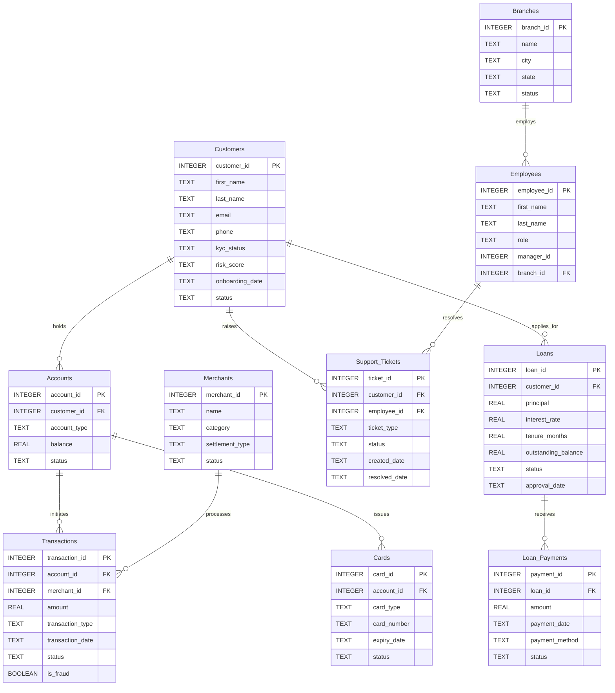

# 🗄️📊 FinVERSE Schema Guide

## 📌 Purpose

This document provides a **human‑readable technical reference** for the FinVERSE schema. It describes the tables, columns, relationships, and constraints that define the database implementation of the flagship enterprise universe.

For the actual database file, refer to `finverse.db`. For the business and conceptual understanding, refer to the **FinVERSE Blueprint**.

---

## 📊 Entity Relationship Diagram (ERD)



---

## 🗂️ Table Schemas

### `customers`

| Column | Type | Nullable | Description | Constraints |
|--------|------|----------|-------------|-------------|
| `customer_id` | INTEGER | No | Unique customer identifier | **PRIMARY KEY** |
| `first_name` | TEXT | No | Customer's first name | NOT NULL |
| `last_name` | TEXT | No | Customer's last name | NOT NULL |
| `email` | TEXT | Yes | Email address | – |
| `phone` | TEXT | Yes | Phone number | – |
| `kyc_status` | TEXT | No | `Pending`, `Verified`, `Rejected`, `Incomplete` | NOT NULL |
| `risk_score` | TEXT | No | `Low`, `Medium`, `High` | NOT NULL |
| `onboarding_date` | TEXT | No | Date the customer first registered | NOT NULL |
| `status` | TEXT | No | `Active`, `Inactive`, `Suspended`, `Closed` | NOT NULL |

---

### `accounts`

| Column | Type | Nullable | Description | Constraints |
|--------|------|----------|-------------|-------------|
| `account_id` | INTEGER | No | Unique account identifier | **PRIMARY KEY** |
| `customer_id` | INTEGER | No | Customer who owns the account | **FOREIGN KEY** → `customers(customer_id)` |
| `account_type` | TEXT | No | `Savings`, `Current`, `Salary`, `Joint` | NOT NULL |
| `balance` | REAL | No | Current account balance | NOT NULL, `balance >= 0` |
| `status` | TEXT | No | `Active`, `Dormant`, `Closed`, `Frozen` | NOT NULL |

---

### `transactions`

| Column | Type | Nullable | Description | Constraints |
|--------|------|----------|-------------|-------------|
| `transaction_id` | INTEGER | No | Unique transaction identifier | **PRIMARY KEY** |
| `account_id` | INTEGER | No | Account that initiated the transaction | **FOREIGN KEY** → `accounts(account_id)` |
| `merchant_id` | INTEGER | Yes | Merchant involved in the transaction | **FOREIGN KEY** → `merchants(merchant_id)` |
| `amount` | REAL | No | Transaction amount | NOT NULL, `amount >= 0` |
| `transaction_type` | TEXT | No | `Debit`, `Credit`, `Transfer`, `Payment` | NOT NULL |
| `transaction_date` | TEXT | No | Date and time of transaction | NOT NULL |
| `status` | TEXT | No | `Pending`, `Completed`, `Failed`, `Reversed` | NOT NULL |
| `is_fraud` | BOOLEAN | No | `TRUE` if flagged as fraudulent | NOT NULL, default `FALSE` |

---

### `cards`

| Column | Type | Nullable | Description | Constraints |
|--------|------|----------|-------------|-------------|
| `card_id` | INTEGER | No | Unique card identifier | **PRIMARY KEY** |
| `account_id` | INTEGER | No | Account linked to the card | **FOREIGN KEY** → `accounts(account_id)` |
| `card_type` | TEXT | No | `Debit`, `Credit`, `Prepaid` | NOT NULL |
| `card_number` | TEXT | No | Masked card number (e.g., `****1234`) | NOT NULL |
| `expiry_date` | TEXT | No | Card expiry date | NOT NULL |
| `status` | TEXT | No | `Active`, `Blocked`, `Expired`, `Lost` | NOT NULL |

---

### `loans`

| Column | Type | Nullable | Description | Constraints |
|--------|------|----------|-------------|-------------|
| `loan_id` | INTEGER | No | Unique loan identifier | **PRIMARY KEY** |
| `customer_id` | INTEGER | No | Customer who borrowed the loan | **FOREIGN KEY** → `customers(customer_id)` |
| `principal` | REAL | No | Original loan amount | NOT NULL, `principal > 0` |
| `interest_rate` | REAL | No | Annual interest rate | NOT NULL, `interest_rate >= 0` |
| `tenure_months` | INTEGER | No | Repayment period in months | NOT NULL, `tenure_months > 0` |
| `outstanding_balance` | REAL | No | Remaining balance to be repaid | NOT NULL, `outstanding_balance >= 0` |
| `status` | TEXT | No | `Active`, `Completed`, `Defaulted`, `Pending` | NOT NULL |
| `approval_date` | TEXT | No | Date the loan was approved | NOT NULL |

---

### `loan_payments`

| Column | Type | Nullable | Description | Constraints |
|--------|------|----------|-------------|-------------|
| `payment_id` | INTEGER | No | Unique payment identifier | **PRIMARY KEY** |
| `loan_id` | INTEGER | No | Loan being repaid | **FOREIGN KEY** → `loans(loan_id)` |
| `amount` | REAL | No | Payment amount | NOT NULL, `amount > 0` |
| `payment_date` | TEXT | No | Date of the payment | NOT NULL |
| `payment_method` | TEXT | No | `Bank Transfer`, `Card`, `Cash`, `UPI` | NOT NULL |
| `status` | TEXT | No | `Pending`, `Completed`, `Failed` | NOT NULL |

---

### `merchants`

| Column | Type | Nullable | Description | Constraints |
|--------|------|----------|-------------|-------------|
| `merchant_id` | INTEGER | No | Unique merchant identifier | **PRIMARY KEY** |
| `name` | TEXT | No | Merchant business name | NOT NULL |
| `category` | TEXT | No | `Retail`, `E-Commerce`, `Food`, `Travel`, `Utilities` | NOT NULL |
| `settlement_type` | TEXT | No | `Daily`, `Weekly`, `Monthly` | NOT NULL |
| `status` | TEXT | No | `Active`, `Suspended`, `Inactive` | NOT NULL |

---

### `support_tickets`

| Column | Type | Nullable | Description | Constraints |
|--------|------|----------|-------------|-------------|
| `ticket_id` | INTEGER | No | Unique ticket identifier | **PRIMARY KEY** |
| `customer_id` | INTEGER | No | Customer who raised the ticket | **FOREIGN KEY** → `customers(customer_id)` |
| `employee_id` | INTEGER | Yes | Employee assigned to resolve the ticket | **FOREIGN KEY** → `employees(employee_id)` |
| `ticket_type` | TEXT | No | `Account Issue`, `Card Issue`, `Transaction Dispute`, `Loan Query`, `Fraud Report` | NOT NULL |
| `status` | TEXT | No | `Open`, `In Progress`, `Resolved`, `Closed` | NOT NULL |
| `created_date` | TEXT | No | Date the ticket was raised | NOT NULL |
| `resolved_date` | TEXT | Yes | Date the ticket was resolved | – |

---

### `employees`

| Column | Type | Nullable | Description | Constraints |
|--------|------|----------|-------------|-------------|
| `employee_id` | INTEGER | No | Unique employee identifier | **PRIMARY KEY** |
| `first_name` | TEXT | No | Employee's first name | NOT NULL |
| `last_name` | TEXT | No | Employee's last name | NOT NULL |
| `role` | TEXT | No | `Support Agent`, `Credit Officer`, `Fraud Analyst`, `Relationship Manager`, `Branch Manager` | NOT NULL |
| `manager_id` | INTEGER | Yes | Employee's manager | **SELF-REFERENCE** → `employees(employee_id)` |
| `branch_id` | INTEGER | Yes | Branch where the employee works | **FOREIGN KEY** → `branches(branch_id)` |

---

### `branches`

| Column | Type | Nullable | Description | Constraints |
|--------|------|----------|-------------|-------------|
| `branch_id` | INTEGER | No | Unique branch identifier | **PRIMARY KEY** |
| `name` | TEXT | No | Branch name | NOT NULL |
| `city` | TEXT | No | City where the branch is located | NOT NULL |
| `state` | TEXT | No | State where the branch is located | NOT NULL |
| `status` | TEXT | No | `Active`, `Closed`, `Temporarily Closed` | NOT NULL |

---

## 🔗 Key Relationships (Technical)

| Relationship | Cardinality | Foreign Key |
|--------------|-------------|-------------|
| `customers` → `accounts` | One‑to‑Many | `accounts.customer_id` → `customers.customer_id` |
| `customers` → `loans` | One‑to‑Many | `loans.customer_id` → `customers.customer_id` |
| `customers` → `support_tickets` | One‑to‑Many | `support_tickets.customer_id` → `customers.customer_id` |
| `accounts` → `transactions` | One‑to‑Many | `transactions.account_id` → `accounts.account_id` |
| `accounts` → `cards` | One‑to‑Many | `cards.account_id` → `accounts.account_id` |
| `loans` → `loan_payments` | One‑to‑Many | `loan_payments.loan_id` → `loans.loan_id` |
| `merchants` → `transactions` | One‑to‑Many | `transactions.merchant_id` → `merchants.merchant_id` |
| `employees` → `support_tickets` | One‑to‑Many | `support_tickets.employee_id` → `employees.employee_id` |
| `employees` → `employees` | Self‑Join | `employees.manager_id` → `employees.employee_id` |
| `branches` → `employees` | One‑to‑Many | `employees.branch_id` → `branches.branch_id` |

---

### 🚶‍♂️ The Life of a Transaction: From Onboarding to Empowerment

This walkthrough traces Maya's journey through the FinVERSE ecosystem — from onboarding to financial empowerment. The first **five steps** use the **Level 1 schema** you already know. The final steps introduce **Level 2 and Level 3 expansions** that will unlock the full power of the platform.

---

### Phase 1: Foundation (Level 1)

#### 1. Onboarding & Identity Verification 🆔

- **Action:** Maya registers on FinVERSE, submits her personal details, and creates her profile.
- **Data Impact:**
  - A new record is created in `customers` with `kyc_status = 'Pending'`, `risk_score = 'Low'`, and `status = 'Active'`.
  - The system assigns a unique `customer_id` and links her to a home branch in the `branches` table.

---

#### 2. Account Provisioning & Initial Funding 🏦

- **Action:** Maya opens a Savings Account and transfers an initial deposit of $1,000.
- **Data Impact:**
  - A record is added to `accounts` (`account_type = 'Savings'`, `balance = 1000.00`, `status = 'Active'`).
  - A row is added to `transactions` (`transaction_type = 'Credit'`, `amount = 1000.00`, `status = 'Completed'`, `is_fraud = FALSE`).

---

#### 3. Real‑Time Card Payment 💳

- **Action:** Maya taps her FinVERSE debit card to buy an espresso for $5.25 at a local café.
- **Data Impact:**
  - `accounts.balance` decrements from `$1000.00` to `$994.75`.
  - A new row enters `transactions` (`merchant_id` referencing a merchant in the `merchants` table, `amount = -5.25`, `transaction_type = 'Payment'`, `status = 'Completed'`, `is_fraud = FALSE`).

---

#### 4. Car Loan Application & Approval 🚗

- **Action:** Maya applies for a car loan of $25,000. After thorough scrutiny, FinVERSE grants the loan at an interest rate of 9.0% with a tenure of 48 months.
- **Data Impact:**
  - A record is added to `loans` (`customer_id`, `principal = 25000.00`, `interest_rate = 9.0`, `tenure_months = 48`, `outstanding_balance = 25000.00`, `status = 'Active'`, `approval_date`).
  - `customers` may be updated to reflect the new credit exposure.

---

#### 5. First Loan Payment 📆

- **Action:** Maya makes her first monthly loan payment of $622.12 via UPI.
- **Data Impact:**
  - A row is added to `loan_payments` (`loan_id`, `amount = 622.12`, `payment_date`, `payment_method = 'UPI'`, `status = 'Completed'`).
  - `loans.outstanding_balance` decreases from `$25,000.00` to `$24,377.88`.

---

### Phase 2: Real‑Time Operations (Level 1 — Fraud Awareness)

#### 6. Transaction Monitoring & Fraud Flagging 🔍

- **Action:** The system monitors Maya's transaction for suspicious patterns. If flagged, `is_fraud` is set to `TRUE`.
- **Data Impact:**
  - The `transactions` table records `is_fraud = TRUE` for flagged transactions.
  - A support ticket may be raised in `support_tickets` for manual review. A fraud analyst reviews the flagged transaction through the support workflow, allowing human investigation before further action is taken.

---

### Phase 3: The Future FinVERSE Platform (Level 2 & Level 3)

#### 7. Advanced KYC & Compliance Verification 🛂 (Level 2)

- **Action:** Maya's identity is verified using advanced document checks and biometrics.
- **Data Impact:**
  - `customers.kyc_status` updates to `'Verified'`.
  - A new table, `compliance_checks`, logs the verification audit trail for regulatory purposes.

---

#### 8. Automated Fraud Signal Detection 🛡️ (Level 2)

- **Action:** The system runs a real‑time fraud signal check on every transaction.
- **Data Impact:**
  - A new table, `fraud_signals`, stores anomaly scores and risk indicators for each transaction.
  - High‑risk transactions trigger alerts in `support_tickets`.

---

#### 9. Active Equity Investment & Portfolio Diversification 📊 (Level 3)

- **Action:** Maya opens a Demat account within FinVERSE. She transfers a hefty amount and strategically buys a Gold ETF, a Debt Fund, and an Index Fund to build a diversified long‑term portfolio.
- **Data Impact:**
  - A new table, `investment_accounts`, records the Demat account details linked to Maya's `customer_id`.
  - A large debit is recorded in `transactions` and a corresponding credit in `investment_transactions`.
  - New rows are created in `portfolio_holdings` for each asset (`asset_symbol = 'GLD'`, `'BND'`, `'VOO'`, with `units_purchased` and `purchase_price`).

---

#### 10. Passive Round‑Up Auto‑Investment (The FinVERSE Edge) 📈 (Level 3)

- **Action:** FinVERSE automatically rounds up Maya's $5.25 coffee purchase to $6.00, transferring the $0.75 difference into her automated ETF index portfolio.
- **Data Impact:**
  - A micro‑ledger entry records the $0.75 debit from `accounts`.
  - A purchase order executes in `investment_orders`, creating or updating a row in `portfolio_holdings` (`asset_symbol = 'VOO'`, `units_added = 0.0016`).


---

### 🧠 Future Expansion Note

The following tables are introduced in the walkthrough but are not part of the current Level 1 schema. They represent the **architectural evolution** of **FinVERSE** as you progress through the **SQLVerse.**

| Table | Level | Purpose | Business Impact |
|-------|-------|---------|-----------------|
| `compliance_checks` | 2 | KYC verification audit trail | Enables regulatory compliance, audit readiness, and fraud investigation |
| `fraud_signals` | 2 | Real‑time anomaly detection | Protects customers and the bank from fraudulent activity |
| `investment_orders` | 3 | Automated investment execution | Enables micro‑investing and financial empowerment features |
| `portfolio_holdings` | 3 | Customer investment portfolio tracking | Provides real‑time portfolio visibility and performance analytics |

These expansions will be introduced in **Level 2** and **Level 3** of SQLVerse, where you will master:
- **Subqueries and CTEs** for compliance reporting
- **Window Functions** for fraud pattern detection
- **Stored Procedures and Triggers** for automated investments
- **Data Warehousing** for portfolio analytics

---

## 🧠 Database Perspective on Key Business Cases

The following case studies are described from a business perspective in the **FinVERSE Blueprint**. Here, we examine the **technical implementation** and **production architecture** required to support each business question.

---
### Case Study 1 – Revenue KPI Dashboard

| Element | Technical Implementation |
|---------|--------------------------|
| **Business Question** | What is the real‑time health of the digital banking platform? |
| **Tables Involved** | `transactions`, `accounts`, `cards`, `loans` |
| **Key Columns** | `amount`, `transaction_date`, `account_type`, `card_type`, `loan_status` |
| **Core Logic** | `SUM(amount)`, `COUNT(transactions)`, `GROUP BY account_type` |
| **Sample SQL** | `SELECT account_type, SUM(amount) AS total_transaction_value, COUNT(*) AS transaction_volume FROM transactions JOIN accounts ON transactions.account_id = accounts.account_id WHERE transaction_date >= DATE('now', '-30 days') GROUP BY account_type;` |

---

**⚡ Production Awareness**

In production, executive dashboards must refresh every five minutes while customers continue making payments, transfers, and purchases. Unlike classroom datasets, enterprise systems must balance **real‑time analytics**, **transaction performance**, and **system isolation**.

> 💡 **Architecture Insight**
>
> - **Event‑Driven Ingestion:** Transaction streams are processed asynchronously using message queues (e.g., Apache Kafka or AWS Kinesis) rather than direct queries against production databases. This prevents analytical workloads from slowing down customer‑facing services.
>
> - **Read‑Replica Isolation:** Reporting queries are directed to read‑only database replicas—synchronised copies of the primary database. This isolates analytical traffic from transactional writes, ensuring that dashboards don't lock core tables like `accounts` and `transactions`.
>
> - **Anomaly Alerting:** Dashboards include threshold‑based triggers (e.g., a 25% drop in hourly card transactions) that automatically notify site reliability engineers (SREs) and payment operations teams of potential gateway outages.

> 💡 **SQL Connection**
>
> - **Where SQL is used:** Aggregation queries (`SUM(amount)`, `COUNT(transactions)`, `GROUP BY account_type`) are directed to read replicas instead of the primary transaction database.
> - **Why SQL is suitable:** SQL efficiently aggregates millions of transactions into business KPIs, enabling real‑time reporting without slowing down live transaction processing.
> - **Roadmap reference:** You will apply these aggregation techniques to enterprise-scale reporting in Module 4 of ACCELERATE.

---

### Case Study 2 – Transaction Fraud Detection

| Element | Technical Implementation |
|---------|--------------------------|
| **Business Question** | Which transactions are suspicious and require investigation? |
| **Tables Involved** | `transactions`, `accounts`, `customers`, `merchants` |
| **Key Columns** | `is_fraud`, `amount`, `transaction_date`, `account_id`, `merchant_id` |
| **Core Logic** | `WHERE is_fraud = TRUE`; `GROUP BY account_id`, `merchant_id`; `COUNT(transactions)` for velocity checks |
| **Sample SQL** | `SELECT account_id, COUNT(*) AS tx_count, SUM(amount) AS total_amount FROM transactions WHERE is_fraud = TRUE AND transaction_date >= DATE('now', '-7 days') GROUP BY account_id HAVING COUNT(*) > 3 ORDER BY total_amount DESC;` |

---

**⚡ Production Awareness**

In production, fraud detection must occur within seconds or minutes of a suspicious event. Unlike classroom datasets, enterprise systems must balance **low‑latency scoring**, **anomaly accuracy**, and **customer experience**.

> 💡 **Architecture Insight**
>
> - **Low‑Latency Scoring:** Fraud detection runs in under 100 milliseconds during transaction authorisation. This requires lightweight machine learning models or high‑speed rules engines deployed close to the payment gateway.
>
> - **Real‑Time Feature Stores:** Detecting spatial/temporal anomalies (e.g., a card used in New York and London within 10 minutes) requires ultra‑fast lookup stores (such as Redis) to track short‑term user behaviour flags alongside long‑term history.
>
> - **Asynchronous Escalation:** Suspicious transactions flagged above a secondary threshold trigger asynchronous events—notifying the customer via push notification or placing the ticket into a fraud analyst queue without blocking the primary database.

> 💡 **SQL Connection**
>
> - **Where SQL is used:** Fraud detection queries (`WHERE is_fraud = 1`, `COUNT(transactions) GROUP BY merchant`, `AVG(amount) OVER(PARTITION BY customer)`) run against partitioned tables to keep scans fast and near real‑time.
> - **Why SQL is suitable:** SQL efficiently filters, groups, and compares transactional patterns to identify suspicious behaviour across millions of transactions.
> - **Roadmap reference:** You will master window functions and advanced filtering in Level 2 of SQLVerse.

---

### Case Study 3 – Loan Portfolio Risk Analysis

| Element | Technical Implementation |
|---------|--------------------------|
| **Business Question** | Which loans are at risk of default, and what is the overall portfolio health? |
| **Tables Involved** | `loans`, `loan_payments`, `customers` |
| **Key Columns** | `status`, `outstanding_balance`, `interest_rate`, `principal`, `payment_date` |
| **Core Logic** | `SUM(outstanding_balance) GROUP BY status`, `AVG(interest_rate) GROUP BY risk_tier`, `COUNT(loans) WHERE status = 'Defaulted'` |
| **Sample SQL** | `SELECT status, COUNT(*) AS loan_count, SUM(outstanding_balance) AS total_outstanding FROM loans GROUP BY status ORDER BY total_outstanding DESC;` |

---

**⚡ Production Awareness**

In production, loan portfolio analysis involves large historical datasets and complex calculations. Unlike classroom datasets, enterprise systems must balance **batch processing**, **computational cost**, and **reporting responsiveness**.

> 💡 **Architecture Insight**
>
> - **Batch Processing:** Loan portfolio risk calculations rely on overnight batch processing of daily loan payment settlements, amortisation schedule updates, and interest accruals. This allows the system to process heavy aggregations without impacting daytime banking operations.
>
> - **Analytical Warehouse Offloading:** Complex risk calculations (like multi‑year loan loss provisions and vintage analysis) involve heavy historical aggregations across `loans`, `loan_payments`, and `customers`. These are executed on a dedicated data warehouse (e.g., Snowflake, BigQuery) rather than the operational transaction database.
>
> - **Async Credit Scoring Pipelines:** Re‑evaluating customer risk profiles using external credit bureau feeds runs asynchronously via background workers, updating risk ratings without impacting core banking availability.

> 💡 **SQL Connection**
>
> - **Where SQL is used:** Portfolio analysis queries (`SUM(outstanding_balance) GROUP BY status`, `AVG(interest_rate) GROUP BY risk_tier`, `COUNT(loans) WHERE status = 'Defaulted'`) run against materialised views to keep executive dashboards fast and responsive.
> - **Why SQL is suitable:** SQL efficiently summarises large loan portfolios into meaningful risk metrics, enabling proactive credit risk management.
> - **Roadmap reference:** You will master materialised views and advanced aggregation in Level 3 of SQLVerse.
---

## 🏗️ Enterprise Design Considerations

### Production Architecture Beyond Level 1

The current schema is designed for learning and exploration. For **production deployment** at scale, the following architectural enhancements are recommended. These will be introduced in **Level 2** and **Level 3** of the SQLVerse.

### 1. Soft Delete Pattern

Add `deleted_at` columns to `customers` and `accounts` to enable logical deletion without losing historical data.

```sql
-- For future expansion
ALTER TABLE customers ADD COLUMN deleted_at TEXT;
ALTER TABLE accounts ADD COLUMN deleted_at TEXT;
```

### 2. Audit Timestamps

Add `created_at` and `updated_at` columns to all tables for tracking record lifecycle.

```sql
-- For future expansion
ALTER TABLE customers ADD COLUMN created_at TEXT DEFAULT CURRENT_TIMESTAMP;
ALTER TABLE customers ADD COLUMN updated_at TEXT DEFAULT CURRENT_TIMESTAMP;
```

### 3.  Key Design Philosophy: Natural vs. Surrogate Keys

In production database design, a recurring architectural decision is whether to use:

- **Natural Keys** – Columns that have business meaning (e.g., `customer_id`, `loan_id`).
- **Surrogate Keys** – System‑generated identifiers with no business meaning (e.g., `payment_id`).

For `loan_payments`, `payment_id` is a **surrogate key** — it uniquely identifies each payment record. This is the recommended approach because it:

- Isolates the database from changes in business rules.
- Simplifies joins and indexing.
- Ensures uniqueness even if business identifiers change.

For performance, consider adding an **index on `loan_id`** to speed up queries that retrieve all payments for a specific loan.

```sql
-- For future expansion
CREATE INDEX idx_loan_payments_loan_id ON loan_payments(loan_id);
```

> 💡 **Production Insight:** Surrogate keys are the industry standard in most transactional systems. Natural keys are useful for reference data (e.g., country codes, product SKUs) but can become problematic when business rules evolve.

### 4. Check Constraints

Enforce data integrity with business‑rule constraints.

```sql
-- For future expansion
ALTER TABLE accounts ADD CONSTRAINT balance_positive CHECK (balance >= 0);
ALTER TABLE transactions ADD CONSTRAINT amount_positive CHECK (amount >= 0);
ALTER TABLE loans ADD CONSTRAINT principal_positive CHECK (principal > 0);
```

### 5. Indexing Strategy

Add indexes on frequently queried columns to improve performance. Indexes improve read performance but introduce additional storage overhead and increase the cost of INSERT, UPDATE, and DELETE operations. Production systems index selectively based on workload rather than indexing every column.

| Table | Columns to Index | Purpose |
|-------|------------------|---------|
| `transactions` | `account_id` | Fast lookup of account transactions |
| `transactions` | `transaction_date` | Date‑range filtering |
| `transactions` | `is_fraud` | Fraud flag filtering |
| `loans` | `customer_id` | Fast lookup of customer loans |
| `loans` | `status` | Active/defaulted loan filtering |
| `support_tickets` | `status` | Open tickets filtering |
| `support_tickets` | `created_date` | Date‑range filtering |
| `employees` | `branch_id` | Branch‑based reporting |
| `employees` | `manager_id` | Self‑join performance |


### 6. Partitioning Strategy (High‑Volume Tables)

For tables like `transactions` that grow rapidly, implement **partitioning** by `transaction_date` (e.g., monthly partitions) to keep queries fast and maintenance manageable.

```sql
-- For future expansion
-- Example: Monthly partitions for transactions
CREATE TABLE transactions_2025_01 PARTITION OF transactions FOR VALUES FROM ('2025-01-01') TO ('2025-02-01');
```

> 💡 **Production Insight:** Partitioning is a powerful technique for managing large tables within a single database. True **horizontal sharding** (distributing data across multiple databases) is a more advanced scaling strategy that will be introduced in **Level 3**.

| Aspect | Partitioning | Sharding |
|--------|--------------|----------|
| **Scope** | Single database | Multiple databases |
| **Purpose** | Performance & manageability | Horizontal scaling |
| **Complexity** | Low to Moderate | High |
| **Level Introduced** | Level 2 | Level 3 |
| **Example** | Monthly partitions of `transactions` | Distributing customer data across regional databases |

---

## 🏛️ The Progression Is Complete

**Business first. Data model second. SQL third.**

Blueprint → Understand the Business.

Schema Guide → Understand the Data Model.

Now → AUGMENT and APPLY.

**The foundation is laid. The world is mapped. The work begins.**

---

*Part of our mission for 🎯 Quality Education for Anyone, Anywhere, Anytime — 💫 with Comfort, Convenience at no Cost.*

**SQLVerse | FinVERSE Schema Guide | Level 1 | ACCELERATE Phase**