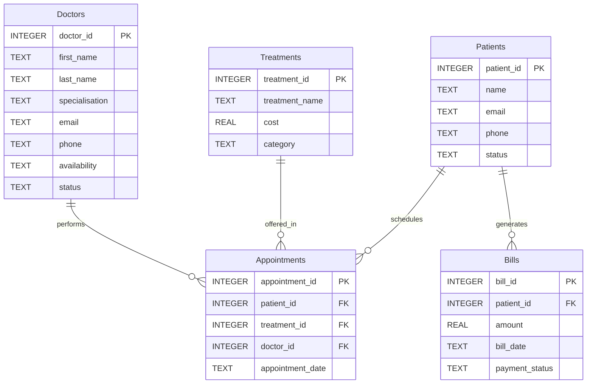

# 🗄️📊 Hospital Planet Schema Guide

## 🏛️ From Blueprint to Schema Guide

In the **Hospital Planet Blueprint**, we made a deliberate choice:

> *"The Doctor is respected, not represented. The Doctor is not excluded — they are exclusive."*

That was a philosophical statement. It honoured the sacred bond between Doctor and patient.

Now we enter the **Schema Guide**. Here, our responsibility is different.

Every production **Hospital Information System (HIS)** requires a **Doctors table**. Respecting the profession and modelling the data are two different responsibilities.

The Blueprint honoured the profession. 

The Schema Guide designs the system.

---

> **SQLVerse Acknowledgment**
>
> SQLVerse recognises the invaluable contribution of Doctors to humanity. Behind every consultation, diagnosis, surgery, and emergency response lies years of dedication, skill, and compassion.
>
>Many Doctors willingly sacrifice evenings, weekends, holidays, and personal time to care for patients when they are needed most.
>
> SQLVerse respects Doctors.
> 
> SQLVerse celebrates Doctors' dedication.
> 
> SQLVerse honours Doctors.

---

## 📌 Purpose

This document provides a **human‑readable technical reference** for the Hospital Planet schema. It describes the tables, columns, relationships, and constraints that define the database implementation of the healthcare universe.

For the actual database file, refer to `hospital_planet.db`. For the business and conceptual understanding, refer to the **Hospital Planet Blueprint**.

---

## 📊 Entity Relationship Diagram (ERD)



---

## 🗂️ Table Schemas

### 📌 A Note on the Doctors Table

The Blueprint deliberately chose not to model Doctors as a business entity.

The Schema Guide now introduces the **Doctors entity** and its underlying Doctors table because a production **HIS** cannot function without uniquely identifying practitioners, scheduling appointments, recording clinical responsibility, and maintaining regulatory compliance.

The **Doctor** is the **clinical centre** of Hospital Planet. The Doctors table provides the structural foundation that enables the **HIS** to represent that reality.

Respect for the profession remains unchanged.

Only the lens has changed.

**The Blueprint explained *why* the hospital exists. The Schema Guide explains *how* the information system supports it.**

---

### `doctors`

| Column | Type | Nullable | Description | Constraints |
|--------|------|----------|-------------|-------------|
| `doctor_id` | INTEGER | No | Unique doctor identifier | **PRIMARY KEY** |
| `first_name` | TEXT | No | Doctor's first name | NOT NULL |
| `last_name` | TEXT | No | Doctor's last name | NOT NULL |
| `specialisation` | TEXT | No | Clinical specialisation | NOT NULL |
| `email` | TEXT | Yes | Contact email | – |
| `phone` | TEXT | Yes | Contact phone | – |
| `availability` | TEXT | Yes | Availability pattern (e.g., `Mon-Fri 9-5`) | – |
| `status` | TEXT | No | `Active`, `On Leave`, `Retired` | NOT NULL, default `'Active'` |

---

### `patients`

| Column | Type | Nullable | Description | Constraints |
|--------|------|----------|-------------|-------------|
| `patient_id` | INTEGER | No | Unique patient identifier | **PRIMARY KEY** |
| `name` | TEXT | No | Patient full name | NOT NULL |
| `email` | TEXT | **Yes** | Patient email address | – |
| `phone` | TEXT | Yes | Patient phone number | – |
| `status` | TEXT | No | `Active`, `Inactive`, `Admitted`, `Discharged` | NOT NULL, default `'Active'` |

### Status List

| Status | Meaning |
|--------|---------|
| **Active** | Patient is registered and receiving care |
| **Inactive** | Patient is not currently active in the system |
| **Admitted** | Patient is admitted to the hospital |
| **Discharged** | Patient has been discharged after bill settlement |

> 🏛️ **Architect's Note: Capturing Contact Information**
>
> In real‑world healthcare, not every patient can provide their own contact details. An unconscious patient, a trauma victim, or a disoriented elderly person may not be able to speak.
>
> At minimum, the system should capture the contact number of the person admitting the patient — a family member, caregiver, or emergency contact. This ensures that critical communications (test results, appointment changes, discharge instructions) reach someone who can act on the patient's behalf.
>
> In production systems, this is often stored in a separate `emergency_contacts` table. For Level 1, we keep the schema simple by storing the primary contact number in `phone`. The distinction between patient contact and emergency contact will be introduced in **Level 2**.

---

### `treatments`

| Column | Type | Nullable | Description | Constraints |
|--------|------|----------|-------------|-------------|
| `treatment_id` | INTEGER | No | Unique treatment identifier | **PRIMARY KEY** |
| `treatment_name` | TEXT | No | Name of the medical service | NOT NULL |
| `cost` | REAL | No | Cost of the treatment | NOT NULL, `cost >= 0` |
| `category` | TEXT | No | Clinical department — `Primary Care`, `Diagnostic`, `Surgical`, `Rehabilitation`, `Pharmacy`, `Preventative`, `Cardiology`, `Neurology`, `Surgery` | NOT NULL |

---

### `appointments` 

| Column | Type | Nullable | Description | Constraints |
|--------|------|----------|-------------|-------------|
| `appointment_id` | INTEGER | No | Unique appointment identifier | **PRIMARY KEY** |
| `patient_id` | INTEGER | No | Patient who booked the appointment | **FOREIGN KEY** → `patients(patient_id)` |
| `treatment_id` | INTEGER | Yes | Treatment performed during the appointment | **FOREIGN KEY** → `treatments(treatment_id)` |
| `doctor_id` | INTEGER | No | Doctor performing the appointment | **FOREIGN KEY** → `doctors(doctor_id)` |
| `appointment_date` | TEXT | No | Appointment date in `YYYY-MM-DD` format | NOT NULL |

---

### `bills`

| Column | Type | Nullable | Description | Constraints |
|--------|------|----------|-------------|-------------|
| `bill_id` | INTEGER | No | Unique bill identifier | **PRIMARY KEY** |
| `patient_id` | INTEGER | No | Patient who was billed | **FOREIGN KEY** → `patients(patient_id)` |
| `amount` | REAL | No | Bill amount | NOT NULL, `amount >= 0` |
| `bill_date` | TEXT | No | Bill date in `YYYY-MM-DD` format | NOT NULL |
| `payment_status` | TEXT | No | `Pending`, `Paid`, `Insurance Pending` | NOT NULL, default `'Pending'` |

---

## 🔗 Key Relationships (Technical)

| Relationship | Cardinality | Foreign Key |
|--------------|-------------|-------------|
| `patients` → `appointments` | One‑to‑Many | `appointments.patient_id` → `patients.patient_id` |
| `doctors` → `appointments` | One‑to‑Many | `appointments.doctor_id` → `doctors.doctor_id` |
| `treatments` → `appointments` | One‑to‑Many | `appointments.treatment_id` → `treatments.treatment_id` |
| `patients` → `bills` | One‑to‑Many | `bills.patient_id` → `patients.patient_id` |

---

## 🚶‍♂️ Data Flow Walkthroughs: Three Journeys, One Hospital

The Blueprint traced three patient journeys. Here, we examine how those journeys are **implemented** in the database.

---

### 🚶‍♂️ Walkthrough: The Outpatient Journey (Architecture‑Oriented)

Let's follow **John Smith** through a classic outpatient encounter — a visit where the patient receives care and goes home the same day without being admitted to the hospital.

---

**1. Patient Arrival & Verification** 👤

John arrives for a routine checkup. The receptionist looks up his record in the `patients` table using his name or ID. His status is confirmed as `status = 'Active'`.

---

**2. Selecting the Service** 🩺

The clinic selects the primary care service from the `treatments` table:
- `treatment_name`: 'General Checkup'
- `category`: 'Primary Care'
- `cost`: $120.00

---

**3. Logging the Encounter** 📅

A new row is inserted into `appointments`, establishing a foreign key link between John (`patient_id = 1`), the service (`treatment_id = 1`), and the attending doctor (`doctor_id = 4` — Dr. Ananya Iyer) for that specific date.

Just as Dr. Ananya completes John's consultation, an emergency alert flashes across the hospital system. An accident victim has been rushed into the emergency department. Dr. Ananya is urgently called away to attend to the victim. All her remaining appointments for the day are cancelled and rescheduled.

An automated **SMS alert** is triggered, notifying all affected patients that their appointments have been cancelled and will be rescheduled.

> 🏛️ **Critical Note: Emergency Contingency**
> In these types of emergency situations, if all the doctors in the hospital are occupied with surgeries, hospital management may engage qualified doctors from partner hospitals to attend to the emergency. These operational capabilities—including emergency triage, appointment rescheduling, SMS notifications, and external doctor availability—are introduced in **Level 2** of SQLVerse.

---

**4. Same-Day Billing & Discharge** 💳

Because John is an outpatient, he completes his visit and leaves. The system generates a charge in the `bills` table, linking `patient_id = 1` with an `amount` of $120.00. Notice that his status in `patients` remains `'Active'` (unlike an inpatient who would be marked `'Admitted'`).

---

### 🚶‍♂️ Walkthrough: The Clinical Care Journey (Architecture‑Oriented)

Let's follow **Indra** through a **critical care encounter** 🏥—where a visit  for a routine checkup reveals a life‑threatening condition, leading to immediate admission, surgery, long recovery and discharge.

---

**1. The First Contact (Outpatient Consultation)** 👩‍⚕️

Indra visits the hospital for a routine cardiology checkup. The receptionist registers her details and creates a patient record. The system assigns a unique `patient_id` and writes a new row into the `patients` table with `status = 'Active'`. The hospital now knows who Indra is.

---

**2. The Clinical Encounter** 🩺

Dr. Sharma reviews Indra's medical history and notices an irregularity. He advises an immediate stress test. The system creates an `appointments` record, linking Indra to the cardiology department, the specific treatment, and Dr. Sharma.

---

**3. The Diagnostic Truth** 🔬

The stress test reveals a critical blockage. Dr. Sharma advises immediate admission. The system updates Indra's `status` from `'Active'` to `'Admitted'`. A digital health record is now active — tracking every intervention, every test, every decision.

---
**4. The Intervention (Procedure)** 🏥

Dr. Vikram Singh (doctor_id = 3) performs the surgery. Indra undergoes a successful procedure. The system records the treatment details in the `treatments` table, linking the procedure to Indra's patient record. Every clinical action is now traceable.

---

**5. Billing & Insurance Processing** 💳

The finance department generates a comprehensive bill covering the consultation, tests, and procedure. The bill is submitted to Indra's insurance provider for processing. The system records the total `amount` in the `bills` table, with a placeholder for insurance claim tracking.

> 🧠 **Future Expansion (Level 2 & 3):** Insurance claims, coverage verification, claim denials, and reimbursement tracking will be introduced in **Level 2** and **Level 3** of SQLVerse.

---
**6. Discharge** ✅

Once the insurance claim is processed and the bill is settled, Indra is formally discharged. Her `status` updates to `'Discharged'`.

---
### 🧠 Future Expansion Note

The following concepts are introduced in the walkthrough but are not part of the current Level 1 schema. They will be added in **Level 2** and **Level 3** of SQLVerse.

| Concept | Level | Description |
|---------|-------|-------------|
| **Emergency Triage** | 2 | Dynamic appointment cancellation, rescheduling, and prioritisation |
| **Insurance Claims** | 2 | Claim submission, coverage verification, and denial tracking |
| **SMS Alerts** | 2 | Automated notification to patients when appointments are cancelled due to emergencies |
| **External Doctor Availability** | 2 | A dedicated table listing external doctors, their specialisation, availability and contact details |
| **Reimbursement Tracking** | 3 | Payment reconciliation, insurance settlement, and patient co‑payments |

---

### 🚶‍♀️ Walkthrough: The Diagnostic Care Journey (Architecture‑Oriented)

Let's follow **Sarah** through a diagnostic care encounter — where a doctor from another hospital has referred her for a specific clinical test.

---

**1. Patient Registration** 👤

- **Action:** Sarah checks in for her diagnostic procedure.
- **Data Impact:**
  - A new row is inserted into `patients` with `status = 'Active'`.

---

**2. Selecting the Diagnostic Service** 🩺

- **Action:** The hospital selects the MRI service from the `treatments` table.
- **Data Impact:**
  - The `treatments` table is queried for `treatment_name = 'MRI Scan'`.

---

**3. Booking the Encounter** 📅

- **Action:** An appointment is scheduled. Dr. Karthik Nair (`doctor_id = 5`) is assigned to supervise the diagnostic procedure.
- **Data Impact:**
  - A new row is inserted into `appointments` linking Sarah to the MRI treatment.

---

**4. Diagnostic Procedure & Billing** 💳

- **Action:** Sarah undergoes the MRI. The system generates a charge.
- **Data Impact:**
  - A new row is inserted into `bills` with the final amount.
  - Sarah's `status` remains `'Active'` (no admission).

---

## 🧠 Database Perspective on Key Business Cases

The following case studies are described from a business perspective in the **Hospital Planet Blueprint**. Here, we examine the **technical implementation** and **production architecture** required to support each business question.

---

### Case Study 1 – Patient Volume by Department

| Element | Technical Implementation |
|---------|--------------------------|
| **Business Question** | Which departments are busiest? |
| **Tables Involved** | `appointments`, `treatments` |
| **Key Columns** | `category` (from `treatments`), `appointment_date` |
| **Core Logic** | `JOIN` appointments → treatments; `GROUP BY category`; `COUNT(appointment_id)` |
| **Sample SQL** | `SELECT t.category, COUNT(a.appointment_id) AS patient_volume FROM appointments a JOIN treatments t ON a.treatment_id = t.treatment_id GROUP BY t.category ORDER BY patient_volume DESC;` |

---

**⚡ Production Awareness**

In production, patient volume analysis must process large appointment datasets while clinical operations continue. Unlike classroom datasets, enterprise systems must balance **analytical depth**, **real‑time visibility**, and **clinical workflow performance**.

> 💡 **Architecture Insight**
>
> - **Date‑Partitioned Tables:** The `appointments` table is often partitioned by date to keep queries fast. Monthly partitions allow the database to scan only the relevant chunk when filtering by `appointment_date`.
>
> - **Aggregate Tables:** Pre‑computed tables that store daily or weekly patient volumes enable fast dashboard refreshes without scanning millions of raw appointment records.

> 💡 **SQL Connection**
>
> - **Where SQL is used:** Queries grouping appointments by `category` and `appointment_date` with `COUNT(patient_id)` calculate patient volume by department over time.
> - **Why SQL is suitable:** SQL efficiently aggregates appointment data into departmental volumes, enabling data‑driven staffing and capacity decisions.
> - **Roadmap reference:** Aggregation techniques (`COUNT`, `GROUP BY`, `JOIN`) were introduced in **Module 3 of ACQUIRE** and will be applied to real‑time operational dashboards in **Module 4 of ACCELERATE**.

---

### Case Study 2 – Treatment Cost Analysis

| Element | Technical Implementation |
|---------|--------------------------|
| **Business Question** | Which treatments are most expensive? |
| **Tables Involved** | `treatments`, `appointments`, `patients`, `bills` |
| **Key Columns** | `category` (from `treatments`), `amount` (from `bills`) |
| **Core Logic** | `JOIN` bills → patients → appointments → treatments; `GROUP BY category`; `SUM(amount)`; `AVG(amount)` |
| **Sample SQL** | *(Representative — introduced in Level 2)* <br> `SELECT t.category, COUNT(b.bill_id) AS bill_count, SUM(b.amount) AS total_revenue, AVG(b.amount) AS avg_bill FROM bills b JOIN patients p ON b.patient_id = p.patient_id JOIN appointments a ON p.patient_id = a.patient_id JOIN treatments t ON a.treatment_id = t.treatment_id GROUP BY t.category ORDER BY total_revenue DESC;` |

> 🧠 **Future Expansion (Level 2):** In the current Level 1 schema, `bills` does not have a direct reference to `appointments` or `treatments`. This query is conceptually correct but assumes a relationship that will be introduced in **Level 2** when `bills` is enhanced with `appointment_id` or `treatment_id` to capture the specific encounter that generated the bill.

---

**⚡ Production Awareness**

In production, treatment cost analysis must process large billing datasets while clinical operations continue. Unlike classroom datasets, enterprise systems must balance **analytical depth**, **reporting speed**, and **financial accuracy**.

> 💡 **Architecture Insight**
>
> - **Read‑Replica Isolation:** Reporting queries are directed to read‑only database replicas to avoid locking billing tables.
>
> - **Cost Outlier Detection:** Production systems flag treatments with costs significantly above the average for their category, enabling proactive cost review.

> 💡 **SQL Connection**
>
> - **Where SQL is used:** Queries joining `treatments` and `bills` with `GROUP BY category`, `SUM(amount)`, and `AVG(amount)` calculate cost distribution by department.
> - **Why SQL is suitable:** SQL efficiently aggregates billing data into cost metrics, enabling data‑driven pricing and budget decisions.
> - **Roadmap reference:** Aggregation techniques (`SUM`, `AVG`, `GROUP BY`, `JOIN`) were introduced in **Module 3 and Module 4 of ACQUIRE** and will be applied to financial reporting in **Module 4 of ACCELERATE**.

---

### Case Study 3 – Discharge Efficiency Tracking

| Element | Technical Implementation |
|---------|--------------------------|
| **Business Question** | How long does it take to discharge patients? |
| **Tables Involved** | `patients`, `bills` |
| **Key Columns** | `status`, `bill_date` |
| **Core Logic** | Filter by `status = 'Discharged'`; `GROUP BY bill_date`; calculate discharge volume |
| **Sample SQL** | `SELECT DATE(bill_date) AS discharge_day, COUNT(patient_id) AS discharge_count FROM bills GROUP BY DATE(bill_date) ORDER BY discharge_day DESC;` |

---

**⚡ Production Awareness**

In production, discharge efficiency analysis must handle large volumes of patient data while clinical workflows continue. Unlike classroom datasets, enterprise systems must balance **temporal analysis**, **reporting speed**, and **clinical workflow performance**.

> 💡 **Architecture Insight**
>
> - **Partitioning:** The `bills` table is often partitioned by date to keep queries fast. Monthly partitions allow the database to scan only the relevant chunk when filtering by `bill_date`.
>
> - **Temporal Pattern Analysis:** Production systems track month‑over‑month discharge volumes to detect surges that may indicate seasonal patterns, staffing issues, or operational bottlenecks.

> 💡 **SQL Connection**
>
> - **Where SQL is used:** Queries filtering `bills` by `bill_date` and joining with `patients` identify discharge patterns and efficiency metrics.
> - **Why SQL is suitable:** SQL efficiently filters, groups, and compares temporal patterns to identify operational bottlenecks.
> - **Roadmap reference:** You will master temporal pattern analysis and advanced filtering in **Level 2 of SQLVerse**.

---

## 📊 Sample Data Highlights

The dataset is designed to support a wide range of SQL exercises, from basic filtering to advanced aggregation. The highlights are organised into three thematic categories:

---

### 🧹 Data Quality

| Feature | Example | Purpose |
|---------|---------|---------|
| **NULL phones** | Patients 3, 6, 11, 12 | Enables `IS NULL` exercises |
| **NULL emails** | Patients 3, 6 | Enables `IS NULL` exercises |
| **Status filtering** | `Active`, `Inactive`, `Admitted`, `Discharged` | Enables status‑based filtering |

---

### 🏥 Clinical Diversity

| Feature | Example | Purpose |
|---------|---------|---------|
| **Cardiology** | Cardiology Consultation, Cardiac Stress Test | Supports high‑cost specialty filtering |
| **Neurology** | Neurology Consultation, Neurology Scan | Supports high‑cost specialty filtering |
| **Surgery** | Surgery - Minor, Surgery - Major | Supports `Surgery` category filtering |

---

### 📊 Analytics & Edge Cases

| Feature | Example | Purpose |
|---------|---------|---------|
| **Outlier bills** | Bill #13 (25.00), Bill #14 (6000.00) | Supports `< 50` or `> 5000` exercises |
| **Date ranges** | Bills across Jan–May, including March 1‑7 | Supports `BETWEEN` date range exercises |
| **Multiple bills per patient** | Patient 1 (2 bills), Patient 2 (2 bills), Patient 13 (2 bills) | Supports aggregation exercises |
| **Multiple appointments per patient** | Patient 1, 2, 13 have 2 appointments each | Supports aggregation exercises |
| **Appointments linked to treatments** | `treatment_id` FK in appointments | Supports `JOIN` exercises |
| **Appointments linked to doctors** | `doctor_id` FK in appointments | Supports `JOIN` exercises |

---

## 🏛️ Enterprise Design Considerations

### Production Schema Design Beyond Level 1

The current schema is designed for learning and exploration. For **production deployment** at scale, the following architectural enhancements are recommended. These will be introduced in **Level 2** and **Level 3** of the SQLVerse.

> The Level 1 schema is intentionally compact so that students can master relational thinking without being overwhelmed by enterprise complexity. Each enhancement below reflects techniques commonly used in production systems and will be introduced progressively throughout SQLVerse.

---

#### 1. Soft Delete Pattern

Add `deleted_at` columns to `patients` and `bills` to enable logical deletion without losing historical data.

```sql
-- For future expansion
ALTER TABLE patients ADD COLUMN deleted_at TEXT;
ALTER TABLE bills ADD COLUMN deleted_at TEXT;
```

---

#### 2. Audit Timestamps

Add `created_at` and `updated_at` columns to all tables for tracking record lifecycle.

```sql
-- For future expansion
ALTER TABLE patients ADD COLUMN created_at TEXT DEFAULT CURRENT_TIMESTAMP;
ALTER TABLE patients ADD COLUMN updated_at TEXT DEFAULT CURRENT_TIMESTAMP;
```

---

#### 3. Key Design Philosophy: Natural vs. Surrogate Keys

For `appointments`, `appointment_id` is a **surrogate key** — it uniquely identifies each appointment record. This is the recommended approach because it:

- Isolates the database from changes in business rules.
- Simplifies joins and indexing.
- Ensures uniqueness even if business identifiers change.

For performance, consider adding an **index on `patient_id`** to speed up queries that retrieve all appointments for a specific patient.

```sql
-- For future expansion
CREATE INDEX idx_appointments_patient_id ON appointments(patient_id);
```

> 💡 **Production Insight:** Surrogate keys are the industry standard in most transactional systems. Natural keys are useful for reference data (e.g., treatment codes, department IDs) but can become problematic when business rules evolve.

---

#### 4. Check Constraints

Enforce data integrity with business‑rule constraints.

```sql
-- For future expansion
ALTER TABLE treatments ADD CONSTRAINT cost_positive CHECK (cost >= 0);
ALTER TABLE bills ADD CONSTRAINT amount_positive CHECK (amount >= 0);
```

---

#### 5. Indexing Strategy

Add indexes on frequently queried columns to improve performance.

| Table | Columns to Index | Purpose |
|-------|------------------|---------|
| `appointments` | `patient_id` | Fast lookup of patient appointments |
| `appointments` | `appointment_date` | Date‑range filtering |
| `appointments` | `treatment_id` | Join with treatments |
| `bills` | `patient_id` | Fast lookup of patient bills |
| `bills` | `bill_date` | Date‑range filtering |
| `patients` | `status` | Status‑based filtering |

---

#### 6. Partitioning Strategy (High‑Volume Tables)

For tables like `bills` that grow rapidly, implement **partitioning** by `bill_date` (e.g., monthly partitions) to keep queries fast and maintenance manageable.

```sql
-- For future expansion
-- Example: Monthly partitions for bills
CREATE TABLE bills_2025_01 PARTITION OF bills FOR VALUES FROM ('2025-01-01') TO ('2025-02-01');
```

> 💡 **Production Insight:** Partitioning is a powerful technique for managing large tables within a single database. True **horizontal sharding** (distributing data across multiple databases) is a more advanced scaling strategy that will be introduced in **Level 3**.

| Aspect | Partitioning | Sharding |
|--------|--------------|----------|
| **Scope** | Single database | Multiple databases |
| **Purpose** | Performance & manageability | Horizontal scaling |
| **Complexity** | Low to Moderate | High |
| **Level Introduced** | Level 2 | Level 3 |
| **Example** | Monthly partitions of `bills` | Distributing patient data across regional databases |

---

## 🏛️ The Progression Is Complete

**Business first. Data model second. SQL third.**

Blueprint → Understand the Business.

Schema Guide → Understand the Data Model.

Now → AUGMENT and APPLY.

**The foundation is laid. The world is mapped. The work begins.**

---

*Part of our mission for 🎯 Quality Education for Anyone, Anywhere, Anytime — 💫 with Comfort, Convenience at no Cost.*

**SQLVerse | Hospital Planet Schema Guide | Level 1 | ACCELERATE Phase**