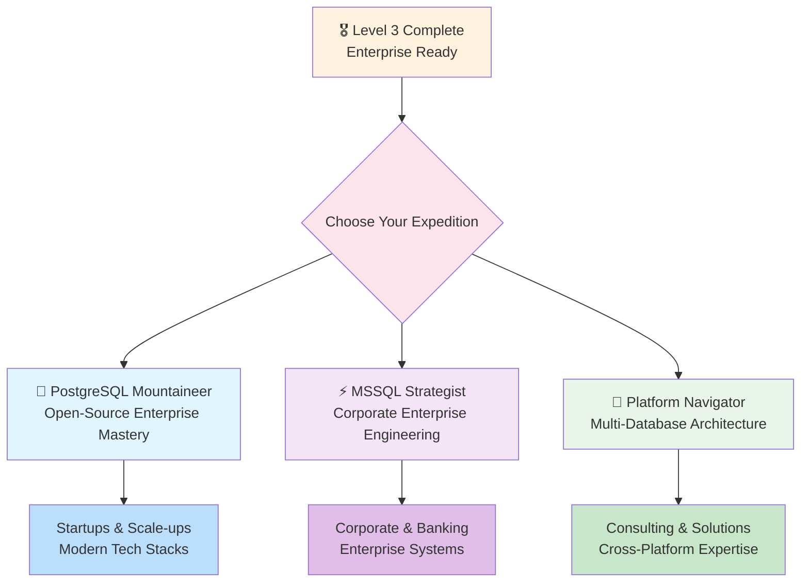
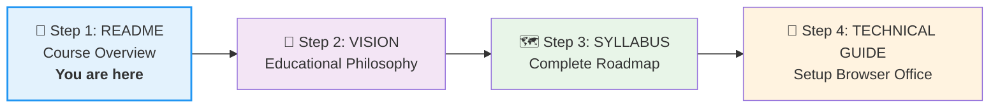




# 🗄️🤖 SQL & GenAI Course
**🎯 Quality Education for Anyone, Anywhere, Anytime — 💫 with Comfort, Convenience at no Cost**

## FROM MASTERING SQL & AI TO DATA ARCHITECT
---
> 🚧 **Course Status:** Level 1 content is being finalized. All links are being tested.  
> 🎯 **Expected completion:** [May 2026]. Feel free to look around, but expect occasional updates.
> ---

## 🌌 Welcome to the SQLVerse

The **SQLVerse** is more than a course—it's a universe of data waiting to be explored. **Every domain is a planet, every database is a world to be discovered.** From the **Education Planet** where you first learn the laws of SQL, to the **E‑Commerce Planet** where you test your skills in the wild, and finally to the **HR Planet** where data tells human stories—you'll travel through worlds designed to build genuine mastery.

This isn't just about learning syntax. It's about becoming a citizen of the SQLVerse, someone who can navigate any data landscape with confidence and curiosity.

---

## 👨‍🏫 A Note from the Creator

Hi, I'm **Uma Maheswari**. For nearly two decades, I've had the privilege of teaching thousands of students across a broad technology stack—from **C, C++, Java, Hibernate, J2EE, and the .NET framework** to **SQL Server, HTML, DHTML, JavaScript, C#, Python**, and countless academic projects. Every classroom, every student, every "aha!" moment reinforced my belief that quality education should have no barriers.

This course—**SQL & GenAI**—is the first step in a much larger journey. Over time, I'll be publishing courses covering my areas of expertise, one by one. My goal is simple: to share what I've learned with anyone, anywhere, at **zero cost**. Whether you're a student in a remote village, a parent learning after bedtime, or a professional upskilling during lunch, you deserve the same opportunity to grow.

**SQLVerse is just the beginning.** Future courses will explore other technologies, always with the same philosophy: **foundation first, AI next, and genuine competence above all**.

If this course helps you—even a little—please consider **starring this repository** ⭐. It's a small gesture that helps other students discover these resources  and keeps my "No-Cost" mission growing!*.

Thank you for being part of this adventure. The SQLVerse awaits.

— Uma Maheswari


---


## 🌍 **VISION: EDUCATION WITHOUT BORDERS**

**This course is completely free** as part of my commitment to making quality tech education accessible to everyone, regardless of financial situation or geographic location.

**Equal access for:**
- **A parent in Chennai** learning after the kids sleep
- **A student in rural Kenya** with just a phone
- **A professional in São Paulo** upskilling during lunch
- **A career-changer anywhere** building skills without debt

*This is not just a course. This is educational equity in action.*

---

## ⚡ **60-Second Overview: Your Learning Blueprint**

| Aspect | What You Get | Why It Matters |
| :--- | :--- | :--- |
| **📖 Curriculum** | SQL + GenAI Mastery | Future-proof skills for AI-era jobs |
| **👥 Audience** | Beginners to Professionals | Inclusive learning paths for all |
| **⏳ Timeline** | 20 Weeks | Structured, achievable progression |
| **💎 Cost** | **Completely Free** | Zero financial barriers |
| **🛠️ Setup** | Under 30 Minutes | Immediate start, no frustration |
| **🏆 Outcome** | 9+ Portfolio Projects | Tangible proof of expertise |

---

## 🎯 **BENEFITS: YOUR TRANSFORMATION JOURNEY**

### **Accessibility Advantages:**
✅ **🏠 Home Comfort** – Learn in your most productive environment  
✅ **⏰ Your Schedule** – Study anytime that works for your brain  
✅ **💰 Zero Financial Cost** – All tools have generous free tiers  
✅ **🌍 No Geographical Barriers** – Access from any country with internet  
✅ **📱 Device Flexibility** – Continue on phone, tablet, or computer

### **Perfect For:**
- **Working Professionals** – Skill up without job disruption
- **Students** – Supplement education without additional costs
- **Career Changers** – Transition without quitting current work
- **Parents** – Learn during naps, school hours, or after bedtime
- **Travelers** – Continue from any location worldwide

**The Ultimate Equalizer:** Whether you're in a bustling city or quiet village, whether you have a powerful computer or basic laptop—you have exactly the same learning opportunities.

---

## 🗺️ **JOURNEY MAP: THE 20-WEEK ROADMAP**

### **🏗️ Course Architecture**
```
sql-ai-course/
├── Level-1-beginner/          # 🏁 Foundations (6 modules)
├── Level-2-intermediate/      # 🔄 Advanced queries (6 modules)
├── Level-3-advanced-paradigms/# 🎖️ Production + Multi-Platform (8 modules)
├── Projects/                  # 🛠️ Real-World Portfolio Projects
├── The-Career-Path/           # 🏆 Specialized Mastery Paths
├── Setup/                     # ⚙️ Browser Office Configuration
└── Resources/                 # 📚 Professional References
```

---

### **🏢 THE BROWSER OFFICE: YOUR UNIVERSAL LAUNCHPAD**
**🚀 Kickstart: Any Computer, Any Browser, Anytime.**
**🌍 Destination: Any country, Any city, Any Platform.**

The Browser Office transforms any computer with a browser into a complete learning environment—**zero installations, universally accessible**.

#### **📋 Standard Four-Tab Setup (Levels 1 & 2)**
| Tab | Purpose | Tools | Shortcut |
| :--- | :--- | :--- | :--- |
| **1: The Map** | Learning navigation | Course Repository (GitHub) | `Ctrl+1` / `Cmd+1` |
| **2: The Factory** | Hands-on practice | SQLite Online | `Ctrl+2` / `Cmd+2` |
| **3: The Consultant** | AI assistance | ChatGPT, Claude, Gemini | `Ctrl+3` / `Cmd+3` |
| **4: The Vault** | Portfolio tracking | GitHub Web | `Ctrl+4` / `Cmd+4` |

**Why Browser-Only?**
- 🚫 **No Installation Hassles** – Pure browser-based tools
- 💾 **Cloud-Saved Work** – Never lose progress
- 🔄 **Consistent Environment** – Same experience everywhere
- 🌐 **Access Anywhere** – Any device with internet
- 🛡️ **Safe Sandbox** – Practice without risk

> **Important Note:** This four-tab setup is optimized for Levels 1 & 2. **Level 3 uses a specialized advanced configuration** with additional professional tools.

---

### **🧠 THE LEARNING PHILOSOPHY: FOUNDATION FIRST, AI NEXT**

We build a direct **Bridge to True Mastery** through deliberate progression:

*   **Level 1 - Pure Foundation:** Build raw SQL skills **without AI assistance** (Weeks 1-4), earn AI acceleration in Week 5, then synthesize everything in Week 6.
*   **Level 2 - Strategic Integration:** Introduces **full AI collaboration** from Module 1, applying your core skills to more complex problems.
*   **Level 3 - Professional Workflow:** Focuses on **enterprise-grade practices** and multi-platform architecture.

This phased approach prevents the **"hallucination of competence"**—ensuring your confidence is built on **genuine skill**, not just tool proficiency.

**The Socratic AI Method™** teaches you to use AI as a **teaching partner**, not just a code generator—developing your **problem-solving skills** alongside technical mastery.

---

### **🛣️ CAREER SPECIALIZATION PATHS**



---

## 👥 **WHO THIS COURSE SERVES**

| Audience | Why This Course Fits |
| :--- | :--- |
| **Career Changers** | Structured path from zero to job-ready |
| **Analysts & Marketers** | Data skills for better insights |
| **Developers** | Database skills for full-stack development |
| **Students** | Practical skills supplementing academics |
| **Managers** | Technical understanding for better leadership |

**Prerequisites:** Basic computer literacy • Curiosity to learn • No prior programming needed

---

### **🏗️ PROFESSIONAL PROJECT PORTFOLIO**

**Graduate with 9+ Portfolio Projects:**

| Level | Curriculum Projects | Bonus Projects | Independent Projects |
| :--- | :--- | :--- | :--- |
| **🎯 Level 1** | HR Analytics Dashboard | University Course Manager | Budget Tracker, Nutrition Calculator |
| **🚚 Level 2** | Warehouse Inventory Management | Event Ticketing System | SaaS Analytics, Fitness Center |
| **🌐 Level 3** | Supply Chain Risk Platform | IoT Smart City Data Warehouse | Banking Analytics, E-commerce Engine |

**Universal Project Framework:**
```
Projects/
├── 1-project-brief/         # Requirements & success criteria
├── 2-design-documentation/  # Architecture & system design
├── 3-datasets/             # Real-world data workflows
├── 4-solution-framework/   # Implementation support
└── 5-deliverables/         # Enterprise-grade outputs
```

---

## 📊 **YOUR MEASURABLE OUTCOMES**

By completing this course, you will:

| Skill Category | Specific Achievements |
| :--- | :--- |
| **Technical Mastery** | Write complex SQL queries in under 5 minutes • Master 3+ database platforms |
| **AI Collaboration** | Use AI to 10x SQL productivity • Apply Socratic AI Method™ |
| **Portfolio Strength** | 9+ GitHub projects with business value • Professional documentation |
| **Career Readiness** | Interview-ready for SQL roles • Clear specialization path |

---

## 🚀 **GETTING STARTED: YOUR LEARNING PATH**

### **Recommended Navigation Sequence:**



### **Navigate Based on Your Needs:**
- **Understand the Philosophy** → [**VISION WITH MISSION**](VISION.md)
- **See the Complete Roadmap** → [**COMPLETE SYLLABUS**](SYLLABUS.md)
- **Prepare Your Browser Office Workspace** → [**TECHNICAL GUIDE**](Setup/TECHNICAL_GUIDE_L1L2.md)

*Use the links above to follow the recommended sequence or jump directly to what you need.*

---

*This isn't just another SQL course—it's a professional development system that grows with you from beginner to job-ready expert across multiple database platforms, powered by deliberate AI integration.* 🚀

---

*Part of our mission for 🎯 Quality Education for Anyone, Anywhere, Anytime — 💫 with Comfort, Convenience at no Cost.*


