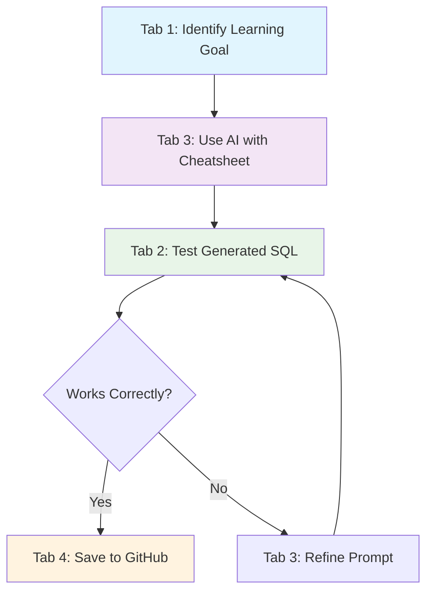

# 📘 Tab 3 Co-pilot Quickstart Guide

### 🎯 Quality Education for Anyone, Anywhere, Anytime — 💫 with Comfort, Convenience at no Cost

---

## 🏢 **Welcome to Tab 3: Your AI Consultant**

**Location:** Tab 3 in your Browser Office  
**Role:** The Consultant - Your AI learning assistant  
**Purpose:** Transform AI from confusing to helpful for SQL learning

**🚀 Kickstart: Any Computer, Any Browser, Anytime.**  
**🌍 Destination: Any country, Any city, Any Platform.**

---

## 📋 **Before You Begin: Important Notes**

### **🎫 Access Level: Level 3 Only**
This cheatsheet is available starting **Level 3** because:
- ✅ You've built foundational SQL skills in Levels 1-2
- ✅ You understand basic SQL syntax and concepts
- ✅ You're ready to accelerate learning with AI assistance
- ✅ You can now use tools to run faster after learning to walk

### **📚 Prerequisites:**
- Completed Level 1: Basic SELECT, WHERE, JOINs
- Completed Level 2: Subqueries, aggregations, basic optimization
- Familiar with your Browser Office setup (Tabs 1-4)
- Have at least one AI tool account (ChatGPT, Claude, etc.)

---

## 🎯 **Core Concept: AI as Your SQL Tutor**

Think of AI as a **24/7 personal tutor** who:
- Never gets tired of your questions
- Explains things multiple ways
- Provides instant feedback
- Helps you think through problems

**Important:** AI is your **co-pilot**, not autopilot. You're still the driver!

---

## 🔤 **Basic Prompt Structure**

### **The Anatomy of a Good Prompt**
Every effective prompt has three parts:

```markdown
CONTEXT + INSTRUCTION + FORMAT
```

**Example Breakdown:**
```markdown
"I'm learning SQL and working with an e-commerce database.  [CONTEXT]
Explain how to find customers who haven't ordered in 30 days.  [INSTRUCTION]
Provide both the SQL query and a simple explanation."  [FORMAT]
```

### **Simple Template:**
```markdown
"I need help with [SQL task]. 
I'm working with [table names] tables.
Please [what you want the AI to do]."
```

---

## 📝 **Essential Prompt Patterns**

### **1. SQL Generation Pattern**
**When to use:** Need to write a query

**Template:**
```markdown
"Write a SQL query to [what you want to achieve].
Use these tables: [table names with key columns].
The query should [specific requirements]."
```

**Examples:**
```markdown
✅ Good: "Write a SQL query to find all customers from California who spent over $500 last month."
❌ Vague: "Help me with customers."
```

**More Examples:**
- "Write a query to show top 10 products by sales in the last quarter"
- "Create SQL to calculate monthly revenue growth percentage"
- "Find customers who bought product A but never bought product B"

### **2. Concept Explanation Pattern**
**When to use:** Don't understand a SQL concept

**Template:**
```markdown
"Explain [SQL concept] in simple terms.
Use a real-world analogy and provide one practical example."
```

**Examples:**
```markdown
✅ Good: "Explain LEFT JOIN with a restaurant reservation analogy."
✅ Good: "What's the difference between WHERE and HAVING? Give examples of when to use each."
❌ Vague: "Tell me about JOINs."
```

**More Examples:**
- "Explain window functions like I'm learning to ride a bike"
- "What are indexes and when should I use them? Use library book analogy"
- "Explain GROUP BY vs DISTINCT with sales data examples"

### **3. Debugging Help Pattern**
**When to use:** Query has errors or gives wrong results

**Template:**
```markdown
"I'm getting [error message or problem].
Here's my query: [paste your SQL].
What's wrong and how do I fix it?"
```

**Examples:**
```markdown
✅ Good: "This query returns duplicate rows: SELECT customer_id, order_date FROM orders GROUP BY customer_id"
✅ Good: "Error: 'Column 'amount' is invalid in the select list'. My query: SELECT customer_id, SUM(amount) FROM orders"
❌ Vague: "My query doesn't work."
```

**More Examples:**
- "This JOIN returns more rows than expected: [paste query]"
- "I'm getting NULL values where I shouldn't: [explain expected vs actual]"
- "Query runs very slow with large data: [paste query and table sizes]"

### **4. Learning Check Pattern**
**When to use:** Test your understanding

**Template:**
```markdown
"I just learned about [concept]. 
Give me 3 practice questions with increasing difficulty.
Provide answers after I attempt them."
```

**Examples:**
```markdown
✅ Good: "I just learned about GROUP BY. Give me 3 practice questions starting easy."
✅ Good: "Test my understanding of JOIN types with practical scenarios."
```

---

## 📊 **Schema-First Approach**

### **The #1 Rule: Always Provide Schema**
AI doesn't know your database structure unless you tell it!

**Before asking any SQL questions, paste this:**

```markdown
"I'm working with this database schema:

Table: customers
- customer_id (INT, PRIMARY KEY)
- name (VARCHAR)
- email (VARCHAR)
- city (VARCHAR)
- signup_date (DATE)

Table: orders
- order_id (INT, PRIMARY KEY)
- customer_id (INT, FOREIGN KEY to customers)
- amount (DECIMAL)
- order_date (DATE)
- status (VARCHAR)

Please use only these table and column names in your answers."
```

### **Why This Works:**
- **Reduces errors** by 80-90%
- **Saves time** from back-and-forth corrections
- **Improves accuracy** of JOINs and column references
- **Makes AI more helpful** immediately

**Pro Tip:** Save your schema in a text file for quick copying!

---

## 🧪 **Quick Practice: Your First AI Session**

### **Exercise 1: Basic Query (5 minutes)**
1. **Open your AI tool** (Tab 3)
2. **Paste this prompt:**
   ```markdown
   "I'm learning SQL. Write a query to find customers who haven't ordered in 90 days.
   Assume tables: customers(id, name, email) and orders(id, customer_id, order_date)."
   ```
3. **Test the query** in SQLite Online (Tab 2)
4. **Save successful prompt** to GitHub (Tab 4)

### **Exercise 2: Concept Explanation (5 minutes)**
1. **Paste this prompt:**
   ```markdown
   "Explain INNER JOIN vs LEFT JOIN using a school analogy with students and classes."
   ```
2. **Ask follow-up questions** if unclear
3. **Save the explanation** to your notes

### **Exercise 3: Debug Practice (5 minutes)**
1. **Paste this broken query:**
   ```markdown
   "This query has an error: 
   SELECT customer_id, COUNT(order_id) 
   FROM orders 
   WHERE COUNT(order_id) > 5
   GROUP BY customer_id;
   
   What's wrong and how do I fix it?"
   ```
2. **Test the corrected version** in SQLite Online

---

## 📋 **Prompt Templates Library**

### **Daily Practice Templates:**

**Morning Warm-up (2 minutes):**
```markdown
"Give me one SQL challenge at beginner level involving [concept I'm learning]."
```

**Learning Session (15 minutes):**
```markdown
"Teach me [new concept] with:
1. Simple definition
2. Real-world analogy  
3. 2 practical examples
4. Common mistakes to avoid"
```

**Evening Review (5 minutes):**
```markdown
"Create 3 quiz questions about what I learned today about [topics].
Provide answers after I try."
```

### **Project Work Templates:**

**Planning Phase:**
```markdown
"I need to build [project goal]. 
What SQL tables would I need?
What are the key relationships?"
```

**Implementation Phase:**
```markdown
"Write SQL for [specific feature] given these tables: [table structures]."
```

**Testing Phase:**
```markdown
"What edge cases should I test for this query: [your SQL]?"
```

---

## 🚀 **Browser Office Integration**

### **Your Tab 3 Workflow:**



### **Session Setup Checklist:**
- [ ] **Tab 1 Open**: Course materials ready
- [ ] **Tab 2 Open**: SQLite Online loaded
- [ ] **Tab 3 Open**: AI tool + this cheatsheet
- [ ] **Tab 4 Open**: GitHub repository ready
- [ ] **Schema copied**: Ready to paste
- [ ] **Clear goal**: Know what you want to learn

### **Time-Boxed Learning Sessions:**
| Session Type | Time | Cheatsheet Section | Goal |
| :--- | :--- | :--- | :--- |
| **Quick Practice** | 10 min | SQL Generation Patterns | Write 2-3 queries |
| **Concept Deep Dive** | 25 min | Concept Explanation Patterns | Master one new concept |
| **Debug Session** | 15 min | Debugging Help Patterns | Fix 3-5 errors |
| **Review Session** | 10 min | Learning Check Patterns | Test understanding |

---

## ❌ **Common Mistakes & ✅ Fixes**

### **Mistake 1: Too Vague**
```markdown
❌ "Help me with SQL."
✅ "Write a query to find duplicate email addresses in a users table."
```

### **Mistake 2: Missing Context**
```markdown
❌ "Fix this JOIN."
✅ "This LEFT JOIN returns NULLs: [paste query]. I want to include all customers even without orders."
```

### **Mistake 3: No Schema**
```markdown
❌ "Find customers in New York."
✅ "Given customers(id, name, city) table, find customers where city = 'New York'."
```

### **Mistake 4: Unclear Requirements**
```markdown
❌ "Do sales analysis."
✅ "Calculate monthly sales totals for 2024, grouped by product category, sorted highest to lowest."
```

---

## 📚 **Learning Progression with AI**

### **Week 1: Foundation (Use These Patterns)**
- Day 1-2: SQL Generation patterns only
- Day 3-4: Concept Explanation patterns only  
- Day 5-7: Mix both, always provide schema

### **Week 2: Application**
- Use AI for actual course exercises
- Practice debugging your own queries
- Start building prompt library

### **Week 3: Integration**
- Incorporate AI into daily learning workflow
- Develop personal prompt templates
- Teach back concepts to reinforce learning

### **Week 4: Mastery**
- Use AI for complex project work
- Help other learners with AI prompting
- Contribute to community prompt library

---

## 🧠 **Learning Mindset Tips**

### **1. The "Explain It Back" Method**
After AI explains something, restate it in your own words:
```markdown
"You explained [concept]. Let me make sure I understand: [your explanation].
Is this correct?"
```

### **2. The "Why" Chain**
Keep asking why until you truly understand:
```markdown
"That makes sense. But why do we use [approach] instead of [alternative]?"
```

### **3. The "Teach Me Like I'm 10" Approach**
For complex topics:
```markdown
"Explain [complex concept] like I'm 10 years old with a simple analogy."
```

### **4. The "Show Multiple Ways" Request**
Understand different approaches:
```markdown
"Show me 3 different ways to solve [problem] and explain when to use each."
```

---

## 🔄 **The Learning Loop**

### **Daily Practice Routine:**
1. **Morning** (5 min): One quick prompt from this cheatsheet
2. **Learning Session** (25 min): Focused AI-assisted learning
3. **Practice** (25 min): Apply without AI, then check with AI
4. **Review** (5 min): Save successful prompts to GitHub

### **Weekly Progress Tracking:**
| Week | Goal | Success Metric |
| :--- | :--- | :--- |
| **1** | Comfort with basic prompting | 3 successful queries/day |
| **2** | Reduced AI errors | Schema anchor used 100% |
| **3** | Faster problem-solving | 50% less time per query |
| **4** | Independent learning | Teach one concept to peer |

---

## 🆘 **Troubleshooting Common Issues**

### **Problem: AI gives wrong SQL syntax**
**Solution:**
```markdown
"Please use SQLite syntax specifically. My database is SQLite."
```

### **Problem: AI doesn't understand my schema**
**Solution:**
```markdown
"Let me clarify my table structure:
[Re-paste schema with more detail]
Now, with this exact schema: [repeat question]"
```

### **Problem: Too many results or errors**
**Solution:**
```markdown
"The query you gave returns [problem]. 
Let's debug step by step. First, check if the table and column names match."
```

### **Problem: AI explanations are too complex**
**Solution:**
```markdown
"Simplify that explanation. Use a [specific analogy] and fewer technical terms."
```

---

## 📈 **Success Metrics for Beginners**

### **Start Here (Week 1 Goals):**
- [ ] Use schema anchor in 100% of prompts
- [ ] Get working SQL on first try 40% of time
- [ ] Save 5 successful prompts to GitHub
- [ ] Explain one concept back in own words

### **Progress Indicators:**
- **Query Success Rate:** How often does AI give working SQL first try?
- **Time Saved:** How much faster do you solve problems with AI?
- **Understanding Depth:** Can you explain concepts without AI help?
- **Prompt Efficiency:** How quickly do you get to the right answer?

### **Simple Tracking:**
```markdown
Daily Log:
- Prompts used: [number]
- Successful queries: [number]  
- New concepts learned: [list]
- Time saved: [estimate]
- Saved to GitHub: [yes/no]
```

---

## 🎯 **Next Steps After This Guide**

### **Ready for More?**
After mastering these basics, progress to:

1. **[🚀 Pro Tactics Guide](tab3_co-pilot_pro_tactics.md)** - Advanced techniques
2. **Complex projects** - Apply AI to real database problems
3. **Prompt library building** - Create your personal collection
4. **Community sharing** - Help other learners

### **When to Move On:**
You're ready for advanced techniques when:
- ✅ You use schema anchor automatically
- ✅ 70%+ of your prompts get correct results first try
- ✅ You can debug AI suggestions quickly
- ✅ You have a growing prompt library

---

## 🏢 **Your Browser Office Promise**

Remember: Tab 3 is **The Consultant** in your learning workspace:
- **Tab 1 (Map):** Tells you WHAT to learn
- **Tab 2 (Factory):** Lets you PRACTICE it  
- **Tab 3 (Consultant):** **Helps you UNDERSTAND it** ← **You are here**
- **Tab 4 (Vault):** Saves your PROGRESS

**Together, they create your complete learning ecosystem accessible anywhere.**

---

## ✅ **Quick Start Checklist**

### **First Day with AI:**
- [ ] Choose one AI tool (ChatGPT recommended for beginners)
- [ ] Practice Exercise 1-3 from this guide
- [ ] Save schema template to a text file
- [ ] Create `prompts/` folder in your GitHub repository
- [ ] Try one prompt from each pattern section

### **First Week Goals:**
- [ ] Use AI for 15 minutes daily
- [ ] Master schema anchor technique
- [ ] Save 10+ successful prompts to GitHub
- [ ] Explain 3 SQL concepts back in your own words
- [ ] Join course community for prompt sharing

### **Ready for Level 3 Success:**
- [ ] AI is integrated into your daily learning
- [ ] You're solving problems faster with AI help
- [ ] Your understanding is deepening, not just copying
- [ ] You're building a valuable prompt portfolio

---

**🚀 Ready to begin?**  
Open your AI tool (Tab 3), pick one prompt pattern above, and ask your first question today!

**Remember:** Start simple, provide schema, test everything, and save what works.

---

*Part of our mission for 🎯 Quality Education for Anyone, Anywhere, Anytime — 💫 with Comfort, Convenience at no Cost.*

*Quickstart Guide v1.0 - Your foundation for AI-assisted SQL learning in the Browser Office.*