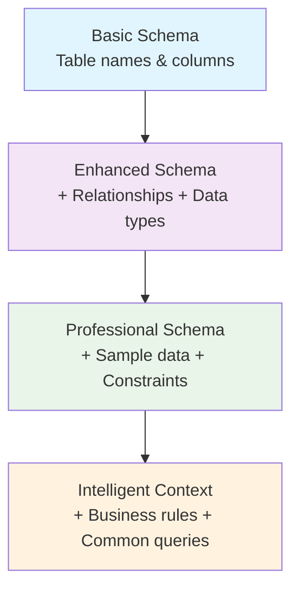
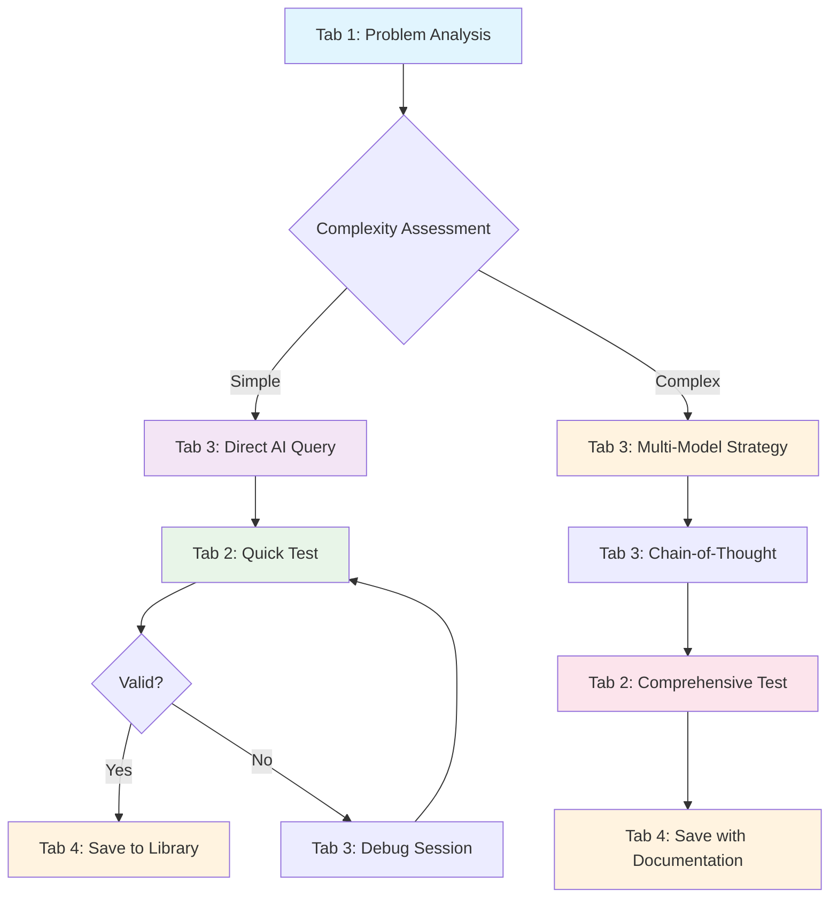

# 🚀 Tab 3 Co-pilot Pro Tactics Guide

### 🎯 Quality Education for Anyone, Anywhere, Anytime — 💫 with Comfort, Convenience at no Cost

---

## 🏢 **Welcome to Advanced AI Consulting**

**Location:** Tab 3 in your Browser Office  
**Role:** Senior Consultant - Expert AI integration  
**Prerequisite:** Mastery of [Quickstart Guide](tab3_co-pilot_quickstart.md) patterns  
**Purpose:** Transform from AI user to AI strategist for professional SQL workflows

**🚀 Kickstart: Any Computer, Any Browser, Anytime.**  
**🌍 Destination: Any country, Any city, Any Platform.**

---

## 🎯 **Master Technique: Schema Anchor 2.0**

### **Beyond Basic Schema: The Professional Approach**
Advanced schema anchoring goes beyond just listing tables:



### **Professional Schema Template:**
```markdown
"## Database Context for AI Assistant

### 1. SCHEMA STRUCTURE
**Table: customers**
- customer_id (INT, PRIMARY KEY, AUTO_INCREMENT)
- name (VARCHAR(100), NOT NULL)
- email (VARCHAR(255), UNIQUE, INDEX idx_email)
- city (VARCHAR(50), DEFAULT 'Unknown')
- signup_date (DATE, INDEX idx_signup_date)
- status ENUM('active', 'inactive', 'suspended') DEFAULT 'active'

**Table: orders**
- order_id (INT, PRIMARY KEY)
- customer_id (INT, FOREIGN KEY (customer_id) REFERENCES customers(customer_id) ON DELETE CASCADE)
- amount (DECIMAL(10,2), CHECK (amount > 0))
- order_date (DATETIME, DEFAULT CURRENT_TIMESTAMP)
- status ENUM('pending', 'processing', 'shipped', 'delivered', 'cancelled')

### 2. RELATIONSHIPS
- customers 1 → ∞ orders (One customer can have many orders)
- orders.customer_id references customers.customer_id

### 3. SAMPLE DATA PATTERNS
- Dates: Recent activity 2024-01-01 onward
- Amounts: Typically $10-$500 range, some outliers to $5000
- Cities: Major cities with 100+ customers each

### 4. BUSINESS RULES
- Active customers = status = 'active' AND last_order < 90 days
- VIP customers = total_orders > 5 OR total_spent > $1000
- Cancelled orders still appear in database for analytics

### 5. COMMON QUERY PATTERNS
- Monthly sales: GROUP BY YEAR(order_date), MONTH(order_date)
- Customer lifetime value: SUM(amount) GROUP BY customer_id
- Retention: Customers with orders in consecutive months

Please use this exact schema and business context in all responses."
```

### **Schema Optimization Techniques:**

**1. Pre-load Schema in Chat:**
```markdown
"Store this schema in your context for this entire conversation. I'll refer to tables by name."
```

**2. Dynamic Schema Updates:**
```markdown
"Updating schema: Added new column 'loyalty_tier' to customers table with values 'bronze', 'silver', 'gold', 'platinum'. Update your context accordingly."
```

**3. Schema Validation Prompt:**
```markdown
"Based on the schema I provided, what potential data quality issues might exist and how would you write queries to check for them?"
```

---

## 🗣️ **Socratic Prompting Mastery**

### **The Art of Guided Discovery**
Don't ask for answers—ask for the thinking process:

### **Level 1: Basic Socratic**
```markdown
"I want to find customers who haven't ordered in 90 days. Instead of giving me the query, ask me questions that will help me figure it out myself."
```

### **Level 2: Progressive Complexity**
```markdown
"Teach me window functions using Socratic questioning:
1. Start with what problem they solve
2. Ask me to identify patterns in data that need window functions
3. Guide me to write my own window function query step by step
Don't give answers until I've attempted each step."
```

### **Level 3: Expert Dialogue**
```markdown
"Act as my senior developer mentor. I'm trying to optimize this query for large datasets:
[PASTE QUERY]

Instead of fixing it, ask me 5 probing questions about:
1. Data distribution and indexing
2. Query execution plan understanding
3. Alternative approaches
4. Business requirements trade-offs
5. Testing strategy

After I answer each, provide feedback but don't give the solution until I've thought through all aspects."
```

### **Socratic Patterns Library:**

**Pattern 1: The "What If" Chain**
```markdown
"Walk me through optimizing this query by asking 'what if' questions:
- What if we add an index on [column]?
- What if we denormalize this part?
- What if we pre-aggregate this data?
After each 'what if', let me think through the implications before you explain."
```

**Pattern 2: The "Teach Back" Method**
```markdown
"Explain [concept] to me, then ask me to explain it back in my own words with a new example. Correct any misunderstandings in my explanation."
```

**Pattern 3: The "Multiple Perspectives"**
```markdown
"Help me understand [problem] from different perspectives:
1. As a database administrator
2. As a business analyst
3. As a front-end developer needing this data
4. As a data scientist for machine learning

Ask me questions about what each role would care about, then synthesize the answers."
```

---

## 🔄 **Multi-Model Strategy Framework**

### **The AI Toolbox Approach**
Different AI models excel at different tasks. Use this strategic framework:

### **Strategy 1: The Research Triangulation**
```markdown
"Step 1 (ChatGPT 4o): Brainstorm 3 different approaches to solve [problem]
Step 2 (Claude 3.5): Analyze these 3 approaches and recommend the best with detailed reasoning
Step 3 (Gemini 1.5): Take the recommended approach and provide optimized code with edge cases"
```

### **Strategy 2: Specialized Task Routing**
| Task Type | Primary AI | Secondary AI | Reason |
| :--- | :--- | :--- | :--- |
| **Creative solutions** | ChatGPT 4o | Claude 3.5 | Creative first, validate with reasoning |
| **Complex logic** | Claude 3.5 | ChatGPT 4o | Strong reasoning, creative alternatives |
| **Long context** | Gemini 1.5 | Claude 3.5 | Large context, good for entire schemas |
| **Error analysis** | Claude 3.5 | Gemini 1.5 | Excellent at root cause analysis |
| **Production code** | Claude 3.5 | ChatGPT 4o | Fewer hallucinations, more reliable |
| **Quick prototyping** | ChatGPT 4o | Gemini 1.5 | Fast iteration, then refinement |

### **Strategy 3: Cross-Verification Workflow**
```markdown
"AI Model 1 (Claude), I got this solution from AI Model 2 (ChatGPT):
[PASTE SOLUTION]

Please:
1. Review for correctness and edge cases
2. Identify any improvements or optimizations
3. Suggest alternatives if needed
4. Rate confidence in this solution 1-10
```

### **Strategy 4: The "Expert Panel"**
```markdown
"Simulate an expert panel discussion about [SQL problem].
- Claude: Play the experienced database architect
- ChatGPT: Play the innovative solutions engineer
- Gemini: Play the scalability and performance expert

Have each 'expert' present their approach, debate trade-offs, then converge on a recommendation."
```

---

## 📝 **Advanced Prompt Engineering Patterns**

### **Pattern 1: Chain-of-Thought Prompting**
```markdown
"Let's solve [complex problem] step by step:

STEP 1: Understand the business requirement
- What are we really trying to accomplish?
- What are the key metrics or outcomes?

STEP 2: Analyze available data
- What tables and columns are relevant?
- What relationships exist?
- What data quality issues might exist?

STEP 3: Design approach
- What SQL techniques are appropriate?
- What performance considerations exist?
- What edge cases need handling?

STEP 4: Write initial query
- Start with simple version
- Add complexity gradually
- Test each component

STEP 5: Optimize and validate
- Check execution plan
- Test with sample data
- Validate against requirements

Now, walk me through each step with this specific problem: [your problem]"
```

### **Pattern 2: Few-Shot Learning with Variations**
```markdown
"Here are examples of good SQL patterns:

EXAMPLE 1 (Basic Aggregation):
-- Find total sales by month
SELECT 
  YEAR(order_date) as year,
  MONTH(order_date) as month,
  SUM(amount) as total_sales
FROM orders
GROUP BY YEAR(order_date), MONTH(order_date)
ORDER BY year DESC, month DESC;

EXAMPLE 2 (Window Function):
-- Rank customers by lifetime value
SELECT 
  customer_id,
  SUM(amount) as lifetime_value,
  RANK() OVER (ORDER BY SUM(amount) DESC) as customer_rank
FROM orders
GROUP BY customer_id;

EXAMPLE 3 (Complex Business Logic):
-- Identify customers at risk of churn
SELECT 
  customer_id,
  MAX(order_date) as last_order,
  DATEDIFF(CURDATE(), MAX(order_date)) as days_since_order,
  CASE 
    WHEN DATEDIFF(CURDATE(), MAX(order_date)) > 90 THEN 'High Risk'
    WHEN DATEDIFF(CURDATE(), MAX(order_date)) > 60 THEN 'Medium Risk'
    ELSE 'Low Risk'
  END as churn_risk
FROM orders
GROUP BY customer_id
HAVING MAX(order_date) < DATE_SUB(CURDATE(), INTERVAL 30 DAY);

Now create a new query that: [your specific requirement]
Maintain the same clarity and commenting style as the examples."
```

### **Pattern 3: Constraint-Based Design**
```markdown
"Design a SQL solution for [problem] with these constraints:

TECHNICAL CONSTRAINTS:
- Must work on MySQL 8.0
- Must handle 10M+ rows efficiently
- Must use indexes appropriately
- Must avoid table scans on large tables

BUSINESS CONSTRAINTS:
- Must calculate results within 5 seconds
- Must handle NULL values appropriately
- Must be maintainable by other developers
- Must log performance metrics

SECURITY CONSTRAINTS:
- Must not expose PII
- Must use parameterized queries
- Must follow least privilege principle

Given these constraints, what's the optimal approach?"
```

### **Pattern 4: The "Build-Measure-Learn" Loop**
```markdown
"Let's use an iterative approach:

ITERATION 1: Build minimum viable query
- Write simplest query that works
- Document assumptions and limitations

ITERATION 2: Measure performance
- Analyze execution plan
- Identify bottlenecks
- Gather performance metrics

ITERATION 3: Learn and optimize
- Based on measurements, suggest optimizations
- Implement improvements
- Measure again

ITERATION 4: Refine and document
- Add error handling
- Add comments and documentation
- Create maintenance guide

Start with Iteration 1 for: [your problem]"
```

---

## 🎭 **Role-Playing Scenarios**

### **Scenario 1: Technical Interview Preparation**
```markdown
"Act as a senior database engineer at [Company: FAANG, Startup, Enterprise]. 
You're interviewing me for a Senior SQL Developer position.

INTERVIEW STRUCTURE:
1. Warm-up: Basic SQL concepts (5 minutes)
2. Core: Query writing and optimization (10 minutes)
3. Advanced: Database design and architecture (10 minutes)
4. Behavioral: Team collaboration and project experience (5 minutes)

For each section:
- Ask me appropriate questions
- Provide feedback on my answers
- Suggest areas for improvement
- Don't reveal answers until I've attempted

Let's begin the interview."
```

### **Scenario 2: Architecture Review**
```markdown
"You are the lead database architect reviewing my design for a new e-commerce analytics platform.

MY DESIGN:
[Describe or paste your schema design]

Please conduct the review by:
1. Asking probing questions about my design choices
2. Identifying potential scalability issues
3. Suggesting improvements with trade-offs
4. Focusing on real-world production considerations

Ask me questions first, then provide your expert opinion."
```

### **Scenario 3: Code Review Simulation**
```markdown
"Review this SQL code as if you were my senior colleague during a pull request review:

[PASTE SQL CODE]

Focus your review on:
1. PERFORMANCE: Query efficiency, indexing, execution plans
2. READABILITY: Code structure, naming, comments
3. MAINTAINABILITY: Simplicity, modularity, documentation
4. CORRECTNESS: Logic errors, edge cases, data integrity
5. SECURITY: SQL injection risks, data exposure

Provide specific, actionable feedback in the format:
- [CRITICAL] Must fix before merge
- [IMPORTANT] Should fix soon
- [NICE-TO-HAVE] Improvements for future
- [QUESTION] Clarification needed"
```

### **Scenario 4: Mentorship Session**
```markdown
"You are my assigned mentor, a Principal Data Engineer with 15 years of experience.
I'm working on: [describe your current challenge or project]

Instead of solving it for me, guide me by:
1. Asking about my current approach and thinking
2. Sharing relevant experiences from similar situations
3. Suggesting resources or techniques to explore
4. Helping me develop my own solution

Be supportive but challenging. Push me to think deeper."
```

---

## 🧪 **Testing & Validation Framework**

### **Comprehensive Test Generation**
```markdown
"Generate a complete test suite for this SQL query:

[PASTE YOUR QUERY]

Include:
1. UNIT TESTS: Test individual components with sample data
2. INTEGRATION TESTS: Test with full dataset relationships
3. EDGE CASES: Test with NULLs, empty results, extreme values
4. PERFORMANCE TESTS: Test with large dataset simulation
5. SECURITY TESTS: Test for injection vulnerabilities

For each test, provide:
- Test data setup
- Expected results
- Assertion criteria
- Cleanup steps"
```

### **Performance Benchmarking**
```markdown
"Create a performance benchmarking plan for these two query approaches:

APPROACH A: [Query A]
APPROACH B: [Query B]

Benchmark plan should include:
1. Test environment setup
2. Test data generation (small, medium, large datasets)
3. Measurement metrics (execution time, CPU, memory, I/O)
4. Execution plan analysis
5. Results comparison framework
6. Recommendations based on findings"
```

### **Data Quality Validation**
```markdown
"Design data quality validation queries for this database schema:

[PASTE SCHEMA]

Check for:
1. Completeness: Missing required fields
2. Consistency: Inconsistent data formats
3. Accuracy: Data that doesn't make business sense
4. Uniqueness: Duplicate records
5. Timeliness: Stale or future-dated data
6. Integrity: Broken referential integrity

Provide SQL queries to detect each issue and suggested fixes."
```

---

## ⚡ **Performance Tuning Masterclass**

### **Pattern 1: Execution Plan Analysis**
```markdown
"Analyze this execution plan and provide optimization recommendations:

[PASTE EXPLAIN or EXPLAIN ANALYZE output]

Focus on:
1. Full table scans that could be indexed
2. Expensive joins or subqueries
3. Missing or unused indexes
4. Cardinality estimation issues
5. Sort or aggregation bottlenecks

Provide specific SQL to create optimal indexes and rewrite problematic queries."
```

### **Pattern 2: Index Strategy Design**
```markdown
"Design an optimal indexing strategy for this workload:

SCHEMA: [Paste schema]
TYPICAL QUERIES: [Describe or paste common queries]
DATA CHARACTERISTICS: 
- Table sizes: [approximate row counts]
- Data distribution: [key characteristics]
- Write frequency: [high/medium/low]
- Read patterns: [typical access patterns]

Recommend:
1. Clustered indexes (which columns, why)
2. Non-clustered indexes (covering indexes for common queries)
3. Composite indexes (order of columns)
4. Index maintenance strategy
5. Monitoring queries to validate effectiveness"
```

### **Pattern 3: Query Rewriting Patterns**
```markdown
"Rewrite this query for optimal performance while maintaining correctness:

ORIGINAL QUERY: [Paste slow query]

Consider these optimization techniques:
1. Replace correlated subqueries with JOINs
2. Use EXISTS instead of IN for large datasets
3. Pre-aggregate where possible
4. Reduce columns in SELECT
5. Add appropriate WHERE clause conditions
6. Consider temporary tables for complex transformations

Provide multiple rewritten versions with performance trade-offs."
```

---

## 🚨 **Advanced Error Recovery**

### **When AI Hallucinates Badly**
```markdown
"Reset and restart. We're getting incorrect information.

GROUND RULES:
1. Only use this exact schema: [re-paste schema]
2. Use SQLite syntax unless specified otherwise
3. Test all queries before suggesting
4. Admit when you're uncertain

Now, with these constraints, let's solve: [original problem]"
```

### **Confidence Calibration**
```markdown
"Before answering, rate your confidence in this solution on a scale:
1: Guessing, likely incorrect
3: Somewhat confident, might need adjustments
5: Confident, should work with minor tweaks
7: Very confident, production-ready
9: Certain, extensively tested pattern
10: Mathematical certainty

After rating, explain what gives you that confidence level, then provide your answer."
```

### **Alternative Perspective Analysis**
```markdown
"Take the opposite perspective. Critique this solution as if you were trying to break it:

PROPOSED SOLUTION: [Paste solution]

Find:
1. Logical flaws in the approach
2. Performance issues at scale
3. Edge cases that break it
4. Security vulnerabilities
5. Maintenance challenges

After critiquing, provide an improved version."
```

---

## 🔧 **Browser Office Advanced Integration**

### **The Professional Workflow:**


### **Time Management System:**

**Pomodoro Technique with AI:**
```
25 MINUTE FOCUS SESSIONS:
- 5 min: Tab 1 - Review problem & choose prompt pattern
- 15 min: Tab 3 - AI-assisted deep work
- 5 min: Tab 2 - Test and validate

5 MINUTE BREAKS:
- Review what worked/didn't
- Update prompt journal
- Plan next session
```

**Daily Planning Prompt:**
```markdown
"Help me plan today's SQL learning sessions:

AVAILABLE TIME: [e.g., 90 minutes in 3 sessions]
CURRENT SKILL LEVEL: [e.g., Intermediate window functions]
GOALS: [e.g., Master recursive CTEs]

Suggest:
1. Session 1 (30 min): Focus area and specific exercises
2. Session 2 (30 min): Practice and application
3. Session 3 (30 min): Review and project work

For each session, recommend:
- Which prompt patterns to use
- Which AI model to use
- What to test in SQLite
- What to save to GitHub"
```

### **Personal Knowledge Base Integration:**
```markdown
"Integrate this learning into my personal knowledge base.

MY EXISTING KNOWLEDGE:
[Briefly describe what you already know]

NEW LEARNING:
[Describe what you just learned]

Create:
1. Connections between new and existing knowledge
2. Mnemonics or mental models for recall
3. Practical applications in current projects
4. Gaps to fill in future learning sessions

Save this integration framework to my GitHub notes."
```

---

## 📊 **Metrics and Progress Tracking**

### **Advanced Success Metrics:**
| Metric | Calculation | Target (Expert) |
| :--- | :--- | :--- |
| **First-Try Accuracy** | Working queries / Total prompts | 85%+ |
| **Prompt Efficiency** | Time to correct solution | < 5 minutes |
| **Solution Quality** | Performance + Readability + Maintainability | All 3 optimized |
| **Knowledge Transfer** | Can explain solution without AI | Clear, concise explanation |
| **Library Growth** | New patterns added weekly | 5+ quality patterns |
| **Community Impact** | Patterns shared/help provided | Regular contributions |

### **Prompt Journal 2.0 Template:**
```markdown
## Expert Prompt Journal Entry

**Date:** 2024-03-15
**Problem Complexity:** High (Production optimization)
**AI Models Used:** Claude (primary), ChatGPT (validation)
**Time Spent:** 45 minutes

### CONTEXT
Business need: Real-time inventory analytics for 10M+ products
Technical constraints: Sub-second response time, MySQL 8.0

### PROMPT EVOLUTION
**Attempt 1:** Basic request → Poor performance suggestions
**Attempt 2:** Added schema anchor + constraints → Better but missing indexes
**Attempt 3:** Chain-of-thought + execution plan focus → Optimal solution

### KEY INSIGHTS
1. Materialized views outperform complex joins for this access pattern
2. Composite index on (category_id, last_sold_date) reduced query time 90%
3. Partitioning by date range essential for maintenance

### PATTERN TO REUSE
```
[Save the successful prompt pattern here]
```

### LESSONS LEARNED
- Always ask for execution plan analysis for performance-critical queries
- Multiple AI models converge on better solutions than single model
- Documenting constraints upfront saves iteration time

### NEXT STEPS
1. Implement monitoring for query performance
2. Create similar patterns for other analytics queries
3. Share pattern with team documentation
```

---

## 🚀 **Production-Ready Patterns**

### **Pattern 1: Complete Solution Package**
```markdown
"Create a production-ready SQL solution package for: [business problem]

INCLUDE:
1. MAIN QUERY: Optimized, commented, with error handling
2. INDEXING STRATEGY: Create index statements with rationale
3. TEST SUITE: Comprehensive test cases with setup/teardown
4. MONITORING: Queries to monitor performance in production
5. MAINTENANCE: Scheduled maintenance tasks if needed
6. DOCUMENTATION: Usage instructions and troubleshooting
7. ROLLBACK PLAN: How to revert if issues arise

All components should be ready for production deployment."
```

### **Pattern 2: Team Handoff Package**
```markdown
"Prepare this SQL solution for handoff to another developer:

SOLUTION: [Paste your working solution]

Create:
1. ARCHITECTURE OVERVIEW: High-level design decisions
2. IMPLEMENTATION GUIDE: Step-by-step deployment
3. CODE WALKTHROUGH: Line-by-line explanation
4. COMMON ISSUES: Known problems and solutions
5. PERFORMANCE CHARACTERISTICS: Expected behavior at scale
6. SCALING GUIDE: How to handle 10x, 100x growth
7. CONTACT POINTS: Who to ask about different aspects

Make it accessible to intermediate SQL developers."
```

### **Pattern 3: Migration Strategy**
```markdown
"Design a migration strategy from current approach to new optimized approach:

CURRENT: [Describe current solution]
NEW: [Describe optimized solution]

Plan should include:
1. PHASED ROLLOUT: Step-by-step migration plan
2. DATA VALIDATION: How to ensure correctness during migration
3. PERFORMANCE VALIDATION: A/B testing approach
4. ROLLBACK PROCEDURE: How to revert if issues
5. TIMELINE: Realistic timeline with milestones
6. RISK ASSESSMENT: Potential risks and mitigation
7. COMMUNICATION: What to tell stakeholders

Focus on zero-downtime migration."
```

---

## 🌟 **Expert-Level Integration**

### **The AI-Augmented Developer Workflow:**
1. **Problem Decomposition:** Use AI to break complex problems into solvable parts
2. **Solution Exploration:** Use multiple AI models to explore different approaches
3. **Validation Rigor:** Implement comprehensive testing with AI-generated test suites
4. **Documentation Excellence:** Use AI to create professional documentation
5. **Knowledge Synthesis:** Integrate new learning into personal and team knowledge bases

### **Continuous Improvement System:**
```markdown
"Weekly Review Protocol:

1. SUCCESS ANALYSIS (10 min)
- Top 3 most effective prompts this week
- Why they worked so well
- How to generalize the patterns

2. FAILURE ANALYSIS (10 min)
- Top 3 least effective prompts
- Root causes of failure
- How to avoid similar issues

3. PATTERN REFINEMENT (10 min)
- Improve 2 existing patterns based on learnings
- Create 1 new pattern for common tasks
- Delete or archive ineffective patterns

4. KNOWLEDGE INTEGRATION (10 min)
- Connect new patterns to existing knowledge
- Update personal prompt library
- Share one insight with community

Conduct this review every Friday."
```

---

## 🏆 **Mastery Assessment**

### **Self-Evaluation Checklist:**
- [ ] **Schema Mastery:** Can create comprehensive schema anchors instinctively
- [ ] **Prompt Patterns:** Have personal library of 50+ proven prompt patterns
- [ ] **Multi-Model Strategy:** Routinely use 2+ AI models for complex problems
- [ ] **Error Recovery:** Can diagnose and fix AI misunderstandings quickly
- [ ] **Performance Optimization:** Consistently produce production-ready queries
- [ ] **Teaching Ability:** Can explain AI prompting techniques to others
- [ ] **Workflow Integration:** AI is seamless part of development process
- [ ] **Knowledge Management:** Maintain organized, growing prompt library

### **Expert vs Intermediate Indicators:**
| Area | Intermediate | Expert |
| :--- | :--- | :--- |
| **Schema Usage** | Pastes schema when reminded | Pre-loads schema, updates dynamically |
| **Error Handling** | Asks AI to fix errors | Diagnoses root cause, guides AI to fix |
| **Performance** | Makes queries work | Optimizes for scale and maintenance |
| **Learning** | Uses AI for answers | Uses AI for thinking process |
| **Output** | Working SQL queries | Complete solution packages |

---

## 🎯 **Next Evolution**

### **Ready for Mastery Framework?**
You're ready for the next level when:
- ✅ You instinctively use the right prompt pattern for each problem type
- ✅ Your first-try success rate exceeds 85%
- ✅ You're teaching others AI prompting techniques
- ✅ You've developed personal variations of these patterns
- ✅ AI feels like a natural extension of your thinking process

**Next Step:** [🎯 Mastery Framework](tab3_co-pilot_mastery.md) - Creating your own frameworks and contributing to community knowledge.

### **Contribution Path:**
1. **Internalize** these patterns in your daily work
2. **Adapt** them to your specific domain and projects
3. **Create** new patterns for unique challenges
4. **Share** successful patterns with the community
5. **Mentor** others in AI-assisted development

---

## 🏢 **The Professional Consultant's Toolkit**

Remember: In your Browser Office, **Tab 3** is now a **Senior Consultant**:
- **Tab 1 (Map):** Strategic direction and requirements
- **Tab 2 (Factory):** Implementation and testing  
- **Tab 3 (Consultant):** **Expert guidance and optimization** ← **Advanced techniques here**
- **Tab 4 (Vault):** Knowledge management and portfolio

**Together, they form a professional-grade development environment accessible from anywhere in the world.**

---

## ✅ **Pro Tactics Implementation Plan**

### **Week 1: Foundation Building**
- [ ] Master Schema Anchor 2.0 - Use in 100% of prompts
- [ ] Practice Socratic prompting on 3 complex problems
- [ ] Set up multi-model workflow with your preferred tools
- [ ] Create personal prompt journal template

### **Week 2-3: Pattern Mastery**
- [ ] Implement chain-of-thought for all complex problems
- [ ] Use role-playing scenarios for learning and interview prep
- [ ] Develop testing and validation discipline
- [ ] Build library of 20+ specialized prompt patterns

### **Week 4: Integration & Optimization**
- [ ] Streamline Browser Office workflow with these techniques
- [ ] Optimize personal prompt library organization
- [ ] Share 3 successful patterns with learning community
- [ ] Mentor one other learner in advanced prompting

### **Month 2: Professional Application**
- [ ] Apply to real project work with measurable results
- [ ] Document case studies of successful implementations
- [ ] Develop teaching materials for your patterns
- [ ] Achieve 85%+ first-try success rate

---

**🚀 Ready to operate at expert level?**  
Choose one advanced pattern above and apply it to your current SQL challenge. Document the results in your prompt journal.

**Remember:** Expertise isn't about knowing all the answers—it's about knowing how to find the best answers efficiently.

---

*Part of our mission for 🎯 Quality Education for Anyone, Anywhere, Anytime — 💫 with Comfort, Convenience at no Cost.*

*Pro Tactics Guide v1.0 - Advanced AI integration for professional SQL development in the Browser Office.*