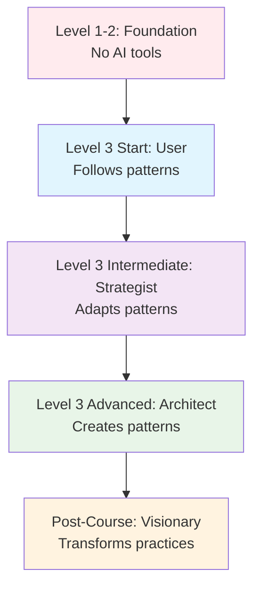

# 🎯 Tab 3 Co-pilot Mastery Framework

### 🎯 Quality Education for Anyone, Anywhere, Anytime — 💫 with Comfort, Convenience at no Cost

---

## 🏢 **Welcome to Expert-Level AI Integration**

**Location:** Tab 3 in your Browser Office  
**Role:** Principal Consultant - AI Strategy Architect  
**Prerequisites:** Mastery of [Quickstart Guide](tab3_co-pilot_quickstart.md) and [Pro Tactics Guide](tab3_co-pilot_pro_tactics.md)  
**Purpose:** Transform from AI strategist to AI architect - creating systems, frameworks, and contributing to collective intelligence

**🚀 Kickstart: Any Computer, Any Browser, Anytime.**  
**🌍 Destination: Any country, Any city, Any Platform.**

---

## 🧠 **Mastery Mindset: From User to Architect**

### **The Evolution of AI Integration:**


### **Mastery Characteristics:**
- **Creates** rather than consumes prompt patterns
- **Teaches** others AI integration methodologies
- **Designs** systems that transcend individual prompts
- **Contributes** to community knowledge evolution
- **Anticipates** AI advancements and adapts proactively

---

## 🏗️ **Framework Creation Methodology**

### **The Pattern Design Process:**

```markdown
## Framework Creation Template

### 1. PROBLEM IDENTIFICATION
**Core Challenge:** [What persistent problem needs solving?]
**Current Solutions:** [Why existing approaches fall short]
**Stakeholder Needs:** [Who benefits and how?]

### 2. RESEARCH & ANALYSIS
**Existing Patterns:** [Review of current approaches]
**Gap Analysis:** [What's missing in current solutions]
**Innovation Opportunity:** [Where new framework adds value]

### 3. FRAMEWORK DESIGN
**Core Principles:** [Guiding philosophy]
**Components:** [Building blocks of the framework]
**Workflows:** [How components interact]
**Adaptation Points:** [Where users can customize]

### 4. IMPLEMENTATION GUIDE
**Getting Started:** [Minimum viable implementation]
**Advanced Configuration:** [Full feature utilization]
**Integration Points:** [How it works with existing systems]
**Success Metrics:** [How to measure effectiveness]

### 5. EVOLUTION PATH
**Version 1.0:** [Current capabilities]
**Future Roadmap:** [Planned enhancements]
**Community Contributions:** [How others can extend]
```

### **Example: SQL Learning Accelerator Framework**
```markdown
## SQL Learning Accelerator Framework

### PROBLEM IDENTIFICATION
**Core Challenge:** Learners plateau at intermediate SQL skills
**Current Solutions:** Random practice lacks systematic progression
**Stakeholder Needs:** Structured path from intermediate to expert

### CORE PRINCIPLES
1. **Progressive Complexity:** Skills build incrementally
2. **Context Retention:** Learning connects to real business problems
3. **Feedback Loops:** Immediate validation and correction
4. **Portfolio Building:** Every exercise creates career assets

### COMPONENTS
- **Skill Assessment Matrix:** Diagnoses current capability levels
- **Challenge Progression Engine:** Generates appropriate difficulty exercises
- **Solution Validation Suite:** Tests and provides feedback
- **Portfolio Integration:** Automatically documents achievements

### IMPLEMENTATION
1. **Initial Assessment:** Diagnose starting point
2. **Custom Learning Path:** Generated based on assessment
3. **Daily Challenges:** Progressive difficulty with AI support
4. **Portfolio Updates:** Automatic GitHub commits of progress
5. **Weekly Reviews:** Performance analytics and path adjustment

### SUCCESS METRICS
- 40% faster skill acquisition vs unstructured learning
- 95% completion rate for structured learners vs 60% for unstructured
- Portfolio artifacts generated automatically
```

---

## 🤖 **AI-Augmented Development Systems**

### **System 1: The Development Flywheel**
Create self-improving AI development systems:

```markdown
## Development Flywheel Framework

### COMPONENTS:
1. **Problem Intake System:** Captures and categorizes development challenges
2. **Solution Generation Engine:** AI creates multiple solution approaches
3. **Validation Pipeline:** Automated testing of all generated solutions
4. **Learning Feedback Loop:** Successful patterns improve future generations
5. **Knowledge Repository:** Curated solutions with metadata and ratings

### WORKFLOW:
Challenge → AI Generation → Validation → Learning → Repository → Improved Future Generations

### IMPLEMENTATION PROMPT:
"Design a self-improving SQL solution system where:
1. Users submit SQL challenges with context and constraints
2. The system generates 3 distinct solution approaches
3. Each solution is automatically tested with validation suites
4. Performance data feeds back to improve future generations
5. Successful patterns are categorized and added to a knowledge base

Create the prompt templates, testing framework, and feedback mechanisms."
```

### **System 2: Cross-Model Intelligence Synthesis**
```markdown
## Cross-Model Intelligence Framework

### ARCHITECTURE:
1. **Model Specialization Mapping:** Identifies each AI's unique strengths
2. **Problem Decomposition Engine:** Breaks complex problems into specialized tasks
3. **Task Routing System:** Routes each sub-task to optimal AI model
4. **Solution Synthesis Engine:** Combines specialized outputs into coherent solution
5. **Quality Assurance Pipeline:** Validates combined solution holistically

### EXAMPLE WORKFLOW:
Complex business analytics problem → 
1. ChatGPT: Creative approach generation →
2. Claude: Logical validation and edge case analysis →
3. Gemini: Large context schema integration →
4. Custom synthesis: Combined optimized solution →
5. Validation: Performance and correctness testing

### IMPLEMENTATION:
"Create a framework that intelligently routes different aspects of SQL problems to specialized AI models and synthesizes their outputs. Include routing logic, handoff protocols, and synthesis algorithms."
```

---

## 🧩 **Meta-Prompt Engineering**

### **Creating Prompts That Create Prompts:**
```markdown
## Meta-Prompt Generator Template

"You are a prompt engineering expert. Create a specialized prompt for [specific task] that will be used by [target audience] to achieve [desired outcome].

### REQUIREMENTS:
1. **Audience Adaptation:** Tailor complexity to audience skill level
2. **Task Specificity:** Include domain-specific context and constraints
3. **Output Format:** Define clear structure for generated outputs
4. **Quality Controls:** Build in validation and refinement mechanisms
5. **Adaptation Guidance:** Explain how to adjust for variations

### GENERATE:
1. Primary prompt for the target task
2. Three variations for different scenarios
3. Quality assessment criteria
4. Troubleshooting guide for common issues
5. Evolution suggestions for future improvements"
```

### **Prompt Evolution Tracking System:**
```markdown
## Prompt Evolution Framework

### TRACKING DIMENSIONS:
1. **Effectiveness:** Success rate across different problem types
2. **Efficiency:** Time to correct solution
3. **Adaptability:** Performance across varied contexts
4. **Robustness:** Consistency despite input variations
5. **Learning Curve:** Ease of mastery for new users

### EVOLUTION MECHANISMS:
1. **A/B Testing:** Compare prompt variations systematically
2. **Usage Analytics:** Track which patterns succeed in which contexts
3. **Community Feedback:** Incorporate insights from diverse users
4. **Automated Refinement:** Use AI to improve prompts based on metrics
5. **Version Control:** Maintain history of improvements and lessons

### IMPLEMENTATION:
"Design a system for systematically evolving and improving prompt patterns based on usage data, success metrics, and community feedback. Include tracking, analysis, and refinement mechanisms."
```

---

## 🏢 **Enterprise Browser Office Integration**

### **Team Collaboration Framework:**
```markdown
## Collaborative Browser Office Framework

### ARCHITECTURE:
1. **Shared Knowledge Base:** Centralized repository of proven prompt patterns
2. **Team Skill Profiles:** Track individual and team AI proficiency
3. **Collaborative Workflows:** Multi-person AI-assisted development processes
4. **Quality Standards:** Team-wide prompt quality and validation protocols
5. **Progress Analytics:** Team-level learning and productivity metrics

### WORKFLOWS:
1. **Pair Prompting:** Two developers co-create with AI assistance
2. **Code Review Augmentation:** AI-assisted review with team knowledge integration
3. **Knowledge Transfer Sessions:** Structured AI-facilitated skill sharing
4. **Team Learning Sprints:** Coordinated skill development with AI support

### IMPLEMENTATION:
"Design a framework for team-based AI-assisted SQL development that includes knowledge sharing, collaborative workflows, quality standards, and progress tracking. Focus on transforming individual proficiency into team capability."
```

### **Organizational Learning System:**
```markdown
## Organizational AI Learning Framework

### COMPONENTS:
1. **Skill Matrix Development:** Maps AI proficiency to organizational roles
2. **Learning Pathway Generator:** Creates personalized upskilling paths
3. **Mentorship Integration:** Connects AI learning with human mentorship
4. **Project-Based Application:** Real work integration of AI skills
5. **Impact Measurement:** Business outcomes from AI skill development

### IMPLEMENTATION PHASES:
1. **Assessment:** Current AI proficiency across organization
2. **Pathway Creation:** Individualized learning journeys
3. **Integration:** AI skills applied to actual projects
4. **Amplification:** AI-proficient teams mentor others
5. **Transformation:** AI becomes core competency

### PROMPT:
"Create a framework for organizational adoption of AI-assisted development skills, including assessment, training, application, and transformation phases. Include metrics for each phase and transition criteria."
```

---

## 🔄 **Continuous Evolution Systems**

### **The Adaptive Learning Loop:**
```markdown
## Adaptive AI Learning System

### CORE MECHANISM:
1. **Performance Monitoring:** Track prompt success rates and efficiency
2. **Pattern Recognition:** Identify which patterns work best for which problems
3. **Adaptive Suggestions:** System recommends optimal patterns based on context
4. **Automated Refinement:** System improves patterns based on aggregate data
5. **Skill Gap Identification:** Detects areas needing pattern development

### IMPLEMENTATION:
"Design a system that monitors your AI prompt usage, identifies patterns in what works, suggests improvements, and automatically refines your personal prompt library. Include learning algorithms and adaptation mechanisms."
```

### **Future-Proofing Framework:**
```markdown
## AI Evolution Adaptation Framework

### MONITORING SYSTEMS:
1. **Model Capability Tracking:** Monitor advancements in AI models
2. **Pattern Obsolescence Detection:** Identify when patterns need updating
3. **Emergent Technique Identification:** Spot new effective approaches
4. **Skill Gap Projection:** Anticipate future skill needs
5. **Adaptation Pathway Planning:** Plan skill evolution proactively

### ADAPTATION MECHANISMS:
1. **Pattern Migration:** Update existing patterns for new model capabilities
2. **Skill Expansion:** Develop new patterns for emerging capabilities
3. **Workflow Evolution:** Adapt development processes for new AI features
4. **Knowledge Base Updates:** Keep collective intelligence current
5. **Community Skill Sharing:** Distribute adaptation knowledge rapidly

### IMPLEMENTATION:
"Create a framework for staying current with AI advancements and adapting your prompt engineering skills proactively. Include monitoring systems, adaptation mechanisms, and knowledge sharing protocols."
```

---

## 🌐 **Community Intelligence Systems**

### **Collective Knowledge Framework:**
```markdown
## Community Intelligence Framework

### ARCHITECTURE:
1. **Contribution System:** Structured way to submit and rate prompt patterns
2. **Curation Mechanism:** Quality control and organization of contributions
3. **Discovery Engine:** Helps users find relevant patterns for their needs
4. **Evolution Tracking:** Shows how patterns improve over time with community input
5. **Recognition System:** Rewards valuable contributors

### WORKFLOWS:
1. **Pattern Submission:** Standardized format for sharing successful prompts
2. **Peer Review:** Community validation and improvement suggestions
3. **Categorization & Tagging:** Organized discovery through metadata
4. **Usage Feedback:** Users report success/failure with patterns
5. **Continuous Refinement:** Patterns evolve based on collective experience

### IMPLEMENTATION:
"Design a community-driven system for collecting, curating, and evolving AI prompt patterns. Include contribution protocols, quality controls, discovery mechanisms, and feedback loops."
```

### **Open Source Prompt Framework:**
```markdown
## Open Source Prompt Framework

### GOVERNANCE:
1. **Licensing Model:** Clear usage rights for contributed patterns
2. **Contribution Guidelines:** Standards for quality and documentation
3. **Maintenance Structure:** Roles and responsibilities for curation
4. **Version Management:** Systematic release and update processes
5. **Community Building:** Engagement and growth strategies

### TECHNICAL INFRASTRUCTURE:
1. **Repository Structure:** Organized storage of prompt patterns
2. **Testing Framework:** Validation suites for contributed patterns
3. **Documentation Standards:** Consistent pattern documentation
4. **Integration Tools:** Easy adoption into personal workflows
5. **Analytics System:** Usage tracking and improvement insights

### IMPLEMENTATION:
"Create an open source framework for community development of AI prompt patterns, including technical infrastructure, governance model, and community engagement strategies."
```

---

## 📊 **Advanced Analytics & Optimization**

### **Prompt Performance Analytics:**
```markdown
## Prompt Analytics Framework

### METRICS TRACKING:
1. **Efficiency Metrics:** Time to solution, iterations required
2. **Effectiveness Metrics:** Success rate, solution quality
3. **Adaptability Metrics:** Performance across different problem types
4. **Learning Metrics:** Improvement over time, pattern mastery
5. **Impact Metrics:** Business or learning outcomes achieved

### ANALYTICS DASHBOARDS:
1. **Personal Performance:** Individual skill development tracking
2. **Pattern Effectiveness:** Which patterns work best for which scenarios
3. **Skill Gap Analysis:** Areas needing development
4. **Trend Analysis:** Performance improvements over time
5. **Comparative Analytics:** Performance vs community benchmarks

### OPTIMIZATION ALGORITHMS:
1. **Pattern Recommendation:** Suggests optimal patterns based on context
2. **Skill Development Planning:** Creates personalized improvement plans
3. **Workflow Optimization:** Suggests process improvements
4. **Resource Allocation:** Guides focus on highest-impact improvements
5. **Predictive Analytics:** Forecasts future performance and needs

### IMPLEMENTATION:
"Design an analytics framework for tracking, analyzing, and optimizing AI prompt performance. Include metrics, dashboards, and optimization algorithms."
```

### **Predictive Prompt Engineering:**
```markdown
## Predictive Prompt Framework

### PREDICTION SYSTEMS:
1. **Success Probability:** Estimates likelihood of prompt success
2. **Complexity Assessment:** Predicts difficulty of problem solving
3. **Time Estimation:** Forecasts time to solution
4. **Model Selection:** Recommends optimal AI model for task
5. **Pattern Matching:** Identifies similar past successes

### ADAPTIVE MECHANISMS:
1. **Preemptive Refinement:** Suggests improvements before failure
2. **Alternative Generation:** Creates backup approaches proactively
3. **Resource Allocation:** Guides effort to highest-probability approaches
4. **Learning Acceleration:** Focuses practice on predictive weaknesses
5. **Risk Management:** Identifies and mitigates high-risk approaches

### IMPLEMENTATION:
"Create a predictive system for AI prompt engineering that forecasts success probabilities, recommends optimizations, and manages solution risks. Include prediction algorithms and adaptive response mechanisms."
```

---

## 🎓 **Teaching & Mentorship Systems**

### **AI-Augmented Teaching Framework:**
```markdown
## AI Teaching Assistant Framework

### CAPABILITIES:
1. **Adaptive Explanation:** Adjusts explanations based on learner understanding
2. **Progress Tracking:** Monitors learner development and identifies gaps
3. **Personalized Practice:** Generates customized exercises based on needs
4. **Feedback Generation:** Provides detailed, constructive feedback
5. **Motivation Systems:** Keeps learners engaged and progressing

### TEACHING METHODOLOGIES:
1. **Socratic Dialogue:** Guided questioning to develop understanding
2. **Worked Examples:** Step-by-step solution demonstrations
3. **Faded Guidance:** Gradually reduces support as skills develop
4. **Interleaved Practice:** Mixes different skill types for better retention
5. **Metacognitive Development:** Teaches thinking about thinking

### IMPLEMENTATION:
"Design an AI teaching framework for SQL development that includes adaptive explanation, progress tracking, personalized practice, and motivation systems. Incorporate evidence-based teaching methodologies."
```

### **Mentorship Amplification System:**
```markdown
## AI-Augmented Mentorship Framework

### ENHANCEMENT AREAS:
1. **Knowledge Transfer:** Captures and distributes expert knowledge
2. **Scale Extension:** Allows experts to mentor more people effectively
3. **Consistency:** Provides standardized quality of guidance
4. **Progress Tracking:** Systematic monitoring of mentee development
5. **Outcome Measurement:** Tracks mentorship effectiveness

### WORKFLOW INTEGRATION:
1. **Expert Knowledge Capture:** Systematically records expert approaches
2. **Mentee Assessment:** Diagnoses starting points and needs
3. **Personalized Guidance:** Tailors mentorship to individual requirements
4. **Progress Monitoring:** Tracks development and adjusts approach
5. **Success Validation:** Measures and celebrates achievements

### IMPLEMENTATION:
"Create a framework that uses AI to amplify human mentorship, allowing experts to guide more learners effectively while maintaining personalized, high-quality support. Include knowledge capture, assessment, guidance, and measurement systems."
```

---

## 🔮 **Future Vision Systems**

### **Emergent Capability Forecasting:**
```markdown
## AI Capability Forecasting Framework

### MONITORING AREAS:
1. **Model Advancements:** New capabilities in AI models
2. **Tool Developments:** New AI-assisted development tools
3. **Methodology Innovations:** Emerging best practices
4. **Integration Patterns:** New ways of combining AI with human work
5. **Skill Evolution:** Changing competency requirements

### ADAPTATION STRATEGIES:
1. **Capability Mapping:** Understanding new AI capabilities
2. **Skill Development Planning:** Preparing for emerging needs
3. **Workflow Redesign:** Adapting processes for new capabilities
4. **Risk Assessment:** Identifying potential disruptions
5. **Opportunity Identification:** Spotting new possibilities

### IMPLEMENTATION:
"Design a system for monitoring emerging AI capabilities, forecasting their impact on SQL development, and planning adaptive responses. Include monitoring, analysis, and planning components."
```

### **Transformative Application Scouting:**
```markdown
## Transformative Application Framework

### SCOUTING MECHANISMS:
1. **Technology Scanning:** Monitoring AI and related technology developments
2. **Problem Pattern Recognition:** Identifying recurring challenges AI could solve
3. **Solution Imagination:** Envisioning novel AI applications
4. **Feasibility Assessment:** Evaluating technical and practical viability
5. **Implementation Planning:** Creating pathways from idea to reality

### INNOVATION WORKFLOWS:
1. **Ideation:** Generating novel application ideas
2. **Prototyping:** Rapid testing of promising concepts
3. **Validation:** Assessing real-world effectiveness
4. **Refinement:** Improving based on feedback
5. **Scaling:** Expanding successful applications

### IMPLEMENTATION:
"Create a framework for identifying and developing transformative applications of AI in SQL development and data work. Include scouting mechanisms, innovation workflows, and scaling strategies."
```

---

## 🏆 **Mastery Certification Framework**

### **Skill Validation System:**
```markdown
## AI-SQL Mastery Certification Framework

### COMPETENCY AREAS:
1. **Foundational Proficiency:** Basic prompt engineering and SQL generation
2. **Strategic Application:** Advanced patterns and multi-model strategies
3. **System Design:** Framework creation and workflow optimization
4. **Teaching & Leadership:** Mentoring and organizational development
5. **Innovation & Vision:** Future adaptation and transformative applications

### ASSESSMENT METHODS:
1. **Practical Exercises:** Real-world problem solving
2. **Framework Development:** Creating original prompt systems
3. **Teaching Demonstrations:** Explaining concepts to others
4. **Portfolio Review:** Collection of work and contributions
5. **Peer Evaluation:** Feedback from other experts

### CERTIFICATION LEVELS:
1. **Practitioner:** Demonstrated proficiency in using AI for SQL
2. **Strategist:** Advanced pattern application and optimization
3. **Architect:** Framework creation and system design
4. **Master:** Teaching, leadership, and innovation
5. **Visionary:** Transformative contributions to the field

### IMPLEMENTATION:
"Design a comprehensive certification framework for AI-SQL mastery that includes competency areas, assessment methods, and certification levels. Focus on practical validation of skills and contributions."
```

---

## 🔄 **Mastery Maintenance System**

### **Continuous Excellence Framework:**
```markdown
## Mastery Maintenance Framework

### MAINTENANCE PRACTICES:
1. **Daily Practice:** Consistent skill reinforcement
2. **Weekly Learning:** Staying current with developments
3. **Monthly Innovation:** Creating new patterns and approaches
4. **Quarterly Review:** Comprehensive skill assessment
5. **Annual Transformation:** Major skill evolution and reinvention

### COMMUNITY ENGAGEMENT:
1. **Contribution:** Regular sharing of insights and patterns
2. **Collaboration:** Working with others on complex challenges
3. **Mentorship:** Guiding less experienced practitioners
4. **Community Building:** Strengthening the collective intelligence
5. **Leadership:** Shaping the direction of the field

### ADAPTATION MECHANISMS:
1. **Trend Monitoring:** Staying aware of changes and developments
2. **Skill Refresh:** Updating outdated knowledge and approaches
3. **Tool Mastery:** Learning new AI tools and platforms
4. **Methodology Evolution:** Adopting improved practices
5. **Mindset Growth:** Developing more sophisticated thinking patterns

### IMPLEMENTATION:
"Create a framework for maintaining and evolving mastery in AI-SQL integration, including practice routines, community engagement, and adaptation mechanisms. Focus on sustained excellence and continuous growth."
```

---

## 🏢 **The Visionary's Browser Office**

### **Transformed Workspace:**
```
VISIONARY BROWSER OFFICE:

Tab 1: 🌍 Global Intelligence Network
- Real-time AI research and developments
- Community knowledge and innovations
- Emerging technology monitoring

Tab 2: 🏭 Transformation Factory  
- AI-augmented development systems
- Automated testing and validation
- Performance optimization engines

Tab 3: 🧠 Strategic Intelligence Hub  ← YOU ARE HERE
- Framework development and evolution
- Predictive analytics and planning
- Innovation incubation

Tab 4: 🌟 Legacy & Impact Vault
- Contribution tracking and impact measurement
- Knowledge preservation and evolution
- Successor development and mentorship
```

### **Daily Visionary Protocol:**
1. **Morning (15 min):** Global intelligence scan and trend analysis
2. **Deep Work (90 min):** Framework development or transformative projects
3. **Collaboration (60 min):** Community engagement and mentorship
4. **Innovation (45 min):** New application exploration and prototyping
5. **Evening (30 min):** Knowledge synthesis and contribution planning

---

## 🚀 **Mastery Implementation Roadmap**

### **Phase 1: Foundation (Month 1)**
- [ ] Master framework creation methodology
- [ ] Create first personal framework for a recurring challenge
- [ ] Establish mastery tracking system
- [ ] Join expert community circles

### **Phase 2: System Development (Months 2-3)**
- [ ] Develop 3 specialized frameworks for different domains
- [ ] Implement adaptive learning systems
- [ ] Create contribution protocols for community sharing
- [ ] Mentor 2 practitioners in advanced techniques

### **Phase 3: Transformation (Months 4-6)**
- [ ] Lead community framework development project
- [ ] Publish original research or framework documentation
- [ ] Establish organizational AI integration program
- [ ] Develop predictive capability assessment system

### **Phase 4: Visionary Leadership (Months 7-12)**
- [ ] Create open source framework with community adoption
- [ ] Establish certification or recognition program
- [ ] Influence industry practices and standards
- [ ] Develop next-generation learning systems

---

## 🌟 **The Mastery Mindset**

### **Core Principles:**
1. **Abundance Mentality:** Knowledge grows when shared; value increases with distribution
2. **Continuous Evolution:** Mastery is not a destination but a direction of travel
3. **Systemic Thinking:** Focus on creating systems that create value, not just individual solutions
4. **Community Amplification:** Individual expertise multiplied by community creates exponential impact
5. **Future Creation:** Don't just adapt to the future; help create it

### **Daily Reflection Questions:**
1. What system can I create today that will solve tomorrow's problems?
2. How can I amplify not just my own capabilities but those around me?
3. What knowledge should I capture and share today?
4. What future capability should I start developing now?
5. How can I make the path easier for those who follow?

---

## 🎯 **Your Mastery Legacy**

### **Creating Lasting Impact:**
```markdown
## Mastery Legacy Framework

### LEGACY COMPONENTS:
1. **Knowledge Artifacts:** Frameworks, patterns, and systems you create
2. **Community Contributions:** People you mentor and communities you build
3. **Transformed Practices:** New ways of working you establish
4. **Institutional Changes:** Organizations you influence and transform
5. **Field Evolution:** The direction you help shape for AI-SQL integration

### LEGACY BUILDING ACTIONS:
1. **Document Everything:** Systems, frameworks, lessons learned
2. **Teach Generously:** Share knowledge without reservation
3. **Build Communities:** Create spaces for collective intelligence
4. **Establish Standards:** Help define what excellence looks like
5. **Mentor Successors:** Ensure knowledge continues beyond you

### IMPLEMENTATION:
"Design your personal legacy plan for AI-SQL mastery. What knowledge will you create? Who will you teach? What communities will you build? What transformations will you enable?"
```

---

## 🔮 **The Future You're Creating**

As a Mastery Framework practitioner, you're not just using AI for SQL development. You're:

1. **Creating the methodologies** that others will follow
2. **Building the communities** where collective intelligence grows
3. **Designing the systems** that make expertise accessible to all
4. **Shaping the future** of how humans and AI collaborate
5. **Ensuring our mission** of quality education for anyone, anywhere, anytime continues to evolve and expand

---

## ✅ **Mastery Activation Checklist**

### **Immediate Actions (This Week):**
- [ ] Choose one framework from this guide to implement
- [ ] Create your first personal prompt engineering framework
- [ ] Establish mastery tracking in your prompt journal
- [ ] Join or create an expert-level discussion group
- [ ] Identify one person to mentor in advanced techniques

### **First Month Goals:**
- [ ] Develop 3 specialized frameworks for your work domains
- [ ] Implement systematic knowledge capture for your insights
- [ ] Contribute meaningfully to community knowledge base
- [ ] Establish predictive analytics for your prompt performance
- [ ] Create teaching materials for one advanced concept

### **Quarterly Transformation:**
- [ ] Lead a community framework development project
- [ ] Publish original insights or methodologies
- [ ] Establish measurable impact from your frameworks
- [ ] Develop succession plan for your knowledge and systems
- [ ] Create vision for next evolution of your mastery

---

## 🏢 **The Ultimate Browser Office Vision**

Remember: At the mastery level, your Browser Office becomes:

**A global intelligence hub** where:
- Individual expertise connects to collective intelligence
- Personal learning fuels community advancement  
- Today's solutions become tomorrow's frameworks
- Every session contributes to something larger than yourself

**You're no longer just using Tab 3 as a consultant.**  
**You've become the architect of systems that transform how everyone learns and works with SQL and AI.**

---

## 🚀 **Begin Your Mastery Journey**

Choose one framework above and start building today. Document your process, share your insights, and invite others to collaborate.

**The path from user to architect begins with a single framework created, a single insight shared, a single person mentored.**

**Your mastery legacy starts now.**

---

*Part of our mission for 🎯 Quality Education for Anyone, Anywhere, Anytime — 💫 with Comfort, Convenience at no Cost.*

*Mastery Framework v1.0 - From AI user to AI architect: Creating systems that transform learning and development.*