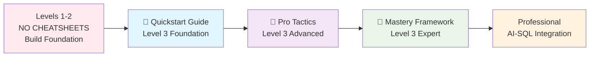
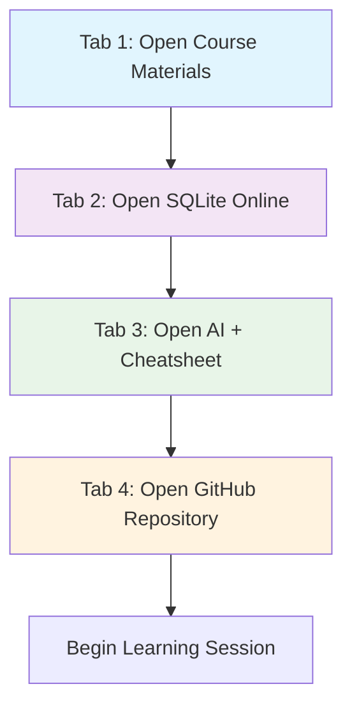
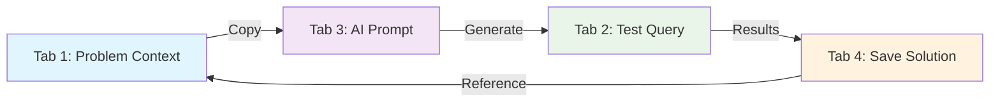



# 🏢 Tab 3: AI Co-pilot Cheatsheets - Browser Office Integration

### 🎯 Quality Education for Anyone, Anywhere, Anytime — 💫 with Comfort, Convenience at no Cost

---

## 📜 **About This Directory**

Welcome to your **Tab 3: The Consultant** cheatsheet library! These resources transform your AI assistant into a powerful SQL learning co-pilot within your Browser Office workflow.

### **🎫 Access Policy: Level 3 Only**
**Important:** These cheatsheets are **restricted until Level 3** of the course. This intentional restriction helps you build strong foundational skills without relying on shortcuts.

### **Why This Restriction?**
- **Builds Strong Foundation**: Struggling with syntax leads to deeper understanding
- **Develops Problem-Solving**: Learn to think through problems rather than look up answers
- **Improves Retention**: The effort to recall syntax strengthens memory
- **Better AI Collaboration**: You'll write better prompts when you understand fundamentals

---

## 🏢 **The Browser Office: Your Universal Launchpad**

**🚀 Kickstart: Any Computer, Any Browser, Anytime.**  
**🌍 Destination: Any country, Any city, Any Platform.**

### **Your Tab 3: The Consultant**
This cheatsheet library is specifically designed for **Tab 3** in your optimal learning workspace:

```
YOUR BROWSER OFFICE - FOUR TABS:
├── Tab 1: 📚 The Map     → Course Materials (This Repository)
├── Tab 2: 🏭 The Factory → SQLite Online (Practice Environment)
├── Tab 3: 🤖 The Consultant → AI Co-pilot (THIS LIBRARY)
└── Tab 4: 🗄️ The Vault  → GitHub (Progress Portfolio)
```

### **The Professional Ritual:**
Before each learning session, open tabs in this exact order:
1. **Tab 1 (The Map)** - Review learning objectives and course materials
2. **Tab 2 (The Factory)** - Prepare your SQL practice environment
3. **Tab 3 (The Consultant)** - **Open AI tool + these cheatsheets** ← **You are here**
4. **Tab 4 (The Vault)** - Ready your GitHub repository for note-taking

---

## 📊 **Cheatsheet Learning Path**

### **Progressive Skill Development**
These cheatsheets follow a structured progression from foundational to expert-level skills:



### **📘 Quickstart Guide** *(Beginner - Foundation)*
**Perfect for:** Level 3 learners starting AI integration
- Basic prompt patterns for SQL
- Simple debugging techniques
- Concept explanation templates
- Common pitfalls and solutions
- Learning-focused prompts

### **🚀 Pro Tactics** *(Intermediate - Advanced)*
**Perfect for:** Level 3 learners ready for systematic approaches
- Schema Anchor Technique (critical for accuracy)
- Socratic Prompting (deep learning approach)
- Multi-Model Strategies (ChatGPT, Claude, Gemini)
- Prompt Evolution Tracking (systematic improvement)
- Role-Playing Prompts (interview practice)

### **🎯 Mastery Framework** *(Expert - Production)*
**Perfect for:** Level 3 learners pursuing expert proficiency
- Full Browser Office integration workflows
- Team collaboration and teaching others
- Industry-specific prompt libraries
- Advanced testing and validation frameworks
- Cross-platform SQL optimization

### **📚 SQL Quick Reference** *(Syntax Guide)*
**Perfect for:** Quick syntax checks during complex query writing
- SQL commands and syntax
- Function references
- JOIN patterns and examples
- Performance optimization tips

---

## 🎯 **Which Cheatsheet Should You Use?**

### **Based on Your Current Level:**

| Level | Recommended Cheatsheet | Focus | Browser Office Integration |
| :--- | :--- | :--- | :--- |
| **Level 1-2** | ❌ **No cheatsheets** | Build foundation | Basic Tab 3 use without reference |
| **Level 3 Start** | **[📘 Quickstart Guide](tab3_co-pilot_quickstart.md)** | Foundation patterns | Basic Tab 3 workflows with guidance |
| **Level 3 Intermediate** | **[🚀 Pro Tactics](tab3_co-pilot_pro_tactics.md)** | Advanced techniques | Multi-tab collaboration strategies |
| **Level 3 Advanced** | **[🎯 Mastery Framework](tab3_co-pilot_mastery.md)** | Expert proficiency | Full Browser Office optimization |
| **All Level 3** | **[📚 SQL Quick Reference](sql_cheatsheet.md)** | Syntax reference | Quick lookup during query writing |

### **Based on Your Task:**

| Task Type | Recommended Cheatsheet | Section to Use |
| :--- | :--- | :--- |
| **Basic SQL questions** | Quickstart Guide | SQL Generation Patterns |
| **Complex query debugging** | Pro Tactics | Debugging & Error Recovery |
| **Learning new concepts** | Quickstart Guide | Learning-Focused Prompts |
| **Production optimization** | Pro Tactics | Query Optimization Techniques |
| **Schema design help** | Pro Tactics | Schema Anchor Technique |
| **Interview preparation** | Pro Tactics | Role-Playing Prompts |
| **Syntax quick check** | SQL Quick Reference | Command Reference |

---

## 🔄 **Browser Office Integration Workflow**

### **Daily Learning Session Setup:**


### **Prompt Engineering Workflow:**
1. **Identify problem** in Tab 1 (Course materials)
2. **Select appropriate cheatsheet** pattern
3. **Apply schema anchor** if working with specific database
4. **Generate query** using AI in Tab 3
5. **Test immediately** in Tab 2 (SQLite Online)
6. **Refine prompt** based on results
7. **Save successful prompt** to Tab 4 (GitHub)

### **Weekly Learning Cycle:**
| Day | Focus | Cheatsheet Section | Time |
| :--- | :--- | :--- | :--- |
| **Monday** | New concept learning | Quickstart: Concept Explanation | 30 min |
| **Tuesday** | Practice exercises | Quickstart: SQL Generation | 45 min |
| **Wednesday** | Debugging practice | Pro Tactics: Error Recovery | 30 min |
| **Thursday** | Advanced patterns | Pro Tactics: Multi-Model Strategy | 45 min |
| **Friday** | Review & portfolio | Mastery: Prompt Journaling | 30 min |
| **Weekend** | Project work | All sections as needed | Flexible |

---

## 📝 **Prompt Journaling & Progress Tracking**

### **The Prompt Journal Template:**
Create a `prompt_journal.md` file in your GitHub repository:

```markdown
## Prompt Journal Entry

**Date:** [YYYY-MM-DD]
**Problem:** [What you were trying to solve]
**Initial Prompt:** [Your first attempt]
**Result:** [What the AI gave you]
**Issues:** [Problems with the response]
**Refined Prompt:** [Your improved version]
**Final Result:** [Perfect output]
**Key Learnings:** [What made the difference]
**Pattern to Reuse:** [Save as template]
```

### **Personal Prompt Library Structure:**
Organize your successful prompts in GitHub:

```
my-sql-learning/
├── prompts/
│   ├── daily_practice/          # Regular use prompts
│   │   ├── sql_generation.md
│   │   ├── concept_explanation.md
│   │   └── debugging_patterns.md
│   ├── schema_templates/        # Schema anchors for databases
│   │   ├── ecommerce_schema.md
│   │   ├── hr_schema.md
│   │   └── inventory_schema.md
│   ├── project_specific/        # Custom prompts for projects
│   └── ai_model_guides/         # Model-specific strategies
│       ├── chatgpt_patterns.md
│       ├── claude_patterns.md
│       └── gemini_patterns.md
└── prompt_journal.md            # Your learning and refinement notes
```

### **Success Metrics to Track:**
| Metric | Beginner Target | Intermediate Target | Expert Target |
| :--- | :--- | :--- | :--- |
| **First-try success rate** | 40-50% | 70-80% | 90%+ |
| **Average prompt iterations** | 3-4 | 1-2 | 0-1 |
| **Query complexity level** | Basic SELECT/WHERE | Complex JOINs | Production optimization |
| **Prompt refinement time** | 10-15 min | 5-10 min | 1-5 min |
| **Personal library size** | 5-10 prompts | 20-30 prompts | 50+ organized prompts |

---

## 🎯 **Learning Philosophy & Best Practices**

### **The "Struggle First" Approach:**
> "First learn to walk without crutches. Then use tools to run faster."

**Your journey progression:**
1. **Level 1-2: Struggle & Learn** - Build neural pathways through effort
2. **Level 3 Start: Guided Support** - Use cheatsheets as training wheels
3. **Level 3 Advanced: Accelerated Learning** - Apply patterns efficiently
4. **Post-Course: Expert Integration** - Internalize patterns as intuition

### **Cheatsheet Etiquette:**
✅ **Do:**
- Use as reference after trying to solve problems yourself
- Adapt patterns to your specific context
- Document successful variations in your personal library
- Share improvements with the learning community

❌ **Don't:**
- Copy prompts without understanding them
- Use as crutch to avoid learning fundamentals
- Share without testing and validation
- Rely exclusively without developing your own style

---

## 🔧 **Integration with Course Tools**

### **Related Resources:**
These cheatsheets work alongside other course tools:

| Resource | Location | Purpose | When to Use |
| :--- | :--- | :--- | :--- |
| **Database Tools** | `tools/database_tools.md` | SQL platforms & editors | With Tab 2 (Factory) |
| **AI Development Tools** | `tools/ai_development_tools.md` | AI assistant comparisons | Choosing your Tab 3 tool |
| **Learning Reference Tools** | `tools/learning_reference_tools.md` | Supplementary resources | Additional learning support |
| **Practice Databases** | `sample_databases/` | Hands-on datasets | Testing queries from prompts |

### **Complete Browser Office Setup:**
```
🎯 FULL LEARNING ENVIRONMENT:
├── Tab 1: Course Materials + Learning Reference Tools
├── Tab 2: SQLite Online + Database Tools
├── Tab 3: AI Assistant + THESE CHEATSHEETS
└── Tab 4: GitHub + Personal Prompt Library
```

---

## 🚨 **Troubleshooting & Common Issues**

### **When AI Doesn't Understand:**
1. **Check schema anchor** - Did you provide complete table structures?
2. **Simplify the prompt** - Break complex requests into steps
3. **Switch AI models** - Try ChatGPT → Claude → Gemini
4. **Provide examples** - Use few-shot learning with similar queries

### **When Queries Don't Work:**
1. **Test in SQLite first** - Validate before complex optimization
2. **Check syntax differences** - SQL variations between platforms
3. **Review error messages** - AI might misinterpret SQL errors
4. **Simplify and rebuild** - Start with basic query, add complexity gradually

### **When Progress Feels Slow:**
1. **Review your prompt journal** - Track improvements over time
2. **Focus on one pattern** - Master it before moving to next
3. **Join study groups** - Learn from others' prompt techniques
4. **Take breaks** - Return with fresh perspective

---

## 📈 **Skill Development Roadmap**

### **Month 1 (Level 3 Start):**
- Week 1-2: Master Quickstart Guide patterns
- Week 3-4: Build personal prompt library (10+ patterns)
- Success Metric: 60% first-try success rate

### **Month 2 (Level 3 Intermediate):**
- Week 5-6: Integrate Pro Tactics into daily workflow
- Week 7-8: Develop specialized prompt sets for projects
- Success Metric: 75% first-try success rate

### **Month 3 (Level 3 Advanced):**
- Week 9-10: Apply Mastery Framework to complex problems
- Week 11-12: Create teaching materials from your experience
- Success Metric: 85% first-try success rate, personal library of 40+ prompts

### **Post-Course (Professional):**
- Continue expanding personal library
- Contribute to community prompt collections
- Mentor other learners in prompt engineering
- Success Metric: 90%+ first-try success, recognized as prompt expert

---

## 🌟 **Advanced Integration Techniques**

### **The Three-AI Strategy:**
For complex problems, use multiple AI models:
1. **ChatGPT 4o** - Generate initial approaches and creative solutions
2. **Claude 3.5 Sonnet** - Analyze logic and provide detailed reasoning
3. **Google Gemini** - Handle long context and complex schemas

### **Cross-Tab Synchronization:**


### **Browser Automation Tips:**
- **Bookmark cheatsheets** in your Browser Office tab group
- **Use browser profiles** to separate learning from personal browsing
- **Save tab groups** to restore your Browser Office quickly
- **Use shortcuts** (Ctrl+1, Ctrl+2, Ctrl+3, Ctrl+4) to switch tabs efficiently

---

## 🚀 **Getting Started Now**

### **For New Level 3 Learners:**
1. **Start with:** [📘 Quickstart Guide](tab3_co-pilot_quickstart.md)
2. **Practice:** One pattern per day for two weeks
3. **Build:** Your personal prompt library from Day 1
4. **Review:** Weekly progress in your prompt journal

### **For Intermediate Level 3 Learners:**
1. **Review:** [📘 Quickstart Guide](tab3_co-pilot_quickstart.md) as refresher
2. **Master:** [🚀 Pro Tactics](tab3_co-pilot_pro_tactics.md) over 4 weeks
3. **Apply:** To your current course projects immediately
4. **Share:** Successful patterns with study groups

### **For Advanced Level 3 Learners:**
1. **Integrate:** [🎯 Mastery Framework](tab3_co-pilot_mastery.md) into workflow
2. **Optimize:** Your Browser Office setup for efficiency
3. **Teach:** Prompt engineering to other learners
4. **Contribute:** To the community prompt library

---

## 📚 **Additional Resources**

### **Course Integration:**
- **[Level 1-2 Materials](../../Level-1-beginner/)** - Foundation without cheatsheets
- **[Level 3 Materials](../../Level-3-advanced/)** - Advanced work with cheatsheets
- **[Practice Databases](../../sample_databases/)** - Test your prompted queries
- **[Setup Guides](../../Setup/)** - Configure your Browser Office

### **External References:**
- **[Mermaid Live Editor](https://mermaid.live)** - Test and create diagrams
- **[SQLite Online](https://sqliteonline.com)** - Practice SQL in browser
- **[GitHub Learning Lab](https://lab.github.com)** - Master version control
- **[AI Model Updates](https://github.com/EgoAlpha/prompt-in-context-learning)** - Stay current with AI capabilities

---

## 🏆 **Success Stories & Testimonials**

### **From Previous Learners:**
> "The schema anchor technique reduced my AI errors by 90%. Now I can focus on solving problems instead of fixing column names." - *Maria, Data Analyst*

> "Socratic prompting transformed how I learn. Instead of just getting answers, I now understand the 'why' behind SQL patterns." - *David, Career Changer*

> "The Browser Office workflow made learning possible with my busy schedule. I can pick up anywhere and continue immediately." - *Sarah, Working Parent*

> "Building my prompt library became a portfolio piece that impressed interviewers. They loved seeing my systematic approach." - *James, Recent Graduate*

---

## 🔄 **Continuous Improvement & Updates**

### **Version History:**
- **v1.0** (Current): Initial cheatsheet library release
- **v1.1** (Planned): Community-contributed patterns
- **v2.0** (Future): Interactive prompt testing tools

### **How to Contribute:**
1. **Test patterns** in your learning journey
2. **Share improvements** with the course community
3. **Submit new patterns** that work well for you
4. **Report issues** with existing patterns

### **Update Schedule:**
- **Monthly:** Minor updates and new examples
- **Quarterly:** New patterns and techniques
- **Annually:** Major framework revisions

---

## ✅ **Quick Start Checklist**

### **First Week with Cheatsheets:**
- [ ] Read this overview document completely
- [ ] Choose your starting cheatsheet based on level
- [ ] Create `prompt_journal.md` in your GitHub repository
- [ ] Set up your Browser Office with all four tabs
- [ ] Practice one pattern daily and document results
- [ ] Join course community for prompt sharing
- [ ] Set personal success metrics for tracking

### **First Month Goals:**
- [ ] Master 10+ core prompt patterns
- [ ] Achieve 60% first-try success rate
- [ ] Build personal library of 20+ prompts
- [ ] Complete one project using cheatsheet techniques
- [ ] Share one successful pattern with community

---

## 🏢 **The Browser Office Promise**

Remember: Your AI co-pilot in **Tab 3** works in perfect harmony with:
- **Tab 1**: Your learning map (course materials)
- **Tab 2**: Your practice factory (SQLite Online)  
- **Tab 4**: Your progress vault (GitHub portfolio)

**Together, they create your universal learning launchpad — accessible from any computer, any browser, anywhere in the world.**

**🚀 Your learning journey accelerates here in Tab 3. Use these cheatsheets not as crutches, but as catalysts for deeper understanding and professional growth.**

---

*Part of our mission for 🎯 Quality Education for Anyone, Anywhere, Anytime — 💫 with Comfort, Convenience at no Cost.*

*Tab 3 Co-pilot Cheatsheets v1.0 - Your Browser Office Consultant Toolkit*