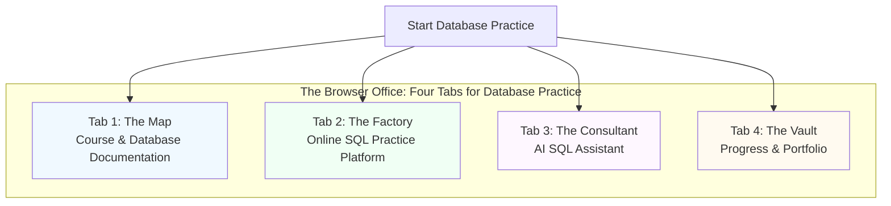

# Sample Databases

### 🎯 Quality Education for Anyone, Anywhere, Anytime — 💫 with Comfort, Convenience at no Cost

---

## 🗃️ **Browser-Compatible Practice Databases**
**Upload these database files to online SQL platforms for immediate practice—no software installation needed.**

---

## Practice with Real Data
These sample databases provide ready-to-use data for practicing SQL queries and following instructor demonstrations across different learning levels—**accessible through your web browser.**

---

## 🏢 **The Browser Office: Your Universal Launchpad**
**🚀 Kickstart: Any Computer, Any Browser, Anytime.**  
**🌍 Destination: Any country, Any city, Any Platform.**

This section defines the consistent, portable workspace that enables database practice anywhere.

### **The Four Essential Tabs for Database Practice**

### **Standard Browser Setup for Database Practice**

| Tab | Purpose | Tools & Examples for Database Practice |
| :--- | :--- | :--- |
| **1: The Map** | Learning content & navigation | This document, course materials, database documentation |
| **2: The Factory** | Hands-on practice with databases | [SQLite Online](https://sqliteonline.com/), [SQL Fiddle](http://sqlfiddle.com/), [SQLite Viewer](https://inloop.github.io/sqlite-viewer/) |
| **3: The Consultant** | AI assistance & explanations | ChatGPT, Claude, Gemini for SQL query help and explanations |
| **4: The Vault** | Progress tracking & portfolio | GitHub Profile, notes, saved queries, progress tracking |

### **Using the Factory Tab for Database Practice**

#### **Simple 2-Step Browser Access:**
1. **Upload** database file to online SQL platform:
   - [SQLite Online](https://sqliteonline.com/) (recommended)
   - [SQL Fiddle](http://sqlfiddle.com/)
   - [SQLite Viewer](https://inloop.github.io/sqlite-viewer/)
2. **Practice** using the browser-based SQL editor

#### **No Installation Required:**
- **No local SQLite installation**
- **No desktop software needed**
- **Access from any computer with internet**

> **Note for Level 3 (Advanced):** For PostgreSQL and SQL Server practice, use cloud platforms as specified in the platform folders. These are also accessible via browser.

---

## Available Practice Databases

### Training Institution Sample (Levels 1-2)
- **File**: `training_institution_sample.db`
- **Purpose**: Student enrollment and course management system
- **Browser Access**: Upload to online SQL platforms for practice
- **Tables**: students, courses, enrollments, payments
- **Records**: 8 students, 6 courses, 15 enrollments, 15 payments
- **Use Cases**: Student tracking, course analytics, payment management
- **Used For**: Instructor demonstrations in Level 1 and Level 2 modules
- **Platform**: SQLite file for browser-based SQL tools

### E-Store Basic (Level 1 - Beginner)
- **File**: `level1_estore_basic.db`
- **Purpose**: Fundamental e-commerce operations for beginners
- **Browser Access**: Upload to SQLite Online for hands-on practice
- **Tables**: Customers, Products, Orders, Order_Items
- **Records**: 5 customers, 5 products, 5 orders, 6 order items
- **Use Cases**: Basic SELECT queries, WHERE filtering, simple JOINs, aggregation functions
- **Used For**: Level 1 practice exercises and foundational query building
- **Platform**: SQLite file for browser-based practice

### E-Store Intermediate (Level 2 - Intermediate)
- **File**: `level2_estore_intermediate.db`
- **Purpose**: Enhanced e-commerce with business logic and analytics
- **Browser Access**: Upload to browser SQL platforms for intermediate exercises
- **Tables**: Customers, Products, Orders, Order_Items
- **Records**: 5 customers, 6 products, 9 orders, 16 order items
- **Use Cases**: Complex joins, subqueries, window functions, transaction management, business analytics
- **Used For**: Level 2 practice exercises and intermediate query optimization
- **Platform**: SQLite file for browser-based SQL tools

### Advanced Platform-Specific Databases (Level 3)
**Note**: For Level 3 (Advanced), platform-specific implementations are provided in separate folders:
- **E-Store Advanced**: `level3_estore_advanced/` folder contains multi-platform implementations for practice
- **Training Institution Advanced**: `training_institution_advanced/` folder contains multi-platform implementations for demonstration

**Browser Access for Level 3:**
- **PostgreSQL**: Use cloud platforms like [Neon.tech](https://neon.tech/) or [Supabase](https://supabase.com/)
- **SQL Server**: Use [Azure SQL Database](https://azure.microsoft.com/) cloud service
- **SQLite**: Continue using online SQL platforms

These advanced databases are designed for production-ready skills development across different SQL platforms—all accessible through browser-based cloud services.

---

## Database Progression Path

### 🆕 Level 1 Beginner
- **Practice Database**: `level1_estore_basic.db`
- **Demo Database**: `training_institution_sample.db`
- **Focus**: Foundational SQL concepts, basic queries
- **Platform**: SQLite via online platforms (browser-only)
- **Access**: Upload to SQLite Online or similar web tool

### 📈 Level 2 Intermediate  
- **Practice Database**: `level2_estore_intermediate.db`
- **Demo Database**: `training_institution_sample.db`
- **Focus**: Advanced query techniques, optimization
- **Platform**: SQLite via browser-based tools
- **Access**: Use same online platforms as Level 1

### 🚀 Level 3 Advanced
- **Practice Databases**: Platform-specific files in `level3_estore_advanced/` folder
- **Demo Databases**: Platform-specific files in `training_institution_advanced/` folder
- **Focus**: Production-ready skills, multi-platform proficiency
- **Platforms**: SQLite (online), PostgreSQL (cloud), SQL Server (cloud)
- **Access**: Cloud platforms for enterprise database practice

---

## Learning Objectives

### E-Store Series:
- **Basic**: Master fundamental CRUD operations and simple queries (browser-based)
- **Intermediate**: Develop complex business logic and analytical queries (browser-based)
- **Advanced**: Implement enterprise-grade solutions with platform-specific optimizations (cloud-based)

### Training Institution Series:
- **Sample**: Follow along with guided examples and demonstrations (Levels 1-2, browser-based)
- **Advanced**: Platform-specific demonstrations and comparisons (Level 3, cloud-based)

---

*Part of our mission for 🎯 Quality Education for Anyone, Anywhere, Anytime — 💫 with Comfort, Convenience at no Cost.*