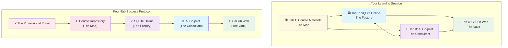
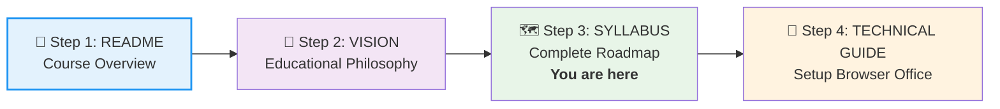




# 🗄️🤖 SQL & GenAI Course
**🎯 Quality Education for Anyone, Anywhere, Anytime — 💫 with Comfort, Convenience at no Cost**

## 🗺️ COMPLETE SYLLABUS: Your Professional Roadmap
---
**A 20-Week Journey from Beginner to Production-Ready Expert**

---

## 🧗 **The Learning Journey**

### **🏁 Level 1: The SQL Apprentice (Foundations)**
**Weeks:** 1-6  
**Focus:** Mastering the "Sentence" of SQL and building logical muscle memory  
**Workstation:** SQLite Online + [`level1_estore_basic.db`](../Resources/sample_databases/level1_estore_basic.db)  
**Setup Time:** Under 15 minutes  
**Outcome:** Write real SQL from day one, build HR Analytics Dashboard.

---

### **🧭 Your Learning Compass for Level 1, Modules 1-4**

**Journey Stage:** Foundation Building  
**AI Co-pilot Role:** Conceptual Tutor Only  
**Primary Goal:** Build raw SQL skills and logical thinking without automation

**What This Means for You:**
- **🧠 Mindset Focus:** "I can figure this out on my own"
- **🤖 AI Guidelines:** ✅ Ask "What does this term mean?" ❌ **Do not ask** "Write SQL for me"
- **🎯 Success Metric:** Write basic queries from memory and explain the logic

> **Philosophical Anchor:** "Foundation first, AI next. We build genuine competence before using shortcuts."

---

- **Module 1**: Introduction to Databases & AI Co-pilot (concepts only)
- **Module 2**: Basic Retrieval (SELECT, WHERE)
- **Module 3**: Sorting, Aggregation, and Grouping
- **Module 4**: Joining Tables

---

### **🧭 Your Learning Compass for Level 1, Module 5**

**Journey Stage:** AI Integration  
**AI Co-pilot Role:** Code Accelerator  
**Primary Goal:** Learn to use AI as a productivity tool for SQL

**What This Means for You:**
- **🧠 Mindset Focus:** "I've earned the right to use powerful tools"
- **🤖 AI Guidelines:** ✅ Generate, optimize, and debug code ✅ Still understand the logic
- **🎯 Success Metric:** Convert business questions to AI prompts that produce working SQL

> **Philosophical Anchor:** "Now that you have the foundation, let's accelerate responsibly."

---

- **Module 5**: GenAI Walkthrough & Prompt Engineering  
  *Earn the right to use AI for acceleration. Master the **Socratic AI Method™** to make AI teach logic instead of just giving answers.*

---

### **🧭 Your Learning Compass for Level 1, Module 6**

**Journey Stage:** Professional Synthesis  
**AI Co-pilot Role:** Professional Partner  
**Primary Goal:** Synthesize all learned concepts by analyzing complete projects and applying them independently

**What This Means for You:**
- **🧠 Mindset Focus:** "I can deconstruct and learn from professional code"
- **🤖 AI Guidelines:** ✅ Use AI to help understand provided solutions ✅ Apply concepts to build your own projects
- **🎯 Success Metric:** Analyze the provided **HR Analytics Dashboard** and the **Bonus Project: University Course Manager**, then successfully build your **independent projects** (Budget Tracker & Nutrition Calculator)

> **Philosophical Anchor:** "Learning to read professional code is as important as writing it. Analyze, then create."

---

- **Module 6**: **Project Analysis**: HR Analytics Dashboard (SQLite)  
  *Study the complete implementation provided. Then apply these concepts to build your independent projects from the briefs in the Projects folder.*

---

### **🔄 Level 2: The SQL Craftsman (Intermediate)**
**Weeks:** 7-12  
**Focus:** Connecting disparate data sources and complex business logic  
**Workstation:** SQLite Online + [`level2_estore_intermediate.db`](../Resources/sample_databases/level2_estore_intermediate.db)  
**Setup Time:** Already configured  
**Outcome:** Design complex systems with CTEs and Window Functions.

---

### **🧭 Your Learning Compass for Level 2**

**Journey Stage:** Accelerated Learning  
**AI Co-pilot Role:** Productivity Multiplier  
**Primary Goal:** Apply AI to handle complexity while you focus on architecture

**What This Means for You:**
- **🧠 Mindset Focus:** "I can direct AI to solve complex problems"
- **🤖 AI Guidelines:** ✅ Full code generation from Module 1 ✅ Use AI for complex query handling
- **🎯 Success Metric:** Architect multi-table systems with AI assistance

> **Philosophical Anchor:** "Leverage AI to focus on higher-level design and architecture."

---

- **Module 1**: Advanced Query Structuring (Subqueries, CTEs)
- **Module 2**: Window Functions for Analytics
- **Module 3**: Data Manipulation & Transactions
- **Module 4**: Database Architecture, DDL & Normalization
- **Module 5**: GenAI for Complex Query Generation

---

### **🧭 Your Learning Compass for Level 2, Module 6**

**Journey Stage:** Professional Synthesis  
**AI Co-pilot Role:** Professional Partner  
**Primary Goal:** Analyze enterprise-grade solutions and apply advanced concepts to independent development

**What This Means for You:**
- **🧠 Mindset Focus:** "I can reverse-engineer complex systems"
- **🤖 AI Guidelines:** ✅ Use AI to understand advanced implementations ✅ Apply architectural patterns to your own work
- **🎯 Success Metric:** Analyze the provided **Warehouse Inventory Management** system and the **Bonus Project: Event Ticketing System**, then successfully build your **independent projects** (SaaS Analytics & Fitness Center Management)

> **Philosophical Anchor:** "Advanced systems teach advanced thinking. Study, then architect."

---

- **Module 6**: **Project Analysis**: Warehouse Inventory Management (SQLite)  
  *Analyze the complete enterprise implementation provided. Then apply these architectural concepts to build your independent projects from the briefs in the Projects folder.*

---

### **🎖️ Level 3: The Data Architect (Advanced Paradigms)**
**Weeks:** 13-20  
**Focus:** Enterprise Production, Security, and Multi-Platform leadership  
**Workstation:** PostgreSQL (Cloud) / MSSQL (Enterprise) / Specialized Browser Setup  
**Additional Setup:** 15-20 minutes  
**Outcome:** Enterprise readiness + career specialization.

---

### **🧭 Your Learning Compass for Level 3**

**Journey Stage:** Professional Mastery  
**AI Co-pilot Role:** Specialized Tool  
**Primary Goal:** Leverage AI for cross-platform translation and enterprise optimization

**What This Means for You:**
- **🧠 Mindset Focus:** "I architect enterprise data solutions"
- **🤖 AI Guidelines:** ✅ Advanced AI integration from Module 1 ✅ Focus on enterprise problem-solving
- **🎯 Success Metric:** Design and implement production-grade database systems

> **Philosophical Anchor:** "Mastering AI as an integral part of professional database engineering."

---

- **Module 1**: Advanced Query Structuring (Multi-Platform)
- **Module 2**: Window Functions & Framing Analytics
- **Module 3**: Stored Procedures & Functions
- **Module 4**: Database Triggers & Automation
- **Module 5**: Advanced Optimization & Modern Data Types
- **Module 6**: GenAI for Database Development

---

### **🧭 Your Learning Compass for Level 3, Module 7**

**Journey Stage:** Capstone Integration  
**AI Co-pilot Role:** Enterprise Development Partner  
**Primary Goal:** Analyze a production-grade system and prepare for specialized career paths

**What This Means for You:**
- **🧠 Mindset Focus:** "I evaluate and learn from production systems"
- **🤖 AI Guidelines:** ✅ Use AI to understand complex enterprise patterns ✅ Prepare for specialization decisions
- **🎯 Success Metric:** Analyze the Supply Chain Risk Platform, then proceed to **Module 8** for career-aligned project guidance

> **Philosophical Anchor:** "The final system reveals the complete picture. Understand it, then choose your path."

---

- **Module 7**: **Capstone Analysis**: Supply Chain Risk Platform  
  *Study this complete production-grade implementation across multiple database platforms. This analysis prepares you for the career specialization guidance in Module 8.*

---

### **🧭 Your Learning Compass for Level 3, Module 8**

**Journey Stage:** Career Specialization  
**AI Co-pilot Role:** Career Strategy Advisor  
**Primary Goal:** Choose and pursue your specialized career path with guided project development

**What This Means for You:**
- **🧠 Mindset Focus:** "I am choosing my professional identity"
- **🤖 AI Guidelines:** ✅ Use AI for career path research and project planning ✅ Get guidance on specialization-specific challenges
- **🎯 Success Metric:** Select your specialization path and complete its guided projects with expert support

> **Philosophical Anchor:** "Your specialization is your professional signature. Choose wisely, build confidently."

---

- **Module 8**: **Career Crossroads & Project Guidance**: Choose Your Specialization  
  *This dedicated module provides career guidance and structured project support for your chosen specialization path (PostgreSQL, MSSQL, or Platform-Agnostic). You'll receive expert guidance on building projects aligned with your career goals.*

---

### **🚀 The Path to Specialization**
After Level 3, choose your expedition:

1. **🐘 Postgres Everest:** Advanced open-source database mastery
2. **⚡ MSSQL Championship:** Corporate enterprise environments
3. **🐋 Agnostic Ocean Quest:** Platform unification expertise

---

## 🧠 **The Learning Philosophy**
**Foundation First, AI Next** — We build a direct **Bridge to True Mastery**. 

**Why This Matters:** We deliberately withhold AI code generation in Modules 1-4 to prevent the **"hallucination of competence"** — where students mistake AI's capabilities for their own. This ensures your confidence is built on a rock-solid foundation of genuine skill.

**The Socratic AI Method™:** When AI is introduced in Module 5, you'll learn to use it as a **teaching partner**, not just a code generator. This method teaches you to *think* about problems, not just copy solutions.

**Phased AI Integration (Levels 1 & 2):**
- **Modules 1-4:** Build raw SQL skills (AI for concept explanations only)
- **Module 5:** Earn AI acceleration (Socratic prompting & code generation)
- **Module 6:** Professional workflow integration

**Level 3 Progression:**
- **All Modules:** Full AI integration from Module 1, focusing on advanced problem-solving and enterprise workflows.

This ensures your confidence is built on a rock-solid foundation of genuine skill, while preparing you for real-world professional environments where AI is an integral part of the workflow.

---

## 🏢 **The Browser Office: Your Universal Launchpad**
**🚀 Kickstart: Any Computer, Any Browser, Anytime.**  
**🌍 Destination: Any country, Any city, Any Platform.**

**Set up in under 15 minutes** (Levels 1-2):

| Tab | Tool | Purpose | Setup Time |
|-----|------|---------|------------|
| **📚 Tab 1** | **Course Repository** | The Map: Navigation & Materials | Immediate |
| **🏭 Tab 2** | **SQLite Online** | The Factory: Practice Environment | 2 minutes |
| **🤖 Tab 3** | **AI Co-pilot** | The Consultant: AI Assistance | 2 minutes |
| **🗄️ Tab 4** | **GitHub Web** | The Vault: Progress Tracking | 10 minutes |

> **Note for Level 3 Learners:** Advanced courses use a **specialized Browser Office configuration** with different tools. See Level 3 documentation for setup instructions.

### 🔄 **The Browser Office Workflow**



**💡 The Professional Ritual: Before starting any module, open your tabs in this order:**
1. **Course Repository** (The Map)
2. **SQLite Online** (The Factory)  
3. **AI Co-pilot** (The Consultant)
4. **GitHub Web** (The Vault)

---

## 🚦 **The Progression Legend**

To ensure you build a **"Data Brain"** and not just a **"Copy-Paste Habit,"** your access to AI tools evolves as you progress through the course:

### **Level 1: Building Genuine Competence**
- **Psychological Goal:** Develop **self-efficacy** through manual mastery
- **AI Access:** Concepts only (no code generation)
- **Focus:** Manual SQL mastery and logical thinking
- **Why:** Build cognitive foundation and prevent dependency
- **Outcome:** "I can solve this myself" mindset

### **Level 2: Earning Acceleration**
- **Psychological Goal:** Develop **professional efficiency**
- **AI Access:** Code generation and optimization
- **Focus:** Applying AI as a productivity multiplier
- **Why:** Learn to direct AI effectively for complex tasks
- **Outcome:** "Now I can work at professional speed"

### **Level 3: Professional Integration**
- **Psychological Goal:** Embrace **professional identity**
- **AI Access:** Full development workflow integration from Module 1
- **Focus:** Enterprise-level problem solving
- **Why:** Master AI as an integral part of professional workflow
- **Outcome:** "I am a data professional"

---

## 🏗️ **Professional Project Framework**

**Universal Project Blueprint:**
```
Projects/
├── 1-project-brief/         # Requirements & success criteria
├── 2-design-documentation/  # Architecture & system design
├── 3-datasets/             # Real-world data workflows
├── 4-solution-framework/   # Implementation support
└── 5-deliverables/         # Enterprise-grade outputs
```

**Progressive Implementation:**
- **🏁 Level 1:** Complete guided support
- **🚀 Level 2:** Partial frameworks for guided independence
- **💼 Level 3:** Professional independence with minimal scaffolding

---

## 🌟 **Your Learning Experience**

- **🚀 Immediate Start:** First query in under 10 minutes
- **💼 Professional Relevance:** Direct workplace translation
- **🤖 AI Partnership:** GenAI as professional tool (phased integration)
- **🌐 Anywhere Access:** Just need a browser

**Weekly Commitment:** 4-6 focused hours

---

## 🎯 **Revolutionary Learning Architecture**

**Progressive Platform Strategy:**
- **Levels 1-2:** SQLite Only (perfect for fundamentals)
- **Level 3:** PostgreSQL or SQL Server (cloud-based enterprise)

**Dual-Dataset Approach:**
- **Training Database:** Guided examples and demonstrations
- **Practice Database:** Hands-on skill application in real-world contexts

---

## 🏗️ **The Full Enterprise Database Ecosystem**
This course utilizes a **Dual-Database Strategy** (Training vs. Practice) across three distinct **Architectural Paradigms**. You will master how SQL behavior, syntax, and optimization change based on the environment.

### 🏁 **Levels 1 & 2: Browser-Based Mastery (SQLite)**
The foundation focuses on **Local/Embedded Paradigms**. We use SQLite for its zero-config nature, allowing you to master core SQL syntax without environmental friction.

- **📖 Training:** [`training_institution_sample.db`](../Resources/sample_databases/training_institution_sample.db)
- **🏋️ Practice (Level 1):** [`level1_estore_basic.db`](../Resources/sample_databases/level1_estore_basic.db)
- **🏋️ Practice (Level 2):** [`level2_estore_intermediate.db`](../Resources/sample_databases/level2_estore_intermediate.db)

### 🎖️ **Level 3: The Three Specialized Paradigms**
In Level 3, the curriculum transitions to professional-grade environments. You will interact with these three specific streams, using dedicated files designed for each engine's unique capabilities.

#### 1. **The SQLite "Single-User/Embedded" Paradigm**
Focused on **Edge Computing & Local Storage**. This paradigm is essential for mobile developers and software engineers building applications where the database lives on the client's device.

- **📖 Training:** [`training_institution_sqlite_singleuser.db`](../Resources/sample_databases/training_institution_advanced/training_institution_sqlite_singleuser.db)
- **🏋️ Practice:** [`level3_estore_sqlite_singleuser.db`](../Resources/sample_databases/level3_estore_advanced/level3_estore_sqlite_singleuser.db)

**Core Focus:** File-based performance, lightweight schema design, and local data persistence.

#### 2. **The PostgreSQL "Procedural" Paradigm (The Mountaineer)**
Focused on **Open-Source Enterprise Systems**. This is the world of high-concurrency, modern web backends, and advanced data types.

- **📖 Training:** [`training_institution_Procedural-SQL-Postgres.sql`](../Resources/sample_databases/training_institution_advanced/training_institution_Procedural-SQL-Postgres.sql)
- **🏋️ Practice:** [`level3_estore_Procedural-SQL-Postgres.sql`](../Resources/sample_databases/level3_estore_advanced/level3_estore_Procedural-SQL-Postgres.sql)

**Core Focus:** Mastering PL/pgSQL, JSONB for semi-structured data, and complex Database Triggers for automated business logic.

#### 3. **The MSSQL "Transact" Paradigm (The Racing Circuit)**
Focused on **Corporate & Financial Enterprise Systems**. This is the ecosystem of massive data centers, rigorous auditing, and deep Azure Cloud integration.

- **📖 Training:** [`training_institution_Transact-SQL-MSSQL.sql`](../Resources/sample_databases/training_institution_advanced/training_institution_Transact-SQL-MSSQL.sql)
- **🏋️ Practice:** [`level3_estore_Transact-SQL-MSSQL.sql`](../Resources/sample_databases/level3_estore_advanced/level3_estore_Transact-SQL-MSSQL.sql)

**Core Focus:** Mastering T-SQL (Transact-SQL), Stored Procedures, and Enterprise-grade Execution Plans.  

**🌊 Platform-Agnostic Specialization Path:** This advanced career track involves:
*   **Mastering Both Streams:** Achieving deep expertise in both PostgreSQL and MSSQL.
*   **Becoming a Unification Architect:** Learning to design systems that work across different database platforms.
*   **Developing Migration Expertise:** Gaining the ability to migrate data and logic between platforms with expert knowledge.
*   **Solving Enterprise Challenges:** Tackling complex integration problems that require knowledge beyond a single platform.

---

## **Learning Journey Through Business Domains**

| Level | Project | Domain | Database |
| :--- | :--- | :--- | :--- |
| **🎯 Level 1** | HR Analytics Dashboard | People Operations | SQLite |
| **🚚 Level 2** | Warehouse Inventory Management | B2B Logistics | SQLite |
| **🌐 Level 3** | Supply Chain Risk Platform | Business Intelligence | PostgreSQL/SQL Server |

**Progression:** Single-User → Business Systems → Enterprise Platforms

---

## 💼 **Your Professional Portfolio Strategy**

You don't just "complete" this course; you build a **Vault**. Every Level ends with a project formatted for your GitHub portfolio.

- **9+ Projects total:** 3 Major Capstones + 6 Independent Briefs
- **Proof of Skill:** Show employers you can handle HR, Warehouse, and Supply Chain data
- **AI-Native:** Demonstrate that you can lead AI to solve enterprise problems

---

## 🚀 **The Future-Ready Advantage**

**Career preparation for AI-powered workplace:**
- 🎯 **Job-Ready Skills** across major databases
- 🤖 **AI Collaboration** as development partner (with deliberate progression)
- 💻 **Zero-Friction Learning** (browser-only)
- 📊 **9+ Portfolio Projects** with business value

### **Your Transformation**
1. **Month 1-2:** SQL foundations with instant feedback (AI concepts only)
2. **Month 3-4:** Advanced skills with earned AI acceleration
3. **Month 5-6:** Enterprise platforms + production projects
4. **Result:** Database professional ready for opportunities

---

## ⏳ **The Weekly Ritual**

To succeed, we recommend a **4–6 hour weekly rhythm**:

1. **📚 Tab 1 (The Map):** 45 mins — Study the concept
2. **🏭 Tab 2 (The Factory):** 3 hours — Hands-on struggle and practice
3. **🤖 Tab 3 (The Consultant):** 45 mins — Clarify doubts or (later) optimize code
4. **🗄️ Tab 4 (The Vault):** 30 mins — Save your work to GitHub

---

## 🧭 **The Transformational Journey**

### **Phase 1: Foundation (Weeks 1-4)**
**Psychological State:** Building **self-efficacy**  
**Technical Focus:** Manual SQL mastery  
**Mindset Shift:** "I can figure this out on my own"

### **Phase 2: Acceleration (Week 5)**
**Psychological State:** Developing **professional efficiency**  
**Technical Focus:** Intelligent AI integration  
**Mindset Shift:** "Now I can work at professional speed"

### **Phase 3: Synthesis (Week 6)**
**Psychological State:** Embracing **professional identity**  
**Technical Focus:** Complete project delivery  
**Mindset Shift:** "I am a data professional"

---

## 🚀 **GETTING STARTED: YOUR LEARNING PATH**

### **Recommended Navigation Sequence:**



### **Navigate Based on Your Needs:**
- **Understand the Philosophy** → [**VISION WITH MISSION**](VISION.md)
- **See the Complete Roadmap** → [**COMPLETE SYLLABUS**](SYLLABUS.md)
- **Prepare Your Browser Office Workspace** → [**TECHNICAL GUIDE**](Setup/TECHNICAL_GUIDE_L1L2.md)

*Use the links above to follow the recommended sequence or jump directly to what you need.*

---

*Part of our mission for 🎯 Quality Education for Anyone, Anywhere, Anytime — 💫 with Comfort, Convenience at no Cost.*

*A 19-year pedagogical framework for the next generation of data leaders.*


