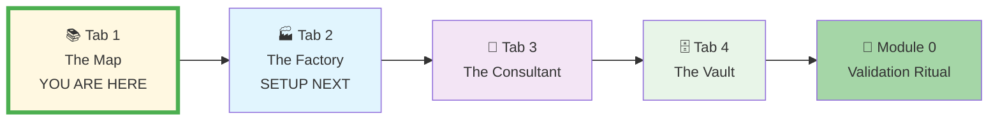
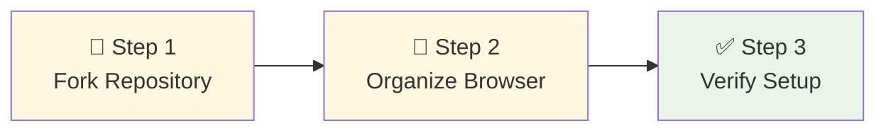
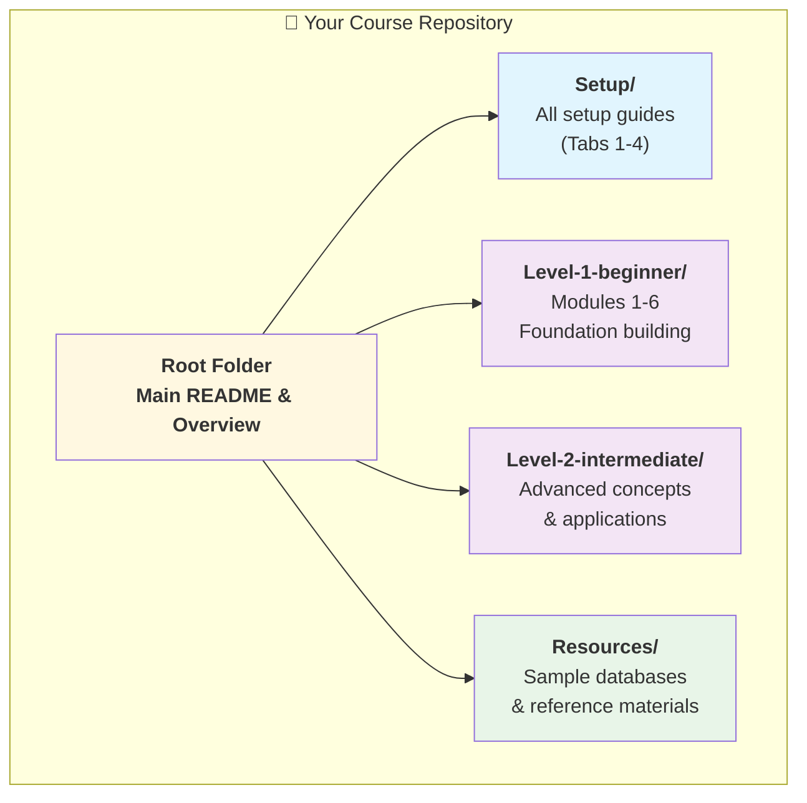
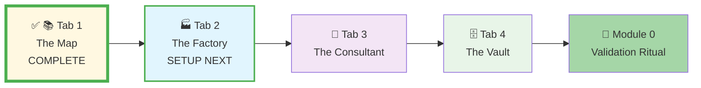

# 🗄️🤖 SQL & GenAI Course
**🎯 Quality Education for Anyone, Anywhere, Anytime — 💫 with Comfort, Convenience at no Cost**

## 📚 **Tab 1: The Map - GitHub Setup Guide**
---

## 📚 **The Map's Purpose**
Tab 1 is your **permanent, personalized navigation system** for the entire course. This repository serves as your central hub for accessing all course instructions, examples, and learning materials. Setting this up correctly means you'll always have the right directions for your SQL journey.

**The Map (Tab 1)** is your dedicated reference library and course navigation system, accessible via `Ctrl+1` / `Cmd+1`.

---

### **📍 Your Setup Journey - Tab 1 Context**
**📌 You are here: Setting up Tab 1 - The Map**

**Journey Goal:** Complete all four tabs + Module 0 validation to master your Browser Office.

---

## 🎯 **Why GitHub for This Course?**

- ✅ **Zero-Footprint**: Access course materials from any browser—no installs.
- ✅ **Universal Access**: Works on any computer (Windows, Mac, Linux, Chromebook).
- ✅ **Version Control**: Your forked copy remains stable even if the main repository updates.
- ✅ **Personal Annotations**: Add notes without affecting the original materials.
- ✅ **Offline Access**: Clone locally for study without internet (advanced option).

> **💡 The Learning Foundation:** GitHub provides the **permanent, version-controlled structure** needed for the "Foundation first" approach. Your forked repository becomes your personal, unchanging reference point throughout the course.

---

## 📂 **Purposeful Course Structure for Effective Learning**
Our course uses a **modular, progressive structure** to optimize your learning experience. Each level builds systematically on the last:

| Level | Focus | Key Databases | Learning Mode |
| :--- | :--- | :--- | :--- |
| **Level 1: Beginner** | Core SQL fundamentals | **Setup & Demos:** `training_institution_sample.db` **Core Practice:** `level1_estore_basic.db` | **"Watch Me → Now You Do It"** |
| **Level 2: Intermediate** | Advanced queries & joins | `level2_estore_intermediate.db` | **"Apply & Solve"** |
| **Level 3: Advanced Paradigms** | Applied database paradigms | Multiple complex datasets | **Professional Workflow** |

*You'll progress through these levels systematically, building skills with increasing complexity.*

---

## 📋 **Prerequisites for Tab 1 Setup**

**Before setting up Tab 1 - The Map:**
- [ ] **GitHub Account:** Create or sign in at [github.com](https://github.com)
- [ ] **Course Repository URL:** Have the main course repository URL from your instructor
- [ ] **Browser:** Modern web browser (Chrome, Firefox, Edge, Safari)
- [ ] **Tab Organization:** Willingness to create tab groups for optimal workflow

**Setup Time:** 2 minutes → Your personalized Map ready

---

## ⏱️ **Setting up Tab 1 - The Map**

**Your Goal:** Fork the course repository to create your personal, permanent Map.

### **✅ Action Plan: 3-Step Setup Checklist**
Follow this simple sequence to create your Map:
- [ ] **Step 1:** Fork the course repository to your GitHub account.
- [ ] **Step 2:** Organize it in your browser workspace.
- [ ] **Step 3:** Verify your setup is complete.

### **Visualizing Your Map Setup Flow**

---

### **Step-by-Step Instructions**

#### **Step 1: Fork the Course Repository**
1.  **Go to GitHub:** Open [github.com](https://github.com) and sign in to your account.
2.  **Navigate to Course Repo:** Go to the main course repository URL provided by your instructor.
3.  **Click Fork:** In the top-right corner, click the **"Fork"** button (it looks like two branching arrows).
4.  **Confirm:** Select your personal account when prompted. GitHub will create your personal copy with the format `your-username/repository-name`.

**Expected Result:** You're viewing your forked repository under your GitHub account.

#### **Step 2: Organize Your Browser Workspace**
1.  **Bookmark:** Bookmark the page of your new forked repository.
2.  **Open & Pin:** Open it in a new browser tab, right-click the tab, and select **"Pin"**.
3.  **Create Tab Group:** Right-click the tab again, select **"Add tab to new group"**, and name it **"SQL Course"**.
4.  **Set Keyboard Shortcut:** Remember this is now **Tab 1** - accessible via `Ctrl+1` (Windows) or `Cmd+1` (Mac).

**Expected Result:** Your repository is pinned in a dedicated tab group, organized and ready for use.

#### **Step 3: Verify Your Setup**
**Proof Your Tab 1 is Working:**
1.  **Check Your Repository:** You can see `your-username/repository-name` at the top of the GitHub page.
2.  **Check Your Browser:** The repository is open in a pinned browser tab in your "SQL Course" tab group.
3.  **Navigate the Structure:** Click through folders like `Setup/`, `Level-1-beginner/`, and `Resources/` to confirm you can access all materials.

**Expected Outcome:** Your "Map" (Tab 1) is now configured and ready to guide your learning journey.

---

## ✅ **Validation: Prove Your Tab 1 is Working**

**Complete these checks to confirm Tab 1 setup success:**

1. **✅ Repository Ownership:**
   - URL shows `your-username/repository-name` (not the original repository)
   - You can navigate through all folders without permission errors

2. **✅ Browser Configuration:**
   - Tab is pinned in your browser
   - Tab is in "SQL Course" tab group
   - You can access it via `Ctrl+1` / `Cmd+1`

3. **✅ Content Accessibility:**
   - Can view `Setup/` folder with all setup guides
   - Can access `Level-1-beginner/` materials
   - Can preview `.md` files directly in GitHub

**Success Indicator:** All three checks pass = Tab 1 ready for daily use.

---

## 🗺️ **Navigating Your Course Map**

### **Repository Structure Overview**
Your forked repository contains everything you need for the complete learning journey:

### **Essential Navigation Tips**
- **Start Here:** Always begin with the main `README.md` in the root folder for course overview
- **Setup First:** You are on route in the Setup journey. Follow the navigation chain to complete your setup.
- **Module Access:** Each module has its own `README.md` with specific instructions
- **Resource Location:** Practice databases are in `Resources/sample_databases/`
- **Quick Search:** Use GitHub's search feature within your repository

### **GitHub Interface Guide**
| Feature | How to Use It | Best For |
| :--- | :--- | :--- |
| **File Preview** | Click any `.md` file | Reading instructions immediately |
| **Raw View** | Click "Raw" button | Copy-pasting code without formatting |
| **Download** | Click "Download" or "Code → Download ZIP" | Getting entire folders for offline study |
| **History** | Click file then "History" | Seeing how materials evolve (advanced) |

---
## 🛠️ **Quick Help & Reference**

**Need immediate assistance?** Most common issues have simple solutions:

### **📚 Quick Tips:**
- **Bookmark Key Files:** Save direct links to frequently accessed modules
- **Use GitHub Desktop** (optional) for easier local cloning
- **Star the Repository:** Click the star button to easily find it in your GitHub profile
- **Watch for Updates:** You'll be notified if the original repository has important updates

### **🔧 Detailed Troubleshooting:**
For comprehensive solutions to GitHub setup issues, including:
- "Fork button isn't showing!"
- "I forked to the wrong account!"
- "The repository looks different than expected."
- "I can't find specific files."

➡️ **[Open Troubleshooting Guide](./TROUBLESHOOTING_GUIDE.md#21-tab-1-the-map-github-issues)**

---

## 📚 **The Role of Tab 1 - The Map in Your Learning Journey**
Your **Tab 1: The Map** is more than a collection of files—it is the foundational gateway to your transformation from learner to professional. This curated repository embodies a pathway designed to build not just technical skill, but **career identity**.

- 📚 **Tab 1 is your Gateway** to the Technology Landscape.
- 📚 **Tab 1 shows you the Map** to empower yourself with Knowledge and tools to navigate the Corporate Ladder.

*This Map is your constant companion, from your first SQL query to your first major career achievement.*

---

## 🎯 **Visualizing Your Setup Journey**

Your **Tab 1: The Map** is now configured! You can see your progress in the setup journey below:

### **📍 Your Setup Journey Status**
**📌 Current status: Tab 1 - The Map complete**

**Progress:** ✓ Tab 1 complete • ⚙️ Tabs 2-4 remaining

### **Setup Navigation**
Your **Tab 1: The Map** is now ready! Proceed to set up **Tab 2: The Factory** where you'll practice SQL:

➡️ **[Continue to: SQLite Setup Guide - Tab 2: The Factory](./2-sqlite_setup_tab2.md)**

---

*Part of our mission for 🎯 Quality Education for Anyone, Anywhere, Anytime — 💫 with Comfort, Convenience at no Cost.*

