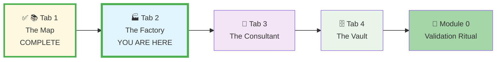
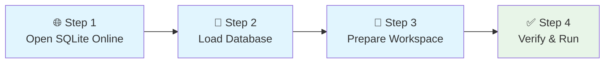
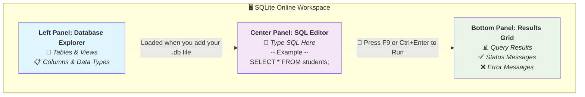
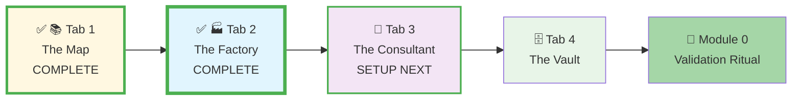




# 🗄️🤖 SQL & GenAI Course
**🎯 Quality Education for Anyone, Anywhere, Anytime — 💫 with Comfort, Convenience at no Cost**

## 🏭 **Tab 2: The Factory - SQLite Setup Guide**
---

## 🏭 **The Factory's Purpose**
**Tab 2: The Factory** is where theory becomes practice and learning becomes **muscle memory**. This hands-on environment is essential for the "Foundation first" approach. Here, you will manually build and test your SQL understanding, developing the problem-solving muscle memory needed before integrating AI assistance.

This is your **SQL execution environment**—the place where you write queries by hand, see immediate results, and build confidence through repetition. There are **no installations**, just SQL → Run → Learn.

**The Factory (Tab 2)** is your dedicated space for transforming SQL theory into practical skill through direct data manipulation, accessible via `Ctrl+2` / `Cmd+2`.

---

### **📍 Your Setup Journey - Tab 2 Context**
**📌 You are here: Setting up Tab 2 - The Factory**



**Journey Goal:** Complete all four tabs + Module 0 validation to master your Browser Office.

---

## 🎯 **Why SQLite Online for This Course?**

-   ✅ **Zero-Footprint**: Start learning immediately in your browser—no installs.
-   ✅ **Universal Access**: Works on any computer (Windows, Mac, Linux, Chromebook).
-   ✅ **Professional Relevance**: Mirrors modern, cloud-based development workflows.
-   ✅ **Safe Sandbox**: Experiment freely—you cannot affect your local machine.

> **💡 The Ideal Foundation:** SQLite is the perfect engine for Levels 1 & 2 due to its **serverless, file-based architecture**. It stores an entire database in a single `.db` file that you can instantly load in a browser, making it the **technical cornerstone** of our "Any Browser, Anytime" promise.

## 📋 **Platform Comparison: Choose Your Tool**

| Platform | Best For | Setup Time | Registration |
| :--- | :--- | :--- | :--- |
| **SQLite Online** (Recommended) | All course exercises | 30 seconds | Not required |
| **SQL Fiddle** | Schema design & sharing | 1 minute | Not required |

---

## 📂 **Purposeful Dataset Design for Effective Learning**
Our course uses **distinct databases** to optimize your learning experience. Each serves a specific role in the **"Watch Me → Now You Do It → Now You Solve It"** progression:

| Dataset | Purpose | Learning Mode | Used In |
| :--- | :--- | :--- | :--- |
| **[`training_institution_sample.db`](../Resources/sample_databases/training_institution_sample.db)** | Module demonstrations & guided examples | **"Watch Me"** – Follow along with lessons | Levels 1 & 2 Demos |
| **[`level1_estore_basic.db`](../Resources/sample_databases/level1_estore_basic.db)** | Hands-on practice & skill application | **"Now You Do It"** – Reinforce core concepts | Level 1 Practice |
| **[`level2_estore_intermediate.db`](../Resources/sample_databases/level2_estore_intermediate.db)** | Advanced practice with complex scenarios | **"Now You Solve It"** – Challenge-based learning | Level 2 Practice |

*You will be told exactly which file to use in each module. This separation prevents confusion and reinforces learning across different domains.*

---

## 📋 **Prerequisites for Tab 2 Setup**

**Before setting up Tab 2 - The Factory:**
- [ ] **✅ Tab 1 Complete:** The Map is open in your "SQL Course" tab group
- [ ] **Database Access:** Located [`training_institution_sample.db`](../Resources/sample_databases/training_institution_sample.db) in Tab 1
- [ ] **Tab Prepared:** Created second tab in "SQL Course" tab group for SQLite Online
- [ ] **Browser Ready:** Modern browser with internet access for [sqliteonline.com](https://sqliteonline.com)

**Setup Time:** 5 minutes → Your SQL execution environment ready

---

## ⏱️ **Setting up Tab 2 - The Factory**

**Your Goal:** Load the practice database and be ready to execute SQL queries.

**All SQL is written and executed in Tab 2** for Levels 1 and 2.

### **✅ Action Plan: 4-Step Setup Checklist**
Follow this simple sequence to get your Factory running:
- [ ] **Step 1:** Open SQLite Online in **Tab 2: The Factory.**
- [ ] **Step 2:** Load the `training_institution_sample.db` file.
- [ ] **Step 3:** Prepare Your Factory Workspace.
- [ ] **Step 4:** Verify the setup by running a test query.

### **Visualizing Your Factory Setup Flow**



---

### **Step-by-Step Instructions**

---

#### **Step 1: Open SQLite Online**

**📋 Tasks:**
1.  Go to [sqliteonline.com](https://sqliteonline.com) in the new browser tab you just created.
2.  This tab officially becomes **Tab 2: The Factory**.

**✅ Expected Result:** A clean SQLite Online interface loads in your browser.

---

### 📊 **Understanding the SQLite Online Interface**
Now that the interface is loaded, let's quickly orient you to its main components. Knowing your workspace is the first step to efficient practice.



**How to Use the Interface:**

| Panel | Purpose | Key Features |
| :--- | :--- | :--- |
| **Left Panel (Database Explorer)** | Blue area listing **`Tables`**, views, and their structure | Explore your data's schema after loading database |
| **Center Panel (SQL Editor)** | Purple main workspace for typing/pasting SQL commands | Run single line or multiple queries |
| **Bottom Panel (Result Grid)** | Green area displaying query results, messages, errors | Shows execution feedback |

---

#### **Step 2: Load the Course Database**

**📋 Tasks:**
1.  Find the **[`training_institution_sample.db`](../Resources/sample_databases/training_institution_sample.db)** file in the course's `Resources/sample_databases/` folder.
2.  **Click and drag** the file from your computer **directly onto the SQLite Online browser window**.
3.  *Alternative:* Use **"File" → "Open DB"** in SQLite Online and navigate to the file.

**✅ Expected Result:** The database loads silently. The left-side panel will soon populate with table names.

---

#### **Step 3: Prepare Your Factory Workspace**

**📋 Tasks:**
1.  **Confirm your location:** Ensure you are working in **Tab 2 (The Factory)** within your "SQL Course" tab group.
2.  **Bookmark the SQLite Online page:** Click the star icon in your browser's address bar to save this page for quick future access.
3.  **Familiarize with the layout:** Take a moment to identify the SQL editor panel (center), the table list panel (left), and the results area (bottom).

**✅ Expected Result:** You are focused on the correct, organized workspace and ready to execute your first query.

---

#### **Step 4: Verify Your Setup**

**Proof Your Tab 2 is Working:**

**📋 Verification Tasks:**
1.  **Check Your Environment:** SQLite Online is open in a pinned browser tab as part of your "SQL Course" tab group.
2.  **Check Your Database:** The `training_institution_sample.db` file is loaded. Expand the database in the left sidebar to see tables like `students`, `courses`, and `enrollments`.
3.  **Run Your First Query:** In the SQL editor, type:
    ```sql
    SELECT * FROM students LIMIT 5;
    ```
    Click **Run** or press **F9**.

**✅ Expected Outcome:** Your "Factory" (Tab 2) is now operational and ready for your first SQL command. You should see 5 rows of student data appear.

---

## ✅ **Validation: Prove Your Tab 2 is Working**

**Complete these checks to confirm Tab 2 setup success:**

1. **✅ SQLite Online Loaded:**
   - [sqliteonline.com](https://sqliteonline.com) open in pinned browser tab
   - Interface shows SQL editor, table explorer, and results panel

2. **✅ Database Successfully Loaded:**
   - `training_institution_sample.db` file uploaded without errors
   - Left panel shows tables: `students`, `courses`, `enrollments`

3. **✅ Query Execution Works:**
   - SQL command `SELECT * FROM students LIMIT 5;` executes without errors
   - Results show 5 rows of student data in bottom panel
   - Can run queries with F9 or Run button

**Success Indicator:** All three checks pass = Tab 2 ready for SQL practice.

---


## 🛠️ **Quick Help & Reference**

**Need immediate assistance?** Most SQLite issues have simple fixes:

### 📝 Quick Tips:
- **Bookmark It:** Save [sqliteonline.com](https://sqliteonline.com/) in your "SQL Course" folder
- **Save Your Work:** Use **"File" → "Save DB"** to download modified databases
- **Use Multiple Tabs:** Open separate browser tabs for different databases or exercises
- **Keyboard Shortcuts:** **F9** to run current query, **Ctrl+Enter** for multi-line execution

### 🔧 Detailed Troubleshooting:
For comprehensive solutions to SQLite Online issues, including:
- "Page refresh reset my database!"
- "File won't upload via drag & drop."
- "The website is slow or unresponsive."
- "Query results aren't showing."

➡️ **[Open Troubleshooting Guide](./TROUBLESHOOTING_GUIDE.md#22-tab-2-the-factory-sqlite-online-issues)**

---

## 🏭 **The Role of Tab 2 - The Factory in Your Learning Journey**
Your **Tab 2: The Factory** is more than a tool—it is your personal workshop where knowledge transforms into skill. This is the environment where abstract concepts become tangible results.

- 🧠 **The Factory builds your SQL brain.**
- 🏭 **The Factory is your Workshop** where theoretical SQL commands become executed, working code.

This is where you move from **learning about SQL** to becoming an **Architect building data interfaces** across all Tech stacks.

---

### **📍 Your Setup Journey Status**
**📌 Current status: Tab 2 - The Factory complete**



**Progress:** ✓ Tab 1 complete • ✓ Tab 2 complete • ⚙️ Tabs 3-4 remaining

---

## 🎯 **Visualizing Your Setup Journey**

**Progress:** ✓ Tab 1 complete • ✓ Tab 2 complete • ⚙️ Tabs 3-4 remaining

### **Setup Navigation**
⬅️ **Previous Setup Step:** Return to [GitHub Setup Guide - Tab 1: The Map](./1-github_setup_tab1.md) if needed.

➡️ **Next Setup Step:** Your **Tab 2: The Factory** is now ready! Proceed to set up **Tab 3: The Consultant**:
**[Continue to: GenAI Co-pilot Setup Guide - Tab 3: The Consultant](./3-genai_api_setup_tab3.md)**

---

*Part of our mission for 🎯 Quality Education for Anyone, Anywhere, Anytime — 💫 with Comfort, Convenience at no Cost.*


