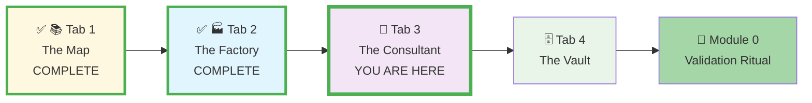
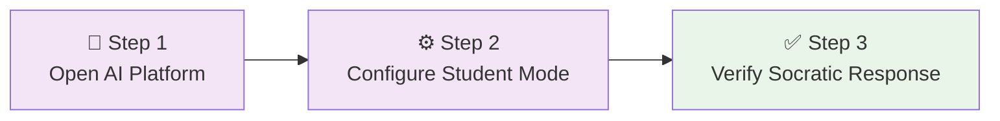
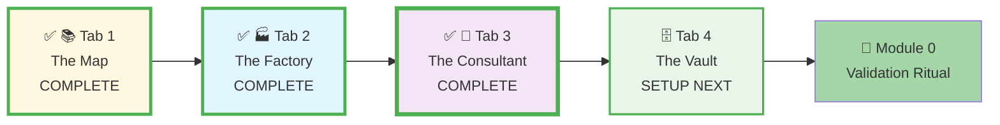




# 🗄️🤖 SQL & GenAI Course
**🎯 Quality Education for Anyone, Anywhere, Anytime — 💫 with Comfort, Convenience at no Cost**

## 🤖 **Tab 3: The Consultant - GenAI Setup Guide**
---

## 🤖 **The Consultant's Purpose**
Tab 3 is your **intelligent learning partner** that guides your understanding through the **Socratic AI Method™**. This AI co-pilot helps you grasp concepts, debug errors, and develop problem-solving skills—without doing the work for you during foundational learning.

**The Consultant (Tab 3)** is your dedicated AI learning partner that follows the "Foundation first, AI Next" philosophy, accessible via `Ctrl+3` / `Cmd+3`.

---

### **📍 Your Setup Journey - Tab 3 Context**
**📌 You are here: Setting up Tab 3 - The Consultant**



**Journey Goal:** Complete all four tabs + Module 0 validation to master your Browser Office.

---

## 🎯 **Why AI Co-pilot for This Course?**

- ✅ **Socratic Teaching:** Guides you to discover answers rather than giving them
- ✅ **24/7 Availability:** Instant help whenever you're stuck
- ✅ **Concept Clarification:** Explains complex ideas in simple terms
- ✅ **Error Debugging:** Helps you understand why queries fail
- ✅ **Learning Acceleration:** Reduces frustration and keeps you moving forward

> **💡 The Strategic Partnership:** This AI follows **"Foundation first, AI Next"** approach. In Modules 1-4, it acts as a **Socratic tutor**—asking questions to guide your thinking. In Module 5+, it becomes a **code accelerator**—helping you write and optimize SQL professionally.

---

## 📋 **Tool Comparison: Choose Your AI Co-pilot**

| Tool | Standout "Superpower" | Best For... | Notes |
| :--- | :--- | :--- | :--- |
| **ChatGPT (4o)** | High-speed code generation | Quick syntax questions and general guidance | Easiest to start with, good for general guidance, but may require occasional reminders of the Student Mode |
| **Claude 3.5 Sonnet** | Precision & logical reasoning | Complex JOINs, nested queries, and detailed explanations | **Gold Standard** for deep conceptual understanding and exceptionally good at following instructional prompts |
| **Google Gemini** | Large context window | Debugging long error logs or analyzing full schemas | Integrates well with other Google services |
| **Meta AI** | Direct accessibility | Quick checks on mobile or without an account | Convenient for fast, simple questions |

> **💡 Beginner Recommendation:** Start with **ChatGPT**. It's highly capable for SQL, has a generous free tier, and vast community support to help you learn.

---

## 🧠 **Purposeful AI Integration for Effective Learning**
Our course uses a **strategic, phased approach** to AI assistance that builds genuine competence:

### **Level 1: Building Genuine Competence**
**Psychological Goal:** Develop **self-efficacy** through manual mastery.

| Stage | AI Co-pilot Role | Key Rule | Purpose |
| :--- | :--- | :--- | :--- |
| **Modules 1-4** | **Conceptual Tutor Only** | ❌ No code generation. Use for explanations only. | Builds problem-solving muscle memory and independent logical thinking. |
| **Module 5** | **Code Accelerator** | ✅ Generate, optimize, and debug code. | Learn to use AI as a productivity tool **after** mastering fundamentals. |
| **Module 6** | **Professional Partner** | ✅ Full professional use on integrated projects. | Combine foundational skills with AI to solve real-world problems. |

*This deliberate progression prevents the "hallucination of competence" where students mistake AI's capabilities for their own.*

---

## 📋 **Prerequisites for Tab 3 Setup**

**Before setting up Tab 3 - The Consultant:**
- [ ] **✅ Tab 1 Complete:** The Map is open in your "SQL Course" tab group
- [ ] **✅ Tab 2 Complete:** The Factory has `training_institution_sample.db` loaded
- [ ] **AI Account:** Access to an AI platform (ChatGPT, Claude, or Gemini) with free account
- [ ] **Browser Ready:** Modern browser (Chrome, Firefox, Edge, Safari)

**Setup Time:** 3 minutes → Your AI learning partner configured

---

## ⏱️ **Setting up Tab 3 - The Consultant**

**Your Goal:** Configure your AI co-pilot with a simple "Student Mode" prompt to ensure it guides rather than gives answers.

### **✅ Action Plan: 3-Step Setup Checklist**
Follow this simple sequence to configure your Consultant:
- [ ] **Step 1:** Open your chosen AI platform in **Tab 3: The Consultant.**
- [ ] **Step 2:** Configure the "Student Mode" system prompt.
- [ ] **Step 3:** Verify your setup with a test question.

### **Visualizing Your Consultant Setup Flow**



---

### **Step-by-Step Instructions**

---

#### **Step 1: Open Your AI Platform**

**📋 Tasks:**
1.  Choose your preferred AI platform:
    - **ChatGPT:** [chat.openai.com](https://chat.openai.com)
    - **Claude:** [claude.ai](https://claude.ai)  
    - **Gemini:** [gemini.google.com](https://gemini.google.com)
2.  **Open in New Tab:** Open your chosen platform in a new browser tab.
3.  **Pin & Organize:** Right-click the tab, select **"Pin"**, then add it to your **"SQL Course"** tab group.
4.  **Designate Tab 3:** This tab officially becomes **Tab 3: The Consultant**.

**✅ Expected Result:** Your AI platform loads in a dedicated, organized browser tab.

---

#### **Step 2: Configure "Student Mode" Prompt**

**📋 Tasks:**
1.  **Start New Chat:** Create a new chat/conversation in your AI platform.
2.  **Copy System Prompt:** Copy this simple "Student Mode" prompt:

```
"I am a student learning SQL. My goal is to build my own logic. Please do not give me the full SQL code solution unless I explicitly ask for it after three failed attempts. Instead, explain the logic, point out syntax errors, or suggest which SQL keywords I should look into. Act as a Socratic tutor."
```

3.  **Paste as First Message:** Paste this prompt as your first message in the new chat.
4.  **Save Configuration:** Some platforms allow saving custom instructions—use this if available.

**✅ Expected Result:** Your AI understands it's in "Student Mode" and will respond accordingly.

---

#### **Step 3: Verify Your Setup**

**Proof Your Tab 3 is Working:**

**📋 Verification Tasks:**
1.  **Simple Test:** Ask your AI: **'How would I view all records in a table?'** and confirm it responds with guidance, not complete code.
2.  **Confirm Tab Organization:** Ensure your AI platform is in the pinned **Tab 3** within your "SQL Course" tab group.

**✅ Expected Outcome:** Your "Consultant" (Tab 3) is now configured as a Socratic tutor that builds your problem-solving skills.

---

## ✅ **Validation: Prove Your Tab 3 is Working**

**Complete these checks to confirm Tab 3 setup success:**

1. **✅ AI Platform Loaded:**
   - Chosen AI platform (ChatGPT/Claude/Gemini) open in pinned browser tab
   - Tab is in "SQL Course" tab group as Tab 3

2. **✅ Student Mode Active:**
   - "Student Mode" prompt pasted as first message in new chat
   - AI acknowledges Socratic tutoring role in response

3. **✅ Socratic Response Verified:**
   - Test question "How would I view all records in a table?" gets guidance, not code
   - AI asks questions or explains logic instead of providing complete SQL

**Success Indicator:** All three checks pass = Tab 3 ready for guided learning.

---

## 🧭 **Navigating Your AI Partnership**

### **Effective AI Interaction Guide**
Your Consultant is most effective when you approach it strategically:

**Pro Tip - Schema Anchor:** Before a session, paste your database table names and columns into the chat. Say: *"Use only these tables and columns in your answers."* This prevents 90% of incorrect suggestions.

| Learning Scenario | How to Ask | What to Expect |
| :--- | :--- | :--- |
| **Concept Confusion** | "Explain GROUP BY as if I'm new to SQL" | Clear analogies and simple explanations |
| **Error Debugging** | "This query returns an error: [paste query]. What does this error mean?" | Step-by-step error analysis |
| **Syntax Reminder** | "What's the syntax pattern for JOIN operations?" | Syntax templates without full queries |
| **Problem Approach** | "I need to analyze sales by region. What steps should I think through?" | Structured thinking framework |
| **Best Practices** | "What are considerations for optimizing slow queries?" | Professional guidelines |

### **Platform-Specific Tips**
| Platform | Strengths | Setup Notes |
| :--- | :--- | :--- |
| **ChatGPT** | Excellent explanations, good memory | Use custom instructions for persistent Student Mode |
| **Claude** | Strong reasoning, follows constraints well | Paste prompt in each new conversation |
| **Gemini** | Fast responses, good with examples | May need occasional reminder of Student Mode |

---

## 🛠️ **Quick Help & Reference**

**Need immediate assistance?** AI setup issues often have straightforward solutions:

### 🤖 Quick Tips:
- **Ask for Reasoning:** Prompt with *"Explain why..."* or *"Walk me through the logic..."*
- **Bookmark It:** Save your chosen AI tool in your "SQL Course" browser folder
- **Embrace the Struggle:** Confusing answers are learning moments—ask for simpler explanations

### 🔧 Detailed Troubleshooting:
For comprehensive AI platform solutions, including:
- "The AI keeps writing full SQL code!"
- "The AI suggests SQL that doesn't work in SQLite."
- "The AI hallucinates incorrect information."
- Platform-specific issues (ChatGPT, Claude, Gemini)

➡️ **[Open Troubleshooting Guide](./TROUBLESHOOTING_GUIDE.md#23-tab-3-the-consultant-ai-platform-issues)**

---


## 🤖 **The Role of Tab 3 - The Consultant in Your Learning Journey**
Your **Tab 3: The Consultant** is more than an AI tool—it is your personal Socrates, guiding you from confusion to clarity through intelligent questioning.

- 🤖 **The Consultant is your Thinking Partner** that helps you articulate and refine your understanding.
- 🤖 **The Consultant is your Debugging Assistant** that turns frustrating errors into learning opportunities.

*This intelligent partnership transforms isolated learning into guided discovery, building both SQL skills and the meta-skill of learning how to learn.*

---

### **📍 Your Setup Journey Status**
**📌 Current status: Tab 3 - The Consultant complete**



**Progress:** ✓ Tab 1 complete • ✓ Tab 2 complete • ✓ Tab 3 complete • ⚙️ Tab 4 remaining

---

## 🎯 **Visualizing Your Setup Journey**

**Progress:** ✓ Tab 1 complete • ✓ Tab 2 complete • ✓ Tab 3 complete • ⚙️ Tab 4 remaining

### **Setup Navigation**
⬅️ **Previous Setup Step:** Return to [SQLite Setup Guide - Tab 2: The Factory](./2-sqlite_setup_tab2.md) if needed.

➡️ **Next Setup Step:** Your **Tab 3: The Consultant** is now ready! Proceed to set up **Tab 4: The Vault** for progress tracking:

**[Continue to: GitHub Web Setup Guide - Tab 4: The Vault](./4-github_setup_tab4.md)**

---

*Part of our mission for 🎯 Quality Education for Anyone, Anywhere, Anytime — 💫 with Comfort, Convenience at no Cost.*


