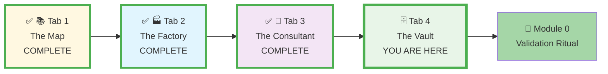
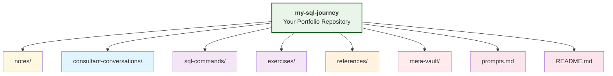
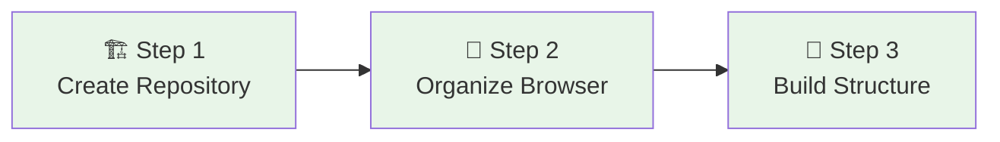
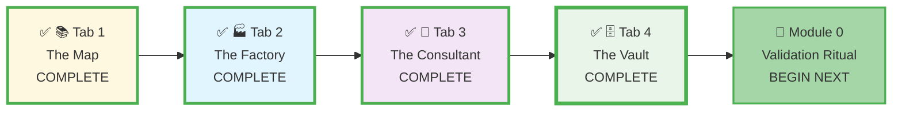

# 🗄️🤖 SQL & GenAI Course
**🎯 Quality Education for Anyone, Anywhere, Anytime — 💫 with Comfort, Convenience at no Cost**

## 🗄️ **Tab 4: The Vault - GitHub Web Setup Guide**
---

## 🗄️ **The Vault's Purpose**
**Tab 4: The Vault** is your **personal permanent digital portfolio** where learning transforms into tangible achievements. This secure repository serves as your professional showcase, progress tracker, and knowledge vault—documenting every step of your journey from SQL beginner to data professional.

**The Vault (Tab 4)** is your dedicated space for preserving and showcasing your growing SQL expertise through documented projects and solutions, accessible via `Ctrl+4` / `Cmd+4`.

---

### **📍 Your Setup Journey - Tab 4 Context**
**📌 You are here: Setting up Tab 4 - The Vault**



**Journey Goal:** Complete all four tabs + Module 0 validation to master your Browser Office.

---

## 🎯 **Why GitHub Web for Your Portfolio?**

- ✅ **Zero-Footprint Portfolio**: Build a professional showcase without local installations.
- ✅ **Universal Accessibility**: Your portfolio is accessible from any device, anywhere.
- ✅ **Version History**: Track your growth with automatic version control.
- ✅ **Professional Presentation**: Demonstrate skills to employers with clean, organized repositories.
- ✅ **Lifetime Archive**: Create a permanent record of your learning journey and achievements.

> **💡 The Career Foundation:** Your Vault isn't just storage—it's your **professional identity in development**. Each commit represents skill growth, each project demonstrates capability, and each organized folder shows professional discipline. This portfolio becomes your evidence of competence in job interviews and career advancement.

---

## 🏗️ **Building Your Professional Portfolio**

### **Recommended Portfolio Structure**
We are providing a portfolio structure to record your work—your solutions, projects, and learning journey. This portfolio exhibits the entire skillsets you will build in your learning journey.



| Folder / File | Purpose |
|---------------|---------|
| `notes/` | Your learning notes and reflections |
| `consultant-conversations/` | Key discussions with your AI Consultant |
| `sql-commands/` | Syntax examples and queries you’ve mastered |
| `exercises/` | All practice exercises (you can subdivide by level later) |
| `references/` | Useful links, templates, and the **prompts.md** file |
| `meta-vault/` | Your daily commit log and struggle log (created in Pillar 3) |
| `prompts.md` | Your AI prompt library (place your Student Mode prompt here) |
| `README.md` | Portfolio introduction and progress tracker |

> **💡 Beginner’s note:** You don’t need to fill every folder immediately. Start with `prompts.md` and `README.md`. Add files as you complete modules. The structure is your **scaffold**, not a to‑do list.

> **🔮 What’s next?** When you reach **Pillar 3: Knowledge Base**, you’ll learn to expand this simple Vault into a professional‑grade **cognitive map** that mirrors the entire course. For now, just enjoy building your first folders – you’re already on the path.

---

## 📋 **Prerequisites for Tab 4 Setup**

**Before setting up Tab 4 - The Vault:**
- [ ] **✅ Tab 1 Complete:** The Map is open in your "SQL Course" tab group
- [ ] **✅ Tab 2 Complete:** The Factory has demonstration database loaded
- [ ] **✅ Tab 3 Complete:** The Consultant is configured with Student Mode
- [ ] **GitHub Account:** Active GitHub account (created in Tab 1 setup)
- [ ] **Browser Ready:** Modern browser (Chrome, Firefox, Edge, Safari)

**Setup Time:** 5 minutes → Your professional portfolio repository ready

---

## ⏱️ **Setting up Tab 4 - The Vault**

**Your Goal:** Create your personal GitHub repository to track progress and build your professional portfolio.

### **✅ Action Plan: 3-Step Setup Checklist**
Follow this simple sequence to create your Vault:
- [ ] **Step 1:** Create your portfolio repository on GitHub.
- [ ] **Step 2:** Organize it in your browser workspace.
- [ ] **Step 3:** Build your portfolio folder structure to store your notes, conversations with your Consultant, the SQL commands you learned, and your practice exercises.

### **Visualizing Your Vault Setup Flow**



---

### **Step-by-Step Instructions**

---

#### **Step 1: Create Your Portfolio Repository**

**📋 Tasks:**
1.  **Go to GitHub:** Open [github.com](https://github.com) and sign in to your account.
2.  **Create New Repository:** Click the **"+"** icon in the top-right and select **"New repository"**.
3.  **Configure Repository:**
    - **Repository name:** `my-sql-journey` (or similar professional name)
    - **Description:** "My SQL learning portfolio with projects, exercises, and progress tracking"
    - **Visibility:** **Public** (recommended for portfolio showcase)
    - **Initialize with README:** **✓ Check this box**
    - **Add .gitignore:** Select **None**
    - **Choose a license:** **MIT License** (recommended for open portfolios)
4.  **Create Repository:** Click the green **"Create repository"** button.

**✅ Expected Result:** Your new repository is created and you're viewing its main page.

---

#### **Step 2: Organize Your Browser Workspace**

**📋 Tasks:**
1.  **Bookmark:** Bookmark your new repository page for quick access.
2.  **Open & Pin:** Open it in a new browser tab, right-click the tab, and select **"Pin"**.
3.  **Add to Tab Group:** Right-click the tab again, select **"Add to group"**, and choose your existing **"SQL Course"** tab group.
4.  **Designate Tab 4:** This tab officially becomes **Tab 4: The Vault** - accessible via `Ctrl+4` (Windows) or `Cmd+4` (Mac).

**✅ Expected Result:** Your portfolio repository is pinned in your organized workspace.

---

#### **Step 3: Build Your Portfolio Structure**

**Build your portfolio folder structure to store your notes, conversations with your Consultant, the SQL commands you learned, and your practice exercises.**

**📋 Tasks:**
1.  **Create Main Folders:** In your repository, click **"Add file" → "Create new file"**:
    - Create `notes/` (type exactly with trailing slash to create folder). This folder builds **Reflective Thinking**.
    - Click **"Commit new file"**
2.  **Repeat for Other Folders:** Create the remaining folders from the recommended structure:
    - `consultant-conversations/` - This folder builds **Communication Skills (how to ask technical questions)**.
    - `sql-commands/` - This folder builds a **Personal Syntax Library**.
    - `level-1-exercises/`
    - `level-2-exercises/`
3.  **Create AI Prompt Library:** Create a file called `prompts.md` with this initial content:
    ```markdown
    # AI Prompt Library
    
    ## Student Mode Prompt
    ```
    [Your Student Mode prompt will go here after Module 0]
    ```
    
    ## Effective Learning Prompts
    As you advance through Level 2 and Level 3, you will discover certain AI prompts that work like magic for complex joins or query optimization. Don't let these "God-tier" prompts disappear in your chat history! Secure it in your vault in prompts.md. This will serve as your **Personal SQL Playbook**.
    
    **Why do this?**
    
    - **Efficiency:** Stop reinventing the wheel. Copy-paste your best prompts for complex tasks.
    - **Showcase:** It proves to employers that you know how to use **AI as a high-level tool**, not a crutch.
    - **Growth:** Watch how your prompts evolve from _"How do I SELECT?"_ to _"Optimize this recursive CTE for performance."_
    
    > **Pro Tip:** Tag your prompts by level (e.g., `#Level2-WindowFunctions` or `#Level3-PerformanceTuning`) so you can find them instantly.
    ```
4.  **Update README.md:** Edit the main `README.md` to introduce your portfolio:
    ```markdown
    # My SQL Journey Portfolio
    
    Welcome to my SQL learning journey! This repository documents my progress, projects, and achievements as I develop data skills.
    
    ## Current Focus: Level 1 - SQL Fundamentals
    - ✅ Module 1: Database Basics
    - ⏳ Module 2: Filtering and Sorting
    - 📅 Upcoming: Advanced SQL Concepts
    
    ## Portfolio Structure
    - `notes/`: Learning notes and reflections
    - `consultant-conversations/`: Discussions with AI Consultant
    - `sql-commands/`: SQL commands and syntax learned
    - `level-1-exercises/`: Foundational SQL practice
    - `level-2-exercises/`: Intermediate queries and joins
    - `prompts.md`: Collection of effective AI learning prompts
    ```

**✅ Expected Result:** Your portfolio has a professional structure ready for growth.

---

## ✅ **Validation: Prove Your Tab 4 is Working**

**Complete these checks to confirm Tab 4 setup success:**

1. **✅ Repository Created:**
   - `my-sql-journey` repository exists in your GitHub account
   - Repository is public with MIT License and README.md

2. **✅ Folder Structure Built:**
   - All required folders created: `notes/`, `consultant-conversations/`, `sql-commands/`
   - `prompts.md` file created with initial content
   - README.md updated with portfolio introduction

3. **✅ Browser Configuration:**
   - Repository open in pinned browser tab as Tab 4
   - Tab is in "SQL Course" tab group
   - Accessible via `Ctrl+4` / `Cmd+4`

**Success Indicator:** All three checks pass = Tab 4 ready for portfolio building.

---

## 🛠️ **Quick Help & Reference**

**Need immediate assistance?** Portfolio setup issues usually have simple fixes:

### 📁 Quick Tips:
- **Commit Daily:** Make at least one commit per study session
- **Use Descriptive Messages:** Write clear commit messages
- **Include Explanations:** Always comment SQL code and document thinking
- **Screenshot Progress:** Add screenshots of query results
- **Update Regularly:** Refresh README.md monthly to reflect progress

### 🔧 Detailed Troubleshooting:
For comprehensive portfolio issues, including:
- "I can't create a repository!"
- "The folder structure isn't showing correctly."
- "I made a mistake in my repository structure."
- "Public vs Private dilemma."
- "How often should I commit?"

➡️ **[Open Troubleshooting Guide](./TROUBLESHOOTING_GUIDE.md#24-tab-4-the-vault-github-portfolio-issues)**

---

## 🗄️ **The Role of Tab 4 - The Vault in Your Learning Journey**
Your **Tab 4: The Vault** is more than a repository—it is the **cornerstone of your professional identity** in the data world. This is where learning transforms into career capital.

- 🗄️ **The Vault is your Evidence Locker** that proves your skills to employers, clients, and yourself.
- 🗄️ **The Vault is your Growth Tracker** that documents every breakthrough, challenge overcome, and skill mastered.

*This Vault becomes your most valuable career asset—a living document of capability that grows with you throughout your professional journey. Build it, Treasure it.*

---

### **📍 Your Setup Journey Status**
**📌 Current status: Tab 4 - The Vault complete**



**Progress:** ✓ Tab 1 complete • ✓ Tab 2 complete • ✓ Tab 3 complete • ✓ Tab 4 complete

---

## 🎯 **Visualizing Your Setup Journey**

**Progress:** ✓ Tab 1 complete • ✓ Tab 2 complete • ✓ Tab 3 complete • ✓ Tab 4 complete

### **Setup Navigation**
⬅️ **Previous Setup Step:** Return to [GenAI Co-pilot Setup Guide - Tab 3: The Consultant](./3-genai_api_setup_tab3.md) if needed.

➡️ **Next Setup Step:** Your **Tab 4: The Vault** is now complete! Return to **STEP 1: Commission Your Browser Office** to complete the **Module 0 Validation Ritual** and prove your entire Browser Office works:

**[Continue to: Module 0 Validation Ritual in STEP 1](./STEP1_COMMISSION_BROWSER_OFFICE.md#part-5-module-0-validation-ritual)**

---

*Part of our mission for 🎯 Quality Education for Anyone, Anywhere, Anytime — 💫 with Comfort, Convenience at no Cost.*


