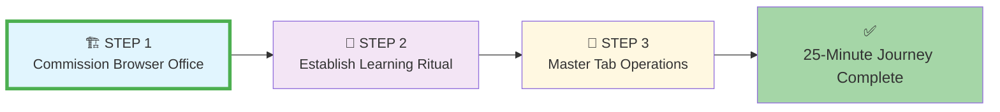
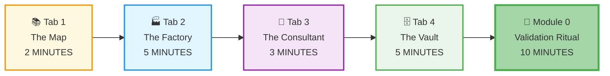
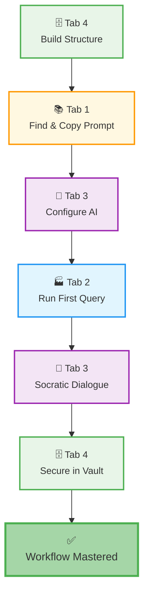
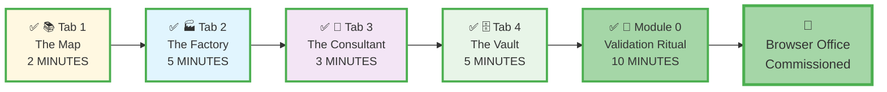
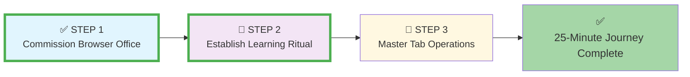

# 🗄️🤖 SQL & GenAI Course
**🎯 Quality Education for Anyone, Anywhere, Anytime — 💫 with Comfort, Convenience at no Cost**

## 🏗️ **STEP 1: Commission Your Browser Office - Setup Guide**
---

## 🎯 **Quick Win Promise for STEP 1**

In the next **15 minutes**, you will physically assemble your four-tab Browser Office, configure each tool, and complete the Module 0 ritual to prove your entire system works.

**Your Goal:** Commission all four tabs + validate with Module 0 = Operational Browser Office.

---

## 🏗️ **STEP 1's Purpose: The Physical/Digital Build**
**STEP 1: Commission Your Browser Office** is where you **assemble your professional learning tools**. This phase focuses on the physical/digital setup of all four tabs (The Map, Factory, Consultant, Vault) and validates they work together through the Module 0 ritual.

This is the **foundational build phase** where you:
*   Open and configure each of the four browser tabs
*   Validate that all tools work together
*   Complete the Module 0 initiation ritual
*   Prove your Browser Office is operational

**STEP 1 Completion Criteria:** All four tabs configured + Module 0 validation ritual completed.

---

### **📍 Your 25-Minute Setup Journey**
**📌 You are here: Beginning STEP 1 - Commission Your Browser Office**

**Journey Goal:** Complete all three steps to master your Browser Office in 25 minutes.

---

## 📋 **Prerequisites & Quick Checklist**

**Before you start:**
- [ ] **Computer:** Any device with a modern web browser (Chrome, Firefox, Edge, Safari)
- [ ] **Internet connection:** Stable connection for initial setup (some tools work offline after)
- [ ] **Email ID** for Free GitHub Account Creation (if you don't have a GitHub account)
- [ ] **The same email ID** can be used for AI Configuration

**Total setup time:** 25 minutes or less → First SQL query today!

---

## 📋 **The Four-Tab Commissioning Sequence**
Follow this exact order for optimal setup flow. Each tab depends on the previous one being ready:

| Tab | Tool | Setup Time | Key Task | Dependency |
| :--- | :--- | :--- | :--- | :--- |
| **1: The Map** | Course Repository (GitHub) | 2 minutes | Fork course repository | None |
| **2: The Factory** | SQLite Online | 5 minutes | Load `training_institution_sample.db` | Tab 1 ready |
| **3: The Consultant** | AI Co-pilot | 3 minutes | Configure Student Mode prompt | Tabs 1-2 ready |
| **4: The Vault** | GitHub Web Portfolio | 5 minutes | Create `my-sql-journey` repository | Tabs 1-3 ready |
| **Module 0** | Workflow Ritual | 10 minutes | Validate complete setup | All tabs ready |

**Total STEP 1 Time:** 25 minutes → Browser Office fully commissioned

---

## ⏱️ **Executing STEP 1: The Commissioning Journey**

**Your Goal:** Complete the physical/digital setup of all four tabs and validate everything works through Module 0.

---

### **✅ Action Plan: The 5-Part Commissioning Sequence**
Follow this flow exactly as shown—each part builds on the previous:

**Commissioning Checklist:**
- [ ] **Part 1:** [Complete Tab 1: The Map Setup](./1-github_setup_tab1.md)
- [ ] **Part 2:** [Complete Tab 2: The Factory Setup](./2-sqlite_setup_tab2.md)
- [ ] **Part 3:** [Complete Tab 3: The Consultant Setup](./3-genai_api_setup_tab3.md)
- [ ] **Part 4:** [Complete Tab 4: The Vault Setup](./4-github_setup_tab4.md)
- [ ] **Part 5:** Complete Module 0 Validation Ritual (below)

---

### **Part 5: Module 0 Validation Ritual**
**Time:** 10 minutes  
**Purpose:** Prove all four tabs work together as a complete system.

> **💡 Why Module 0 Exists:** This isn't just a test—it's your **initiation ritual** into the professional learning mindset. By completing this workflow, you prove to yourself that the system works and internalize the pattern you'll use for the next 20 weeks.

#### **The Module 0 Flow**
This ritual follows a specific sequence that you'll use daily:

#### **Step-by-Step Validation Instructions**

1.  **Tab 4: Build Your Module 0 Structure**
    *   Create folder `my-first-day/` in your portfolio repository
    *   Create three files: `notes.md`, `consultant-conversations.md`, `sql-commands.md`
    *   Commit with message "Created My First Day structure"

2.  **Tab 1: The Map - Find Your Tools**
    1. **Navigate to Level 1:** In Tab 1 (your forked repository), go to `Level-1-beginner/`
    2. **Locate the Student Mode Prompt:** Find and open **[STUDENT_MODE_PROMPT_LEVEL1.md](../Level-1-beginner/STUDENT_MODE_PROMPT_LEVEL1.md)**
    3. **Copy the Prompt:** Select and copy the entire content of the file

3.  **Tab 3: The Consultant - Configure Your AI**
    1. **Switch to Tab 3:** Press `Ctrl+3` (Windows) or `Cmd+3` (Mac)
    2. **Start New Chat:** Create a new conversation/chat in your AI platform
    3. **Paste the Prompt:** Paste the copied Student Mode prompt as your first message
    4. **Confirm Configuration:** Your AI should respond acknowledging Student Mode

4.  **Tab 2: The Factory - Execute Your First Query**
    1. **Switch to Tab 2:** Press `Ctrl+2` (Windows) or `Cmd+2` (Mac)
    2. **Verify Database Loaded:** Ensure you see tables in the left panel
    3. **Get Your Query from The Map:** Switch back to **Tab 1**. Navigate to `Level-1-beginner/` and open the file **[`browser_office_first_day.md`](../Level-1-beginner/browser_office_first_day.md)**.
    4. **Copy and Execute:** Copy only the SQL command from the code block in the file. Return to **Tab 2**, paste it into the SQL editor, and click **Run** or press **F9**.
    5. **Observe Results:** You should see 3 rows of student data appear.

5.  **Tab 3: The Consultant - Engage in Socratic Dialogue**
    1. **Switch Back to Tab 3:** Return to your AI consultant
    2. **Ask a Guided Question:** Type: **"I have executed this command 'SELECT * FROM students LIMIT 3;' I could see only 3 rows. Can you give me the SQL command to see all the rows?"**
    3. **Experience Student Mode:** Notice how the AI guides you with questions instead of giving full code
    4. **Practice Interaction:** Ask follow-up questions based on the guidance

6.  **Tab 4: The Vault - Secure Your Foundation**
    1. **Switch to Tab 4:** Press `Ctrl+4` (Windows) or `Cmd+4` (Mac)
    2. **Navigate to `prompts.md`:** Open this file in your portfolio repository (created in Tab 4 setup)
    3. **Update the File:** Replace the placeholder with your actual Student Mode prompt
    4.  **Document Your Work in your `my-first-day/` folder:**
        *   Open `sql-commands.md`. Copy the validation query from **Tab 2** and paste it here.
        *   Open `consultant-conversations.md`. Copy the entire conversation from **Tab 3** and paste it here.
        *   Open `notes.md` and type the following:
            `My first day in Browser office is very productive. I have learnt how to read the map and get raw materials for my factory, transform raw materials into finished goods in my factory, analyze the manufacturing process and quality control with my Consultant and documenting the manufacturing process and the Consultant's advice and recommendations in my Vault securely.`
    5. **Commit the Change:** Save all updates with the message "Completed Module 0 workflow and documented all steps."

**Expected Outcome:** You've proven all four tabs work together in a complete workflow.

---

## 🎯 **What You've Just Proved (STEP 1 Completion)**

By completing Module 0, you've demonstrated:

| Skill Demonstrated | Why It Matters |
| :--- | :--- |
| **Tab Navigation Mastery** | Can fluidly move between learning tools using shortcuts |
| **Resource Location** | Knows where to find essential course materials |
| **AI Configuration** | Can properly set up learning assistant with constraints |
| **SQL Execution** | Can write and run basic SQL queries successfully |
| **Socratic Engagement** | Can interact with AI as thinking partner, not solution dispenser |
| **Portfolio Management** | Understands how to document and preserve learning artifacts |

---

### **✅ STEP 1 Completion Criteria**

**Your Browser Office is officially commissioned when:**

- [ ] **Tab 1:** Can navigate to any course material within 30 seconds
- [ ] **Tab 2:** Can execute a SQL query and see results
- [ ] **Tab 3:** AI responds with guidance, not complete code
- [ ] **Tab 4:** Portfolio contains Student Mode prompt and "My First Day" folder
- [ ] **You:** Can switch between all four tabs without thinking about it

**🎉 Congratulations!** You've completed the most important step in the entire course. This commissioned Browser Office will carry you through **Levels 1 and 2**. *The Browser workspace is now ready for daily use. The tools are assembled, calibrated, and tested.*

---

### **📍 Your Commissioning Journey - Complete**
**📌 Your current status: STEP 1 Commissioning complete**

**Progress:** ✓ Tab 1 complete • ✓ Tab 2 complete • ✓ Tab 3 complete • ✓ Tab 4 complete • ✓ Module 0 complete

---

## 🎯 **Why This Sequential Approach Works**

- ✅ **Systematic Foundation:** Builds your workspace one component at a time for clarity
- ✅ **Validation Focus:** Each tab setup includes proof-of-work verification
- ✅ **Ritual Establishment:** Module 0 creates the muscle memory for your daily workflow
- ✅ **Problem Isolation:** If something fails, you know exactly which component needs attention
- ✅ **Psychological Momentum:** Completing each tab provides **a sense of accomplishment**

> **💡 The Assembly Line Metaphor:** Think of STEP 1 as assembling a production line. Each machine (tab) must be installed, calibrated, and tested individually before the whole line can run. Module 0 is your "first production run" to prove everything works together.

---

### **### Journey Navigation**
**📌 Current status: STEP 1 Commissioning complete**

**Progress:** ✓ STEP 1 complete • ⚙️ STEP 2-3 remaining

**➡️ Next Phase:** [Continue to STEP 2: Establish Your Learning Ritual](./STEP2_ESTABLISH_LEARNING_RITUAL.md)

Your Browser Office is commissioned and ready. Now proceed to internalize the workflow and transform conscious steps into automatic daily patterns.

---

*Part of our mission for 🎯 Quality Education for Anyone, Anywhere, Anytime — 💫 with Comfort, Convenience at no Cost.*

