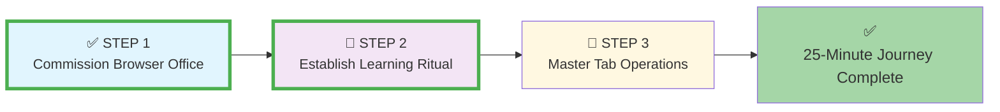
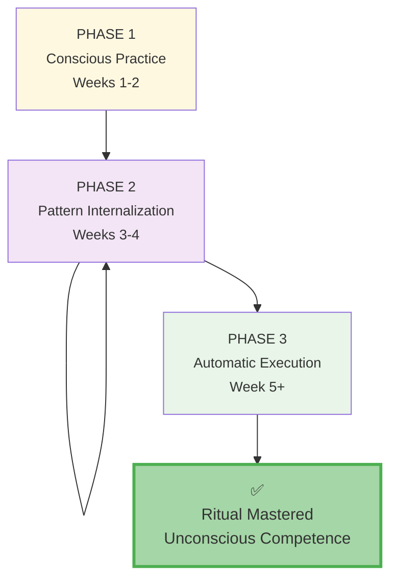
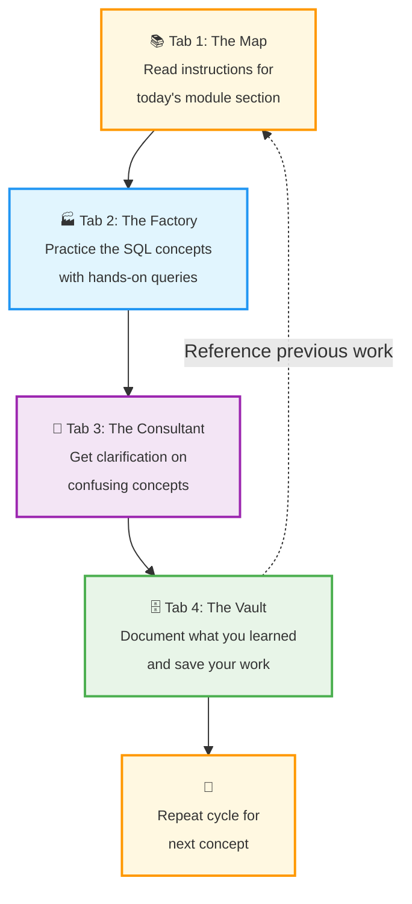
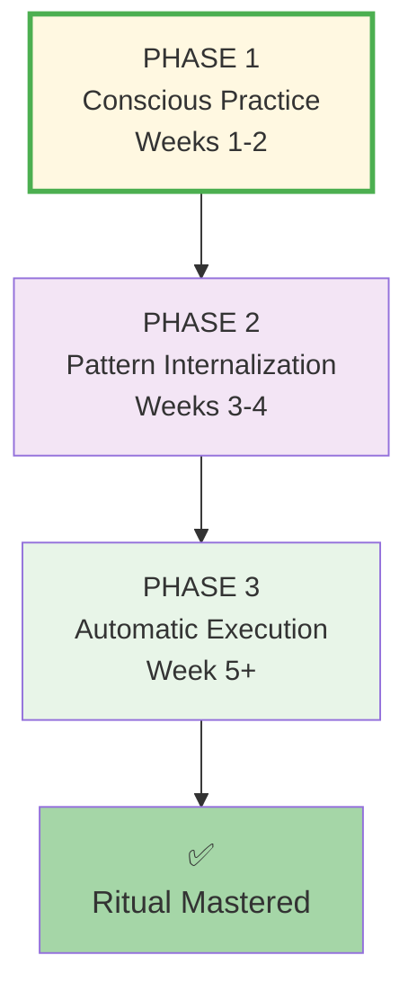
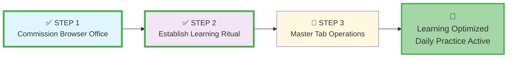

# 🗄️🤖 SQL & GenAI Course
**🎯 Quality Education for Anyone, Anywhere, Anytime — 💫 with Comfort, Convenience at no Cost**

## 🔄 **STEP 2: Establish Your Learning Ritual - Workflow Guide**
---

## 🔄 **STEP 2's Purpose: Workflow Internalization**
**STEP 2: Establish Your Learning Ritual** is where you **transform conscious setup steps into unconscious daily patterns**. This phase focuses on internalizing the Browser Office workflow so it becomes automatic—your professional learning habit.

This is the **habit formation phase** where you:
*   Turn the four-tab navigation into muscle memory
*   Establish your daily learning rhythm
*   Create consistent patterns for focused work
*   Build the psychological framework for sustained learning

**STEP 2 Completion Criteria:** Can navigate the four-tab workflow without conscious thought + has established daily learning ritual.

---

### **📍 Your 25-Minute Setup Journey**
**📌 You are here: Beginning STEP 2 - Establish Your Learning Ritual**

**Journey Goal:** Complete all three steps to master your Browser Office in 25 minutes.

---

### **✅ Action Plan: The 3-Phase Ritual Development**
Develop your ritual through these progressive phases:

**Ritual Development Checklist:**
- [ ] **Phase 1:** Practice the exact Module 0 sequence daily for 2 weeks
- [ ] **Phase 2:** Begin adapting the sequence to actual module work
- [ ] **Phase 3:** Flow naturally between tabs based on learning needs

---

### **📅 DAILY PRACTICE TIP**
**Ritual mastery is gradual, not instantaneous.**

- **Daily Review:** Glance at this guide for **2 minutes** before each learning session
- **Timeframe:** This becomes automatic in **2-3 weeks** of consistent practice  
- **Goal:** Internalize the workflow through repetition, not memorization

*Think of this like learning a musical instrument—daily practice builds muscle memory.*

---

### **The Daily Learning Ritual Template**
This is your template for each learning session.  *This ritual is your learning backbone—the consistent practice that turns effort into expertise.* Customize it over time:

#### **Morning Setup (2-3 minutes)**
1.  **Physical Preparation:**
    - Open browser
    - Open all four tabs (`Ctrl+1` through `Ctrl+4`)
    - Verify each tab is ready (Map accessible, Factory loaded, Consultant configured, Vault open)

2.  **Mental Preparation:**
    - Review yesterday's progress in Tab 4
    - Set today's learning intention (1-2 specific goals)
    - Note any challenges from previous session

#### **Learning Session (25-45 minutes)**
Follow this natural workflow for focused learning:

**Workflow Rules:**
1. **One Task Per Tab:** Don't mix activities (e.g., don't take notes in Tab 1)
2. **Natural Flow:** Follow Map → Factory → Consultant → Vault sequence
3. **Time Boxing:** Spend 5-15 minutes in each tab before moving on
4. **Completion Focus:** Finish one complete cycle before starting another

#### **Session Close (3-5 minutes)**
1.  **Progress Documentation:**
    - Commit your work in Tab 4 with descriptive messages
    - Note what was learned and what's still challenging
    - Update learning reflections if needed

2.  **Preparation for Next Session:**
    - Bookmark stopping point in Tab 1
    - Note questions to explore next time
    - Plan focus for tomorrow's session

3.  **Ritual Closure:**
    - Acknowledge completion (mental "checkmark")
    - Close Browser Office tabs (or leave pinned for next time)
    - Transition mind out of learning mode

---

## 📚 **The Deeper Purpose of Your Browser Office**
Your Browser Office is more than just tools—it is a **comprehensive learning ecosystem** designed to transform you from a beginner into a skilled data professional.

### **📚 Tab 1: The Map - Your Gateway to Expertise**

Tab 1 contains the curated wisdom designed to transform your learning journey:

- **✨ 19 Years of Curated Wisdom:** Architected and presented to guide your path
- **📈 Progressive Complexity:** Smooth guidance through technical and operational levels  
- **🏗️ Project Building:** Tools to create cutting-edge projects that showcase your capabilities
- **🔍 Hidden Potential Discovery:** Navigation through challenges and knowledge expeditions
- **📚 Lifelong Reference:** Materials that aid learning and serve as ongoing resources
- **🚀 Morale Boosting:** Portfolio building that creates pride in your achievements

*This is your gateway from learner to expert—the foundation of your entire journey.*

### **🏭 Tab 2: The Factory - Your Crafting Workshop**

The Factory is where theoretical knowledge transforms into practical mastery:

- **🧪 Proving Ground:** Safe environment to test ideas, make mistakes, and build genuine competence
- **🎯 Focus Zone:** Designed for deliberate practice, turning complex operations into instinct
- **🔗 Integration Point:** Where Map instructions, Consultant insights, and your logic converge
- **💪 Confidence Builder:** Every successful query reinforces problem-solving abilities
- **🏢 Professional Simulator:** Mirrors isolated, focused environments of real-world development
- **🌐 Global Application Builder:** Foundation for mobile, desktop, and web applications used worldwide
- **📱 Social Platform Foundation:** Where platforms like Facebook, YouTube, and Instagram are built

*This is where you move from learning about SQL to becoming an architect building data interfaces across all tech stacks.*

### **🤖 Tab 3: The Consultant - Your Socratic Guide**

The Consultant transforms confusion into clarity through intelligent guidance:

- **🎓 Concept Clarifier:** Translates technical jargon into understandable language
- **⚡ Learning Accelerator:** Keeps you unstuck and progressing forward
- **🧠 Socratic Guide:** Teaches you how to think, not what to think
- **✅ Confidence Validator:** Confirms correct thinking and gently corrects misunderstandings
- **🌉 Knowledge Bridge:** Connects textbook theory with practical application
- **👔 Professional Preparation:** Prepares you for the AI-enhanced workplace

*This intelligent partnership transforms isolated learning into guided discovery, building both SQL skills and the meta-skill of learning how to learn.*

### **🗄️ Tab 4: The Vault - Your Professional Foundation**

The Vault is where learning transforms into tangible career capital:

- **📚 Knowledge Base:** Solved problems become reusable patterns for future challenges
- **🏆 Professional Showcase:** Demonstrates not just what you know, but how you think and work
- **📈 Confidence Archive:** Tangible record of progress to reference when facing new challenges
- **🚀 Career Springboard:** Concrete examples for resumes, interviews, and promotions
- **🧭 Learning Compass:** Helps identify strengths to leverage and gaps to address
- **🏛️ Legacy Builder:** Permanent record of transformation from learner to practitioner

*This Vault becomes your most valuable career asset—a living document of capability that grows with you throughout your professional journey. Build it, Treasure it.*

---

## 🎯 **Customizing Your Ritual**
As you progress, adapt these elements to your personal style:

### **Session Length Variations**
| Pattern | Best For | Time Allocation |
| :--- | :--- | :--- |
| **Micro-Sessions** | Busy days, maintenance | 15 min: 2 min setup → 10 min practice → 3 min close |
| **Standard Sessions** | Regular learning days | 45 min: 3 min setup → 35 min practice → 7 min close |
| **Deep Work Sessions** | Complex topics, projects | 90 min: 5 min setup → 75 min practice → 10 min close |

### **Focus Variations**
| Learning Goal | Tab Emphasis | Ritual Adjustment |
| :--- | :--- | :--- |
| **New Concepts** | Heavy Tab 1 (Map) time | Start with 10 min reading before factory work |
| **Practice Intensive** | Heavy Tab 2 (Factory) time | Multiple quick cycles: Map → Factory → Vault |
| **Problem Solving** | Heavy Tab 3 (Consultant) time | Factory → Consultant dialogue with Vault documentation |
| **Project Work** | Balanced all tabs | Extended cycles with longer Vault documentation |

---

## 📊 **Tracking Ritual Effectiveness**
Monitor these metrics to refine your ritual:

| Metric | How to Track | Target |
| :--- | :--- | :--- |
| **Consistency** | Learning days per week | 5+ days (consistency > duration) |
| **Flow Time** | Minutes in focused state | 25+ min per session (increasing over time) |
| **Tab Switching** | Conscious vs automatic moves | Decreasing conscious effort over weeks |
| **Progress Velocity** | Module completion rate | Steady progress (not speed) |
| **Satisfaction** | Daily learning journal | Positive trend over time |

**Pro Tip:** Use your Tab 4 Vault to track these metrics. A simple `learning-journal.md` with daily entries creates powerful feedback.

---

## 🧠 **Troubleshooting Ritual Challenges**

**Common Challenges & Solutions:**

-   **"I keep forgetting the tab sequence."**
    *Solution:* Create a physical reminder (sticky note) with the sequence: 1→2→3→4. Practice the Module 0 ritual daily until automatic.

-   **"Some days I just can't focus."**
    *Solution:* Use the 15-minute micro-session. Often starting is the hardest part. Commit to just 15 minutes.

-   **"The ritual feels rigid/artificial."**
    *Solution:* That's normal in Phase 1. It feels artificial because it's new. After 3-4 weeks, it will feel natural. Trust the process.

-   **"I don't have 45 minutes daily."**
    *Solution:* 15-minute micro-sessions are valid. Three 15-minute sessions spread through a day can be more effective than one 45-minute session.

-   **"I keep getting distracted by other tabs/notifications."**
    *Solution:* Use browser focus modes or separate user profiles. The ritual includes closing other distractions as part of setup.

---

### **📍 Your Ritual Development - Progress**
**📌 Your current status: Ritual development in progress**

**Progress:** ✓ Phase 1 practicing • ⚙️ Phases 2-3 developing

---

## 🎯 **Why Rituals Matter for Learning**

- ✅ **Reduces Decision Fatigue:** Automatic patterns conserve mental energy for SQL
- ✅ **Builds Consistency:** Regular practice creates compound learning effects
- ✅ **Creates Flow State:** Familiar rituals help enter focused learning mode faster
- ✅ **Develops Professional Discipline:** Mirrors real-world work patterns
- ✅ **Anchors Progress:** Daily rituals create tangible evidence of commitment

> **💡 The Professional Athlete Metaphor:** Think of STEP 2 as developing your "pre-game routine." Just as athletes have specific warm-up rituals before competition, you're developing learning rituals that prepare your mind for focused SQL practice. The ritual itself becomes part of the skill.

---

## 🧠 **The Psychology of Effective Learning Rituals**
Effective rituals work because they leverage cognitive principles:

| Principle | How It Works | Implementation in Browser Office |
| :--- | :--- | :--- |
| **Cue-Routine-Reward** | Triggers automatic behavior patterns | Cue: Opening browser → Routine: Four-tab setup → Reward: Learning progress |
| **Chunking** | Groups complex tasks into manageable units | Four tabs = four cognitive chunks with clear purposes |
| **Environmental Design** | Structures physical space for desired behavior | Browser tabs create virtual "learning zones" |
| **Habit Stacking** | Attaches new habits to existing ones | "After morning coffee = Browser Office time" |
| **Implementation Intentions** | "When X happens, I will do Y" planning | "When stuck on SQL, I will switch to Tab 3 for guidance" |

*Your Browser Office ritual leverages all these principles simultaneously.*

---

### **### Journey Navigation**
**📌 Current status: STEP 2 Ritual development in progress**

**Progress:** ✓ STEP 1 complete • ✓ STEP 2 developing • ⚙️ STEP 3 remaining

Your **STEP 2 ritual is taking shape!** Continue practicing daily. When ready, deepen your understanding of each tab's rules:

**➡️ Next Phase:** [Continue to STEP 3: Master Tab Operations](./STEP3_MASTER_TAB_OPERATIONS.md)

---

*Part of our mission for 🎯 Quality Education for Anyone, Anywhere, Anytime — 💫 with Comfort, Convenience at no Cost.*