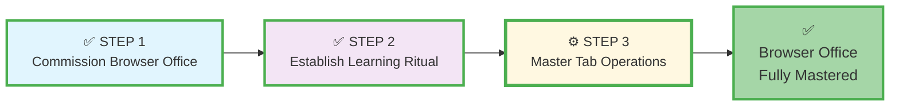
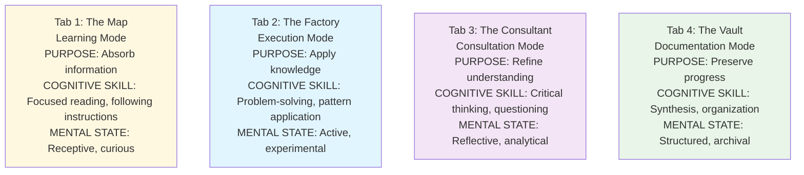
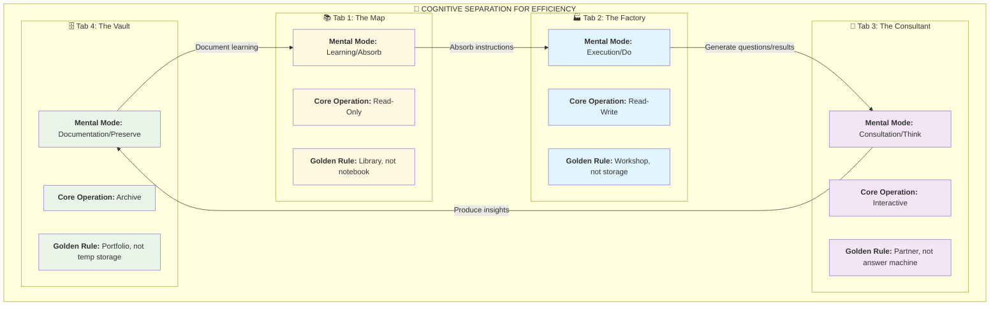
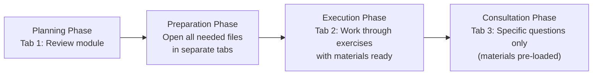
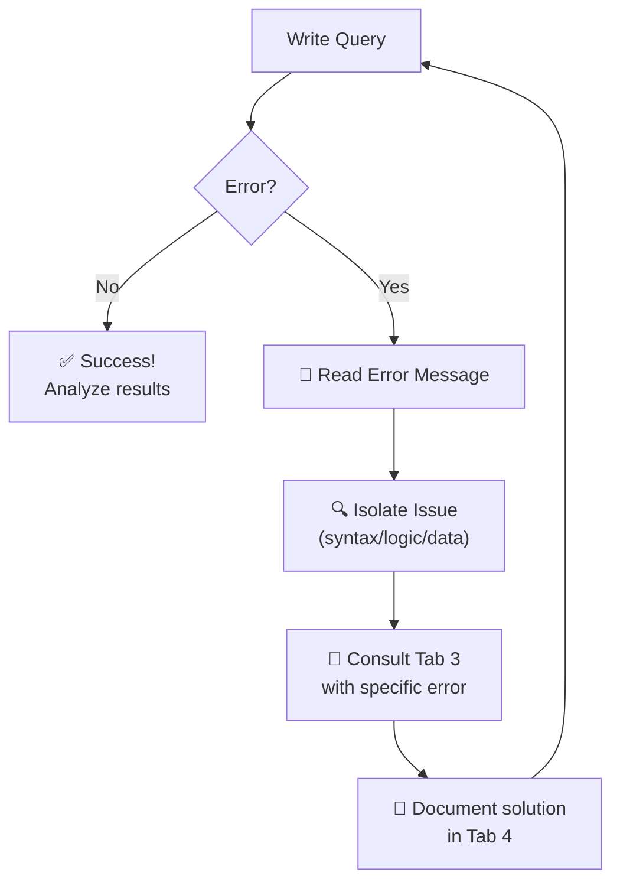
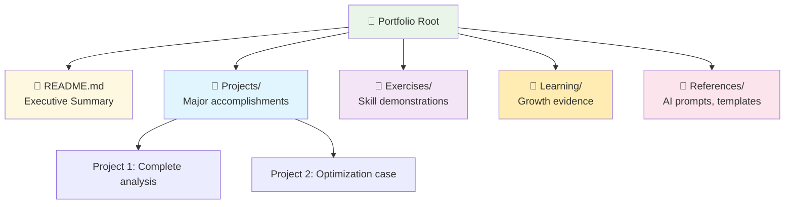
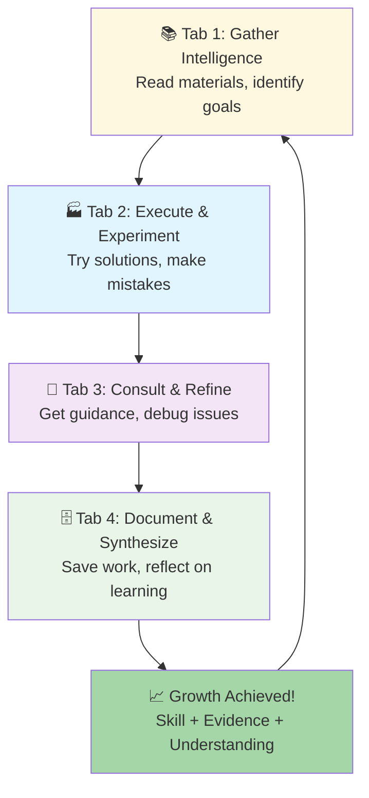
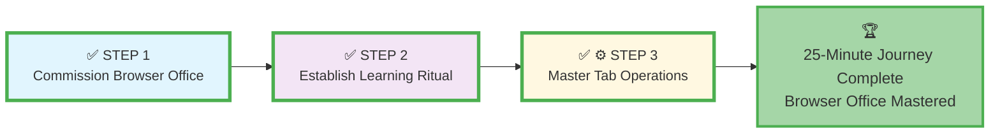

# 🗄️🤖 SQL & GenAI Course
**🎯 Quality Education for Anyone, Anywhere, Anytime — 💫 with Comfort, Convenience at no Cost**

## ⚙️ **STEP 3: Master Tab Operations - Advanced Workflow Guide**
---

## ⚙️ **STEP 3's Purpose: Operational Mastery**
**STEP 3: Master Tab Operations** is where you transform from **setup completer** to **workflow master**. This phase focuses on the advanced skills, best practices, and optimization techniques that turn your four-tab Browser Office into a professional-grade productivity system.

This is the **expertise development phase** where you:
*   Learn each tab's hidden capabilities and advanced features
*   Master the "save rules" and data preservation strategies
*   Optimize your workflow for maximum learning efficiency
*   Develop professional habits that translate to workplace success

**STEP 3 Completion Criteria:** Can execute all four tabs' advanced functions without conscious thought + have a personalized optimization system.

---

### **📍 Your 25-Minute Setup Journey**
**📌 You are here: STEP 3 - Mastering Tab Operations**



**Journey Goal:** Complete STEP 3 to achieve Browser Office mastery and professional workflow habits.

---

## 📊 **The Four-Tab Operation Framework**
This framework defines the core rules for each tab. **Refer to this guide during learning sessions until the operations become automatic.**

### **📚 Tab 1: The Map - Your Course Library**
| Attribute | Specification | Icon |
|:---|:---|:---|
| **Primary Tool** | Course Repository (GitHub) | 📖 |
| **Core Operation** | **Read-Only Reference** | 👀 |
| **Use For** | Navigating to materials, prompts, and examples | 🧭 |
| **Save Rule** | **Never save work here** – Reference only | 🚫 |
| **Mental Mode** | **Learning Mode (Absorb)** – Focused reading, following instructions | 🧠 |
| **Golden Rule** | This is your **library**, not your **notebook**. | ⭐ |

### **🏭 Tab 2: The Factory - Your SQL Workshop**
| Attribute | Specification | Icon |
|:---|:---|:---|
| **Primary Tool** | SQLite Online | ⚙️ |
| **Core Operation** | **Read-Write Execution** | ✍️ |
| **Use For** | Writing, testing, and running SQL queries | 🧪 |
| **Save Rule** | **Does not auto-save** → Copy important work to Tab 4 | 💾 |
| **Mental Mode** | **Execution Mode (Do)** – Problem-solving, experimentation | 🔨 |
| **Golden Rule** | This is your **workshop**, not your **storage**. | ⭐ |

### **🤖 Tab 3: The Consultant - Your Thinking Partner**
| Attribute | Specification | Icon |
|:---|:---|:---|
| **Primary Tool** | AI Co-pilot (ChatGPT/Claude/Gemini) | 🧠 |
| **Core Operation** | **Interactive Dialogue** | 💬 |
| **Use For** | Explanations, guided problem-solving, debugging | ❓ |
| **Save Rule** | **Valuable conversations** must be copied to Tab 4 | 📋 |
| **Mental Mode** | **Consultation Mode (Think)** – Critical thinking, questioning | 🤔 |
| **Golden Rule** | This is your **thinking partner**, not your **answer machine**. | ⭐ |

### **🗄️ Tab 4: The Vault - Your Knowledge Portfolio**
| Attribute | Specification | Icon |
|:---|:---|:---|
| **Primary Tool** | Your GitHub Portfolio Repository | 🗃️ |
| **Core Operation** | **Read-Write Archive** | 🏛️ |
| **Use For** | Storing all work, notes, and building your portfolio | 📈 |
| **Save Rule** | **Everything** you create/learn must be committed here | ✅ |
| **Mental Mode** | **Documentation Mode (Preserve)** – Synthesis, organization | 📝 |
| **Golden Rule** | This is your **portfolio**, not your **temporary storage**. | ⭐ |

**Overall Golden Rule:** Each tab has a **specific cognitive purpose**. Mixing them creates confusion. Keeping them separate creates clarity and efficiency.


---

## 🧠 **The Mental Compartmentalization Strategy**
This intentional separation trains specific cognitive skills:



**Why This Matters:** Each mental mode uses different brain networks. Switching between them is cognitively expensive. Dedicated tabs reduce this switching cost.
### **Visualizing the Cognitive Separation**



---

## 🧠 **The Psychology of Tab Mastery**

### **Why This Matters: From Conscious to Automatic**
When you first learned to drive, every action required conscious thought. Now you drive while having conversations. **Tab mastery follows the same progression:**

| Stage | Mental State | Cognitive Load | Performance |
| :--- | :--- | :--- | :--- |
| **Setup** | "What button do I click?" | High (100%) | Slow, error-prone |
| **Ritual** | "Now I do this, then that..." | Medium (50%) | Deliberate but reliable |
| **Mastery** | "The work flows through me" | Low (10%) | Fast, efficient, automatic |

**Your Goal in STEP 3:** Reduce cognitive load from 50% to 10% through deliberate practice of advanced techniques.

---

## 📚 **Tab 1: The Map - Advanced Navigation Mastery**

### **Beyond Basic Browsing**
Your Map (GitHub) has hidden capabilities that transform it from a file repository to an **intelligent learning assistant**.

#### **🔄 **Advanced GitHub Web Features**

| Feature | How to Access | Learning Benefit |
| :--- | :--- | :--- |
| **GitHub Desktop Sync** | Download GitHub Desktop, clone repository locally | Work offline, faster file operations, better version control |
| **Raw View Automation** | Add `?raw=true` to any file URL | Direct access to clean text for copying (e.g., `file.md?raw=true`) |
| **Keyboard Navigation** | Press `t` to search files, `l` to jump to lines | Faster than mouse navigation once memorized |
| **GitHub Issues** | Use Issues tab for tracking learning questions | Creates searchable knowledge base of your learning journey |
| **GitHub Projects** | Create project board for course progress | Visual tracking of module completion and skills acquired |

#### **🎯 **Pro Navigation Strategies**

**Strategy 1: The Pre-Load Method**


**Strategy 2: Anchor Points System**
- **Bookmark** key module READMEs with descriptive names
- **Star** frequently accessed repositories
- **Create** browser folder "SQL Key Resources" with direct links
- **Use** browser history effectively (Ctrl+H to review)

#### **💾 **Save Rules for Tab 1**
- ❌ **Never** modify original course files in your forked repository
- ✅ **Do** create personal notes in your Tab 4 portfolio
- ✅ **Do** use GitHub Issues for tracking questions
- ✅ **Do** download files for offline study when needed

---

## 🏭 **Tab 2: The Factory - SQL Execution Excellence**

### **Beyond Basic Queries**
Transform SQLite Online from a simple query tool to a **professional SQL laboratory**.

#### **⚡ **Advanced SQLite Online Techniques**

| Technique | Implementation | Benefit |
| :--- | :--- | :--- |
| **Query Templates** | Save common query patterns in a text file | Faster start, consistent formatting |
| **Multi-Query Execution** | Separate queries with `;` on same line | Test multiple approaches simultaneously |
| **Schema Exploration** | Use `.schema` or `PRAGMA table_info()` | Understand data structure before querying |
| **Export Strategies** | Regular `File → Save DB` + CSV exports | Data preservation and portability |
| **Performance Testing** | Use `EXPLAIN QUERY PLAN` prefix | Learn query optimization early |

#### **🎯 **Pro Factory Workflows**

**Workflow 1: The Three-Pass Method**
1. **First Pass:** Write query from memory (test understanding)
2. **Second Pass:** Consult documentation (fill gaps)
3. **Third Pass:** Optimize and comment (professional polish)

**Workflow 2: Error-Driven Learning**


#### **💾 **Save Rules for Tab 2**
- ✅ **Always** save modified databases before closing browser
- ✅ **Export** important query results to CSV for Tab 4 documentation
- ✅ **Create** a `query-library.sql` file in Tab 4 for successful patterns
- ❌ **Never** rely on browser refresh to preserve work

---

## 🤖 **Tab 3: The Consultant - AI Partnership Mastery**

### **Beyond Simple Questions**
Transform your AI from a question-answer tool to a **true thinking partner**.

#### **🧠 **Advanced AI Interaction Patterns**

| Pattern | How to Implement | When to Use |
| :--- | :--- | :--- |
| **Socratic Scaffolding** | "Guide me to the answer through questions" | Conceptual understanding |
| **Error Analysis** | Paste error + context + what you've tried | Debugging complex issues |
| **Code Review** | "Review this SQL for best practices" | Quality improvement |
| **Alternative Approaches** | "Show me 3 different ways to solve this" | Learning multiple solutions |
| **Teaching Test** | "Explain this concept back to me" | Knowledge consolidation |

#### **🎯 **Pro Consultant Strategies**

**Strategy 1: The Context Sandwich**
1. **Top Bread (Context):** "I'm working with [table structure]. My goal is [objective]."
2. **Filling (Specific Question):** "I've tried [approach] but getting [result/error]."
3. **Bottom Bread (Constraint):** "Please guide me without full code. I'm in Student Mode."

**Strategy 2: The Iterative Refinement Loop**
```plaintext
You: Basic question
AI: General guidance
You: Specific follow-up with more context
AI: More targeted guidance
You: Proposed solution for validation
AI: Confirmation/correction
[Repeat until mastery]
```

#### **Platform-Specific Mastery**

| Platform | Advanced Feature | How to Leverage |
| :--- | :--- | :--- |
| **ChatGPT** | Custom Instructions | Set persistent Student Mode rules |
| **Claude** | File Upload + Analysis | Upload schema diagrams for better help |
| **Gemini** | Google Integration | Connect with Sheets for data export |
| **All** | Conversation Threading | Maintain context across sessions |

#### **💾 **Save Rules for Tab 3**
- ✅ **Always** copy valuable conversations to Tab 4
- ✅ **Tag** conversations by topic (e.g., #JOINs #Optimization)
- ✅ **Build** a prompt library in Tab 4's `prompts.md`
- ❌ **Never** let "magic prompts" disappear in chat history

---

## 🗄️ **Tab 4: The Vault - Portfolio Excellence**

### **Beyond Basic Documentation**
Transform your portfolio from a file collection to a **professional showcase**.

#### **📈 **Advanced Portfolio Strategies**

| Strategy | Implementation | Career Impact |
| :--- | :--- | :--- |
| **Progressive Disclosure** | Simple → Complex organization | Shows growth trajectory |
| **Problem-Solution Format** | For each exercise: problem → approach → solution | Demonstrates thinking process |
| **Screenshot Integration** | Query + Results + Explanation in one commit | Visual proof of capability |
| **Learning Journal** | Regular reflections in `notes/learning-journal.md` | Shows metacognition |
| **Skill Tagging System** | Tag exercises with skills demonstrated | Easy portfolio navigation |

#### **🎯 **Pro Vault Workflows**

**Workflow 1: The Daily Commit Ritual**
1. **Morning:** Review yesterday's work, update README progress
2. **Session:** Commit after each significant achievement (not just at end)
3. **Evening:** Quick reflection commit: "Today I learned..."

**Workflow 2: The Employer-Ready Structure**


#### **💾 **Save Rules for Tab 4**
- ✅ **Commit** at least once per study session
- ✅ **Use** descriptive commit messages (verb + what + why)
- ✅ **Maintain** a clean, organized structure
- ✅ **Update** README.md weekly to reflect current status
- ❌ **Never** let portfolio go stale for more than 3 days

---

## 🔄 **Cross-Tab Advanced Workflows**

### **The Professional Learning Loop**



### **Advanced Integration Patterns**

**Pattern 1: The Research Sprint**
1. Tab 1: Collect all related materials (15 min)
2. Tab 2: Test all approaches systematically (30 min)
3. Tab 3: Deep dive on toughest challenge (15 min)
4. Tab 4: Comprehensive documentation (15 min)

**Pattern 2: The Debugging Marathon**
1. Tab 2: Isolate the error
2. Tab 3: Research the error type
3. Tab 1: Find relevant documentation
4. Tab 2: Apply fixes systematically
5. Tab 4: Document the solution pattern

---

## ⚡ **Optimization & Efficiency Hacks**

### **Browser Mastery for Speed**
| Shortcut | Action | Time Saved |
| :--- | :--- | :--- |
| **Ctrl+1/2/3/4** | Tab switching | 5 seconds per switch |
| **Ctrl+T** then type | Direct navigation | 10 seconds vs browsing |
| **Ctrl+Shift+T** | Reopen closed tab | 15 seconds vs finding again |
| **Tab Groups** | Organized workspaces | 30 seconds per session |

### **Cognitive Load Reduction Techniques**
1. **Color Code Tabs:** Use browser themes to differentiate tab purposes
2. **Default Start Pages:** Set each tab to open specific pages
3. **Session Buddy/Similar:** Save tab groups for different learning modes
4. **Text Expanders:** Use tools for common SQL patterns

---

## 🎯 **Mastery Assessment Checklist**

### **Tab 1 Mastery (The Map)**
- [ ] Can find any course material within 15 seconds
- [ ] Use at least 3 advanced GitHub features regularly
- [ ] Have a personalized navigation system beyond bookmarks
- [ ] Can work effectively offline with downloaded materials

### **Tab 2 Mastery (The Factory)**
- [ ] Write SQL with minimal syntax reference needed
- [ ] Have a personal query library of successful patterns
- [ ] Can debug most errors without AI assistance
- [ ] Use advanced SQLite features (EXPLAIN, PRAGMA, etc.)

### **Tab 3 Mastery (The Consultant)**
- [ ] Get consistently helpful guidance from AI
- [ ] Have a curated prompt library for different scenarios
- [ ] Can guide AI to give better answers through better questions
- [ ] Balance AI help with independent problem-solving

### **Tab 4 Mastery (The Vault)**
- [ ] Portfolio shows clear progression and growth
- [ ] Commit regularly with meaningful messages
- [ ] Portfolio is organized for external review
- [ ] Can quickly find past work when needed

### **Cross-Tab Mastery**
- [ ] Flow between tabs feels automatic, not conscious
- [ ] Have personalized optimizations for your workflow
- [ ] Can explain your workflow to someone else
- [ ] Learning efficiency has measurably improved

---

## 🚀 **From Mastery to Professional Habit**

### **The 21-Day Mastery Challenge**
Commit to these daily practices for 21 days to solidify mastery:

| Day Range | Focus | Success Metric |
| :--- | :--- | :--- |
| **Days 1-7** | Consistency | Complete daily learning ritual without fail |
| **Days 8-14** | Efficiency | Reduce ritual time by 25% |
| **Days 15-21** | Optimization | Add one personal improvement to workflow |

### **Mastery Mindset Principles**
1. **Progress Over Perfection:** Each small improvement compounds
2. **Process Over Outcome:** Trust the system, results follow
3. **Reflection Over Rote:** Learn about your learning
4. **Adaptation Over Rigidity:** Adjust tools to fit your brain

---

### **### Journey Navigation**
**📌 Current status: STEP 3 Operational mastery in progress**



**Progress:** ✓ STEP 1 complete • ✓ STEP 2 complete • ✓ STEP 3 complete

**Congratulations!** You have completed the entire **25-Minute Browser Office Setup Journey**. Your learning environment is now:

1. **Commissioned** (tools assembled and tested)
2. **Ritualized** (daily workflow internalized)  
3. **Optimized** (rules mastered for efficient operation)

**Your Browser Office is ready for serious SQL learning.** Return to the main guide to visualize your complete journey:

**[Return to: Technical Setup Guide to Visualize Your 25-Minute Journey and begin Level 1](./TECHNICAL_GUIDE_L1L2.md)**

---

*Part of our mission for 🎯 Quality Education for Anyone, Anywhere, Anytime — 💫 with Comfort, Convenience at no Cost.*


