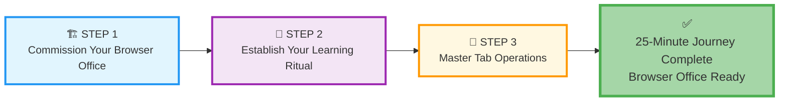
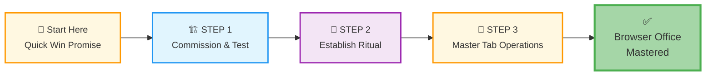

# 🗄️🤖 SQL & GenAI Course
**🎯 Quality Education for Anyone, Anywhere, Anytime — 💫 with Comfort, Convenience at no Cost**

## 📘 **TECHNICAL GUIDE: Setup for Levels 1 & 2**
---

## 🎯 **Quick Win Promise**

In the next **25 minutes**, you'll set up a complete, professional learning environment, master your daily workflow, and run your first SQL query—no software installations, just your browser. By following this guide, you'll be ready to start Module 1 today.

---

## 📋 **Prerequisites & Quick Checklist**

**Before you begin your 25-minute journey:**
- [ ] **Computer:** Any device with a modern web browser (Chrome, Firefox, Edge, Safari)
- [ ] **Internet connection:** Stable connection for initial setup
- [ ] **Email ID** for Free GitHub Account Creation (if you don't have a GitHub account)
- [ ] **The same email ID** can be used for AI Configuration

**Total setup time:** 25 minutes or less → First SQL query today!

---

## 🏢 **The Browser Office: Your Universal Launchpad**

**🚀 Kickstart: Any Computer, Any Browser, Anytime.**  
**🌍 Destination: Any country, Any city, Any Platform.**

### **📋 The Standard Four-Tab Setup (Levels 1 & 2)**
The Browser Office transforms any computer with a browser into a complete learning environment—no installations, universally accessible.

| Tab | Purpose | Tools & Examples | Keyboard Shortcut |
| :--- | :--- | :--- | :--- |
| **1: The Map** | Learning content & navigation | Course Repository (GitHub) | `Ctrl+1` / `Cmd+1` |
| **2: The Factory** | Hands-on practice | SQLite Online | `Ctrl+2` / `Cmd+2` |
| **3: The Consultant** | AI assistance & explanations | ChatGPT, Claude, Gemini | `Ctrl+3` / `Cmd+3` |
| **4: The Vault** | Progress tracking & portfolio | GitHub Web, notes | `Ctrl+4` / `Cmd+4` |

---

## ⏱️ **Step-by-Step: The 25-Minute Journey**

Your complete setup is a clear, three-phase journey designed for maximum efficiency. This flow ensures you build your workspace, internalize the workflow, and understand the rules—transforming your browser into a professional learning command center in under half an hour.

**The Three Phases of Your Setup:**

1.  **🏗️ STEP 1: Commission Your Browser Office**
    This is the **physical/digital build**. You will open and configure each of the four tabs (The Map, Factory, Consultant, Vault) and validate that they work together through the Module 0 ritual. This is where you assemble your tools.

2.  **🔄 STEP 2: Establish Your Learning Ritual**
    This is the **workflow internalization**. Once the tools are built, you learn the daily pattern of moving between them. This phase turns the conscious setup steps into an unconscious, repeatable workflow—your professional learning habit.

3.  **🎯 STEP 3: Master Tab Operations**
    This is the **rule mastery**. You will learn the specific purpose, operation mode, and "save rules" for each tab. This knowledge prevents confusion and ensures you use each tool effectively, knowing what to do where and why.

**Follow these steps in sequence.** Each phase builds on the previous one, culminating in a fully operational Browser Office and a mastered workflow.

---

## 🚀 **Your Setup Navigation Hub**

### **Complete Your 25-Minute Journey**

Follow this exact sequence to transform your browser into a professional learning environment:

### **📋 Setup Journey Checklist**

- [ ] **STEP 1: Commission Your Browser Office** - [Open STEP 1 Guide](./STEP1_COMMISSION_BROWSER_OFFICE.md)
  - Configure all four browser tabs (Map, Factory, Consultant, Vault)
  - Complete Module 0 validation ritual
  - Prove your Browser Office works

- [ ] **STEP 2: Establish Your Learning Ritual** - [Open STEP 2 Guide](./STEP2_ESTABLISH_LEARNING_RITUAL.md)
  - Internalize the four-tab workflow
  - Create your daily learning pattern
  - Turn conscious steps into automatic habits

- [ ] **STEP 3: Master Tab Operations** - [Open STEP 3 Guide](./STEP3_MASTER_TAB_OPERATIONS.md)
  - Learn each tab's specific rules and purposes
  - Master "save rules" for work preservation
  - Prevent common workflow errors

### **Individual Tab Setup Guides**
If you need to reconfigure a specific tab, access its dedicated guide:

| Tab | Purpose | Setup Time | Guide |
| :--- | :--- | :--- | :--- |
| **1: The Map** | Course navigation & materials | 2 minutes | [Tab 1 Setup Guide](./1-github_setup_tab1.md) |
| **2: The Factory** | SQL practice environment | 5 minutes | [Tab 2 Setup Guide](./2-sqlite_setup_tab2.md) |
| **3: The Consultant** | AI learning partner | 3 minutes | [Tab 3 Setup Guide](./3-genai_api_setup_tab3.md) |
| **4: The Vault** | Progress portfolio | 5 minutes | [Tab 4 Setup Guide](./4-github_setup_tab4.md) |

---

## 🎯 **The 25-Minute Journey Visualized**

See your complete transformation from setup to mastery:

```mermaid
flowchart LR
    Start["<span style='font-size:14px'>🎯 Quick Win Promise<br/>Ready in 25 minutes</span>"]
    
    Step1["<span style='font-size:12px'>🏗️ STEP 1<br/>Commission</span>"]
    Step1a["<span style='font-size:10px'>Tab 1: The Map<br/>2 min</span>"]
    Step1b["<span style='font-size:10px'>Tab 2: The Factory<br/>5 min</span>"]
    Step1c["<span style='font-size:10px'>Tab 3: The Consultant<br/>3 min</span>"]
    Step1d["<span style='font-size:10px'>Tab 4: The Vault<br/>5 min</span>"]
    Step1e["<span style='font-size:10px'>Module 0<br/>10 min</span>"]
    
    Step2["<span style='font-size:12px'>🔄 STEP 2<br/>Establish Ritual</span>"]
    Step3["<span style='font-size:12px'>🎯 STEP 3<br/>Master Tab Operations</span>"]
    
    Complete["<span style='font-size:14px'>✅ Complete<br/>Browser Office Mastered</span>"]
    
    Start --> Step1
    Step1 --> Step1a --> Step1b --> Step1c --> Step1d --> Step1e
    Step1e --> Step2 --> Step3 --> Complete
    
    style Start fill:#fff8e1,stroke:#ff9800,stroke-width:2px
    style Step1 fill:#e1f5fe,stroke:#2196f3,stroke-width:2px
    style Step1a fill:#e1f5fe
    style Step1b fill:#e1f5fe
    style Step1c fill:#e1f5fe
    style Step1d fill:#e1f5fe
    style Step1e fill:#e1f5fe
    style Step2 fill:#f3e5f5,stroke:#9c27b0,stroke-width:2px
    style Step3 fill:#fff8e1,stroke:#ff9800,stroke-width:2px
    style Complete fill:#a5d6a7,stroke:#4caf50,stroke-width:3px
```

**Total Time:** 25 minutes → **Result:** Professional Browser Office ready for Level 1

---

## 📚 **Quick Philosophy**

### **The Foundation First Approach**
This setup implements our core **"Foundation first, AI Next"** philosophy:

- **Two Databases Purpose:** We use **`training_institution_sample.db`** for demonstrations ("watch me") and **`level1_estore_basic.db** for practice ("now you do it"). This separation prevents confusion and reinforces learning across domains.
- **Strategic AI Integration:** The **Student Mode prompt** transforms your AI into a Socratic tutor, ensuring you build genuine problem-solving skills before using AI for code generation.
- **Cognitive Separation:** Different browser tabs for different cognitive modes (learning, executing, consulting, documenting) train professional work patterns.

---

## 💎 **DESIGNER'S PERIGON**
### **Your First Conversation with the Course Designer**

**Hello, Future Data Professional.**

I'm speaking to you directly because this moment matters. You're not just setting up software—you're **commissioning your professional workspace**.

**What You've Just Built Isn't Technical, It's Psychological:**

The Browser Office trains your brain for **focused, professional work**. Each tab creates a mental compartment:
- **Tab 1** = Learning mode (absorb)
- **Tab 2** = Execution mode (do)  
- **Tab 3** = Consultation mode (think)
- **Tab 4** = Documentation mode (preserve)

**This separation is deliberate.** It prevents the cognitive chaos of having 47 tabs open and not knowing what's what. You now have **clarity through compartmentalization**.

### **🎯 Why This Setup Method Works:**

**Most courses start with "install this, configure that." We started with workflow psychology because:**

- **The right environment creates the right mindset** – Your physical/digital workspace shapes how you think and learn
- **Consistent rituals build genuine skill** – Not sporadic effort, but systematic practice creates lasting competence
- **Professional tools train professional thinking** – Using tools intentionally develops the mental patterns of experts
- **Foundation first prevents hallucination of competence** – You build real skills before using AI acceleration
- **Cognitive separation reduces mental load** – Dedicated tabs for different thinking modes optimize learning efficiency

**What Other Courses Miss:** They teach SQL. We're teaching **how to think about data**.

---

### **🏆 THE CRAFTING VISION**

Your **Tab 1: The Map** comprises instructional gems from a 19-year pedagogical journey, collated with the most valuable, proven, and effective teaching insights, strategies, and "pearls of wisdom."

**The Four-Step Crafting Process:**

1. **Collect the gemstone** from Tab 1 one-at-a-time and assemble it at Tab 2 - The Factory (think of the Factory as your crafting bench).
2. **Discuss with Tab 3 - The Consultant** about polishing the gemstone to a high shine.
3. **Polish and Package** the gemstone at Tab 2 - The Factory.
4. **Preserve it safely** in Tab 4 - The Vault.

**Repeat this process** in your learning journey from Modules 1 to 6. You will Design, Craft and Create exquisite and priceless jewelry with these gemstones in your project module and showcase it in your portfolio for your employers.

**The Transformational Journey:**
- **Raw Materials:** Foundational concepts (Tab 1)
- **Crafting Bench:** Practical application (Tab 2)
- **Master Guidance:** Refinement & quality control (Tab 3)
- **Secure Showcase:** Portfolio preservation (Tab 4)

**Result:** A complete collection of professionally polished skills ready for enterprise deployment. 

**The Factory is COMMISSIONED!**  
**The master CONSULTANT is waiting!**  
**Now begin your Treasure hunt from Level 1! 🏢💎✨**

---

## 🎯 **Your Complete Setup Journey**

**The Map - Positioned**  
**The Factory - Production Ready**  
**The Consultant - On Board**  
**The Vault - Assembled**  
**Workflow - Streamlined and Optimized**  
**Browser Office - Fully functional and in top gear**  
**The Learning Journey - Ready to Commence**

```mermaid
flowchart LR
    A["<span style='font-size:18px'>✅ Tab 1<br/>The Map</span>"]
    B["<span style='font-size:18px'>✅ Tab 2<br/>The Factory</span>"]
    C["<span style='font-size:18px'>✅ Tab 3<br/>The Consultant</span>"]
    D["<span style='font-size:18px'>✅ Tab 4<br/>The Vault</span>"]
    E["<span style='font-size:18px;line-height:1.2;padding:8px'>✅ Workflow<br/>mastered</span>"]
    F["<span style='font-size:18px;line-height:1.2;padding:8px'>🏢 Browser Office<br/>top gear</span>"]
    G["<span style='font-size:18px;line-height:1.2;padding:8px'>🚀 Level1<br/>Begins</span>"]

    A --> B --> C --> D --> E --> F --> G

    style A fill:#fff8e1,stroke:#4caf50,stroke-width:3px
    style B fill:#e1f5fe,stroke:#4caf50,stroke-width:3px
    style C fill:#f3e5f5,stroke:#4caf50,stroke-width:3px
    style D fill:#e8f5e8,stroke:#4caf50,stroke-width:3px
    style E fill:#a5d6a7,stroke:#4caf50,stroke-width:3px
    style F fill:#ffcc80,stroke:#4caf50,stroke-width:3px
    style G fill:#a5d6a7,stroke:#4caf50,stroke-width:3px,color:#1b5e20
```

**Progress:** ✓ Tab 1 complete • ✓ Tab 2 complete • ✓ Tab 3 complete • ✓ Tab 4 complete • ✓ Workflow mastered • ✓ Browser Office operational

---
## 🆘 **Comprehensive Troubleshooting & Support**

### **When You Need Help**
Even with perfect setup, you might encounter challenges. Here's your tiered support system:

#### **1. First Line: Quick Self-Help**
**Most issues (90%) are solved quickly with these resources:**

- **🛠️ [Complete Troubleshooting Guide](./TROUBLESHOOTING_GUIDE.md)** – Every common issue with step-by-step solutions
  - Tab 1: GitHub problems
  - Tab 2: SQLite Online issues  
  - Tab 3: AI platform challenges
  - Tab 4: Portfolio setup questions
  - Cross-tab workflow problems

- **🎯 [STEP 3: Master Tab Operations](./STEP3_MASTER_TAB_OPERATIONS.md)** – Advanced techniques and best practices
  - Professional workflows
  - Efficiency optimizations
  - Mastery-level strategies

#### **2. Second Line: Course Resources**
If the troubleshooting guide doesn't solve your issue:

1. **Review the specific setup guide** for that tab
2. **Check the course community/forums** (if available)
3. **Re-examine the error messages** – they often contain the solution

#### **3. Mental Reset Strategy**
When stuck for more than 15 minutes:
1. **Close everything** – all browser tabs
2. **Take a 5-minute break** – walk away physically
3. **Start fresh** – reopen tabs in sequence (Tab 1 → 2 → 3 → 4)
4. **Follow the validation steps** in each guide

---

## 🚀 **YOUR BROWSER OFFICE IS READY!**

### **✅ Setup complete and workflow mastered?**

# [▶️ **BEGIN LEVEL 1 NOW!**](../Level-1-beginner/README.md)

**Your transformation starts today:** You're not just learning SQL—you're developing a **professional mindset** that will serve you through evolving technologies and career changes.

**Remember:** The Browser Office isn't just opening tabs—it's creating a **professional workspace** that trains your brain for focused learning. Focus on **learning SQL** and building your projects.

---

*Part of our mission for 🎯 Quality Education for Anyone, Anywhere, Anytime — 💫 with Comfort, Convenience at no Cost.*

**Technical Note:** All setup is browser-based. No software installations required. Works on any device with internet access.

**Your Browser Office is ready for business! 🏢**