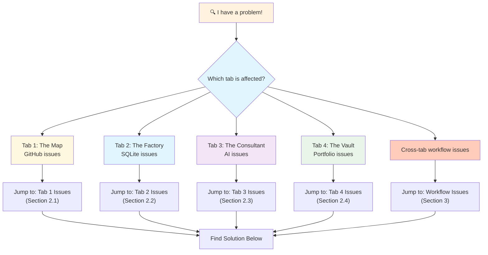
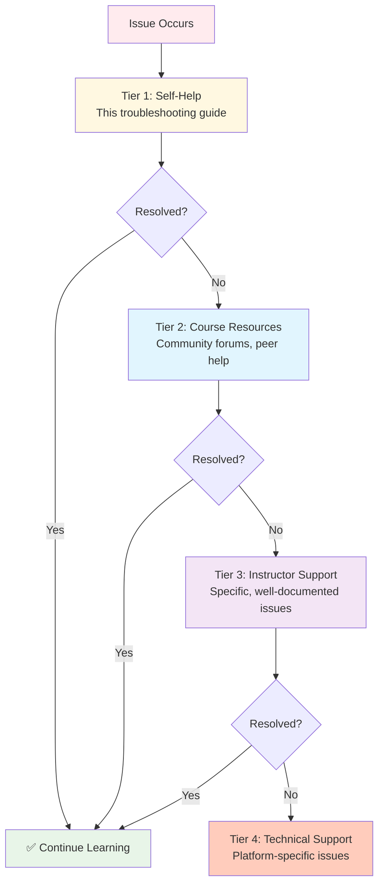

# 🗄️🤖 SQL & GenAI Course
**🎯 Quality Education for Anyone, Anywhere, Anytime — 💫 with Comfort, Convenience at no Cost**

# 🛠️ **Browser Office Troubleshooting Guide**
---

## 🎯 **Purpose of This Guide**
This guide serves as your **comprehensive problem-solving resource** for the Browser Office setup and daily workflow. Use it when you encounter issues during setup, practice, or portfolio building.

**When to Use This Guide:**
- ❌ **Setup Issues:** Something isn't working during initial configuration
- ❌ **Workflow Problems:** Your daily learning ritual feels broken
- ❌ **Tool Malfunctions:** SQL, AI, or GitHub tools aren't behaving as expected
- ❌ **Confusion:** You're stuck and not sure what to do next

**Guiding Principle:** *Most issues have simple solutions. Follow the diagnostic flow to find yours quickly.*

---

## 🔍 **Quick Diagnosis Flowchart**



---

## 2. **Tab-Specific Issues**

### 2.1 **Tab 1: The Map (GitHub) Issues**

#### **Common Setup Problems**

| Issue | Symptoms | Solution | Prevention Tips |
| :--- | :--- | :--- | :--- |
| **"Fork button isn't showing!"** | No Fork button on repository page | 1. **Ensure signed into GitHub** (check top-right corner)<br>2. **Already forked?** Button won't appear if viewing your fork<br>3. **Check URL:** If it shows `your-username/repo-name`, you're already in your fork | Always start from original course repository URL |
| **"I forked to wrong account!"** | Repository under wrong GitHub account | 1. **Delete the fork:** Go to your fork → Settings → Danger Zone → Delete<br>2. **Navigate to original** course repository<br>3. **Fork again** to correct account | Double-check which account is active before forking |
| **"Repository looks different!"** | Missing folders, different file structure | 1. **Check URL:** Ensure it includes *your* username<br>2. **You might be viewing** original repository<br>3. **Refresh page** (Ctrl+F5 for hard refresh)<br>4. **Clear browser cache** if persistent | Bookmark your fork URL immediately after creating |
| **"Can't find specific files!"** | Search returns no results, files missing | 1. **Use GitHub file finder:** Press `t` while in repository<br>2. **Check path:** Ensure in correct folder<br>3. **Files in different branch?** Check branch selector (top-left)<br>4. **Case sensitivity:** GitHub search is case-sensitive | Navigate manually through folder structure first |
| **"Do I need local Git?"** | Confusion about Git installation | **Answer:** No. GitHub Web provides everything needed for this course. Local Git is optional for advanced users who want offline access or more control. | Focus on GitHub Web interface for all course work |

#### **Advanced GitHub Issues**

| Issue | Solution |
| :--- | :--- |
| **"GitHub is blocked at my school/work!"** | 1. Try GitHub Desktop app (if allowed)<br>2. Download repository as ZIP from GitHub<br>3. Use alternative Git service (GitLab, Bitbucket) with imported repository |
| **"I accidentally deleted my fork!"** | 1. Re-fork from original repository<br>2. Contact instructor if you had unique work (unlikely in setup phase) |
| **"GitHub is slow/unresponsive!"** | 1. Check internet connection<br>2. Try during off-peak hours<br>3. Use GitHub Desktop for local operations<br>4. Clear browser cache |

---

### 2.2 **Tab 2: The Factory (SQLite Online) Issues**

#### **Database Loading Problems**

| Issue | Symptoms | Solution | Notes |
| :--- | :--- | :--- | :--- |
| **"File won't upload!"** | Drag & drop does nothing, no error messages | 1. **Try menu method:** "File" → "Open DB"<br>2. **Check file type:** Must be `.db` or `.sqlite`<br>3. **File size:** Under 50MB usually works<br>4. **Browser issue:** Try Chrome/Firefox<br>5. **Alternative site:** Use [sqliteviewer.app](https://sqliteviewer.app/) | Some organizations block SQLite Online |
| **"Page refresh reset database!"** | Tables disappear after refresh, back to empty interface | **This is normal behavior.** SQLite Online loads fresh session on refresh.<br>**Solution:**<br>1. Before refresh: **"File" → "Save DB"**<br>2. After refresh: Re-upload saved file<br>3. **Better:** Keep tab open, don't refresh | Consider this feature, not bug - ensures clean workspace |
| **"Database loads but no tables!"** | Left panel says "Database" but no tables visible | 1. **Wait 10-15 seconds** - large databases take time<br>2. **Expand database** (click arrow next to "Database")<br>3. **Check file:** Ensure it's a valid SQLite database<br>4. **Try different browser** | Some databases have no tables (rare) |

#### **Query Execution Problems**

| Issue | Symptoms | Solution |
| :--- | :--- | :--- |
| **"Query results not showing!"** | Empty results panel, no error messages | 1. **Database loaded?** Check left panel for tables<br>2. **Syntax errors:** Missing semicolon, misspelled keywords<br>3. **Table/column names:** Case-sensitive, check exact names<br>4. **No data:** Query might return empty set legitimately |
| **"Error: no such table!"** | Red error message about missing table | 1. **Check spelling:** Exact table name from left panel<br>2. **Database correct?** Might have wrong database loaded<br>3. **Refresh table list:** Sometimes out of sync |
| **"Website slow/unresponsive!"** | Laggy interface, timeouts, freezing | 1. **Check internet**<br>2. **Alternative:** [SQL Fiddle](http://sqlfiddle.com/) with SQLite backend<br>3. **Reduce load:** Close other browser tabs<br>4. **Clear cache** |
| **"Can't type in SQL editor!"** | Editor unresponsive, won't accept input | 1. **Click inside editor** - sometimes loses focus<br>2. **Refresh page** (save work first)<br>3. **Browser issue:** Try different browser |

#### **SQL-Specific Issues**

| Issue | Common Causes | Solution |
| :--- | :--- | :--- |
| **"Syntax error near..."** | Missing commas, parentheses, semicolons | 1. **Check closing:** Every `(` needs `)`, every `'` needs closing `'`<br>2. **Commas in lists:** After each item except last<br>3. **Semicolon:** End each statement with `;` |
| **"Query runs forever!"** | Infinite loop, missing WHERE clause | 1. **Add LIMIT:** `SELECT * FROM big_table LIMIT 10;`<br>2. **Check conditions:** Ensure WHERE clause is specific<br>3. **Cancel:** Refresh page (loses unsaved work) |
| **"Wrong data returned!"** | Logical error in query | 1. **Test parts:** Run subqueries separately<br>2. **Check joins:** Ensure correct join conditions<br>3. **Verify data:** Look at raw table data first |

---

### 2.3 **Tab 3: The Consultant (AI Platform) Issues**

#### **Critical: AI Not Following Instructions**

| Issue | Symptoms | Immediate Fix | Long-term Solution |
| :--- | :--- | :--- | :--- |
| **"AI writes full code in Modules 1-4!"** | Provides complete SQL solutions instead of guidance | 1. **Remind it:** "Remember Student Mode. Guide me to build this myself."<br>2. **Repaste prompt:** Copy Student Mode prompt again<br>3. **Start new chat** with prompt as first message | Switch to **Claude** (best at constraint-following) |
| **"AI gives wrong SQL syntax!"** | SQL doesn't work in SQLite, suggests other DB syntax | Add to every question: *"Please use SQLite syntax only."*<br>Specify: "This is for SQLite, not MySQL/PostgreSQL." | Save this as a standard prefix in your prompts |
| **"AI hallucinates information!"** | Provides incorrect facts, made-up functions | 1. **Double-check** against course materials (Tab 1)<br>2. **Ask for sources:** "Can you cite where this syntax is documented?"<br>3. **Verify with official SQLite docs** | Use AI for guidance, not as primary source of truth |
| **"AI forgets context!"** | Doesn't remember earlier in conversation | 1. **Re-paste key context** every few messages<br>2. **Use platforms** with larger context windows (Claude 100K, GPT-4)<br>3. **Keep conversations short and focused** | Copy important context into Tab 4 for reference |

#### **Platform-Specific Solutions**

**ChatGPT Specific Issues:**
| Issue | Solution |
| :--- | :--- |
| **"Forgets Student Mode between sessions!"** | Use **Custom Instructions**: Settings → Custom Instructions → Add: "Always act as a Socratic tutor for SQL learning" |
| **"Message limit reached!"** | Free tier: 40 messages/3 hours. Wait or use another platform temporarily |
| **"GPT-4 not available!"** | Use GPT-3.5 (still good for SQL basics) or switch to Claude |

**Claude Specific Issues:**
| Issue | Solution |
| :--- | :--- |
| **"Attachment limit reached!"** | Free: 5 files/day. Plan attachments strategically |
| **"100K context not working!"** | Paste text directly instead of attaching when possible |
| **"Claude.ai blocked!"** | Try [poe.com](https://poe.com) which offers Claude |

**Gemini Specific Issues:**
| Issue | Solution |
| :--- | :--- |
| **"Quality varies dramatically!"** | Regenerate response multiple times, best one often appears |
| **"Google login issues!"** | Try incognito mode or different Google account |
| **"Not following constraints!"** | Gemini needs more explicit, repeated instructions |

#### **Effective Prompt Engineering**

**When AI isn't helping:**
1. **Be more specific:** Instead of "Help with JOINs" → "Explain INNER JOIN vs LEFT JOIN with student/courses example"
2. **Provide context:** Paste your table structure first
3. **Show your attempt:** "I tried this: [code]. Got this error: [error]. What's wrong?"
4. **Ask for steps:** "What are the logical steps to solve this problem?"
5. **Request examples:** "Show me 2-3 similar but different examples"

**Pro Tip:** Create a "context header" to paste at start of each session:
```
CONTEXT: I'm learning SQL with SQLite. I have tables: students(id,name), courses(id,title), enrollments(student_id,course_id). I'm in Modules 1-4 - please guide, don't give full code.
```

---

### 2.4 **Tab 4: The Vault (GitHub Portfolio) Issues**

#### **Repository Creation Problems**

| Issue | Symptoms | Solution | Prevention |
| :--- | :--- | :--- | :--- |
| **"Can't create repository!"** | Create button disabled, "name already exists" error | 1. **Signed in?** Check GitHub login<br>2. **Name exists?** Try `my-sql-journey-2`<br>3. **Special chars?** Use only letters, numbers, hyphens<br>4. **Organization?** Ensure creating in your account, not org | Choose unique name, check availability first |
| **"Public vs Private dilemma!"** | Uncertainty about visibility settings | **Recommendation:** **Public** for learning portfolios. Shows transparency, allows sharing with employers. Private only for sensitive data. | You can change visibility later: Settings → Danger Zone |
| **"Wrong license selected!"** | Want to change from MIT to another license | 1. **Create `LICENSE` file** with desired license text<br>2. **GitHub recognizes** common licenses automatically<br>3. Or delete and recreate repository (loses any commits) | MIT is standard for open learning portfolios |

#### **Folder Structure Problems**

| Issue | Symptoms | Solution |
| :--- | :--- | :--- |
| **"Folder appears as file!"** | `notes` instead of `notes/` | GitHub Web requires **trailing slash** to create folders:<br>When creating: type `notes/` not `notes`<br>**Fix:** Delete file, recreate as `foldername/` |
| **"Made mistake in structure!"** | Wrong folder names, misplaced files | 1. **GitHub Web:** Navigate to file → Edit (pencil icon) → Change path in filename field<br>2. **Or:** Delete and recreate correctly<br>3. **Advanced:** Use GitHub Desktop for easier file management |
| **"Can't upload multiple files!"** | Only single file upload option | 1. **GitHub Web limitation:** Upload files individually or as ZIP<br>2. **Better:** Use GitHub Desktop for bulk operations<br>3. **Or:** Create files directly in GitHub interface |
| **"Folder not showing contents!"** | Empty folder after creation | 1. **Add a file** to folder (even `README.md` or `.gitkeep`)<br>2. **Git doesn't track** empty folders<br>3. **Standard practice:** Add a small file to each folder |

#### **Commit & Documentation Issues**

| Issue | Solution |
| :--- | :--- |
| **"Don't know what to document!"** | Start with: 1) What you learned 2) Challenges faced 3) Solutions found 4) Questions remaining |
| **"Commit messages unclear!"** | Use format: `Verb + what + why`<br>Example: "Add Module 1 exercises with explanations to demonstrate SELECT proficiency" |
| **"Portfolio looks messy!"** | 1. **Consistent structure** across folders<br>2. **Clear filenames:** `module-1-select-exercises.md`<br>3. **Regular cleanup:** Monthly portfolio review |
| **"How often to commit?"** | **Ideal:** Daily. **Minimum:** 3-5 times/week. **Key:** Regular, meaningful commits |

---

## 3. **Cross-Tab Workflow Issues**

### 3.1 **Module 0 Validation Ritual Problems**

#### **Ritual Step Failures**

| Step | Common Failure | Solution |
| :--- | :--- | :--- |
| **Tab 4 → Tab 1** | Can't find Student Mode prompt file | 1. **Exact path:** `Level-1-beginner/STUDENT_MODE_PROMPT_LEVEL1.md`<br>2. **Use search:** Press `t` in repository, type "student mode"<br>3. **Alternative:** Use prompt from troubleshooting guide |
| **Tab 1 → Tab 3** | Prompt copy fails, formatting issues | 1. **Use "Raw" button** on GitHub file page<br>2. **Select all** (Ctrl+A) then copy (Ctrl+C)<br>3. **Paste as first message** in new AI chat |
| **Tab 3 Configuration** | AI doesn't acknowledge Student Mode | 1. **Wait for response** - some AIs process silently<br>2. **Ask directly:** "Please confirm you're in Student Mode"<br>3. **Test with question:** "How do I view table structure?" |
| **Tab 3 → Tab 2** | Query doesn't work, table not found | 1. **Database loaded?** Check left panel in SQLite Online<br>2. **Exact query:** `SELECT * FROM students LIMIT 3;`<br>3. **Case sensitive:** `Students` vs `students` |
| **Tab 2 → Tab 3** | AI gives code instead of guidance | **Critical:** If AI gives full `SELECT * FROM students;` code, it's not in Student Mode. Restart Tab 3 setup. |
| **Tab 3 → Tab 4** | Documentation feels redundant | **Embrace it:** This documentation habit is the skill being built. Future you will thank present you. |

#### **Complete Ritual Failure**
**If Module 0 completely fails:**
1. **Close all tabs** - clean slate
2. **Follow STEP 1 guide** from beginning
3. **Validate each tab individually** before connecting them
4. **Slow down** - ritual should take 15-20 minutes when learning

### 3.2 **Daily Learning Ritual Issues**

#### **Workflow Efficiency Problems**

| Issue | Symptoms | Solution |
| :--- | :--- | :--- |
| **"Too much tab switching!"** | Constant Ctrl+1,2,3,4 feels inefficient | 1. **Batch operations:** Do all Tab 1 reading first<br>2. **Prepare materials:** Copy multiple instructions at once<br>3. **Use multiple monitors** if available<br>4. **It gets faster** - first week is slowest |
| **"Losing unsaved work!"** | SQL queries, AI conversations lost between sessions | 1. **Tab 2:** Always `File → Save DB` before closing<br>2. **Tab 3:** Copy valuable conversations to Tab 4 immediately<br>3. **Tab 4:** Commit at end of every session |
| **"Forgetting where I was!"** | Multiple modules in progress, lose track | 1. **Tab 4 as tracker:** Update README.md with current status<br>2. **Browser bookmarks:** Bookmark specific exercise pages<br>3. **Physical notes:** Quick paper notes for today's focus |

#### **Motivation & Consistency Issues**

| Issue | Psychological Solution | Practical Solution |
| :--- | :--- | :--- |
| **"Ritual feels tedious!"** | Recognize: **Tedium today = automaticity tomorrow** | Set timer: 25-minute focused sessions |
| **"Progress feels slow!"** | Learning curves are steepest at beginning | Track small wins: Each query, each commit, each understanding |
| **"Overwhelmed by four tabs!"** | Each tab serves different cognitive function | Master one tab at a time before integrating |

---

## 4. **Platform & Environment Issues**

### 4.1 **Browser-Specific Solutions**

#### **Chrome/Edge (Chromium-based)**
| Issue | Solution |
| :--- | :--- |
| **"Too many tabs, can't find SQL tabs!"** | Use **Tab Groups**: Right-click tab → Add to new group → Name "SQL Course" |
| **"Performance issues with many tabs!"** | Enable **Memory Saver**: Settings → Performance → Memory Saver |
| **"SQLite Online not working!"** | Check **Extensions**: Some ad-blockers break SQLite Online. Try disabling temporarily. |

#### **Firefox**
| Issue | Solution |
| :--- | :--- |
| **"Container tabs confusing!"** | Use regular tabs for course (containers are for separate logins) |
| **"Tree Style Tab overwhelming!"** | Disable or simplify if using this extension |
| **"Pinned tabs disappearing!"** | Firefox has occasional pinned tab bugs. Update to latest version. |

#### **Safari**
| Issue | Solution |
| :--- | :--- |
| **"Tab groups different than Chrome!"** | Safari's implementation works but has different shortcuts |
| **"SQLite Online compatibility!"** | Safari generally works but test early |
| **"Keyboard shortcuts different!"** | Cmd+1/2/3/4 instead of Ctrl+number |

### 4.2 **Device & Network Issues**

#### **Slow/Unreliable Internet**
| Strategy | Implementation |
| :--- | :--- |
| **Offline preparation** | Download all course materials (Tab 1 as ZIP) when online |
| **Text-based focus** | Work on SQL syntax without running queries when offline |
| **Batch online sessions** | Do all online work (AI queries, GitHub commits) in concentrated time |
| **Mobile hotspot backup** | Use phone as backup internet |

#### **Limited Device Access**
| Scenario | Strategy |
| :--- | :--- |
| **Public/library computers** | 1. Use portable browsers (if allowed)<br>2. Save all work to cloud (GitHub)<br>3. Use guest/incognito mode |
| **Multiple devices** | 1. GitHub syncs across devices<br>2. Save SQLite databases to cloud storage<br>3. Use same AI account across devices |
| **Mobile-only access** | **Not recommended** for main work. Use for review/reading only. |

#### **Operating System Issues**
| OS | Specific Considerations |
| :--- | :--- |
| **Windows** | Most compatible. Watch for antivirus blocking SQLite Online. |
| **macOS** | Excellent compatibility. Safari vs Chrome choice matters. |
| **Linux** | Great compatibility. May need to adjust browser permissions. |
| **ChromeOS** | Works well but limited offline capability. |

---

## 5. **Psychological & Learning Issues**

### 5.1 **Motivation & Mindset Challenges**

#### **Common Psychological Blocks**
| Block | Reframe | Action |
| :--- | :--- | :--- |
| **"I'm not a tech person"** | "I'm becoming a tech person through practice" | Focus on one small win daily |
| **"Everyone else gets it faster"** | "Everyone's journey is different; comparison steals joy" | Leave social media, focus on your progress |
| **"What if I fail?"** | "The only failure is stopping. Everything else is data." | Redefine "failure" as "learning what doesn't work" |
| **"This is too hard"** | "Hard now, easier later. Foundations take time." | Break into 15-minute chunks |

#### **Motivation Maintenance System**
1. **Daily win tracking:** One thing learned each day in Tab 4
2. **Progress visualization:** Chart your commits/learning hours
3. **Accountability:** Study buddy or public commitment
4. **Rewards:** Small rewards for consistency, not perfection

### 5.2 **Time Management & Focus Issues**

#### **Focus Strategies for Distracted Environments**
| Distraction Type | Solution |
| :--- | :--- |
| **Digital distractions** | 1. Website blockers during study time<br>2. Separate browser profile for learning<br>3. Phone in another room |
| **Environmental noise** | 1. Noise-cancelling headphones<br>2. Background focus music (instrumental)<br>3. Library/coffee shop change of scene |
| **Internal distraction** | 1. "Worry pad" - write distracting thoughts to address later<br>2. Pomodoro technique (25 min focus, 5 min break)<br>3. Mindfulness minute before starting |

#### **Time Management for Busy Schedules**
| Schedule Type | Strategy |
| :--- | :--- |
| **Full-time job + learning** | 1. 25 minutes before work<br>2. Lunch break review<br>3. 45 minutes after work<br>**Total:** ~1.5 hours daily |
| **Irregular schedule** | 1. **Minimum viable session:** 15 minutes<br>2. **Carry flashcards:** SQL syntax on phone<br>3. **Micro-learning:** One concept at a time |
| **Student schedule** | 1. Treat like a course: schedule specific times<br>2. Study groups for accountability<br>3. Integrate with academic schedule |

---

## 6. **Advanced & Edge Case Issues**

### 6.1 **Data Loss Prevention**

#### **Critical Backup Strategy**
| Data Type | Backup Method | Frequency |
| :--- | :--- | :--- |
| **SQLite databases** | `File → Save DB` + cloud backup (Google Drive, etc.) | After each significant change |
| **AI conversations** | Copy to Tab 4 `consultant-conversations/` | End of each session |
| **GitHub portfolio** | GitHub is already cloud backup | Commits auto-saved |
| **Local notes/files** | Sync to cloud storage | Daily |

#### **Disaster Recovery Plan**
**If you lose everything:**
1. **GitHub portfolio:** Still exists online
2. **SQL queries:** Recreate from portfolio documentation
3. **AI insights:** Partially in portfolio conversations
4. **Databases:** Download fresh from course repository

### 6.2 **Performance Optimization**

#### **Browser Performance**
| Issue | Optimization |
| :--- | :--- |
| **Multiple tabs slow** | 1. Close unrelated tabs<br>2. Use tab suspender extensions<br>3. Increase browser RAM allocation |
| **SQLite Online slow** | 1. Smaller database files when possible<br>2. Simpler queries during learning<br>3. Alternative: SQLite locally with DB Browser |
| **AI slow responses** | 1. Use faster models (GPT-4o > GPT-4)<br>2. Off-peak hours usage<br>3. Have multiple AI platforms ready |

#### **Learning Performance**
| Issue | Optimization |
| :--- | :--- |
| **Slow query writing** | 1. Create cheat sheet of common patterns<br>2. Use text expander for frequent syntax<br>3. Practice typing SQL without thinking |
| **Concept confusion** | 1. Create analogies that work for you<br>2. Teach concept to imaginary student<br>3. Draw diagrams of relationships |

### 6.3 **Accessibility Considerations**

| Need | Accommodation |
| :--- | :--- |
| **Visual impairments** | 1. Browser zoom (Ctrl+ +/-)<br>2. Screen readers work with GitHub Web<br>3. High contrast modes |
| **Motor control issues** | 1. Voice coding tools (limited for SQL)<br>2. Keyboard-only navigation practice<br>3. Custom keyboard shortcuts |
| **Cognitive differences** | 1. Extra time for rituals<br>2. More frequent breaks<br>3. Customized workflow adjustments |
| **English language learners** | 1. Translate key terms<br>2. Bilingual notes<br>3. Slower pace with concept mastery |

---

## 7. **When to Seek External Help**

### **Tiered Support System**



### **How to Ask for Help Effectively**

**Information to include:**
1. **Tab affected:** Which of the four tabs (or cross-tab)
2. **Exact error message:** Copy-paste, not paraphrase
3. **Steps to reproduce:** What you did, what happened
4. **Already tried:** What solutions from this guide you attempted
5. **Environment:** Browser, OS, device type

**Example good help request:**
```
Tab: 2 (The Factory)
Issue: "File won't upload to SQLite Online"
Error: No error, just nothing happens when I drag file
Steps: 1. Downloaded training_institution_sample.db 2. Dragged to SQLite Online window 3. Nothing happens
Tried: Menu method ("File → Open DB") - same result. Different browser (Chrome → Firefox) - same.
Environment: Windows 11, Chrome 120, file size 45KB
```

### **Community Support Etiquette**

1. **Search first:** Has this been asked before?
2. **Be specific:** Vague questions get vague answers
3. **Show effort:** "I tried X, got Y, expected Z"
4. **Give back:** Help others once you learn
5. **Follow up:** Report what worked

---

## 8. **Proactive Prevention & Maintenance**

### **Daily Habits to Prevent Issues**

| Habit | Time | Benefit |
| :--- | :--- | :--- |
| **Commit to Tab 4** | End of each session | Progress tracking, backup |
| **Save SQLite DB** | Before closing Tab 2 | Prevents data loss |
| **Copy AI insights** | During/after Tab 3 sessions | Knowledge preservation |
| **Bookmark useful pages** | As discovered | Faster future access |
| **Clear browser cache** | Weekly | Performance maintenance |

### **Weekly Maintenance Routine**

**Every Sunday (or start of week):**
1. **Review portfolio:** Look at week's commits, identify gaps
2. **Clean tabs:** Close unused tabs, organize tab groups
3. **Update README:** Current status, next week's goals
4. **Backup critical files:** Local copy of important databases
5. **Plan week:** Schedule learning sessions in calendar

### **Monthly Deep Maintenance**

**End of each month:**
1. **Portfolio review:** What skills developed? Evidence?
2. **Workflow audit:** What's working? What's frustrating?
3. **Tool evaluation:** Still right AI platform? Browser?
4. **Goal adjustment:** Based on progress, adjust next month
5. **Celebrate wins:** Acknowledge progress, no matter how small

---

## 🎯 **Success Mindset Reminder**

> **Most "problems" are actually learning opportunities in disguise.** Each troubleshooting experience builds your **debugging skills**—one of the most valuable abilities in tech. The struggle you feel today becomes the competence you demonstrate tomorrow.

**Remember:** This entire setup—the challenges, solutions, and workflow—is training you for **real professional work**. The ability to troubleshoot independently is worth as much as the SQL skills you're learning.

---

## 🔗 **Quick Reference Links**

| Resource | Purpose | Link |
| :--- | :--- | :--- |
| **GitHub Status** | Check if GitHub is down | [status.github.com](https://www.githubstatus.com/) |
| **SQLite Documentation** | Official SQLite reference | [sqlite.org/docs.html](https://www.sqlite.org/docs.html) |
| **Browser Office Setup** | Return to main setup guide | [TECHNICAL_GUIDE_L1L2.md](./TECHNICAL_GUIDE_L1L2.md) |
| **Tab Mastery Guide** | Advanced workflow techniques | [STEP3_MASTER_TAB_OPERATIONS.md](./STEP3_MASTER_TAB_OPERATIONS.md) |
| **Course Materials** | Main learning content | [Level-1-beginner/README.md](../Level-1-beginner/README.md) |

---

*Part of our mission for 🎯 Quality Education for Anyone, Anywhere, Anytime — 💫 with Comfort, Convenience at no Cost.*

**Troubleshooting Guide Version:** 1.0 | **Last Updated:** [Current Date]
**Need to update this guide?** Found a solution not listed here? Document it in your Tab 4 portfolio and consider sharing with the course community.


