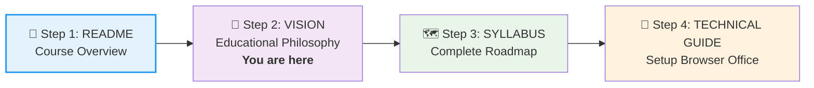

# 🗄️🤖 SQL & GenAI Course
**🎯 Quality Education for Anyone, Anywhere, Anytime — 💫 with Comfort, Convenience at no Cost**

## 🗺️ VISION: A Revolutionary Learning Architecture
---
## 👨‍🏫 **The Foundation: Nearly Two Decades of Educational Insight**

**Synthesizing 19 Years of Training & Academic Excellence**, this architecture solves the problem traditional courses ignore: **The gap between knowing syntax and owning a system.**

**The "Clairvoyant" Edge:** Identifying where learners struggle *before* they hit the wall.

> "I have observed thousands of learners fail at the same 'Invisible Walls.' This course provides the ladder *before* you reach the wall."

---

## 📖 **Why I'm Doing This**

After 19 years of teaching in classrooms, I realized my reach was limited to the students who could physically attend or afford courses. **GitHub allows me to share what I've learned with the entire world.**

Every person who learns to code is one more person who can:
- **Change their economic circumstances**
- **Build solutions for their community**
- **Teach others what they've learned**

**That's worth more than any paywall could ever give me.**

---

## 🧠 **The Learning Philosophy: Foundation First, AI Next**

**Building the Bridge to True Mastery** — We deliberately structure learning to ensure genuine skill development before introducing AI acceleration.

**The Deliberate Progression:**
- **Modules 1-4:** Master SQL fundamentals without AI code generation
- **Module 5:** Earn the right to use AI for intelligent acceleration
- **Module 6:** Integrate AI into complete professional workflows

**Why This Works:** Prevents dependency, builds genuine competence, and creates earned progression where AI tools feel like a reward, not a shortcut.

---

## 🏗️ **The Architecture: A Complete Educational Ecosystem**

### **The Solution: "Knowledge Expeditions"**
Built on **Bloom's Taxonomy**, moving from "Remembering" to "Creating." You become a **Leader, not a Soldier.**

```
sql-ai-course/                          # 🎯 DELIBERATE LEARNING ARCHITECTURE
├── Level-1-beginner/                   # 🆕 Structured foundation
├── Level-2-intermediate/               # 📈 Skill building
├── Level-3-advanced-paradigms/         # 🚀 Professional mindset
├── Projects/                           # 💼 Portfolio strategy
├── The-Career-Path/                    # 🏆 Professional Specializations
├── Setup/                              # ⚙️ Frictionless environment
└── Resources/                          # 📚 Curated tools
```

---

## 🔍 **Architectural Innovations (The Designer's Edge)**

### **1. The Browser Office Philosophy**
**🚀 Kickstart: Any Computer, Any Browser, Anytime.**  
**🌍 Destination: Any country, Any city, Any Platform.**

*Designed for zero-friction learning:* Your complete workspace transforms any computer with a browser into a professional learning environment. The Browser Office embodies our core principle of accessibility and represents the practical implementation of "Learning Anywhere, Anytime with Any Location."

**Conceptual Framework:**
- **Universal Accessibility:** Works on any device with a browser - no installations required
- **Professional Workflow:** Mirrors real-world development environments
- **Consistent Experience:** Same high-quality learning regardless of location or device
- **Cognitive Organization:** Structured tab system that trains professional habits

**The Four Essential Components:**
1. **The Map (Course Repository):** Navigation and learning materials
2. **The Factory (Practice Environment):** Hands-on SQL practice
3. **The Consultant (AI Co-pilot):** Intelligent assistance and guidance
4. **The Vault (Progress Portfolio):** Documentation and achievement tracking

**Level 3 Evolution:** Advanced courses evolve this framework with specialized tools and workflows, preparing learners for enterprise environments while maintaining the core accessibility principle.

---

## 🏡 **The Modern Learning Experience**

**Learn comfortably from home, at your convenient time, at no financial cost.**

### **🎯 The Educational Equalizer**
| Principle | What It Means for You |
| :--- | :--- |
| **🏠 Home Comfort** | No classrooms, no commutes. Learn where you're most productive. |
| **⏰ Your Schedule** | Midnight or midday. Learn when your brain is at its best. |
| **💰 Zero Financial Cost** | All tools have free tiers. No hidden fees or subscriptions. |
| **🌍 No Geographical Barriers** | Access from any country, any city, any village. |
| **📱 Device Flexibility** | Phone, tablet, laptop—whatever you have works. |

### **Why This Wins**
- **Focus on Learning**: Zero time wasted on environment troubleshooting.
- **Professional Preparation**: Work as modern developers do—in the browser.
- **Universal Access**: Learn from any computer, anywhere.
- **Inclusive Design**: Equal opportunity regardless of location, schedule, or budget.

**The Democratization of Education:** This architecture removes the traditional barriers to technical education—cost, location, time constraints, and technical prerequisites. Whether you're a parent learning after bedtime, a professional upskilling after work, or a student in a remote location, you have the same high-quality learning experience.

---

## 🌍 **Why Educational Equity Matters**

| Traditional SQL Courses Offer... | This Course Provides... |
| :--- | :--- |
| Cost $500-2000 | **Zero financial cost** |
| Require powerful computers | **Runs on any browser** |
| Assume stable, high-speed internet | **Resilient and flexible** |
| Ignore personal time constraints | **Learn on your schedule** |

**This course removes ALL barriers.**

---

### **2. AI as a "Co-Pilot," Not a "Cheat Code"**
*Preparing for the AI Era:* Collaboration from **Day 1**. You direct the AI as **Architect** of solutions.

**Phased AI Integration:**
- **Modules 1-4:** AI for concept explanations only (no code generation)
- **Module 5:** Intelligent acceleration with AI code generation and optimization
- **Module 6:** Full professional workflow integration

This deliberate progression ensures you build genuine skills before leveraging powerful AI tools.

### **3. The Platform-Unification Goal**
*Building Adaptable Professionals:* Syntax changes; logic doesn't. Master **Database Thinking** to pivot between platforms using our dual-dataset approach (training examples + hands-on practice databases).

**Multi-Database Strategy:**
- **Levels 1-2:** Master fundamentals with SQLite
- **Level 3:** Specialize in PostgreSQL, SQL Server, or become platform-agnostic

### **4. The "Porting & Reverse-Engineering" Antidote**
*Mastery Through Struggle:* Small exercises build skills; **meaningful challenges build mastery**.

### **5. The Professional Portfolio Strategy**
*Evidence of Value:* Build **HR Analytics, Supply Chain Platforms, Banking Systems**—tangible proof of business impact.

---

## ⏳ **The Measured Release: Commitment to Quality**

**Our phased approach ensures excellence:**

1.  **Phase 1**: Level 1 (Complete, tested, ready for learning)
2.  **Phase 2**: Levels 2-3 (Informed by your experience)
3.  **Phase 3**: Full ecosystem (All components integrated)

---

## 🤝 **Free Education Initiative**

**This course is completely free** as part of my commitment to making quality tech education accessible to everyone, regardless of their financial situation or geographic location.

### **If this course helps you:**
-   ⭐ **Star the repository**
-   📢 **Share it with others who might benefit**
-   💬 **Provide feedback to help improve it**
-   🌱 **Pay it forward** - help others on their learning journey

**No payment. No ads. No hidden costs. Just learning.**

---

## 🎓 **The Result: Your Professional Evolution**

We produce:
- **🏔️ PostgreSQL Mountaineers** who understand the database soul
- **⚡ MSSQL Strategists** who engineer for enterprise
- **🐋 Platform Navigators** who bridge disparate data oceans

---

## 🏆 **The Vision: Thoughtful Educational Design**

> **A carefully architected journey transforming beginners into adaptable, platform-agnostic database professionals.**

---

## 🚀 **GETTING STARTED: YOUR LEARNING PATH**

### **Recommended Navigation Sequence:**



### **Navigate Based on Your Needs:**
- **Understand the Philosophy** → [**VISION WITH MISSION**](VISION.md)
- **See the Complete Roadmap** → [**COMPLETE SYLLABUS**](SYLLABUS.md)
- **Prepare Your Browser Office Workspace** → [**TECHNICAL GUIDE**](Setup/TECHNICAL_GUIDE_L1L2.md)

*Use the links above to follow the recommended sequence or jump directly to what you need.*

---

*Part of our mission for 🎯 Quality Education for Anyone, Anywhere, Anytime — 💫 with Comfort, Convenience at no Cost.*

*Thoughtful design. Proven methods. Your professional evolution.*


